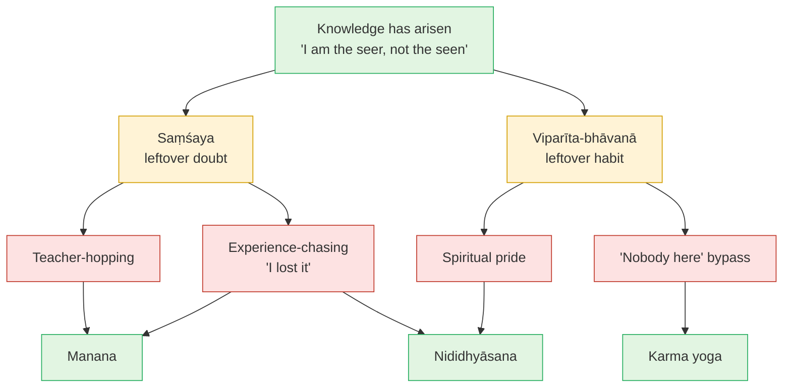

# Day 33 — Obstacles: Doubt, Habit, Bypass

> **Today's one idea:** Understanding doesn't end the struggle. Doubt (*saṃśaya*) and contrary habit (*viparīta-bhāvanā*) outlive it, and today they wear modern clothes — chasing experiences, using "nobody here" to dodge life, spiritual pride, teacher-hopping. Each is a known obstacle with a known remedy.
> **Reading time:** ~35 min · **Prereqs:** [Day 20](../../02-vicharana/days/day-20-shravana-manana-nididhyasana.md), [Day 31](./day-31-the-thought-that-ends-itself.md)
> **Primary source for today:** *Bhagavad Gītā* 6.33–45 (Arjuna on the restless mind and the one who falls short), with 4.40–42 on doubt, and Shankara's commentary — Swami Gambhirananda (trans.), Advaita Ashrama, 1984.
> **Before you start:** Without looking — *which link of yesterday's ten-link chain did you rate weakest, and which day repairs it? And what did the Dvaitin get right?*

---

## The hook (3 min)

Krishna has just finished teaching meditation — Gītā chapter 6, the steady lamp in a windless place. Arjuna doesn't say "wonderful". He says, roughly: *I don't see how this can last. The mind is restless, turbulent, strong and stubborn. Holding it seems as hard as holding the wind* (6.33–34).

Krishna doesn't contradict him. *Doubtless the mind is restless and hard to hold. But it is held by practice and dispassion* (6.35).

Then Arjuna asks the question every serious student eventually asks, usually at 3 a.m.: *what about the one who has faith, who sets out, but whose mind slips and who doesn't reach the end? Doesn't he lose both worlds and vanish, like a cloud torn apart?* (6.37–38).

Krishna's answer is one of the kindest lines in the Gītā: **न हि कल्याणकृत्कश्चिद्दुर्गतिं तात गच्छति** — "no one who does good, my friend, comes to a bad end" (6.40). Nothing done in this direction is lost (6.40–45).

Now a modern version. Imagine a student — call her Priya — writing to her teacher three weeks after a silent retreat: *"On day six it was obvious: no me, just open awareness. It lasted ten days. Now I'm back at work, irritable, and it's gone. I've lost it."*

Arjuna and Priya are asking the same question.

---

## Building the intuition (12 min)

### The old bus stop

Day 20 gave you a picture: you've moved house. You know the new address — no ignorance. You've checked the lease — no doubt. And yet, on Monday morning, your feet walk you to the old bus stop. That is *viparīta-bhāvanā*: habit running against what you know.

Now notice that there are at least four *wrong* ways to respond when you find yourself at the old bus stop:

1. **Panic.** *"I've forgotten where I live!"* You haven't. You just walked out of habit. Treating the slip as a loss of knowledge is **experience-chasing** — Priya's "I lost it".
2. **Philosophy.** *"Addresses are only conventions. Ultimately there's no house and no bus."* Perhaps — but you're now late for work and someone is waiting for you. This is the **"nobody here" bypass**: reaching for the highest standpoint so as not to deal with the one you're standing in.
3. **Pride.** *"At least I know my new address. Most people on this street don't even know they've moved."* That's **spiritual pride**: the knowledge has become a possession of the very person it was meant to see through.
4. **Moving again.** *"This house can't be right if I keep ending up at the old stop. I'll find a better one."* That's **teacher-hopping**: treating a habit problem as a problem with the address.

And the one right response is boring: notice you're at the old stop, smile, walk to the new one. Do it again tomorrow. That is *nididhyāsana*, with the remedies of Days 20–24 behind it.

### Why it isn't a failure

Each wrong response assumes something. Panic: knowledge is a feeling that drains away. Philosophy: knowledge licenses you to stop living. Pride: someone owns it. Moving: you need a different truth. Each misunderstands what was known — so stage-four obstacles aren't proof the teaching failed. They're the last hiding places of the old confusions.

---

## The formal picture (12 min)

### The two obstacles that outlive understanding

Recall [Day 20](../../02-vicharana/days/day-20-shravana-manana-nididhyasana.md)'s table. *Śravaṇa* removes ignorance (*ajñāna*). *Manana* removes doubt (*saṃśaya*). *Nididhyāsana* removes contrary habit (*viparīta-bhāvanā*). Once ignorance is gone it stays gone — you can't un-hear "you are the tenth" ([Day 4](../../01-shubheccha/days/day-04-the-tenth-man.md)). But doubt and habit can return, because they don't live in the understanding; they live in the mind that holds it.

The Gītā is blunt about doubt: *the ignorant, the faithless and the one whose nature is doubt are ruined; for the doubter there is neither this world nor the next, nor happiness* (4.40). The remedy is more knowing: *cut the doubt in your heart with the sword of knowledge, and stand up* (4.42, paraphrase). That's *manana*. For habit, 6.35: practice and dispassion. For the fear of failing, 6.40–45: no effort here is wasted; whoever falls short starts again where they left off.

### Why understanding doesn't finish the job

[Day 31](./day-31-the-thought-that-ends-itself.md): the sentence produces one thought-form of the undivided (*akhaṇḍākāra vṛtti*), which removes ignorance and then settles, like the kataka nut sinking with the mud. Two things follow. First, **the knowledge isn't a state to be kept** — if you expect the clearing-thought to persist as a feeling, its natural subsiding will look like a loss. Second, **the mud has its own history**: [Day 24](../../03-tanumanasa/days/day-24-vasanas-three-practices.md)'s *vāsanās* keep producing old reactions after knowledge has arisen. Hence Vidyāraṇya's three practices, grown together.

### The four modern forms, mapped

| Modern form | What it sounds like | Classical obstacle | The confusion underneath | Remedy |
| --- | --- | --- | --- | --- |
| **Experience-chasing** | "I had it on retreat and lost it." | *Saṃśaya* about what the knowledge is | Knowledge mistaken for a state ([Days 4](../../01-shubheccha/days/day-04-the-tenth-man.md), [23](../../03-tanumanasa/days/day-23-meditation-vs-knowledge.md)) | ***Manana*:** what exactly was lost — and was it seen? Then ***nididhyāsana*** without demanding the state |
| **"Nobody here" bypass** | "There's no one to feel guilty / grieve / apologise." | *Viparīta-bhāvanā* dressed as knowledge | Confusion of standpoints: a *pāramārthika* sentence spoken from *vyavahāra* ([Days 13](../../02-vicharana/days/day-13-mithya.md), [18](../../02-vicharana/days/day-18-ajativada.md)) | ***Karma yoga*** ([Day 21](../../03-tanumanasa/days/day-21-karma-yoga.md)): meet your duties, feel the feeling, make the apology |
| **Spiritual pride** | "I'm awake; most people aren't." | *Viparīta-bhāvanā* | *Adhyāsa* again: the knowledge credited to the ego ([Day 12](../../02-vicharana/days/day-12-adhyasa.md)) | ***Nididhyāsana*** on "who is proud?"; devotion and offering ([Day 22](../../03-tanumanasa/days/day-22-bhakti-inside-advaita.md)) |
| **Teacher-hopping** | "This teacher can't be right; the next one will give it to me." | *Saṃśaya* about the means of knowledge | Thinking a different door leads to a different room ([Day 30](./day-30-where-the-paths-converge.md)) | ***Manana*** with one teaching, consistently — Day 20's *śravaṇa* is *sustained* study |

**The bypass deserves a closer look**, because it harms other people. "Spiritual bypassing" is the psychotherapist John Welwood's phrase ("Principles of Inner Work", *Journal of Transpersonal Psychology*, 1984) for using spiritual ideas to avoid unfinished emotional and practical business. Advaita's diagnosis is precise. *Kārikā* 2.32 — *no one bound, no one seeking* — is true from the highest standpoint (Day 18). But whoever says "there's no one here to apologise" is standing in *vyavahāra*, with a name, a body and a hurt partner, borrowing a sentence from a level they aren't speaking from. Day 18's dreaming man said "this tiger is unreal" while still running; the bypasser says it about the tiger he has just set loose on someone else.

The knower keeps the levels straight. The Gītā's model is Krishna himself: nothing to gain, yet he acts for the holding-together of the world (3.22–25). Knowledge removes *ownership* of action, not *care* in it.

**What doesn't count as an obstacle: feelings.** Monday irritation is seen, like any content (Day 6); knowledge doesn't require its absence. Priya's irritability isn't the obstacle. Her conclusion "I lost it" is.

---

## Where it breaks / what it is not (4 min)

**"If obstacles remain, my knowledge was false."** Not necessarily. Day 20's tenth man knew "I am the tenth" the moment he heard it — and might still flinch at the riverbank for years. The flinch is habit, not ignorance.

**"Naming bypass means the absolute standpoint is false."** No. *Ajāti* stands (Day 18). What's false is speaking from one level while living on another. A true sentence can be misused.

**"Every change of teacher is hopping."** No. Leaving a teacher who is unethical, or whose teaching stays unclear after real study, is discrimination. The test is motive: clearer *understanding*, or a stronger *experience*?

**"Pride is solved by being humble."** Performed humility is the same referee in another costume (Day 28). See the one who would be proud — or humble — as seen.

**"If no effort is lost (6.40), I can relax."** That reassurance is for one who *has* set out and fallen, not permission not to start; the same chapter prescribes practice and dispassion (6.35).

---

## Try it yourself (10 min)

### 1. Retrieval first

Close the page. From memory: (a) Which two obstacles outlive understanding, and which step removes each? (b) Name the four modern forms and the confusion under each. (c) What was Arjuna's fear in 6.37–38, and what does 6.40 answer?

Hint

The old bus stop: panic, philosophy, pride, moving again.

Model answer

(a) <em>Saṃśaya</em> (doubt), removed by <em>manana</em>; <em>viparīta-bhāvanā</em> (contrary habit), removed by <em>nididhyāsana</em>. Ignorance itself, once removed by <em>śravaṇa</em>, doesn't return. (b) Experience-chasing: knowledge mistaken for a state. "Nobody here" bypass: confusion of standpoints, a <em>pāramārthika</em> sentence used in <em>vyavahāra</em>. Spiritual pride: <em>adhyāsa</em>, knowledge credited to the ego. Teacher-hopping: doubt about the means, as if another door led to another room. (c) That someone with faith who slips before the end loses both worlds, "like a torn cloud". 6.40: no one who does good comes to a bad end; nothing in this direction is lost. If you listed "having feelings" as an obstacle, re-read "What doesn't count".

### 2. Direct application — an obstacle log (one week) and a live check

**Log.** For seven days, each evening, write down any moment that matched one of the four forms. Use one line per moment: *what happened → which form → which remedy I applied, or could have.*

**Live check (whenever "I've lost it" arises):**

1. Name exactly what seems lost: a feeling of spaciousness? silence? a sense of no-self?
2. Ask Day 6's question: *was that seen?* If it came and went, yes.
3. Ask: *what was aware of it arriving, staying ten days and leaving?* Did that come and go?
4. Notice the thought "I've lost it" itself. Is it seen?
5. Return to what was present through the whole story. Don't try to bring the state back.

Hint

Start the log with the smallest examples. "I'm better at this than my sangha friend" counts. So does browsing a new teacher's videos when you're bored with your own practice.

What to look for

A typical week: two experience-chasing moments (after a bad night or a good sit), one small bypass ("it doesn't really matter", to avoid a hard conversation), one pride moment. Teacher-hopping often shows up as browsing rather than switching. 
In the live check, step 3 is the key. Priya's "it" — openness, ease — was a state of mind, and states are seen. What knew it arriving and leaving was neither gained on day six nor lost in week three. That's seer/seen done on the most tempting object of all: a spiritual experience. If nothing seems unchanged, don't force it; run <a href="../../02-vicharana/days/day-08-three-states-one-witness.md">Day 8</a> again.

### 3. Stretch — answering the bypass

A friend in your meditation group snapped at her partner, who was hurt. When you mention it, she says: *"There's no one here to apologise. The one who snapped and the one who's hurt are both just appearances in awareness."* Write a reply that doesn't deny the truth she's quoting. Use Days 13, 18 and 21.

Hint

Which standpoint is she speaking <em>from</em>, and which is she speaking <em>in</em>? Is the partner's hurt <em>mithyā</em> or <em>tuccha</em>?

Worked answer

"What you're saying is true — from the highest standpoint. Day 18's <em>ajāti</em>: no one bound, no one acting. But you're not speaking from there. You have a name, a relationship, and you're defending yourself — which is what a person in <em>vyavahāra</em> does. At that level your partner's hurt is <em>mithyā</em>, not <em>tuccha</em> (Day 13): real as experience, with real effects. Knowledge removes the sense of being the doer, but the body-mind still acts, and karma yoga (Day 21) says act as an offering. Here the offering is an apology — easier, not harder, for someone who knows the snapping wasn't the Self." 
The test of a good answer: it doesn't call the absolute standpoint false, and it doesn't let her use it as a shield.

### 4. Spaced callback — Days 12 and 28

(a) From memory, give [Day 12](../../02-vicharana/days/day-12-adhyasa.md)'s definition of *adhyāsa*, then show that "I am enlightened" is a superimposition running **both** ways. (b) From [Day 28](../../03-tanumanasa/days/day-28-krishnamurti-observer-observed.md): what is Krishnamurti's "observer" made of, and how does spiritual pride turn the observer into a "good meditator"?

Hint

(a) What does the ego take from the knowledge, and what does the knowledge seem to take from the ego? (b) The angry referee.

Model answer

(a) <em>Adhyāsa</em>: the appearance, in the form of memory, of something previously seen in something else — the snake in the rope. In "I am enlightened": seen → seer: the ego's features (being a particular person, better than others, with a history of attainment) are put on the Self, as if awareness had become a special person. Seer → seen: the Self's freedom and fullness are put on the ego, as if this personality had become free. Shankara's two directions, in spiritual dress. (b) The observer is made of the past — images, memories, ideals and names. In pride, the old referee simply changes uniform: an image of "the realised one", memories of retreat experiences, and the standard "a knower is calm". It judges others and oneself against that image. Seeing it as observed — one more formation of thought — doesn't require fighting it. Seen, it has nothing to stand on: Day 28's "the observer is the observed", applied to the most flattering observer there is.

**Transfer — apply it:**

> Pick the obstacle you logged most often this week. Write one sentence: *the input* (a specific moment — "I skipped my sit and told myself it doesn't matter since there's no doer"), *what today's idea does to it* (names the form, the confusion beneath it and its classical remedy), and *the output* (one concrete action — a sit kept, an apology made, a month with one teacher's texts). If nothing comes to mind in 60 seconds, re-read the hook and try again.

---

## Connect it back

Yesterday you rebuilt the argument and defended it — a test of ignorance and doubt. Today named what a drill can't reach: the habit that walks to the old bus stop, and the four modern costumes of doubt and habit. Each hides an old confusion — knowledge taken for a state, standpoints mixed, the ego taking credit, another door taken for another room — and each has a classical remedy in *manana*, *nididhyāsana* or karma yoga. Tomorrow: the texts most dangerous to a mind with these obstacles still active — the Aṣṭāvakra and Avadhūta Gītās, which state the end as present fact.

**Sharp question:** *When you say "I lost it", who is reporting the loss — and did they lose anything?*

---

## Suggested readings for today

**Required if you have 15 extra minutes:** *Bhagavad Gītā* **6.33–47**, with Shankara's commentary (Gambhirananda trans., Advaita Ashrama, 1984). Arjuna's honest doubt, Krishna's honest answer, and the promise that no sincere effort is wasted. Then read **4.40–42** for the Gītā's harshest and most practical word on doubt.

**If you want the deep version:**
- Vidyāraṇya, *Pañcadaśī* **ch. 7 (*Tṛpti-dīpa*)** (Swahananda trans., 1967) — the chapter that develops the tenth man's stages; verses 7.97–107 explain why direct knowledge isn't firm at once — doubt and the habit of taking the body as the self — and prescribe repeated hearing, reflection and dwelling. The classical version of today's table.
- James Swartz, ***How to Attain Enlightenment*** (Sentient, 2009) — especially ch. 2, "What Is Enlightenment?", and ch. 6, "Obstructions". The clearest contemporary diagnosis of "I had it and lost it", from inside the traditional teaching.
- Vidyāraṇya, ***Jīvanmukti-viveka*** (Moksadananda trans.) — ch. 2, on *vāsanā-kṣaya*. For when you want the full classical method for the old bus stop.

---

## Navigation

← **Previous:** [Day 32 — DRILL III: Reconstructing "I Am Brahman"](./day-32-drill-i-am-brahman.md)
→ **Next:** [Day 34 — Reading the Radical Texts](./day-34-radical-texts.md)
