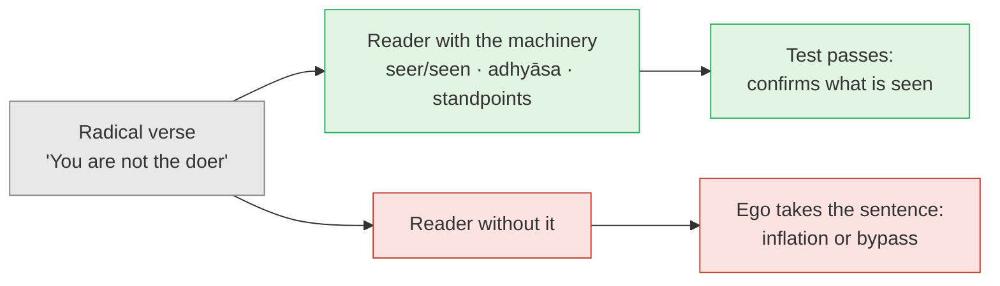
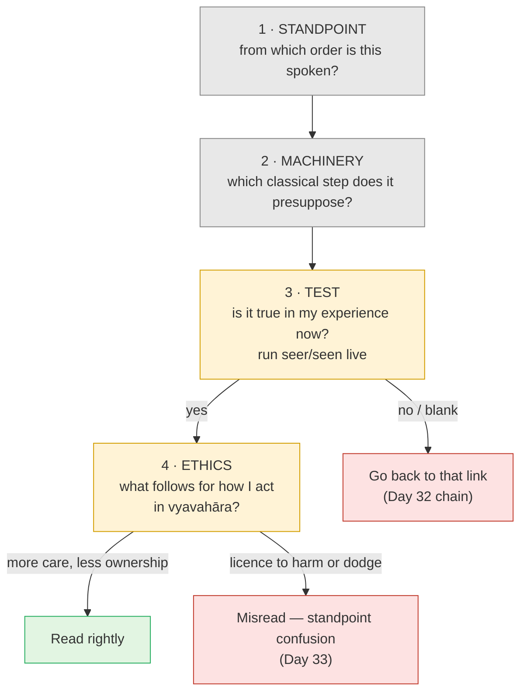

# Day 34 — Reading the Radical Texts (Aṣṭāvakra Gītā, Avadhūta Gītā)

> **Today's one idea:** The Aṣṭāvakra and Avadhūta Gītās state the end — "you are already free" — as plain present fact. Read without preparation, they inflate the ego or feed the bypass. Read with it, they become a test: if a verse is simply true in your own experience, the understanding is in place; where it isn't, the verse shows you which link to go back to.
> **Reading time:** ~35 min · **Prereqs:** [Day 18](../../02-vicharana/days/day-18-ajativada.md), [Day 33](./day-33-obstacles.md)
> **Primary source for today:** *Aṣṭāvakra Gītā* ch. 1 — Swami Nityaswarupananda (trans.), *Aṣṭāvakra Saṃhitā*, Advaita Ashrama, 1940. Supporting: *Avadhūta Gītā* chs. 1 and 3 — Swami Ashokananda (trans.), Sri Ramakrishna Math, Chennai.
> **Before you start:** Without looking — *which two obstacles outlive understanding, and which step removes each? Which of yesterday's four modern forms uses a true sentence from the wrong standpoint?*

---

## The hook (3 min)

A story often told: a boy whose body is bent in eight places — hence Aṣṭāvakra, "eight bends" — walks into King Janaka's court of scholars. They laugh. He laughs louder: he'd thought this an assembly of the wise, he says, but it's a gathering of leather-workers, who judge a being by its skin. (The Mahābhārata's own episode, Vana Parva 132–134, has him talk his way past Janaka's gatekeeper and defeat the court debater Bandin **[VERIFY: whether the leather-workers retort is in that episode or only in later retellings]**.)

The text that bears his name opens with Janaka asking three plain questions (1.1): *how is knowledge gained? How does liberation come? How is dispassion reached?* About twenty verses of uncompromising answers follow. You are not earth, water, fire, air or space; you are their witness, consciousness itself. Dharma and adharma, pleasure and pain, belong to the mind, not to you. And, in a verse quoted everywhere: ***if you think yourself free, you are free; if you think yourself bound, you are bound*** — "as one thinks, so one becomes" (1.11).

In chapter 2, Janaka bursts out in wonder: he is spotless, at peace, pure awareness; how long he was deceived! It reads as if one hearing was enough.

Would one hearing be enough for you? The course held these texts back until now on purpose. Today: why, and how to read them.

---

## Building the intuition (12 min)

### The answers at the back of the book

A maths textbook prints the answers at the back. Problem 14: *x = 4*.

For a student who has worked problem 14, that line is enormously useful: if it matches her working, her understanding is confirmed; if not, she knows where to look again. For a student who hasn't, it's worse than useless. He copies "x = 4" and gets the mark; after a term of this he *believes he can do maths*. The key gave him not knowledge but a self-image.

The Aṣṭāvakra and Avadhūta Gītās are answer keys: the last line of the working — *you are not the doer; you are ever free; you are like the sky* — with little working shown.

### Two readers, one verse

Take Aṣṭāvakra 1.6: *dharma and adharma, pleasure and pain, are of the mind, not of you. You are neither doer nor enjoyer. You are ever free.*

**Reader A** has done thirty-three days of working. She checks: the doing is seen, the enjoying is seen, the knowing of both is neither (Day 6). Conclusion: *the body-mind can act without the knot of "I did it" — more carefully, not less.*

**Reader B** has read some quotes online. Conclusion: *I'm not the doer, so I'm not responsible* — Day 33's bypass, now with scripture behind it.

Same sentence, opposite results. The difference is what the reader brings.

---

## The formal picture (12 min)

### The two texts

The ***Aṣṭāvakra Gītā*** (or *Saṃhitā*): twenty chapters of dialogue between the sage and Janaka, roughly three hundred verses, author and date unknown; proposed dates range widely, but most place it well after the classical Upaniṣads. Nityaswarupananda gives the Sanskrit, a word-by-word gloss and short notes.

The ***Avadhūta Gītā***, attributed to Dattātreya, is sung by an *avadhūta* — one who has "shaken off" every identification, rule and role. Chapter 3's refrain declares the speaker the nectar of knowledge, the same everywhere, like the sky (ज्ञानामृतं समरसं गगनोपमोऽहम्). It dismisses practices, scriptures, even the distinction between bound and free. Date and author uncertain; one estimate, on grounds of style, is the 9th–10th century.

### The standpoint: all bottom row

[Day 18](../../02-vicharana/days/day-18-ajativada.md)'s standpoint table: the Upaniṣads move between rows, teaching creation (*adhyāropa*) and then withdrawing it (*apavāda*). These two texts speak almost entirely from the bottom row, the ***pāramārthika*** — nearly every verse has the shape of *Kārikā* 2.32. They don't teach the machinery. They assume it.

### Both texts put preparation at the door

The detail quotation-collectors miss: Aṣṭāvakra's **first answer** (1.2) is not "you are free". It is: *if you want liberation, shun sense objects as poison, and drink forgiveness, sincerity, kindness, contentment and truth as nectar* — [Day 3](../../01-shubheccha/days/day-03-the-four-qualifications.md)'s qualifications in one line, before a single radical verse.

The *Avadhūta Gītā* opens with a verse saying that only through Īśvara's grace does the inclination toward non-duality arise in the wise, saving them from great fear (1.1). The most radical voice in the tradition starts with grace.

And Janaka is no ordinary student. The tradition presents him as the archetype of the ripe seeker — the name of the king who questions Yājñavalkya in Bṛhadāraṇyaka 4.3 ([Day 5](../../01-shubheccha/days/day-05-who-is-asking.md)). His one-hearing awakening is the Tenth Man hearing "you are the tenth" ([Day 4](../../01-shubheccha/days/day-04-the-tenth-man.md)) after years of counting.

### How to read a radical verse — the protocol

Step 3 is the one that makes the text a *test*. Step 4 is the safety catch: the knowledge removes **ownership** of action, never **care** in it (Gītā 3.22–25, Day 33).

### Three verses, run through the protocol

| Verse (paraphrase) | 1 · Standpoint | 2 · Machinery presupposed | 3 · Test | 4 · Ethical check |
| --- | --- | --- | --- | --- |
| **Aṣṭ. 1.6** — dharma and adharma, pleasure and pain are of the mind, not you; you're neither doer nor enjoyer | *Pāramārthika* | Seer/seen ([Day 6](../../02-vicharana/days/day-06-seer-and-seen.md)); doership is *adhyāsa* ([Day 12](../../02-vicharana/days/day-12-adhyasa.md)) | Watch yourself type a sentence. Is the knowing of the typing itself typing? | The mind still acts in *vyavahāra* and is still answerable there. Cf. Gītā 5.8: the knower thinks "I do nothing at all", while the senses go on with their work |
| **Aṣṭ. 1.11** — think yourself free and you're free; bound, and you're bound | *Pāramārthika*, aimed at a jīva | Bondage *is* a notion — *adhyāsa*, not a real chain (Day 12); the correcting notion is knowledge, which depends on the thing (*vastu-tantra*, [Day 23](../../03-tanumanasa/days/day-23-meditation-vs-knowledge.md)) | Is "I am bound" a thought you can see? Is what sees it bound? | Not an affirmation ("tell yourself you're free"); that would be *puruṣa-tantra* and would feed the ego |
| **Aṣṭ. 1.15** — this alone is your bondage: that you practise *samādhi* | *Pāramārthika* | Liberation isn't produced by any doing (Day 23); you can't attain what you are (Day 4) | Who is it that practises in order to *become* free? Is that one seen? | Says nothing against practice as preparation. For a mind still full of Day 33's obstacles, dropping practice is the bypass, not freedom |

Notice that 1.15 says what [Day 28](../../03-tanumanasa/days/day-28-krishnamurti-observer-observed.md)'s Krishnamurti said: effort to become strengthens the one becoming. Same structure, centuries apart, and both are safe only for someone who understands *why* it's true.

---

## Where it breaks / what it is not (4 min)

**"These are the highest teaching, so I can skip the rest."** They're the last line of the working, not a shortcut past it. The same truths sit in the Upaniṣads — Bṛh. 1.4.10, *Kārikā* 2.32 — inside a teaching method.

**"If a verse isn't obvious to me, I'm hopeless."** The test diagnoses; it doesn't judge. A failed verse tells you which link of Day 32's chain to revisit.

**"Read rightly, I should feel what Janaka felt."** Day 33's experience-chasing, with a literary model. His outburst describes recognition; it isn't a feeling to reproduce.

**"The avadhūta is beyond ethics, so ethics is for beginners."** The text portrays someone whose likes and dislikes no longer drive action — the result, not instructions. Copying its freedom from rules without the thinning of *rāga-dveṣa* is Reader B.

**"So avoid these texts."** No. For a prepared reader they are superb material for *nididhyāsana*: short, beautiful, unwilling to let the mind slip back into "I am this".

---

## Try it yourself (10 min)

### 1. Retrieval first

Close the page. From memory: (a) the four steps of the protocol and what each asks; (b) what Aṣṭāvakra's first answer (1.2) demands, and which day it matches; (c) why the course held these texts back until Day 34.

Hint

The answer key. The two readers. The door of both texts.

Model answer

(a) Standpoint — which order of reality is this spoken from (almost always <em>pāramārthika</em>)? Machinery — which classical step does it presuppose? Test — is it true in my own experience now, checked by live seer/seen? Ethics — what does it imply for how I act in <em>vyavahāra</em>; if it licenses harm or dodging, it's misread. (b) Shun sense objects as poison; drink forgiveness, sincerity, kindness, contentment and truth as nectar — Day 3's qualifications. (c) They state the conclusion without the working. Without Days 6–18 and Day 33's warnings, a reader can only copy the answer — inflation or bypass. With them, the verses become a test. "Because they're too advanced" is half right: the point is not difficulty but <em>what the reader does with them</em>.

### 2. Direct application — run Aṣṭāvakra 1.6 live

1. Read the paraphrase of 1.6 above once, slowly.
2. **Standpoint:** write one line naming the order of reality it speaks from.
3. **Machinery:** write which two days it presupposes.
4. **Test (5 minutes, live):** do something simple — type a sentence, wash a cup. As the action happens, notice: the movement, the intention, the small satisfaction of finishing. Each is seen. Ask: *is the knowing of the action itself acting? Did it intend? Is it pleased?*
5. **Ethics:** write one line on what changes in how you will act at work tomorrow if 1.6 is true — and one line on what must *not* change.

Hint

For step 4, keep the action small and real. Don't imagine it — do it.

What to look for

Standpoint: <em>pāramārthika</em>. Machinery: Day 6 (doing and enjoying are seen), Day 12 (the doer-sense is superimposition). In the live test, movement, intention and satisfaction are all clearly <em>appearing</em>; the knowing of them has no movement of its own. The verse is checked, not believed. 
Ethics, a good answer: <em>"Changes: less 'I did it' when work goes well, less 'I failed' when it doesn't — so I can take feedback without defending. Doesn't change: I own my commitments, because the body-mind that made them acts in vyavahāra."</em> If your second line was empty, re-read Day 33's bypass section before reading further in these texts.

### 3. Stretch — the "manifest your freedom" post

A friend shares Aṣṭāvakra 1.11 on social media with the caption: *"Think it and you are it. Affirm your freedom every morning and it becomes real."* Write a reply that says what's right in it and what's wrong, using [Day 12](../../02-vicharana/days/day-12-adhyasa.md) and [Day 23](../../03-tanumanasa/days/day-23-meditation-vs-knowledge.md).

Hint

Is bondage, for Advaita, a fact or a notion? And is the notion that frees an affirmation (something done) or a knowing (something that conforms to what is)?

Worked answer

"You're right that the verse puts bondage in the mind: Advaita says bondage is <em>adhyāsa</em>, the snake on the rope, not a real chain (Day 12) — so a change of understanding can end it. But the notion that frees is <em>knowledge</em>, which is <em>vastu-tantra</em>: it must match what is (Day 23). An affirmation is <em>puruṣa-tantra</em>, something you do. Telling the rope 'you're a rope' each morning while still seeing a snake doesn't help; looking does. 'Think yourself free' means <em>see</em> that the one who seems bound is seen. Affirmed, it just builds a 'free' self-image for the ego to own."

### 4. Spaced callback — Days 20 and 29

(a) From [Day 20](../../02-vicharana/days/day-20-shravana-manana-nididhyasana.md): name the three movements and the obstacle each removes. Which movement do the radical texts best serve, and why are they risky as someone's *first* hearing? (b) From [Day 29](./day-29-direct-path.md): the direct path also starts from the end — "experience is made only of knowing". How does it differ from Aṣṭāvakra's bare statements? Run Aṣṭāvakra's claim that you are the one witness of all (1.7) through Day 29's two steps.

Hint

(a) Day 20 warned about repeating a sentence as a mantra. (b) What does the direct path give you that a statement doesn't?

Model answer

(a) <em>Śravaṇa</em> removes ignorance, <em>manana</em> doubt, <em>nididhyāsana</em> contrary habit. The radical texts serve <em>nididhyāsana</em> best — dwelling-material for one who already understands — and test <em>manana</em>, since leftover doubt shows up as a verse that doesn't ring true. As a first hearing they're risky: <em>śravaṇa</em> finds the purport through the whole method (Day 20's six signs), and a bare conclusion with no method around it becomes a slogan or mantra — Day 20's warning. 
(b) The direct path gives the <em>looking</em>; Aṣṭāvakra mostly gives the <em>result</em>. Run "you are the one witness of all" through Day 29: look at the room. Is any object found apart from seeing? Any seeing apart from knowing? A second knowing elsewhere that would make you "one witness among many"? Three noes, and the verse is checked, not believed. Atmananda adds a caution: "witness" is itself a rung, let go once the witnessed is seen to be knowing.

**Transfer — apply it:**

> Choose one radical-sounding line you already carry around — from these texts, from a teacher, a book or a meme ("you are already enlightened", "there is no doer", "nothing to do, nowhere to go"). Write one sentence: *the input* (the line, and how you've been using it), *what today's protocol does to it* (standpoint → machinery → live test → ethical check), and *the output* (whether it passed, and the one link you'd revisit if it didn't). If nothing comes to mind in 60 seconds, re-read the hook and try again.

---

## Connect it back

Yesterday named the obstacles that outlive understanding, the bypass most dangerous among them. Today you met texts that, read carelessly, feed every one of them and, read carefully, test whether they're still there. The Aṣṭāvakra and Avadhūta Gītās speak only from the highest standpoint (Day 18), presuppose the machinery, and open with preparation and grace. Standpoint, machinery, live test, ethics: the protocol turns an answer key to copy into one to check against. Tomorrow you consolidate Days 26–34: the four doors, where they converge, and how the knowledge stands up to pressure.

**Sharp question:** *Which radical verse is simply true for you today — and which one still needs you to go back to a link in the chain?*

---

## Suggested readings for today

**Required if you have 15 extra minutes:** *Aṣṭāvakra Gītā* **chapter 1** (Nityaswarupananda trans., *Aṣṭāvakra Saṃhitā*, Advaita Ashrama, 1940) — about twenty verses. Read it straight through, then run three verses through the protocol in writing. Notice 1.2 first.

**If you want the deep version:**
- *Avadhūta Gītā*, **chapters 1 and 3** (Swami Ashokananda trans., Sri Ramakrishna Math, Chennai; Swami Chetanananda's version from Advaita Ashrama reads more easily) — the opening verse on grace, then chapter 3's refrain. Read it as dwelling-material; stop if it starts to feel like permission.
- *Aṣṭāvakra Gītā* **chapter 2** (Janaka's response) and **chapter 18** (the longest, a hundred verses on the knower's peace and conduct) — the result from the inside, read with the protocol.
- *Bhagavad Gītā* **5.7–12** with Shankara's commentary (Gambhirananda trans., 1984) — "I do nothing at all", thinks the knower, while the senses act: Aṣṭāvakra 1.6 inside a text that insists you act well.

---

## Navigation

← **Previous:** [Day 33 — Obstacles: Doubt, Habit, Bypass](./day-33-obstacles.md)
→ **Next:** [Day 35 — Rest & Synthesize III](./day-35-rest-and-synthesize-3.md)
