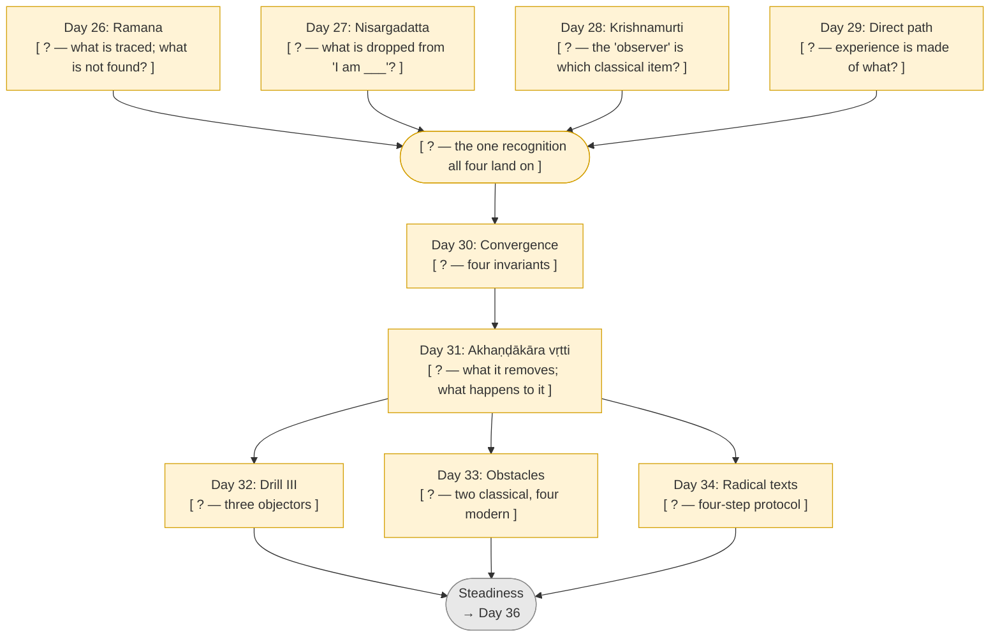
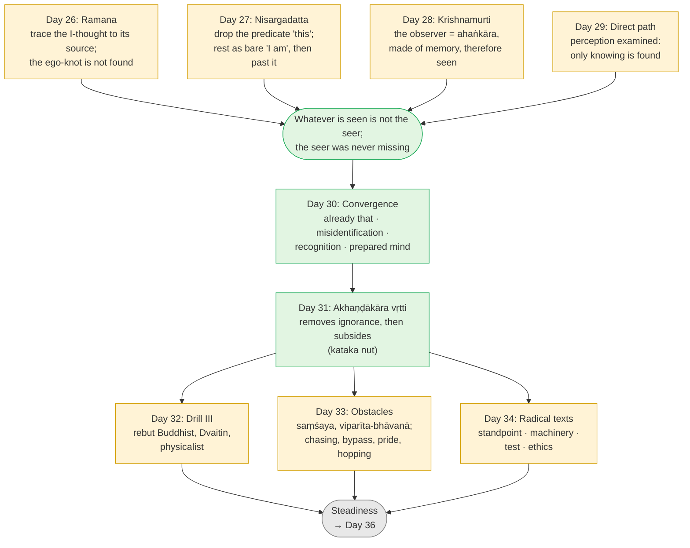

# Day 35 — Rest & Synthesize III

> **Today:** No new concepts. Only consolidation of the arc from the four living doors to the stress tests of stage-4 knowledge.
> **Format:** Re-state → Re-derive → Full run → Quiz
> **Reading time:** ~35 min (longer if gaps surface — that's the point)
> **Prereqs:** [Days 26–34](../../../README.md)

Days 26–34 walked through four doors that seemed to have nothing in common, showed they open onto one room, explained how knowledge removes ignorance and then gets out of the way, and then tried to break that knowledge three ways. Today you check that you can rebuild all of it with the pages closed.

Close all previous pages. Work from memory first.

---

## Step 1 — Re-state the 9 ideas (5 min)

> **Why this table is not in day order:** Recalling Day 26 first, then Day 27 lets you use sequence as a cue — which is how you memorised it, not how you'll use it. The scrambled order below forces you to retrieve each concept on its own merits. This discomfort is the point.

Write one sentence per row. Name the load-bearing idea and, where you can, the text, teacher or image that carries it.

| Concept (Day) | Your sentence |
| --- | --- |
| The thought that ends itself (Day 31) | |
| Ramana: "Who am I?" (Day 26) | |
| Obstacles that outlive understanding (Day 33) | |
| Krishnamurti: the observer is the observed (Day 28) | |
| Reading the radical texts (Day 34) | |
| The direct path (Day 29) | |
| Nisargadatta: "I am" (Day 27) | |
| Drill III — "I am Brahman", cold (Day 32) | |
| Where the paths converge (Day 30) | |

Compare to these

1. **Day 31 — The thought that ends itself:** The *akhaṇḍākāra vṛtti* — the mind's one thought in the form of the undivided, born of hearing "you are That" — removes ignorance and then subsides with it, like the *kataka* nut that settles the mud and then settles itself. It reaches Brahman as *vṛtti-vyāpti* (the thought removes the veil) without *phala-vyāpti* (no separate illumination is needed, because the Self is self-luminous).
2. **Day 26 — Ramana:** Tracing the I-thought to its source is *adhyāsa* undone from the inside: the ego is the *cid-jaḍa-granthi*, the knot of seer and seen, and when looked for it is not found. Surrender removes the same claimant from the other side.
3. **Day 33 — Obstacles:** Doubt (*saṃśaya*) and contrary habit (*viparīta-bhāvanā*) can outlive clear understanding, because they live in the mind that holds it, not in the understanding itself. They wear four modern forms — experience-chasing, the "nobody here" bypass (a confusion of standpoints), spiritual pride and teacher-hopping — and each has a known remedy: *manana* for doubt, *nididhyāsana* for habit, *karma yoga* for the bypass.
4. **Day 28 — Krishnamurti:** The "observer" — the centre that judges, names and tries to change what it sees — is made of memory, so it is observed content: the *ahaṅkāra*, not the *sākṣī*. That is Day 6's discrimination with no Vedantic vocabulary.
5. **Day 34 — Radical texts:** The Aṣṭāvakra and Avadhūta Gītās state the end as plain fact ("you were never bound"), so they test understanding rather than build it. Read them with a protocol: identify the standpoint, find the machinery the text takes for granted, test the claim in experience, check the ethical consequence.
6. **Day 29 — The direct path:** Atmananda, Spira and Lucille examine perception itself: no object is found apart from the seeing, no seeing apart from knowing — so experience is made only of knowing (Day 6's chain run downward). The witness is used as an intermediate step and later collapsed: once the witnessed turns out to be knowing, "witness" has nothing to be a witness *of*.
7. **Day 27 — Nisargadatta:** The bare sense of being, "I am" before "I am this", is Day 11's *sat* pointer, lived. Adding the predicate is *adhyāsa*. Hold the "I am" until it is understood, then let even that go: it is the door, not the room.
8. **Day 32 — Drill III:** You can rebuild the ten-link "I am Brahman" chain cold (seer ≠ seen → not the sheaths or states → the witness remains → pointed at by *sat · cit · ananta* → missed through *adhyāsa* → the seen is *mithyā* → its cause is Īśvara → *tat tvam asi* → *aham brahmāsmi* → the thought subsides), find the link weakest for you, rebut the Buddhist, Dvaitin and physicalist objections, and run the same recognition through two different doors.
9. **Day 30 — Convergence:** Four invariants hold across every source: (i) you already are what you seek; (ii) the obstacle is misidentification, not absence; (iii) the shift is recognition, not acquisition; (iv) a prepared mind is needed. Scripture supplies the pointer; enquiry does the looking. Teachers *sound* opposed largely because the modern vocabulary of "experience" (Halbfass, Sharf) makes recognition sound like an event.

**Scoring:** a row counts only if your sentence contains the *mechanism* — why it works — not just the label. Any row you left blank or got only as a label: reopen that day's formal picture after finishing Step 4.

---

## Step 2 — Re-derive the end-to-end flow (10 min)

Fill each `?` from memory before opening the completed version.

Filled version

### Mechanism questions

1. The four doors use almost no shared vocabulary. Name what each door treats as *seen*, and say why convergence does not require them to agree on words.
2. Nisargadatta holds the "I am" and then lets it go; the direct path sets up the witness and then collapses it. Is this the same move? Which classical method from Module 2 is it?
3. The *akhaṇḍākāra vṛtti* is a thought, and every thought is seen. How can something on the seen side remove ignorance of the seer?
4. Day 30 says the shift is recognition, not acquisition. Day 33 says doubt and habit can outlive the recognition. Contradiction?
5. Why do the radical texts come after the obstacles page, not before it?

Answers

1. Ramana: the I-thought and its owner — the ego-knot ([Day 26](../../03-tanumanasa/days/day-26-ramana-who-am-i.md)). Nisargadatta: every predicate in "I am *this*" ([Day 27](../../03-tanumanasa/days/day-27-nisargadatta-i-am.md)). Krishnamurti: the judging observer ([Day 28](../../03-tanumanasa/days/day-28-krishnamurti-observer-observed.md)). Direct path: every perceived "object" taken as separate from knowing ([Day 29](./day-29-direct-path.md)). In each case the item that usually poses as the seer is shown to be seen. Convergence is about structure, not vocabulary: the test is whether the same discrimination ([Day 6](../../02-vicharana/days/day-06-seer-and-seen.md)) is being performed, and you can check that in your own experience.
2. Yes. Both are *adhyāropa–apavāda* ([Day 17](../../02-vicharana/days/day-17-neti-neti.md)): provisionally attribute something ("you are the witness", "hold the I am") to lift attention off the body-mind, then withdraw the attribution once it has done its work. "Witness" and "I am" are *lakṣaṇas* — pointers ([Day 11](../../02-vicharana/days/day-11-sat-cit-ananda.md)) — and you don't carry the pointer into the room.
3. Pure consciousness is not opposed to ignorance — it lights ignorance up, as in deep sleep ("I knew nothing"). Only a knowledge-form in the mind, "I am the limitless", is opposed to the specific error "I am limited": sunlight focused through a lens. The *vṛtti* does not illumine the Self (*phala-vyāpti* is not needed — the Self is self-luminous); it only removes the covering (*vṛtti-vyāpti*) — the hand pulling the cloth off a lamp that was burning all along. Having removed ignorance, it has nothing left to do and subsides like the *kataka* powder ([Day 31](./day-31-the-thought-that-ends-itself.md)).
4. No. Recognition settles *what* you are; it doesn't instantly re-route decades of grooves. *Saṃśaya* returns when the reasoning isn't owned (remedy: *manana*); *viparīta-bhāvanā* returns when habit outshouts the knowledge (remedy: *nididhyāsana* plus [Day 24](../../03-tanumanasa/days/day-24-vasanas-three-practices.md)'s practices). Neither creates a gap in the truth; both create gaps in its *availability*. Map vs ruts again.
5. A radical text speaks from the highest standpoint ("there was never bondage"). A mind with unresolved doubt reads that as "so nothing matters"; a mind with strong contrary habit borrows its language to decorate the ego. Day 33 names those failure modes first so that Day 34's protocol has something to check for. Read too early, the radical texts don't test understanding — they replace it with slogans.

---

## Step 3 — Run / apply it (10 min)

### Written reconstruction

A friend who has done years of Buddhist practice says: *"You've studied four teachers who openly disagree — one says ask who you are, one says just be, one rejects all method, one analyses perception. Then you read texts saying you were never bound. How is that one teaching and not a buffet?"* Answer in **200 words**. Don't look back. Then compare.

Model reconstruction

"Look at what each one actually removes. Ramana has you look for the 'I' that owns your thoughts — you find only more thoughts and feelings, never an owner. Nisargadatta has you stop at 'I am' and not add 'this' — every 'this' is something you notice, so not you. Krishnamurti shows the inner judge is just memory — something you can watch. The direct path checks perception and finds no object apart from the knowing of it. Four routes, one finding: whatever can be noticed isn't the noticer, and the noticer was never missing. That's the oldest move in the Upaniṣads. The common ground: you already are what you're after; the problem is mistaking yourself for what you notice; the fix is recognising, not gaining; and the mind has to be steady enough to see it. Mechanically, a single clear understanding removes the confusion and then gets out of the way. Then you test it: rebuild the argument cold, answer your own tradition's objections, watch for doubt, old habits and 'nobody here' talk. Only then do the texts that say 'you were never bound' make sense — as a check, not a shortcut."

Check: did you include (a) a one-line account of each door; (b) the shared recognition, phrased as seer/seen; (c) at least two of the four invariants; (d) knowledge removing ignorance and then subsiding; (e) at least one obstacle; (f) why the radical texts come last? Each missing item is a gap to revisit.

### Live contemplative check-list

Do each of these now, in order. If any step fails or you go blank, that's your diagnostic.

1. **Door 1 — Ramana (Day 26):** let a thought arise. Ask, *to whom?* Look for the owner for ten seconds. Note what you find: an object, or no object?
2. **Door 4 — direct path (Day 29):** look at the nearest coloured object. Can you find the colour anywhere apart from the seeing of it? Don't answer from theory; look.
3. **Door 2 — Nisargadatta (Day 27):** say "I am" silently and stop before any predicate. When "…tired / reading / bored" tries to attach, notice it as *seen*.
4. **Door 3 — Krishnamurti (Day 28):** catch one inner judgement ("this exercise is pointless"). Is the judge watchable? Then it is on which side?
5. **Obstacle scan (Day 33):** in the last week, which showed up most — doubt, an old reaction overriding what you know, wanting a particular experience back, or "nobody here" talk? Name one instance.
6. **Standpoint check (Day 34):** say "I was never bound." Then name the standpoint it is true from, and one thing it does *not* excuse you from today.

---

## Step 4 — Quiz (5 min)

> **Why the questions jump around:** In real life no one hands you problems labelled "Day 30 question." Mixing topics makes you identify *which* idea applies before using it — the skill that actually transfers.

**Q1.** A meditator says: "Last spring I had a vast, open awakening. It faded. I've been sitting six hours a day trying to get it back." Name the obstacle from Day 33, the classical error underneath it, and the remedy.

**Q2.** "Nisargadatta told me to hold on to 'I am'. Later he said 'I am' is not the truth. Which is it?" Answer in three sentences.

**Q3.** State the four invariants from Day 30, and give the one-sentence reason teachers who share them can sound flatly opposed.

**Q4.** A line in the style of the Aṣṭāvakra Gītā: *"You are not the doer, not the enjoyer. You are free right now."* Run Day 34's four-step protocol on it.

**Q5 — Cross-concept.** A friend says: "Krishnamurti proved the observer is the observed. So there's nobody here, and nothing I do really matters." Using Day 28 and Day 33, say what is right in the first sentence, exactly where the slide happens, and what question exposes it.

**Bonus (cross-tradition).** A Sufi distinguishes *ḥāl* (a passing "state", given) from *maqām* (a settled "station"). Which course distinction does this match, and what would the Sufi add that Advaita downplays?

Answers

**A1.** Experience-chasing, the first of Day 33's four modern forms. Classically it is *saṃśaya* about what the knowledge is; the confusion underneath is knowledge mistaken for a state — something *puruṣa-tantra* that is produced and comes and goes ([Day 23](../../03-tanumanasa/days/day-23-meditation-vs-knowledge.md)), when the Self is what the state appeared *to*. Remedy: *manana* — what exactly was lost, and was it seen? What was aware of the awakening arriving and of it fading didn't fade. Then *nididhyāsana* without demanding the state: keep the sitting if it steadies the mind; drop it as a way of manufacturing "it".

**A2.** Both, in sequence. "I am" is the *sat* pointer (Day 11), held to lift you off "I am this" (Day 27). Once it is understood, it too is seen to come and go — present on waking, absent in deep sleep — so what knows its coming and going is prior to it. Door, then room.

**A3.** (i) You already are what you seek; (ii) the obstacle is misidentification, not absence; (iii) the shift is recognition, not acquisition; (iv) a prepared mind is needed. They sound opposed because the modern language of "experience" (Halbfass on Neo-Vedānta, Sharf on Buddhist modernism) recasts recognition as an event you have, so teachers who emphasise *knowing* and teachers who emphasise *looking* seem to be selling different products.

**A4.** (1) *Standpoint:* *pāramārthika* — true of the Self, not of the body-mind's conduct. (2) *Machinery taken for granted:* seer/seen (Day 6), *adhyāsa* — doership is superimposed (Day 12), *ajāti* (Day 18). (3) *Test:* look for the doer in an action; is "I am doing" itself seen? (4) *Ethical consequence:* at the empirical level actions still have effects and you still answer for them; if the line is being used to excuse harm, it is being misread. A true sentence from the wrong standpoint still produces a wrong action.

**A5.** Right: the observer — the judging, naming centre — is *ahaṅkāra*, made of memory, so it is observed content and not the seer (Day 28; Day 6). The slide has two steps. First, "the ego is seen" becomes "nothing is here", which quietly drops the *sākṣī*: Krishnamurti denied the observer, not the observing. Second, a *pāramārthika* insight is used to settle a *vyāvahārika* question about whether actions matter — Day 33's confusion of standpoints, which is the "nobody here" bypass exactly. The ego is *mithyā*, not *tuccha* ([Day 13](../../02-vicharana/days/day-13-mithya.md)): it still acts and its actions still land on people. The exposing question: *"What is aware that there is nobody here?"* And a practical one: *"When someone insults you, is there nobody there to mind?"* If there is, that's *viparīta-bhāvanā* in borrowed clothes.

**Bonus.** It matches the line between a state that comes and goes and stable knowledge: *puruṣa-tantra* vs *vastu-tantra* ([Day 23](../../03-tanumanasa/days/day-23-meditation-vs-knowledge.md)), Day 30's "a state" mistake, and Day 33's experience-chasing. The Sufi adds grace: a *ḥāl* is a gift from God, not something produced, and even the station is reached by grace as well as effort. Advaita downplays this, though it keeps a trace: the *Avadhūta Gītā* opens by crediting the very inclination to non-duality to Īśvara's grace ([Day 34](./day-34-radical-texts.md)). The difference: for Advaita the lasting thing is not a station reached but what you already are.

---

## What's ahead

| Day | Topic | What the reader will decide or build |
| --- | --- | --- |
| 36 | The Sthitaprajña | Check yourself against the Gītā's marks of steadiness (2.55–72) — steadiness under pleasure and pain, not special states — and use those marks as practice |
| 37 | Knowledge and the Leftover Personality | Decide what to make of habits, moods and *prārabdha* that keep running after understanding: they continue, but their ownership changes |
| 38 | From Course to Scripture | Build a sequenced 12-month primary-text reading plan |

The machinery and the doors are complete; the last arc asks what this knowledge looks like in an ordinary day.

---

## Connect it back

Days 26–34 had three movements. Four doors (26–29) showed the same seer/seen discrimination arrived at by asking, by being, by observing and by examining perception. The middle (30–31) named what they share and how knowledge works: one clear recognition removes ignorance and then subsides. The last three (32–34) tried to break it — cold reconstruction, named obstacles, texts that state the end bluntly. If Step 1 or Step 4 went blank anywhere, that day is your homework before Day 36. The Sthitaprajña page assumes you can tell a passing state from the knowledge it appeared to — that is what Arjuna's question will test.

---

← [Day 34 — Reading the Radical Texts](./day-34-radical-texts.md) &nbsp;|&nbsp; [Day 36 — The Sthitaprajña →](./day-36-sthitaprajna.md)
