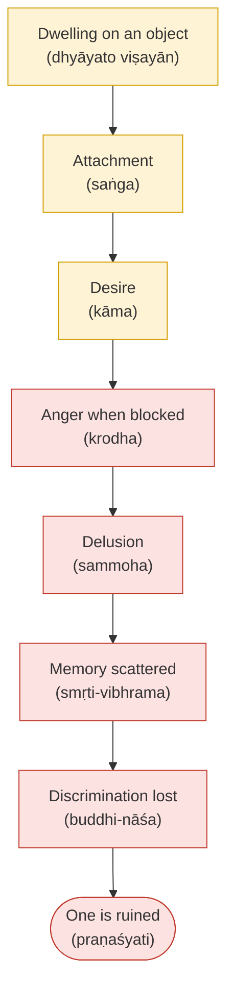
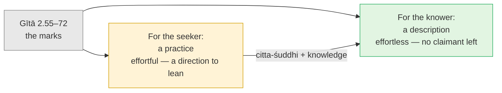

# Day 36 — The Sthitaprajña: One Steady in Wisdom

> **Today's one idea:** Stage-4 knowledge does not show up as special states. It shows up as *steadiness*: pleasure and pain still come, but they no longer add to or take away from the one they come to (Gītā 2.55–72). And the marks of the knower, Shankara says, are also the seeker's means.
> **Reading time:** ~35 min · **Prereqs:** [Day 21](../../03-tanumanasa/days/day-21-karma-yoga.md), [Day 31](./day-31-the-thought-that-ends-itself.md)
> **Primary source for today:** Bhagavad Gītā 2.54–2.72 with Shankara's commentary — Swami Gambhirananda (trans.), *Bhagavad Gītā with the Commentary of Śaṅkarācārya*, Advaita Ashrama, 1984.
> **Before you start:** Without looking — *Day 34 treated the radical texts as a test rather than a teaching: what makes a verse like "you are already free" a test, and what does it show you when it fails? Then, from Day 31: what does the* akhaṇḍākāra vṛtti *remove, and what image showed it subsiding afterwards?*

---

## The hook (3 min)

Arjuna has just been told, in the second chapter of the Gītā, that the Self is never born and never dies, and that a person established in wisdom is free. He asks a very practical follow-up (2.54):

> *"What is the description of the one whose wisdom is steady (sthitaprajña), who is established in samādhi? How does such a person speak? How do they sit? How do they walk?"*

He wants a checklist he could use on someone across the room. Look at what Kṛṣṇa does with it. In the eighteen verses that follow (2.55–72) there is no glow, no trance, no posture, no way of walking. Every mark is about one thing: **what happens in a person when pleasure and pain arrive.** That is today's whole page.

---

## Building the intuition (12 min)

### The pond and the ocean

Picture a garden pond fed by one stream. When the stream runs, the pond rises; in a dry week it sinks. Its level is just inflow minus drain. Every inflow matters to it.

Now picture the ocean in monsoon season. A thousand swollen rivers pour in; in summer they dry to a trickle. The ocean's level doesn't noticeably change. Not because it refuses the rivers — they pour in freely — but because its fullness was never *made of* rivers.

Gītā 2.70 uses exactly this picture: as waters enter the ocean, which is being filled yet stays unmoved in its place, so the one into whom all desires enter in the same way attains peace — not the one who desires desires.

Hold [Day 1](../../01-shubheccha/days/day-01-the-itch-objects-cant-scratch.md) beside it: every desire is a disguised desire for fullness (*pūrṇatva*). The pond person is trying to get full from inflows. The ocean person has recognised that fullness was never an inflow — it is what they are. Pleasant things still arrive, are enjoyed and let go. They just aren't asked to complete anyone.

### The tortoise

The second picture (2.58): as a tortoise draws in its limbs, the steady one draws the senses back from their objects. The tortoise isn't limbless; it walks and eats with those legs all day. What it has is the *ability* to withdraw them at once. A sthitaprajña sees, tastes and works. What's missing is the hook: the sense that this sight or taste is where "I" will be made whole.

### The ladder down

Verses 2.62–63 describe, step by step, the opposite of steadiness:

You can watch this in an afternoon. You replay the job you didn't get; replaying becomes "that should have been mine"; that hardens into wanting; blocked wanting turns to anger at the colleague who got it; anger fogs judgement; *viveka* switches off; you send the email.

The steady person's ladder has the same first rung — objects still appear and are thought about — but the second rung doesn't catch, because no "I" is waiting to be completed. Steadiness is visible in *where the chain doesn't run.*

### Why abstaining isn't enough

Verse 2.59 is the key to the section, and easy to skim past. Paraphrased: objects fall away from one who stops feeding on them, but the *taste* (*rasa*) remains; even the taste falls away for one who has seen the highest.

That is the line between suppression and knowledge. Fast for a month and the craving can sit in you intact. What removes the *rasa* is *paraṃ dṛṣṭvā*, "having seen the highest": recognising that what the craving was after is already what you are. Day 1's itch stops when you see what it was itching for.

---

## The formal picture (12 min)

### The marks, verse by verse

| Verse | The mark | What it is *not* |
| --- | --- | --- |
| 2.55 | Gives up all desires that arise in the mind; satisfied in the Self, by the Self (*ātmany evātmanā tuṣṭaḥ*) | Not "has no preferences". What is given up is desire as a hunt for fullness |
| 2.56 | Mind not shaken in sorrow (*duḥkheṣv anudvigna-manāḥ*); no craving amid pleasures (*sukheṣu vigata-spṛhaḥ*); free of attachment, fear and anger | Not "feels no pain". Sorrow arrives; the mind isn't overturned by it |
| 2.57 | Unattached everywhere; neither elated by the good nor resentful of the bad | Not indifference to outcomes — compare the archer of Day 21 |
| 2.58 | Withdraws the senses like a tortoise | Not sensory shutdown; the limbs work |
| 2.59 | Even the *taste* goes, on seeing the highest | Not suppression — that removes only the object |
| 2.64–65 | Moves among objects with senses free of attraction and aversion and attains clarity (*prasāda*); in that clarity all sorrows end | Not withdrawal from the world: "moves among objects" |
| 2.70 | Filled like the ocean, unmoved by the rivers | Not refusing the rivers |
| 2.71 | Without craving, without "mine", without "I" (*nirmamo nirahaṅkāraḥ*) | Not without a personality — Day 37's topic |
| 2.72 | This is the Brahman-state (*brāhmī sthitiḥ*); attaining it one is not deluded again | Not an experience; a settled knowledge |

Two things stand out. Arjuna asked about one "established in samādhi", and the answer describes no absorption at all — only relationships to pleasure, pain, desire and objects. And 2.71 names the root in two words: *nirmamaḥ*, without "mine", *nirahaṅkāraḥ*, without "I". That is [Day 12](../../02-vicharana/days/day-12-adhyasa.md)'s *adhyāsa* undone. Everything else on the list follows from it.

### Shankara's double use

Introducing 2.55, Shankara remarks (paraphrased) that throughout the teaching on the Self, the characteristics of one who has reached the goal are taught as the *means* for one who hasn't, since for the seeker they must be achieved with effort (Gambhirananda, introducing 2.55). So the list cuts two ways:

For the knower, evenness takes no effort: nobody is left whose fullness depends on the inflow. For the seeker, the same evenness is practised against the grain — a direction, not a standard you fail. You've done this already: [Day 21](../../03-tanumanasa/days/day-21-karma-yoga.md)'s *samatvam* (2.48) comes six verses before Arjuna's question. Karma yoga is the sthitaprajña's evenness practised in advance.

### Why steadiness and not states

This follows from Day 31. The *akhaṇḍākāra vṛtti* removes ignorance and then subsides; it isn't held. So "steady" (*sthita*) can't mean a thought or state kept going — that would be *puruṣa-tantra* and would end ([Day 23](../../03-tanumanasa/days/day-23-meditation-vs-knowledge.md)). What is steady is the *prajñā* — more exactly, the absence of the ignorance it removed. Once the rope is known, the snake stays gone whether you're looking at the rope or making dinner. The visible sign isn't a glow. It's that when the next insult or windfall arrives, "this is happening to *me*, and I am now less (or more)" doesn't reassemble, or reassembles weakly and is seen through fast.

Stage 4 is checked in the kitchen and the meeting room, not on the cushion.

---

## Where it breaks / what it is not (4 min)

**"Steady means feeling nothing."** 2.56 says the mind is *not shaken* in sorrow (*anudvigna*), not that sorrow is absent. Grief, warmth and irritation can all arise fully; the ocean has waves. If what you're calling steadiness feels like numbness, flatness or a glass wall between you and your life, **that is not this** — take it to a doctor, therapist or experienced teacher rather than counting it as progress. Equanimity is responsive; numbness isn't.

**"Steadiness is a special state — bliss, light, silence."** None of the eighteen verses names a state. A blissful absorption that leaves you shattered by criticism next morning is, by the Gītā's test, not *sthita*.

**"I can use the list to judge my teacher."** Behaviour is ambiguous from outside: calm can be temperament or cover; a sharp tongue can coexist with knowledge (Day 37 explains why). The list is for looking at yourself. (Harm is different — Day 34's ethical check applies to anyone.)

**"I'm not like this, so I've failed."** For you the marks are the *means*. Falling short tells you where to lean. The full *brāhmī sthiti* ripens through stages beyond this course; stage 4 shows its beginnings — shorter recovery, fewer re-hookings, the chain caught earlier.

---

## Try it yourself (10 min)

### 1. Retrieval first

Close the page. From memory: (a) name the three images from 2.55–72 and what each one shows about steadiness; (b) state the two halves of 2.56; (c) state Shankara's principle about the marks.

Hint

One animal, one ladder, one body of water. And for (c): "for the knower a description, for the seeker a…"

Model answer

(a) <strong>Tortoise</strong> (2.58): senses work but can be withdrawn at will — capacity, not shutdown. <strong>Ladder</strong> (2.62–63): dwelling → attachment → desire → anger → delusion → scattered memory → lost discrimination → ruin; steadiness shows where it doesn't catch. <strong>Ocean</strong> (2.70): rivers pour in, the level doesn't change; the fullness was never made of rivers. (b) Not shaken in sorrow; free of craving in pleasure. (c) The knower's marks are taught as the seeker's means — description for one, practice for the other. Bonus if you gave 2.59: the taste goes only on "seeing the highest" — knowledge, not suppression.

### 2. Direct application — a seven-day steadiness log

For seven evenings, pick **one jolt** and **one windfall** from the day and note:

1. **Recovery time** — how long until the mind was back to baseline?
2. **Ownership** — did it register as *happening to me* ("I am diminished / made") or as *seen*, an event in awareness?
3. **Rung** — where on the ladder did the chain stop?
4. **Feeling intact?** — did you still feel it fully? Yes is the healthy answer.

Once during the week, do it *live*: when a jolt lands, take three breaths. Breath 1: *this is seen.* Breath 2: find the claim "I am less now" — is the claim itself seen? Breath 3: *did the ocean's level change, or only the surface?*

Hint

The markers are deliberately not "did I feel anything?" Feeling is not the problem. Watch recovery time and ownership.

What to look for

A typical honest log: <em>"Jolt: client cancelled. Recovery: two hours. Ownership: 'I'm failing' — fully owned. Rung: anger, then replaying. Feeling intact: yes. Windfall: praise from my manager — I reread it four times. Rung: desire for more. Live practice: breath 2 caught 'I'm less' as a thought; the sting stayed, the story stopped."</em> 
Signs of movement: recovery shortens; ownership shifts toward "seen"; the ladder stops a rung or two earlier; the <strong>windfall</strong> column changes too (the Gītā cares as much about craving pleasure as fearing pain). The sign to take seriously the other way: "feeling intact?" turning into "no" — if equanimity is becoming flatness, stop pushing and talk to someone. Breath 2 is <em>dṛg-dṛśya-viveka</em>: the claim "I am less" is an object, so by Day 6 it is not the one it's about.

### 3. Stretch — the calm executive and the fiery sage

Two people. The first is unflappable in every crisis — and privately needs the admiration that calm earns them. The second has a quick temper that flares and is gone in seconds, with no grudge and no story afterwards. Using 2.59 and 2.71, which shows more of the sthitaprajña's marks? What does this tell you about using outward behaviour as evidence?

Hint

2.71: without "mine", without "I". Where is the "I" in each case? 2.59: suppression vs the taste going.

Worked answer

Probably the second. The executive's calm is held in place by a craving for admiration, so the <em>rasa</em> is intact (2.59); the calm has become "mine" (2.71), and the ladder runs quietly on the desire for esteem. The sage's flare doesn't reassemble an owner — no grudge, no replay — so the chain stops at the first rungs. Steadiness is about <em>ownership and recovery</em>, not surface; you can see your own ownership, only guess at someone else's. (This doesn't excuse temper that harms; it shows temperament and knowledge can coexist — tomorrow's topic.)

### 4. Spaced callback — Days 22 and 31

(a) **Day 22:** Gītā 12.13–20 lists the marks of the devotee "dear to me". Without opening it, name two marks you'd expect it to share with 2.55–72, and say what Day 22 implies about why bhakti and jñāna produce the same mind. (b) **Day 31:** someone says, "To stay a sthitaprajña I must hold the thought 'I am Brahman' all day." Using Day 31, correct them.

Hint

(a) Day 22: what does devotion to the total loosen? What is the knower called in 7.17–18? (b) The <em>kataka</em> nut — does it stay in the water?

Model answer

(a) Overlaps: evenness in pleasure and pain; no hatred toward any being (<em>adveṣṭā</em>); free of "mine" and "I"; contentment. <a href="../../03-tanumanasa/days/day-22-bhakti-inside-advaita.md">Day 22</a>: devotion to the total loosens the ego by handing its ownership to the whole, and in the knower it matures into <em>eka-bhakti</em> — "my very Self" (7.17–18). Both doors remove the same thing, the separate owner of pleasure and pain, so they produce the same mind. (b) <a href="./day-31-the-thought-that-ends-itself.md">Day 31</a>: the <em>akhaṇḍākāra vṛtti</em> removes ignorance and subsides with it, like the <em>kataka</em> powder. A thought held all day would be a <em>puruṣa-tantra</em> state and would end. What's steady is that ignorance doesn't return. Repeating "I am Brahman" can support <em>nididhyāsana</em> while habit is strong (Day 20); it isn't what steadiness <em>is</em>.

**Transfer — apply it:**

> Take one recurring source of pleasure or pain in your week — a work metric, a relative's tone, notifications. Write one sentence: *the input* (the event as it lands), *what today's idea does to it* (asks: river into the ocean, or the inflow your level depends on? where does the ladder catch?), and *the output* (one way you'll practise the mark — e.g. "after the weekly numbers, three breaths before replying; check rung and ownership"). If nothing comes to mind in 60 seconds, re-read the hook and try again.

---

## Connect it back

Day 35 consolidated the doors and the mechanism: one recognition removes ignorance and gets out of the way. Today asked what that looks like, and the Gītā's answer was deliberately unglamorous: no states, only steadiness — the ocean rivers can't raise, the ladder that stops at the first rung, the taste that goes when the highest is seen. Shankara made the description a practice: the knower's marks are the seeker's means. Tomorrow asks the obvious next question: if knowers are this steady, why do they still have tempers, preferences and habits?

**Sharp question:** *If pleasure and pain still arrive for the knower, what exactly is it that they no longer arrive* to*?*

---

## Suggested readings for today

**Required if you have 15 extra minutes:** Bhagavad Gītā **2.54–2.72** with Shankara's commentary (Gambhirananda, 1984). Read Arjuna's question, Shankara's introduction to 2.55 (marks as means), then the eighteen verses as one description. Notice that none describes a state.

**If you want the deep version:**
- Bhagavad Gītā **12.13–12.20** and **14.21–14.26** with Shankara — two parallel lists: the devotee "dear to me" and the one who has gone beyond the *guṇas* (Arjuna asks almost the same question again at 14.21). Lay all three lists side by side; the overlap is the convergence principle inside one text.
- Vidyāraṇya, ***Jīvanmukti-viveka*** (Moksadananda trans., Advaita Ashrama) — the opening sections, where he collects the Gītā's lists (*sthitaprajña*, *bhakta*, *guṇātīta*) as descriptions of the one liberated while living (ch. 1, on the scriptural proof of *jīvanmukti*). A bridge to tomorrow.

---

## Navigation

← **Previous:** [Day 35 — Rest & Synthesize III](./day-35-rest-and-synthesize-3.md)
→ **Next:** [Day 37 — Knowledge and the Leftover Personality](./day-37-knowledge-and-leftover-personality.md)
