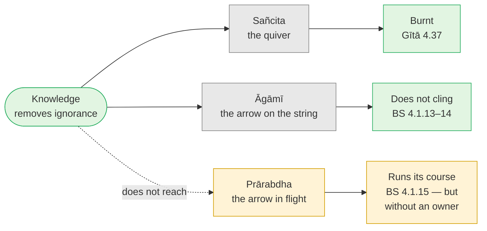

# Day 37 — Knowledge and the Leftover Personality

> **Today's one idea:** After knowledge, habits, moods, temperament and *prārabdha* karma keep running. Knowledge doesn't stop them appearing; it changes their *ownership*. What drops is "I am the doer, I am the enjoyer" — Day 12's superimposition — not the personality it was superimposed on.
> **Reading time:** ~35 min · **Prereqs:** [Day 15](../../02-vicharana/days/day-15-maya-and-ishvara.md), [Day 24](../../03-tanumanasa/days/day-24-vasanas-three-practices.md), [Day 36](./day-36-sthitaprajna.md)
> **Primary source for today:** Shankara, *Brahma-Sūtra-Bhāṣya* **4.1.13–4.1.15** — Swami Gambhirananda (trans.), Advaita Ashrama, 1965. Supporting: Vidyāraṇya, *Pañcadaśī* ch. 7 (*Tṛpti-dīpa*), the section on *prārabdha*, c. 7.143–7.180 in Swahananda (the three-fold division at 7.152–162); Vidyāraṇya, *Jīvanmukti-viveka*.
> **Before you start:** Without looking — *Gītā 2.59 says abstaining removes the object but not the* taste*. What removes the taste? And what two words in 2.71 name the root of all the sthitaprajña's marks?*

---

## The hook (3 min)

You switch off a ceiling fan. The blades keep turning for most of a minute. Nobody stands under it thinking the switch is broken.

Now a person. Call her Asha. Over months of study something has become clear to her that doesn't go away: what she is was never the body-mind, which is seen; it's the seeing. A week later her teenage son leaves the car on empty and she snaps at him, loud and out of all proportion. Afterwards, in the kitchen, she concludes: *"I didn't get it. If I'd really understood, that couldn't have happened."*

She is looking at the blades and deciding the switch is broken. Mixing those two up is one of the commonest ways stage-4 knowledge gets abandoned just as it starts to hold.

---

## Building the intuition (12 min)

### The archer's three arrows

[Day 21](../../03-tanumanasa/days/day-21-karma-yoga.md) gave you an archer. The tradition gives her three kinds of arrow:

- **The quiver** — arrows stored but not yet used: results accumulated from the past that haven't started to play out.
- **The arrow on the string** — the one about to be loosed: actions done now, which will bear results later.
- **The arrow in flight** — already loosed. Nothing she does now can recall it.

Mid-hunt, she realises the "tiger" she's aiming at is a cow. She sets the quiver aside and lowers the bow. But the arrow already in the air keeps going until it lands. Her new knowledge is complete and correct; it just doesn't reach back into the air. (The *Vivekacūḍāmaṇi* tells it this way, 451–453 in Madhavananda's numbering: an arrow loosed at a "tiger" doesn't stop when the target turns out to be a cow.)

### The potter's wheel and the burnt rope

A potter spins the wheel and takes his hand away; it keeps turning on momentum and slows gradually. You can't stop it by deciding it shouldn't turn. Asha's snap was the wheel. The push was given years ago.

A rope burnt right through in a fire keeps its shape in the ash — coils, twist and all. Try to tie anything with it and it falls apart. Ramana used this image for the knower's ego (*Talks* §286: "like the skeleton of a burnt rope"): the form remains (a name, a voice, preferences, a laugh), but nothing can be *tied* to it any more — no grievance, no "this proves I'm worthless", no "this proves I'm someone".

### The sunrise you still see

You've known since school that the sun doesn't rise; the earth turns. Every morning you still *see* it rise. Knowledge didn't change the appearance; it changed what the appearance *means*. Advaita's term is *bādhitānuvṛtti*, "the continuation of what has been sublated": the mirage keeps shimmering after you know there's no water; you just don't walk towards it with a bucket.

---

## The formal picture (12 min)

### Three kinds of karma

| Name | The image | What it is | What knowledge does to it |
| --- | --- | --- | --- |
| ***Sañcita*** ("accumulated") | The quiver | Results of past actions not yet begun to fructify | Burnt — "the fire of knowledge reduces all karma to ashes" (Gītā 4.37) |
| ***Āgāmī*** ("coming"), also *kriyamāṇa* | The arrow on the string | Results of actions done now and after knowledge | Doesn't cling — like water on a lotus leaf (Chāndogya 4.14.3) |
| ***Prārabdha*** ("begun") | The arrow in flight | Karma that has already begun to fructify — it produced *this* body-mind and is running its course | Untouched — runs until the body falls |

### What the *Brahma Sūtra* says

- **4.1.13:** when Brahman is known, earlier wrongdoing is destroyed and later wrongdoing doesn't cling (Shankara cites Chāndogya 4.14.3's lotus leaf).
- **4.1.14:** the same for merit — good karma binds too.
- **4.1.15:** but only earlier works *that have not begun* to bear fruit are destroyed; those that have begun continue until the body falls. Support: Chāndogya 6.14.2 — for the knower, delay only "as long as I am not released".

Commenting on 4.1.15, Shankara uses the potter's wheel — one must wait until what has begun to move comes to rest — and adds (paraphrased): when someone is sure in their own heart that they know Brahman *and* still bears a body, how can another deny it? The body's continuing isn't an embarrassment for the theory. Knowledge ends ignorance, and ignorance isn't what keeps the wheel turning.

### Why knowledge can't touch *prārabdha*

Since [Day 4](../../01-shubheccha/days/day-04-the-tenth-man.md), knowledge has had one job: removing ignorance of what is already the case. It isn't an action, so it doesn't undo the results of action. *Prārabdha* isn't ignorance; it's the body-mind's momentum, started *under* ignorance but now running within the empirical order — what [Day 15](../../02-vicharana/days/day-15-maya-and-ishvara.md) called Īśvara, the total that gives actions their results. The knower's body-mind, temper included, runs on that order's laws, and all of it is *mithyā* ([Day 13](../../02-vicharana/days/day-13-mithya.md)): real to deal with, not real *as the Self*. Knowledge doesn't promise to rewrite Īśvara's order — only that the order is no longer taken to be "me".

### What continues and what changes

| Continues after knowledge | Changes after knowledge |
| --- | --- |
| Preferences (tea over coffee, quiet over crowds) | The preference no longer decides whether "I" am full |
| Temperament — quick, slow, warm, reserved (Gītā 3.33: even the wise act in keeping with their own nature) | Temperament is seen as a feature of the body-mind, not a verdict on the Self |
| Moods, tiredness, illness, ageing | No "I am depressed" in the sense of *I, the Self, am now less* |
| Skills, memory, habits, *vāsanās* still unwinding | No new owner feeding them; they weaken like roasted grain that can't sprout (Pañcadaśī 7.163–165) |
| Pleasant and painful experiences (*prārabdha*) | Experienced without "I am the doer" (*kartṛtva*) and "I am the enjoyer/sufferer" (*bhoktṛtva*) |

The right-hand column is [Day 12](../../02-vicharana/days/day-12-adhyasa.md)'s *adhyāsa* undone: "I am the doer" puts the intellect's activity on the seer; "I am the sufferer" puts the mind's pain there. Knowledge removes exactly that superimposition, no more and no less. What it was superimposed on — the personality — stays: seen, functioning, *mithyā*.

### Vidyāraṇya's two refinements

**Pañcadaśī ch. 7.** If the knower has no "I am the enjoyer", who experiences *prārabdha*? Vidyāraṇya's answer: the experiences are real at the level of the body-mind and are lived through, but not *owned*. He sorts *prārabdha* by how it arrives — through one's own desire, without desire, or through others' wishes (*icchā*, *anicchā*, *parecchā* — Pañcadaśī 7.152–162). Desires still arise in the knower, he adds, but like roasted grain they can't germinate into new binding karma (7.163–165). The knower may still want things — as preference, not as a hunt for fullness: yesterday's 2.55, with its mechanism.

**Jīvanmukti-viveka.** If knowledge is complete, why practise? Because strong *vāsanās* plus *prārabdha* can keep disturbing the knower's peace even though they can't undo the knowledge. So [Day 24](../../03-tanumanasa/days/day-24-vasanas-three-practices.md)'s *mano-nāśa* and *vāsanā-kṣaya* continue, to protect the knowledge and let the freedom be enjoyed — two of the five purposes of *jīvanmukti* in his ch. 4 (preservation of knowledge, austerity, absence of contention, ending of sorrow, the dawning of supreme bliss). Day 24's spring, still unwinding.

**From the highest standpoint.** Ramana sometimes said that for the knower there is no *prārabdha*: once the doer is gone, whose karma is it? *Prārabdha* talk is for the onlooker who still sees a body (*Talks* §§115, 383; *Ulladu Nārpadu Anubandham* v. 33: when the husband dies, none of the wives escapes widowhood — when the doer goes, all three karmas go). That doesn't contradict the *Brahma Sūtra*; it's the same fact from the other standpoint. Keep the standpoints apart and both are true.

---

## Where it breaks / what it is not (4 min)

**"It's just my *prārabdha*."** The ugliest misuse, and a relative of [Day 33](./day-33-obstacles.md)'s standpoint confusion: a highest-standpoint word used to settle an empirical question. The snap lands on the son. Apologise, repair, keep practising. "Prārabdha" describes the momentum; it doesn't excuse feeding it.

**"Real knowers have no personality."** Gītā 3.33 says the opposite, and the tradition's knowers were strikingly unlike each other — silent, argumentative, playful, brusque. Freedom from ownership is the mark, not uniform temperament.

**"If the habits keep going, nothing has changed."** The change is where it mattered: the knot ([Day 26](../../03-tanumanasa/days/day-26-ramana-who-am-i.md)). Without an owner, habits have nothing to protect or prove; they weaken, and new grievances don't tie on.

**"So any reaction can be filed as leftover momentum."** Honesty needed here. *Viparīta-bhāvanā* is contrary *conviction* — "I am this" reasserting itself; leftover *prārabdha* is momentum *without* that conviction. The test is ownership and aftermath: a story, a grudge, a need to be right? Then the knot is still tying, and the remedy is *nididhyāsana*, not a label.

---

## Try it yourself (10 min)

### 1. Retrieval first

Close the page. From memory: (a) name the three kinds of karma, give the archer image for each, and say what knowledge does to each; (b) give the sūtra location that says *prārabdha* continues, and the image Shankara uses there; (c) state in one line what knowledge removes from the personality.

Hint

Quiver, string, flight. The sūtra is in the fourth chapter, first section. For (c), Day 12 — two "I am the…" claims.

Model answer

(a) <em>Sañcita</em> — the quiver, accumulated karma not yet fructifying — burnt by knowledge (Gītā 4.37). <em>Āgāmī</em> — the arrow on the string, results of present and future action — doesn't cling, like water on a lotus leaf (BS 4.1.13–14; Chāndogya 4.14.3). <em>Prārabdha</em> — the arrow in flight, the karma that produced this body-mind — runs its course until the body falls. (b) <em>Brahma Sūtra</em> 4.1.15, with Shankara's potter's wheel that keeps turning after the push (scriptural support: Chāndogya 6.14.2). (c) Knowledge removes the superimposition "I am the doer, I am the enjoyer" (<em>kartṛtva–bhoktṛtva</em>, Day 12's <em>adhyāsa</em>) — not the personality it was superimposed on.

### 2. Direct application — a personality inventory

Write down five things about yourself likely to survive any amount of knowledge: a **preference**, a **trait of temperament**, a **habit**, a recurring **mood**, a **body condition**. For each, slowly:

1. **Seen?** Notice it as an object — describable, so appearing to awareness.
2. **Find the claim.** Where is "I am this" attached? ("I *am* an anxious person.")
3. **Separate the two.** Say: *"The trait continues. The claim was never true."* Does anything in the trait have to change for the claim to drop?

Then, the next time irritation arises in real life, run it live: *wheel spinning — seen — whose?*

Hint

Don't pick only "bad" traits. A preference you like ("I'm a morning person") is owned just as much as one you dislike.

What to look for

The usual surprise: the trait doesn't need to change for the claim to drop. <em>"Impatience: seen — a tightening, a quickened thought. Claim: 'I'm an impatient person.' Separated: the tightening still happens; 'who I am' was an extra layer."</em> That layer is <em>adhyāsa</em> (Day 12); noticing it as an object is <em>dṛg-dṛśya-viveka</em> (Day 6) on your most personal content. If dropping "I am anxious" seems to require the anxiety to vanish first, you're still expecting knowledge to work on the blades rather than the switch.

### 3. Stretch — the teacher who lost his temper

A friend tells you: "My teacher is supposed to be realised, but I saw him lose his temper with a volunteer. So he's a fraud." Write a reply that (a) uses today's idea honestly, and (b) doesn't turn into an excuse for anything at all. Combine with Day 34's ethical check and Day 36's markers.

Hint

Separate three questions: does temper prove ignorance? What would recovery and ownership show? Where does accountability start, whatever his knowledge?

Worked answer

"One flare proves little either way. Knowledge doesn't promise a new temperament (Gītā 3.33), and the body-mind's momentum runs on (BS 4.1.15). The aftermath tells you more — Day 36's markers: quick recovery, no grudge, repair with the volunteer, a pattern that weakens. But knowledge never puts anyone outside accountability (Day 34's ethical check). If the temper is a harmful <em>pattern</em>, or is explained away as 'my prārabdha' or 'nobody here to be angry', that's Day 33's standpoint confusion, whatever his realisation, and stepping back is reasonable. You needn't decide whether he's realised — only whether the situation is good for you and others."

### 4. Spaced callback — Days 21 and 33

(a) **Day 21:** name karma yoga's two attitudes. Then: how does *prasāda-buddhi* — receiving results as given by the total — prepare someone to live well with their own *prārabdha*, before and after knowledge? (b) **Day 33:** state the difference between *viparīta-bhāvanā* and leftover *prārabdha*, and name the modern obstacle that "it's just my prārabdha" most resembles.

Hint

(a) Whose order delivers the arrow in flight? (b) Conviction vs momentum. And which obstacle uses a highest-standpoint sentence to answer an empirical question?

Model answer

(a) <a href="../../03-tanumanasa/days/day-21-karma-yoga.md">Day 21</a>: <em>Īśvara-arpaṇa-buddhi</em> (action as offering to the total) and <em>prasāda-buddhi</em> (result received as given by the total). <em>Prārabdha</em> is the arrow in flight — results already set going in Īśvara's order (Day 15). Meeting what arrives without resentment or elation is how the knower lives with <em>prārabdha</em>: effortful before knowledge, effortless after (no owner left to resent) — Day 36's marks-as-means again. (b) <a href="./day-33-obstacles.md">Day 33</a>: <em>viparīta-bhāvanā</em> is the contrary conviction "I am this body-mind" reasserting itself; leftover <em>prārabdha</em> is momentum with no such conviction. The test is ownership — a story, a grudge, a "me" that was wronged. "It's just my prārabdha," used to excuse harm, is a cousin of the "nobody here" bypass: <em>pāramārthika</em> truth used to dodge a <em>vyāvahārika</em> responsibility.

**Transfer — apply it:**

> Pick the one trait or reaction of yours you most expect enlightenment to delete. Write one sentence: *the input* (the trait as it shows up — e.g. "I get curt when I'm hungry"), *what today's idea does to it* (sorts the momentum, which may continue, from the ownership claim "I am this", which knowledge removes), and *the output* (what you'll do the next time it fires — e.g. "notice it as the wheel spinning, check for the claim, repair if it landed on someone, eat"). If nothing comes to mind in 60 seconds, re-read the hook and try again.

---

## Connect it back

Yesterday's sthitaprajña was steady under pleasure and pain, which left the question: why do knowers still have tempers and tastes? The three kinds of karma answer it. Knowledge burns the quiver and lowers the bow, but the arrow in flight — *prārabdha* — runs on (BS 4.1.15). What knowledge removes is the owner: "I am the doer, I am the enjoyer." The personality carries on; it stops being *you*. Asha's switch was off; the blades were still turning. Tomorrow turns from living the knowledge to deepening it: a 12-month plan for reading the primary texts yourself.

**Sharp question:** *If the personality carries on after knowledge, how would you tell — in yourself, honestly — the difference between a wheel still spinning and a hand still pushing it?*

---

## Suggested readings for today

**Required if you have 15 extra minutes:** Shankara, ***Brahma-Sūtra-Bhāṣya* 4.1.13–4.1.15** (Gambhirananda, Advaita Ashrama, 1965). It's short. Read for three things: the lotus-leaf citation at 4.1.13, the extension to merit at 4.1.14, and the potter's wheel and the "conviction in one's own heart" remark at 4.1.15.

**If you want the deep version:**
- Vidyāraṇya, ***Pañcadaśī*, ch. 7 (*Tṛpti-dīpa*)**, the section on *prārabdha* and the knower's experiences, c. 7.143–7.180 (Swahananda trans.) — the most practical classical treatment of how a knower lives with leftover karma; Swami Paramarthananda's Pañcadaśī lectures take it slowly.
- Vidyāraṇya, ***Jīvanmukti-viveka*** (Moksadananda trans.) — the sections on why *vāsanā-kṣaya* and *mano-nāśa* still matter after knowledge (chs. 2–3), and on the purposes of living liberation (ch. 4). The direct sequel to Day 24.
- Bhagavad Gītā **3.27–3.33** and **4.36–4.37** with Shankara (Gambhirananda, 1984) — the guṇas act, the deluded one thinks "I am the doer" (3.27); even the wise act according to their nature (3.33); the fire of knowledge burns karma to ash (4.37).

---

## Navigation

← **Previous:** [Day 36 — The Sthitaprajña](./day-36-sthitaprajna.md)
→ **Next:** [Day 38 — From Course to Scripture](./day-38-from-course-to-scripture.md)
