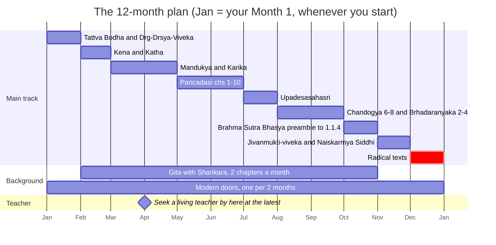
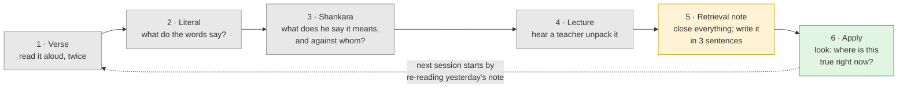

# Day 38 — From Course to Scripture

> **Today's one idea:** The course gave you the concepts; the texts must now be read in a *sequence* where each prepares the next — and read *through* a teacher's commentary, not around it.
> **Reading time:** ~40 min · **Prereqs:** all previous days; especially [Day 20](../../02-vicharana/days/day-20-shravana-manana-nididhyasana.md), [Day 24](../../03-tanumanasa/days/day-24-vasanas-three-practices.md), [Day 30](./day-30-where-the-paths-converge.md)
> **Primary source for today:** the [Course Shelf](../../../bibliography.md) itself — and, as the model of how a text announces its own reader, the opening of Sadānanda's *Vedāntasāra* (Swami Nikhilananda, trans., Advaita Ashrama).
> **Before you start:** Without looking — *Day 37 said that habits and* prārabdha *continue after knowledge. What exactly continues, and what exactly changes? Answer in two sentences, one for each.*

---

## The hook (3 min)

A club chess player finishes a good course on strategy. She can name the ideas: open files, weak squares, the bad bishop. Delighted, she buys a world champion's complete games — moves only, no notes — and sets up game one.

By move fifteen she is lost. Every move is on the page; what she cannot see is *why* the champion played a quiet rook move instead of the obvious capture. The concepts she learned are all in that game, but compressed, operating three moves ahead of where she is looking.

A friend hands her the same games annotated by a strong coach and ordered from simple to complex. Now each move arrives with its reason; the early games use one or two ideas, the last ones combine five. Within a month she is predicting the annotator's comments before reading them.

That is exactly where you stand today. The course was the strategy course. The Upaniṣads are the champion's games. Today is about which book to open first — and why you want the annotations.

---

## Building the intuition (12 min)

### Two things the chess player needed

**First, an order.** The champion's games are hard not because they use secret ideas but because they use *many* at once. A good order introduces them one or two at a time, so each game prepares the next. Read the hardest first and you don't merely fail — you form wrong habits of reading ("I guess he just felt like it").

**Second, an annotator.** The notes are a second mind that has already traced the reasons. They don't replace the moves; they make them readable. A coach beside you is better still — the coach can see *your* confusion, which no book can.

### Why scripture needs both

An Upaniṣad is extremely compressed: Bṛhadāraṇyaka 2.4.5 packs all of [Day 20](../../02-vicharana/days/day-20-shravana-manana-nididhyasana.md) into one sentence; the Māṇḍūkya packs Days 8 and 10 into twelve mantras. Read cold, they look like poetry or assertion. After the course you can recognise what they are doing — if you meet them in an order where each text uses ideas the previous one made familiar.

The commentary matters for a reason specific to this subject. On [Day 4](../../01-shubheccha/days/day-04-the-tenth-man.md) you learned that the Self is known through *śabda-pramāṇa*. But a word works only when its *intended meaning* is grasped. "Tat tvam asi" read literally is false ([Day 16](../../02-vicharana/days/day-16-tat-tvam-asi.md)): a limited person is not the omniscient cause of the universe. It becomes true only through *lakṣaṇā*, the method of implied meaning. The commentary is where that method is applied, sentence by sentence. Without it, the pointer still exists but you may be looking at the wrong end of it.

### The Tenth Man, one more time

A text is the traveller's sentence written down; the commentary explains which way the finger points; a living teacher is the traveller himself, able to tap *this* chest.

---

## The formal picture (14 min)

### The tradition's own sequence

The tradition sorts its texts into two tiers:

| Tier | Sanskrit | What it is | Examples on our shelf |
| --- | --- | --- | --- |
| Canon | ***Prasthāna-traya*** — the "three starting points" | Upaniṣads (*śruti*, revealed), Gītā (*smṛti*, remembered), Brahma Sūtra (*nyāya*, systematic reasoning) | Gambhirananda's *Eight Upaniṣads*; Chāndogya; Bṛhadāraṇyaka; Gītā-bhāṣya; BSBh |
| Manuals | ***Prakaraṇa-grantha*** — "topic texts" | Short works that systematise the canon's vocabulary for a student | *Tattva Bodha*, *Dṛg-Dṛśya-Viveka*, *Pañcadaśī*, *Upadeśasāhasrī*, *Vedāntasāra* |

The rule of thumb: **manuals before canon, and within the canon, Upaniṣad → Gītā → Sūtra.** Manuals give the vocabulary; the Upaniṣads are the *pramāṇa* itself; the Gītā applies it to a life of action; the Sūtra-bhāṣya defends it against every rival school, which assumes you already know what is being defended.

### How a text tells you when to read it

Classical texts open with four preliminaries, the ***anubandha-catuṣṭaya*** (the *Vedāntasāra* names them at §5, then treats each in turn):

1. ***Adhikārī*** — who the text is for (usually: one with the four qualifications of [Day 3](../../01-shubheccha/days/day-03-the-four-qualifications.md));
2. ***Viṣaya*** — its subject matter (the identity of *jīva* and Brahman);
3. ***Prayojana*** — its result (the *Vedāntasāra*: removal of ignorance about that identity and the attainment of one's own bliss — the end of sorrow);
4. ***Sambandha*** — how text and subject are related (the text reveals; the subject is revealed).

Open every text on the plan with these four questions. A text whose *adhikārī* is one already established in the teaching (the Aṣṭāvakra, say) is announcing that it belongs last — [Day 34](./day-34-radical-texts.md)'s rule, stated by the texts themselves.

### The 12-month plan

One **main track** (one text at a time) and two **background tracks** running alongside: the Gītā, two chapters a month; and one modern teacher per two months, so that the doors of Days 26–29 stay open while you read. All works are on the [Course Shelf](../../../bibliography.md).

| Month | Text & translation | Why now | Pair with (lecture / commentary) | Course days it deepens |
| --- | --- | --- | --- | --- |
| 1 | *Tattva Bodha* (via the lectures) and *Dṛg-Dṛśya-Viveka* (Nikhilananda) | Vocabulary first; and the rate-limiting skill in its own text | Paramarthananda, *Tattva Bodha* lectures; Sarvapriyananda, *Dṛg-Dṛśya-Viveka* talks | 3, 6, 7, 8, 9 |
| 2 | Kena and Kaṭha, with Shankara (Gambhirananda, *Eight Upaniṣads* vol. 1) | Short Upaniṣads on the knower and the turning inward; first practice reading *bhāṣya* | Comans, *Method*, on how Shankara uses śruti; Rambachan, *Accomplishing the Accomplished* | 2, 5, 17 |
| 3–4 | Māṇḍūkya with Gauḍapāda's *Kārikā* and Shankara (Gambhirananda, vol. 2) | The three states and *turīya* at full strength; needs Months 1–2's vocabulary; Kārikā 3–4 is the hardest stretch on the shelf | Sarvapriyananda, *Māṇḍūkya* series; Thompson, *Waking, Dreaming, Being*; King on the Buddhist context | 8, 10, 18 |
| 5–6 | *Pañcadaśī*, chs. 1–10 (Swahananda) | A complete system pressed into practice; Month 5 the five *vivekas*, Month 6 the five *dīpas* | Paramarthananda, *Pañcadaśī* lectures | 4, 7, 13, 16, 31, 33, 37 |
| 7 | *Upadeśasāhasrī*, prose part, then selected verse chapters (Mayeda) | Shankara's own voice, undisputed; prose ch. 1 is about how to *teach* — preparation for Day 39 repeated for life | Mayeda's introduction; Comans | 4, 12, 16, 17 |
| 8–9 | Chāndogya chs. 6–8 (Gambhirananda); Bṛhadāraṇyaka chs. 2–4 (Madhavananda) | The two great Upaniṣads where the mahāvākyas and Yājñavalkya's dialogues live; long commentaries now readable | Satchidanandendra, *Method of the Vedanta* | 1, 5, 8, 13, 16, 17, 20 |
| 10 | Brahma-Sūtra-Bhāṣya: *Adhyāsa Bhāṣya* and 1.1.1–4 (Gambhirananda) | The densest prose; defends what Months 1–9 taught | Ingalls, "Whose is Avidyā?"; Padmapāda, *Pañcapādikā* (optional) | 3, 12, 15, 23 |
| 11 | *Jīvanmukti-viveka* (Moksadananda); *Naiṣkarmya Siddhi* (Alston) | Living with the knowledge: the three practices and the knowledge-only argument | Dayananda, *Introduction to Vedanta*; Swartz | 24, 31, 36, 37 |
| 12 | *Aṣṭāvakra Saṃhitā* (Nityaswarupananda); Avadhūta Gītā (Day 34's edition); *Vasiṣṭha's Yoga* selections (Venkatesananda) | The radical texts — last, as tests of understanding, not instructions | Re-read [Day 34](./day-34-radical-texts.md) first | 18, 34, and "Beyond stage 4" below |
| 2–10 | **Background:** Gītā with Shankara (Gambhirananda), two chapters a month | Applies the knowledge to action and devotion; too long for one month, too important to skip | Dayananda, *Bhagavad Gita Home Study Course*; Madhusūdana's *Gūḍhārtha-dīpikā* on chs. 7 and 12 | 2, 21, 22, 23, 36 |
| 1–12 | **Background:** modern doors, one per two months — *Nān Yār?* and *Talks*; *I Am That*; Atmananda's *Notes*; Spira; Krishnamurti (and the Bohm dialogues); Dayananda | Keeps the looking alive beside the reading; each maps back onto the classical machinery | Your Day 26–29 "Maps to" tables | 26, 27, 28, 29, 30 |

### How to read a scripture with commentary

Use the same six steps for every session, whether you have twenty minutes or two hours.

- **Step 2 before step 3:** write the literal sense first, or you never notice *where* Shankara departs from it — which is where the teaching happens.
- **In step 3, ask "against whom?"** Much of the *bhāṣya* answers an objector (*pūrvapakṣa*); the objector tells you which confusion is being removed.
- **Step 5** is this course's retrieval exercise, moved into your reading life. **Step 6** is Day 30's "enquiry does the looking". A verse you have not tried to see, you have only read.

### When to seek a living teacher

The tradition is unambiguous that the teaching passes from teacher to student: Muṇḍaka 1.2.12 sends the seeker to a teacher both learned in the texts (*śrotriya*) and established in Brahman (*brahma-niṣṭha*); Gītā 4.34 adds humility, questions and service. Seek one — in person, or a sustained lecture course with real access to questions — when:

- **the same doubt returns after you've answered it twice** — *saṃśaya* that reading isn't reaching, or habit disguised as doubt ([Day 33](./day-33-obstacles.md));
- **two texts seem to contradict each other** and you can't locate the difference of standpoint (*vyāvahārika* vs *pāramārthika*, [Day 13](../../02-vicharana/days/day-13-mithya.md));
- **your reading is producing an owner** — "I understand Vedānta now";
- **the Kārikā stops you cold** — and in any case by the gantt's milestone;
- **anything destabilises you** — dissociation, panic, the "nobody's here" flatness of Day 33. A teacher, and if needed a clinician, before more reading.

Test a teacher by the traditional pair — do they teach *from the texts*, and live what they teach? — and be wary of anyone selling experiences or requiring obedience.

### Beyond stage 4

This course stops at *sattvāpatti*. The Yoga Vasiṣṭha names three further stages: **5, *asaṃsakti*** (non-attachment so complete that objects no longer catch); **6, *padārthābhāvanā*** (objects no longer present themselves as independent things); **7, *turyagā*** ("gone to the fourth" — abiding as *turīya*). They describe a ripening, not a trainable skill, so they are pointed at, not taught. Where to read about them:

- Venkatesananda, *Vasiṣṭha's Yoga* — the seven *bhūmikās* in the Utpatti Prakaraṇa, sarga 118 (headed **III:118** — the abridgement keeps the full text's sarga numbers); they return at VI.1:126.
- Vidyāraṇya, *Jīvanmukti-viveka*, ch. 4, which quotes Vasiṣṭha's seven stages and maps stages 4–7 onto four grades of the knower of Brahman — read it in Month 11 with this question in mind.
- *Talks with Sri Ramana Maharshi* §256, where Ramana lists the seven *bhūmikās* and the four grades of knower, and says the differences among stages 4–7 lie in the momentum of *prārabdha*, not in the knowledge (see also Upadeśa Mañjarī / *Spiritual Instruction*, ch. 4).

Read them as a map, not a scoreboard: measuring yourself against stage 6 is Day 33's experience-chasing in a new costume.

---

## Where it breaks / what it is not (4 min)

**"The plan is a syllabus to finish."** It is a sequence, not a deadline. What breaks it is skipping ahead, not slowing down.

**"Skip the manuals; the Upaniṣad is the real thing."** The Upaniṣad *is* the *pramāṇa* — which is why you prepare for it. Its words work only in their intended sense, and the manuals teach that sense.

**"The commentary is an authority I must accept."** The *bhāṣya* is a reasoned reading, open to *manana*. You read it closely because it shows implied meaning at work, not because disagreement is forbidden.

**"Modern teachers are a distraction"** — or "the classics are scaffolding." Day 30 settled this: different entry points, one destination. The background track keeps both alive.

**"More reading = more progress."** Reading is *śravaṇa*. Without *manana* and *nididhyāsana* it becomes collecting — the library version of experience-chasing.

---

## Try it yourself (10 min)

### 1. Retrieval first

Close the page. From memory: (a) name the three *prasthānas* and what kind of source each is; (b) name the four *anubandhas*; (c) list the six steps of the reading method in order; (d) give the main-track order of the twelve months, and one reason the Brahma-Sūtra-Bhāṣya comes late.

Hint

(a) Revealed, remembered, reasoned. (b) Who, what, why, how-related. (c) Three steps of reading, one of listening, one of writing, one of looking. (d) Manuals, short Upaniṣads, three states, a manual, Shankara's own, two great Upaniṣads, the Sūtra, living liberation, radical texts.

Model answer

(a) Upaniṣads (<em>śruti</em>), Gītā (<em>smṛti</em>), Brahma Sūtra (<em>nyāya</em>). (b) <em>Adhikārī</em> (who it is for), <em>viṣaya</em> (subject), <em>prayojana</em> (result), <em>sambandha</em> (relation between text and subject). (c) Verse → literal → Shankara → lecture → retrieval note → apply. (d) Tattva Bodha + Dṛg-Dṛśya-Viveka → Kena + Kaṭha → Māṇḍūkya + Kārikā → Pañcadaśī → Upadeśasāhasrī → Chāndogya 6–8 + Bṛhadāraṇyaka 2–4 → BSBh preamble to 1.1.4 → Jīvanmukti-viveka + Naiṣkarmya Siddhi → radical texts. The BSBh comes late because it defends the teaching against rival schools: you must already know what is being defended, and its prose is the densest on the shelf. 
If you put the Aṣṭāvakra anywhere but last, re-read Day 34's reason before going on.

### 2. Direct application — one full session, and a live look

Run the six steps on Kaṭha Upaniṣad **2.1.1** (Gambhirananda, *Eight Upaniṣads* vol. 1): the senses were made to face outward, so one sees what is outside and not the inner Self; some wise one, seeking immortality, turned the gaze inward and saw the Self (paraphrase). Take 20 minutes. For step 6, do this: sit, eyes open; name three seen things in front of you; then ask *what is seeing them?* and notice that the answer cannot be another item in the room. Write the retrieval note before you check the model.

Hint

For step 3, ask what "turning the gaze inward" can mean if the Self is not an object that could be found by looking in a new direction.

What to look for

Step 2, literal: "the senses point out; a rare person turns them in and sees the Self." Step 3: the commentary must stop "inward" becoming a new direction — looking at thoughts and feelings is still looking at the seen. The turning is from objects to the <em>knower of objects</em> (Kena 1.2's "ear of the ear" makes the same move). Step 5, a good note: "The senses report only the seen. 'Turning inward' means recognising the seer, not finding a new object. Day 6 in verse." Step 6: if your answer to "what is seeing?" was an image, a feeling behind the eyes, or a 'me' in the head — each of those was <em>also seen</em>. That catch is <em>dṛg-dṛśya-viveka</em> as a live act. If you caught it, the verse has been read; if you only agreed, it has been heard.

### 3. Stretch — adapt the plan

You can manage only 20 minutes a day, and you have a Buddhist friend who will read alongside you. Redesign two things: (a) what you cut or stretch so the sequence survives at 20 minutes, and (b) where you insert material for your friend without breaking the "each text prepares the next" rule.

Hint

What must never be cut: the order, step 5, step 6. What can stretch: the calendar.

Worked answer

(a) Keep the order; let the calendar stretch to 18–24 months. Move step 4 (lecture) to alternate days rather than dropping step 5 or 6 — the note and the looking are what turn reading into knowledge. In the Pañcadaśī, read chs. 1, 3, 5, 7, 9 first (the ones the course used). (b) The natural joint is Months 3–4: alongside Kārikā ch. 4 (<em>Alātaśānti</em>, with its Buddhist vocabulary), read Richard King's <em>Early Advaita Vedānta and Buddhism</em> together. The sequence stays intact, and Day 30's convergence principle sets the reading order: the shared analysis (everything findable is not-self) before the difference in what remains.

### 4. Spaced callback — Days 24 and 30

(a) [Day 24](../../03-tanumanasa/days/day-24-vasanas-three-practices.md): name the three practices that must grow together. A reading plan feeds mainly one of them. Which — and what will you do each week of the year for the other two? (b) [Day 30](./day-30-where-the-paths-converge.md): write the four invariants from memory, then pick any two months of the plan and say which invariant each month's text presses hardest.

Hint

(a) Knowledge, mind, latent tendencies. (b) Day 30's one idea ends: "Scripture supplies the pointer and enquiry supplies the looking." The invariants are what every source agrees on about the seeker and the shift.

Worked answer

(a) <em>Tattva-jñāna</em>, <em>mano-nāśa</em>, <em>vāsanā-kṣaya</em>. The plan feeds <em>tattva-jñāna</em>; alone it stalls (Day 24): a restless mind can't hold a verse long enough for step 6, and an unexamined <em>vāsanā</em> turns reading into self-improvement. So: a daily sitting for <em>mano-nāśa</em>, and one live situation a week where you practise karma yoga or Yoga Sūtra 1.33's four attitudes for <em>vāsanā-kṣaya</em> — logged in the same notebook as your retrieval notes. 
(b) Day 30's four: (i) you already are what you seek; (ii) the obstacle is misidentification, not absence; (iii) the shift is recognition, not acquisition; (iv) a prepared mind is needed. Example pairing: Month 1 (Dṛg-Dṛśya-Viveka) presses (ii) hardest — the seer mistaken for the seen; Month 10 (the <em>Adhyāsa Bhāṣya</em> and BSBh 1.1.4) presses (ii) and (iii) — bondage is superimposition, and liberation is not produced, reached, modified or purified. Month 12's Aṣṭāvakra presses (i); Month 11's Jīvanmukti-viveka presses (iv). If you could not recall all four, re-read Day 30 before Day 39 — the capstone needs them.

**Transfer — apply it:**

> Think of a skill you want to take from "course" to "practice" in your working life — a framework you've learned, a language, a codebase you've been introduced to. Write one sentence: *the input* (the primary material you'd now have to read — real code, real contracts, real papers), *what today's idea does to it* (orders it so each piece prepares the next, and attaches a commentator or mentor who has traced the reasons), and *the output* (a first-month, second-month, third-month sequence and the person you'd ask). If nothing comes to mind in 60 seconds, re-read the hook and try again.

---

## Connect it back

Day 37 showed that knowledge doesn't remove the personality; it changes who owns it. Today handed that knowledge back to its source: the texts the course was built from, now in an order where each one prepares the next, read with a commentator beside you and, before long, a teacher. Tomorrow you stop being the reader and become the traveller — you will point at someone else's chest and say, as clearly as you can, *you are the tenth*.

**Sharp question:** *Which text on this plan are you most tempted to read out of order — and what does that temptation tell you about which stage you think you are at?*

---

## Suggested readings for today

**Required if you have 15 extra minutes:** Sengaku Mayeda (trans.), *A Thousand Teachings*, the **introduction's account of Shankara's teaching method** and **prose part, ch. 1** — Shankara describing, step by step, how to teach a student who asks how to be free. It is the best preview of tomorrow, and it shows what the commentator in step 3 is actually doing.

**If you want the deep version:**
- Michael Comans, *The Method of Early Advaita Vedānta* (2000) — the chapters on the role of scripture and on how Shankara reads the Upaniṣads; the best guide to *why* this plan puts the commentary in the middle of every session.
- Anantanand Rambachan, *Accomplishing the Accomplished* (1991) — the case that the Upaniṣad is a *pramāṇa*, which is the reason it is worth reading slowly, in order, with help.
- Swami Nikhilananda (trans.), *Vedāntasāra* — the opening sections on the *anubandha-catuṣṭaya* (from §5); ten minutes that teach you how to open any text on the plan.

---

## Navigation

← **Previous:** [Day 37 — Knowledge and the Leftover Personality](./day-37-knowledge-and-leftover-personality.md)
→ **Next:** [Day 39 — CAPSTONE: Teach *Aham Brahmāsmi*](./day-39-capstone.md)
