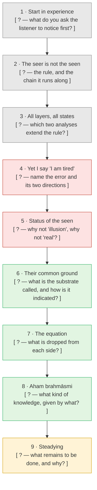

# Day 39 — CAPSTONE: Teach *Aham Brahmāsmi*

> **Today's one idea:** You understand "I am Brahman" when you can lead a sceptical listener from their own experience to it — through two doors — without notes, without hiding behind "you just have to experience it".
> **Working time:** 5–7 days of preparation (~45 min/day), one 20-minute session, and a 7-day *nididhyāsana* log running alongside · **Prereqs:** all previous days — especially [Day 32](./day-32-drill-i-am-brahman.md), [Day 30](./day-30-where-the-paths-converge.md), [Day 20](../../02-vicharana/days/day-20-shravana-manana-nididhyasana.md)
> **Primary source for today:** Bṛhadāraṇyaka Upaniṣad 1.4.10 (*aham brahmāsmi*), with Shankara's commentary — Swami Madhavananda (trans.), Advaita Ashrama, 1934. For method: Shankara, *Upadeśasāhasrī*, prose part ch. 1 — Sengaku Mayeda (trans.), *A Thousand Teachings*.
> **Before you start:** Without looking — *Day 38 ordered the texts as manuals before canon. Name the three* prasthānas, *and the six steps of the reading method. Then say which step of that method today's capstone is.*

---

On [Day 4](../../01-shubheccha/days/day-04-the-tenth-man.md) a traveller walked past ten grieving men, said one sentence, and tapped one of them on the chest. For thirty-eight days you have been the man being tapped. Today you are the traveller.

This is not a test of whether you are "enlightened". It is a test of whether the understanding is *yours* — structured enough to rebuild cold, sturdy enough to survive a good objection, and connected enough to your own looking that you can point someone else at theirs. When Shankara describes the teacher (*Upadeśasāhasrī*, prose ch. 1, paraphrase), the list begins with skills, not states: able to give arguments for and against, to understand a student's questions and remember them — and only then versed in the texts and established in Brahman. Teaching is the hardest form of *manana* there is.

---

## The challenge

**Explain *aham brahmāsmi* to a real person, live, in 20 minutes, with no notes.** Choose a listener who is intelligent and sceptical — a friend, a colleague, a partner, someone from your meditation group who leans Buddhist or scientific. Not a fellow Advaita enthusiast: agreement teaches you nothing.

Your 20 minutes must:

1. **Build the argument in order, from the listener's experience:** seer/seen → *adhyāsa* → *mithyā* → the *mahāvākya*. Every step must begin from something they can check right now, not from "the scriptures say".
2. **Handle three live objections** — ideally raised by them; if not, raised by you in their strongest form:
   - the **Buddhist**: "There is no self; you've just reified awareness";
   - the **Dvaitin**: "God and the soul are really different; your identity claim erases devotion and makes God ignorant";
   - the **physicalist**: "Consciousness is what brains do; when the brain stops, it stops."
3. **Show two doors converging.** Take the listener through two of the methods you practised — e.g. the classical *neti neti* or Dṛg-Dṛśya-Viveka chain, and Ramana's "Who am I?" or Nisargadatta's "I am" or the direct path — and show that both land on the same un-negatable seer.

Alongside, keep a **7-day *nididhyāsana* log** (template below). The explanation tests your understanding; the log tests whether it is operating anywhere except in conversation.

---

## Preparation plan

| Day | Task | Time | Output |
| --- | --- | --- | --- |
| P1 | Fill the argument skeleton below **from memory**. Only then open the filled version and mark every gap. Re-read only the days behind your gaps. Start the *nididhyāsana* log. | 45 min | Skeleton with gaps marked in red |
| P2 | Re-run Day 32's drill cold. Write the four-step argument in 250 words. Choose your two doors and run each live for 10 minutes. | 45 min | 250-word argument; two-door notes |
| P3 | Objections: for each of the three, write the steelman in the objector's own voice *before* opening the objection guide. Then compare. | 45 min | Three steelmen, three responses |
| P4 | Rehearse aloud, alone, timed. Record yourself if you can. Note every place you said "basically", "sort of", "you'll just see". | 30 min | List of vague phrases → replace each with a step |
| P5 | Dry run with a sympathetic friend, 10 minutes only; ask them to restate the argument afterwards. Where their restatement breaks, your explanation broke first. | 30 min | Revised sequence |
| P6 | Rest. Read Bṛhadāraṇyaka 1.4.10 with Shankara. One sitting with your chosen door. No rehearsal. | 20 min | — |
| P7 | **The session.** 20 minutes, then ask the listener to restate. Score yourself on the rubric the same evening. | 20 + 20 min | Completed rubric |

If you need fewer days, merge P5 into P4 and P6 into P7's morning — but never skip P3 or the listener's restatement.

---

## The argument skeleton

Fill each blank from memory before opening the filled version. Each box should be one sentence you could say aloud.

Filled version — open only after your own attempt

```mermaid
flowchart TD
    A["1 · 'Look at this cup. Now notice:<br/>you are aware of it.' (Days 5–6)"] --> B["2 · Whatever is an object of awareness<br/>is not that awareness — form → eye → mind → witness<br/>(Dṛg-Dṛśya-Viveka v.1, Day 6)"]
    B --> C["3 · Five sheaths are all known (Day 7);<br/>waking, dream, sleep come and go —<br/>the knowing of them does not (Days 8, 10)"]
    C --> D["4 · Adhyāsa: the seen's limits put on the seer<br/>('I am tired'), the seer's light put on the seen<br/>('the mind knows') — Day 12"]
    D --> E["5 · Mithyā: the seen is experienced, so not unreal;<br/>depends on awareness, so not independently real —<br/>pot and clay (Day 13)"]
    E --> F["6 · The substrate is sat — existence-awareness;<br/>indicated, not described: sat-cit-ānanda<br/>(Days 11, 15)"]
    F --> G["7 · Tat tvam asi by bhāga-tyāga lakṣaṇā:<br/>drop the jīva's limits and Īśvara's powers;<br/>awareness = awareness (Day 16)"]
    G --> H["8 · Aham brahmāsmi — direct knowledge,<br/>from words pointing at the listener (śabda),<br/>confirmed by looking (Days 4, 30, 31)"]
    H --> I["9 · Nididhyāsana against viparīta-bhāvanā;<br/>the personality continues, ownerless<br/>(Days 20, 24, 33, 37)"]
    classDef seen fill:#e8e8e8,stroke:#888
    classDef error fill:#fde2e2,stroke:#c0392b
    classDef truth fill:#e2f5e2,stroke:#27ae60
    classDef fuel fill:#fff3d6,stroke:#d39e00
    class A,B,C seen
    class D,E error
    class F,G,H truth
    class I fuel
```

**Where most explanations break:** between boxes 5 and 6. Listeners accept "I am not my thoughts" easily; they balk at "and *that* is the ground of the world". The bridge is *mithyā*: if every seen thing borrows its existence from being known, then the knowing is not one more thing in the world — it is what the world's existence is borrowed *from*. Make that step slowly. If you skip it, the mahāvākya sounds like a slogan.

### Two doors, one landing

Pick two doors and be able to run each live with the listener in under three minutes. Whatever pair you choose, show the landing is the same:

| Door | The move | Where it lands | Course day |
| --- | --- | --- | --- |
| *Neti neti* / Dṛg-Dṛśya-Viveka | Negate each candidate "I" because it is seen | The seer that cannot be negated | [6](../../02-vicharana/days/day-06-seer-and-seen.md), [17](../../02-vicharana/days/day-17-neti-neti.md) |
| Ramana — "Who am I?" | Look for the owner of the thought | The ego not found; awareness remains | [26](../../03-tanumanasa/days/day-26-ramana-who-am-i.md) |
| Nisargadatta — "I am" | Rest on the bare sense of being | *Sat*, prior to "I am this" | [27](../../03-tanumanasa/days/day-27-nisargadatta-i-am.md) |
| Krishnamurti | See that the observer is observed content | No separate observer; only the observing | [28](../../03-tanumanasa/days/day-28-krishnamurti-observer-observed.md) |
| Direct path | Examine perception: find only knowing | Experience made of awareness | [29](./day-29-direct-path.md) |

The convergence sentence to say aloud: *"Both methods strip away everything that can be found as an object — and both leave the same thing standing: the knowing that was doing the stripping."*

---

## Objection guide

Write your own steelman and response first (prep day P3). Then open each.

<strong>1 · The Buddhist: "There is no self. You've reified awareness."</strong>

**Steelman.** Every candidate for a self — body, feeling, perception, formations, consciousness — is impermanent, conditioned, and not under our control; the Buddha taught each is "not mine, not I, not my self". Positing a permanent witness behind them is exactly the clinging the analysis was meant to dissolve. Consciousness itself is listed among the aggregates: it arises dependent on conditions. An eternal "Self" is a comfort, not a finding.

**Convergence point.** Agree — fully and sincerely — with the analysis. Everything findable as an object is not-self: that *is* Days 6, 7 and 17. The ego is constructed: that is Ramana's knot (Day 26) and *adhyāsa* (Day 12). Both traditions say liberation is the end of a mistaken identification, not the gain of a new thing.

**Response.** Advaita's Self is not a findable entity standing behind the aggregates; it is not *an* anything. The not-self analysis negates objects — and the Self is precisely what is never an object. Ask the listener: "When you look and find no self, the finding is known. Is that knowing one of the aggregates you just examined, or the light in which they were examined?" The Buddhist consciousness-aggregate is momentary *cognition* (a *vṛtti*, in Advaita's language) — Advaita agrees it arises and ceases. What it denies is that the *knowing of* arising and ceasing itself arises. The live difference is about naming what remains, not about the analysis — Day 30's "difference of entry point".

**What NOT to say.** "The Buddha secretly taught ātman." "Buddhism is nihilism." "Buddhism is incomplete Advaita." Each is false or unprovable, and each ends the conversation.

<strong>2 · The Dvaitin: "God and soul are really different. Identity erases devotion — and makes God ignorant."</strong>

**Steelman.** Perception, a valid means of knowledge, shows difference everywhere: I am finite, ignorant and suffering; God is infinite and omniscient. Scripture constantly speaks of devotion, grace and the soul's dependence on God — all of which presuppose two. Madhva's school reads Chāndogya 6.8.7 as asserting difference, not identity — most famously by dividing the words as *sa ātmā atat tvam asi*, "that is the Self; you are *not* That". And if I am Brahman, then Brahman is the one who is ignorant and suffering — which is absurd.

**Convergence point.** Shared ground is large: scripture is the *pramāṇa* for what lies beyond the senses (Day 4); Īśvara is real at the empirical level and is the intelligent cause of the world (Day 15); devotion is essential, and Gītā 7.17 calls the knower the dearest devotee (Day 22). Advaita *also* denies that the limited person is the omniscient Lord.

**Response.** The identity is not of attributes but of essence, reached by *bhāga-tyāga lakṣaṇā* (Day 16): drop the *jīva*'s limitations and Īśvara's powers, and what remains on both sides is awareness. "This is that Devadatta" doesn't claim the boy *is* the old man's wrinkles. On "then Brahman is ignorant": ignorance does not belong to Brahman, and it does not belong to a real separate individual either — it is *mithyā*, like the snake that belongs neither to the rope nor to some second rope (Day 12; Ingalls, "Whose is Avidyā?"). Difference is fully honoured *vyāvahārika*-ly; devotion continues, now without a fear of separation (Day 22).

**What NOT to say.** "Devotion is for less advanced people." "You're stuck in duality." Both contradict Day 22 and are simply unkind.

<strong>3 · The physicalist: "Consciousness is what brains do."</strong>

**Steelman.** Every change in experience correlates with a change in the brain. Anaesthesia, injury and drugs alter or abolish consciousness predictably. Deep sleep is a gap, not a witnessed blank. Parsimony says we need no extra entity: awareness is a process of matter, as digestion is of the gut.

**Convergence point.** Advaita agrees with most of this. The mind (*antaḥkaraṇa*) belongs to the *seen* — it is subtle matter, dependent on the body; every content of experience can be shaped by chemistry. The physicalist and the Advaitin agree on everything in the "seen" column (Days 6–7).

**Response.** The disagreement is about one thing only: is awareness itself in the seen column? Correlation shows that *contents* depend on the brain; it does not show that the *knowing* of contents is one of them. Every datum of neuroscience — the scan, the graph, the reading — is given *in* awareness; awareness is never found as one of the data. That is the explanatory gap the physicalist owes an account of. Day 8's sleep argument is contestable (Thompson discusses it) — use it only as a question ("who reports 'I knew nothing'?"), not as proof. For a philosopher's version of the case, Albahari's "Perennial Idealism" argues that this view handles the mind–body problem better than physicalism.

**What NOT to say.** "Quantum physics proves consciousness is fundamental." "Science can't explain everything, so…" And above all: "You just have to experience it."

---

## *Nididhyāsana* log template

Run it for seven consecutive days, starting on prep day P1. One row per entry; at least two entries a day — one sitting, one in the middle of life when the old habit grabbed.

| Day | When / how long | Trigger (or "sitting") | Door used | What was seen as *seen* | What could not be made an object | Doubt (*saṃśaya*) or habit (*viparīta-bhāvanā*) noticed | One-line note |
| --- | --- | --- | --- | --- | --- | --- | --- |
| *e.g. 2* | *14:10, 2 min* | *Irritation at a late reply* | *"To whom?" (Ramana)* | *Heat in chest, story about the sender, "I'm annoyed"* | *The knowing of all three* | *Habit — the story restarted twice* | *Irritation stayed; ownership loosened* |
| 1 | | | | | | | |
| 2 | | | | | | | |
| 3 | | | | | | | |
| 4 | | | | | | | |
| 5 | | | | | | | |
| 6 | | | | | | | |
| 7 | | | | | | | |

At the end of the week, write three sentences: which door you reached for in the heat of the moment; whether doubt or habit showed up more; and what Day 37 would say about whatever didn't change.

---

## Rubric

Score yourself the evening of the session — honestly, with the listener's restatement in front of you.

| Criterion | Not yet | Solid | Excellent |
| --- | --- | --- | --- |
| **Order of argument** | Jumped to "you are Brahman" or quoted scripture first | All four steps in order, each from experience | Each step visibly *produced* the next; listener could see why |
| **Seer/seen, live** | Stated as a doctrine | Listener did the noticing at least once | Listener caught a "seen" they had taken as the seer |
| **Mithyā** | Said "illusion" or "unreal" | Neither real nor unreal, with an example | Used *mithyā* to bridge from "I am not my thoughts" to "ground of the world" |
| **Mahāvākya mechanics** | Literal identity of person and God | Named what is dropped on each side | Listener could restate *why* the equation isn't absurd |
| **Objections** | Defensive, or a strawman | Each steelmanned and answered | Convergence point named first; objector felt understood |
| **Two doors** | One door only, or described not run | Both run live | Listener saw both land on the same knowing |
| **No experience fallback** | Said "you just have to experience it" (or equivalent) | Never fell back on it | Turned every "but I don't experience that" into a step of the argument |
| **Nididhyāsana log** | Fewer than 5 days | 7 days, mostly sittings | 7 days with live-trigger entries and an honest weekly note |

**Done =** your listener can restate the argument in their own words, and you never fell back on "you just have to experience it". Agreement is *not* required. A sceptic who says "I see exactly what you're claiming and why — I'm not convinced about step 5" is a success; a nodding friend who can't restate it is not.

If anything scored "Not yet", repeat the matching day's retrieval exercise and run the session again with a different listener. The second session is almost always much better than the first; that is *manana* working.

---

## After the course

The course ends where the Tenth Man's story ends: with the sentence heard and the counting done correctly at least once. What remains is to hear it again and again from its source. Turn to [Day 38's 12-month plan](./day-38-from-course-to-scripture.md), start Month 1 next week, keep the *nididhyāsana* log going in a lighter form, and — before the Kārikā months — find a living teacher. Read each text with the six-step method, and every few months repeat today's capstone with a new listener: if you can still teach it cold, the knowledge is holding; if you can't, you know exactly what to re-read.

---

## Navigation

← **Previous:** [Day 38 — From Course to Scripture](./day-38-from-course-to-scripture.md)
→ **Back to course overview:** [README](../../../README.md)
