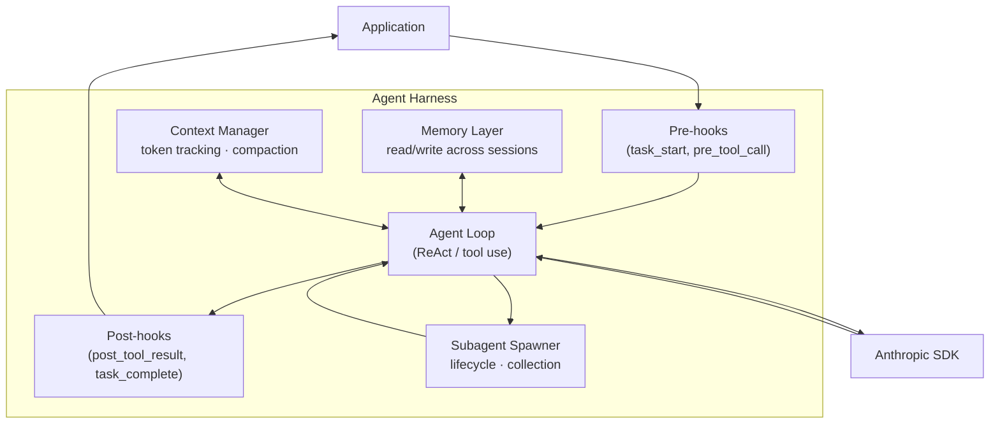

# Day 34 (Extension) — The Agent Harness Pattern

> **Today's one idea:** An agent harness is not a new pattern — it is a composition of Guardrails, Human-in-the-Loop, Orchestrator-Worker, and Memory patterns hardened into reusable runtime infrastructure. Naming it as a pattern lets you evaluate existing harnesses, extend them deliberately, and build your own.
> **Reading time:** ~45 min · **Prereqs:** Day 33 (Capstone — all prior patterns assumed)
> **Primary sources:** Claude Code (Anthropic, 2024) — the harness you've been running in · Wu et al., "AutoGen" (arXiv:2308.08155) — harness as a core design decision · Harrison Chase, LangChain AgentExecutor (2023) — harness as open-source infrastructure

---

## The hook

You have been using an agent harness throughout this course. Every time a tool call required your approval before running, that was a Human-in-the-Loop interrupt (Day 31). Every time a memory file persisted across sessions, that was an external semantic store (Day 23). Every time context was compacted to stay within the window, that was scratchpad compression (Day 24). Every time a subagent was spawned for a parallel task, that was an Orchestrator-Worker pattern (Day 27).

None of those behaviors were in the patterns themselves. They were in the **infrastructure that runs the agent** — the harness. You've been building patterns; the harness was already applying them to you.

Today you name the harness as a pattern, understand what it composes, and implement one.

---

## Building the intuition

### What a harness is and is not

A harness is **not** a design pattern in the sense of CoT or ReAct. It is an **infrastructure pattern** — the runtime layer that sits between the raw SDK and the agent's reasoning loop. It answers the question: *who enforces the agent's constraints so the agent doesn't have to think about them?*

```
┌─────────────────────────────────────────┐
│                Application              │
├─────────────────────────────────────────┤
│           Agent Harness                 │  ← this layer
│  (safety · HITL · memory · lifecycle)  │
├─────────────────────────────────────────┤
│          Anthropic SDK / API            │
├─────────────────────────────────────────┤
│             LLM (weights)               │
└─────────────────────────────────────────┘
```

The harness is invisible when everything goes right. Like electrical grounding (Day 32), its value is most visible when something goes wrong — and it catches it before the application sees the failure.

### The five concerns a harness addresses

Every production harness handles the same five concerns. Each maps directly to a pattern from this course:

| Harness concern | What it does | Pattern |
|----------------|--------------|---------|
| **Safety contracts** | Enforce tool allowlists, block injection, rate-limit expensive calls | Guardrails (Day 32) |
| **Human oversight** | Pause before irreversible actions, checkpoint at phase boundaries | Human-in-the-Loop (Day 31) |
| **Agent lifecycle** | Spawn, track, and collect subagents; cancel or retry failed workers | Orchestrator-Worker (Day 27) |
| **State persistence** | Persist memory across sessions; provide episodic and semantic retrieval | Memory (Days 23–25) |
| **Context management** | Track token usage; compress old messages when approaching the limit | Scratchpad (Day 24) |

A minimal harness needs all five. A harness missing any one of them has a structural gap — not a configurable trade-off.

### The hook system: a generalization of rails

Rails (Day 32) are callables that check and transform a single string. A hook system generalizes this: hooks fire at **lifecycle events** — task start, pre-tool call, post-tool result, task complete — and can inspect, modify, or block any payload at that point.

The relationship:
- A **rail** is a domain-specific hook for a single stage (input, output, or action)
- A **hook** is a general lifecycle callback that can span any stage

```
Lifecycle events:
  task_start      ← input rails fire here
  pre_tool_call   ← action rails fire here
  post_tool_result ← observation transformation hooks here
  task_complete   ← output rails fire here
```

This is why harnesses like Claude Code can apply memory injection, permission prompts, and output formatting without those behaviors appearing in the agent's reasoning loop. The hooks intercept at the right lifecycle event and handle the concern invisibly.

### Real harnesses you've already seen

| Harness | HITL | Guardrails | Orchestrator | Memory | Context mgmt |
|---------|------|-----------|--------------|--------|--------------|
| **Claude Code** | Permission prompts | Sandboxing, allowlists, `CLAUDE.md` rules | `Agent` tool, subagents | MEMORY.md, project memory | `/compact`, auto-compaction |
| **AutoGen** | `human_input_mode` | Content filters | `GroupChat` orchestration | Persistent conversation history | Message summarization |
| **LangChain AgentExecutor** | `handle_parsing_errors` | Tool validation | Tool chaining | `ConversationBufferMemory` | `max_iterations` circuit breaker |
| **Semantic Kernel** | Approval filters | Plugin permission model | Planner → skill dispatch | `SemanticTextMemory` | Context variable management |

Each of these is a composition of the same five concerns. The differences are in configuration surface, default strictness, and which concerns are first-class vs. pluggable.

---

## The formal picture

### Architecture diagram



### Implementation

```python
"""
The Agent Harness Pattern
A runtime composition of: Guardrails + HITL + Orchestrator-Worker + Memory + Context Management
"""
import json
import os
import time
from dataclasses import dataclass, field
from typing import Callable, Any
import anthropic

client = anthropic.Anthropic()


def llm(prompt: str, system: str = "", max_tokens: int = 1024) -> str:
    kwargs = {
        "model": "claude-3-5-sonnet-20241022",
        "max_tokens": max_tokens,
        "messages": [{"role": "user", "content": prompt}],
    }
    if system:
        kwargs["system"] = system
    return client.messages.create(**kwargs).content[0].text.strip()


# ── Hook types ─────────────────────────────────────────────────────────────────
# PreHook:  (event_type: str, payload: Any) → (allowed: bool, payload: Any)
# PostHook: (event_type: str, result: Any)  → Any (may transform result)

PreHook  = Callable[[str, Any], tuple[bool, Any]]
PostHook = Callable[[str, Any], Any]


# ── Configuration ──────────────────────────────────────────────────────────────

@dataclass
class HarnessConfig:
    # Guardrails (Day 32)
    allowed_tools:    set   = field(default_factory=set)  # empty = all allowed
    max_tool_calls:   int   = 50                          # circuit breaker
    blocked_patterns: list  = field(default_factory=list) # input injection patterns

    # Human-in-the-Loop (Day 31)
    require_approval_for: set = field(default_factory=set)  # tool names needing human OK

    # Context management (Day 24)
    max_tokens:  int   = 150_000
    compact_at:  float = 0.80   # compact when this fraction of max_tokens is used

    # Memory (Days 23–25)
    memory_path: str = "harness_memory.json"

    # Hooks (generalized rails, Day 32)
    pre_hooks:  list = field(default_factory=list)  # list[PreHook]
    post_hooks: list = field(default_factory=list)  # list[PostHook]

    # Audit
    audit_enabled: bool = True


# ── Audit log entry ────────────────────────────────────────────────────────────

@dataclass
class AuditEntry:
    ts:    float
    event: str
    detail: str = ""


# ── The harness ────────────────────────────────────────────────────────────────

class AgentHarness:
    """
    Runtime infrastructure that composes five concerns:
    Guardrails · HITL · Orchestrator-Worker · Memory · Context Management
    """

    def __init__(self, config: HarnessConfig, tools: list):
        self.config = config
        self.tools  = tools
        self._tool_call_count: int = 0
        self._token_count:     int = 0
        self._audit_log: list = []
        self._memory: dict = self._load_memory()

    # ── Memory (Days 23–25) ────────────────────────────────────────────────────

    def _load_memory(self) -> dict:
        if os.path.exists(self.config.memory_path):
            with open(self.config.memory_path) as f:
                return json.load(f)
        return {}

    def _save_memory(self) -> None:
        with open(self.config.memory_path, "w") as f:
            json.dump(self._memory, f, indent=2)

    def remember(self, key: str, value: Any) -> None:
        """Write a key-value pair to the persistent memory store."""
        self._memory[key] = value
        self._save_memory()
        self._audit("memory_write", key)

    def recall(self, key: str) -> Any | None:
        """Read from the persistent memory store."""
        return self._memory.get(key)

    # ── Audit ──────────────────────────────────────────────────────────────────

    def _audit(self, event: str, detail: Any = "") -> None:
        if self.config.audit_enabled:
            self._audit_log.append(
                AuditEntry(ts=time.time(), event=event, detail=str(detail)[:200])
            )

    def audit_summary(self) -> dict:
        return {
            "tool_calls":  self._tool_call_count,
            "tokens_used": self._token_count,
            "events":      len(self._audit_log),
            "log":         [(e.event, e.detail) for e in self._audit_log],
        }

    # ── Hooks ──────────────────────────────────────────────────────────────────

    def _run_pre_hooks(self, event: str, payload: Any) -> tuple[bool, Any]:
        for hook in self.config.pre_hooks:
            allowed, payload = hook(event, payload)
            if not allowed:
                self._audit(f"pre_hook_blocked:{event}", payload)
                return False, payload
        return True, payload

    def _run_post_hooks(self, event: str, result: Any) -> Any:
        for hook in self.config.post_hooks:
            result = hook(event, result)
        return result

    # ── Guardrails (Day 32) ────────────────────────────────────────────────────

    def _check_input(self, task: str) -> tuple[bool, str]:
        """Block injection patterns in the task input."""
        lower = task.lower()
        for pattern in self.config.blocked_patterns:
            if pattern in lower:
                self._audit("input_blocked", pattern)
                return False, f"[Harness: input blocked — contains '{pattern}']"
        return True, task

    def _check_tool_allowed(self, tool_name: str) -> bool:
        if not self.config.allowed_tools:
            return True  # empty set = all tools allowed
        return tool_name in self.config.allowed_tools

    # ── HITL (Day 31) ─────────────────────────────────────────────────────────

    def _needs_approval(self, tool_name: str) -> bool:
        return tool_name in self.config.require_approval_for

    def _get_human_approval(self, tool_name: str, inputs: dict) -> str:
        print(f"\n[HARNESS — Approval required]")
        print(f"  Tool:  {tool_name}")
        print(f"  Input: {json.dumps(inputs)[:200]}")
        choice = input("  (a)pprove / (r)eject: ").strip().lower()
        decision = "approved" if choice == "a" else "rejected"
        self._audit("hitl_gate", f"{tool_name}:{decision}")
        return decision

    # ── Context management (Day 24) ────────────────────────────────────────────

    def _should_compact(self) -> bool:
        threshold = self.config.max_tokens * self.config.compact_at
        return self._token_count > threshold

    def _compact(self, messages: list) -> list:
        """Summarize old messages into a single context entry."""
        if len(messages) <= 4:
            return messages

        old    = messages[:-4]
        recent = messages[-4:]

        old_text = "\n".join(
            m.get("content", "")[:100] if isinstance(m.get("content"), str) else ""
            for m in old
        )
        summary = llm(
            f"Summarize the key facts and decisions from this conversation history "
            f"in 3–5 bullet points. Be specific about tool calls and their results:\n\n{old_text}",
            max_tokens=300,
        )
        self._audit("compaction", f"Compacted {len(old)} messages")
        return [{"role": "user", "content": f"[Context summary]\n{summary}"}] + recent

    # ── Orchestrator-Worker: subagent spawning (Day 27) ────────────────────────

    def spawn_subagent(self, task: str, tools: list = None) -> str:
        """
        Spawn a worker agent for a subtask.
        The subagent uses its own isolated harness with the same config.
        """
        self._audit("spawn_subagent", task[:80])
        sub = AgentHarness(self.config, tools or self.tools)
        return sub.run(task)

    # ── Tool execution stub (replace with real dispatch) ───────────────────────

    def _execute_tool(self, name: str, inputs: dict) -> str:
        return f"[Result of {name}({json.dumps(inputs)[:80]})]"

    # ── Main run loop ──────────────────────────────────────────────────────────

    def run(self, task: str) -> str:
        # Input guardrail
        passed, task = self._check_input(task)
        if not passed:
            return task

        # Pre-task hooks (task_start event)
        allowed, task = self._run_pre_hooks("task_start", task)
        if not allowed:
            return f"[Harness: task blocked by pre-hook] {task}"

        messages = [{"role": "user", "content": task}]

        while True:
            # Context management
            if self._should_compact():
                messages = self._compact(messages)

            # Circuit breaker (Guardrails)
            if self._tool_call_count >= self.config.max_tool_calls:
                self._audit("circuit_breaker_open", self._tool_call_count)
                return "[Harness: circuit breaker open — max tool calls reached]"

            response = client.messages.create(
                model="claude-3-5-sonnet-20241022",
                max_tokens=1024,
                tools=self.tools,
                messages=messages,
            )
            # Track tokens for context management
            self._token_count += response.usage.input_tokens + response.usage.output_tokens

            if response.stop_reason == "tool_use":
                tool_results = []

                for block in response.content:
                    if block.type != "tool_use":
                        continue

                    self._tool_call_count += 1
                    self._audit("tool_call", block.name)

                    # Allowlist check (Guardrails)
                    if not self._check_tool_allowed(block.name):
                        result = f"[Harness: '{block.name}' not on allowlist]"
                        self._audit("tool_blocked", block.name)

                    # HITL gate
                    elif self._needs_approval(block.name):
                        if self._get_human_approval(block.name, block.input) == "approved":
                            allowed, payload = self._run_pre_hooks(
                                "pre_tool_call", {"name": block.name, "input": block.input}
                            )
                            result = (
                                self._execute_tool(block.name, payload["input"])
                                if allowed else f"[Harness: blocked by pre-hook]"
                            )
                        else:
                            result = "[Harness: action rejected by human]"

                    # Standard pre-hook → execute → post-hook
                    else:
                        allowed, payload = self._run_pre_hooks(
                            "pre_tool_call", {"name": block.name, "input": block.input}
                        )
                        if allowed:
                            raw_result = self._execute_tool(block.name, payload["input"])
                            result = self._run_post_hooks("post_tool_result", raw_result)
                        else:
                            result = f"[Harness: blocked by pre-hook] {payload}"

                    tool_results.append({
                        "type":        "tool_result",
                        "tool_use_id": block.id,
                        "content":     str(result),
                    })

                messages.append({"role": "assistant", "content": response.content})
                messages.append({"role": "user",      "content": tool_results})

            else:
                final = next((b.text for b in response.content if hasattr(b, "text")), "")
                final = self._run_post_hooks("task_complete", final)
                self._audit("task_complete", final[:80])
                return final


# ── Example: wiring up a configured harness ────────────────────────────────────

def example_pre_hook_log(event: str, payload: Any) -> tuple[bool, Any]:
    """Log every lifecycle event to stdout."""
    print(f"  [hook:{event}] payload preview: {str(payload)[:60]}")
    return True, payload  # always allow, never modify

def example_output_truncator(event: str, result: Any) -> Any:
    """Truncate final output to 500 chars."""
    if event == "task_complete" and isinstance(result, str) and len(result) > 500:
        return result[:500] + "... [truncated by harness]"
    return result

DEMO_TOOLS = [
    {
        "name": "search_web",
        "description": "Search the web for information.",
        "input_schema": {
            "type": "object",
            "properties": {"query": {"type": "string"}},
            "required": ["query"],
        },
    },
    {
        "name": "send_email",
        "description": "Send an email (irreversible).",
        "input_schema": {
            "type": "object",
            "properties": {
                "to":      {"type": "string"},
                "subject": {"type": "string"},
                "body":    {"type": "string"},
            },
            "required": ["to", "subject", "body"],
        },
    },
]

if __name__ == "__main__":
    config = HarnessConfig(
        allowed_tools={"search_web"},       # send_email is NOT allowed
        max_tool_calls=10,
        blocked_patterns=["ignore previous", "disregard"],
        require_approval_for=set(),         # no HITL in this demo
        max_tokens=50_000,
        compact_at=0.80,
        memory_path="demo_harness_memory.json",
        pre_hooks=[example_pre_hook_log],
        post_hooks=[example_output_truncator],
        audit_enabled=True,
    )

    harness = AgentHarness(config=config, tools=DEMO_TOOLS)

    # Store something in persistent memory before the run
    harness.remember("user_preference", "concise answers under 3 sentences")

    result = harness.run("What is the current state of quantum computing hardware?")

    print("\n=== RESULT ===")
    print(result)

    print("\n=== AUDIT SUMMARY ===")
    summary = harness.audit_summary()
    print(f"Tool calls: {summary['tool_calls']}")
    print(f"Tokens used: {summary['tokens_used']}")
    for event, detail in summary["log"]:
        print(f"  {event}: {detail}")
```

### Reading a real harness: Claude Code

The harness you have been running in maps directly onto the implementation above:

| Claude Code feature | `AgentHarness` equivalent | Pattern |
|--------------------|--------------------------|---------|
| Permission prompts (approve/deny tool) | `_get_human_approval()` + `require_approval_for` | HITL (Day 31) |
| `CLAUDE.md` rules ("never run git", "no tests") | `pre_hooks` at `task_start` | Pre-hook (Day 32) |
| Tool sandboxing / allowlist in settings | `allowed_tools` | Guardrails (Day 32) |
| `/compact` and auto-compaction | `_compact()` triggered by `_should_compact()` | Scratchpad (Day 24) |
| `MEMORY.md` + project memory files | `remember()` / `recall()` backed by files | External semantic (Day 23) |
| `Agent` tool spawning subagents | `spawn_subagent()` | Orchestrator-Worker (Day 27) |
| Hooks in settings (pre/post tool) | `pre_hooks` / `post_hooks` | Hook system |
| Circuit breaker on repeated failures | `max_tool_calls` + circuit breaker | Guardrails (Day 32) |

This is not a coincidence. Claude Code is a well-designed harness, and well-designed harnesses converge on the same five concerns because those concerns are fundamental, not optional.

---

## Where it breaks / what it is not

**A harness is not an agent.** The harness enforces constraints; the agent reasons. Confusing the two leads to putting reasoning logic in the harness (bad: now the harness is opinionated about the task domain) or putting infrastructure logic in the agent (bad: the agent now thinks about token budgets instead of the task).

**Harness configuration can become stale.** An allowlist that was right six months ago may be too restrictive today (new tools needed) or too permissive (deprecated tools not removed). Treat the harness config like a dependency — version it, review it, and update it intentionally.

**Hooks can create invisible behavior.** A pre-hook that silently modifies the task input is harder to debug than a rail that blocks with an explicit error message. When a hook modifies content, log the before and after. Silent transformation is the hardest class of bug to diagnose.

**Spawned subagents inherit the parent config — which may be wrong.** In `spawn_subagent()` above, the subagent gets the same config as the parent. If the subtask legitimately needs access to a tool the parent's allowlist blocks, the spawn will silently fail. Pass a dedicated config per subagent type, or parameterize the spawn call.

**The circuit breaker threshold is not obvious.** `max_tool_calls = 50` is a guess. Too low and the harness stops a legitimate long-running task. Too high and a runaway loop burns your entire API budget before stopping. Set it based on observed call counts for your task distribution, not intuition.

---

## Try it yourself

**Exercise 1 — Check your understanding:**
Draw the full lifecycle of a single tool call through the `AgentHarness.run()` loop. Label every decision point: circuit breaker check, allowlist check, HITL gate, pre-hook, execution, post-hook. Where could this tool call be blocked? What does the agent's context look like at each point?

**Exercise 2 — Apply it:**
Extend `HarnessConfig` with a `rate_limits: dict` field mapping tool names to calls-per-minute limits. Implement the rate limit check inside `run()` before tool execution. Test it by setting `rate_limits = {"search_web": 3}` and asking the agent a question that triggers 5 searches. What does the agent do when it hits the limit?

**Exercise 3 — Stretch:**
The current `spawn_subagent()` is synchronous — the parent blocks until the child completes. Redesign it to be async using `asyncio`: the parent can spawn multiple subagents, continue processing, and collect results when they are ready. What changes in the parent's message loop? How does the parent inject subagent results back into its own context?

<details>
<summary>Answer for Exercise 1</summary>

Full lifecycle of one tool call through `AgentHarness.run()`:

```
LLM emits tool_use block
  ↓
_tool_call_count += 1
  ↓
_audit("tool_call", block.name)
  ↓
_check_tool_allowed(block.name)
  ├── False → result = "[blocked]"; skip to tool_results.append
  └── True ↓
_needs_approval(block.name)
  ├── True → _get_human_approval()
  │     ├── "approved" → _run_pre_hooks("pre_tool_call", payload)
  │     │     ├── blocked → result = "[blocked by pre-hook]"
  │     │     └── allowed → _execute_tool(name, input) → result
  │     └── "rejected" → result = "[rejected by human]"
  └── False → _run_pre_hooks("pre_tool_call", payload)
        ├── blocked → result = "[blocked by pre-hook] {reason}"
        └── allowed → _execute_tool(name, input) → raw_result
                        → _run_post_hooks("post_tool_result", raw_result) → result
  ↓
tool_results.append({"type": "tool_result", "tool_use_id": ..., "content": result})
```

Potential blocking points in order:
1. Circuit breaker (before any individual call check)
2. Allowlist (fast, no side effects)
3. HITL rejection (human says no)
4. Pre-hook (programmatic block)
5. Post-hook (can transform but not block — design limitation; fix by returning a sentinel value)

The agent's context at each point: the agent doesn't see any of this. It only sees the `tool_result` content in the next user turn. Whether that content says "result: X" or "blocked: allowlist" — the agent must handle both as valid observations. This is why tool result messages for blocked calls should be informative, not just `[blocked]`.
</details>

---

## Connect it back

[Day 32 (Guardrails)](../../06-multi-agent/days/day-32-guardrails.md) introduced the Rail interface. The hook system in this day is the generalization: rails are domain-specific hooks; hooks are general lifecycle callbacks.

[Day 33 (Capstone)](./day-33-capstone.md) manually wired six patterns into a research assistant. The harness pattern extracts that wiring into reusable infrastructure — so the next agent you build can configure these concerns rather than implement them from scratch.

The capstone asked: *which patterns to combine?* The harness answers: *how do you wire them so they don't tangle?*

**One question you can now answer that you couldn't before this day:** When you see a production agent framework (AutoGen, LangChain, Semantic Kernel, Claude Code), you can now name the five concerns it addresses, identify which patterns implement each concern, and evaluate whether its design choices match your requirements — rather than treating it as a black box.

---

## Suggested readings for today

**Required if you have 15 extra minutes:**
Wu et al., "AutoGen: Enabling Next-Gen LLM Applications via Multi-Agent Conversation" (arXiv:2308.08155, 2023) — Section 3 "AutoGen Framework."
AutoGen makes the harness concerns explicit: `ConversableAgent` (lifecycle), `GroupChatManager` (orchestration), `HumanProxyAgent` (HITL), code execution sandbox (guardrails). Reading Section 3 after today's day shows how the same five concerns appear in a production open-source harness.

**If you want the deep version:**
- Anthropic, *Building Effective Agents* (Dec 2024) — "Putting it together" section. Anthropic's own take on what separates a production-ready agent from a prototype — almost every point maps to one of the five harness concerns.
- Microsoft Semantic Kernel documentation — [learn.microsoft.com/semantic-kernel](https://learn.microsoft.com/en-us/semantic-kernel/). The Kernel object is a harness. The Plugin model is the allowlist. The Planner is the orchestrator. The Memory store is persistent memory. Reading the architecture guide after today makes the pattern composition visible.

---

## Navigation

← **Previous:** [Day 33 — Capstone](./day-33-capstone.md)
→ **Course Home:** [README](../../../README.md)
