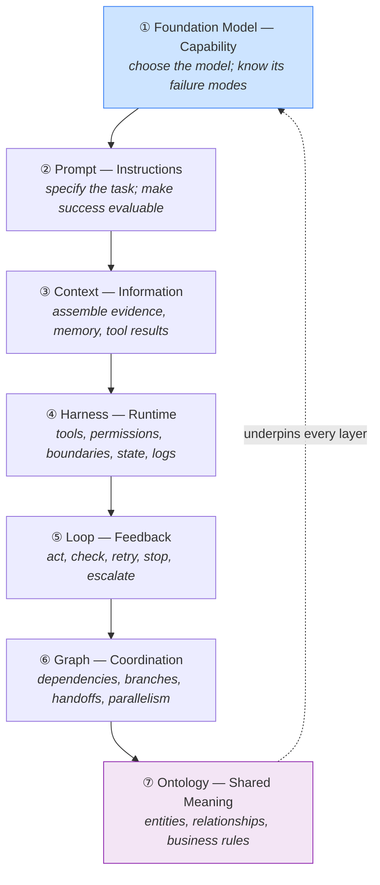

# The Seven Disciplines of AI Engineering

The whole course hangs on one idea: an AI system is a **jagged, stateless model** wrapped in seven layers of engineering, each answering a different question and each with a one-word essence. Learn the seven and you have a map for *any* LLM system — and a checklist for what's missing when one underperforms.

| # | Discipline | Essence | The question it answers |
|---|---|---|---|
| 1 | **Foundation Model** | **Capability** | Which model, and what can it reliably (not) do? |
| 2 | **Prompt Engineering** | **Instructions** | How do I specify the task so success is definable and evaluable? |
| 3 | **Context Engineering** | **Information** | What evidence, memory, and tool results does it see for its next decision? |
| 4 | **Harness Engineering** | **Runtime** | What environment runs it — tools, permissions, boundaries, state, logs? |
| 5 | **Loop Engineering** | **Feedback** | How does it act, check results, retry, stop, and escalate? |
| 6 | **Graph Engineering** | **Coordination** | How is the work connected — dependencies, branches, handoffs, parallelism? |
| 7 | **Ontology Engineering** | **Shared Meaning** | What counts as a customer, an approval, a completed order? |

## Two things to hold about this stack

**1. It's a conceptual stack, not the teaching order.** The list reads cleanly top-down (model → instructions → information → runtime → feedback → coordination → meaning), but prerequisites cut across it. You can't fully teach *Information* before there's a *Feedback* loop for information to flow through; you can't rigorously choose a *Foundation Model* without the *Feedback* layer's evaluation. So the course **teaches bottom-up and by prerequisite** while keeping this stack as the reference map. Where a day serves a layer, the learning path tags it — read the tags to see the seven layers threaded through the build order.

**2. Shared Meaning is taught last but underpins everything.** Ontology (layer 7) comes at the end because you've earned it — you've felt fragmented extraction and incoherent queries by then. But conceptually it's *foundational*: your entity definitions constrain prompts, shape context, populate graphs, and gate what enters your system. It's the floor disguised as the ceiling.

## Where each layer lives in the course

| Layer (Essence) | Primary days | Module(s) |
|---|---|---|
| ① Foundation Model (Capability) | 1–4 | Foundations |
| ② Prompt (Instructions) | 5–6 | Harness · Scaffold |
| ③ Context (Information) | 11–18, 25 | Context Engineering, Graph |
| ④ Harness (Runtime) | 7–8, 22, 24 | Harness · Scaffold & Operations |
| ⑤ Loop (Feedback) | 9–10, 19–21, 23 | Loop · Build & Control, Operations |
| ⑥ Graph (Coordination) | 21, 26 | Loop Control, Graph |
| ⑦ Ontology (Shared Meaning) | 27–28 | Ontology Engineering |

Note two layers are split by the *kind* of graph: **control-flow graphs** (Day 26) serve ⑥ Coordination; **context/knowledge graphs** (Day 25) serve ③ Information and ⑦ Shared Meaning. They're different graphs doing different jobs — control vs. knowledge — which is why the course treats them separately (Days 25 vs. 26).

## Using the seven as a diagnostic

When an AI system underperforms, walk the layers to locate the failure instead of blaming "the model":

1. **Capability** — is the task on a model *pit* (Day 4)? Wrong/over-sized model (Day 3)?
2. **Instructions** — is the task under-specified, success undefinable (Day 5)?
3. **Information** — is the needed evidence absent, buried, or stale in context (Days 11–17)?
4. **Runtime** — is a tool missing, unsafe, or failing silently (Days 7–8, 22)?
5. **Feedback** — does it not check its work, not stop, not recover (Days 19–23)?
6. **Coordination** — is the work mis-sequenced, or split when it shouldn't be (Days 21, 26)?
7. **Shared Meaning** — do components disagree on what terms mean (Days 27–28)?

Most "the AI is bad" reports are really one identifiable layer failing. The seven give you the vocabulary to name which.

---

← **Back to course overview:** [README](README.md) &nbsp;|&nbsp; [Learning path](learning-path.md)
