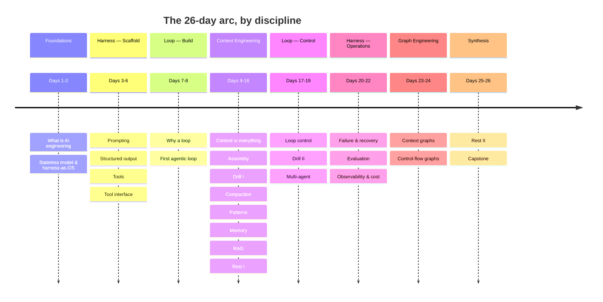

# Learning Path — AI Engineering

26 days across 8 modules, organized by the **four engineering disciplines**: harness, loop, context, graph. The through-line: *what happens around each model call, and across many, to turn a stateless probabilistic component into a reliable system?*

## Why this order (prerequisite-driven)

The four disciplines don't linearize cleanly — prerequisites cross them — so **Harness** and **Loop** are each taught in two parts: a *build* part early and an *operate/control* part late. This keeps every page free of forward references:

- You need **harness scaffold** (tools, structured output) before you can build a **loop**.
- You need a **loop** before **context** has anywhere to flow.
- **Loop control** and **multi-agent** depend on **memory** (context), so they come *after* the context module.
- **Reliability, eval, observability** (harness operations) only make sense once a looped, context-managed agent exists — so they come late.
- **Graph engineering** builds on both context (context graphs) and loop (control-flow graphs), so it's last before synthesis.

## Full path with callbacks

| Day | Page | Load-Bearing Idea | Prereqs | Callbacks (revisits) |
|---|---|---|---|---|
| 1 | [What Is AI Engineering?](modules/00-foundations/days/day-01-what-is-ai-engineering.md) | Building systems around a rented model *is* the discipline. | — | — |
| 2 | [Stateless Model & Harness-as-OS](modules/00-foundations/days/day-02-stateless-model-and-harness.md) | LLM = stateless CPU; harness = OS. | 1 | Day 1 |
| 3 | [Prompting as Programming](modules/01-harness-engineering-the-scaffold/days/day-03-prompting-as-programming.md) | A prompt is a spec, not a wish. | 2 | Day 2 |
| 4 | [Structured Output & Parse Boundary](modules/01-harness-engineering-the-scaffold/days/day-04-structured-output.md) | Constrain to schema; validate before trusting. | 3 | Day 3 |
| 5 | [Tools: The Model's Hands](modules/01-harness-engineering-the-scaffold/days/day-05-tools-the-models-hands.md) | A tool is a request the harness runs. | 4 | Day 2, 4 |
| 6 | [The Tool Interface](modules/01-harness-engineering-the-scaffold/days/day-06-the-tool-interface.md) | The tool boundary is a trust boundary. | 5 | Day 4, 5 |
| 7 | [Why You Need a Loop](modules/02-loop-engineering-building-the-loop/days/day-07-why-you-need-a-loop.md) | Capability = iteration + feedback. | 2 | Day 2 |
| 8 | [Your First Agentic Loop](modules/02-loop-engineering-building-the-loop/days/day-08-your-first-agentic-loop.md) | A working agent is ~60 lines. | 5, 7 | Day 2, 5, 7 |
| 9 | [Context Is Everything](modules/03-context-engineering/days/day-09-context-is-everything.md) | The model's whole mind is the payload. **[bottleneck]** | 7 | Day 2, 8 |
| 10 | [Context Assembly](modules/03-context-engineering/days/day-10-context-assembly.md) | Rebuild the payload each turn. **[bottleneck]** | 8, 9 | Day 7, 9 |
| 11 | [Drill I: Context Assembly](modules/03-context-engineering/days/day-11-drill-context-assembly.md) | Reps: prune, order, budget. | 10 | Day 9, 10 |
| 12 | [Compaction & Lost-in-the-Middle](modules/03-context-engineering/days/day-12-compaction-lost-in-the-middle.md) | Compress + place, don't delete. **[bottleneck]** | 10 | Day 9, 10 |
| 13 | [Context Engineering Patterns](modules/03-context-engineering/days/day-13-context-engineering-patterns.md) | A reusable pattern catalog beyond agents. | 9–12 | Day 9, 10, 12 |
| 14 | [Memory & State Across Turns](modules/03-context-engineering/days/day-14-memory-and-state.md) | Persist state outside the window. **[bottleneck]** | 10 | Day 8, 9, 10 |
| 15 | [Retrieval-Augmented Generation](modules/03-context-engineering/days/day-15-retrieval-augmented-generation.md) | Ground the model in external knowledge. | 14, 9 | Day 9, 13, 14 |
| 16 | [Rest & Synthesize I](modules/03-context-engineering/days/day-16-rest-synthesize-i.md) | Consolidate Modules 1–5. | 1–15 | Day 1–15 |
| 17 | [Loop Control & Stopping](modules/04-loop-engineering-control-and-orchestration/days/day-17-loop-control-and-stopping.md) | A loop that can't stop is a bug. | 8, 14 | Day 7, 8, 14 |
| 18 | [Drill II: The Turn, End-to-End](modules/04-loop-engineering-control-and-orchestration/days/day-18-drill-the-turn-end-to-end.md) | Fuse assembly+memory+compaction+control. | 10,14,12,17 | Day 9,10,12,14,17 |
| 19 | [Multi-Agent Orchestration](modules/04-loop-engineering-control-and-orchestration/days/day-19-multi-agent-orchestration.md) | Split loops only when context demands. | 14, 17 | Day 2, 7, 14, 17 |
| 20 | [Failure & Recovery](modules/05-harness-engineering-reliability-and-operations/days/day-20-failure-and-recovery.md) | Failure is an expected input. | 6, 17 | Day 5, 6, 17 |
| 21 | [The Evaluation Harness](modules/05-harness-engineering-reliability-and-operations/days/day-21-the-evaluation-harness.md) | You can't harden what you can't measure. | 8, 17 | Day 8, 17 |
| 22 | [Observability & Cost](modules/05-harness-engineering-reliability-and-operations/days/day-22-observability-and-cost.md) | Instrument first, then optimize. | 21, 12 | Day 10, 12, 21 |
| 23 | [Context Graphs](modules/06-graph-engineering/days/day-23-context-graphs.md) | Memory as a temporal graph you traverse. | 14, 15 | Day 9, 14, 15 |
| 24 | [Control-Flow Graphs](modules/06-graph-engineering/days/day-24-control-flow-graphs.md) | The loop as an explicit state graph. | 17, 8 | Day 8, 17, 19 |
| 25 | [Rest & Synthesize II](modules/07-synthesis/days/day-25-rest-synthesize-ii.md) | Consolidate Modules 4–6. | 17–24 | Day 17–24 |
| 26 | [Capstone: Build & Harden](modules/07-synthesis/days/day-26-capstone-build-and-harden.md) | Assemble everything; defend each choice. | all | Day 2,8,9,14,17,20,21,23,24 |

## Spacing logic

Every concept is retrieved at least twice after introduction (~+5 and ~+14 days). The context/state bottleneck (Days 9–14) is reinforced most heavily — it recurs in the two drills (11, 18), both rest days (16, 25), the graph module (23), and the capstone (26). Drill days (11, 18) and rest days (16, 25) exist to reactivate the bottleneck at the point of near-forgetting.

## What "done" looks like

The capstone (Day 26) is a direct-transfer challenge: a real coding agent on a SWE-bench-lite–style issue (or a τ-bench–style support agent), with a bounded controlled loop, self-managed context (memory/RAG or a context graph where warranted), injected-failure recovery, a replayable trace, and a small eval set you authored. Done = it works *and* you can defend each design choice against the alternatives the course rejected.

---

← **Back to course overview:** [README](README.md) &nbsp;|&nbsp; [Day 1 — What Is AI Engineering? →](modules/00-foundations/days/day-01-what-is-ai-engineering.md)
