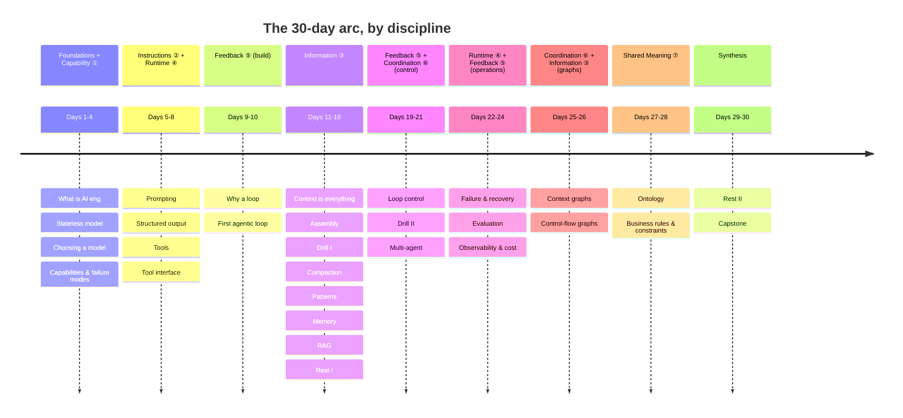

# Learning Path — AI Engineering

30 days across 9 modules, organized by the **seven engineering disciplines** (see [`disciplines.md`](disciplines.md)). The through-line: *what turns a stateless, jagged model into a system that reliably does real work?*

## Why this order (prerequisite-driven)

The seven disciplines are a *conceptual stack*, not a teaching order — prerequisites cross the layers, so the course teaches bottom-up:

- **Capability ①** first — you can't build on a model you haven't characterized (though rigorous *selection* loops back to Feedback ⑤/eval).
- **Instructions ②** and the **Runtime ④** scaffold (tools) before a **loop** — you need to instruct and equip a single call first.
- A **loop (Feedback ⑤)** before **Context ③** — "the evidence for its next decision" presupposes decisions.
- **Control** and **multi-agent (Coordination ⑥)** *after* Context, because they depend on memory.
- **Operations** (reliability, eval, observability) late — you can only harden a working system.
- **Shared Meaning ⑦** last — taught after you've felt fragmented extraction, though it conceptually underpins everything.

## Full path with layers and callbacks

| Day | Layer | Page | Load-Bearing Idea | Callbacks |
|---|---|---|---|---|
| 1 | — | [What Is AI Engineering?](modules/00-foundations/days/day-01-what-is-ai-engineering.md) | Systems work around a rented model *is* the discipline. | — |
| 2 | — | [Stateless Model & Harness-as-OS](modules/00-foundations/days/day-02-stateless-model-and-harness.md) | LLM = stateless CPU; harness = OS. | Day 1 |
| 3 | ① | [Choosing a Foundation Model](modules/00-foundations/days/day-03-choosing-a-foundation-model.md) | Cheapest model that clears *your* eval. | Day 2 |
| 4 | ① | [Model Capabilities & Failure Modes](modules/00-foundations/days/day-04-model-capabilities-and-failure-modes.md) | Capability is jagged; design around pits. | Day 3 |
| 5 | ② | [Prompting as Programming](modules/01-harness-engineering-the-scaffold/days/day-05-prompting-as-programming.md) | A prompt is a spec, not a wish. | Day 2, 4 |
| 6 | ② | [Structured Output & Parse Boundary](modules/01-harness-engineering-the-scaffold/days/day-06-structured-output.md) | Constrain to schema; validate before trusting. | Day 5 |
| 7 | ④ | [Tools: The Model's Hands](modules/01-harness-engineering-the-scaffold/days/day-07-tools-the-models-hands.md) | A tool is a request the harness runs. | Day 6 |
| 8 | ④ | [The Tool Interface](modules/01-harness-engineering-the-scaffold/days/day-08-the-tool-interface.md) | The tool boundary is a trust boundary. | Day 6, 7 |
| 9 | ⑤ | [Why You Need a Loop](modules/02-loop-engineering-building-the-loop/days/day-09-why-you-need-a-loop.md) | Capability = iteration + feedback. | Day 2 |
| 10 | ⑤ | [Your First Agentic Loop](modules/02-loop-engineering-building-the-loop/days/day-10-your-first-agentic-loop.md) | A working agent is ~60 lines. | Day 2, 7, 9 |
| 11 | ③ | [Context Is Everything](modules/03-context-engineering/days/day-11-context-is-everything.md) | The model's whole mind is the payload. **[bottleneck]** | Day 4, 10 |
| 12 | ③ | [Context Assembly](modules/03-context-engineering/days/day-12-context-assembly.md) | Rebuild the payload each turn. **[bottleneck]** | Day 10, 11 |
| 13 | ③ | [Drill I: Context Assembly](modules/03-context-engineering/days/day-13-drill-context-assembly.md) | Reps: prune, order, budget. | Day 11, 12 |
| 14 | ③ | [Compaction & Lost-in-the-Middle](modules/03-context-engineering/days/day-14-compaction-lost-in-the-middle.md) | Compress + place, don't delete. **[bottleneck]** | Day 11, 12 |
| 15 | ③ | [Context Engineering Patterns](modules/03-context-engineering/days/day-15-context-engineering-patterns.md) | A reusable pattern catalog beyond agents. | Day 11, 12, 14 |
| 16 | ③ | [Memory & State Across Turns](modules/03-context-engineering/days/day-16-memory-and-state.md) | Persist state outside the window. **[bottleneck]** | Day 10, 11, 12 |
| 17 | ③ | [Retrieval-Augmented Generation](modules/03-context-engineering/days/day-17-retrieval-augmented-generation.md) | Ground the model in external knowledge. | Day 11, 15, 16 |
| 18 | — | [Rest & Synthesize I](modules/03-context-engineering/days/day-18-rest-synthesize-i.md) | Consolidate Days 1–17. | Day 1–17 |
| 19 | ⑤ | [Loop Control & Stopping](modules/04-loop-engineering-control-and-orchestration/days/day-19-loop-control-and-stopping.md) | A loop that can't stop is a bug. | Day 9, 10, 16 |
| 20 | ⑤ | [Drill II: The Turn, End-to-End](modules/04-loop-engineering-control-and-orchestration/days/day-20-drill-the-turn-end-to-end.md) | Fuse assembly+memory+compaction+control. | Day 12,14,16,19 |
| 21 | ⑥ | [Multi-Agent Orchestration](modules/04-loop-engineering-control-and-orchestration/days/day-21-multi-agent-orchestration.md) | Split loops only when context demands. | Day 2, 9, 16, 19 |
| 22 | ④ | [Failure & Recovery](modules/05-harness-engineering-reliability-and-operations/days/day-22-failure-and-recovery.md) | Failure is an expected input. | Day 7, 8, 19 |
| 23 | ⑤ | [The Evaluation Harness](modules/05-harness-engineering-reliability-and-operations/days/day-23-the-evaluation-harness.md) | Can't harden what you can't measure. | Day 3, 10, 19 |
| 24 | ④ | [Observability & Cost](modules/05-harness-engineering-reliability-and-operations/days/day-24-observability-and-cost.md) | Instrument first, then optimize. | Day 3, 12, 14, 23 |
| 25 | ③+⑦ | [Context Graphs](modules/06-graph-engineering/days/day-25-context-graphs.md) | Memory as a temporal graph you traverse. | Day 11, 16, 17 |
| 26 | ⑥ | [Control-Flow Graphs](modules/06-graph-engineering/days/day-26-control-flow-graphs.md) | The loop as an explicit state graph. | Day 10, 19, 21 |
| 27 | ⑦ | [Ontology & Shared Meaning](modules/07-ontology-engineering/days/day-27-ontology-and-shared-meaning.md) | Define what entities & relations *are*. | Day 6, 25 |
| 28 | ⑦ | [Business Rules & Constraints](modules/07-ontology-engineering/days/day-28-business-rules-and-constraints.md) | Enforce meaning at the write boundary. | Day 6, 8, 25, 27 |
| 29 | — | [Rest & Synthesize II](modules/08-synthesis/days/day-29-rest-synthesize-ii.md) | Consolidate the back half. | Day 19–28 |
| 30 | — | [Capstone: Build & Harden](modules/08-synthesis/days/day-30-capstone-build-and-harden.md) | Assemble all seven layers; defend each. | Day 2,4,10,12,16,19,23,25,27 |

## Spacing logic

Every concept is retrieved at least twice after introduction (~+5 and ~+14 days). The context/state bottleneck (Days 11–16) is reinforced most heavily — the two drills (13, 20), both rest days (18, 29), the graph module (25), the ontology module (27–28, where context-graph schema returns), and the capstone (30). Foundation-model failure modes (Day 4) recur wherever a countermeasure appears (17 grounding, 22 recovery, 23 eval). Shared meaning (27–28) reactivates structured output (Day 6) and context graphs (Day 25).

## What "done" looks like

The capstone (Day 30) is a direct-transfer challenge across all seven layers: a real agent with a chosen model, a bounded controlled loop, self-managed context (memory/RAG or a context graph), an ontology with enforced constraints, injected-failure recovery, a replayable trace, and a small eval set you authored. Done = it works *and* you can defend each design choice against the alternatives the course rejected.

---

← **Back to course overview:** [README](README.md) &nbsp;|&nbsp; [Disciplines map](disciplines.md) &nbsp;|&nbsp; [Day 1 →](modules/00-foundations/days/day-01-what-is-ai-engineering.md)
