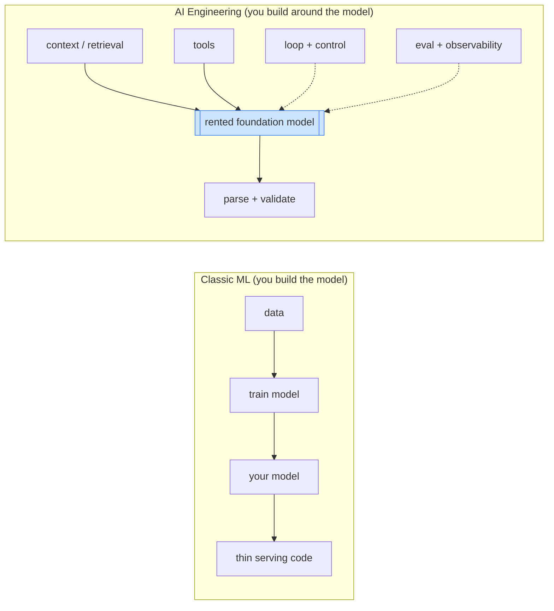
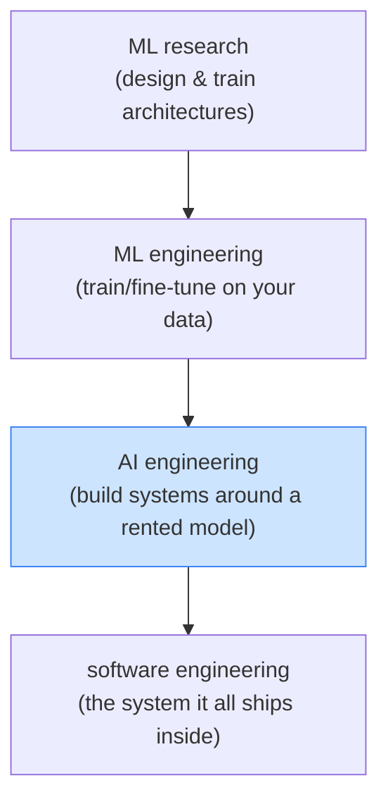

# Day 1 — What Is AI Engineering?

> **Today's one idea:** AI engineering is the discipline of building reliable systems *around* a model you did not train — the model is one component, and the engineering is everything that makes it useful, safe, and cheap enough to ship.
> **Reading time:** ~35 min · **Prereqs:** none
> **Primary source for today:** swyx (Shawn Wang), "The Rise of the AI Engineer," Latent.Space, 2023; Chip Huyen, *AI Engineering*, O'Reilly, 2025 (Ch. 1).

## The hook (2–4 min)

For a decade, "doing AI" meant *training models*: collect data, design an architecture, run gradient descent, ship weights. The hard part was making the model. The model was the product.

Then foundation models arrived, and the hard part moved. You no longer train the intelligence — you *rent* it, behind an API, already smarter than anything you could train yourself. GPT, Claude, Gemini are a phone call away. So if the intelligence is a commodity you call, where's the engineering?

It's *everywhere the model isn't.* Getting reliable structured output from a probabilistic text generator. Feeding it the right context out of a corpus too big to fit. Giving it tools without giving it a loaded gun. Looping it toward a goal without it spinning forever. Knowing whether it actually worked. Paying for it. **That** is the job — and it's a different job from training models. It has a name now: AI engineering. Today is about what that name means and why this whole course exists.

## Building the intuition (10–15 min)

Here's the shift in one picture. In classic ML, your effort goes *into* the model; at inference the surrounding code is thin. In AI engineering, the model is fixed (someone else trained it) and nearly all your effort goes into the *system around it*:

Two consequences reframe your whole mental model:

**1. The model is a component, not the system.** swyx's 2023 essay named this: a new engineer applies foundation models *through APIs and tools* to build products — a discipline distinct from ML research. You are not an ML researcher who forgot to train; you are a systems engineer whose most powerful component happens to be a probabilistic language model. The intelligence is an input to your system, like a database or a payment gateway.

**2. Your leverage is the system, not the model.** You cannot make the model smarter this quarter — its capability is fixed on any given day. But you *can*, this afternoon, give it better context, cleaner tools, a smarter loop, and honest evaluation. That's where quality is won or lost. Chip Huyen's *AI Engineering* is organized around exactly these surfaces — evaluation, prompting/context, retrieval, inference cost, agents — because they, not the model weights, are what you control.

So what are those surfaces? This course groups them into **seven engineering disciplines**, each with a one-word essence — the spine of the whole course (full map in [`disciplines.md`](../../../disciplines.md)):

| # | Discipline | Essence | The question it answers |
|---|---|---|---|
| 1 | **Foundation Model** | Capability | Which model, and what can it reliably (not) do? |
| 2 | **Prompt Engineering** | Instructions | How do I specify the task so success is evaluable? |
| 3 | **Context Engineering** | Information | What does it see for its next decision? |
| 4 | **Harness Engineering** | Runtime | What environment runs it — tools, boundaries, state, logs? |
| 5 | **Loop Engineering** | Feedback | How does it act, check, retry, stop, escalate? |
| 6 | **Graph Engineering** | Coordination | How is the work connected — branches, handoffs, parallelism? |
| 7 | **Ontology Engineering** | Shared Meaning | What counts as a customer, an approval, a completed order? |

Notice none of these is "train a better model." That's the tell that you've crossed from ML into AI engineering: **the model is a given, and the design space is everything around it.** A useful analogy: the model is a CPU (fast, general, dumb about your specific problem); AI engineering is writing the operating system and applications that make the CPU do useful work. (We make that analogy literal tomorrow.)

## The formal picture (10–15 min)

Let's pin down the boundary so you can always tell which side of it you're on.

**AI engineering** is the practice of building applications on top of *pre-trained foundation models*, where the primary work is: adapting the model to a task **without changing its weights** (prompting, context, tools, orchestration), and making the resulting system **reliable, evaluable, and economical** in production.

Three clauses do the work:

- **"pre-trained foundation models"** — you consume a general model trained by someone else. Contrast: *ML engineering* trains/fine-tunes models on your data; *AI engineering* mostly composes an existing one. (Fine-tuning exists as a tool, but it's the exception, not the spine — most gains come from the system, not from touching weights.)
- **"without changing its weights"** — your adaptation levers are *input-side and control-side*: what you put in the context (Modules 1, 3), what tools you expose (Module 1), how you loop and stop (Modules 2, 4), how you structure memory (Module 6). The weights are frozen; the leverage is in the scaffold.
- **"reliable, evaluable, economical"** — production reality. A probabilistic component in a real system needs measurement (does it work? — Module 5), resilience (what when it fails? — Module 5), and cost control (can we afford it? — Module 5). A demo ignores these; a product cannot.

Where AI engineering sits between adjacent fields:

AI engineering is closest to *software* engineering — it inherits SWE's concerns (interfaces, reliability, cost, testing) and applies them to a strange new component: one that is probabilistic, stateless across calls, and occasionally confidently wrong. Every hard problem in this course comes from engineering *around* those three properties. The rest of the course is, essentially, a tour of the tactics for each.

One honest caveat on scope: "AI engineering" in the wild also touches inference optimization, fine-tuning, and data pipelines. This course deliberately centers the *agentic / system-building* half — harness, loop, context, graph — because that's where most engineers actually spend their time and where the leverage is highest. When we skip a topic (e.g. training your own model), it's a scope choice, not an oversight.

## Where it breaks / what it is not (3–5 min)

- **AI engineering is not "just prompting."** Prompting is one lever (Day 5). Reduce the field to prompt-tweaking and you'll ship a demo that collapses in production — no evaluation, no context management, no failure handling. The prompt is the tip; the system is the iceberg.
- **It is not ML research or model training.** If your instinct for "the model is weak" is "let me fine-tune / train," pause: 90% of the time the fix is in the *system* (better context, tools, loop), not the weights. Reaching for training first is the classic category error of ML people entering AI engineering.
- **It is not framework operation.** Knowing LangChain/LangGraph is using someone's harness. This course builds the thing underneath so you understand, debug, and replace it. Frameworks are implementations of the disciplines you're about to learn — not substitutes for understanding them.
- **The model being fixed doesn't mean it's simple.** A frozen model is still probabilistic and jagged (great at some things, baffling at others). Much of the engineering is *designing around that jaggedness* — which is why "just call the API" is never the whole answer.

## Try it yourself (5–10 min)

**1. Retrieval first.** Close the page. In two or three sentences, define AI engineering, name what distinguishes it from ML engineering, and state where the engineer's leverage lies if the model's capability is fixed. Reopen only after you've written it.

Hint
Building systems *around* a rented, pre-trained model without changing its weights; distinct from ML because you compose intelligence rather than train it; leverage is the system (context, tools, loop, eval), not the weights.

Worked answer
AI engineering is building reliable, evaluable, economical systems *around* a pre-trained foundation model you didn't train, adapting it to tasks without changing its weights (via context, tools, orchestration). It differs from ML engineering, which trains or fine-tunes models on your data — AI engineering *composes* an already-trained model as one component. Because the model's capability is fixed on any given day, the engineer's leverage is entirely in the surrounding system: what context the model sees, what tools it can call, how the loop drives and stops it, and how you evaluate and control its cost. It's closest to software engineering, applied to a probabilistic, stateless, sometimes-wrong component.

**2. Direct application — audit a system you know.** Pick any LLM-powered product or feature you've used or built (a chatbot, a coding assistant, a summarizer). In writing, decompose it across the seven disciplines: which *model* (capability), how is it *instructed* (prompt), what does it *see* (context), what *runtime* wraps it (tools/boundaries), does it *loop* (feedback), is work *coordinated* across steps (graph), and is there *shared meaning* (ontology)? Mark which discipline you can say the *least* about — that's the part of this course you most need.

Hint
Even a "simple" chatbot has all four: a harness (the API wrapper + system prompt), a loop (often a single turn, but multi-turn chat is a loop), context (the conversation history + any retrieved docs), and maybe a graph (if it has structured memory). Naming them for a real product makes the abstractions concrete.

Worked solution (example: a coding assistant)
Take a coding agent like the one you'll build in this course. **Harness:** wraps each model call with a system prompt, a set of tools (read/write file, run tests), structured tool-calling, and error handling. **Loop:** definitely iterating — it reads a file, edits, runs tests, reads failures, edits again, until green or budget-out. **Context:** the task, relevant file contents, recent tool results, prior decisions — assembled and pruned each turn (it can't fit the whole repo). **Graph:** possibly — a knowledge graph of the codebase's symbols, or a state graph for its control flow. The discipline you can say least about is your signal: if "context — how does it decide what files to show the model?" is a mystery, Module 3 is your highest-value stretch. This decomposition *is* the mental model the whole course installs.

**3. Stretch.** ML wisdom says "more data and a bigger model make it better." State why that instinct misleads a *new AI engineer*, and give the AI-engineering reframing of "make it better." (You're pre-loading Day 9's lesson about where capability comes from.)

Worked answer
In classic ML, "better" = a better-trained model, so more data / bigger model is the right reflex. But in AI engineering the model is *fixed and rented* — you can't retrain it, and even choosing a bigger model only improves the *single-call* quality. Most production failures aren't single-call-quality failures; they're *system* failures: the model wasn't shown the right context, couldn't act via tools, looped badly, or wasn't evaluated. So the AI-engineering reframing of "make it better" is: **improve the system around the model** — better context assembly, cleaner tools, smarter loop control, real evaluation — not "get a better model." The reflex to reach for a bigger/fine-tuned model first is the #1 way ML-trained people waste effort when they start AI engineering. (Day 9 makes the sharp version of this: for agentic tasks, capability comes from *iteration with feedback*, not model size.)

> **Transfer — apply it:** Name a task at your work you'd want an LLM to do. In one sentence each: which of the seven disciplines will make or break it, and why? If you can't yet tell, note that — by Day 30 you'll decompose it in your sleep.

## Connect it back

Today drew the boundary: AI engineering is systems work around a rented model, and its design space is seven disciplines — foundation model, prompt, context, harness, loop, graph, ontology — none of which is "train a better model." Tomorrow we zoom into the model itself as a *component* and earn the analogy that anchors everything: the model as a stateless CPU, the harness as its operating system. The question you can now answer that you couldn't this morning: *if the intelligence is a commodity you rent, what exactly is left for you to engineer — and why is it most of the work?*

## Suggested readings for today

**Required if you have 15 extra minutes:** swyx, "The Rise of the AI Engineer," Latent.Space, 2023 — [link](https://www.latent.space/p/ai-engineer). Read the "what an AI engineer does" section — the essay that named the discipline you're now studying.

**If you want the deep version:**
- Chip Huyen, *AI Engineering*, O'Reilly, 2025 — Chapter 1. The landscape and why building *around* foundation models is its own discipline; skim the chapter map — it previews Modules 3–5.
- Andrej Karpathy, "Software Is Changing (Again)," YC, 2025 — [link](https://www.youtube.com/watch?v=LCEmiRjPEtQ) — the first ~20 min. "LLMs are the runtime, agents the unit of abstraction" is today's thesis in vivid form (and a bridge to Day 2).

---

## Navigation

← **Back to course overview:** [README](../../../README.md)  
→ **Next:** [Day 2 — The Stateless Model & the Harness-as-OS](day-02-stateless-model-and-harness.md)
