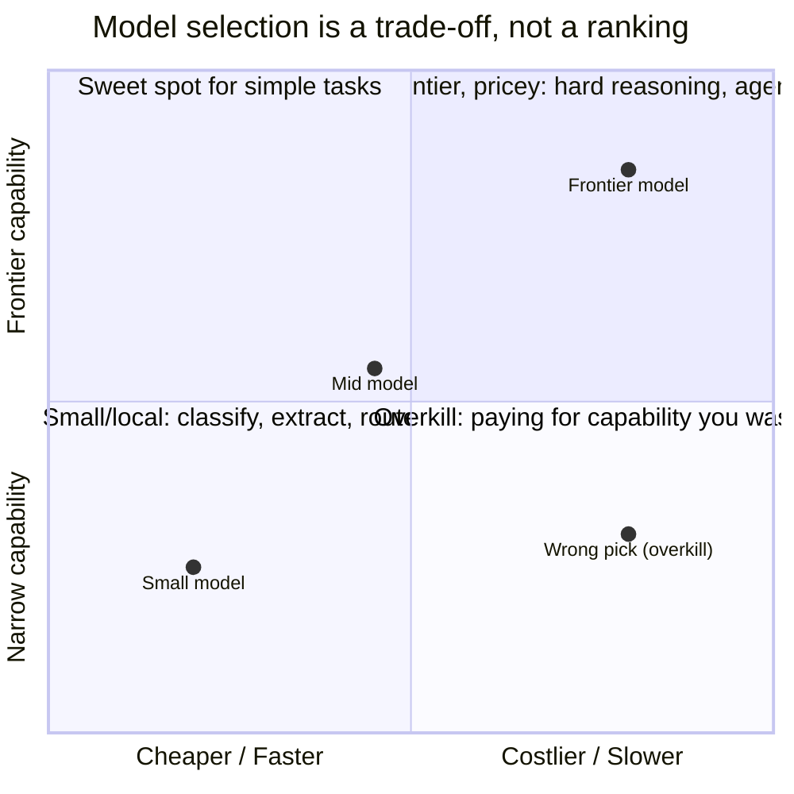

# Day 3 — Choosing a Foundation Model

> **Today's one idea:** Model choice is an engineering decision, not a leaderboard lookup — you pick the *cheapest model that clears your task's bar*, and the only bar that counts is your own eval, not a benchmark.
> **Reading time:** ~35 min · **Prereqs:** Day 2
> **Primary source for today:** Chip Huyen, *AI Engineering*, O'Reilly, 2025 (model selection & evaluation chapters).
> **Before you start:** Recall Day 2's load-bearing idea — one sentence, no looking: *in the CPU/OS analogy, what is the LLM, what is the harness, and which of the two holds all the state?*

## The hook (2–4 min)

A team picks "the best model" — top of the leaderboard, biggest, most capable — wires it into their support agent, and ships. It works. Then the bill arrives: every ticket costs 8× what it needed to, responses take 4 seconds, and the "smartest" model is *worse* at their one narrow task than a smaller one would have been, because it over-explains and ignores their format.

They optimized the wrong variable. "Best model" is a category error. There is no best model — there's the best model *for this task, at this cost, at this latency, given your constraints*. Day 1 said the model is a component you select; today is how you actually select it, the way you'd choose a database or a queue: against requirements, not hype.

## Building the intuition (10–15 min)

The foundation model is layer 1 of everything you'll build — the **Capability** layer. Get it wrong and no amount of harness, context, or loop engineering fully compensates (a model that can't do the task can't be prompted into doing it). But "wrong" rarely means "too weak" — more often it means **mismatched**: too expensive, too slow, too big, or optimized for the wrong thing.

Think of models on a few axes you trade off, not a single "quality" line:



The engineering move is **task-fit**: characterize what your task actually demands, then pick the smallest/cheapest model that clears it. The dimensions that matter:

- **Capability needed** — is this reasoning-heavy (multi-step agentic work, hard code) or shallow (classify, extract, rewrite)? Shallow tasks are wasted on frontier models.
- **Cost** — price per input/output token, multiplied by your *actual* token volume (which agents blow up — every turn re-sends context, Day 12). A 10× cheaper model that needs 2× the turns is still 5× cheaper.
- **Latency** — interactive chat needs sub-second first-token; a nightly batch job doesn't care. Bigger models are slower.
- **Context window** — how much can it hold? Matters for long documents/agents, but remember Day 4-to-come: a big window doesn't mean it *uses* the middle well.
- **Openness / deployment** — API (proprietary, easiest, data leaves your walls) vs. open-weight (self-host, control, privacy, ops burden). For your FraudOps-style regulated data, this can be the deciding axis, not capability.
- **Modality & tool-calling** — does it need vision, or reliable native tool-calling (Day 8)? Not all models are equal here.

The reframe: **you're not choosing "how smart," you're choosing "how much capability to buy per token, per second, and per privacy constraint."** And you often use *more than one* — a cheap model to route/classify, a frontier model for the hard step (that's model routing, Day 24). Model choice isn't one decision; it's a portfolio.

## The formal picture (10–15 min)

A disciplined selection is a filter, then a bake-off:

```
1. FILTER by hard constraints (non-negotiable):
   - data-residency / privacy  -> rules out APIs that can't meet it
   - max latency budget        -> rules out models too slow
   - required modality / tools  -> rules out models lacking them
   - max cost per request       -> a ceiling
2. CANDIDATE SET: 2-4 models that pass the filter (mix of sizes/vendors)
3. BAKE-OFF on YOUR eval (Day 23), not a public benchmark:
   - run each candidate on a frozen set of YOUR real tasks
   - score: task success, cost/request, p95 latency
4. PICK: the cheapest/fastest that clears your success bar.
   Re-run when models/prices change (they change monthly).
```

Formal points:

- **Public benchmarks are a prior, not a decision.** MMLU/leaderboard rank tells you roughly where a model sits; it does *not* tell you it's good at *your* task with *your* prompts and *your* data. Benchmarks are contaminated, gamed, and off-distribution from your use case. They narrow the candidate set; **your eval decides** (this is why Day 23's evaluation harness is a prerequisite skill for model selection — you literally cannot choose well without it).
- **Cost is a function of the system, not the sticker price.** Per-token price × tokens-per-request × requests. Agents multiply tokens brutally (context re-sent every turn). A "cheap" model in a wasteful loop can cost more than a "pricey" model in a tight one. You can't fully cost a model until you've built the harness around it — so model choice and system design are coupled, and you revisit the choice after measuring (Day 24).
- **Capability is jagged, not scalar (tomorrow's topic).** "This model is better" is usually false as stated — it's better at *some* things, worse at others (Day 4). Selection must be per-task, because a model that tops your reasoning eval may trail on your extraction eval.
- **The choice is reversible and should be re-made.** Unlike training your own model, swapping a foundation model is a config change (if your harness isn't tightly coupled to one — a reason to keep the model behind a thin interface). Prices drop and models improve monthly; treat selection as a standing decision you revisit, not a one-time commitment.

Where this sits in the course: model choice is layer 1 (Capability), but notice it *depends on* layer 5 (Feedback/eval, Day 23) to do well. That's the "conceptual stack vs. build order" tension the course flags: you meet model selection first conceptually, but you can only execute it rigorously once you can evaluate. So today gives you the framework; you'll close the loop when you build the eval harness.

## Where it breaks / what it is not (3–5 min)

- **"Biggest model = safest choice" is a trap.** It maximizes cost and latency to buy capability you often don't use, and can *underperform* on narrow tasks (over-reasoning, ignoring tight formats). Right-size, don't max out.
- **Benchmarks are not your eval.** A model topping a leaderboard can flop on your data. Never select on public benchmarks alone; they're a filter, not a verdict.
- **Don't marry a model.** Hard-coupling your whole harness to one vendor's quirks makes the reversible choice irreversible. Keep the model behind a thin adapter so you can swap and A/B.
- **Model choice can't fix a system problem.** If your agent fails because of bad context or a broken loop, a "better model" masks it at best. Diagnose *where* the failure is (Day 15's patterns, Day 23's eval) before blaming the model.

## Try it yourself (5–10 min)

**1. Retrieval first.** Close the page. Write the axes you trade off when picking a model, the single thing that should decide it (not a benchmark), and why "the best model" is a category error. Reopen after writing.

<details><summary>Hint</summary>Axes: capability needed, cost (× real token volume), latency, context window, openness/deployment, modality/tool-calling. Decided by *your own eval* on *your* tasks. "Best model" is wrong because capability is per-task and you're buying capability-per-cost/latency/privacy, not a scalar "smartness."</details>

<details><summary>Worked answer</summary>You trade off **capability needed** (reasoning-heavy vs. shallow), **cost** (price/token × your actual token volume, which agents inflate), **latency** (interactive vs. batch), **context window**, **openness/deployment** (API vs. self-hosted open weights — privacy/residency), and **modality/tool-calling support**. The decision should be made by a **bake-off on your own eval** (Day 23) — your real tasks, your prompts, your data — not a public leaderboard, which is only a prior for narrowing candidates. "The best model" is a category error because capability is **jagged and per-task** (a model tops one eval and trails another), and you're not buying scalar "smartness" — you're buying *how much capability per token, per second, and per privacy constraint*, which is a trade-off resolved against your specific requirements. You often pick a *portfolio* (cheap model to route, frontier model for hard steps).</details>

**2. Direct application — run a real bake-off.** Pick a real task you'd give an LLM. Write 5–10 representative test inputs with expected outputs. Run them through 2–3 models spanning sizes/prices (e.g. a small, a mid, a frontier). For each, record: success count, total cost, and p95 latency. Then answer: which is the *cheapest that clears your bar*? You'll often find it's not the biggest.

<details><summary>Hint</summary>Keep the prompt identical across models; vary only the model. The output of this exercise is a tiny table (model × success/cost/latency) — that table, not a benchmark, is a model-selection decision. This is also a first taste of Day 23's eval harness.</details>

<details><summary>Worked solution (the shape of the result)</summary>

```
task: classify support tickets into 4 categories (10 test cases)
model         success   cost(10 req)   p95 latency
small           9/10       $0.002         0.4s
mid            10/10       $0.02          0.9s
frontier       10/10       $0.15          2.1s
```

Decision: **mid** clears the bar (10/10) at 1/7th the cost and half the latency of frontier — the frontier model buys nothing here but expense. If `small`'s single miss is on a low-stakes case, `small` might even win. The lesson: the *cheapest model that clears your bar* is the right pick, and only a bake-off on your data reveals it — the frontier model was overkill you'd have paid for forever. (Rerun this table when prices/models change.)</details>

**3. Stretch.** Your bake-off shows the mid model succeeds but your agent re-sends 6K tokens of context every turn across ~15 turns. Estimate how the *system* changes the cost comparison versus a single-call use, and name the two levers (one you'll learn in context engineering, one in operations) that change *which model is cheapest*. (Previewing Days 11–17 and 24.)

<details><summary>Worked answer</summary>In a single-call use you pay ~6K tokens once; in a 15-turn agent you pay roughly 6K × 15 ≈ 90K input tokens (context re-sent each turn — Day 2's stateless model means the harness resends everything), so the *per-task* cost is ~15× the single-call estimate, and the gap between a cheap and a frontier model widens 15×. This can flip the decision: a frontier model that solves the task in 4 turns may beat a mid model that needs 12. Two levers change *which model is cheapest*: **(1) context engineering** — compaction and tighter assembly (Days 14, 12) cut tokens-per-turn, shrinking every model's cost but especially helping the expensive one become viable; **(2) operations** — prompt/context **caching** and **model routing** (Day 24), where a cheap model handles easy turns and the frontier model only the hard ones, so you pay frontier prices on a fraction of turns. The takeaway: model cost is inseparable from system design, so "which model is cheapest" is answered *after* you've engineered the harness and measured — model selection and system design are one coupled decision, revisited with data.</details>

> **Transfer — apply it:** For a real task at your work, write its hard constraints (privacy/residency? latency? modality?) that would *filter out* models before any capability comparison. One sentence: which constraint is non-negotiable, and does it force open-weight/self-hosted over an API?

## Connect it back

Day 2 framed the model as a stateless component; today you learned to *choose* that component like an engineer — filter by hard constraints, bake off on your own eval, pick the cheapest that clears the bar — and saw that model cost is a property of the whole system, not a sticker price. But "capability" is not one number: a model is brilliant at some things and baffling at others. Tomorrow: **model capabilities and failure modes** — the jagged reality you must design around. The question you can now answer: *why is "we picked the top-of-the-leaderboard model" a weak justification, and what would a strong one sound like?*

## Suggested readings for today

**Required if you have 15 extra minutes:** Chip Huyen, *AI Engineering*, O'Reilly, 2025 — the model-selection chapter: build vs. buy, open vs. proprietary, and evaluating candidates on your own tasks. It's the disciplined version of today's bake-off.

**If you want the deep version:**
- Huyen's evaluation chapter (skim now, return on Day 23) — why your eval, not benchmarks, must decide.
- Karpathy, "Software Is Changing (Again)," 2025 — [link](https://www.youtube.com/watch?v=LCEmiRjPEtQ) — the "jagged intelligence" framing that sets up tomorrow.

---

## Navigation

← **Previous:** [Day 2 — The Stateless Model & the Harness-as-OS](day-02-stateless-model-and-harness.md)  
→ **Next:** [Day 4 — Model Capabilities & Failure Modes](day-04-model-capabilities-and-failure-modes.md)
