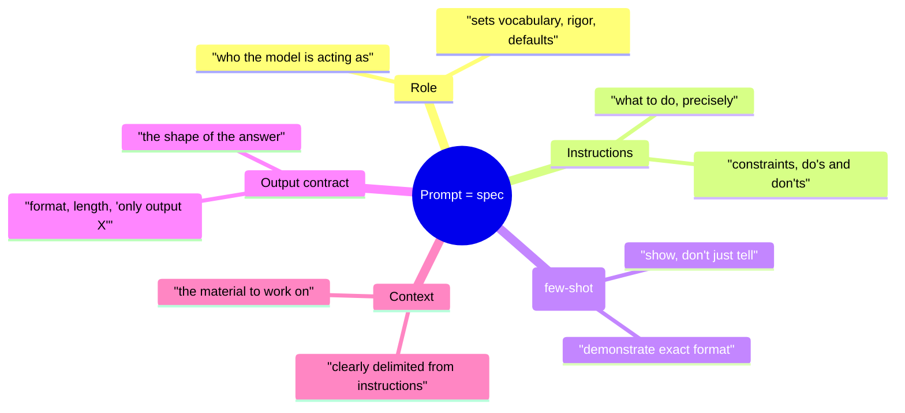

# Day 5 — Prompting as Programming

> **Today's one idea:** A prompt is not a wish you type — it's a specification you engineer: role, instructions, examples, and output contract that make a probabilistic model behave predictably.
> **Reading time:** ~35 min · **Prereqs:** Day 2
> **Primary source for today:** Chip Huyen, *AI Engineering*, O'Reilly, 2025 (prompt-engineering chapter); Anthropic, "Prompt Engineering" docs (docs.claude.com).
> **Before you start:** Recall Day 2's load-bearing idea — one sentence, no looking: *in the CPU/OS analogy, what is the LLM, what is the harness, and which of the two holds all the state?*

## The hook (2–4 min)

Two prompts, same model, same task:

> **A:** "Summarize this."
> **B:** "You are a technical editor. Summarize the text below for a busy engineer in exactly 3 bullet points, each ≤ 15 words, focusing on decisions and their rationale. Output only the bullets, no preamble. Text: …"

A gives you a paragraph, or five bullets, or a chatty preamble — different every run. B gives you the same shape every time, usable by the code downstream. The model didn't change. Prompt A *hoped*; prompt B *specified*.

Most people treat the prompt as a message to a helpful assistant. That's why their outputs are unpredictable. The reframe that fixes it: **a prompt is source code for behavior.** You're not asking — you're programming, in a language where the compiler is a probability distribution. Today you learn to write that code deliberately.

## Building the intuition (10–15 min)

Yesterday: the model is a stateless function `tokens_in → tokens_out`. The prompt *is* `tokens_in`. So writing a prompt is writing the input to a function whose behavior is entirely determined by that input (plus sampling randomness). That's programming — just in a probabilistic language.

But it's programming with a strange compiler. A normal compiler is deterministic and literal. The LLM "compiler" is:

- **Probabilistic** — same input can yield different outputs (temperature). You engineer to *narrow the distribution* toward what you want, not to force one answer.
- **Instruction-following but literal-ish** — it does roughly what you say, so vagueness ("summarize this") leaves huge freedom; precision ("3 bullets, ≤15 words, decisions only") collapses that freedom.
- **Pattern-completing** — it continues patterns. Show it two examples of the format you want and it'll match them (this is why examples are so powerful — "few-shot").

So the levers of prompt engineering are the levers that *narrow a probabilistic model's output distribution* toward your target. The main ones:



The single highest-leverage habit: **specify the output contract.** Downstream code has to consume the output, so pin its shape — "3 bullets," "valid JSON," "only the answer, no explanation." Half of flaky LLM features are just prompts that never said what the output should look like, so the model improvised. (Tomorrow, Day 6, hardens this into *machine-parseable* output — today is the human-readable discipline that precedes it.)

Second habit: **show, don't just tell.** One good example (few-shot) often beats three paragraphs of instructions, because the model is a pattern-completer. Want a specific tone or format? Demonstrate it once. This is why examples are code, not decoration.

Third: **separate instructions from data.** Put the material the model operates on in a clearly delimited block (quotes, XML-ish tags, a "Text:" label). Mixing your instructions with the user's content is how prompt-injection sneaks in (a user's text saying "ignore previous instructions") and how the model gets confused about what's a command vs. what's content. This separation is both a quality and a *security* practice — the same untrusted-input stance you'll apply to tools on Day 8.

## The formal picture (10–15 min)

A well-structured prompt has identifiable parts, usually assembled in this order (which also respects Day 11's positional attention — the important framing sits at the strong start):

```python
system = """You are a senior technical editor.               # ROLE
Summarize documents for busy engineers.

Rules:                                                        # INSTRUCTIONS
- Exactly 3 bullet points.
- Each bullet <= 15 words.
- Focus on decisions and their rationale; skip background.
- Output only the bullets. No preamble, no closing remarks.

Example:                                                      # FEW-SHOT (show the format)
Input: "The team debated Postgres vs Mongo and chose Postgres for its
        transactional guarantees, accepting slower iteration."
Output:
- Chose Postgres over Mongo for transactional guarantees.
- Accepted slower iteration as the tradeoff.
- Decision driven by data-integrity needs, not speed."""

user = f"""Summarize the text below.                          # TASK + delimited DATA

<text>
{document}
</text>"""                                                    # OUTPUT CONTRACT already in system
```

Formal points:

- **Role → system message; task+data → user message.** Modern chat APIs separate a `system` prompt (standing behavior, strong position, stable across turns) from `user` messages (the specific request). Put durable behavior in `system`; put the variable request and data in `user`. This maps onto the context structure you'll formalize on Day 11.
- **Few-shot is in-context learning, not training.** Examples in the prompt change behavior *for this call only* — no weights change (Day 1's "adapt without training"). It's the cheapest, fastest adaptation lever you have. Cost: examples eat context budget (Day 12), so use the *fewest* that pin the pattern.
- **Determinism is a knob (`temperature`).** For a fixed shape (extraction, classification, tool calls), set temperature low (near 0) to narrow the distribution; for creative generation, raise it. Prompt engineering and sampling settings work together to control output variance.
- **The prompt is versioned code.** Because behavior depends on it, changing a prompt is a code change: it can regress. Production teams *version prompts and test them* (Day 23's evaluation applies directly to prompts). "I tweaked the prompt and it seems better" is the same anti-pattern as "I changed the code and it seems to work" — you measure.

A note on where prompting lives in the course: prompting shapes a *single* model call. The harness (Modules 1, 5) wraps that call; the loop (Modules 2, 4) repeats it; context engineering (Module 3) decides what fills it. So prompting is the foundational skill under all of them — every tool schema (Day 8), every system prompt in your loop (Day 10), every summarization step (Day 14) is a prompt you're engineering.

## Where it breaks / what it is not (3–5 min)

- **Prompting is not the whole of AI engineering.** It's one lever. A perfect prompt with no context management, no tools, and no eval is still a demo. Day 1's warning stands: the prompt is the tip of the iceberg.
- **More instructions ≠ better.** Past a point, piling on rules confuses the model and buries the important ones (Day 11's Lost-in-the-Middle applies *inside* the prompt too). Prefer a few sharp instructions + one example over a wall of caveats.
- **Prompts don't fix capability gaps.** If the task needs information the model doesn't have, no prompt conjures it — you need context/retrieval (Module 3) or tools (Day 7). Prompting narrows the distribution; it can't add missing knowledge.
- **Clever phrasing is fragile; structure is robust.** "Magic" incantations ("take a deep breath," "you are the world's best…") are unreliable and model-specific. Durable prompting is *structural* — clear role, precise instructions, examples, output contract — not incantation-hunting.

## Try it yourself (5–10 min)

**1. Retrieval first.** Close the page. List the parts of a well-structured prompt and name the single highest-leverage habit for making output predictable. Say why "a prompt is programming" is literally (not metaphorically) true. Reopen after writing.

<details><summary>Hint</summary>Role, instructions, few-shot examples, output contract, delimited data. Highest-leverage: specify the output contract. Literally programming because the prompt *is* `tokens_in` to the model function, and behavior is determined by it.</details>

<details><summary>Worked answer</summary>A structured prompt has: a **role** (who the model acts as), **instructions** (precise task + constraints), **few-shot examples** (demonstrate the exact format), an **output contract** (the required shape/length/format), and **clearly delimited data** (the material to work on, separated from instructions). The highest-leverage habit is **specifying the output contract** — pin the shape the answer must take — because downstream code consumes it and unspecified shape means the model improvises, causing flakiness. It's literally programming because the prompt *is* the input tokens to the model's `tokens_in → tokens_out` function (Day 2); behavior is fully determined by that input plus sampling, so writing the prompt is writing the program, in a probabilistic language whose "compiler" you steer by narrowing the output distribution.</details>

**2. Direct application — turn a wish into a spec.** Take a vague prompt you'd actually use ("explain this error", "write a commit message", "classify this ticket"). Rewrite it with all five parts: role, instructions, one few-shot example, an explicit output contract, and delimited input. Run the vague and the structured version 3× each at temperature 0.7 and compare the *variance* of the outputs' shape. The structured one should be near-identical each run; the vague one won't be.

<details><summary>Hint</summary>The metric isn't "which answer is nicer" — it's "how consistent is the *shape* across runs." Consistency is what makes an LLM call usable inside a larger system. Run each 3 times and eyeball whether the format holds.</details>

<details><summary>Worked solution (ticket classifier example)</summary>

```python
system = """You classify support tickets. Output exactly one line:
CATEGORY: <billing|technical|account|other>
CONFIDENCE: <high|medium|low>
No other text.

Example:
Ticket: "I was charged twice this month"
CATEGORY: billing
CONFIDENCE: high"""

user = f"<ticket>\n{ticket}\n</ticket>"
# temperature=0 for a classifier: you want the SAME label every time.
```

Run the vague version ("What kind of ticket is this?") 3× and you'll get prose, varying labels, sometimes a paragraph. Run the structured version 3× at temp 0 and you get the identical two-line contract every time — parseable by code with a trivial split. You've just converted an unreliable call into a component. The lesson: *predictable shape is engineered, not hoped for* — and it's the prerequisite for tomorrow, where the shape becomes a strict machine schema.</details>

**3. Stretch.** Your structured classifier outputs `CATEGORY: billing`. Tomorrow you'll want the model to emit *strict JSON* your code parses directly. Name two reasons a human-readable contract ("CATEGORY: billing") is still risky for a program to consume, and what you'd want instead. (Previewing Day 6.)

<details><summary>Worked answer</summary>Two risks: **(1) The model can drift from the contract** — it might emit `Category: Billing`, add a stray "CONFIDENCE: high (this is clearly a payment issue)", or wrap the answer in prose despite "no other text," and your `split(":")` parser breaks. Natural-language contracts are *soft*; the model follows them *usually*, not *always*. **(2) No validation** — "billing" could be misspelled or a category you don't support, and nothing checks it before your code trusts it. What you want instead: a **strict, machine-checkable output format** — JSON conforming to a schema (with an enum for the category) that your harness *parses and validates*, rejecting or repairing malformed output rather than trusting it. That's the "parse boundary" of Day 6 — turning a soft human contract into a hard machine contract, the same untrusted-input discipline you'll apply to tools on Day 8.</details>

> **Transfer — apply it:** Take one LLM call in your own work and write its output contract as a single sentence: exactly what shape must the output take for your code to consume it without special-casing? If you don't have one, that call is a latent bug.

## Connect it back

Day 2 framed the model as a stateless function you call; today you learned to *write the input to that function as a program* — role, instructions, examples, and above all an output contract that narrows a probabilistic model toward predictable behavior. But a human-readable contract is still soft. Tomorrow we make it hard: **structured output and the parse boundary** — getting output your code can trust, and rejecting output it can't. The question you can now answer: *why does "summarize this" produce unreliable results while a five-part prompt produces the same shape every run — and what changed about the model? (Nothing — the input did.)*

## Suggested readings for today

**Required if you have 15 extra minutes:** Anthropic, "Prompt Engineering" documentation (docs.claude.com) — the sections on system prompts, being clear and direct, and using examples (multishot). It's the structural, non-incantation view of prompting you practiced today.

**If you want the deep version:**
- Chip Huyen, *AI Engineering*, O'Reilly, 2025 — the prompt-engineering chapter, especially the parts on prompt structure and prompt versioning/testing (which connects to Day 23).
- Wei et al., "Chain-of-Thought Prompting," NeurIPS 2022, arXiv:2201.11903 — how *asking the model to reason step by step* in the prompt improves hard tasks; you'll reuse this as the "Thought" step when you build the loop (Day 10).

---

## Navigation

← **Previous:** [Day 4 — Model Capabilities & Failure Modes](../../00-foundations/days/day-04-model-capabilities-and-failure-modes.md)  
→ **Next:** [Day 6 — Structured Output & the Parse Boundary](day-06-structured-output.md)
