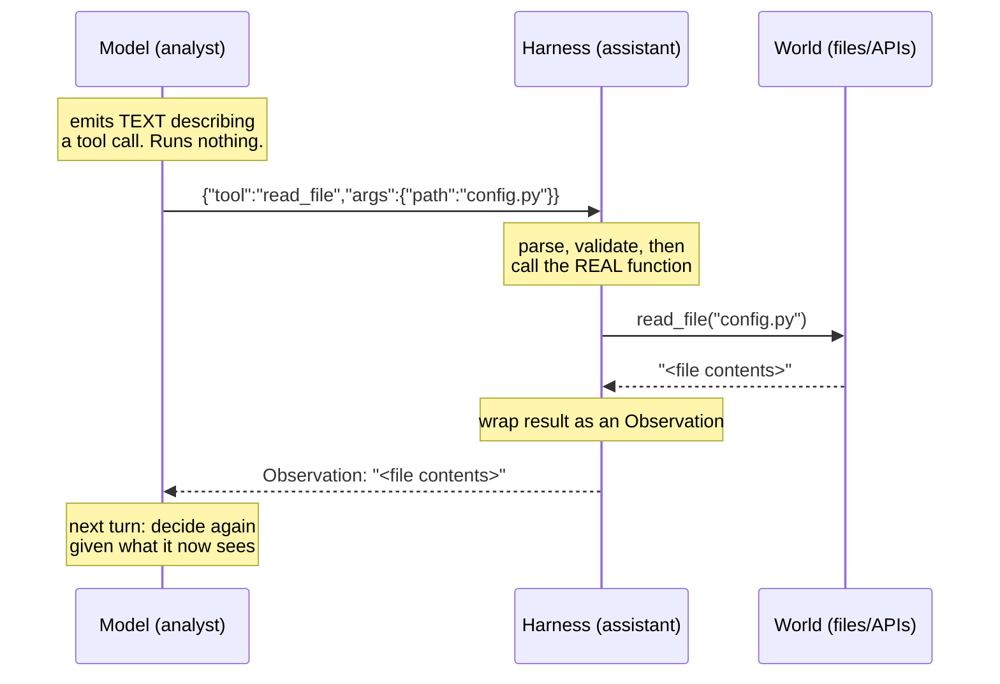

# Day 5 — Tools: The Model's Hands

> **Today's one idea:** A tool is just a function the model can *ask* the harness to run; the model never runs anything — it only emits a request, and the harness does the acting.
> **Reading time:** ~35 min · **Prereqs:** Day 7
> **Primary source for today:** Schick et al., "Toolformer: Language Models Can Teach Themselves to Use Tools," 2023, arXiv:2302.04761.
> **Before you start:** Recall Day 4's load-bearing idea — one sentence, no looking: *why do reliable systems demand machine-parseable model output, and what is the "parse boundary"?*

## The hook (2–4 min)

Watch an agent "search the web," and it feels like the model reached out and grabbed a page. It didn't. Here is what actually happened, in full:

The model produced this text:

```json
{"tool": "web_search", "query": "harness engineering"}
```

…and then stopped. That's it. That's the entire "action." The model emitted a string that *describes* a search. It did not open a socket, did not hit Google, did not read a result. It typed a wish and went to sleep.

Everything else — actually running the search, getting real results, handing them back — was done by boring, ordinary code *you* wrote. The magic of "the AI used a tool" is, on inspection, the model writing a function call as text and your harness dutifully executing it. Today we make that division absolute, because getting it wrong is the source of a whole category of bugs and security holes.

## Building the intuition (10–15 min)

Picture a brilliant analyst locked in a room with a phone that only makes *outgoing* calls to one assistant. The analyst can think brilliantly but can't touch anything in the world. When they need something — a file, a calculation, a web lookup — they call the assistant and say, in words: "Please open `config.py` and read me lines 1–20." The assistant does it and reads the result back. The analyst never leaves the room.

- The **analyst** is the model. Brilliant, blind, handless.
- The **phone call** is the tool call — a *request*, phrased as text.
- The **assistant** is the harness. It has hands; it does the actual work.
- The **spoken result** is the observation, fed back into the room.

The analyst's only power over the world is *asking*. The assistant's only job is *doing what's asked* (after checking it's safe and sane). Neither can do the other's job. This separation isn't a limitation to engineer around — it's the design. It's what lets you sandbox, validate, log, and rate-limit every real action, because every real action flows through *your* code, never the model's.

So a **tool** is nothing exotic. It's a function you already know how to write:

```python
def read_file(path: str) -> str:
    return open(path).read()
```

What makes it a *tool* is that you've done two extra things:

1. **Described it to the model** — its name, what it does, and what arguments it takes — so the model knows it can ask for it.
2. **Wired it into the loop** — so when the model emits a request for it, the harness recognizes the name, calls the real function, and returns the result as the next observation.



Recall Day 7's loop: the **Act** step is where a tool call happens, and the **Observe** step is the harness feeding the result back. Tools are what make the loop *do* anything. Without tools, the loop is a model talking to itself forever. Toolformer's core insight is exactly this framing: teach the model to emit API calls at the right moments as part of its text, and let the surrounding system execute them — the model *decides*, the system *acts*.

The mental model to burn in: **the model's output is a wish list, not an action log.** When you read `{"tool": "delete_file", "args": {"path": "prod.db"}}` in the model's output, nothing has happened yet. It's a *request sitting in your hands.* Whether it happens is entirely your harness's decision. This is your leverage and your safety boundary at once.

## The formal picture (10–15 min)

A tool has three parts:

1. **A schema** — a machine-readable description the model sees: name, purpose, and typed parameters. In practice this is JSON Schema. Example:

```json
{
  "name": "read_file",
  "description": "Read a UTF-8 text file and return its contents.",
  "input_schema": {
    "type": "object",
    "properties": {"path": {"type": "string", "description": "Relative path."}},
    "required": ["path"]
  }
}
```

2. **An implementation** — the actual function the harness runs (`def read_file(path): ...`).

3. **A binding** — a lookup in the harness from tool name → implementation, so a parsed request can be dispatched.

The lifecycle of a single tool use, formally:

```
model emits  →  tool_call{name, args}          # a REQUEST (text), no side effect
harness:        validate(name, args) against schema   # Day 6
                fn = registry[name]             # binding / dispatch
                result = fn(**args)             # the ONLY place the world is touched
                observation = format(result)    # back into context
loop continues with observation appended
```

Two formal commitments that will save you weeks of debugging:

- **The model emits, the harness executes. Always.** There is no code path where the model touches the world. If your design ever has the model "doing" something, you've drawn the boundary wrong. (Modern APIs give you "tool calling" / "function calling" that returns the tool call as *structured output* — this is a convenience for parsing, Day 6, not a change to who executes. It's still the harness that runs the function.)
- **Model output is untrusted input.** The `args` came from a probabilistic text generator. They can be malformed, wrong, or dangerous (`path: "../../etc/passwd"`). The harness must treat every tool call the way a web server treats a form submission from a stranger: validate before acting. We build this boundary on Day 6; today just hold the stance.

Why schemas at all? Because the model needs to know *what it's allowed to ask for and how to phrase the ask.* The schema is the menu. A good menu (clear names, tight types, honest descriptions) produces good tool calls; a vague one produces garbage. This is why Day 6 and the "Writing Effective Tools" post matter — the schema is a prompt, and you're designing it.

The design space of *what* to expose as tools is itself a lever: coarse tools (`run_bash`) are flexible but dangerous and hard to validate; fine tools (`read_file`, `list_dir`) are safe and legible but you need more of them. You'll weigh this on Day 6 and again in the capstone.

## Where it breaks / what it is not (3–5 min)

- **"Function calling" doesn't mean the model calls the function.** The name is misleading. The model *requests*; the harness *calls*. Every provider's "function calling" feature is really "the model reliably emits a structured request that you then execute." Keep the verb straight.
- **A tool is not a plugin or an integration per se.** Those are packaging. Underneath, a tool is always: schema + function + binding. Don't let framework vocabulary hide the three parts.
- **The model can request a tool that doesn't exist, or with wrong args.** It hallucinates. `{"tool": "send_emial", ...}` (typo) or a missing required field will happen. The harness needs a graceful answer ("no such tool" / "invalid args") fed back as an observation — not a crash. (Day 6, Day 20.)
- **Exposing a tool is granting a capability.** Give the model a `delete` tool and it *will*, eventually, request a delete you didn't want. Tool surface = attack surface. The safest tool is the one you didn't expose.

## Try it yourself (5–10 min)

**1. Retrieval first.** Close the page. Write: *What are the three parts of a tool, and who executes the actual function — the model or the harness?* Add one sentence on why model-emitted tool arguments must be treated as untrusted. Reopen after writing.

<details><summary>Hint</summary>Schema, implementation, binding. The harness executes. Args come from a probabilistic generator, so they can be malformed or malicious.</details>

<details><summary>Worked answer</summary>A tool is **(1) a schema** (name + description + typed params the model sees), **(2) an implementation** (the real function), and **(3) a binding** (name → function lookup in the harness). The **harness** executes the function; the model only emits a text request naming the tool and its arguments. Those arguments are untrusted because they're generated probabilistically by the model — they can be malformed, factually wrong, or actively dangerous — so the harness must validate them before acting, exactly as a server validates input from an anonymous client.</details>

**2. Direct application — define and dispatch a real tool.** Write a tiny registry: a schema for `read_file`, the function, and a `dispatch(name, args)` that looks up and runs it. Then simulate a model output — a dict `{"tool": "read_file", "args": {"path": "README.md"}}` — and run it through dispatch. Add a bogus call (`{"tool": "nope", "args": {}}`) and make dispatch return a clean error string instead of crashing. You've just built the Act step of Day 7's loop.

<details><summary>Hint</summary>`registry = {"read_file": read_file}`. `dispatch` should `try` the lookup and call, and `except`/guard the missing-name and bad-args cases, returning a string either way (the observation is always text).</details>

<details><summary>Worked solution (Python)</summary>

```python
def read_file(path: str) -> str:
    with open(path, encoding="utf-8") as f:
        return f.read()

TOOLS = {
    "read_file": {
        "fn": read_file,
        "schema": {
            "name": "read_file",
            "description": "Read a UTF-8 text file and return its contents.",
            "input_schema": {
                "type": "object",
                "properties": {"path": {"type": "string"}},
                "required": ["path"],
            },
        },
    }
}

def dispatch(name: str, args: dict) -> str:
    """Run a model-requested tool. Always returns a string (the observation)."""
    tool = TOOLS.get(name)
    if tool is None:
        return f"Error: no tool named '{name}'. Available: {list(TOOLS)}"
    try:
        return str(tool["fn"](**args))          # the ONLY line that touches the world
    except TypeError as e:
        return f"Error: bad arguments for '{name}': {e}"
    except Exception as e:
        return f"Error running '{name}': {e}"

# Simulate model outputs (in reality these are parsed from tokens_out, Day 6):
print(dispatch("read_file", {"path": "README.md"})[:80])  # real result
print(dispatch("nope", {}))                                # clean error, no crash
print(dispatch("read_file", {"wrong": "arg"}))             # clean error, no crash
```

Notice: exactly one line (`tool["fn"](**args)`) touches the world, and it's guarded on all sides. The model can throw anything at `dispatch`; the harness stays standing. This function reappears — hardened — on Day 6, and drops straight into your loop on Day 8.</details>

**3. Stretch.** Your `dispatch` runs any args the model sends. Suppose the model requests `read_file` with `path="/etc/shadow"` or `path="../../../secrets.env"`. Dispatch would happily read it. Sketch (in words or code) the *one check* you'd add and *where* — and note which day's topic this really is. (You're extrapolating to the security boundary.)

<details><summary>Worked answer</summary>Add a **path-confinement check** inside `read_file` (or, better, in a validation step *before* dispatch calls the function): resolve the requested path to an absolute path and reject it if it escapes an allowed root. e.g. `p = (ROOT / path).resolve(); if not str(p).startswith(str(ROOT.resolve())): return "Error: path outside workspace"`. The key point: this belongs at the **tool boundary in the harness**, never in the model — you cannot trust the model to police its own requests. This is the heart of **Day 6 (the tool interface)** and connects to **Day 20 (failure/safety)**. Exposing a tool without confining its inputs is how a helpful `read_file` becomes a data-exfiltration primitive.</details>

> **Transfer — apply it:** Pick one capability you'd want an agent in your domain to have (query a DB, call an internal API, move a file). Write its tool as one line of schema-in-English: *name, what it does, what one argument it takes.* Then note one dangerous argument value the model might send — that's the thing Day 6 will make you validate.

## Connect it back

Yesterday you learned to get *structured* output from the model ([Day 4](day-04-structured-output.md)); today a tool turned out to be exactly that — structured output that *requests an action*, which the harness runs and reports back. The model's hands are just its structured output, executed by your code. But we've been hand-waving one danger: the model can emit a malformed or hostile request. Tomorrow we make the tool boundary a *trust* boundary — validating every call before it touches the world. (And once the harness can safely act, the next module asks the real question: why call the model *repeatedly*? — the loop.) The question you can now answer: *when an agent "uses a tool," what did the model actually do, and what did the harness do?*

## Suggested readings for today

**Required if you have 15 extra minutes:** Anthropic, "Writing Effective Tools for AI Agents," 2025 — [link](https://www.anthropic.com/engineering/writing-tools-for-agents). Read the section on designing tool descriptions and namespaces. It makes concrete why the *schema* (not the implementation) is where tool-use quality is won — the setup for Day 6.

**If you want the deep version:**
- Toolformer (arXiv:2302.04761), §2 — the abstraction of tools as API calls the model emits inline. Skim the training method; focus on the framing.
- Schick's framing pairs well with Anthropic, "Building Effective Agents" (2024) — [link](https://www.anthropic.com/engineering/building-effective-agents), the "tools" subsection — for how tool granularity shapes the whole agent.

---

## Navigation

← **Previous:** [Day 4 — Structured Output & the Parse Boundary](day-04-structured-output.md)  
→ **Next:** [Day 6 — The Tool Interface](day-06-the-tool-interface.md)
