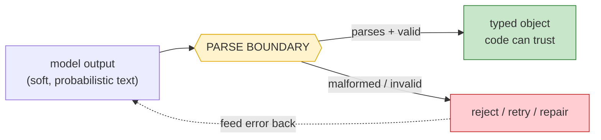

# Day 6 — Structured Output & the Parse Boundary

> **Today's one idea:** For a model's output to drive code, it must be *machine-parseable and validated* — so the harness's job is to constrain the output to a schema and treat whatever comes back as untrusted until it passes the parse boundary.
> **Reading time:** ~35 min (code day) · **Prereqs:** Day 5
> **Primary source for today:** Chip Huyen, *AI Engineering*, O'Reilly, 2025 (structured outputs); Anthropic, "Tool use / structured outputs" docs (docs.claude.com).
> **Before you start:** Recall Day 5's load-bearing idea — one sentence, no looking: *what makes a prompt a "program" rather than a wish, and what's the single highest-leverage habit for predictable output?*

## The hook (2–4 min)

Yesterday's classifier emits `CATEGORY: billing`. You write `label = out.split(":")[1].strip()` and ship. It works for a week. Then the model, on an ambiguous ticket, emits:

> `CATEGORY: billing (though it could be account — the user mentions both)`

Your parser returns `"billing (though it could be account — the user mentions both)"`, which isn't a valid category, and the code that routes on it throws in production at 2am.

The model didn't malfunction. It followed your *soft* contract *loosely*, as probabilistic models do. The bug is that you trusted free text to be structured. The fix is a hard boundary: make the model emit a **strict schema**, and **parse-and-validate** before any code touches the value. That boundary — where soft model text becomes hard typed data — is today's whole subject, and it's the seam every tool call (tomorrow) rides on.

## Building the intuition (10–15 min)

Recall Day 5: a prompt narrows the output distribution but never fully pins it — the model *usually* obeys the format. "Usually" is fine for a human reader and fatal for a parser. Between the model and your code you need a checkpoint, exactly like the boundary between a web form and your database:



Two moves make the boundary solid:

**1. Constrain the output *before* generation.** Don't just ask for JSON in the prompt and hope — use the provider's structured-output mechanism to *require* it. Modern APIs offer this in escalating strength:
- **Prompt + parse** (weakest): ask for JSON, then `json.loads`. Works often, fails on drift.
- **JSON mode**: the API guarantees syntactically valid JSON (but not *your* schema).
- **Schema-constrained / tool-calling** (strongest): you supply a JSON Schema, and the API constrains generation to conform to it — the output is valid *against your schema* by construction.

The stronger the constraint, the fewer failures reach your parser. Prefer schema-constrained output whenever the value drives code.

**2. Validate *after* generation anyway.** Even schema-constrained output deserves a validation pass, because "conforms to JSON Schema" isn't "semantically valid for my domain" — the category enum might be satisfied but the referenced ID might not exist. Validation is your last line; it turns "probably fine" into "checked." And crucially, when validation fails, the failure becomes *information you feed back to the model* ("that category isn't in the allowed set; choose from …") rather than a crash — the same recover-don't-die reflex you'll formalize for tools (Day 8) and failures (Day 22).

The mental model to burn in: **model output is untrusted input until it crosses the parse boundary.** Not because the model is malicious, but because it's probabilistic — it can drift, hallucinate a field, or wrap the answer in prose. Your harness treats it the way a server treats an anonymous request: constrain what you can, validate the rest, never trust raw.

## The formal picture (10–15 min)

The pattern, using a schema + validation. (Pydantic in Python makes the schema and the validator the same object.)

```python
from pydantic import BaseModel, field_validator
import anthropic, json

ALLOWED = {"billing", "technical", "account", "other"}

class Classification(BaseModel):            # the SCHEMA (and validator)
    category: str
    confidence: str
    @field_validator("category")
    @classmethod
    def known_category(cls, v):
        if v not in ALLOWED:                # semantic validation beyond JSON-shape
            raise ValueError(f"category '{v}' not in {ALLOWED}")
        return v

client = anthropic.Anthropic()

def classify(ticket: str, max_retries: int = 2) -> Classification:
    schema = Classification.model_json_schema()
    messages = [{"role": "user", "content": f"<ticket>\n{ticket}\n</ticket>"}]
    for attempt in range(max_retries + 1):
        resp = client.messages.create(
            model="claude-sonnet-5", max_tokens=200, temperature=0,
            system=("Classify the ticket. Respond ONLY with JSON matching this schema:\n"
                    + json.dumps(schema)),
            messages=messages,
        )
        raw = "".join(b.text for b in resp.content if b.type == "text")
        try:
            return Classification.model_validate_json(raw)   # PARSE BOUNDARY: parse + validate
        except Exception as e:
            # failure becomes feedback, not a crash (Day 8 / Day 22 reflex)
            messages += [{"role": "assistant", "content": raw},
                         {"role": "user", "content": f"That was invalid: {e}. Return corrected JSON only."}]
    raise ValueError("model could not produce valid output after retries")
```

Formal points:

- **The schema is written twice, for two audiences.** Once *for the model* (in the prompt / as a tool schema — "here's the shape I want") and once *for your code* (as a validator — "reject anything that doesn't match"). Pydantic conveniently unifies them, but conceptually they're distinct: one narrows generation, one guards consumption. Never rely on only the first.
- **Retry-with-feedback is the standard repair loop.** On a parse/validation failure, append the bad output and the error, and ask again. This works because the model is good at *correcting* a named mistake — a mini version of the recovery you'll build on Day 22. Cap the retries (probabilistic ≠ guaranteed to ever succeed).
- **This is the direct ancestor of tool calling.** A tool call (Day 7) *is* structured output: the model emits `{"name": "read_file", "input": {"path": "..."}}` conforming to the tool's schema, and your harness parses+validates it before dispatch. Everything you learned today — schema-constrain, then validate, treat as untrusted — is exactly the tool boundary tomorrow. Native "tool calling" is just schema-constrained structured output with a dispatch step bolted on.
- **Structured output is where prompting meets systems.** Day 5 made output *predictable*; today makes it *trustworthy to code*. The step up is from "a human can read it" to "a program can depend on it" — the threshold an LLM call must cross to be a real system component.

## Where it breaks / what it is not (3–5 min)

- **JSON mode ≠ your schema.** Guaranteed-valid-JSON is not guaranteed-valid-*for-you*. `{"foo": 1}` is valid JSON and useless if you needed `{"category": ...}`. Always validate against *your* schema, not just JSON syntax.
- **Schema-constrained output can still be semantically wrong.** The model can emit a perfectly-schema-valid classification that's simply *incorrect*, or reference an ID that doesn't exist. Structural validity is not correctness — semantic validators (does this ID exist? is this in the enum?) still matter, and correctness itself needs evaluation (Day 23).
- **Over-constraining hurts.** If the schema is so rigid the model can't express a needed case (no "unsure" option, no free-text field for edge cases), it'll produce forced, wrong answers. Leave a valid escape hatch (an `"other"` / `"needs_review"` path) so the model isn't cornered into lying.
- **Retries cost tokens and latency.** Each repair round is another call. If you're retrying often, the fix is usually a better schema or clearer prompt, not more retries — measure your parse-failure rate (Day 24) and fix the cause.

## Try it yourself (5–10 min)

**1. Retrieval first.** Close the page. Explain what "the parse boundary" is, the two moves that make it solid (before vs. after generation), and why model output is "untrusted input." Reopen after writing.

<details><summary>Hint</summary>Parse boundary = the checkpoint where soft model text becomes hard typed data. Two moves: constrain generation to a schema *before* (JSON mode / schema-constrained / tool-calling), and parse+validate *after* (reject/repair on failure). Untrusted because the model is probabilistic — it can drift, hallucinate fields, or add prose, so raw output can't be trusted by code.</details>

<details><summary>Worked answer</summary>The parse boundary is the checkpoint between the model and your code where soft, probabilistic model text is turned into hard, typed data your program can depend on — nothing downstream touches the value until it crosses. Two moves make it solid: **before generation**, constrain the output to a schema using the strongest available mechanism (schema-constrained / tool-calling > JSON mode > prompt-and-hope), so fewer malformed outputs are even produced; **after generation**, parse and validate against *your* schema (including semantic checks like enums/IDs), and on failure reject, retry-with-feedback, or repair rather than crash. Model output is untrusted input because the model is probabilistic — it can drift from the format, invent a field, or wrap the answer in prose — so the harness must treat it like an anonymous web-form submission: constrain what it can, validate the rest, trust nothing raw.</details>

**2. Direct application — build a validated extractor.** Pick a real extraction task (parse an address, extract action items from a meeting note, pull fields from an invoice). Define a schema (Pydantic or JSON Schema) with at least one *semantic* validator (an enum, a required-format field, or a cross-field check). Wire schema-constrained generation + parse-and-validate + one retry-with-feedback. Then feed it a deliberately tricky input and confirm: valid outputs pass, an invalid one triggers the retry, and your code never receives an unvalidated value.

<details><summary>Hint</summary>To force the retry path, either lower the constraint (prompt-only JSON) or craft input that tempts the model to add a caveat. Log each attempt's raw output and the validation error so you can see the boundary doing its job.</details>

<details><summary>Worked solution (invoice fields)</summary>

```python
from pydantic import BaseModel, field_validator
from datetime import date

class Invoice(BaseModel):
    vendor: str
    amount: float
    currency: str
    due: date
    @field_validator("currency")
    @classmethod
    def iso_currency(cls, v):
        if v not in {"USD", "EUR", "GBP", "INR"}:
            raise ValueError(f"unsupported currency '{v}'")
        return v
    @field_validator("amount")
    @classmethod
    def positive(cls, v):
        if v <= 0: raise ValueError("amount must be positive")
        return v
```

Feed it "Invoice from Acme, ₹4,500 due next Friday." Observe: the model must resolve "₹"→INR (currency validator passes), "4,500"→4500.0 (positive passes), "next Friday"→an ISO date (Pydantic's date parser is your format validator). If it emits "4,500" as a string with a comma or an unsupported currency, validation fails, the error is fed back, and the retry corrects it. Your routing code only ever sees a fully-typed `Invoice`. That guarantee — *code never touches unvalidated model output* — is what makes the extractor a dependable component instead of a 2am incident. Tomorrow, this exact machinery becomes the tool boundary.</details>

**3. Stretch.** Tomorrow the model won't just return data — it'll return a *request to run a function* (a tool call). Explain how today's schema-constrain-then-validate pattern maps onto a tool call, and name the one *new* danger a tool call adds that a data extraction doesn't. (Previewing Days 7–8.)

<details><summary>Worked answer</summary>A tool call is structured output whose schema is the tool's input schema: the model emits `{"name": "read_file", "input": {"path": "..."}}`, and the harness applies the *same* pattern — constrain generation to the tool schema (so the shape is right), then parse and validate the arguments before use. So "schema-constrain then validate" is exactly the tool boundary; "tool calling" is this pattern plus a dispatch step. The **new danger**: a data extraction's validated output is *inert* — worst case you store a wrong value. A tool call's validated output triggers a *real-world side effect* (reading a file, hitting an API, writing to a DB). So validation at the tool boundary isn't just "is this well-formed?" but "is it *safe to execute*?" — e.g. does this path escape the workspace, is this delete allowed. Structural validity was enough for data; for actions you also need *authorization/safety* validation, because a schema-valid `{"path": "../../etc/passwd"}` is still an attack. That's why Day 8 treats the tool boundary as a *trust* boundary, not just a parse boundary.</details>

> **Transfer — apply it:** Find one place in your work where code consumes LLM output via string parsing or a naked `json.loads`. Write the schema + one semantic validator it's missing. One sentence: what malformed output would currently slip through and break downstream?

## Connect it back

Day 5 made output *predictable*; today made it *trustworthy to code* — a strict schema to constrain generation, a parse-and-validate boundary to guard consumption, and retry-with-feedback to repair, all on the stance that model output is untrusted until it passes. That boundary is the ancestor of everything the harness does with model output. Tomorrow it comes alive: **tools** — where the model's structured output is a *request to act on the world*, and the harness runs it. The question you can now answer: *your classifier emits `billing (probably)` and the router throws — where should that have been caught, and what are the two moves that catch it?*

## Suggested readings for today

**Required if you have 15 extra minutes:** Anthropic, "Tool use" / structured outputs documentation (docs.claude.com) — how the API constrains output to a schema. You'll use this exact mechanism for tools tomorrow; today read it as "structured output," tomorrow re-read it as "tool calling."

**If you want the deep version:**
- Chip Huyen, *AI Engineering*, O'Reilly, 2025 — the structured-outputs section: constrained decoding, JSON mode, and why validation belongs in your code.
- Skim the Pydantic docs on validators — the pattern of schema-as-validator is the cleanest way to hold the parse boundary in Python.

---

## Navigation

← **Previous:** [Day 5 — Prompting as Programming](day-05-prompting-as-programming.md)  
→ **Next:** [Day 7 — Tools: The Model's Hands](day-07-tools-the-models-hands.md)
