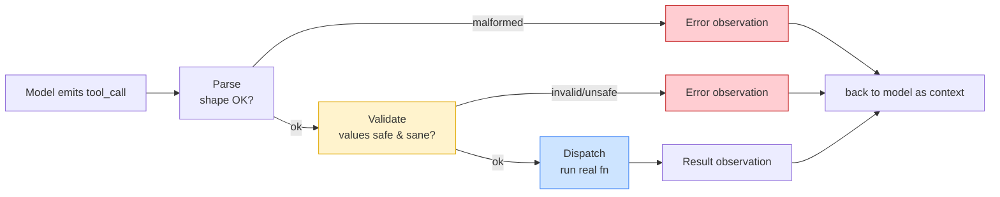

# Day 6 — The Tool Interface

> **Today's one idea:** The tool boundary is a trust boundary — treat every model-emitted tool call as untrusted input, so the loop is: describe well → parse → *validate* → dispatch.
> **Reading time:** ~40 min (code day) · **Prereqs:** Day 8, Day 5
> **Primary source for today:** Anthropic, "Writing Effective Tools for AI Agents," 2025.
> **Before you start:** Recall Day 5's load-bearing idea — one sentence, no looking: *what are the three parts of a tool, and who executes the real function — the model or the harness?*

## The hook (2–4 min)

Your Day 8 agent has a `read_file` tool. A user asks it to "summarize the project." The model, reasoning helpfully, emits:

```json
{"tool": "read_file", "args": {"path": "../../../../etc/passwd"}}
```

Your `dispatch` runs it. The file contents flow into context, and on the next turn the model — trying to be useful — includes them in its summary, which the user sees. You just built a file-disclosure vulnerability, and *the model was being helpful the whole time.* It didn't attack you; it made a plausible request, and your harness had no opinion about it.

The lesson isn't "the model is dangerous." It's that **the gap between the model and your code is a security boundary, and Day 8 left it wide open.** Today we install the guard rail — and, just as importantly, we learn that a well-*described* tool is what makes the model emit good calls in the first place.

## Building the intuition (10–15 min)

Recall Day 5's stance: *model output is untrusted input.* On Day 8 we relied on native tool calling to parse the *shape* of a call, and quietly assumed the *values* were fine. They're not. The API guarantees you a well-formed object; it guarantees nothing about whether `path` points somewhere it should.

The right mental model is a **web server handling a form from an anonymous user.** No competent server trusts form input — it validates types, ranges, and authorization before touching the database. The model is that anonymous user. It's usually well-intentioned, occasionally wrong, and — under prompt injection (a malicious instruction hidden in a tool result or web page) — occasionally adversarial. So the tool boundary needs the same discipline as an API endpoint.

There are two halves to a good tool interface, and they pull in opposite directions:

1. **Facing the model (the schema): make good calls *likely*.** The schema is a prompt. Clear names, tight types, honest descriptions, and small enumerations steer the model toward valid, safe calls. Anthropic's "Writing Effective Tools" is entirely about this: a tool the model *understands* is a tool it uses correctly. Vague tool, garbage calls.
2. **Facing your code (validation): make bad calls *safe*.** No matter how good the schema, the model *will* eventually emit an invalid or dangerous call. Validation catches what description couldn't prevent.



The yellow **validate** box is what Day 8 was missing. Note where every path ends: **back to the model as an observation.** This is the second key intuition — *errors are not exceptions to crash on; they're observations to feed back.* A rejected call, a bad path, a tool that threw — each becomes a text result the model reads and can recover from ("that path is outside the workspace; let me try a relative one"). Your harness should almost never crash on a tool call. It should turn every outcome — success, rejection, or error — into an observation and keep the loop alive. (This graceful-degradation instinct is the seed of Day 20.)

## The formal picture (10–15 min)

A production tool has **five** parts (Day 5's three, plus two):

1. **Schema** — model-facing description (name, purpose, typed params).
2. **Implementation** — the real function.
3. **Binding** — name → implementation.
4. **Validator** — a predicate on `(name, args)` that either returns cleaned args or a rejection reason. *(New.)*
5. **Error contract** — a defined way every failure becomes an observation string. *(New.)*

Here is Day 8's `dispatch`, hardened:

```python
from pathlib import Path

WORKSPACE = Path("./workspace").resolve()   # the agent may only touch this subtree

def _safe_path(path: str) -> Path:
    """Validate a model-supplied path stays inside the workspace. Raises on escape."""
    p = (WORKSPACE / path).resolve()
    if not p.is_relative_to(WORKSPACE):     # Python 3.9+: str(p).startswith(str(WORKSPACE))
        raise ValueError(f"path '{path}' is outside the workspace")
    return p

def read_file(path: str) -> str:
    return _safe_path(path).read_text(encoding="utf-8")   # validation lives at the boundary

def dispatch(name: str, args: dict) -> str:
    """Untrusted-input handler. Returns an observation string for EVERY outcome."""
    tool = TOOLS.get(name)
    if tool is None:
        return f"Error: unknown tool '{name}'. Available: {list(TOOLS)}"
    # 1. shape validation: required args present, no unexpected args
    schema = tool["schema"]["input_schema"]
    required = schema.get("required", [])
    missing = [k for k in required if k not in args]
    if missing:
        return f"Error: '{name}' missing required args: {missing}"
    allowed = set(schema.get("properties", {}))
    extra = set(args) - allowed
    if extra:
        return f"Error: '{name}' got unexpected args: {extra}. Allowed: {sorted(allowed)}"
    # 2. run, converting ANY failure into an observation (never crash the loop)
    try:
        return str(tool["fn"](**args))
    except Exception as e:
        return f"Error running '{name}': {type(e).__name__}: {e}"
```

Four formal commitments:

- **Validation belongs in the harness, at the boundary — never in the model.** You cannot prompt the model into reliably policing itself; a probabilistic generator can't be a security control. The `_safe_path` check is *code*, deterministic and testable. (This is the "seam" flagged on Day 2: an OS trusts its binary; a harness must not trust its model.)
- **Total function over outcomes.** `dispatch` returns a string for *every* input: unknown tool, missing arg, extra arg, thrown exception, success. There is no input that crashes it. This totality is what keeps the loop robust (Day 20 formalizes it as fault isolation).
- **The schema is part of the prompt.** Renaming a param from `p` to `path`, or adding `"description": "Relative path inside the workspace."`, measurably changes the calls the model makes. Treat schema-writing as prompt engineering, because it is. Prefer few, well-named, tightly-typed tools over many vague ones.
- **Least privilege.** Every tool you expose is a capability you grant. The `WORKSPACE` confinement is least-privilege applied to the filesystem. Ask of each tool: what's the worst a wrong call could do, and does the boundary bound it?

On tool *granularity* (a real design lever): a single `run_bash(cmd)` tool is maximally flexible and maximally dangerous — you can't validate arbitrary shell. Splitting it into `read_file`, `list_dir`, `write_file`, `run_tests` gives you a validatable surface at the cost of more schemas. The rule of thumb: expose the *narrowest* tools that still let the agent do the job, because narrow tools are both safer to validate and clearer for the model to choose among.

## Where it breaks / what it is not (3–5 min)

- **Native tool calling is not validation.** It parses shape, not meaning. `block.input` is still untrusted. Structured output lulls you into trusting values — don't.
- **A validator is not a substitute for a sandbox.** For real risk (running code, network access), validation reduces but doesn't eliminate danger. Defense in depth: validate *and* sandbox (containers, restricted users, network egress rules). Validation is the first layer, not the only one.
- **Over-tight schemas hurt too.** If you constrain a tool so narrowly the model can't express what it needs, it'll fail to call it or fight the schema. Tightness is for *safety-relevant* fields; leave genuine flexibility where it's safe.
- **Error messages are prompts.** `"Error: bad input"` teaches the model nothing; `"Error: path outside workspace; use a path relative to the project root"` lets it recover next turn. Write error observations *for the model's benefit*, not just the log.

## Try it yourself (5–10 min)

**1. Retrieval first.** Close the page. Write: *why is the tool boundary a trust boundary, and what are the four steps a tool call passes through before touching the world?* Name where validation lives and why not in the model. Reopen after writing.

<details><summary>Hint</summary>Describe → parse (shape) → validate (values) → dispatch. Validation lives in the harness because the model is probabilistic and can't be a security control. Every outcome returns an observation.</details>

<details><summary>Worked answer</summary>The tool boundary is where untrusted, probabilistically-generated model output meets code that touches the real world — so it's a trust boundary, exactly like a web endpoint receiving anonymous input. A call passes through: **describe** (a good schema makes valid calls likely) → **parse** (shape: is it a well-formed call?) → **validate** (values: are the arguments safe and sane — e.g. path inside the workspace?) → **dispatch** (run the real function). Validation lives **in the harness**, never the model, because a probabilistic text generator cannot be a reliable security control; validation must be deterministic, testable code. Every outcome — unknown tool, bad args, exception, success — is converted to an observation and fed back, so the loop never crashes on a tool call.</details>

**2. Direct application — harden your Day 8 agent and attack it.** Add `_safe_path` and the arg-validation to your `dispatch`. Then, as the adversary, craft three malicious model outputs: a path-escape (`"../../etc/hosts"`), a missing required arg, and an unknown tool. Feed each through `dispatch` and confirm all three return clean error observations and none crash or leak. Bonus: confirm the *legitimate* relative path still works.

<details><summary>Hint</summary>You don't need the model for this — call `dispatch("read_file", {"path": "../../etc/hosts"})` directly. The whole point is that `dispatch` is a normal function you can unit-test without any LLM in the loop.</details>

<details><summary>Worked solution</summary>

```python
assert "outside the workspace" in dispatch("read_file", {"path": "../../etc/hosts"})
assert "missing required args" in dispatch("read_file", {})
assert "unknown tool"         in dispatch("delete_everything", {})
assert "unexpected args"      in dispatch("read_file", {"path": "a.txt", "mode": "rw"})
# legitimate call still works:
(WORKSPACE / "a.txt").write_text("hello")
assert dispatch("read_file", {"path": "a.txt"}) == "hello"
print("all boundary checks pass")
```

Every attack becomes a harmless string the model will read and (hopefully) recover from; the one valid call succeeds. You've turned a vulnerability into a validated interface — and note you tested the entire security boundary *with no LLM calls at all*, because it's deterministic code. That testability is the reward for keeping validation in the harness.</details>

**3. Stretch.** Your `_safe_path` protects `read_file`. Now imagine adding a `write_file(path, content)` tool. List the *additional* validations `write_file` needs that `read_file` didn't — and one thing that's now dangerous that no path check can catch. (Extrapolating toward Day 20's safety thinking.)

<details><summary>Worked answer</summary>Beyond the same `_safe_path` confinement, `write_file` needs: (a) **overwrite/creation policy** — should it be allowed to clobber existing files, or only create/append? (b) **size/quota limits** — the model could write a multi-GB file and exhaust disk. (c) possibly an **extension/type allowlist** — don't let it write executables or dotfiles like `.env`. The thing no path check catches: **content-level danger** — the model could write *valid-path but malicious content* (a script another tool later executes, or corrupted data). Path validation bounds *where*; it says nothing about *what*. This is why write/execute tools want an extra review or human-in-the-loop step, and why idempotency and rollback (Day 20) matter more for mutating tools than for read-only ones.</details>

> **Transfer — apply it:** Take the domain tool you added on Day 8 (DB query, internal API, git). Write its one riskiest argument and the one validation you'd put at the boundary. One sentence: *the model could send `___`, so before dispatch the harness checks `___`.* If your tool mutates state, note whether a wrong call is reversible.

## Connect it back

Yesterday tools gave the model hands ([Day 5](day-05-tools-the-models-hands.md)); today you made that boundary a *trust* boundary — describe well so good calls are likely, then parse, validate, and dispatch so bad calls are safe, with every outcome flowing back as an observation (hardening Day 4's "untrusted output" stance). Your single model call is now safe and tool-capable — that's the whole harness scaffold. Tomorrow the course turns to its second discipline, **loop engineering**: why you call the model repeatedly at all, and where agent capability really comes from. The question you can now answer: *your model emits a perfectly-formed tool call to delete production — why is "the API validated it" no comfort, and where does the real check belong?*

## Suggested readings for today

**Required if you have 15 extra minutes:** Anthropic, "Writing Effective Tools for AI Agents," 2025 — [link](https://www.anthropic.com/engineering/writing-tools-for-agents). Read the sections on tool descriptions, namespacing, and returning useful errors. It's the model-facing half of today; you just built the code-facing half.

**If you want the deep version:**
- Anthropic, "Building Effective Agents," 2024 — [link](https://www.anthropic.com/engineering/building-effective-agents), tool-design subsection — on choosing tool granularity for the whole agent.
- Toolformer (arXiv:2302.04761), §2 — revisit now that you've felt why the tool *interface*, not just the tool, is the hard part.

---

## Navigation

← **Previous:** [Day 5 — Tools: The Model's Hands](day-05-tools-the-models-hands.md)  
→ **Next:** [Day 7 — Why You Need a Loop](../../02-loop-engineering-building-the-loop/days/day-07-why-you-need-a-loop.md)
