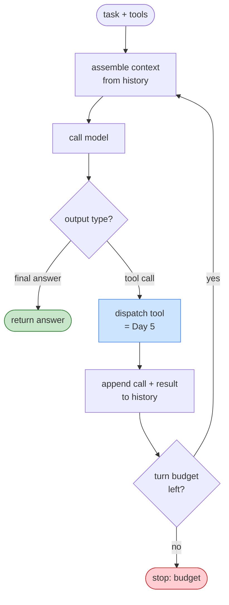

# Day 8 — Your First Agentic Loop

> **Today's one idea:** A working agent is just a loop — call the model, parse its action, run the tool, append the result, repeat — and it fits in ~60 lines you fully understand.
> **Reading time:** ~45 min (code day) · **Prereqs:** Day 5, Day 9
> **Primary source for today:** Dex Horthy, "12-Factor Agents: Patterns of Reliable LLM Applications," AI Engineer 2025.
> **Before you start:** Recall Day 7's load-bearing idea — one sentence, no looking: *where does an agent's capability come from if the model never improves mid-run, and what four-step cycle delivers it?*

## The hook (2–4 min)

You have all four pieces now: an OS-shaped harness (Day 2), a reason to loop (Day 7), tools as requests the harness runs (Day 5), and context as the payload you assemble (Day 9). Today they snap together.

Here's the claim that surprises people: **there is no "agent framework" hiding at the center of an agent.** No secret sauce. When you strip away every abstraction, an agent is a `while` loop wrapped around an API call. That's it. If you can write `dispatch` (you did, Day 5), you can write a full agent this afternoon.

By the end of this page you'll have a real one — it'll read files, run commands, and solve a small multi-step task on its own — and you'll be able to point at every single line and say what it does. That's the whole L2 promise, delivered on Day 8. Everything after this is making *this same loop* robust, cheap, and safe.

## Building the intuition (10–15 min)

Recall Day 7's loop shape. Let's give its one iteration a name we'll use for the rest of the course: a **turn**. One turn = assemble context → call model → handle output (act or finish). The agent's whole life is turns, stacked:



Read that as five responsibilities, each a line or two of code:

1. **Assemble** the context (today: naïvely append everything — Day 10 makes it smart).
2. **Call** the model (Day 2's pure function).
3. **Decide** if the output is a final answer or a tool request (Day 6 makes parsing robust).
4. **Dispatch** the tool if so (Day 5's `dispatch`).
5. **Append** the call and its result to history, and **guard** against looping forever (Day 17).

The single most important design decision is hiding in step 5's arrow back to step 1: **the history *is* the state, and you own it.** This is Dex Horthy's "own your context window" and "agents as stateless reducers": the model is stateless (Day 2), so *your loop's list of messages is the agent's entire memory.* You append to it; you'll later prune it (Day 12). Everything the agent "knows" is in that list, which *you* control. Frameworks hide this list; you're going to hold it in your hand.

Modern APIs give you a gift that makes step 3 easy: **native tool calling.** Instead of the model writing a tool request as freeform text you have to regex out, the API returns it as a *structured* object — a distinct "tool_use" block with a name and parsed arguments — and tells you the reason it stopped ("the model wants to use a tool" vs. "the model is done"). You feed the tool result back as a matching "tool_result" block. This is just Day 5's request/observation cycle, with the parsing done for you. (Day 6 covers what to do when you *don't* have this luxury, and why you still validate even when you do.)

## The formal picture (10–15 min)

Here is a complete, runnable agent. Read it twice: once for shape, once line by line. It reuses Day 5's `dispatch` idea and adds the loop.

```python
import anthropic

client = anthropic.Anthropic()

# --- 1. Tools: schema (for the model) + implementation (for the harness), Day 5 ---
def read_file(path: str) -> str:
    with open(path, encoding="utf-8") as f:
        return f.read()

def list_dir(path: str = ".") -> str:
    import os
    return "\n".join(sorted(os.listdir(path)))

TOOLS = {
    "read_file": {"fn": read_file,
        "schema": {"name": "read_file", "description": "Read a UTF-8 text file.",
                   "input_schema": {"type": "object",
                       "properties": {"path": {"type": "string"}}, "required": ["path"]}}},
    "list_dir": {"fn": list_dir,
        "schema": {"name": "list_dir", "description": "List files in a directory.",
                   "input_schema": {"type": "object",
                       "properties": {"path": {"type": "string"}}, "required": []}}},
}

def dispatch(name: str, args: dict) -> str:            # Day 5, unchanged
    tool = TOOLS.get(name)
    if tool is None:
        return f"Error: no tool named '{name}'."
    try:
        return str(tool["fn"](**args))
    except Exception as e:
        return f"Error running '{name}': {e}"

# --- 2. The agentic loop ---
def run_agent(task: str, max_turns: int = 10) -> str:
    schemas = [t["schema"] for t in TOOLS.values()]
    history = [{"role": "user", "content": task}]     # THE STATE. You own this list.

    for turn in range(max_turns):                     # runaway guard, Day 17
        # (a) assemble context — today: just send the whole history (Day 10 upgrades this)
        response = client.messages.create(            # (b) call the stateless model
            model="claude-sonnet-5",
            max_tokens=1024,
            system="You are a coding assistant. Use tools to inspect files, then answer.",
            tools=schemas,
            messages=history,
        )
        # append the model's own turn to state (its reasoning + any tool requests)
        history.append({"role": "assistant", "content": response.content})

        # (c) decide: is it done, or does it want a tool?
        if response.stop_reason != "tool_use":
            # final answer: pull the text out and return
            return "".join(b.text for b in response.content if b.type == "text")

        # (d) dispatch every tool the model requested this turn
        tool_results = []
        for block in response.content:
            if block.type == "tool_use":
                observation = dispatch(block.name, block.input)   # Day 5
                tool_results.append({
                    "type": "tool_result",
                    "tool_use_id": block.id,
                    "content": observation,
                })
        # (e) append observations to state, loop back
        history.append({"role": "user", "content": tool_results})

    return "Stopped: hit max_turns without finishing."   # budget exhausted, Day 17

if __name__ == "__main__":
    print(run_agent("How many files are in the current directory, and what's in README.md?"))
```

That's the whole thing. Map every part to the days that earned it:

| Line(s) | What it is | Earned on |
|---|---|---|
| `TOOLS`, `dispatch` | tools = schema + fn + binding | Day 5 |
| `history = [...]` | the state you own; the agent's memory | Day 2, Day 9 |
| `for turn in range(max_turns)` | the loop + runaway guard | Day 7, Day 17 |
| `messages=history` | context assembly (naïve today) | Day 9, Day 10 |
| `client.messages.create` | the stateless model call | Day 2 |
| `stop_reason != "tool_use"` | decide: done vs. act | Day 6 |
| the `tool_use` / `tool_result` dance | request → execute → observe | Day 7, Day 5 |

Four things worth saying out loud:

- **`history` is a reducer.** Each turn folds new events (model output, tool results) into one growing list. Horthy's "stateless reducer" framing: `new_state = reduce(old_state, event)`. Your agent is a fold over turns. That's a *pattern*, not a framework — and you can test it, log it, and replay it precisely because you own it.
- **The model can request several tools in one turn.** Note the loop over `response.content`. Real agents batch. You must dispatch all of them and return all results before the next call, or the API rejects the mismatch.
- **Context assembly is one line today, and it's a time bomb.** `messages=history` sends *everything*, forever. By Day 9's logic this overflows and rots around turn 20–30. That single naïve line is why Days 10, 11, 14, 12, 18 exist. We ship it naïve today on purpose — you can't improve what you haven't felt break.
- **Termination is half-built.** We stop on "model says done" or "out of turns." That's the floor. Day 17 adds the rest (detecting stuck loops, budgets in tokens/dollars/time, done-verification).

## Where it breaks / what it is not (3–5 min)

- **This is not production-ready, and that's fine.** No retries (Day 20), no real context management (Days 10–12), no eval (Day 21), no tracing (Day 22), permissive tools (Day 6). It's the *correct skeleton*; the rest of the course is muscle.
- **Native tool calling isn't magic parsing insurance.** The API parses the *shape* for you, but the *values* are still untrusted model output (Day 5). `block.input` can contain a malicious path. Structured ≠ validated. Day 6.
- **"It worked on my task" ≠ "it works."** A loop that solves one task can loop forever or thrash on the next. You have no idea how reliable this is until you *measure* it (Day 21). Resist trusting the demo.
- **Don't reach for a framework yet.** You might be tempted to "just use LangGraph." The entire point of L2 is that you now know what LangGraph *is* — this loop, with more features. Build the primitive first; adopt the framework later with open eyes.

## Try it yourself (5–10 min)

**1. Retrieval first.** Close the page. From memory, write the five steps of one turn of the loop, and name *which variable holds the agent's entire memory* and *who owns it.* Reopen after writing.

<details><summary>Hint</summary>Assemble → call → decide (done vs. tool) → dispatch → append+guard. The `history` list holds all state; the harness (your loop) owns it, because the model is stateless.</details>

<details><summary>Worked answer</summary>One turn: **(1) assemble** context from history, **(2) call** the model, **(3) decide** whether the output is a final answer or a tool request, **(4) dispatch** any requested tools via the harness, **(5) append** the model output and tool results to history and check the turn budget, then loop. The `history` list is the agent's entire memory/state, and the **harness owns it** — because the model is stateless (Day 2), the loop's message list is the only place the agent "remembers" anything.</details>

**2. Direct application — build and break it.** Type the loop above into your course repo (don't copy-paste blindly — typing it is part of the learning). Run it on a real multi-step task in a real directory. Then **make it visible**: add one `print(f"turn {turn}: {response.stop_reason}")` and print each tool call and observation. Watch the turns happen. Then give it a task it can't finish in `max_turns` and confirm it stops cleanly instead of hanging.

<details><summary>Hint</summary>Good breaking tasks: "keep listing every subdirectory recursively forever" (never finishes → hits the guard), or point `read_file` at a missing file and watch the error observation flow back as context and the model recover.</details>

<details><summary>Worked solution (what you should observe + the instrumentation)</summary>

```python
# inside the loop, right after the model call:
print(f"--- turn {turn} | stop_reason={response.stop_reason}")
for b in response.content:
    if b.type == "text":     print("  think:", b.text[:120])
    if b.type == "tool_use": print("  call :", b.name, b.input)
# and after dispatch:
for tr in tool_results:      print("  obs  :", tr['content'][:120])
```

Expected trace on the README task:
```
--- turn 0 | stop_reason=tool_use
  call : list_dir {}
  obs  : README.md\nharness.py\n...
--- turn 1 | stop_reason=tool_use
  call : read_file {'path': 'README.md'}
  obs  : # My Project ...
--- turn 2 | stop_reason=end_turn
  think: There are 7 files. README.md contains ...
```
Three turns, then it's done — you can *see* the observe→decide→act rhythm from Day 7, now automated. On the unfinishable task you'll see `turn 0..9` all `tool_use`, then `"Stopped: hit max_turns"`. That clean stop is your Day 17 floor working.</details>

**3. Stretch.** Your loop sends `messages=history` every turn. Instrument it to print `len(str(history))` (a rough token proxy) at the top of each turn on a 15-turn task. Watch the number climb. Now answer: at what point does this become a problem, and what's the *first* thing you'd drop from `history` to fix it — and why *not* the system prompt or the latest observation? (Previewing Days 10 and 12.)

<details><summary>Worked answer</summary>`len(str(history))` grows monotonically because you append every model output and every tool result forever — classic Day 7 accumulator behavior. It becomes a problem as it approaches the model's context limit `L` (hard failure/truncation) and, well before that, when old content shoves the current goal into the low-attention **middle** (Day 9's Lost-in-the-Middle → drift/rot). The *first* thing to drop is **old, superseded tool observations** — e.g. the full text of a file you read 10 turns ago and already extracted what you needed from — because they're bulky, stale, and reproducible on demand. You do **not** drop the **system prompt** (it holds the standing instructions + tool menu, and sits in the strong start position) or the **latest observation** (it's the freshest evidence, in the strong end position, and the whole reason the last action happened). This selective, placement-aware pruning is exactly **context assembly (Day 10)** and **compaction (Day 12)**.</details>

> **Transfer — apply it:** Take the loop and swap in one tool from *your* domain (a DB query, an internal API call, a `git` command). Write the one schema entry and one Python function. Run the agent on a real task in that domain. One sentence: what did it get right, and where did the naïve `messages=history` or a loose tool schema start to hurt?

## Connect it back

Yesterday you learned *why* to loop; today you built one — a complete agent that loops, reasons, uses the tools from Days 5–6, and stops, and you own every line, especially the `history` list that *is* its mind. But you also planted the course's central problem in one innocent line: `messages=history` sends everything forever. Tomorrow the third discipline — **context engineering** — begins by naming exactly why that line is a time bomb. The question you can now answer: *what is the smallest complete agent, and which single line in it guarantees you'll need the rest of this course?*

## Suggested readings for today

**Required if you have 15 extra minutes:** Dex Horthy, "12-Factor Agents" — [talk](https://www.youtube.com/watch?v=8kMaTybvDUw) and the [repo's factor list](https://github.com/humanlayer/12-factor-agents). Read factors *"Own your context window"* and *"Own your control flow."* You just implemented both by hand; his talk is the production-scale argument for why you should never give them away to a framework.

**If you want the deep version:**
- ReAct (arXiv:2210.03629), §2 — compare the paper's Thought/Action/Observation loop to the code you just wrote; they're the same object.
- Wang et al., "A Survey on LLM-based Autonomous Agents," arXiv:2308.11432, §2 — a map of the whole design space you just entered (profile/memory/planning/action). Skim to see where today's loop sits.

---

## Navigation

← **Previous:** [Day 7 — Why You Need a Loop](day-07-why-you-need-a-loop.md)  
→ **Next:** [Day 9 — Context Is Everything It Sees](../../03-context-engineering/days/day-09-context-is-everything.md)
