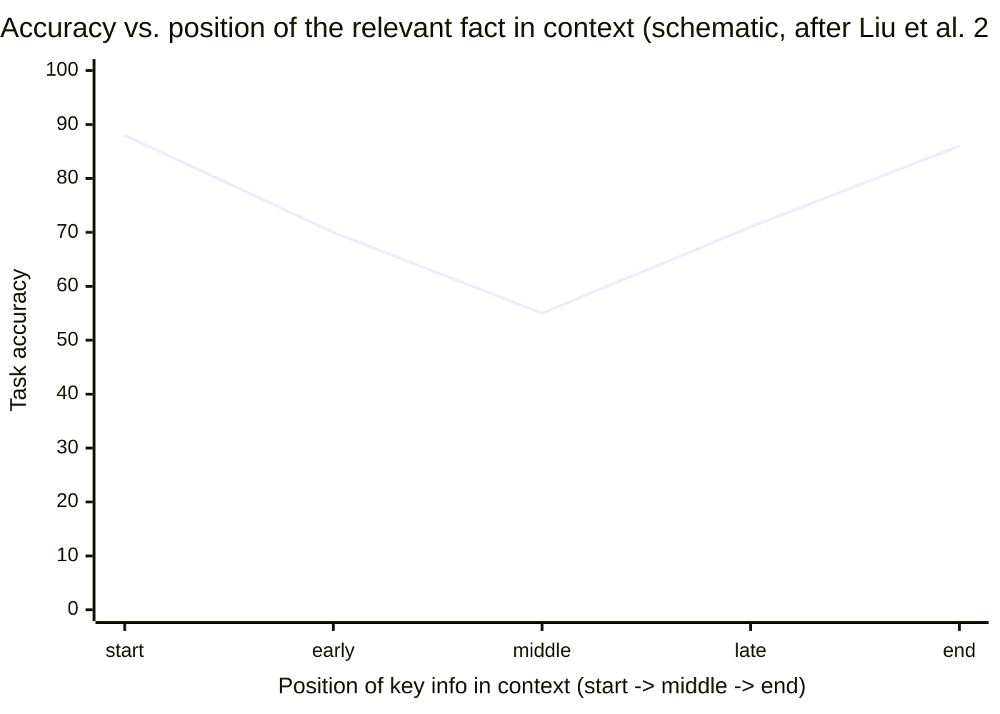

# Day 9 — Context Is Everything It Sees

> **Today's one idea:** The model has no memory and no senses — its entire mind on any turn is the token payload you assemble, so *engineering that payload is engineering the agent.*
> **Reading time:** ~40 min · **Prereqs:** Day 7 · builds toward Days 10, 12
> **Primary source for today:** Liu et al., "Lost in the Middle: How Language Models Use Long Contexts," TACL 2024, arXiv:2307.03172.
> **Before you start:** Recall Day 8's load-bearing idea — one sentence, no looking: *what are the five steps of one turn of the loop, and which variable holds the agent's entire memory?*

## The hook (2–4 min)

Two agents. Same model. Same task: "Fix the failing test."

**Agent A** gets a payload containing: the task, the full 4,000-line source file, the entire test suite, twelve previous tool results, and a stack trace — with the actual failing assertion buried on line 2,300 of the payload.

**Agent B** gets: the task, the one failing test, the relevant 40-line function, and the stack trace — 300 tokens total, the failing assertion right at the end.

Agent B fixes it. Agent A flails, edits the wrong function, and burns your budget.

The model didn't change. The *only* thing that differed was what each agent could see. And here's the part that should unsettle you: Agent A had *strictly more information* than Agent B — it had everything B had, plus more — and did *worse.* More context made it dumber.

That is today's whole lesson. What the model sees is not a nice-to-have. It *is* the agent's intelligence, and more is often less.

## Building the intuition (10–15 min)

Recall Day 2: the model is a stateless function `tokens_in → tokens_out`. Sit with the first half. **`tokens_in` is the model's entire universe for that call.** Not "the main input" — the *whole* input. The model has:

- no memory of previous turns (Day 2),
- no ability to look anything up (it can only *ask* via tools, Day 5),
- no senses beyond the tokens in front of it.

So whatever you put in `tokens_in` is, quite literally, everything the model knows and perceives at that moment. If it's in the payload, the model can use it. If it's not, the model is blind to it — no matter how true or available it is elsewhere. **You are not prompting the model. You are constructing its reality, one turn at a time.**

Now the twist that makes this an *engineering* problem rather than a "stuff everything in" problem. You might think: fine, context windows are huge now (200K, 1M tokens) — just include everything and let the model sort it out. The "Lost in the Middle" paper killed that idea with data.

The finding: models do **not** use all positions in their context equally. Give a model a long context and ask it to find a fact, and performance depends sharply on *where in the context the fact sits*. Performance is high when the relevant information is at the **beginning** or the **end** of the context, and drops — sometimes dramatically — when it's in the **middle**. Plot accuracy against position and you get a **U-shape**:



Think of it like a person skimming a long document under time pressure: they read the top carefully, glance at the bottom, and their eyes glaze over the middle. The model has an analogous bias. So a fact you *did* include can still be functionally invisible if you bury it in the middle of a huge payload.

Two consequences fuse into today's idea:

1. **Inclusion is necessary but not sufficient.** Putting information in context doesn't guarantee the model uses it. *Placement* matters (start/end strong, middle weak).
2. **Every token you add has a cost beyond money.** It dilutes attention, pushes other things toward the weak middle, and can actively degrade performance. Adding context is not free even when it fits.

This is why Agent A lost. Its important 40 lines were drowned in the middle of 4,000, and the sheer volume diluted everything. Agent B put the *right* things in the *right* places and nothing else. The skill you're building — the one you named as your bottleneck — is deciding, each turn, *what goes in, what stays out, and where it sits.*

## The formal picture (10–15 min)

Let's define the object precisely.

**Context** (or the **context window**) is the ordered token sequence supplied to the model at inference, bounded by a fixed maximum length `L` (the model's context limit). For a chat model it's usually structured as an ordered list of messages:

```math
\text{context} = [\, m_{\text{system}},\ m_1,\ m_2,\ \ldots,\ m_k \,], \qquad \sum_i \text{tokens}(m_i) \le L
```

- **`m_system`** — the **system prompt**: standing instructions, role, and the tool menu (Day 5's schemas live here). Conventionally first, and by the U-shape, a *strong* position — use it.
- **`m_1..m_k`** — the running exchange: user messages, the model's own prior outputs, and tool observations, in order.

Three properties define context as an engineering surface:

1. **It is finite.** `L` is fixed. As the loop runs, `state` grows every turn (Day 7's accumulator line), so context tends toward `L` and then you *must* drop something. This inevitability is Day 12 (compaction). The finiteness is not an edge case; it's the default fate of any non-trivial loop.

2. **It is positional.** By Lost-in-the-Middle, `utility(token)` depends on *where* it sits, not just whether it's present. Roughly: start and end are high-attention; the middle is a graveyard. So context assembly is not "which tokens" alone — it's "which tokens, in what order."

3. **It is reconstructed every turn.** The model is stateless (Day 2), so the harness rebuilds `context` from scratch on every single call. This is not overhead to lament — it's *control*. Because you rebuild each turn, you can choose each turn: reorder, drop, summarize, inject fresh retrieval. Statelessness is what makes context *engineerable.* (This is Day 10.)

The umbrella term for doing this well is **context engineering** — Anthropic's framing: *"what configuration of context is most likely to generate the model's desired behavior?"* It's the successor to prompt engineering. Prompt engineering asked "what words do I write?"; context engineering asks "what set of tokens — instructions, history, memory, tool results, retrieved facts — do I assemble, in what order, within budget `L`, to get the behavior I want?" For an agent that runs many turns, this is *the* discipline. It is why Days 10, 11, 14, 12, and 13 all orbit this single object.

A useful frame from the CoALA paper (Day 14): the context is the model's **working memory** — the small, fast, in-view scratchpad — while everything you *can't* fit lives in **long-term memory** outside the window, to be paged in when relevant (MemGPT's idea, Day 14). Today just plant it: *context = working memory, finite and positional, rebuilt every turn.*

## Where it breaks / what it is not (3–5 min)

- **"Bigger context windows solve this."** They raise `L`, which helps — but Lost-in-the-Middle was measured *on long-context models* and the U-shape persisted. A bigger window means you *can* include more; it doesn't mean you *should*, and the middle stays weak. Bigger `L` moves the cliff, it doesn't remove it.
- **Context is not the prompt.** The prompt (system + user instruction) is *part* of context, but context also includes all history, tool observations, and retrieved data — the parts that grow and rot. Treating context as "the prompt I wrote once" is how agents degrade over long runs.
- **Relevance ≠ inclusion ≠ utility.** Three different things. A fact can be relevant (you should include it), included (it's in the payload), and still low-utility (buried in the middle, ignored). Your job spans all three: select the relevant, include it, and *place* it for utility.
- **More isn't safer.** The instinct "when unsure, include it" is wrong here. Every extra token dilutes attention and risks pushing the crucial thing into the middle. Precision beats recall in context assembly. (You'll feel this as physical discomfort on Day 11 — good.)

## Try it yourself (5–10 min)

**1. Retrieval first.** Close the page. Write: *Why is "just include everything in the big context window" a bad strategy?* Name the two reasons (finiteness and the positional / lost-in-the-middle effect) and state what the model's "entire mind on a turn" consists of. Reopen after writing.

<details><summary>Hint</summary>Entire mind = the token payload (`tokens_in`). Two reasons: context is finite (`L`), and it's positional — the middle is under-attended, so burying key info there makes it invisible even though it's "included."</details>

<details><summary>Worked answer</summary>The model's entire mind on a turn is `tokens_in` — the assembled payload; it has no memory or senses beyond it. "Include everything" fails for two reasons. **Finiteness:** the window has a fixed limit `L`, and a running loop's state grows every turn, so you inevitably overflow and must drop things anyway. **Positionality (Lost-in-the-Middle):** models attend strongly to the start and end of context and weakly to the middle, so a fact buried mid-payload is functionally invisible even though it's technically present. Adding tokens also dilutes attention and pushes important content toward the weak middle — so more context can *lower* performance. Inclusion is necessary but not sufficient; selection *and placement* are the job.</details>

**2. Direct application — reproduce Lost-in-the-Middle yourself.** Build a "needle in a haystack" test. Create ~30 short distractor facts plus one "needle" fact (e.g., "The launch code is 4471."). Assemble three contexts that place the needle at position 1, the middle, and last. Ask the model the needle question in each. Measure whether placement changes correctness or confidence. Even on a strong model you'll often see the middle is shakiest — and you'll *feel* that placement is a lever, not a detail.

<details><summary>Hint</summary>Keep everything identical except the needle's index in the list. Loop over positions `[0, len//2, len-1]`, rebuild the context, ask the same question, record the answer. Repeat a few times (it's probabilistic).</details>

<details><summary>Worked solution (Python sketch)</summary>

```python
import anthropic
client = anthropic.Anthropic()

distractors = [f"Fact {i}: item {i} is stored in bin {i*3}." for i in range(30)]
needle = "IMPORTANT: The launch code is 4471."
question = "What is the launch code?"

def ask_with_needle_at(pos: int) -> str:
    facts = distractors[:]
    facts.insert(pos, needle)                 # only thing that changes
    context = "Here are some facts:\n" + "\n".join(facts) + f"\n\nQuestion: {question}"
    r = client.messages.create(
        model="claude-sonnet-5", max_tokens=50,
        messages=[{"role": "user", "content": context}])
    return r.content[0].text.strip()

for label, pos in [("start", 0), ("middle", 15), ("end", 30)]:
    # run a few times; it's stochastic
    answers = [ask_with_needle_at(pos) for _ in range(3)]
    print(label, "->", answers)
```

Interpretation: on a small haystack a strong model may nail all three — scale the distractor count up (300, 3000) and the middle position degrades first and worst. The lesson isn't "the model is broken"; it's that **you control which positions your critical tokens land in**, and that control is free. Put the task and the key fact at the *end* of context (or pin them in the system prompt at the *start*), never buried mid-history.</details>

**3. Stretch.** Your loop from Day 7 appends every action and observation to `state`, forever. Using today's idea, predict the *specific* failure mode this causes around turn 30 of a long task — and name the two levers you'd reach for (one about *amount*, one about *placement*). You're previewing Days 10 and 12.

<details><summary>Worked answer</summary>By ~turn 30, `state` has accumulated dozens of tool observations and model outputs, likely approaching or exceeding `L`. Two things happen: (a) you overflow the window and the call fails or silently truncates, and (b) even before that, the **task and the currently-relevant facts get pushed into the low-attention middle** by all the stale history piled on top, so the agent starts ignoring its own goal and repeating or drifting — "context rot." The two levers: **amount** — reduce tokens via *compaction* (summarize or drop old observations; Day 12), and **placement** — *re-order* so the task/goal and freshest relevant results sit at the start (system) and end of context, not the middle (Days 10, 12). Together they're the bottleneck skill you named on Day 2.</details>

> **Transfer — apply it:** Take any LLM feature you've built or used that "sometimes ignores the instructions." Write one sentence hypothesizing *where in its context* the ignored instruction sits. If it's buried after a big blob of retrieved text or history, you've just diagnosed a Lost-in-the-Middle failure — and the fix is placement, not a sterner prompt.

## Connect it back

The harness scaffold and the loop (Days 2–8) built the model's world and set it in motion; today opened the third discipline — **context engineering** — by naming the model's *eyes and mind*: context. It delivered the course's central tension: that mind is finite, positional, and rebuilt every turn, so **what the agent sees is something you engineer, and the naïve "include everything" is actively harmful** ([the flip side of Day 8's `messages=history` line](../../02-loop-engineering-building-the-loop/days/day-08-your-first-agentic-loop.md)). Tomorrow you build the fix: `assemble_context`, the function that decides what the model sees each turn. The question you can now answer that you couldn't yesterday: *if a fact is present in the context window, why might the model still act as if it never saw it?*

## Suggested readings for today

**Required if you have 15 extra minutes:** Lost in the Middle (arXiv:2307.03172), §1 and Figure 1 (the U-shaped curve). See the effect with your own eyes; it justifies half of what you'll do on Days 10–12.

**If you want the deep version:**
- Anthropic, "Effective Context Engineering for AI Agents," 2025 — [link](https://www.anthropic.com/engineering/effective-context-engineering-for-ai-agents). The current best-practice framing of exactly today's idea; read the intro and "why context is finite." This is the spine of the bottleneck arc.
- Packer et al., "MemGPT," arXiv:2310.08560, §2–3 — working memory vs. external memory, made literal. Sets up Day 14.

---

## Navigation

← **Previous:** [Day 8 — Your First Agentic Loop](../../02-loop-engineering-building-the-loop/days/day-08-your-first-agentic-loop.md)  
→ **Next:** [Day 10 — Context Assembly](day-10-context-assembly.md)
