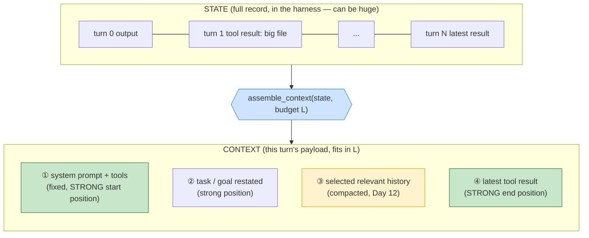

# Day 10 — Context Assembly

> **Today's one idea:** Every turn, the harness *rebuilds* the model's payload from scratch — and deciding what to include, in what order, within a token budget, is the single most consequential thing your harness does.
> **Reading time:** ~45 min (code day) · **Prereqs:** Day 8, Day 9
> **Primary source for today:** Anthropic, "Effective Context Engineering for AI Agents," 2025.
> **Before you start:** Recall Day 9's load-bearing idea — one sentence, no looking: *why does "just include everything in the big window" fail, and what two properties of context make placement matter?*

## The hook (2–4 min)

On Day 8 you wrote the most important line in your agent, and it was a lie:

```python
messages=history   # "send everything, forever"
```

It's a lie because it pretends context assembly is trivial — just hand over the whole list. But you already know (Day 9) that this both *overflows* the finite window and *rots* performance by burying the goal in the low-attention middle. That one line is where every long-running agent goes to die around turn 30.

Today we replace it with a real function — call it `assemble_context(state) → messages` — and that function is where you'll spend the rest of your career as a harness engineer. It's the bottleneck you named on Day 2. Everything from here (compaction, memory, drills) is a technique that lives *inside* this function.

## Building the intuition (10–15 min)

Here's the reframe that changes how you see the loop. You've been thinking of `history` as *the* state — one list you append to and send. Separate two things that Day 8 conflated:

- **State** — the full, growing record of everything that happened (all turns, all tool results). This can be huge. It's your source of truth. It lives in the harness.
- **Context** — the *specific, budgeted view* of state you construct for *this one* model call. This must fit in `L` and should be tuned for the current step.

**State is the database; context is the query result.** You don't send your whole database to answer one question — you run a query that selects, filters, orders, and limits. `assemble_context` is that query, run fresh every turn.

Why fresh every turn? Because what the model *needs to see* changes as the task progresses. Turn 2 needs the file it just listed; turn 20 needs the failing test and the function under repair, not the directory listing from turn 2. A static "send everything" can't adapt. A per-turn assembly can put the *right* things in the *strong* positions (Day 9: start and end) and leave the rest out.

Anthropic's framing names the goal precisely: find *"the smallest possible set of high-signal tokens that maximize the likelihood of the desired outcome."* Not the most tokens. The **smallest high-signal set.** Every token competes for the model's limited attention; your job is curation, not accumulation.

Think of assembling context like packing for a trip with a strict carry-on limit. You don't dump your whole closet in (won't fit, and you'd never find your toothbrush). You pack: the essentials that go every time (system prompt = your passport), the things this specific trip needs (task-relevant history and tool results), and you leave the rest at home (in long-term memory, Day 14, retrievable if needed). And you put the things you'll grab first — the current goal, the latest result — where they're easy to reach (the start and end).



The green blocks are the strong positions you learned to respect on Day 9. The yellow block — selected, compacted middle — is where the hard decisions live. Notice the goal is *restated* near the top even though it's "already in history": because in a long run, the original task drifts into the dead middle, and re-pinning it in a strong position keeps the agent on task. That's a context-assembly move you'd never think of if you only had `messages=history`.

## The formal picture (10–15 min)

`assemble_context` is a function from state and a budget to an ordered, bounded message list:

```math
\text{assemble}: (\text{state},\ L) \rightarrow [\,m_1, \ldots, m_k\,], \qquad \sum_i \text{tokens}(m_i) \le L_{\text{budget}}
```

It does three jobs, in this order of importance:

1. **Select** — which pieces of state go in. (Relevance + recency.)
2. **Order** — where each piece sits. (Day 9's positional utility: goal and freshest results in strong positions.)
3. **Fit** — guarantee the total is under budget. (When it isn't, compact — Day 12.)

A first real implementation — still simple, but no longer a lie. It keeps the system prompt, the original task, a recency window of recent turns, and always the latest observation, under a token budget:

```python
def count_tokens(messages, system, tools) -> int:
    # use the provider's real counter in production; approximate here
    return client.messages.count_tokens(
        model="claude-sonnet-5", system=system, tools=tools, messages=messages).input_tokens

def assemble_context(state: dict, budget: int = 100_000):
    """Build THIS turn's payload from full state. state has: task, turns (list)."""
    system = state["system"]
    tools = state["tools"]
    task_msg = {"role": "user", "content": f"Your task: {state['task']}"}   # re-pin goal

    turns = state["turns"]                      # full record, may be huge
    # always keep the most recent turns (freshest evidence, strong end position)
    kept, running = [], []
    for msg in reversed(turns):                 # newest first
        trial = [task_msg] + list(reversed(running + [msg]))
        if count_tokens(trial, system, tools) > budget:
            break                               # would overflow -> stop keeping older turns
        running.append(msg)
    kept = list(reversed(running))
    dropped = len(turns) - len(kept)
    messages = [task_msg]
    if dropped > 0:                             # tell the model what it can't see (Day 12 will summarize)
        messages.append({"role": "user",
            "content": f"[{dropped} earlier turns omitted to fit context. Ask to re-read if needed.]"})
    messages += kept
    return system, tools, messages
```

Then the Day 8 loop changes in exactly one place:

```python
# BEFORE (Day 8): messages=history
# AFTER (Day 10):
system, tools, messages = assemble_context(state)
response = client.messages.create(model="claude-sonnet-5", max_tokens=1024,
                                  system=system, tools=tools, messages=messages)
```

Formal points worth internalizing:

- **Assembly runs every turn and is cheap to change.** Because the model is stateless (Day 2) and you rebuild anyway, swapping strategies is a local edit — no migration, no retraining. This is the leverage statelessness buys you: your entire agent's behavior is tunable through this one function.
- **A budget is not the model's context limit.** Set `L_budget` *below* the hard limit `L`. You want headroom for the model's *output*, for tool results you can't predict the size of, and to stay out of the degraded high-fill regime. Running at 95% of `L` is asking for truncation and rot.
- **Selection beats ordering beats fitting — but you need all three.** Getting the right pieces in matters most; placing them well is next (Day 9); guaranteeing fit is the safety net (Day 12). A context that's perfectly ordered but missing the key file is useless; one that fits but buries the goal underperforms.
- **The "omitted turns" note is itself context engineering.** Telling the model *that* it can't see something (and how to get it back) prevents it from confidently reasoning over a hole. Silence about the gap is worse than a one-line marker.

This function is deliberately incomplete: it drops old turns wholesale rather than summarizing them (Day 12), and it selects by recency only, not relevance (Day 14's retrieval). That's the plan — today is the *skeleton and the mindset*; the next four days are techniques that slot into `assemble_context`.

## Where it breaks / what it is not (3–5 min)

- **Recency is a weak proxy for relevance.** Keeping "the last N turns" is easy and often wrong: the crucial fact might be turn 3, dropped as old. Real assembly mixes recency with *relevance* (retrieval, Day 14) and *importance* (pin the goal, the plan, key decisions). Don't ship recency-only for hard tasks.
- **Assembly is not compaction.** Assembly *selects and orders*; compaction *shrinks* what's selected when it still won't fit (summarize a kept-but-huge file). Today's function drops whole turns; Day 12 compresses them. Different operations, same function.
- **Token counting is not free.** Calling a token counter every turn (or worse, in a loop) has cost. Cache counts per message; approximate when you can. But *never* guess blindly — an unbudgeted assembler is a truncation bug waiting for turn 30.
- **This is where agents silently degrade, not crash.** A bad assembler rarely errors; it just makes the agent slowly dumber as the run grows. That's why you can't feel it in a demo and must *measure* it (Day 21). The failure is quiet.

## Try it yourself (5–10 min)

**1. Retrieval first.** Close the page. Write the distinction between **state** and **context**, and the three jobs `assemble_context` does in priority order. Add one sentence on why you rebuild it every turn instead of once. Reopen after writing.

<details><summary>Hint</summary>State = full record (the database); context = this turn's budgeted view (the query result). Jobs: select → order → fit. Rebuild every turn because needs change and the model is stateless, so it's cheap and adaptive.</details>

<details><summary>Worked answer</summary>**State** is the full growing record of everything that happened, held in the harness (the database / source of truth). **Context** is the specific, budgeted, ordered *view* of state assembled for one model call (the query result), which must fit in the budget. `assemble_context` does three jobs in priority order: **select** (which pieces of state to include — relevance and recency), **order** (place them by positional utility — goal and latest result in the strong start/end positions), and **fit** (guarantee the total is under budget, compacting if not). You rebuild it every turn because the model is stateless (so you're rebuilding anyway) and because *what the model needs to see changes as the task progresses* — per-turn assembly adapts where a static "send everything" cannot.</details>

**2. Direct application — replace the lie.** Take your Day 8/6 agent and swap `messages=history` for a real `assemble_context` with a *small* budget (say 2,000 tokens, to force the interesting behavior early). Run a task that takes 10+ turns and reads a big file. Instrument: print, each turn, the token count sent and how many turns were dropped. Confirm the agent still finishes and that the token count *plateaus* instead of climbing forever.

<details><summary>Hint</summary>Set the budget deliberately low so dropping kicks in by turn 5, not turn 50 — you want to *see* the mechanism work. Verify the "[N earlier turns omitted]" note appears and the agent still completes (or asks to re-read something it dropped).</details>

<details><summary>Worked solution (what to observe)</summary>

```
turn 0 | tokens=310  dropped=0
turn 3 | tokens=1180 dropped=0
turn 6 | tokens=1920 dropped=2   [2 earlier turns omitted...]
turn 9 | tokens=1950 dropped=5   [5 earlier turns omitted...]  -> still finishing
```

The win: tokens **plateau** near the budget instead of growing unbounded like Day 8's `len(str(history))`. Compare directly against the Day 8 stretch exercise where the number climbed forever — same task, bounded now. The cost you'll notice: with recency-only selection, if the agent dropped a fact it later needs, it either re-reads (a wasted turn) or drifts. That pain is exactly what motivates Day 14 (keep important things in *memory*, not just recent history) and Day 12 (summarize instead of drop). Feel the pain now; it makes tomorrow's fixes obvious.</details>

**3. Stretch (callback to Day 7 + Day 9).** Your assembler keeps "recent turns." Construct a concrete 12-turn scenario where recency-only assembly makes the agent *fail* — where the load-bearing fact is old and gets dropped. Then propose the minimal change to `assemble_context` that fixes it *without* just raising the budget. (You're deriving the need for Day 14.)

<details><summary>Worked answer</summary>Scenario: turn 1 the user says "the API key is in `config/secrets.yaml`, never print it." Turns 2–11 the agent does unrelated file exploration, pushing turn 1 out of the recency window. Turn 12 the agent, no longer "seeing" the instruction, reads and prints the secret — a failure caused purely by *dropping an old but load-bearing message.* Raising the budget only delays this to a longer run. The minimal fix: **selection by importance, not just recency** — mark certain messages as *pinned/important* (the goal, standing constraints, key decisions) and always include them in `assemble_context` regardless of age, in a strong position. Generalizing "keep important things available regardless of recency" leads directly to **long-term memory (Day 14)**: pinned constraints and durable facts live outside the recency window and are injected every turn (or retrieved when relevant), while the ephemeral middle scrolls past. Recency handles *what just happened*; memory handles *what must never be forgotten*.</details>

> **Transfer — apply it:** For an agent in your domain, name one piece of information that must be in context *every* turn regardless of age (a policy, a schema, a user constraint) and one that's only relevant *right now* (a just-fetched record). One sentence each: where in the payload does each belong, and what happens if the always-on one drifts into the middle?

## Connect it back

Yesterday context was named the model's whole mind ([Day 9](day-09-context-is-everything.md)); today you made it *deliberate* — you replaced the "send everything" lie with a function that selects, orders, and fits the model's payload every turn, turning unbounded growth into a bounded, tuned view (the fix for [Day 8's runaway `messages=history`](../../02-loop-engineering-building-the-loop/days/day-08-your-first-agentic-loop.md)). Tomorrow is a **drill** — no new concepts, just reps on this exact skill under pressure, because context assembly is the bottleneck you named and reps are how bottlenecks break. The question you can now answer: *what's the difference between your agent's state and its context, and why does conflating them kill long-running agents?*

## Suggested readings for today

**Required if you have 15 extra minutes:** Anthropic, "Effective Context Engineering for AI Agents," 2025 — [link](https://www.anthropic.com/engineering/effective-context-engineering-for-ai-agents). Read "the smallest set of high-signal tokens" and the context-editing/compaction sections. It's the manifesto for the function you just wrote.

**If you want the deep version:**
- Dex Horthy, "12-Factor Agents," factor *"Own your context window"* — [talk](https://www.youtube.com/watch?v=8kMaTybvDUw). The production argument for hand-controlling assembly.
- Packer et al., "MemGPT," arXiv:2310.08560, §3 — how an agent can manage its *own* context by paging; a preview of Day 14's memory tiers.

---

## Navigation

← **Previous:** [Day 9 — Context Is Everything It Sees](day-09-context-is-everything.md)  
→ **Next:** [Day 11 — Drill I: Context Assembly](day-11-drill-context-assembly.md)
