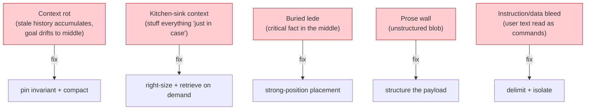
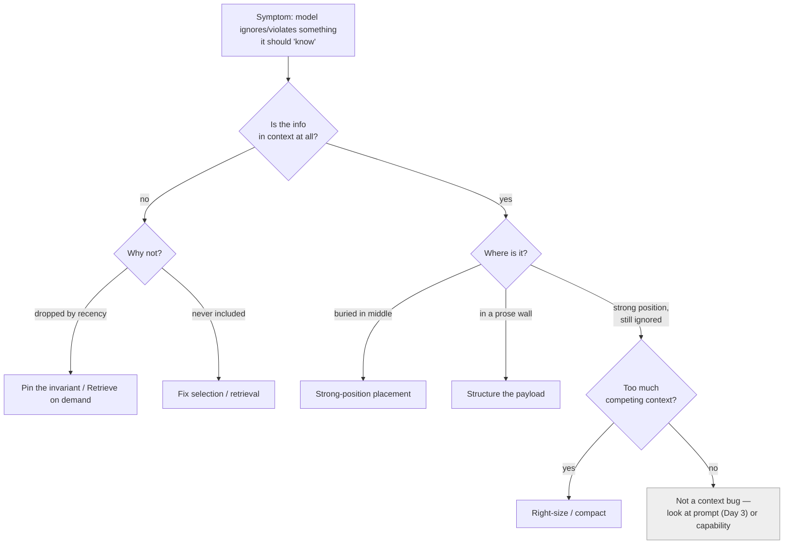

# Day 13 — Context Engineering Patterns

> **Today's one idea:** The context moves you've learned — select, order, pin, compact, retrieve — crystallize into a small catalog of reusable *patterns* (and anti-patterns) that apply beyond agents, to RAG and chat systems too.
> **Reading time:** ~40 min · **Prereqs:** Days 9–12
> **Primary source for today:** Anthropic, "Effective Context Engineering for AI Agents," 2025; Anthropic, "Building Effective Agents," 2024.
> **Before you start:** Recall Day 12's load-bearing idea — one sentence, no looking: *the four compaction operations cheapest-first, and the two-part rule (what survives, where it goes) that makes compaction work?*

## The hook (2–4 min)

You've spent four days on context for *agents*: it's everything the model sees (Day 9), you assemble it each turn (Day 10), you drill eviction (Day 11), you compact and place it (Day 12). Now step back.

A RAG pipeline that stuffs 20 retrieved chunks into a prompt and gets worse answers than with 5 — that's a *context* problem, not a retrieval problem. A customer-support chatbot that "forgets" the user's earlier constraint after a long conversation — *context*. A coding assistant that ignores the file it just read — *context*. These look like three different bugs in three different systems. They're the same handful of failures, with the same handful of fixes.

Today we name those fixes. The value of a *pattern* is that once you can say "this is a lost-in-the-middle failure, apply re-pinning," you stop re-solving it from scratch every time. This is the day the context arc becomes a *vocabulary* you carry into every LLM system you ever build — not just agents.

## Building the intuition (10–15 min)

Everything in Module 3 reduces to managing a scarce, positional resource — the context window — against an ever-growing pile of candidate tokens. The recurring *moves* against that problem form a catalog. Here are the load-bearing patterns, each one a named answer to a specific failure:

| Pattern | The move | Fixes the failure… | First seen |
|---|---|---|---|
| **Right-size the window** | include the *smallest high-signal set*, not everything | dilution / lost-in-the-middle from over-stuffing | Day 9 |
| **Strong-position placement** | put goal + freshest/critical info at start & end | key info ignored in the dead middle | Day 9 |
| **Pin the invariant** | always include standing constraints/goal, regardless of recency | old-but-critical facts scrolled out of window | Day 10 |
| **Compact, don't delete** | summarize/extract signal; write bulk to memory | overflow; losing hard-won detail | Day 12 |
| **Retrieve on demand** | pull only *relevant-now* items into context | can't fit everything; irrelevant noise | Day 14 (next) |
| **Structure the payload** | sections/labels/delimiters over a prose wall | model can't navigate; instructions blur into data | Day 3 |
| **Isolate sub-work** | give a subtask its own clean, small context | one loop's context polluting another's | Day 19 |

And the **anti-patterns** — the failures with names, so you can diagnose fast:

The key realization: **these patterns are system-agnostic.** They came out of agent-building, but the underlying constraint — finite, positional context vs. too many candidate tokens — exists in *every* LLM system:

- **RAG** is context engineering where the candidate pool is a document corpus. "Retrieve top-20 chunks" is kitchen-sink; "retrieve top-4 by relevance, place the best at the end, structure with source labels" is right-size + strong-position + structure. (Tomorrow's RAG day is this applied.)
- **Chat** is context engineering where the pool is conversation history. "Send the whole transcript" is context rot waiting to happen; "pin the user's stated goal/constraints, compact old turns, keep recent verbatim" is pin + compact.
- **Agents** you already know — it's all of the above, per turn.

So Module 3 isn't "how to build agent context" — it's "how to engineer context," and agents were just the hardest case that forced you to learn every pattern.

## The formal picture (10–15 min)

A pattern catalog is only useful if you can *select* the right one from a symptom. Here's the diagnostic procedure — the thing you actually run when an LLM system underperforms:

Formal points:

- **Diagnose before prescribing.** The single most common mistake is applying a fix without locating the failure: adding a sterner instruction (a prompt fix) when the real problem is the fact sits in the dead middle (a placement fix). Ask *first*: is it in context? where? is it drowned? The answer names the pattern.
- **Patterns compose and sometimes conflict.** Pin-the-invariant adds tokens; right-size removes them — you balance. Retrieve-on-demand and compact both fight overflow but at different granularities (per-query vs. per-history). Real systems layer several, which is why Day 18's drill made you reason about their *interactions*.
- **The measure is behavior, not aesthetics.** A "clean-looking" context isn't the goal; a context that produces the desired output is. Which means patterns are hypotheses you *evaluate* (Day 21), not rules you apply blindly. "Retrieve top-4 not top-20" is a claim to test on your data, not a law.
- **Context quality is now a first-class metric.** Because these patterns are tunable knobs (how many chunks? how much history verbatim? what's pinned?), they define a design space you optimize by measurement (Day 22) — not by vibes. The catalog tells you *which knobs exist*; evaluation tells you where to set them.

This day is deliberately a *consolidation-through-reframing*: no new mechanism, but the mechanisms you learned get names and a selection procedure, and their scope expands from agents to all LLM systems. That reframing is what turns four days of technique into transferable expertise.

## Where it breaks / what it is not (3–5 min)

- **Patterns are not laws.** "Top-4 chunks" or "keep 6 recent turns" are starting points, not universals — the right numbers depend on your model, task, and data, and you find them by measuring. Applying a pattern's *parameters* without tuning is cargo-culting.
- **Not every failure is a context failure.** The diagnostic's grey box matters: if the info is present, well-placed, and uncrowded and the model still fails, it's a prompt problem (Day 3), a capability gap, or a tool/retrieval-quality problem — not context. Don't force a context fix on a non-context bug.
- **A pattern catalog is not a framework.** Naming "retrieve on demand" doesn't hand you a vector DB; it tells you what job to do. The patterns are language for reasoning, not code you install.
- **Over-engineering context is real.** A three-line Q&A tool does not need pinning, compaction, and a retrieval tier. Match the machinery to the problem — most of these patterns earn their keep only in long or high-stakes contexts.

## Try it yourself (5–10 min)

**1. Retrieval first.** Close the page. From memory, list five context patterns and, for three of them, the specific failure each fixes. Then state the first question of the diagnostic procedure. Reopen after writing.

Hint
Patterns: right-size, strong-position placement, pin-the-invariant, compact-don't-delete, retrieve-on-demand, structure-the-payload, isolate-sub-work. First diagnostic question: *is the information in context at all?* (then: where? is it drowned?)

Worked answer
Five patterns: **right-size the window** (fixes dilution/lost-in-the-middle from over-stuffing), **strong-position placement** (fixes critical info ignored in the dead middle), **pin the invariant** (fixes old-but-critical facts scrolling out of the window), **compact don't delete** (fixes overflow while preserving hard-won detail), **retrieve on demand** (fixes can't-fit-everything and irrelevant noise). Also structure-the-payload and isolate-sub-work. The diagnostic starts by asking **"is the information in context at all?"** — if no, why (dropped by recency → pin/retrieve; never included → fix selection); if yes, "where is it?" (buried middle → placement; prose wall → structure; strong position but ignored → too much competing context → right-size/compact; else it's not a context bug).

**2. Direct application — diagnose three real failures.** Take three misbehaving LLM interactions (from your Day 8 agent's logs, a RAG demo, or a chatbot). For each, run the diagnostic procedure explicitly: is the needed info in context? where? drowned? Name the pattern that fixes it and apply the fix. At least one should be a *non-agent* system (RAG or chat) to prove the patterns transfer.

Hint
Force yourself to answer the diagnostic's questions in order rather than jumping to a fix. Write "info present? Y/N → location → crowded? → pattern." The discipline is the point — most people skip to "add a stronger instruction" (a prompt fix) for what is actually a placement or pinning failure.

Worked solution (three worked diagnoses)

- **RAG returns vague answers with 20 chunks:** info present? yes. Where? spread across 20 chunks, the relevant 2 buried among 18 marginal ones (buried lede + kitchen-sink). Crowded? extremely. → **right-size** (retrieve top-4 by relevance) + **strong-position** (put the top chunk last). Result: fewer, better-placed chunks, sharper answer. A *retrieval* count problem that's really a *context* problem.
- **Chatbot forgets the user's "I use metric units" from 30 messages ago:** info present? no — scrolled out of the recency window. Why? dropped by recency. → **pin the invariant** (extract stated preferences/constraints and always include them). Same fix as the agent's "never print secrets" (Day 10), different system.
- **Coding agent re-reads a file it already read and ignores the failing test:** info present? the file yes (bloating context), the test failure yes but in the middle. → **compact** (drop/extract the stale file) + **strong-position** (move the latest test failure to the end). 

Three systems, one vocabulary. That transfer is today's payoff.

**3. Stretch (callback to Day 9 + preview of Day 14).** "Pin the invariant" and "retrieve on demand" both keep needed info available despite a growing history — but they're different mechanisms with different costs. Contrast them: what does each cost, and give a rule for when to pin vs. when to retrieve. (Setting up tomorrow's memory day.)

Worked answer
**Pin the invariant** = *always* include a fixed item every turn, regardless of the query. Cost: it permanently consumes budget on every call, so you can only pin a *few, small, truly-always-relevant* things (the goal, hard constraints). **Retrieve on demand** = include an item *only when the current step makes it relevant*, fetched from an external store by relevance. Cost: a retrieval step (latency + the risk of retrieving the wrong thing), and it's absent when not retrieved — so a fact that's *always* needed but only *sometimes* retrieved will be missing exactly when retrieval misses. Rule: **pin what's small and universally relevant** (standing constraints, current goal — cheap to always carry, catastrophic to ever drop); **retrieve what's large or situationally relevant** (past episodes, documents, facts you need only for certain steps — too big to pin, fine to fetch when the query calls for them). Getting this split right is the heart of tomorrow's Day 14: pinned facts live in exact memory, situational knowledge lives in retrievable long-term memory.

> **Transfer — apply it:** Take a non-agent LLM feature in your work (a RAG endpoint, a summarizer, a chat assistant). Name one context pattern it's missing and the failure that omission causes. One sentence: what would you pin, right-size, or restructure?

## Connect it back

Days 9–12 built the context toolkit move by move; today turned those moves into a *named catalog with a diagnostic procedure*, and widened their scope from agents to RAG and chat — context engineering as a general discipline, not an agent trick. Tomorrow we go deeper on the pattern we've only gestured at — *retrieve on demand* — by giving the agent real memory that outlives the window. The question you can now answer: *a RAG system gets worse as you feed it more retrieved chunks — which anti-pattern is that, and which two patterns fix it?*

## Suggested readings for today

**Required if you have 15 extra minutes:** Anthropic, "Effective Context Engineering for AI Agents," 2025 — [link](https://www.anthropic.com/engineering/effective-context-engineering-for-ai-agents). Re-read now as a *pattern catalog*: context editing, compaction, and retrieval are the patterns you just named.

**If you want the deep version:**
- Anthropic, "Building Effective Agents," 2024 — [link](https://www.anthropic.com/engineering/building-effective-agents) — the composable patterns (prompt chaining, routing) are context patterns at the workflow level; a bridge to Modules 4 and 8.
- Liu et al., "Lost in the Middle," arXiv:2307.03172 — the evidence base under "strong-position placement" and "right-size," now that you're applying them as named tools.

---

## Navigation

← **Previous:** [Day 12 — Compaction & Lost-in-the-Middle](day-12-compaction-lost-in-the-middle.md)  
→ **Next:** [Day 14 — Memory & State Across Turns](day-14-memory-and-state.md)
