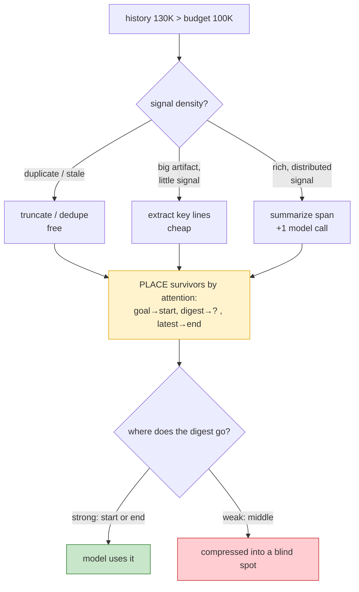

# Day 14 — Compaction & Lost-in-the-Middle

> **Today's one idea:** When history won't fit, you don't just delete — you *compress* (summarize, extract, dedupe) and you *place* what survives in the model's strong attention positions.
> **Reading time:** ~40 min (code day) · **Prereqs:** Day 16 · builds on Days 11, 12
> **Primary source for today:** Liu et al., "Lost in the Middle: How Language Models Use Long Contexts," TACL 2024, arXiv:2307.03172.
> **Before you start:** Recall Day 13's drill — one sentence, no looking: *when the budget forces a cut, what always stays in context and what goes first?*

## The hook (2–4 min)

Two agents hit the same wall: history is 130K tokens, budget is 100K. Both must shed 30K.

**Agent A** truncates: it deletes the oldest 30K tokens. Gone. Turn 3's "the user wants Postgres, not MySQL" vanishes, and by turn 25 the agent is writing MySQL.

**Agent B** compacts: it *summarizes* the oldest 40K tokens down to a 5K digest — "explored auth module; user requires Postgres; test_login fails on line 44; tried fix X (failed)" — and keeps that digest plus the recent turns. It fits, and it still knows about Postgres.

Same budget. One forgot; one compressed. **Deletion loses information; compaction trades detail for space.** That trade — and where you put what survives — is today.

## Building the intuition (10–15 min)

On Day 13 you evicted whole turns to fit a budget. That's the crude tool: *drop.* It works when the dropped thing is genuinely stale and reproducible (a file you can re-read). It fails when the dropped thing contained *signal you can't cheaply regenerate* — a decision, a constraint, a hard-won observation.

Compaction is the refined tool. Instead of a binary keep/drop, it asks: *can I keep the signal while shedding the bulk?* Almost always, yes — because most tokens in a long history are low-signal. A 400-line file you read is 1,800 tokens; the *reason you read it* is one sentence. A ten-turn debugging detour is 3,000 tokens; its lesson is "X didn't work because Y." Compaction distills.

There are four compaction operations, from cheapest to most powerful:

| Operation | What it does | When to use | Cost |
|---|---|---|---|
| **Truncate** | drop oldest/least-relevant wholesale | stale, reproducible content | free |
| **Dedupe** | remove repeated content (same file read 3×) | loops, re-reads | free |
| **Extract** | pull the high-signal lines, drop the rest | large artifacts (files, logs) with a little signal | cheap (rules/regex) |
| **Summarize** | LLM-compress a span into a digest | rich history with distributed signal | an extra model call |

Notice the cheapest three need no model call. Reach for summarization *last*, because it costs a call and can itself lose or distort signal (a summary is a lossy, fallible compression). Many "we need summarization!" problems are really "we're re-reading the same file five times" (dedupe) or "the tool returns 2,000 tokens when we need 20" (extract, or fix the tool — Day 8).

Now fuse in the *other* half of today, the part everyone forgets: **compaction without placement is half a fix.** You freed space — but where does the surviving digest go? By Day 11's Lost-in-the-Middle, if you drop your 5K summary into the *middle* of context, the model under-attends to it and you've compressed information into a blind spot. Compaction decides *what survives*; placement decides *whether the model uses it.* Both, every time.



## The formal picture (10–15 min)

Compaction is a budget-repair function invoked by `assemble_context` when selection still overflows:

```math
\text{compact}: (\text{content},\ \text{target tokens}) \rightarrow \text{content}',\quad \text{tokens}(\text{content}') \le \text{target},\ \text{signal}(\text{content}') \approx \text{signal}(\text{content})
```

The goal is to minimize *signal* loss for a given token reduction — not to minimize token count. Here's a practical compactor combining the cheap operations with summarization as the last resort, plus a memory write (Day 16) so nothing is truly lost:

```python
def compact_span(turns, target_tokens, memory, summarize_fn) -> list:
    """Compress a span of old turns to <= target_tokens, preserving signal."""
    # 1. DEDUPE: collapse identical tool results (same file read repeatedly)
    seen, deduped = set(), []
    for t in turns:
        h = hash(t["text"])
        if h in seen:
            continue
        seen.add(h); deduped.append(t)

    # 2. EXTRACT: for big tool results, keep only high-signal lines
    for t in deduped:
        if t["kind"] == "tool_result" and t["tokens"] > 400:
            t["text"] = extract_key_lines(t["text"])        # e.g. errors, signatures, the queried lines
            t["tokens"] = count(t["text"])

    if total_tokens(deduped) <= target_tokens:
        return deduped                                       # cheap ops were enough — no model call

    # 3. SUMMARIZE (last resort): compress the whole span into one digest...
    digest = summarize_fn(deduped)                           # one model call
    memory.remember_note(digest)                             # ...and persist it so it's recoverable (Day 16)
    return [{"kind": "summary", "text": digest, "tokens": count(digest)}]
```

And the placement rule, made explicit in assembly (upgrading Day 12/16):

```python
def assemble_context(state, memory, budget):
    goal = build_goal_block(state)                # STRONG start
    digest = state.get("running_summary")         # compacted old history
    recent = recent_turns(state)                  # freshest working set
    latest = recent[-1]                           # STRONG end
    # digest goes RIGHT AFTER the goal (near start), never buried mid-recent-turns:
    messages = [goal]
    if digest: messages.append({"role": "user", "content": f"Summary so far:\n{digest}"})
    messages += recent                            # recent turns run to the end; latest is last
    return state["system"], state["tools"], messages
```

Formal points:

- **Compaction is lossy; make the loss *chosen*, not *random*.** Truncation loses whatever happened to be oldest (random w.r.t. importance). Extraction and summarization lose the *low-signal* parts by design. Prefer chosen loss. And always pair a summarize with a **memory write** so the detail is *recoverable* even though it left context — compaction moves detail from working memory to long-term memory (Day 16), it doesn't destroy it.
- **The "running summary" pattern.** Maintain a single evolving digest of everything old. Each time you compact, fold the newly-old turns into it (`new_summary = summarize(old_summary + newly_old_turns)`). This keeps a constant-size, always-present memory of the whole run in a strong position — the standard production pattern for long agents (and what Anthropic's context-editing/compaction guidance describes).
- **Placement is governed by the U-curve, and the digest is the trap.** The two ends are strong (Day 11). Goal + standing constraints go at the start; the latest observation goes at the end; the *compacted digest of old history* goes near the **start** (right after the goal), never floated into the middle of recent turns. A digest in the middle is compression into a blind spot — the single most common way compaction silently fails.
- **When to compact is a policy.** Common triggers: context exceeds X% of budget; turn count crosses a threshold; or a "checkpoint" moment (a subtask finished). Compact too eagerly and you lose detail you still need; too late and you overflow. Tie it to the budget headroom you set on Day 12.

## Where it breaks / what it is not (3–5 min)

- **Summaries lie.** An LLM-generated digest can drop a crucial detail or hallucinate one. The summary is now context the model trusts — a bad summary poisons every future turn. Mitigate: summarize *conservatively* (prefer extraction of verbatim key lines over free-form prose for critical facts), and keep exact constraints in *exact* memory (Day 16), never only in a prose summary.
- **Compaction is not memory, and not assembly — it's the bridge.** Assembly *selects* (Day 12); memory *stores/recalls* (Day 16); compaction *compresses on the way from context to memory*. They compose: assembly calls compaction when over budget; compaction writes to memory. Keep the three operations distinct in your code even though they cooperate.
- **Re-summarizing repeatedly degrades.** Fold-summarizing a summary of a summary (the "running summary" over many compactions) accumulates drift — each pass loses a little. For very long runs, periodically re-derive the digest from durable memory/artifacts rather than from the previous digest.
- **Placement can't rescue bad selection.** If you compacted away the wrong thing, no amount of good placement helps. Selection quality (what to keep) dominates placement quality (where to put it) — but you need both, in that priority order.

## Try it yourself (5–10 min)

**1. Retrieval first.** Close the page. List the four compaction operations from cheapest to most powerful, and state the two-part rule that makes compaction actually work (hint: one part is about *what survives*, one about *where it goes*). Reopen after writing.

<details><summary>Hint</summary>Truncate → dedupe → extract → summarize (summarize is the only one needing a model call). The two-part rule: compress to keep signal while shedding bulk (what survives) **and** place survivors in strong attention positions (where it goes), never the middle.</details>

<details><summary>Worked answer</summary>Four operations, cheapest first: **truncate** (drop wholesale), **dedupe** (remove repeats), **extract** (keep high-signal lines, drop the rest), **summarize** (LLM-compress a span — the only one costing a model call, used last). The two-part rule: **(1) compress, don't just delete** — trade detail for space so you keep the *signal* while shedding bulk, and write the detail to long-term memory so it's recoverable; **(2) place the survivors in the model's strong attention positions** (goal + digest near the start, latest observation at the end), never in the low-attention middle — because a digest buried mid-context is compression into a blind spot.</details>

**2. Direct application — build the running-summary loop.** Add compaction to your agent: when assembled context exceeds 80% of budget, fold the oldest turns into a `running_summary` (use the model to summarize), write the digest to memory, and place it right after the goal block. Run a 25-turn task. Verify: (a) tokens stay bounded, (b) a constraint stated on turn 2 still influences turn 24, (c) the digest sits near the *start* of the payload, not the middle.

<details><summary>Hint</summary>Log the assembled `messages` order each turn and eyeball where the digest lands. Test (b) by planting a constraint and checking behavior 20 turns later — same test as Day 16, now via summary instead of pinned fact. Compare which mechanism (exact-pin vs. summary) preserves the constraint more reliably.</details>

<details><summary>Worked solution (what to verify + the key subtlety)</summary>

```python
def maybe_compact(state, memory, budget):
    if assembled_tokens(state) < 0.8 * budget:
        return
    old, recent = split_old_recent(state["turns"], keep_recent=6)
    new_digest = summarize_fn([state.get("running_summary", "")] + old)  # fold
    memory.remember_note(new_digest)
    state["running_summary"] = new_digest
    state["turns"] = recent           # old turns now live only in summary + memory
```

Verification results you should see: tokens **plateau** around 80% (compaction fires and resets growth); the constraint survives *if* it made it into the digest. The subtlety to notice for (b): a *prose summary* is less reliable at preserving a hard constraint than an *exact pinned fact* (Day 16) — so critical constraints should live in exact memory, and the running summary handles the softer narrative. This is the practical division of labor: **exact memory for things that must not drift; summaries for the story.** If your test shows the constraint occasionally lost, that's not a bug to brute-force — it's the signal to move that constraint to exact/pinned storage.</details>

**3. Stretch (callback to Day 11 + Day 12).** You place the running digest near the start. But the digest keeps *growing* over a very long run (fold after fold), and eventually the digest *itself* is large enough to have a weak middle. Describe this second-order Lost-in-the-Middle problem and two different fixes. (Extrapolating toward Day 24's cost thinking.)

<details><summary>Worked answer</summary>Second-order problem: as folds accumulate, the running summary becomes a large block (say 8K tokens) sitting near the start — and *within that block*, by Day 11, its own middle is under-attended. So a fact that got summarized into the middle of a big digest is doubly buried. Two fixes: **(1) Structured, bounded summaries** — cap the digest size and give it internal structure (e.g. sections: "Constraints / Decisions / Open problems / Dead ends"), each short, with the most load-bearing sections — constraints, current goal state — placed at the digest's own start/end. Structure lets the model navigate rather than skim a prose wall. **(2) Hierarchical / query-time summarization** — don't keep one growing prose digest; keep durable facts in structured memory (Day 16) and *retrieve* the relevant slice each turn (Day 16 recall), so the in-context digest is small and query-specific rather than a monotone accumulation. Both trade a bit more machinery (and, for #2, retrieval cost — Day 24) for keeping the in-context memory small and navigable. The meta-lesson: *every fix that adds tokens eventually re-creates the middle at a new scale* — the only durable answer is keeping the working set small and paging precisely.</details>

> **Transfer — apply it:** Take a long tool output from your domain (a query result, a log, an API response) that an agent would receive. Write the one-sentence *extraction* of its signal, and decide: does the full thing need to survive in memory, or is the extraction enough? One sentence on what you'd lose by keeping only the extraction.

## Connect it back

Day 16 gave state a bigger home; today taught you to *move* things there gracefully — compressing history to keep signal while shedding bulk, and placing survivors where the model actually attends ([the "how do you distill without losing signal?" question from Day 16](day-16-memory-and-state.md), grounded in [Day 11's U-curve](day-11-context-is-everything.md)). You now control *what flows through the loop* completely: select (7), store/recall (10), compress and place (11). What you don't yet control is *how long the loop runs and when it stops* — a loop that manages context beautifully but never terminates is still broken. Tomorrow: **loop control**. The question you can now answer: *history is 30K over budget — why is "delete the oldest 30K" the amateur move, and what does the professional do instead?*

## Suggested readings for today

**Required if you have 15 extra minutes:** Anthropic, "Effective Context Engineering," 2025 — [link](https://www.anthropic.com/engineering/effective-context-engineering-for-ai-agents), the compaction and context-editing sections. It's the running-summary pattern and eviction, from production.

**If you want the deep version:**
- Liu et al., "Lost in the Middle," arXiv:2307.03172, §4–5 — the placement data. Read it as *the reason digest placement matters*, not just a curiosity.
- MemGPT (arXiv:2310.08560), §3 — how paging + summarization interoperate; today's `compact_span` + `remember_note` is a hand-rolled version.

---

## Navigation

← **Previous:** [Day 13 — Drill I: Context Assembly](day-13-drill-context-assembly.md)  
→ **Next:** [Day 15 — Context Engineering Patterns](day-15-context-engineering-patterns.md)
