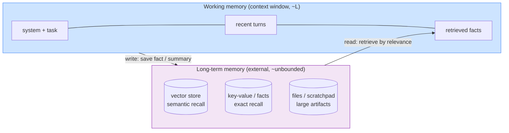

# Day 14 — Memory & State Across Turns

> **Today's one idea:** The context window is working memory — small and fast; durable knowledge lives in *external memory* the harness writes to and pages back in, so the agent can "remember" far more than fits.
> **Reading time:** ~45 min (code day) · **Prereqs:** Day 10 · builds on Days 9, 8
> **Primary source for today:** Packer et al., "MemGPT: Towards LLMs as Operating Systems," 2023, arXiv:2310.08560.
> **Before you start:** Recall Day 12's load-bearing idea — one sentence, no looking: *the four compaction operations cheapest-first, and the two-part rule (what survives, where it goes) that makes compaction work?*

## The hook (2–4 min)

On Day 10 you found the wound: recency-only assembly drops old-but-critical facts (the user's "never print the secret," the schema default that caused the bug). Your instinct was "pin the important ones." But that just moves the problem: pin everything important and you're back to overflow; pin too little and you drop the wrong thing. You can't win by choosing which facts to *keep in context* — there's not enough room.

The escape is to stop treating the context window as the only place memory can live. Your computer has 16GB of RAM and 2TB of disk, and it feels like it can "remember" the whole disk — because the OS pages data between them. Your agent needs the same trick: a small, fast context window (RAM) backed by a large, slow external store (disk), with the harness paging facts in exactly when they're relevant. That's today — and it's the OS analogy from Day 2 made literal, straight out of the MemGPT paper.

## Building the intuition (10–15 min)

Return to Day 2's operating-system picture, now with memory in focus. An OS gives a program the *illusion* of vast memory using a hierarchy:

```
registers (tiny, instant)  ->  RAM (small, fast)  ->  disk (huge, slow)
```

The CPU only ever operates on registers/RAM, but the OS *pages* data up from disk when the program touches an address that isn't loaded. The program feels like it has the whole disk; really it has a small working set plus a good paging policy.

Map it:

| OS memory tier | Agent equivalent | Property |
|---|---|---|
| RAM (working set) | the **context window** | small (`L`), fast, in-view every turn |
| Disk (backing store) | **external memory** (vector DB, files, key-value store) | large, slow, out-of-view until retrieved |
| The pager | the **harness's memory logic** | decides what to load into context and when |

So the agent's *state* (Day 10) splits into two tiers:

- **Working memory** = context window. What the model sees right now. Finite, precious, curated (Days 10–11).
- **Long-term memory** = external store. Everything the agent has learned or been told that doesn't fit — retrieved into working memory when relevant.



Two operations define the tier boundary, and both belong to the harness:

- **Write (remember):** when something durable happens — a decision, a learned fact, a user constraint, a large artifact — the harness *stores it externally* instead of (or in addition to) leaving it in the scrolling context. MemGPT has the *model itself* trigger writes via tool calls ("save this to memory"); simpler harnesses write automatically (e.g., on eviction, save a summary).
- **Read (recall):** each turn, `assemble_context` *retrieves* the most relevant stored items and injects them into working memory. This is the fix for recency-only: relevance-based recall pulls back the old-but-critical fact precisely when the current step makes it relevant, regardless of age.

The mental upgrade: **`assemble_context` is now a pager.** Day 10 it selected from recent history; today it also *queries long-term memory* for what's relevant now and pages it into the strong positions. The agent stops being limited to "what happened recently" and gains "what's relevant now, from everything I've ever known."

## The formal picture (10–15 min)

The **CoALA** paper gives clean names for the kinds of memory an agent holds. You don't need all four, but naming them prevents mush:

| CoALA memory | Holds | Example in a coding agent | Lifetime |
|---|---|---|---|
| **Working** | current context | the payload this turn | one turn |
| **Episodic** | past experiences/events | "on turn 4 I tried X, it failed" | this run (or saved) |
| **Semantic** | facts about the world | "this repo uses pytest, config in `pyproject.toml`" | across runs |
| **Procedural** | how-to skills | a saved routine: "to add a CLI flag, edit these 3 files" | across runs |

Working memory is the context window; the other three live in external stores and are retrieved into working memory as needed.

A minimal memory module. Two backends cover most needs: **key-value** for exact facts you'll look up by name, and **vector** for fuzzy semantic recall.

```python
class Memory:
    def __init__(self, embed_fn):
        self.facts = {}                 # key-value: exact recall (constraints, config)
        self.notes = []                 # list of (text, embedding): semantic recall
        self.embed = embed_fn

    # --- WRITE ---
    def remember_fact(self, key: str, value: str):
        self.facts[key] = value                          # e.g. "user_constraint" -> "never print secrets"

    def remember_note(self, text: str):
        self.notes.append((text, self.embed(text)))      # e.g. an episodic observation

    # --- READ ---
    def get_fact(self, key: str) -> str | None:
        return self.facts.get(key)

    def recall(self, query: str, k: int = 3) -> list[str]:
        import numpy as np
        if not self.notes: return []
        q = self.embed(query)
        scored = sorted(self.notes, key=lambda n: -float(np.dot(q, n[1])))
        return [text for text, _ in scored[:k]]          # top-k by semantic similarity
```

Now `assemble_context` becomes a pager (the Day 10 function, upgraded):

```python
def assemble_context(state, memory, budget=100_000):
    system = state["system"]; tools = state["tools"]
    # ALWAYS page in pinned exact facts (the recency-independent fix from Day 10 stretch)
    constraints = "\n".join(f"- {v}" for v in state["pinned_facts"].values())
    goal = {"role": "user", "content": f"Task: {state['task']}\nStanding constraints:\n{constraints}"}
    # RETRIEVE relevant long-term notes for THIS step (query = latest situation)
    latest = state["turns"][-1]["text"] if state["turns"] else state["task"]
    recalled = memory.recall(latest, k=3)
    recall_msg = {"role": "user", "content": "Relevant memory:\n" + "\n".join(recalled)} if recalled else None
    # recent working set (Day 10 recency window), fit to budget (Day 11 fit_to_budget)
    recent = select_recent_within_budget(state["turns"], budget_for_recent(budget))
    messages = [goal] + ([recall_msg] if recall_msg else []) + recent
    return system, tools, messages
```

Formal points:

- **Retrieval is relevance-based selection.** Day 10's selection was recency (a function of *time*); memory recall adds relevance (a function of *the current query*). Real assembly blends both: recent turns for continuity + retrieved facts for relevance. This is Generative Agents' scoring, which combines **recency, importance, and relevance** — worth stealing.
- **Writing is a policy, and it's lossy on purpose.** You cannot save everything verbatim (that's just moving the overflow to disk and making retrieval noisy). You save *distilled* items: extracted facts, summaries, decisions. When you evict a 1,800-token file (Day 11), you might `remember_note("parser.py: parse_expr handles nesting via depth counter, default 0")` — 20 tokens that preserve the signal. Eviction + memory-write = **compaction** (tomorrow).
- **Memory is state that outlives the context window, and possibly the run.** Episodic memory can be per-run; semantic and procedural memory can persist across runs, making the agent *learn* over time (Voyager's skill library is procedural memory that grows). This is where "agent" starts to mean more than "loop."
- **The harness owns the tiers; the model may or may not drive them.** Two designs: (a) *harness-managed* — the harness decides writes/reads automatically (simpler, predictable). (b) *model-managed* (MemGPT) — you expose `save_memory` / `search_memory` as **tools** (Day 5!) and the model decides when to page. Model-managed is more flexible and more failure-prone. Start harness-managed; add model-managed tools when the task needs the model's judgment about what's worth remembering.

## Where it breaks / what it is not (3–5 min)

- **A vector store is not memory; it's one backend for one kind of recall.** Semantic search is fuzzy and can miss exact needs ("what did the user say about the deadline?" wants key-value, not cosine similarity). Use exact stores for exact facts. Reaching for a vector DB reflexively is a common overbuild.
- **Retrieval can poison context.** Recall the wrong 3 notes and you've *added* misleading tokens in a strong position — worse than omission. Bad retrieval degrades the agent; retrieval quality is now part of your context quality (and something to evaluate, Day 21).
- **More memory ≠ better.** An agent that saves everything builds a noisy store where relevant recall gets harder. Memory needs curation and sometimes *forgetting* (TTL, deduplication) as much as context does.
- **Memory doesn't fix a bad loop.** If the agent's control flow is broken (Day 17), perfect memory just lets it repeat its mistakes with better recall. Memory is necessary, not sufficient.

## Try it yourself (5–10 min)

**1. Retrieval first.** Close the page. Draw the two memory tiers and label which is the context window and which is external. State the two operations that move information between them, and which tier the model can see directly. Reopen after writing.

<details><summary>Hint</summary>Working memory (context window, model sees it) ↔ long-term memory (external store, out of view). Operations: **write/remember** (context → store) and **read/recall** (store → context, by relevance). The pager is the harness.</details>

<details><summary>Worked answer</summary>Two tiers: **working memory** = the context window (small, fast, the *only* thing the model sees directly each turn) and **long-term memory** = an external store (vector / key-value / files; large, slow, invisible until retrieved). Two operations, both owned by the harness: **write/remember** distills something durable from working memory into the store (a fact, summary, or decision), and **read/recall** retrieves the most *relevant* stored items into working memory for the current step. The harness is the pager deciding what to load and when; the model only ever sees working memory (unless you expose memory as tools, MemGPT-style, letting the model drive the paging).</details>

**2. Direct application — fix the Day 10 failure with memory.** Reproduce the Day 10 stretch failure: a run where a turn-1 constraint ("never print API keys") gets evicted and a later turn violates it. Now add `Memory`: on the constraint turn, `remember_fact("no_print_secrets", ...)` and pin it in `assemble_context`. Also `remember_note` an evicted big file's distilled summary and confirm `recall` pulls it back when relevant. Verify the later turn now respects the constraint.

<details><summary>Hint</summary>Pinned exact facts go in via `state["pinned_facts"]` every turn (no retrieval needed — they're always relevant). The distilled file summary goes in via `remember_note` + `recall(latest)`. Test both paths: the exact-recall path and the semantic-recall path.</details>

<details><summary>Worked solution (the shape)</summary>

```python
mem = Memory(embed_fn=my_embedder)
# turn 1: user states a constraint -> exact fact, pinned forever
state["pinned_facts"]["no_print"] = "Never print or reveal API keys or secrets."
# turn 3: agent reads big config, about to evict it -> distill to a note
mem.remember_note("config/secrets.yaml holds API_KEY; schema field 'depth' defaults to 0.")
# ...many turns later, turn 20, agent considers printing config:
sys, tools, msgs = assemble_context(state, mem)
# msgs now ALWAYS contains: "Standing constraints: - Never print or reveal API keys..."
# and, because latest turn mentions config, recall() surfaces the secrets.yaml note.
# The agent sees both -> refuses to print, and remembers the 'depth' default it needs.
```

Two failures from Day 10/Day 11 fixed at once: the *constraint* never drops (exact + pinned), and the *load-bearing detail* comes back on demand (distilled note + semantic recall) — all without raising the budget. You've paged, not hoarded.</details>

**3. Stretch (callback to Day 9 + Day 8).** Retrieval injects `k=3` recalled notes into context every turn. Explain, using Day 9, why setting `k` too high is self-defeating — and describe the failure where retrieval *itself* causes Lost-in-the-Middle. Then name one signal you'd use to decide `k` dynamically. (Extrapolating toward Day 12 and Day 22.)

<details><summary>Worked answer</summary>Setting `k` too high dumps many retrieved notes into context, which (a) consumes budget that recent working-set turns need and (b) — by Day 9 — *creates its own middle*: pile in 20 recalled notes and the genuinely relevant one lands in the low-attention middle, functionally invisible, while the noise dilutes attention across the board. So aggressive retrieval reproduces the exact failure memory was meant to solve, one level down. Retrieval must be *precise*, not exhaustive — better to recall the top 2–3 high-relevance notes than 20 marginal ones. A dynamic-`k` signal: the **similarity score gap/threshold** — include a note only if its relevance score exceeds a cutoff (and stop when scores fall off a cliff), so you page in *few, high-signal* facts. This is "smallest high-signal set" (Day 10) applied to memory, and it's exactly the kind of thing you'd tune by measuring (Day 21/22).</details>

> **Transfer — apply it:** For an agent in your domain, name one fact that belongs in **exact** (key-value) memory and one that belongs in **semantic** (vector) memory. One sentence each: how would the agent phrase the *query* to recall each at the right moment? If you'd reach for a vector DB for the exact fact, reconsider.

## Connect it back

Day 10 gave you a budgeted *view* of state; today gave state somewhere bigger to live — an external memory the harness pages into context by *relevance*, curing recency-only amnesia ([the fix promised in the Day 10 stretch](day-10-context-assembly.md), built on [Day 8's owned state](../../02-loop-engineering-building-the-loop/days/day-08-your-first-agentic-loop.md) and [Day 9's finiteness](day-09-context-is-everything.md)). But writing to memory begged a question we dodged: *how* do you distill 1,800 tokens into a 20-token note without losing what matters? That's **compaction** — tomorrow. The question you can now answer: *if the model is stateless and context is finite, how can an agent remember more than fits in its window — and remember it across runs?*

## Suggested readings for today

**Required if you have 15 extra minutes:** MemGPT (arXiv:2310.08560), §3 — the memory hierarchy and how the *model* pages via function calls. You just built the harness-managed version; MemGPT is the model-managed one. Read for the OS analogy made literal.

**If you want the deep version:**
- Park et al., "Generative Agents," arXiv:2304.03442, §4 — the recency + importance + relevance retrieval score. Steal this scoring for your `recall`.
- Sumers et al., "CoALA," arXiv:2309.02427, §3 — the working/episodic/semantic/procedural taxonomy; use it to name what your agent stores.
- (Optional) Wang et al., "Voyager," arXiv:2305.16291 — procedural memory as a growing skill library; where memory becomes *learning*.

---

## Navigation

← **Previous:** [Day 13 — Context Engineering Patterns](day-13-context-engineering-patterns.md)  
→ **Next:** [Day 15 — Retrieval-Augmented Generation](day-15-retrieval-augmented-generation.md)
