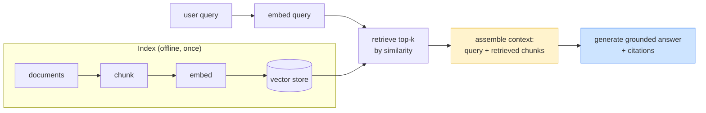

# Day 17 — Retrieval-Augmented Generation

> **Today's one idea:** RAG grounds a model in knowledge it wasn't trained on by *retrieving* relevant text at query time and putting it in context — so its quality is a retrieval problem and a context-engineering problem, not a model problem.
> **Reading time:** ~40 min (code day) · **Prereqs:** Day 16, Day 11
> **Primary source for today:** Lewis et al., "Retrieval-Augmented Generation for Knowledge-Intensive NLP Tasks," NeurIPS 2020, arXiv:2005.11401; Chip Huyen, *AI Engineering*, O'Reilly, 2025 (RAG).
> **Before you start:** Recall Day 16's load-bearing idea — one sentence, no looking: *the two memory tiers, and the two operations that move information between them?*

## The hook (2–4 min)

Ask a model "What's our refund policy?" and it will answer — confidently, fluently, and wrong, because it never saw your policy. Its knowledge is frozen at training time and doesn't include your documents, your database, or anything that happened after its cutoff.

You could fine-tune it on your docs (expensive, slow, stale the moment docs change). Or you could do the obvious thing: **look up the relevant policy and hand it to the model with the question.** "Here's the refund policy: [text]. Now answer: …" Suddenly it's right, current, and can even cite the source.

That's RAG. And notice what it really is: yesterday you gave your *agent* a memory it retrieves from (Day 16). RAG is the same move for *any* LLM app — retrieve relevant knowledge, put it in context, generate grounded on it. You already know the hard part (context engineering); today is the retrieval half and how the two compose.

## Building the intuition (10–15 min)

The model has two kinds of knowledge, and Lewis et al. named the distinction precisely:

- **Parametric memory** — what's baked into the weights during training. Vast, but frozen, uncitable, and prone to confabulation on specifics.
- **Non-parametric memory** — an external corpus you retrieve from at query time. Current, updatable, citable, and *yours*.

RAG combines them: use non-parametric memory (retrieval) to *ground* parametric memory (generation). The model brings language and reasoning; your corpus brings the facts.

The pipeline is four steps, and only one of them involves the LLM:



1. **Chunk** — split documents into passages (too big wastes context; too small loses meaning).
2. **Embed & index** — turn each chunk into a vector, store it. (Offline, done once.)
3. **Retrieve** — embed the query, find the top-k most similar chunks.
4. **Generate** — put query + retrieved chunks in context, ask the model to answer *using them*.

Here's the reframe that connects RAG to everything you've learned: **step 4 is pure context engineering (Module 3), and step 3 is the "retrieve on demand" pattern (Day 15) with a document corpus as the pool.** RAG isn't a new discipline — it's retrieval feeding context assembly. Which is why RAG systems fail for the *exact* reasons you already know: stuff in 20 chunks and the answer degrades (kitchen-sink + lost-in-the-middle, Day 11/15); put the best chunk in the dead middle and it's ignored (placement, Day 11); retrieve irrelevant chunks and you've poisoned context (Day 16's retrieval caveat). **A "RAG problem" is almost always a retrieval-quality problem or a context problem in disguise.**

The deepest connection: RAG *is* the agent-memory recall of Day 16, generalized. Agent memory retrieves the agent's own past into context; RAG retrieves a knowledge corpus into context. Same operation (relevance retrieval → context injection), different pool. Once you see this, you stop treating RAG, agent memory, and context graphs (Day 25) as three things — they're one thing (retrieve relevant knowledge into a finite context) with three source types.

## The formal picture (10–15 min)

A minimal RAG, reusing the retrieval machinery you built for memory (Day 16):

```python
import numpy as np, anthropic
client = anthropic.Anthropic()

# --- INDEX (offline) ---
def chunk(doc: str, size: int = 500, overlap: int = 50) -> list[str]:
    # naive fixed-size chunking; real systems chunk on structure (headings, paragraphs)
    words = doc.split()
    step = size - overlap
    return [" ".join(words[i:i+size]) for i in range(0, len(words), step)]

class RagIndex:
    def __init__(self, embed_fn):
        self.embed = embed_fn
        self.chunks: list[str] = []
        self.vecs: list[np.ndarray] = []
    def add(self, doc: str, source: str):
        for c in chunk(doc):
            self.chunks.append((source, c))
            self.vecs.append(self.embed(c))
    # --- RETRIEVE ---
    def retrieve(self, query: str, k: int = 4) -> list[tuple[str, str]]:
        q = self.embed(query)
        scored = sorted(zip(self.chunks, self.vecs), key=lambda cv: -float(np.dot(q, cv[1])))
        return [c for c, _ in scored[:k]]            # top-k (source, text)

# --- GENERATE (grounded) ---
def answer(index: RagIndex, query: str) -> str:
    hits = index.retrieve(query, k=4)                 # retrieve on demand (Day 15)
    # context assembly (Module 3): structure with source labels, best chunk LAST (strong position)
    context = "\n\n".join(f"[Source: {s}]\n{t}" for s, t in reversed(hits))
    resp = client.messages.create(
        model="claude-sonnet-5", max_tokens=500, temperature=0,
        system=("Answer ONLY from the sources below. If they don't contain the answer, "
                "say 'I don't know based on the provided sources.' Cite sources by name."),
        messages=[{"role": "user", "content": f"Sources:\n{context}\n\nQuestion: {query}"}],
    )
    return "".join(b.text for b in resp.content if b.type == "text")
```

Formal points:

- **Retrieval quality caps answer quality.** If step 3 doesn't surface the right chunk, no prompt in step 4 can recover — the model literally doesn't have the fact. So most RAG effort goes into retrieval: better chunking, better embeddings, **hybrid search** (combine semantic similarity with keyword/BM25 for exact terms), and **reranking** (a second, sharper model reorders the top candidates). "Garbage retrieved, garbage generated."
- **Grounding is a prompt contract + a context discipline.** The system prompt says "answer only from the sources, say 'I don't know' otherwise, cite" (Day 5's output contract). This is what turns retrieval into *grounded, non-hallucinated, citable* generation. Without it, the model blends sources with its parametric guesses and you lose the main benefit.
- **`k` is a context-budget knob, not "more is better."** Every retrieved chunk costs context budget and competes for attention (Day 11). Retrieve *few, high-relevance* chunks and place the best in a strong position — not top-20 dumped in reading order. This is Day 15's right-size + placement patterns, applied.
- **RAG vs. fine-tuning vs. long-context — a real decision.** RAG shines when knowledge is large, changing, or needs citations. Fine-tuning shines for *behavior/format*, not fresh facts. "Just use a huge context window and skip retrieval" fails on cost (you pay for every token every call) and on lost-in-the-middle (a 500-page dump has a huge dead middle). RAG is how you feed a finite, positional window from an effectively-unbounded corpus — the Day 11 problem, solved by retrieval.

Where RAG sits in the course: it's the bridge between context engineering (this module) and memory (Day 16) — and it generalizes again into graph-structured retrieval on Day 25 (GraphRAG), where the corpus is a knowledge graph you traverse instead of a flat chunk pile.

## Where it breaks / what it is not (3–5 min)

- **RAG doesn't stop hallucination by itself.** If retrieval misses and your prompt doesn't force "say I don't know," the model will happily fill the gap from parametric memory — confidently wrong, now *with* a citation-shaped veneer. Grounding contract + an honest "insufficient sources" path are mandatory.
- **Chunking is silently make-or-break.** Split a table across chunks, or cut a sentence mid-thought, and retrieval surfaces fragments the model can't use. Naive fixed-size chunking is a common source of bad RAG; chunk on structure and test it.
- **Similarity ≠ relevance ≠ sufficiency.** The top-k *similar* chunks may not *contain the answer* (they just look like the query), and even the right chunks may be *insufficient* (the answer spans documents). This is exactly where flat RAG hits a wall and Day 25's context graphs (multi-hop, GraphRAG) come in.
- **RAG is a system, so evaluate it as one.** "It seemed to answer well" is not evaluation. You measure retrieval (did the right chunk get retrieved? — recall@k) *and* generation (was the answer grounded and correct?) separately, because a good answer with bad retrieval is luck. This is Day 23 applied to RAG.

## Try it yourself (5–10 min)

**1. Retrieval first.** Close the page. Draw the four-step RAG pipeline, mark which step uses the LLM, and state which Module-3 pattern step 3 and step 4 correspond to. Say why "a RAG problem is usually not a model problem." Reopen after writing.

<details><summary>Hint</summary>Chunk → embed/index → retrieve → generate; only step 4 uses the LLM. Step 3 = "retrieve on demand" (Day 15); step 4 = context assembly (right-size + placement + structure, Days 11/15). Not a model problem because failures come from bad retrieval or bad context, not the frozen weights.</details>

<details><summary>Worked answer</summary>RAG pipeline: **(1) chunk** documents → **(2) embed & index** them in a vector store (offline) → **(3) retrieve** top-k chunks by similarity to the query → **(4) generate** an answer grounded in the retrieved chunks. Only **step 4** uses the LLM. Step 3 is the **retrieve-on-demand** pattern (Day 15) with a document corpus as the pool; step 4 is **context assembly** — right-size (few chunks), strong-position placement (best chunk at the end), and structure (source labels) from Days 11 and 15, plus a grounding output contract (Day 5). A RAG problem is usually not a model problem because the model's weights are fine — failures come from retrieval surfacing the wrong/insufficient chunks or from context that buries or over-stuffs them; fix retrieval and context, not the model.</details>

**2. Direct application — build a grounded, honest RAG.** Index a small real corpus (your team's docs, a few wiki pages, a manual). Implement chunk → embed → retrieve top-4 → generate with a grounding contract ("answer only from sources; say 'I don't know' otherwise; cite"). Test three queries: one answerable, one *not* in the corpus (confirm it says "I don't know" instead of hallucinating), and one whose answer spans two documents (watch it struggle — that's the Day 25 motivation). Then vary `k` from 2 → 10 and observe answer quality *peak and then degrade*.

<details><summary>Hint</summary>The "not in corpus" test is the important one — it proves your grounding contract works. If the model answers a question your docs don't cover, your prompt isn't enforcing grounding. The `k` sweep should show a sweet spot, not monotonic improvement — that's lost-in-the-middle (Day 11) in a RAG costume.</details>

<details><summary>Worked solution (what to observe)</summary>

- **Answerable query:** returns the fact with a `[Source: ...]` citation. 
- **Not-in-corpus query ("What's our parental leave policy?" when no such doc exists):** with the grounding contract, it says "I don't know based on the provided sources." *Without* the contract (test both), it invents a plausible policy — the exact failure grounding prevents.
- **Cross-document query ("Compare the refund and cancellation policies"):** flat top-k retrieves chunks from each but the model may miss the *relationship* or get an incomplete comparison — because the answer lives across documents, not in any chunk. This is the multi-hop wall that motivates context graphs (Day 25).
- **`k` sweep:** quality rises from k=2 (maybe missing a needed chunk) to a peak around k=3–5, then *degrades* by k=10 as relevant chunks get diluted and pushed toward the dead middle. You've just reproduced Day 11's lost-in-the-middle inside a RAG pipeline — proof that RAG quality is context quality.
</details>

**3. Stretch (callback to Day 16 + preview Day 25).** Your RAG and your Day 16 agent memory both "retrieve relevant text into context." State precisely what's the *same* and what's *different* about them, and name the failure mode both share that a *graph* (Day 25) would fix. 

<details><summary>Worked answer</summary>**Same:** both are the *retrieve-relevant-knowledge-into-a-finite-context* operation — embed a query, score items by relevance, inject the top few into context in strong positions, generate grounded on them. The mechanism (Day 16's `recall`) is literally reusable for both. **Different:** the *pool* and its *lifecycle*. Agent memory's pool is the agent's *own accumulating experience* (episodic/semantic, written during the run, often ephemeral); RAG's pool is an *external, curated document corpus* (indexed offline, shared across queries, relatively static). Agent memory answers "what have *I* done/learned?"; RAG answers "what do the *documents* say?" **Shared failure a graph fixes:** both do *flat, single-hop* retrieval — they surface items *similar* to the query but can't follow *relationships* to assemble an answer that spans multiple items (the cross-document comparison that stumped your RAG; the multi-fact chain in Day 16). A **context graph** (Day 25) stores items as connected, typed, time-stamped nodes so retrieval can *traverse* relationships and respect supersession — fixing multi-hop and staleness for both RAG (→ GraphRAG) and agent memory at once. That's why Day 25 unifies them.</details>

> **Transfer — apply it:** Name a body of knowledge in your work an LLM would need but wasn't trained on (internal docs, a codebase, tickets). One sentence: what would you chunk it on (structure?), and what's one query whose answer spans multiple documents — i.e., where flat RAG would struggle and you'd want a graph?

## Connect it back

Day 16 gave your agent a retrievable memory; today generalized that exact move into RAG — grounding *any* LLM app in external knowledge — and revealed it as retrieval feeding context assembly, so RAG's failures are the context failures you already know how to diagnose (Day 15). Tomorrow you rest and consolidate the whole context/memory arc (Days 11–17) before turning back to the loop. The question you can now answer: *why is "just retrieve more chunks" the wrong instinct for a weak RAG system, and what's the right one?*

## Suggested readings for today

**Required if you have 15 extra minutes:** Lewis et al., "Retrieval-Augmented Generation," NeurIPS 2020, arXiv:2005.11401 — [link](https://arxiv.org/abs/2005.11401) — §1 and the parametric/non-parametric framing. The origin of the idea you just built.

**If you want the deep version:**
- Chip Huyen, *AI Engineering*, O'Reilly, 2025 — the RAG chapter: chunking strategies, hybrid search, reranking, and RAG vs. fine-tuning vs. long-context as an engineering decision.
- Edge et al., "GraphRAG: From Local to Global," 2024, arXiv:2404.16130 — [link](https://arxiv.org/abs/2404.16130) — preview of Day 25: what to do when flat retrieval can't answer corpus-spanning questions.

---

## Navigation

← **Previous:** [Day 16 — Memory & State Across Turns](day-16-memory-and-state.md)  
→ **Next:** [Day 18 — Rest & Synthesize I](day-18-rest-synthesize-i.md)
