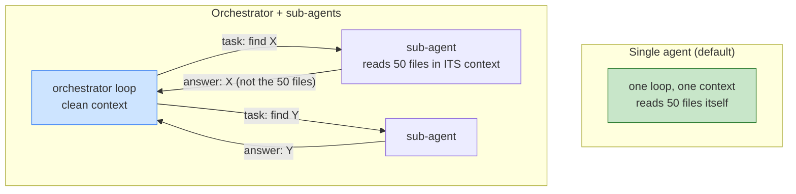

# Day 19 — Multi-Agent Orchestration

> **Today's one idea:** Split one loop into several *only* when a task needs isolated context or parallelism — because every sub-agent adds a context boundary you must design, and most "multi-agent" problems are one well-built loop.
> **Reading time:** ~40 min (code day) · **Prereqs:** Day 14, Day 17
> **Primary source for today:** Wu et al., "AutoGen: Enabling Next-Gen LLM Applications via Multi-Agent Conversation Framework," 2023, arXiv:2308.08155.
> **Before you start:** Recall Day 18's drill — one sentence, no looking: *why must assembly, memory, compaction, and control each own a separate slice of state?*

## The hook (2–4 min)

Multi-agent systems are the most over-reached-for pattern in the field. The pitch is seductive: "a Planner agent, a Coder agent, a Reviewer agent, a Tester agent, all collaborating!" It sounds like a well-run team. It usually behaves like a game of telephone where four stochastic processes each lose a little context, misunderstand the last one, and cost 4× as much.

Here's the uncomfortable truth Barry Zhang and the Anthropic team keep repeating: **most tasks people solve with multiple agents are better solved with one good agent.** You've spent 16 days building that one good agent — with memory, compaction, control, recovery. Before you shard it into a committee, you need to know *exactly* when the extra machinery pays for itself, because the default answer is "it doesn't."

Today is as much about *when not to* as *how to*. The skill is recognizing the two real reasons to add an agent — and rejecting the dozen fake ones.

## Building the intuition (10–15 min)

Start from what a sub-agent actually *is*, mechanically. A sub-agent is just another agentic loop (Day 8) — its own context window, its own state, its own control. When Agent A "delegates to" Agent B, what physically happens is: A packages a task description, B runs a *fresh loop* with *its own context*, and B returns a result that A folds back into *its* context.

That last sentence contains the whole cost and the whole benefit:

- **The benefit — context isolation.** B works in a *clean, separate context window.* A's 40 turns of history don't clutter B's window; B's 40 turns of exploration don't pollute A's. If a subtask needs to read 50 files to find one answer, doing that in a sub-agent means A's context receives only the *answer*, not the 50 files. **A sub-agent is a context-isolation boundary** — and context, as you now know deeply (Days 9–18), is the scarce resource. This is the #1 legitimate reason to split.
- **The cost — a lossy handoff.** Everything crossing the A↔B boundary must be *serialized into a message.* B only knows what A tells it; A only learns what B reports. This is a compression/translation step, and like all compression (Day 12) it's lossy and fallible. Every boundary is a place for context to be lost, misunderstood, or hallucinated. More agents = more boundaries = more telephone.



Look at the right side: the orchestrator's context stays clean because each sub-agent absorbs the *mess* of its subtask and returns only a distilled result. That's the pattern working. Now imagine the subtasks aren't independent — sub-agent 2 needs to know what sub-agent 1 discovered, mid-work. Suddenly you're passing rich context across boundaries, the telephone game begins, and you'd have been better off with one loop. **The tell for legitimate multi-agent is *independence*: subtasks that don't need to see each other's working context, only each other's results.**

So the two real reasons to split, and nothing else:

1. **Context isolation** — a subtask generates a lot of context you don't want in the main window (deep exploration, reading many files, a long tangent). Isolate it; keep only the result. (This connects to Day 14: a sub-agent is like paging a whole *subtask* out of working memory.)
2. **Parallelism** — genuinely independent subtasks that can run *concurrently* to cut wall-clock latency (Day 22). Three files to analyze independently → three sub-agents in parallel → 1× latency instead of 3×.

If neither applies — if the "agents" would just pass rich context back and forth serially — **you have one agent with extra steps and 4× the bill.** Use a single loop, or at most a *workflow* (Anthropic's term): a fixed, code-orchestrated pipeline of model calls, which is more predictable than autonomous multi-agent and often all you need.

## The formal picture (10–15 min)

The dominant, robust pattern is **orchestrator-workers**: one orchestrator loop that decomposes a task and dispatches subtasks to worker sub-agents, treating "spawn a sub-agent" as *just another tool* (Day 5!).

```python
def sub_agent(task: str, tools, budget: Budget) -> str:
    """A full agentic loop (Days 8-20) with its OWN fresh context. Returns a DISTILLED result."""
    state = fresh_state(task, tools)
    result = run_agent(state, budget=budget)     # everything you built, recursively
    return distill(result)                        # return the ANSWER, not the trajectory

# The orchestrator exposes sub-agents AS TOOLS:
def make_researcher_tool():
    return {
        "schema": {"name": "research", "description": "Investigate a question; returns findings only.",
                   "input_schema": {"type": "object", "properties": {"question": {"type": "string"}},
                                    "required": ["question"]}},
        "fn": lambda question: sub_agent(question, RESEARCH_TOOLS, Budget(max_turns=15)),
    }

# For PARALLELISM: independent sub-agent calls run concurrently
import concurrent.futures as cf
def parallel_subagents(tasks: list[str], tools, budget) -> list[str]:
    with cf.ThreadPoolExecutor() as pool:
        return list(pool.map(lambda t: sub_agent(t, tools, budget), tasks))
```

The orchestrator's loop is your ordinary Day 18 turn — it just has `research`/`code`/`test` tools that happen to be sub-agents. Everything you built (context assembly, control, recovery, eval) applies *at each level* recursively.

Formal points:

- **A sub-agent is a tool that is itself an agent.** This is the cleanest mental model and it makes the whole day fall out of what you know: sub-agents get schemas (Day 5), validated inputs (Day 6), budgets and stuck-detection (Day 17), and resilience (Day 20) — *each*. The orchestrator dispatches them exactly like tools. No new primitive; a recursion.
- **Budgets must be *hierarchical*, or costs explode.** Each sub-agent has its own budget (Day 17), *and* the orchestrator has a total budget that bounds the sum. Without a hierarchy, a "cheap" orchestrator turn secretly spawns a 30-turn sub-agent, and your Day 22 cost model is fiction. The orchestrator must charge sub-agent spend against its own ceiling. Multi-agent is a cost *multiplier* — bound it deliberately.
- **The boundary contract is the whole design.** For each sub-agent, specify precisely: what task description goes *in* (the serialized context — make it complete, since B sees nothing else) and what distilled result comes *out* (the answer, *not* the trajectory — returning the full trajectory defeats the context-isolation benefit). A sub-agent that returns its 40-turn history into the orchestrator's context is worse than no sub-agent. Design the *interface*, tightly, as you did on Day 6 — the boundary is a tool interface.
- **Topologies, briefly, worst-to-best-understood:** *orchestrator-workers* (one coordinator, N workers — predictable, the default) < *sequential pipeline / workflow* (fixed hand-offs, most predictable of all, often not even "agentic") < *autonomous peer-to-peer conversation* (AutoGen's general form — agents freely message each other; maximally flexible, maximally unpredictable, hardest to control/debug/eval). AutoGen shows the general conversational abstraction; in production you usually want the *most constrained* topology that solves the task, for the same reason you want the narrowest tools (Day 6): constraint is controllability.
- **Eval and observability get harder, and matter more.** A trajectory (Day 21) is now a *tree* of sub-trajectories; a trace (Day 22) is nested across agents. You must be able to attribute a failure or a cost to the *specific* sub-agent. If you can't eval and trace the multi-agent system, you can't operate it — and its extra complexity means you need those instruments *more*, not less.

## Where it breaks / what it is not (3–5 min)

- **Multi-agent is not "more minds, more intelligence."** Agents aren't people; a "team" of four LLM loops doesn't deliberate — it plays telephone across four lossy boundaries. Added agents add *failure surface and cost*, and buy capability *only* via isolation or parallelism. If you can't name which of those two you're getting, you're getting neither.
- **Shared mutable state across agents is a distributed-systems nightmare.** Two agents writing the same files/DB concurrently gives you race conditions, lost updates, and conflicts — every hard problem from Kleppmann, now with stochastic actors. Prefer *isolated* state per sub-agent with explicit, serialized handoffs. If agents must share state, you've likely chosen the wrong decomposition.
- **A role label is not an architecture.** Naming agents "Planner / Coder / Reviewer" feels like design but isn't — it's four prompts. The real design is the *boundary contracts and budgets*. Many "multi-agent frameworks" give you the labels and leave the hard part (context handoff, hierarchical budgets, failure attribution) to you.
- **Don't reach here to fix a weak single agent.** If your one agent fails a task, splitting it rarely helps — you get four weak agents and a coordination problem. Fix the loop (context, control, tools) first. Multi-agent is for *scale and isolation*, not for rescuing a broken loop.

## Try it yourself (5–10 min)

**1. Retrieval first.** Close the page. State the *two and only two* legitimate reasons to split one agent into several, and the core cost every split incurs. Then give the one-sentence "tell" that a task is genuinely multi-agent vs. secretly single-agent. Reopen after writing.

<details><summary>Hint</summary>Two reasons: context isolation (keep a subtask's mess out of the main window) and parallelism (independent subtasks concurrently for latency). Core cost: every boundary is a lossy, serialized context handoff (telephone). The tell: *independence* — do subtasks need each other's working context (→ single agent) or only each other's results (→ multi-agent)?</details>

<details><summary>Worked answer</summary>The only two legitimate reasons to split: **(1) context isolation** — a subtask generates a lot of context (deep exploration, many files, a long tangent) that you don't want polluting the main window, so a sub-agent absorbs it and returns only the distilled *result*; and **(2) parallelism** — genuinely independent subtasks run concurrently to cut wall-clock latency. The core cost of every split: a **lossy, serialized context handoff** across the boundary — the sub-agent only knows what it's told and only reports what it returns, so each boundary is a place for context to be lost, misunderstood, or hallucinated (telephone). The tell for *genuine* multi-agent is **independence**: if subtasks only need each other's *results*, split them; if they need each other's *working context* mid-task, you have one agent with extra lossy steps and multiplied cost — keep it as a single loop (or a fixed workflow).</details>

**2. Direct application — build an orchestrator and A/B it against a single agent.** Take a task with an independent, context-heavy subcomponent (e.g. "summarize what each of these 5 modules does, then propose a refactor"). Build it two ways: (a) one agent that reads all 5 modules in its own context, (b) an orchestrator that spawns 5 parallel sub-agents (one per module, each returning a 2-line summary) then reasons over the summaries. Run both on your eval (Day 21) with tracing (Day 22). Compare success, cost, latency, and *peak context size*.

<details><summary>Hint</summary>The sub-agents must return *distilled* summaries, not the file contents — that's the whole point. Measure peak orchestrator context: the multi-agent version should keep it small (5 short summaries) vs. the single agent (5 full modules). Watch whether latency drops (parallelism) and whether cost rises (5 sub-loops).</details>

<details><summary>Worked solution (the trade laid bare)</summary>

```
# (a) single agent: reads 5 modules into ONE context
success=0.80  cost=$0.55  latency=14s  peak_context=48K tokens (all 5 modules resident)

# (b) orchestrator + 5 parallel sub-agents (each returns 2-line summary)
success=0.85  cost=$0.71  latency=6s   peak_orch_context=6K tokens (5 summaries only)
```

Read the trade honestly: multi-agent **won on latency** (6s vs 14s — parallelism) and **peak context** (6K vs 48K — isolation kept the orchestrator clean, which helped success 0.80→0.85 by avoiding Lost-in-the-Middle over 48K), but **lost on cost** ($0.71 vs $0.55 — five sub-loops each pay their own overhead). *Both legitimate reasons showed up* (isolation + parallelism), which is exactly why this task justifies multi-agent. Now imagine the subtasks were *dependent* (module 2's summary needs module 1's) — you'd lose the parallelism, add serial boundary handoffs, and the numbers would flip against you. The A/B *is* the decision procedure: split only when the isolation/latency wins beat the cost/complexity tax, and let the eval tell you, not the org-chart metaphor.</details>

**3. Stretch (callback to Day 2 + Day 17).** An orchestrator spawns sub-agents as tools. Each sub-agent has `max_turns=15`; the orchestrator has `max_turns=10`. What's the worst-case total model-call count, and what *two* budget controls from Day 17 must become *hierarchical* to keep this bounded? Then name the Day 2 principle that explains why the orchestrator can't just "trust" sub-agents to stay cheap. (Synthesizing control across levels.)

<details><summary>Worked answer</summary>Worst case: each of the orchestrator's 10 turns could spawn a sub-agent that runs its full 15 turns → **10 × 15 = 150** sub-agent model calls, *plus* the orchestrator's own 10 = up to 160 — and if sub-agents could themselves spawn sub-agents, it compounds further (recursion). The two Day 17 controls that must become **hierarchical**: **(1) the cost/token/turn budget** — the orchestrator's budget must *charge sub-agent spend against its own ceiling* (a total budget bounding the sum), not just count its own 10 turns, or the "10-turn" orchestrator secretly costs 160 turns; and **(2) recursion/depth limit** — a hard cap on nesting depth (and fan-out), so sub-agents can't spawn sub-agents unboundedly (a stuck-detection analog for the *tree*, not just one loop). The Day 2 principle: the model is a **stateless** function that can't see or count what happens across calls (its own or its sub-agents'), so it *cannot* police aggregate cost — only the **harness**, which is stateful and sits above all levels, can enforce a total budget across the tree. "Trust the sub-agent to be cheap" is exactly the mistake Day 17 warned against (a completion/behavior claim you must instead *bound and verify*), now multiplied across a hierarchy. Bound every level; sum the bounds; cap the depth.</details>

> **Transfer — apply it:** Think of a task in your domain someone might pitch as "multi-agent." Decide honestly: does it have a context-isolated or parallelizable subtask (→ split), or would the agents just pass rich context back and forth (→ single loop)? One sentence naming which, and the one boundary contract (input → distilled output) if you'd split.

## Connect it back

You've spent the course making *one* loop excellent; today you learned the discipline of *not* multiplying it — splitting into orchestrator + sub-agents only for context isolation or parallelism, treating each sub-agent as a tool-that-is-an-agent with its own budget and a tight boundary contract, and reaching for the *most constrained* topology that works ([sub-agents as recursion of Day 8's loop](../../02-loop-engineering-building-the-loop/days/day-08-your-first-agentic-loop.md), bounded by [hierarchical Day 17 controls](day-17-loop-control-and-stopping.md), because [Day 2's stateless model can't police the tree](../../00-foundations/days/day-02-stateless-model-and-harness.md)). Every piece is now in your hands. Tomorrow you assemble all of it — loop, tools, context, memory, control, recovery, eval, observability, and the multi-agent judgment — into a production harness on a real task, and defend it. The question you can now answer: *someone proposes a five-agent "team" for your task — what two questions determine whether that's architecture or expensive theater?*

## Suggested readings for today

**Required if you have 15 extra minutes:** Barry Zhang, "How We Build Effective Agents," AI Engineer Summit 2025 — [talk](https://www.youtube.com/watch?v=D7_ipDqhtwk). "Don't use agents for everything; keep it simple." The single best inoculation against over-engineering multi-agent systems.

**If you want the deep version:**
- Anthropic, "Building Effective Agents," 2024 — [link](https://www.anthropic.com/engineering/building-effective-agents) — the workflow-vs-agent distinction and the orchestrator-workers / evaluator-optimizer patterns, with explicit guidance on when *not* to add agents.
- Wu et al., "AutoGen," arXiv:2308.08155, §2–3 — the general multi-agent conversation abstraction; read it to understand the *most flexible* (and least constrained) end of the topology spectrum, then appreciate why you usually want less.

---

## Navigation

← **Previous:** [Day 18 — Drill II: The Turn, End-to-End](day-18-drill-the-turn-end-to-end.md)  
→ **Next:** [Day 20 — Failure & Recovery](../../05-harness-engineering-reliability-and-operations/days/day-20-failure-and-recovery.md)
