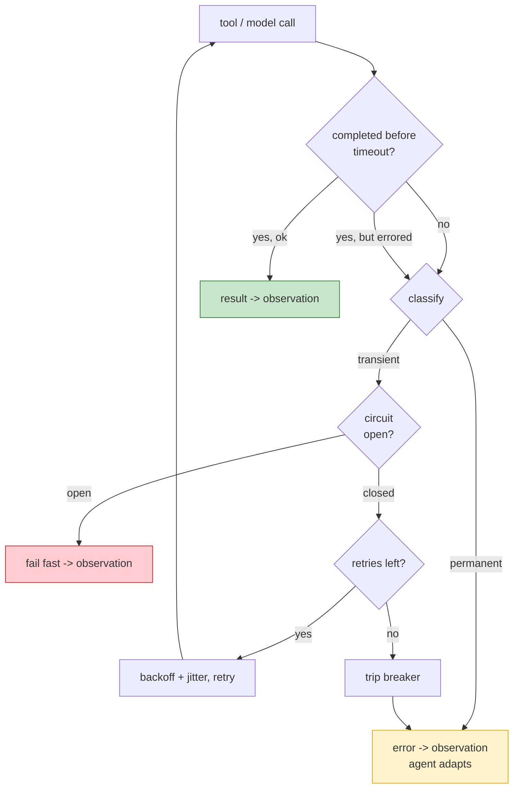

# Day 20 — Failure & Recovery

> **Today's one idea:** In production every tool and model call *will* fail; a robust harness treats failure as an expected input — isolating it, retrying wisely, and turning errors into observations the agent can recover from.
> **Reading time:** ~40 min (code day) · **Prereqs:** Day 6, Day 17
> **Primary source for today:** Michael T. Nygard, *Release It!*, 2nd ed., Pragmatic Bookshelf, 2018 (Stability Patterns).
> **Before you start:** Recall Day 19's load-bearing idea — one sentence, no looking: *when should you split one loop into several agents, and what is the main cost of doing so?*

## The hook (2–4 min)

Your agent works on your laptop. You ship it. Within an hour:

- A tool call to a flaky internal API times out on turn 8. Your loop throws, the process dies, the user sees a stack trace.
- The model API returns a 529 (overloaded) on turn 3. Same death.
- A tool succeeds but the agent, having timed out waiting, *retries the same non-idempotent write* — and now there are two duplicate orders in the database.
- A downstream service is fully down, and your agent hammers it 30 times in a tight retry loop, turning a partial outage into a full one.

None of these are model-intelligence problems. They're the ordinary failures every distributed system faces — and an agent, which fires network calls every turn against models *and* tools, is a distributed system that happens to have an LLM in it. Today you borrow 20 years of hard-won production wisdom (Nygard's *Release It!*) and wire it into the loop.

## Building the intuition (10–15 min)

There's a mindset shift first. A demo treats failure as an *exception* — something rare that aborts the run. Production treats failure as an *input* — something routine the system is designed to absorb. Your Day 6 instinct already pointed here: *every tool outcome becomes an observation, never a crash.* Today generalizes that from "bad arguments" to "the whole call failed," and adds the patterns that keep failures *bounded* and *recoverable*.

Two kinds of failure hit an agent, and they need different responses:

| Failure kind | Examples | Right response |
|---|---|---|
| **Transient** | timeout, 529 overloaded, rate limit, network blip | **retry** (with backoff) — it'll probably work next time |
| **Permanent** | invalid args, 404, auth denied, logic error | **don't retry** — feed the error back as an observation so the *agent* adapts |

Retrying a permanent failure is pure waste (it'll fail identically); *not* retrying a transient one throws away a call that would've succeeded. So the first skill is *classifying* the failure.

Now the patterns, all from Nygard, each answering a specific way things go wrong:

- **Timeout** — never wait forever. Every external call (model and tool) gets a deadline. A call with no timeout is a hang waiting to happen; one slow tool freezes the whole agent. *Bound every wait.*
- **Retry with exponential backoff + jitter** — for transient failures, retry, but wait longer each time (1s, 2s, 4s…) with randomness, so you don't stampede a recovering service. Cap the attempts.
- **Circuit breaker** — if a tool fails repeatedly, *stop calling it* for a cooldown period. Like an electrical breaker: after N failures, "trip open" and fail fast (return an error observation immediately) instead of retrying into a dead service. This prevents your agent from turning a downstream outage into a self-inflicted hammering, and stops it wasting turns on a tool that's down.
- **Idempotency** — make retries safe. If a call might be retried, it must be safe to run twice. Reads are naturally idempotent; *writes are the danger* (the duplicate-order bug). Use idempotency keys or check-then-act so a retried write doesn't double-apply.



The through-line, and the reason this is a *harness* day: **the model can recover from failures it can *see*, but only the harness can implement the reliability patterns that decide *which* failures it sees and *when*.** A transient blip should be retried silently (the model never needs to know). A permanent error should surface as an observation so the model can adapt ("that file doesn't exist; let me list the directory"). A tripped breaker should tell the model "this tool is unavailable, try another path." Deciding this routing is pure harness engineering — the model can't, because it can't see across calls or count failures (Day 2, Day 17).

## The formal picture (10–15 min)

A resilient tool call wraps `dispatch` (Day 6) with timeout, classification, retry, and a breaker:

```python
import time, random

class CircuitBreaker:
    def __init__(self, fail_max=3, cooldown=30):
        self.fail_max, self.cooldown = fail_max, cooldown
        self.fails, self.opened_at = 0, None
    def is_open(self) -> bool:
        if self.opened_at and time.time() - self.opened_at < self.cooldown:
            return True                              # still tripped: fail fast
        if self.opened_at:                           # cooldown passed: half-open, try once
            self.opened_at = None; self.fails = 0
        return False
    def record(self, ok: bool):
        if ok: self.fails = 0
        else:
            self.fails += 1
            if self.fails >= self.fail_max: self.opened_at = time.time()   # trip

def is_transient(exc) -> bool:
    return isinstance(exc, (TimeoutError, ConnectionError)) or getattr(exc, "status", None) in (429, 500, 502, 503, 529)

def resilient_call(fn, *args, breaker: CircuitBreaker, timeout=20, max_retries=3, **kwargs) -> tuple[bool, str]:
    """Returns (ok, observation_text). NEVER raises — failure is an input, not an exception."""
    if breaker.is_open():
        return False, "Tool temporarily unavailable (circuit open after repeated failures). Try another approach."
    for attempt in range(max_retries):
        try:
            result = call_with_timeout(fn, *args, timeout=timeout, **kwargs)
            breaker.record(ok=True)
            return True, str(result)
        except Exception as e:
            if not is_transient(e):                  # permanent: don't retry, let the agent adapt
                breaker.record(ok=False)
                return False, f"Error: {type(e).__name__}: {e}"
            if attempt == max_retries - 1:           # transient but out of retries
                breaker.record(ok=False)
                return False, f"Error: {type(e).__name__} after {max_retries} attempts. Tool may be down."
            time.sleep((2 ** attempt) + random.uniform(0, 1))   # backoff + jitter, then retry
```

And idempotency for mutating tools:

```python
_APPLIED = set()
def idempotent(key: str, write_fn, *args):
    if key in _APPLIED:                              # already did this exact write
        return "Already applied (idempotent skip)."
    result = write_fn(*args)
    _APPLIED.add(key)
    return result
# the model (or harness) supplies a stable key per intended action, so a retry is a no-op
```

Formal points:

- **Failure handling has layers, and they compose with Day 17.** Per-call: timeout + retry + breaker (this page). Per-loop: budgets + stuck-detection (Day 17). A retried-out tool becomes an error observation; enough error observations may trip stuck-detection or exhaust the budget → escalation. The controls nest: the call layer absorbs blips, the loop layer bounds the rest.
- **Retries interact with budgets — count them.** Three retries with backoff can add seconds and tokens (if you re-call the model). Your Day 17 budget (time, cost) must account for retry overhead, or a flaky environment silently blows through it. Retry is not free; it trades latency for success probability.
- **Idempotency is a *tool design* property, decided at the boundary (Day 6).** You can't bolt safety onto a naturally-unsafe write after the fact. Mutating tools should be designed with idempotency keys or check-then-act from the start — which is why write/execute tools deserved extra scrutiny on Day 6. Read tools need none of this; the danger scales with side effects.
- **Recovery is harness *and* model.** The harness handles *mechanical* recovery (retry the blip, trip the breaker). The *model* handles *semantic* recovery — adapting strategy when it sees an error observation ("auth denied → I need different credentials → ask the user"). Shinn et al.'s **Reflexion** is exactly this model-side loop: reflect on the failure in language, change approach. The two layers cover different failures: mechanical for transient infrastructure, semantic for "my plan was wrong." Give the model *informative* error observations (Day 6) so its semantic recovery has something to work with.
- **Fail toward safety and honesty.** When recovery is exhausted, the terminal state is *not* a crash and *not* a silent wrong answer — it's an honest, escalated failure with context (Day 17's Blocked/give-up policy): "Couldn't complete: the deploy API has been unavailable for 30s after 3 attempts. Here's what I did finish." A bounded, truthful failure is a *successful* production outcome.

## Where it breaks / what it is not (3–5 min)

- **Retrying non-idempotent writes causes duplicates — the most common agent-in-production bug.** "Retry on timeout" + "the write actually succeeded but the ack was lost" = double-apply. Never retry a mutation without idempotency. This bug is silent and expensive (duplicate orders, double charges).
- **Circuit breakers can mask real problems.** A breaker that trips and fails fast keeps your agent alive but *hides* that a dependency is down. Pair breakers with observability (Day 22) so a tripped breaker *alerts* rather than silently degrading. Resilience without visibility is just well-hidden failure.
- **Over-retrying is a self-DoS.** Aggressive retries against a struggling service (no backoff, no breaker, no cap) turn a partial outage into a total one — you become the load that keeps it down. Backoff + jitter + breaker exist precisely to be a *good citizen* to your dependencies.
- **Not every error should be retried or hidden from the model.** A permanent, *semantic* error (the agent asked for a nonexistent record) is *information the model needs*, not noise to suppress. Don't retry it, don't swallow it — surface it. The skill is routing: hide the mechanical, surface the semantic.

## Try it yourself (5–10 min)

**1. Retrieval first.** Close the page. Distinguish transient vs. permanent failure and give the right response to each. Then name the four Nygard patterns and, in one phrase each, what failure they prevent. Reopen after writing.

<details><summary>Hint</summary>Transient → retry (backoff); permanent → surface as observation, adapt. Patterns: timeout (bound waits), retry+backoff (absorb blips without stampede), circuit breaker (stop hammering a dead service), idempotency (make retries safe for writes).</details>

<details><summary>Worked answer</summary>**Transient** failures (timeout, 429/529, network blip) are temporary — the right response is **retry with exponential backoff + jitter**, capped. **Permanent** failures (invalid args, 404, auth denied) will fail identically on retry — the right response is to **surface the error as an observation** so the *model* can adapt its strategy; don't retry. The four Nygard patterns: **Timeout** — bound every external wait so one slow call can't hang the agent; **Retry with backoff + jitter** — absorb transient blips without stampeding a recovering service; **Circuit breaker** — after repeated failures, trip open and fail fast so the agent stops hammering a dead dependency (and stops wasting turns/budget on it); **Idempotency** — make writes safe to run twice (keys / check-then-act) so a retry can't double-apply a mutation.</details>

**2. Direct application — make your agent survive a chaos monkey.** Wrap your tool calls in `resilient_call` with a `CircuitBreaker`. Then inject failures: a tool that times out 50% of the time, one that returns a 529 twice then succeeds, and one that's permanently down. Run a task and verify: transient failures retry and eventually succeed, the permanently-down tool trips the breaker (fast-fails after 3), permanent errors reach the model as observations, and the loop *never crashes*.

<details><summary>Hint</summary>Build fake tools: `def flaky(): raise TimeoutError() if random() < 0.5 else "ok"`. `def dead(): raise ConnectionError()`. Log each attempt, backoff sleep, breaker state, and the final observation. Confirm the process stays alive through all of it.</details>

<details><summary>Worked solution (what to observe)</summary>

```
call flaky   -> TimeoutError (attempt 0), backoff 1.4s -> ok            # transient recovered
call overload-> 529 (0), backoff 1.2s; 529 (1), backoff 2.7s; ok (2)     # transient recovered
call dead    -> ConnErr x3 -> "Error: ConnectionError after 3 attempts"  # breaker records 3 fails
call dead    -> "Tool temporarily unavailable (circuit open...)"          # FAST fail, no 20s wait
call read    -> "Error: FileNotFoundError: no such file 'x'"              # PERMANENT -> straight to model
```

The wins: the process never dies; transient failures cost a few seconds but succeed; the dead tool stops wasting 20s-timeouts-times-3 per turn once the breaker trips (fast-fail); and the permanent error reaches the model, which adapts. You've turned "any failure kills the agent" into "failure is just another observation" — the Day 6 principle scaled to infrastructure.</details>

**3. Stretch (callback to Day 5 + Day 6).** Your `write_file` tool (Day 6) is not idempotent. The harness retries it after a timeout, but the *first* call had actually succeeded (only the response was lost). Show the concrete bug, then design the idempotency key so the retry is safe — and state which day's design decision this really belongs to.

<details><summary>Worked answer</summary>The bug: turn 5 the agent calls `write_file("log.txt", "entry A")`; the write lands on disk but the network drops the acknowledgment, so `resilient_call` sees a timeout, classifies it transient, and **retries** — appending/writing "entry A" a *second* time. Result: duplicated content (or, for an append-or-transfer tool, a double-applied side effect — the same class as the duplicate-order bug). Fix with an **idempotency key** derived from the *intended action*, not the attempt: `key = hash(("write_file", path, content))` (or a caller-supplied operation id). `idempotent(key, write_fn, ...)` checks whether that exact operation already applied and skips if so, so the retry is a safe no-op. Crucially, this belongs to **Day 6 (tool interface design)** — idempotency is a property you build into the *tool*, decided at the boundary when you design a mutating tool; you cannot reliably retrofit it in the retry layer, because the retry layer doesn't know whether "write entry A" twice is intentional (a real second entry) or a duplicate. Design mutating tools to carry idempotency keys from the start; read-only tools need none. This is why Day 6 flagged write/execute tools for extra scrutiny.</details>

> **Transfer — apply it:** For the mutating tool in your domain (a DB write, an API POST, a file change), answer two questions in one sentence each: is it currently safe to run twice, and what's the idempotency key you'd attach so a retry can't double-apply it? If it's a pure read, say so — and note you get retry-safety for free.

## Connect it back

The bottleneck arc made your agent *smart* about context and *honest* about stopping; today made it *survive contact with production* — timeouts, retries, breakers, and idempotency turn "any failure crashes the run" into "failure is a bounded, recoverable observation," splitting recovery into mechanical (harness) and semantic (model, à la Reflexion) ([the Day 6 "every outcome is an observation" principle](../../01-harness-engineering-the-scaffold/days/day-06-the-tool-interface.md) scaled to infrastructure, nested inside [Day 17's controls](../../04-loop-engineering-control-and-orchestration/days/day-17-loop-control-and-stopping.md)). But you've been guessing at whether all this actually makes the agent *better* — you have no numbers. Tomorrow: **the evaluation harness** — how you measure, so you can stop guessing. The question you can now answer: *your agent retries a timed-out tool and creates a duplicate database record — which two patterns failed, and whose design decision was the root cause?*

## Suggested readings for today

**Required if you have 15 extra minutes:** Nygard, *Release It!*, 2nd ed., the Stability Patterns chapter — Timeout, Circuit Breaker, Bulkhead, Steady State. Read Circuit Breaker in full; it maps one-to-one onto what you built, and the war stories make the *why* stick.

**If you want the deep version:**
- Shinn et al., "Reflexion," arXiv:2303.11366, §3 — the model-side semantic recovery loop; pair it with your harness-side mechanical recovery.
- Anthropic, "Effective Harnesses for Long-Running Agents," 2025 — [link](https://www.anthropic.com/engineering/effective-harnesses-for-long-running-agents) — recovery over long runs, checkpointing, and resuming.

---

## Navigation

← **Previous:** [Day 19 — Multi-Agent Orchestration](../../04-loop-engineering-control-and-orchestration/days/day-19-multi-agent-orchestration.md)  
→ **Next:** [Day 21 — The Evaluation Harness](day-21-the-evaluation-harness.md)
