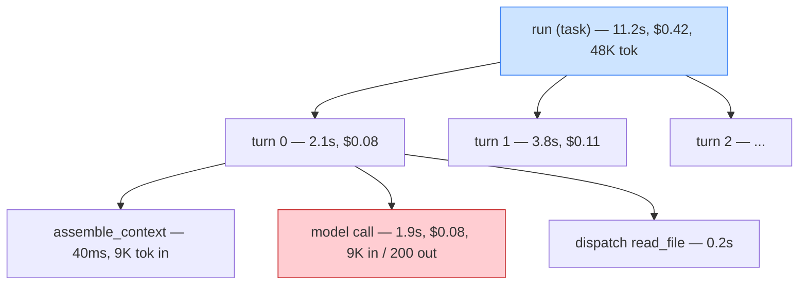

# Day 22 — Observability & Cost

> **Today's one idea:** Instrument first, then optimize — you can't cut cost or latency you can't see, so trace every turn, *then* attack the biggest line item with caching, budgets, and routing.
> **Reading time:** ~40 min (code day) · **Prereqs:** Day 21, Day 12
> **Primary source for today:** Chip Huyen, *AI Engineering*, O'Reilly 2025 (inference cost & optimization chapters).
> **Before you start:** Recall Day 21's load-bearing idea — one sentence, no looking: *why can't you harden what you can't measure, and what does trajectory-level evaluation score?*

## The hook (2–4 min)

Your eval (Day 21) just told you the agent costs $0.42 and takes 11 seconds per task. Your boss says: "Great — now make it 5× cheaper and 3× faster." Where do you cut?

If your answer is "use a smaller model" or "compact more aggressively," you're guessing — and Day 21 just showed you that aggressive compaction can make things *worse*. The truth is you have no idea *where* the $0.42 and 11 seconds go. Is it the 30 turns each making a model call? One giant tool result you re-send every turn? A slow API you retry three times? Redundant context you pay to re-process on every single turn?

You're a doctor asked to cure a patient you haven't examined. Today you build the X-ray: **a trace** that shows exactly where every token, dollar, and millisecond goes. Only then does optimization become surgery instead of superstition. The order is not negotiable: **instrument first, optimize second.**

## Building the intuition (10–15 min)

Recall Day 8, when you added `print(f"turn {turn}: {stop_reason}")` to *see* the loop. That instinct — make the invisible visible — is the whole of observability, done properly. An agent is especially opaque because it's a *multi-step, stochastic, distributed* process: 30 turns, each a model call plus tool calls, each with its own tokens, latency, and cost, any of which can be the bottleneck. Without tracing, a slow or expensive agent is an unopenable black box.

The unit of observability for an agent is the **span** — a timed, labeled record of one operation, nested to mirror the loop's structure:



Read that tree and the optimization targets *announce themselves*: the model call (red) dominates each turn's cost and latency; assembly sends 9K input tokens *every turn* (are they the same 9K re-sent 30 times?); dispatch is cheap. You'd never guess this from the outside; the trace makes it obvious. **The trace turns "the agent is slow" into "turn-level model calls with 9K repeated input tokens are 80% of cost."** That specificity is what makes a fix possible.

Now the cost structure you're optimizing. For an agentic loop, cost has a shape most people miss:

- **Cost per run ≈ Σ over turns of (input tokens + output tokens) × price.** Output is usually priced higher per token, but **input dominates for agents** — because each turn re-sends the accumulated context (Days 10–12), input tokens *grow with turn count*. A 30-turn agent might send its context 30 times.
- This means the two biggest cost levers are **(a) fewer turns** (Day 17 efficiency; a stuck-loop is a cost bug) and **(b) smaller/cheaper re-sent context** (Days 10/12 compaction — which now has a *measurable* cost justification, not just a fit-in-window one).

With the trace in hand, three optimization tools apply — in priority order, biggest lever first:

1. **Prompt/context caching** — providers let you *cache* a stable prefix of your context (system prompt, tool schemas, early history) so you're not billed full price to re-process the identical prefix every turn. For agents that re-send a large stable prefix 30 times, this is often the *single biggest* cost win, and it's nearly free to enable. It directly attacks the "input dominates, and it repeats" problem.
2. **Budgets as cost control** (Day 17, now with teeth) — the token/cost/turn budgets you built aren't just safety; they're the ceiling on spend. Tightening `max_turns` or context budget is a direct cost cut you can *measure* against the eval.
3. **Model routing** — use a cheaper/faster model for easy turns or subtasks (classification, simple tool selection) and reserve the expensive model for hard reasoning. A "route by difficulty" policy can cut cost substantially — *if* the eval confirms the cheaper model doesn't tank success on the routed turns.

## The formal picture (10–15 min)

A minimal tracer: nested spans that record timing, tokens, and cost, emitted as structured records you can aggregate and replay.

```python
import time, contextlib, json

class Tracer:
    def __init__(self): self.spans, self.stack = [], []
    @contextlib.contextmanager
    def span(self, name, **attrs):
        rec = {"name": name, "attrs": attrs, "start": time.time(),
               "parent": self.stack[-1]["id"] if self.stack else None,
               "id": len(self.spans)}
        self.spans.append(rec); self.stack.append(rec)
        try:
            yield rec                      # callee sets rec["attrs"] (tokens, cost, ...)
        finally:
            rec["dur"] = time.time() - rec["start"]; self.stack.pop()
    def dump(self, path):
        with open(path, "w") as f: json.dump(self.spans, f)   # replayable trace

def turn(state, tracer, ...):
    with tracer.span("turn", n=state["turn_no"]):
        with tracer.span("assemble") as s:
            sys, tools, msgs = assemble_context(state, ...)
            s["attrs"]["input_tokens"] = count(msgs, sys, tools)
        with tracer.span("model_call") as s:
            resp = model(sys, tools, msgs)
            s["attrs"].update(in_tok=resp.usage.input_tokens,
                              out_tok=resp.usage.output_tokens,
                              cost=cost_of(resp.usage),
                              cached=resp.usage.cache_read_input_tokens)  # caching visibility
        for call in resp.tool_calls:
            with tracer.span("dispatch", tool=call.name):
                obs = resilient_call(...)                                  # Day 20
```

Aggregating a trace answers "where does it go?":

```python
def cost_breakdown(spans):
    by_name = {}
    for s in spans:
        c = s["attrs"].get("cost", 0)
        by_name[s["name"]] = by_name.get(s["name"], 0) + c
    return dict(sorted(by_name.items(), key=lambda kv: -kv[1]))   # biggest first
# -> {"model_call": 0.39, "dispatch": 0.02, ...}  # now you KNOW: attack model_call
```

Enabling prompt caching (the biggest lever) is a small change to how you structure context:

```python
# Mark the STABLE prefix as cacheable; the volatile tail is re-processed normally.
system = [{"type": "text", "text": SYSTEM_PROMPT,
           "cache_control": {"type": "ephemeral"}}]     # cache system + tools (stable)
# Keep the cached prefix BYTE-STABLE across turns: same system, same tool order.
# Volatile per-turn content (latest turns, retrieved memory) goes AFTER, uncached.
```

Formal points:

- **Instrument before you optimize — always.** Optimizing without a trace is how you spend a day shaving output tokens when 90% of cost was repeated input you could've cached in five minutes. The trace tells you the *one* thing worth fixing. This ordering is the entire lesson; the tools are secondary.
- **Caching rewards *stability*, which shapes your context design.** Caching only helps if the cached prefix is *byte-identical* across turns. This creates a design pressure that harmonizes beautifully with Days 10/12: put **stable content first** (system, tools, pinned constraints — which you already place at the strong *start* for attention reasons!) and **volatile content last** (recent turns, retrieved memory — already at the strong *end*). The attention-optimal layout (Day 9) and the cache-optimal layout are *the same layout*. Reorder your context so the front is stable, and you win attention *and* cost at once. But note the trap: if compaction rewrites early history every turn, you *bust the cache* — so compact the *tail*, keep the *head* stable.
- **Cost, latency, and quality trade off — measure the trade, don't assume it.** Every optimization (cheaper model, more compaction, tighter budget) risks lowering success. This is why Day 21 came *first*: you evaluate every cost change against success/pass^k. "5× cheaper at the same success rate" is a win; "5× cheaper, 20% less reliable" is a decision, not a free lunch. Never ship a cost cut without the eval delta.
- **Observability is also debugging and incident response.** A replayable trace lets you answer "why did run #4471 fail?" by *replaying its exact spans* — the failing tool call, the context it saw, the point it went off. This is the production complement to Day 20: a tripped circuit breaker (Day 20) should *emit a span/alert* so you see the dependency is down, not just silently degrade. Resilience without observability is hidden failure (Day 20's warning, paid off).
- **Latency has its own structure: sequential vs. parallel.** An agent's wall-clock is dominated by *sequential* model calls (turn N waits for turn N-1). Levers: fewer turns (Day 17), streaming (show output as it generates — better perceived latency), a faster model on the critical path, and *parallelizing independent tool calls* within a turn (the model requested 3 reads — run them concurrently, not serially). The trace shows you which turns are the long poles.

## Where it breaks / what it is not (3–5 min)

- **Optimizing without measuring is superstition.** The cardinal sin. "Smaller models are cheaper" is true per-token and irrelevant if your cost is repeated input you should cache. Trace, find the biggest line item, attack *that*.
- **Caching is not free or automatic.** It requires a byte-stable prefix; a single changing token near the front (a timestamp, a reordered tool) invalidates it. And cached tokens are cheaper, not free — plus caches expire. Verify the trace shows `cache_read` tokens actually rising before claiming the win.
- **A cheaper model can cost *more*.** If routing to a weak model makes the agent take 2× the turns (more failures, more retries, Day 20), total cost *rises* despite the lower per-token price. Turn count often dominates per-token price. Always check the eval's `avg_turns`, not just per-token cost.
- **Traces contain sensitive data.** Prompts, tool results, and user data flow through spans. Treat trace storage with the same care as the data itself — redact secrets, mind retention. Observability is a data-governance surface, not just an engineering convenience.
- **Don't over-instrument.** Tracing has overhead (time, storage, its own token-counting cost — recall Day 11's O(n²) counting trap). Trace at the span granularity that answers real questions (turn, model call, tool); don't log every variable. Signal, not noise — the same discipline as context assembly.

## Try it yourself (5–10 min)

**1. Retrieval first.** Close the page. State the non-negotiable ordering rule of this page and why. Then name the three cost levers in priority order and, for an *agent* specifically, explain why input tokens usually dominate cost. Reopen after writing.

<details><summary>Hint</summary>Rule: instrument (trace) first, optimize second — because you can't cut what you can't see, and the biggest lever is rarely the obvious one. Levers: (1) prompt/context caching of the stable prefix, (2) budgets/fewer turns, (3) model routing. Input dominates because each turn re-sends the growing accumulated context, so a 30-turn agent sends its context ~30 times.</details>

<details><summary>Worked answer</summary>The non-negotiable rule: **instrument first, optimize second** — build a trace that shows exactly where tokens/cost/latency go *before* changing anything, because optimizing blind wastes effort on the wrong target (e.g. shaving output tokens when repeated input was 90% of cost). Three cost levers, biggest first: **(1) prompt/context caching** — cache the stable prefix (system + tools + pinned) so you don't pay full price to re-process it every turn; often the single largest win and nearly free. **(2) budgets / fewer turns** — the Day 17 ceilings are direct, measurable spend caps, and a stuck loop is a cost bug. **(3) model routing** — cheap model for easy turns, expensive for hard reasoning, *validated by eval*. Input tokens dominate agent cost because each turn re-sends the accumulated context (Days 10–12), so input grows with turn count — a 30-turn agent sends its context roughly 30 times, making "smaller re-sent context" and "fewer turns" the two biggest levers.</details>

**2. Direct application — trace, then cut.** Add a `Tracer` to your agent and run it on your Day 21 eval tasks. Produce a `cost_breakdown` and a per-turn input-token plot. Identify your single biggest line item. Then apply the *one* matching fix (almost certainly: enable prompt caching on the stable system+tools prefix, and reorder context so the front is byte-stable). Re-run the eval. Report the cost delta *and* the success delta.

<details><summary>Hint</summary>Confirm caching worked by checking `cache_read_input_tokens` rises across turns in the trace. Then compare `avg_cost` and `success_rate` before/after — you need *both* numbers, per Day 21. If success dropped, you broke something (likely cache instability forcing a reorder that hurt attention — check placement).</details>

<details><summary>Worked solution (the payoff)</summary>

```
# trace breakdown (before): model_call=$0.39 (93%), dispatch=$0.02, other≈0
#   per-turn input tokens: ~9K, and ~7K of it identical every turn (system+tools+pinned)
# fix: mark system+tools+pinned as cached; keep that prefix byte-stable; compact only the tail
# eval delta:
#   avg_cost: $0.42 -> $0.14   (cache_read covers the stable 7K each turn)   3.0x cheaper
#   success_rate: 0.73 -> 0.73  (unchanged — pure cost win, no quality trade)
#   p95_latency: 11.2s -> 8.4s  (cached prefix processes faster too)
```

This is the day's thesis proven: you did *not* guess "use a smaller model" (which might have cut success); you *traced*, found 93% of cost was repeated input, cached it, and got 3× cheaper at *identical* success. Surgery, not superstition. And the fix aligned with Day 9/12 (stable head, compact the tail), so it cost nothing in quality. Contrast with the Day 21 stretch where blind compaction *lost* success — same goal (leaner/cheaper), opposite outcome, because one was measured and targeted and the other was a guess.</details>

**3. Stretch (callback to Day 12 + Day 10).** Enabling caching requires a byte-stable prefix, but your compaction (Day 12) rewrites history to save tokens. These two optimizations *conflict*. Design a context layout that gets *both* the caching win and the compaction win, and state the one rule that resolves the conflict. (Synthesizing the whole context arc.)

<details><summary>Worked answer</summary>The conflict: caching wants the front of context *frozen* (byte-identical every turn) to score cache hits; compaction wants to *rewrite* history to shed tokens. If compaction touches the cached prefix, every turn busts the cache and you lose the biggest cost lever. Resolution rule: **compact the tail, freeze the head.** Layout: **[stable head — cached]** = system prompt + tool schemas + pinned constraints + a *frozen* early-context checkpoint that changes rarely; **[volatile tail — uncached]** = the running summary (which compaction updates), recent turns, and retrieved memory. Compaction operates *only* on the volatile tail; the cached head is append-mostly and byte-stable. When you *must* update the summary, it lives in the uncached tail, so rewriting it costs full price on those tokens but doesn't invalidate the (much larger) cached head. This layout simultaneously satisfies **three** constraints from three days: attention (Day 9 — stable, important content at the strong *start*), caching (today — stable prefix), and compaction (Day 12 — shrink the *old middle/tail*, not the head). The single rule "stable content forward and frozen, volatile content back and compactable" is the unifying principle of the entire context arc — the same layout wins attention, cost, *and* fit at once. That convergence is not a coincidence: all three pressures reward putting your durable, high-value tokens where they're cheap to keep and easy to attend to, and letting the churny, low-value tokens be the thing that scrolls and compresses.</details>

> **Transfer — apply it:** For an agent in your domain, name its likely single biggest cost or latency line item *before* you've traced it — then name the one span you'd add to confirm or refute your guess. One sentence on what you'd do if the trace contradicts your guess (it often will — that's the point of tracing).

## Connect it back

Day 21 gave you the numbers; today gave you the *microscope and the scalpel* — a span-level trace that localizes cost and latency, and the three levers (caching, budgets, routing) applied biggest-first and validated against the eval, so optimization is surgery not superstition ([the metrics Day 21 produced, now explained and cut](day-21-the-evaluation-harness.md); the caching layout unifying [Day 10 assembly](../../03-context-engineering/days/day-10-context-assembly.md) and [Day 12 compaction](../../03-context-engineering/days/day-12-compaction-lost-in-the-middle.md)). You can now build, harden, measure, and optimize a *single* agent loop. Tomorrow asks the last architectural question: when should it be *several* loops? **Multi-agent orchestration.** The question you can now answer: *your agent costs $0.42/run — why is "switch to a cheaper model" the wrong first move, and how do you find the right one?*

## Suggested readings for today

**Required if you have 15 extra minutes:** Chip Huyen, *AI Engineering*, O'Reilly 2025 — the inference-cost and optimization sections. The book-length treatment of caching, batching, routing, and the cost/latency/quality triangle you just traced.

**If you want the deep version:**
- Anthropic, "Effective Context Engineering," 2025 — [link](https://www.anthropic.com/engineering/effective-context-engineering-for-ai-agents) — revisit for how context editing and caching interact (today's stretch, from production).
- Anthropic, "Effective Harnesses for Long-Running Agents," 2025 — [link](https://www.anthropic.com/engineering/effective-harnesses-for-long-running-agents) — observability and checkpointing over long runs.

---

## Navigation

← **Previous:** [Day 21 — The Evaluation Harness](day-21-the-evaluation-harness.md)  
→ **Next:** [Day 23 — Context Graphs](../../06-graph-engineering/days/day-23-context-graphs.md)
