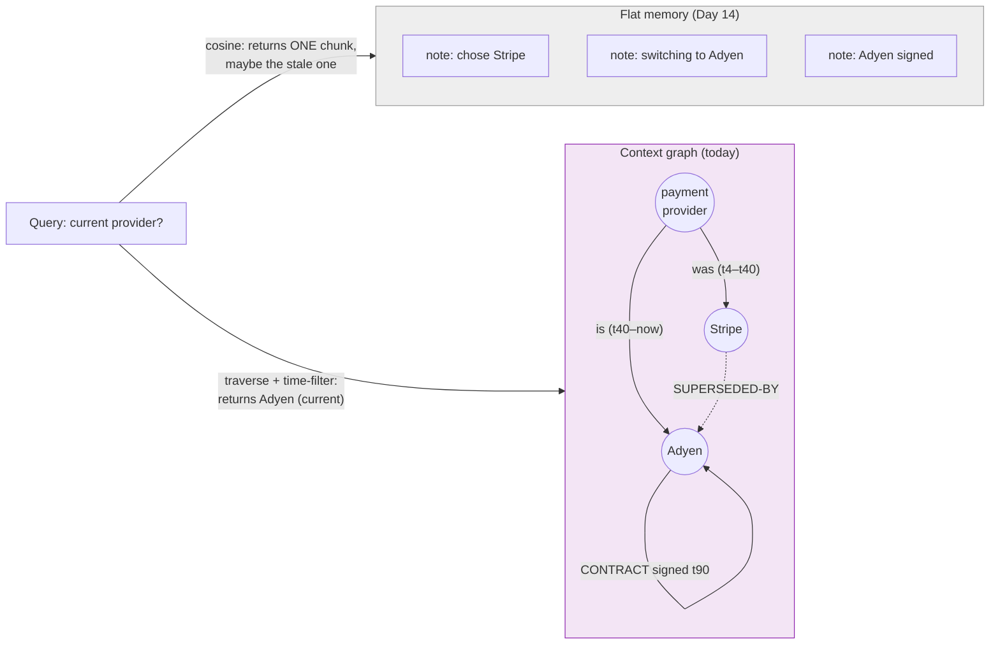

# Day 23 — Context Graphs (Graph-Structured Memory)

> **Today's one idea:** When memory is stored as a *graph* of entities and relations — not a flat pile of text chunks — retrieval can *traverse* connections and respect *time*, so the agent recalls the right facts even when no single chunk contains them.
> **Reading time:** ~40 min (code day) · **Prereqs:** Day 14, Day 15
> **Primary source for today:** Rasmussen et al., "Zep: A Temporal Knowledge Graph Architecture for Agent Memory," 2025, arXiv:2501.13956.
> **Before you start:** Recall Day 22's load-bearing idea — one sentence, no looking: *what does "instrument first, then optimize" mean, and name one thing you measure before cutting cost?*

## The hook (2–4 min)

Your Day 14 memory stores notes and recalls the top-k by semantic similarity. Now the user asks: *"What did we decide about the payment provider, and is that decision still current?"*

Your vector store fails in two ways at once. First, the answer isn't in any *single* note — it's spread across "we chose Stripe" (turn 4), "Stripe doesn't support X, switching to Adyen" (turn 40), and "Adyen contract signed" (turn 90). Cosine similarity retrieves one chunk; the *answer* is a chain. Second, it has no sense of *time* — it might surface the stale "we chose Stripe" note with high similarity and confidently tell the user the wrong, superseded decision.

Flat memory stores *facts as isolated points.* But knowledge isn't isolated points — it's a web of related, evolving facts. Today you store memory the way it actually is: as a **graph**.

## Building the intuition (10–15 min)

Recall Day 14's long-term memory: a store the harness writes distilled facts to and recalls from by relevance. We used two backends — key-value (exact) and vector (fuzzy). Both share a blind spot: they treat each stored item as *standalone*. Vector search asks "which notes look like my query?" It never asks "which notes are *connected to* the notes that look like my query?"

A **context graph** (a knowledge graph used as agent memory) fixes this by storing three things instead of one:

- **Nodes** = entities the agent has encountered (people, files, decisions, services, tasks).
- **Edges** = relations between them (`user PREFERS Postgres`, `decision-42 SUPERSEDES decision-17`, `bug-3 CAUSED-BY function-tokenize`).
- **Time** = when each fact became true and (crucially) when it stopped being true.

Now retrieval changes character. Instead of "fetch the k most similar chunks," you can:

1. **Find** an entry node by similarity or exact match ("payment provider").
2. **Traverse** its edges to gather connected facts (the whole decision chain: Stripe → Adyen → signed).
3. **Filter by time** to keep only what's *currently* valid (drop the superseded "Stripe" fact, or label it as past).

The payoff maps exactly onto the two failures from the hook. Traversal solves *multi-hop* recall — answers that live in the *relationships* between facts, not in any one fact. Temporal edges solve *staleness* — the graph knows which facts have been invalidated, so it recalls the *current* truth instead of a high-similarity ghost. This is precisely Zep's thesis: agent memory as a *temporal* knowledge graph, where every fact carries validity intervals and provenance.



The mental upgrade to Day 14's pager: **the harness now pages in a *connected, time-filtered subgraph*, not a bag of chunks.** `assemble_context` retrieves a small neighborhood of the graph relevant to the current step — which is denser in signal per token (Day 9!) because traversal follows real relationships instead of guessing by surface similarity.

## The formal picture (10–15 min)

A context graph is a set of timestamped triples:

```math
\text{fact} = (\text{subject},\ \text{relation},\ \text{object},\ t_{\text{valid-from}},\ t_{\text{valid-to}},\ \text{provenance})
```

`t_valid_to = ∞` means "still true." Invalidation *closes the interval* rather than deleting the fact — so the graph remembers history (bitemporal memory: when a fact was true in the world, and when the system learned it).

A minimal context-graph memory that slots into Day 14's `Memory` interface:

```python
from dataclasses import dataclass, field
import time as _t

@dataclass
class Edge:
    subj: str; rel: str; obj: str
    valid_from: float = field(default_factory=_t.time)
    valid_to: float | None = None            # None = still valid
    source_turn: int = 0                     # provenance

class ContextGraph:
    def __init__(self, embed_fn):
        self.edges: list[Edge] = []
        self.embed = embed_fn
        self.node_emb: dict[str, list] = {}

    # --- WRITE: add a fact; invalidate the ones it supersedes ---
    def add_fact(self, subj, rel, obj, turn, invalidates: list[Edge] | None = None):
        for e in (invalidates or []):
            e.valid_to = _t.time()           # close the interval, don't delete (temporal!)
        self.edges.append(Edge(subj, rel, obj, source_turn=turn))
        for n in (subj, obj):
            self.node_emb.setdefault(n, self.embed(n))

    # --- READ: seed by similarity, then TRAVERSE, then TIME-FILTER ---
    def recall(self, query: str, hops: int = 2, at_time: float | None = None) -> list[str]:
        import numpy as np
        now = at_time or _t.time()
        q = self.embed(query)
        seeds = sorted(self.node_emb, key=lambda n: -float(np.dot(q, self.node_emb[n])))[:3]
        frontier, seen, facts = set(seeds), set(), []
        for _ in range(hops):                # multi-hop traversal
            nxt = set()
            for e in self.edges:
                if e.valid_to and e.valid_to < now:   # TIME-FILTER: skip superseded facts
                    continue
                if e.subj in frontier and e.obj not in seen:
                    facts.append(f"{e.subj} --{e.rel}--> {e.obj}")
                    nxt.add(e.obj); seen.add(e.obj)
            frontier = nxt
        return facts
```

Formal points that connect back to the whole course:

- **This is Day 14's pager with a smarter index.** Same two operations (write/recall), same tier boundary (graph lives in long-term memory, subgraph pages into working memory). What changed is the *structure* of what's stored and *how* recall selects — traversal + time instead of flat top-k. Everything you learned about paging (Day 14), compaction (Day 12), and placement (Day 9) still applies to the retrieved subgraph.
- **Extraction is now graph-shaped, and it's the hard part.** Day 12's "extract the signal" becomes "extract *triples*": an LLM reads a turn and emits `(subject, relation, object)` facts plus what they invalidate. This is an extra model call (like summarization) and its quality bounds everything — bad extraction builds a wrong graph. GraphRAG (Edge et al.) does exactly this at index time: derive an entity graph from a corpus, then summarize graph *communities*. Steal its pattern; respect its cost.
- **Temporal invalidation is the feature flat memory can't fake.** When a new fact contradicts an old one, you *close the old edge's interval* rather than deleting it. Recall defaults to "valid now," but you can query "as of turn 40" for free — the graph is an audit log and a current-state view at once. This is Zep's core contribution and the direct fix for the Day 12 "memory poisoning" drill: a disproven fact isn't a landmine, it's an expired edge.
- **Multi-hop retrieval is denser signal per token (Day 9).** Because edges encode *real* relationships, a 2-hop neighborhood around the query returns tightly connected facts — higher signal density than k semantically-similar-but-unrelated chunks. You spend fewer tokens to give the model more usable context. The context graph is, in Day 10's terms, a *better selection function*.

## Where it breaks / what it is not (3–5 min)

- **A context graph is not free, and often not worth it.** Building and maintaining it costs extra LLM calls (triple extraction), storage, and complexity. For a short task or simple recall, Day 14's vector store is the right tool. Reach for a graph when memory is *long-lived, relational, and evolving* — long-running assistants, multi-session agents, knowledge that supersedes itself. Don't graph a to-do list.
- **Bad extraction poisons everything.** If the LLM mis-extracts a triple (`user PREFERS MySQL` when they said the opposite), the graph confidently serves the wrong fact via clean traversal — worse than a fuzzy vector miss, because it *looks* authoritative. Graph quality is extraction quality; evaluate it (Day 21).
- **It's not a replacement for exact or vector memory — it's a third backend.** Exact facts still want key-value; "find me something like X" still wants vectors; *relational, temporal* knowledge wants the graph. Production memory often runs all three (Zep layers them). Graph is a tool, not a religion.
- **Traversal can explode.** A dense graph with a high hop count returns a huge subgraph that blows your budget and re-creates Lost-in-the-Middle inside the retrieved set. Bound hops and neighborhood size the way you bound `k` (Day 14 stretch).

## Try it yourself (5–10 min)

**1. Retrieval first.** Close the page. Write the three things a context graph stores that flat memory doesn't capture, and the two retrieval failures (from the hook) that graph memory fixes. Reopen after writing.

<details><summary>Hint</summary>Stores: nodes (entities), edges (relations), time (validity intervals). Fixes: multi-hop recall (answer lives in connections, not one chunk) and staleness (temporal edges recall the *current* truth, not a high-similarity stale fact).</details>

<details><summary>Worked answer</summary>A context graph stores **nodes** (entities), **edges** (typed relations between entities), and **time** (each fact's valid-from / valid-to interval + provenance) — flat memory stores only isolated text points with none of this structure. It fixes two failures: **(1) multi-hop recall** — when the answer lives in the *chain of relationships* between facts (Stripe → switched → Adyen → signed) rather than in any single chunk, traversal assembles it while cosine similarity returns just one point; **(2) staleness** — temporal edges mark superseded facts as expired, so recall returns the *currently valid* truth instead of a high-similarity but out-of-date note. Structurally it's still Day 14's pager (write/recall, graph in long-term memory, subgraph paged into context) with a traversal-plus-time index instead of flat top-k.</details>

**2. Direct application — build a temporal context graph and beat your vector store.** Implement the `ContextGraph` above. Feed it the payment-provider saga (choose Stripe @ turn 4; switch to Adyen @ turn 40, invalidating the Stripe fact; sign Adyen @ turn 90). Then query "current payment provider" and confirm it returns **Adyen** and *not* Stripe. Also query "as of turn 20" and confirm it returns **Stripe** (the graph is a time machine). Compare against your Day 14 vector store on the same data.

<details><summary>Hint</summary>Call `add_fact("payment_provider","is","Stripe",turn=4)`, then `add_fact("payment_provider","is","Adyen",turn=40, invalidates=[the Stripe edge])`. For "as of turn 20," pass `at_time` set between the Stripe and Adyen timestamps. The vector store, lacking time, will happily return the stale Stripe note.</details>

<details><summary>Worked solution (what to observe)</summary>

```python
g = ContextGraph(embed_fn=my_embedder)
e_stripe = Edge("payment_provider", "is", "Stripe", source_turn=4); g.edges.append(e_stripe)
g.node_emb["payment_provider"] = g.embed("payment_provider"); g.node_emb["Stripe"] = g.embed("Stripe")
g.add_fact("payment_provider", "is", "Adyen", turn=40, invalidates=[e_stripe])   # closes Stripe interval
g.add_fact("Adyen", "contract", "signed", turn=90)

print(g.recall("payment provider"))               # -> ['payment_provider --is--> Adyen', 'Adyen --contract--> signed']
print(g.recall("payment provider", at_time=e_stripe.valid_from + 1))  # as-of turn ~5 -> includes Stripe
```

The wins over Day 14: (1) the *current* query never surfaces Stripe — its edge interval is closed, so the time-filter drops it (the staleness fix). (2) the current query *also* returns the connected "contract signed" fact via traversal, even though "contract signed" has low text-similarity to "payment provider" (the multi-hop fix). (3) the as-of query reconstructs history. A flat vector store gives you none of these — it returns whichever single note is most similar, blind to supersession and connection. You've turned memory from a bag of points into a queryable, time-aware web.</details>

**3. Stretch (callback to Day 12 + Day 21).** Triple extraction is an extra LLM call per turn, and a wrong triple silently poisons traversal. Design (in words) how you'd (a) keep the extraction cost bounded on a long run, and (b) *evaluate* whether your graph is being built correctly — tying both back to earlier days.

<details><summary>Worked answer</summary>**(a) Bounded extraction cost:** don't extract on *every* turn — extract at *checkpoints* (subtask boundaries, or when the running transcript since last extraction exceeds a threshold), the same trigger policy as Day 12 compaction. Better, *combine* the two calls: the compaction summarization pass (Day 12) and triple extraction read the same span, so do them together in one model call that emits both a prose digest and structured triples. This amortizes the graph's cost onto compaction you were already paying for. Also extract triples only from high-signal spans (decisions, tool results that changed state), not chit-chat. **(b) Evaluating graph correctness:** this is a Day 21 eval problem — build a small frozen set of transcripts with *hand-labeled* ground-truth triples, run your extractor, and score precision/recall of extracted facts against the labels (did it get the entities, relations, and — critically — the *invalidations* right?). Add trajectory checks: for a set of queries with known correct current-answers, does `recall` return the valid fact and suppress the superseded one? Track this as a metric over time (Day 22) so a change to the extractor prompt that quietly degrades graph quality shows up as a number, not a mystery. The meta-point: a context graph adds a new *thing that can be wrong* (the extraction), so it inherits the Day 21 discipline — if you can't measure graph quality, you can't trust graph memory.</details>

> **Transfer — apply it:** In your domain, name three entities and two relations an agent would benefit from storing as a graph, and one fact that *changes over time* (so temporal edges matter). One sentence: what multi-hop question could the graph answer that a vector store couldn't?

## Connect it back

Day 14 gave the agent memory; Day 12 taught it to compress; today restructured memory itself from a bag of points into a *temporal graph* — so recall can traverse relationships and respect time, fixing the multi-hop and staleness failures flat stores can't ([the structural upgrade to Day 14's pager](../../03-context-engineering/days/day-14-memory-and-state.md), and the real cure for [Day 12's memory-poisoning drill](../../03-context-engineering/days/day-12-compaction-lost-in-the-middle.md)). Memory is now *structured*. Tomorrow restructures the other half — the *control flow* — from a `while` loop into a graph, completing graph engineering. The question you can now answer: *why does "what's our current payment provider?" break a vector store, and what two properties of a context graph answer it correctly?*

## Suggested readings for today

**Required if you have 15 extra minutes:** Rasmussen et al., "Zep," 2025, arXiv:2501.13956 — [link](https://arxiv.org/abs/2501.13956) — §3 (the temporal knowledge graph architecture). Read for how validity intervals + provenance turn memory into a current-state view *and* an audit log. The open-source engine is **Graphiti** ([github.com/getzep/graphiti](https://github.com/getzep/graphiti)).

**If you want the deep version:**
- Edge et al., "From Local to Global: A Graph RAG Approach," 2024, arXiv:2404.16130 — [link](https://arxiv.org/abs/2404.16130) — §2 (entity graph construction) and the community-summary idea; the index-time graph-building pattern.
- Park et al., "Generative Agents," arXiv:2304.03442 — revisit §4: the memory stream is a proto-graph (observations linked by reflection); today makes those links explicit and typed.

---

## Navigation

← **Previous:** [Day 22 — Observability & Cost](../../05-harness-engineering-reliability-and-operations/days/day-22-observability-and-cost.md)  
→ **Next:** [Day 24 — Control-Flow Graphs](day-24-control-flow-graphs.md)
