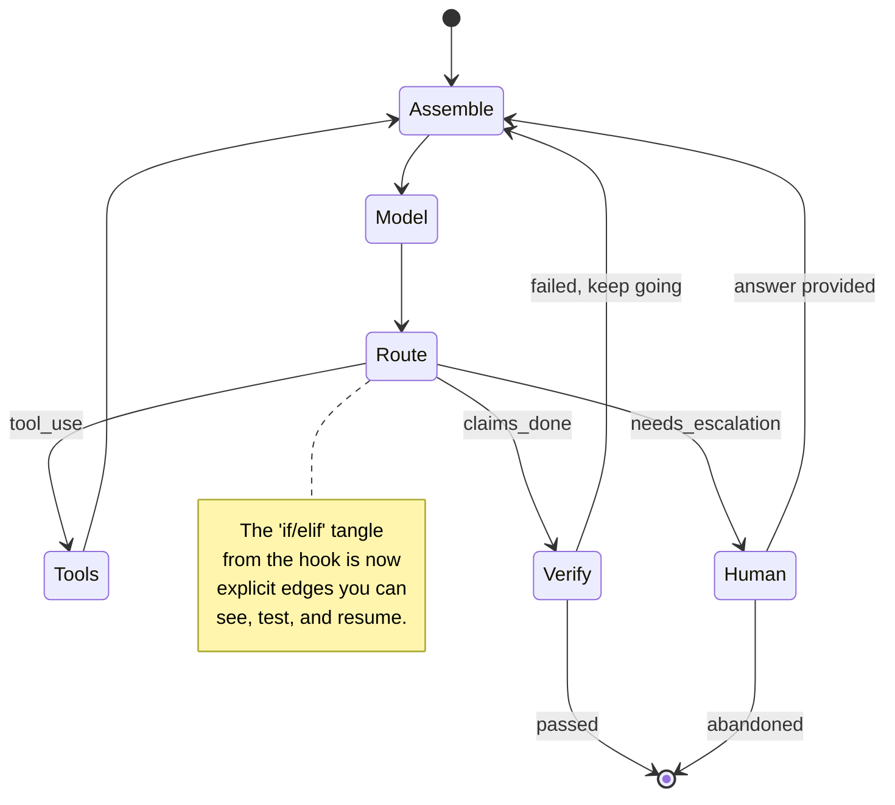

# Day 26 — Control-Flow Graphs

> **Today's one idea:** When a `while` loop's control flow gets complex, you make it a *graph* — nodes are steps, edges are transitions — turning implicit control into an explicit, inspectable, resumable structure.
> **Reading time:** ~40 min (code day) · **Prereqs:** Day 19, Day 10
> **Primary source for today:** Malewicz et al., "Pregel: A System for Large-Scale Graph Processing," SIGMOD 2010; Anthropic, "Building Effective Agents," 2024; DeepLearning.AI, "AI Agents in LangGraph," 2024.
> **Before you start:** Recall Day 25's load-bearing idea — one sentence, no looking: *what three things does a context graph store that flat memory doesn't, and which two retrieval failures does it fix?*

## The hook (2–4 min)

Your loop started as ten clean lines (Day 10). Then production happened. Now it's:

```python
while True:
    if stuck: ...
    if budget_exceeded: break
    resp = model(...)
    if resp.done:
        if verify(): break
        else: ...continue
    for call in resp.tool_calls:
        if call.name == "search": ...
        elif call.name == "escalate_to_human": ...
        elif ...
    if needs_replan: ...
```

The control flow — *what happens after what, and under which condition* — is now smeared across nested `if`s and `break`s. You can't see the shape of it, can't tell someone "what states can this agent be in," can't pause and resume it, can't draw it. The logic is *implicit* in the code's control flow.

Yesterday you made *memory* a graph to tame it. Today you do the same to *control*: pull the transitions out of the tangle and make them an explicit graph. Nodes = steps; edges = "go here next, if this." The loop becomes a diagram you can read, test, and resume — which is exactly what LangGraph and similar frameworks are, underneath.

## Building the intuition (10–15 min)

A `while` loop with branches *is* a state machine — you just can't see it. Every `if/elif` is a hidden transition; every `break`/`continue` is an edge. Control-flow graph engineering means making that state machine **explicit and first-class**:

- A **node** is a unit of work: "call the model," "run a tool," "verify," "compact," "ask a human," "plan." Each node takes the shared state, does its thing, and returns updated state.
- An **edge** is a transition: after node A, go to node B — possibly *conditionally* ("if the model asked for a tool → tool node; if it's done → verify node; if verify fails → back to model node").
- The **state** flows along the edges (this is your Day 20 four-slice state, now passed between nodes).



Three things this buys you that the `while` loop couldn't:

1. **Inspectability.** The control flow *is* a diagram. You can look at it, hand it to a teammate, and reason about every path — including the ones you'd otherwise discover in production. "What states can this agent be in?" has a visual answer.
2. **Resumability & durability.** Because state is explicit and flows between discrete nodes, you can *checkpoint* after each node and *resume* from there — survive a crash, pause for human input mid-run, run for hours (this is the Day 14/22 long-run and human-in-the-loop story made structural). A `while` loop's position is ephemeral; a graph's position is a saved node + state.
3. **Composability.** Nodes and subgraphs compose. A "research" subgraph becomes one node in a bigger graph. Multi-agent orchestration (Day 21) is naturally a graph where some nodes are *other agents*. The graph is the substrate that unifies loop, control, and orchestration.

The lineage here is old and worth knowing: **Pregel** (Google, 2010) formalized graph computation as nodes that hold state and pass messages along edges in synchronized rounds ("supersteps"). LangGraph borrows this "think like a graph" model directly — an agent is a computation over a graph of stateful nodes. You're not learning a framework fad; you're learning a decades-old computational model applied to agents. The `while` loop was always a degenerate graph (one node, one self-edge); today you generalize it.

## The formal picture (10–15 min)

A control-flow graph for an agent is `(nodes, edges, state)` where nodes transform state and edges (some conditional) route between them. A minimal hand-rolled engine — no framework, so you see the machinery:

```python
from dataclasses import dataclass, field
from typing import Callable

State = dict  # your Day 20 four-slice state (transcript, memory, control, this-turn)

@dataclass
class Graph:
    nodes: dict[str, Callable[[State], State]] = field(default_factory=dict)
    edges: dict[str, Callable[[State], str]] = field(default_factory=dict)  # node -> router
    entry: str = "assemble"

    def add_node(self, name, fn): self.nodes[name] = fn
    def add_edge(self, frm, router): self.edges[frm] = router  # router(state) -> next node or "END"

    def run(self, state: State, checkpoint: Callable[[str, State], None] | None = None) -> State:
        node = self.entry
        while node != "END":
            state = self.nodes[node](state)        # do the work
            if checkpoint: checkpoint(node, state)  # DURABILITY: save after each node
            node = self.edges[node](state)          # ROUTE: explicit, inspectable transition
        return state

# --- define the agent as a graph ---
g = Graph()
g.add_node("assemble", lambda s: {**s, "messages": assemble_context(s)})
g.add_node("model",    lambda s: {**s, "resp": call_model(s)})
g.add_node("tools",    run_tools_node)
g.add_node("verify",   verify_node)

g.add_edge("assemble", lambda s: "model")
g.add_edge("model",    lambda s: "verify" if s["resp"].claims_done else
                                 "tools"  if s["resp"].tool_calls else "END")
g.add_edge("tools",    lambda s: "assemble")
g.add_edge("verify",   lambda s: "END" if s["verified"] else "assemble")

final = g.run(initial_state, checkpoint=save_to_db)   # resumable if it crashes
```

Formal points:

- **The router is where control becomes data.** In the `while` loop, "what's next" was buried in `if/elif`. Here each edge is a small pure function `state → next_node` — testable in isolation, inspectable, and *the* place control logic lives. Your Day 19 stopping logic and Day 14 stuck-detection become edge conditions rather than scattered breaks.
- **Checkpointing after each node is the superpower.** Persist `(node, state)` after every step and the agent is *durable*: crash and resume, pause for a human at a `Human` node and resume when they reply, run across hours or restarts. This is why long-running and human-in-the-loop agents (Anthropic's "effective harnesses" theme) are almost always graphs, not raw loops.
- **A `while` loop is a graph with one node.** You didn't waste Days 9–22 — everything you built (assembly, tools, control, memory) becomes *nodes*. The graph is a *reorganization* of the same logic into an explicit, durable, composable form, not a replacement. Reach for it when control complexity or durability demands it, not before.
- **This is what LangGraph is.** Nodes, conditional edges, a shared state object, checkpointing — you just built the core in 25 lines. Now you can use LangGraph (or not) with open eyes, knowing it's Pregel-style graph computation with agent conveniences, and debug it when it misbehaves.

Where it sits: this is the *control* counterpart to yesterday's *context* graph. Day 25 made memory a graph (nodes = facts, edges = relations); Day 26 makes control a graph (nodes = steps, edges = transitions). Graph engineering is the same idea — *make the implicit structure explicit and traversable* — applied to the two halves of an agent: what it knows and what it does.

## Where it breaks / what it is not (3–5 min)

- **Most agents don't need a control-flow graph.** A simple loop with clean control (Day 19) is easier to write, read, and debug than a graph. Reach for a graph when: control flow has many conditional branches, you need durability/resume, you need human-in-the-loop pauses, or you're composing sub-agents. Otherwise a graph is ceremony. (Anthropic's "Building Effective Agents" makes exactly this point: prefer the simplest structure that works.)
- **A graph doesn't make a bad agent good.** Explicit control flow makes complexity *manageable and visible*; it doesn't add intelligence. A well-drawn graph of a bad policy is still a bad policy — now legible.
- **Graphs can hide their own complexity.** A graph with 30 nodes and conditional edges everywhere is as tangled as the `while` loop it replaced — just in a different notation. The win is *appropriate* structure, not maximal structure. Keep node count honest.
- **Not every framework's abstraction fits your problem.** LangGraph's model is great for stateful, branching, durable flows; it's overkill for a three-step pipeline. Match the tool to the control complexity you actually have — the point of building it yourself today is to judge that.

## Try it yourself (5–10 min)

**1. Retrieval first.** Close the page. Define node, edge, and state in a control-flow graph, and give the three things making control a graph buys you over a `while` loop. Explain "a while loop is a graph with one node." Reopen after writing.

<details><summary>Hint</summary>Node = a unit of work that transforms shared state; edge = a (possibly conditional) transition to the next node; state = the data flowing along edges. Buys: inspectability, resumability/durability (checkpoint per node), composability (subgraphs, sub-agents as nodes). A while loop is a single node with a self-edge — control is implicit in its `if/break`s.</details>

<details><summary>Worked answer</summary>In a control-flow graph, a **node** is a discrete unit of work that takes the shared state, does something (call model, run tools, verify, ask a human), and returns updated state; an **edge** is a transition from one node to the next, often *conditional* (a router function `state → next node`); the **state** is the data (your Day 20 four-slice state) that flows along the edges. Making control a graph buys three things a `while` loop can't: **inspectability** (the control flow is an explicit diagram you can read and reason about, including all branches), **resumability/durability** (checkpoint `(node, state)` after each node → crash-resume, pause for human input, run for hours), and **composability** (nodes and subgraphs compose; sub-agents become nodes). "A while loop is a graph with one node" because a plain loop is a single work-node with a self-edge — its branching control is *implicit* in nested `if/break/continue` rather than explicit edges; the graph just makes that latent state machine first-class.</details>

**2. Direct application — refactor your loop into a graph.** Take your Day 19 controlled loop and re-express it as an explicit graph using the ~25-line engine above (or LangGraph if you prefer): nodes for assemble/model/tools/verify, conditional edges for the routing, and a `checkpoint` that saves `(node, state)` each step. Then *use the durability*: kill the process mid-run and resume from the last checkpoint. Confirm it continues correctly.

<details><summary>Hint</summary>The resume test is the payoff — serialize state to a JSON file in `checkpoint`, and on restart load the last `(node, state)` and set `g.entry` to that node. If it continues the task seamlessly, you've built something a raw `while` loop fundamentally can't do. Add a `human` node that pauses (returns a sentinel) to feel human-in-the-loop.</details>

<details><summary>Worked solution (what to observe)</summary>

```python
def save_to_db(node, state):
    json.dump({"node": node, "state": serializable(state)}, open("ckpt.json", "w"))

# run, kill the process after ~3 nodes, then:
ck = json.load(open("ckpt.json"))
g.entry = g.edges[ck["node"]](ck["state"])   # resume from the NEXT node
final = g.run(ck["state"], checkpoint=save_to_db)
```

Observe: the agent picks up exactly where it died — no re-doing completed tool calls, no lost context — because its position was a *saved node + state*, not an ephemeral program counter. Then add a `human` node whose router returns `"END"` with a `"paused_for_human"` flag; the run halts, you (a human) append an answer to state, and resuming routes back to `assemble`. You've built durable, pausable, inspectable control — the three things Day 10's `while` loop couldn't give you, and the reason production long-running agents are graphs. Notice you also just built, in miniature, what LangGraph sells.</details>

**3. Stretch (callback to Day 21 + Day 25).** Multi-agent orchestration (Day 21) and context graphs (Day 25) are both "graphs." Explain how a control-flow graph *unifies* them: what would a node be in a multi-agent graph, and how might a node read/write the context graph? Then name the risk of expressing everything as one giant graph.

<details><summary>Worked answer</summary>A control-flow graph unifies both because it's the *substrate* the others plug into. **Multi-agent (Day 21):** in a control-flow graph, a *node can be another agent* — an "orchestrator" graph has worker-agent nodes, and edges route subtasks to them and gather results; the delegation topology from Day 21 (orchestrator-workers) is literally a graph whose nodes are sub-agent runs. **Context graph (Day 25):** nodes read and write the *context* graph as part of the shared state — e.g. a "recall" node traverses the temporal knowledge graph to fetch relevant facts into the this-turn context, and a "remember" node writes new facts/edges after a tool result. So control-flow graph = how the agent *moves*; context graph = what the agent *knows*; and nodes in the former operate on the latter. **The risk of one giant graph:** it re-creates the very tangle graphs were meant to fix — a 40-node mega-graph with conditional edges everywhere is as unreadable as nested `if`s, just in graph notation, and couples concerns that should be separate (control, memory, orchestration each want their own clean structure). The discipline is *appropriate decomposition* — small composable subgraphs with clear interfaces (Day 20's separation-of-concerns applied to control) — not maximal graphification. Structure should match the complexity you actually have.</details>

> **Transfer — apply it:** Take an agent or workflow in your work whose control flow has gotten branchy. Sketch it as 4–6 nodes and their edges. One sentence: which transition is currently an invisible `if` you'd make an explicit edge, and would checkpointing/resume actually help you (or is a plain loop fine)?

## Connect it back

Day 25 made *memory* a graph; today made *control* a graph — nodes for steps, edges for transitions, state flowing between, with checkpointing for durability — completing graph engineering as "make the implicit structure explicit and traversable," applied to both what an agent knows and what it does ([the structural upgrade to Day 19's control](../../04-loop-engineering-control-and-orchestration/days/../../04-loop-engineering-control-and-orchestration/days/day-19-loop-control-and-stopping.md) and [Day 10's loop](../../02-loop-engineering-building-the-loop/days/../../02-loop-engineering-building-the-loop/days/day-10-your-first-agentic-loop.md)). Tomorrow you rest and consolidate the entire back half of the course (loop control, reliability, ops, graphs) before the capstone. The question you can now answer: *your agent loop has become a tangle of nested `if`s and you can't pause it — what does turning it into a graph give you that refactoring the `if`s wouldn't?*

## Suggested readings for today

**Required if you have 15 extra minutes:** DeepLearning.AI, "AI Agents in LangGraph," 2024 — [link](https://www.deeplearning.ai/courses/ai-agents-in-langgraph/) — the lesson that builds an agent from scratch and *then* rebuilds it in LangGraph. You just did the "from scratch" part; see the framework version of the same graph.

**If you want the deep version:**
- Malewicz et al., "Pregel: A System for Large-Scale Graph Processing," SIGMOD 2010 — the "think like a graph" / superstep model LangGraph inherits. Read the intro and the vertex-centric model.
- Anthropic, "Building Effective Agents," 2024 — [link](https://www.anthropic.com/engineering/building-effective-agents) — the workflow patterns (chaining, routing, orchestrator-workers) are named control-flow-graph shapes; and the crucial reminder to prefer the simplest structure that works.

---

## Navigation

← **Previous:** [Day 25 — Context Graphs](day-25-context-graphs.md)  
→ **Next:** [Day 27 — Ontology & Shared Meaning](../../07-ontology-engineering/days/day-27-ontology-and-shared-meaning.md)
