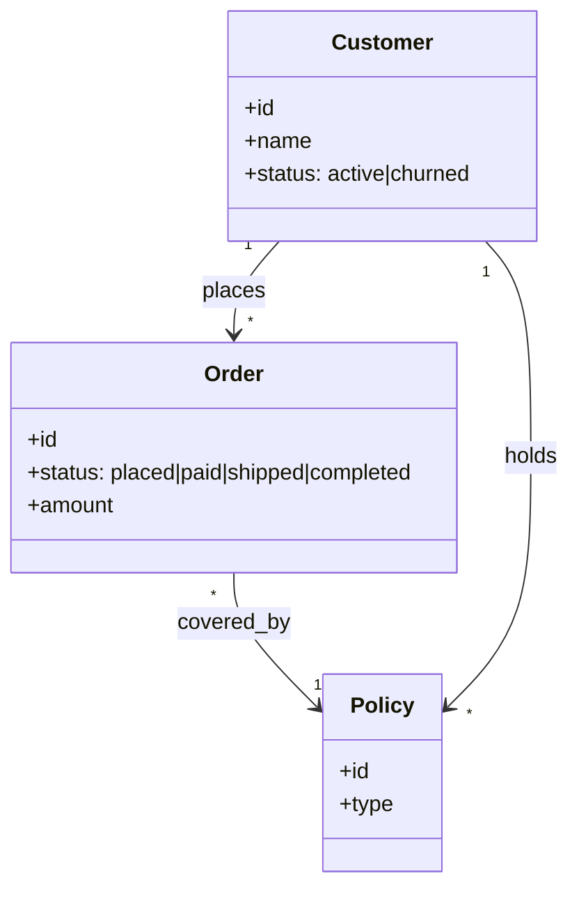

# Day 27 — Ontology & Shared Meaning

> **Today's one idea:** An ontology is the explicit, agreed-upon model of *what things exist in your domain and how they relate* — and giving an AI system that shared vocabulary is what turns fuzzy extraction and reasoning into something consistent and trustworthy.
> **Reading time:** ~40 min · **Prereqs:** Day 25, Day 6
> **Primary source for today:** Noy & McGuinness, "Ontology Development 101: A Guide to Creating Your First Ontology," Stanford KSL Technical Report, 2001; Edge et al., "GraphRAG," 2024, arXiv:2404.16130.
> **Before you start:** Recall Day 25's load-bearing idea — one sentence, no looking: *what three things does a context graph store that flat memory doesn't, and which retrieval failures does it fix?*

## The hook (2–4 min)

Your Day 25 context graph stored facts as `(subject, relation, object)` triples. But who decided that a node is a "Customer" and not a "Client," "Account," or "User"? That `bought` and `purchased` and `ordered` are the *same* relation or *different* ones? That a "completed order" means paid-and-shipped, not just placed?

Nobody did — and that's the bug. Feed the same claims to your extractor twice and you'll get "Customer" one time and "Client" another; two facts about the same person land on two nodes; a query for "completed orders" silently misses half of them. The graph is technically populated and semantically incoherent.

The missing piece is an **ontology**: a fixed, shared answer to "what *counts* as a Customer, an approval, a completed order — and what relationships are legal between them?" It's the schema of *meaning*. This is layer 7 — **Shared Meaning** — taught last because you've now felt its absence, but underpinning everything from prompts to graphs.

## Building the intuition (10–15 min)

An ontology is a **shared, explicit model of a domain**: the *classes of things* that exist, the *relationships* allowed between them, the *attributes* they carry, and the *rules* that constrain them. Think of it as the difference between a pile of sentences and a *schema* those sentences must obey.

You already know a lightweight version of this idea from the Instructions layer: a JSON schema (Day 6) is a micro-ontology of one message — "a Classification *is* a category (one of these four) plus a confidence." An ontology scales that up from one message to your *whole domain*:



Read that as an ontology fragment: three **classes** (Customer, Order, Policy), their **attributes** (with *enumerated* allowed values — status is one of a fixed set), and the **relationships** with **cardinalities** (a Customer *places* many Orders; an Order is *covered_by* exactly one Policy). Now "Customer," "completed order," and "covered" have *one* meaning the whole system shares.

Why this matters for an AI system specifically — three payoffs:

1. **Consistent extraction.** When the LLM extracts triples for your context graph (Day 25), the ontology is its *target vocabulary*: "map what you find to *these* classes and *these* relations." "Client," "buyer," "customer" all resolve to `Customer`; `bought`/`purchased` both map to `places`. The graph stops fragmenting. (GraphRAG does exactly this — it derives an entity graph against a defined entity typing.)
2. **Reliable reasoning & queries.** "How many customers have completed orders?" has a definite answer only if "customer" and "completed" are defined. The ontology makes queries mean the same thing every time — and makes multi-hop graph traversal (Day 25) sound, because the relations it traverses are typed and legal.
3. **Grounding & hallucination control.** An ontology is a *constraint*: the model can't invent a `Customer.creditScore` field or a `Customer --married_to--> Order` relationship if those aren't in the model. Constraining generation and extraction to a defined vocabulary is a real anti-hallucination lever (Day 4's failure mode), and tomorrow's business rules make it enforceable.

The reframe: **the ontology is the shared contract of meaning that every other layer references.** Prompts phrase tasks in its terms; context assembles evidence about its entities; the graph stores its instances; queries ask about its classes. Without it, each layer improvises its own meaning and they quietly disagree — the single most common cause of "the numbers don't match" in AI-over-enterprise-data systems.

## The formal picture (10–15 min)

The classic components of an ontology (Noy & McGuinness's vocabulary):

- **Classes (concepts):** the *kinds* of things — Customer, Order, Claim, Provider. Often hierarchical (a `PremiumCustomer` *is-a* `Customer`).
- **Relations (properties):** how classes connect — `places`, `covered_by`, `holds`. Typed (domain → range) and with **cardinality** (one-to-many, etc.).
- **Attributes (data properties):** the fields a class carries — `Order.amount`, `Customer.status`, often with **enumerated** allowed values.
- **Instances (individuals):** the actual data — *this* customer, *that* order. (Instances live in your context graph, Day 25; the ontology is the schema above them.)
- **Axioms / constraints:** rules that must hold — "an Order must be `covered_by` exactly one Policy," "`completed` requires `paid` AND `shipped`." (Tomorrow, Day 28.)

Noy & McGuinness's method — a genuinely practical recipe:

```
1. Scope it: what questions must the system answer? (Don't model the universe —
   model only what your queries and tasks need. "Competency questions" define the boundary.)
2. Reuse: is there a standard vocabulary for this domain? Borrow before inventing.
3. Enumerate terms: list the nouns (-> classes) and verbs (-> relations) your domain uses.
4. Define the class hierarchy (is-a) and the relations (with domain/range/cardinality).
5. Define attributes and their allowed values (enums where possible).
6. Create instances only to test; validate against your competency questions.
7. Iterate — an ontology is a living contract, versioned like code.
```

Formal points:

- **Start lightweight; formal machinery is optional.** You do *not* need OWL, RDF, or a description-logic reasoner to get 80% of the value. A typed class/relation schema (even as Pydantic models or a JSON Schema per entity) *is* a working ontology for an LLM system. Reach for the heavy semantic-web stack only when you need automated reasoning or interoperability across organizations — for most AI engineering, a clear, enumerated, cardinality-annotated schema is the right altitude. (Over-formalizing is a classic ontology failure: months in OWL for a graph an LLM populates loosely.)
- **Scope by competency questions, not completeness.** The trap is trying to model the whole domain. Instead, list the *questions the system must answer* ("which customers have a completed order and an open claim?") and model exactly enough to answer them. The ontology's boundary is your use case's boundary. This keeps it small and maintainable.
- **The ontology is the extraction contract.** This is the tightest link to the rest of the course: when the model reads unstructured text and emits graph triples (Day 25) or structured output (Day 6), the ontology *is the schema it must conform to*. A good ontology → consistent, mergeable extraction; a vague one → the fragmentation from the hook. So ontology quality directly bounds graph and RAG quality (Day 25's stretch: "graph quality is extraction quality").
- **Shared meaning is organizational, not just technical.** "What counts as a completed order?" is a *business* question with a business answer — and different teams often answer it differently, which is exactly the incoherence an ontology fixes. Building the ontology forces the humans to agree first; the AI system then inherits that agreement. (In FraudOps: what *is* a fraud ring, a related party, a suspicious claim? Pinning those down is half the product.)

Where this sits: layer 7 (Shared Meaning) is the schema layer beneath the graph (layer 6/Information). Day 25 gave you the graph *mechanism*; today gives you the *meaning* it encodes; tomorrow makes that meaning *enforceable* with rules and constraints.

## Where it breaks / what it is not (3–5 min)

- **An ontology is not a database schema (quite).** A DB schema is about storage; an ontology is about *meaning and relationships*, often richer (hierarchies, cardinalities, axioms) and consumed by *reasoning* (human, query, or LLM), not just CRUD. They overlap but aren't the same; don't assume your table layout is your ontology.
- **More formality is not more value.** Full OWL + a reasoner is overkill for most LLM systems and a time sink. The failure mode is a beautiful, unused ontology while the extractor still emits garbage. Match formality to need; lightweight-but-used beats formal-but-ignored.
- **An ontology doesn't populate itself correctly.** It defines the target; the LLM still extracts *against* it, and can still mis-map (call a Provider a Customer). The ontology *reduces* fragmentation and makes errors *detectable* (tomorrow's constraints), but extraction quality must still be evaluated (Day 23).
- **It's not free of judgment.** "What counts as a customer?" has no objective answer — it's a modeling *decision* with trade-offs. The ontology encodes choices; document why. A wrong-but-explicit definition is fixable; an implicit one is a silent bug.

## Try it yourself (5–10 min)

**1. Retrieval first.** Close the page. Define an ontology and its core components (classes, relations, attributes, instances), and give the three payoffs it brings an AI system. State why it's scoped by "competency questions" rather than completeness. Reopen after writing.

<details><summary>Hint</summary>Ontology = shared, explicit model of a domain: classes (kinds of things), relations (typed, with cardinality), attributes (with enums), instances (the data), axioms (rules). Payoffs: consistent extraction (shared target vocabulary), reliable reasoning/queries (defined terms), grounding/hallucination control (constrains to a vocabulary). Scoped by competency questions = model only what your tasks/queries need, not the whole domain.</details>

<details><summary>Worked answer</summary>An **ontology** is a shared, explicit model of a domain: its **classes** (the kinds of things — Customer, Order), **relations** (typed connections with cardinality — a Customer *places* many Orders), **attributes** (fields with allowed/enumerated values — Order.status ∈ {placed,paid,shipped,completed}), **instances** (the actual data, which live in the context graph), and **axioms/constraints** (rules that must hold). Three payoffs for an AI system: **(1) consistent extraction** — it's the target vocabulary the LLM maps text to, so "client/buyer/customer" all resolve to one `Customer` class and the graph stops fragmenting; **(2) reliable reasoning and queries** — "how many customers completed an order" has a definite answer only when the terms are defined, and typed relations make graph traversal sound; **(3) grounding/hallucination control** — it constrains generation/extraction to a defined vocabulary, so the model can't invent fields or illegal relationships. It's scoped by **competency questions** (the specific questions the system must answer) rather than completeness, because modeling the whole domain is an unmaintainable trap — the ontology's boundary should be exactly your use case's boundary.</details>

**2. Direct application — draft an ontology for your domain.** Pick a real domain from your work. Write 3–5 competency questions the system must answer. Then define the minimal ontology that answers them: the classes, the key relations (with cardinality), and the attributes (with enumerated values where possible). Keep it to what the questions need — resist modeling everything. Then sanity-check: can each competency question be answered by traversing your classes/relations?

<details><summary>Hint</summary>Start from the questions, not the classes. "Which providers are linked to more than 3 flagged claims?" tells you that you need `Provider`, `Claim` (with a `flagged` attribute), and a `Provider --involved_in--> Claim` relation. Let the questions pull the schema into existence — anything they don't need, don't model.</details>

<details><summary>Worked solution (FraudOps-flavored)</summary>

Competency questions:
1. Which providers are linked to more than 3 flagged claims in 90 days?
2. Do any claimants share an address, phone, or bank account with another claimant on the same claim?
3. Which claims match a known fraud pattern?

Minimal ontology those questions force into existence:
```
Classes:    Claimant, Claim, Provider, Policy, FraudPattern
Attributes: Claim.status ∈ {open, paid, denied, flagged}; Claim.amount; Claim.date
            Claimant.address, .phone, .bank_account
Relations:  Claimant  --files-->        Claim        (1..*)
            Claim     --serviced_by-->   Provider     (*..1)
            Claim     --under-->         Policy       (*..1)
            Claim     --matches-->       FraudPattern (*..*)
            Claimant  --shares_identifier--> Claimant (*..*)   # the ring signal
```
Check: Q1 = count `serviced_by` edges to flagged Claims per Provider ✓; Q2 = `shares_identifier` traversal ✓; Q3 = `matches` edges ✓. Everything the questions need, nothing they don't — no `Provider.officeSquareFootage`. This schema is now (a) the extraction contract for your Day 25 graph, (b) the vocabulary your prompts use, and (c) the thing tomorrow's business rules constrain. You've built the shared meaning the whole fraud system will agree on.</details>

**3. Stretch (callback to Day 6 + Day 25).** Your ontology says a `Claim` is `serviced_by` exactly one `Provider`. Your LLM extractor, reading a messy document, emits a claim with *two* `serviced_by` edges. Explain where this should be caught (tie it to Day 6's parse boundary and Day 25's graph), and why the ontology alone didn't prevent it — setting up what tomorrow adds.

<details><summary>Worked answer</summary>The ontology *defined* the constraint (cardinality: exactly one `serviced_by`), but defining meaning doesn't *enforce* it — the LLM extractor, being jagged (Day 4), can still emit a structurally-legal-looking but rule-violating pair of edges. It should be caught at the **validation step** — the same **parse boundary** as Day 6, now applied to graph writes: before committing extracted triples to the context graph (Day 25), the harness validates them *against the ontology's constraints* (cardinality, allowed classes, enum values) and rejects/repairs violations (feed the error back: "a Claim may have only one Provider; you emitted two — pick one or flag ambiguity"). The ontology alone didn't prevent it because an ontology is a *specification of meaning*, not an *enforcement mechanism* — exactly like a JSON schema doesn't stop the model from emitting invalid JSON; you still parse-and-validate. What turns the specification into enforcement is **constraints/axioms as executable checks** — which is precisely tomorrow's topic (Day 28: business rules & constraints, SHACL-style validation as the graph's parse boundary). Ontology = the contract; constraints = the guard that enforces it.</details>

> **Transfer — apply it:** For your domain, write the one definition your team currently *disagrees* on (what counts as a "completed order," "active customer," "fraud ring"). One sentence: what breaks in an AI system when that term means different things to different components — and why pinning it down is an ontology decision, not a code decision.

## Connect it back

Day 25 gave you a graph to store facts; Day 26 a graph to structure control; today gave both a *shared meaning* — the ontology that defines what your entities and relations actually are, so extraction is consistent, queries are answerable, and the model can't invent vocabulary. But a definition isn't a guard: the extractor can still violate it. Tomorrow: **business rules & constraints** — turning the ontology's axioms into executable checks that enforce meaning at the graph's boundary. The question you can now answer: *your context graph is full of facts but the numbers don't add up across queries — why is that usually a missing-ontology problem, not a missing-data problem?*

## Suggested readings for today

**Required if you have 15 extra minutes:** Noy & McGuinness, "Ontology Development 101," Stanford, 2001 — the class/relation/instance vocabulary and the 7-step method. The most practical on-ramp to ontology building; skip the Protégé-specific bits, keep the method.

**If you want the deep version:**
- Edge et al., "GraphRAG," 2024, arXiv:2404.16130 — [link](https://arxiv.org/abs/2404.16130) — how a defined entity typing turns a corpus into a coherent graph; ontology-as-extraction-target in practice.
- Rasmussen et al., "Zep," arXiv:2501.13956 — the entity/edge typing behind a production temporal knowledge graph (revisit from Day 25 with the schema lens).

---

## Navigation

← **Previous:** [Day 26 — Control-Flow Graphs](../../06-graph-engineering/days/day-26-control-flow-graphs.md)  
→ **Next:** [Day 28 — Business Rules & Constraints](day-28-business-rules-and-constraints.md)
