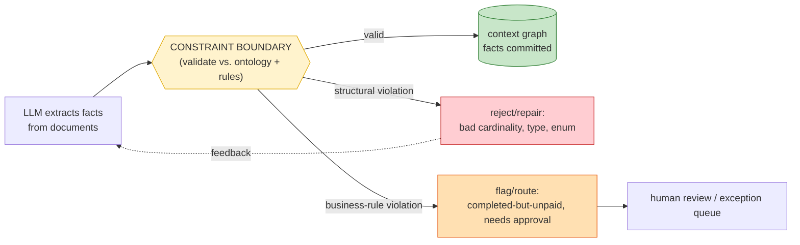

# Day 28 — Business Rules & Constraints

> **Today's one idea:** An ontology *defines* meaning; **constraints** *enforce* it — executable rules at the write boundary that reject or repair anything violating your domain's logic, turning a shared vocabulary into a guarantee.
> **Reading time:** ~40 min (code day) · **Prereqs:** Day 27, Day 6
> **Primary source for today:** W3C SHACL (Shapes Constraint Language) specification; Noy & McGuinness, "Ontology Development 101," Stanford, 2001.
> **Before you start:** Recall Day 27's load-bearing idea — one sentence, no looking: *what is an ontology, and why is it scoped by competency questions rather than completeness?*

## The hook (2–4 min)

Yesterday's ontology says: a `Claim` is `serviced_by` exactly one `Provider`; a `completed` order requires `paid` AND `shipped`; a `Claimant` under 18 can't hold a `Policy`. Clean definitions.

Now your LLM extractor, reading ten thousand messy documents, cheerfully produces: a claim with two providers, an order marked `completed` that was never paid, a policyholder born in 2015. The ontology *said* these are impossible. The data has them anyway. **A definition that nothing enforces is a wish.**

The fix is the same move you've made three times now — at the parse boundary (Day 6), the tool boundary (Day 8), and validation (structured output): **put a guard at the write boundary that checks against the rules and refuses to let violations through.** Today that guard is *domain logic* — business rules and constraints — and it's what makes shared meaning actually hold.

## Building the intuition (10–15 min)

There are two kinds of rules in a domain, and both need enforcing:

- **Structural constraints** (from the ontology): cardinality ("one provider per claim"), types ("`amount` is a positive number"), enums ("`status` ∈ {placed, paid, shipped, completed}"), required fields. These are *shape* rules.
- **Business rules** (domain logic): conditional truths about your world — "`completed` ⟹ `paid` ∧ `shipped`," "a claim over $10k requires a `senior_approval`," "two claimants sharing a bank account on the same claim ⟹ flag for review." These are *meaning* rules.

Both are the same engineering pattern you already know: **validate at the boundary, treat unchecked input as untrusted.** You've applied it to model output (Day 6), tool calls (Day 8), and now you apply it to *knowledge entering your system* — extracted facts, before they become "true" in your graph.



The key intuition: **constraints are where meaning becomes trustworthy.** Without them, your context graph (Day 25) is a pile of *asserted* facts — some true, some hallucinated, some logically impossible — and every query over it inherits that uncertainty. With them, a fact in the graph has *passed* your domain's logic, so downstream reasoning (queries, agent decisions, reports) can rely on it. Constraints convert "the model said so" into "this conforms to our rules."

And notice the two exit paths differ. A *structural* violation (two providers) is usually an **extraction error** → reject and let the model retry (feedback, like Day 6). A *business-rule* violation (completed-but-unpaid) might be a **real anomaly** → not a bug to repair but a signal to *route* (flag, queue for review). Same guard, different responses — and for a fraud system, the business-rule violations *are the product* (the anomalies you're hunting).

## The formal picture (10–15 min)

Constraints as executable checks over extracted facts, before they commit to the graph. The **SHACL** model (W3C's Shapes Constraint Language) is the standard vocabulary for this on graphs — you define "shapes" (constraints) a node must satisfy — but you can hand-roll the same logic:

```python
from dataclasses import dataclass

@dataclass
class Violation:
    kind: str          # "structural" | "business"
    rule: str
    detail: str

def validate_claim(claim: dict, graph) -> list[Violation]:
    v = []
    # --- STRUCTURAL (from the ontology, Day 27) ---
    providers = graph.neighbors(claim["id"], "serviced_by")
    if len(providers) != 1:
        v.append(Violation("structural", "cardinality",
                           f"claim {claim['id']} has {len(providers)} providers, expected 1"))
    if claim["status"] not in {"open", "paid", "denied", "flagged", "completed"}:
        v.append(Violation("structural", "enum", f"bad status {claim['status']!r}"))
    if not (isinstance(claim.get("amount"), (int, float)) and claim["amount"] > 0):
        v.append(Violation("structural", "type", "amount must be a positive number"))
    # --- BUSINESS RULES (domain logic) ---
    if claim["status"] == "completed" and not claim.get("paid"):
        v.append(Violation("business", "completed_requires_paid",
                           f"claim {claim['id']} completed but not paid"))
    if claim["amount"] > 10_000 and not claim.get("senior_approval"):
        v.append(Violation("business", "large_claim_needs_approval",
                           f"claim {claim['id']} > $10k without senior approval"))
    return v

def commit_extracted(claim, graph, model_retry):
    violations = validate_claim(claim, graph)
    structural = [x for x in violations if x.kind == "structural"]
    business   = [x for x in violations if x.kind == "business"]
    if structural:
        return model_retry(claim, structural)      # extraction error -> feed back, retry (Day 6)
    graph.commit(claim)                             # facts pass structural checks -> commit
    for b in business:
        route_to_review(claim, b)                   # anomaly -> flag, don't silently drop
    return "committed" + (" (flagged)" if business else "")
```

Formal points:

- **Constraints are the ontology's teeth.** Day 27 defined the classes, cardinalities, and enums; today those definitions become `if` statements that run. An ontology without executable constraints is documentation; with them, it's a guarantee. This is the same relationship as a type *declaration* vs. a *type checker* — one describes, the other enforces.
- **Validate knowledge at the write boundary, not the read.** Check facts *before* they enter the graph, so every fact in the store is already valid and every query can trust it — rather than re-validating on every read (expensive, and too late — the bad fact already misled something). This is the "shift-left" of data quality, and it mirrors Day 6: guard at the boundary, keep the interior trustworthy.
- **Distinguish "invalid" from "anomalous."** A structural violation means the *extraction* is wrong (repair it). A business-rule violation may mean the *world* is wrong in an interesting way (route it). Conflating them either drops real anomalies as "errors" or commits impossible data as "findings." For detection/compliance systems this distinction *is* the value: the rule violations you *keep* are your alerts.
- **Rules are versioned domain knowledge, and they're where humans stay in the loop.** "A claim over $10k needs senior approval" is a business decision that changes; encode rules as data/config, version them, and make them auditable (especially for regulated domains — you must be able to say *why* a claim was flagged). Constraints are also the natural human-in-the-loop seam: violations route to people, decisions feed back. (Ties to Day 26's control-flow-graph `human` node.)
- **Keep it as light as it needs to be.** Full SHACL + a reasoner buys you declarative, portable, inspectable constraints — worth it for complex or cross-team graphs. For many systems, plain validation functions (above) are enough and easier to test. Match the machinery to the stakes, same as Day 27.

Where this closes the course's arc: this is the last layer, **Shared Meaning**, made *enforceable*. It reuses the boundary-validation pattern from Days 6 and 8 and applies it to *knowledge* — completing the through-line that "untrusted input gets validated at a boundary" from model output → tool calls → extracted facts. Meaning is now not just defined (Day 27) but guaranteed.

## Where it breaks / what it is not (3–5 min)

- **Constraints don't fix extraction — they catch it.** A guard that rejects two-provider claims doesn't make the model extract correctly; it prevents bad data from committing and gives feedback. Extraction quality still needs good prompts, a clear ontology, and evaluation (Day 23). Constraints are the net, not the trapeze.
- **Over-constraining rejects reality.** The real world has exceptions (a genuinely dual-provider claim, a legitimately-completed-then-refunded order). Constraints that are too rigid turn valid edge cases into false rejections. Leave escape hatches (a `flagged_exception` path), and treat repeated "violations" as a signal your model of the domain is incomplete.
- **Rules ≠ code buried in the app.** Business rules scattered through application logic are unauditable and drift from the ontology. Keep them declarative and centralized (config, a rules table, SHACL shapes) so they're inspectable and versioned — non-negotiable in regulated domains where you must justify every decision.
- **Enforcement isn't reasoning.** Constraints check *conformance* to stated rules; they don't *infer* new facts (a description-logic reasoner does that). Most AI systems need the checking, not the inference — don't reach for a full reasoner unless you actually need derived facts.

## Try it yourself (5–10 min)

**1. Retrieval first.** Close the page. Distinguish structural constraints from business rules, state where both are enforced and why there (not at read time), and explain the different responses to a structural vs. a business-rule violation. Reopen after writing.

<details><summary>Hint</summary>Structural = shape rules from the ontology (cardinality, type, enum, required). Business = domain logic (completed⟹paid; >$10k⟹approval). Both enforced at the *write* boundary (before facts enter the graph) so the interior is trustworthy and queries can rely on it. Structural violation → extraction error → reject/repair+feedback; business-rule violation → possible real anomaly → flag/route to review, don't silently drop.</details>

<details><summary>Worked answer</summary>**Structural constraints** are shape rules inherited from the ontology (Day 27): cardinality (one provider per claim), types (amount is a positive number), enums (status ∈ a fixed set), required fields. **Business rules** are domain logic — conditional truths about your world ("completed ⟹ paid ∧ shipped," "claim > $10k ⟹ senior approval," "shared bank account ⟹ flag"). Both are enforced at the **write boundary** — validating extracted facts *before* they commit to the graph — so that every fact in the store has already passed the rules and every downstream query/agent decision can trust it (validating at read time is too late and too expensive; the bad fact would already have misled something). The responses differ: a **structural** violation almost always means the *extraction* is wrong → reject and feed the error back to the model to repair (like Day 6); a **business-rule** violation may mean the *world* is genuinely anomalous → *route* it to human review / an exception queue rather than repairing it, because for detection/compliance systems those anomalies are the actual findings.</details>

**2. Direct application — enforce your Day 27 ontology.** Take the ontology you drafted yesterday. Write a `validate(entity, graph)` function that checks: (a) 2–3 structural constraints (a cardinality, an enum, a type), and (b) 2–3 business rules from your domain. Run it on some hand-crafted valid and invalid entities (including one that's *structurally* fine but *business-rule* violating). Confirm structural violations trigger repair-feedback and business violations route to review. You've built the constraint boundary for your knowledge layer.

<details><summary>Hint</summary>Make one test case that passes structural checks but trips a business rule (e.g. a well-formed claim marked `completed` with `paid=False`) — that's the case that proves you're distinguishing "malformed" from "impossible-but-well-formed," which is the whole point.</details>

<details><summary>Worked solution (what the tests prove)</summary>

```python
# structural violation -> repair path
c1 = {"id":"C1","status":"complete","amount":50}          # "complete" not in enum
assert any(v.kind=="structural" for v in validate_claim(c1, g))   # -> retry extraction

# structurally fine, business-rule violation -> review path
c2 = {"id":"C2","status":"completed","amount":50,"paid":False}    # completed but unpaid
vs = validate_claim(c2, g)
assert all(v.kind!="structural" for v in vs) and any(v.kind=="business" for v in vs)
# -> commits (well-formed) BUT routes to review (anomaly)

# large claim without approval -> business flag
c3 = {"id":"C3","status":"paid","amount":25000,"paid":True}       # >$10k, no approval
assert any(v.rule=="large_claim_needs_approval" for v in validate_claim(c3, g))
```

The proof is `c2`: it's *valid data* (well-formed, correct types/enums) that's *logically impossible* by your rules — exactly the case a JSON schema (Day 6) would pass but your business rules catch. That's the difference between structural and semantic validation, and it's where domain constraints earn their keep. For FraudOps, `c2` and `c3` aren't errors to fix — they're *alerts*, the system's output.</details>

**3. Stretch (callback to Day 25 + Day 26).** Your constraint boundary flags a business-rule violation that needs a human decision. Design (in words) how this integrates with the context graph (Day 25) and a control-flow graph (Day 26): where does the flagged fact live while it awaits review, and how does the agent's control flow handle the pause? Tie together three layers.

<details><summary>Worked answer</summary>Integration across three layers: **(Shared Meaning, today)** the constraint boundary detects the business-rule violation and produces a `Violation` with its rule and detail. **(Information / graph, Day 25)** the flagged fact is committed to the context graph but *marked* — e.g. an edge/attribute `status: pending_review` with provenance and the violated rule attached (so it's queryable and auditable, but not yet treated as confirmed truth; temporal validity from Day 25 lets you record "asserted at T, unconfirmed"). It does **not** silently drop, nor commit as normal. **(Coordination / control, Day 26)** the agent's control-flow graph routes to a **`human` node** — the run checkpoints its state (Day 26's resumability) and pauses; the flagged fact + context goes to a review queue; when a human resolves it (approve/reject/escalate), that decision feeds back as new state and the graph resumes, updating the fact's status in the graph. So: **constraints detect** (layer 7), **the graph stores the pending fact with provenance** (layer 3/6), and **the control-flow graph orchestrates the human-in-the-loop pause/resume** (layer 6). This is the four-plus disciplines composing — meaning, memory, and control interlocking — which is exactly what the capstone asks you to assemble. In a fraud system it's the whole workflow: detect anomaly → hold as pending → route to investigator → resolve → update the knowledge graph.</details>

> **Transfer — apply it:** Write one business rule from your domain as an `if` statement, and classify a violation of it: is it usually a data/extraction error (repair) or a real-world anomaly (route to a human)? One sentence: what should your system *do* the moment the rule trips?

## Connect it back

Day 27 defined shared meaning; today made it *enforceable* — structural constraints and business rules as executable guards at the write boundary, completing the course's through-line that untrusted input (model output → tool calls → now *extracted knowledge*) gets validated before it's trusted. The Shared Meaning layer is complete: your system's vocabulary is defined *and* guaranteed, and its violations are either repaired or surfaced as the signal they are. Tomorrow you rest and consolidate the back half; then the capstone composes all seven layers. The question you can now answer: *your ontology forbids it but your graph contains it anyway — what was missing, and where does the guard belong?*

## Suggested readings for today

**Required if you have 15 extra minutes:** W3C SHACL specification — the "Core Constraints" section. You don't need to adopt SHACL, but its constraint vocabulary (cardinality, value-type, value-range, node shapes) is the canonical checklist of what to validate on a knowledge graph.

**If you want the deep version:**
- Noy & McGuinness, "Ontology Development 101," Stanford, 2001 — the sections on defining properties, cardinality, and facets; the axioms you're now enforcing.
- Revisit Day 6 (structured output) and Day 8 (tool interface) — see that constraint validation is the *same* boundary pattern, now applied to knowledge; the through-line is the point.

---

## Navigation

← **Previous:** [Day 27 — Ontology & Shared Meaning](day-27-ontology-and-shared-meaning.md)  
→ **Next:** [Day 29 — Rest & Synthesize II](../../08-synthesis/days/day-29-rest-synthesize-ii.md)
