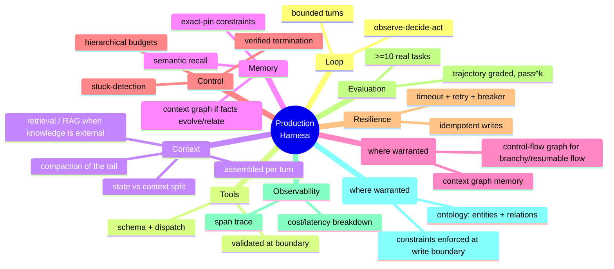

# Day 30 — Capstone: Build & Harden

> **Today's one idea:** A production agent is the *integration* of every prior day — and you're ready when you can build one on a real task and defend each design choice against the alternative you rejected.
> **Reading time:** ~45 min to read + a multi-hour build · **Prereqs:** all of Days 1–29
> **Primary source for today:** Anthropic, "Building Effective Agents," 2024 (architecture & patterns).
> **Before you start:** Recall Day 29's synthesis — one sentence, no looking: *name the seven engineering disciplines this course covered, and the single question that unifies them.*

## The hook (2–4 min)

Twenty-nine days ago the harness was a black box and "the agent" meant "the model." Today you close the loop: you'll build a real agent, on a real task, that runs a bounded loop against real tools, manages its own context under budget, survives injected failures, emits a replayable trace, and passes an eval *you* wrote — and you'll be able to answer, for every part, *"why this and not the obvious alternative?"*

That last part is the real exam. Anyone can wire an API to a `while` loop. The L2 Builder can look at each line and say: *this budget is hierarchical because sub-agents multiply cost (Day 21); this constraint is pinned not recency-kept because recency drops old load-bearing facts (Day 12); this write is idempotent because retries double-apply mutations (Day 22).* The course was never about the code. It was about earning the *why* behind every line.

## The challenge

Build and harden **one agent** on **one** of these tracks. Both are real, both have objective verifiers (Day 23), both will expose every subsystem you built.

**Track A — Coding agent (SWE-bench-lite style).** Given a real GitHub issue and a repo, the agent inspects the code, edits files, runs the tests, and resolves the issue. Verifier: the repo's own test suite (green = done). This is the canonical harness task; SWE-bench is literally this.

**Track B — Support agent (τ-bench style).** Given a user request and a domain (retail/airline) with API tools and policy rules, the agent completes the transaction correctly *and* within policy. Verifier: final database state matches the goal state; policy violations auto-fail. This stresses tool boundaries, constraints, and multi-turn user interaction.

Pick the one closer to your work. The build below is written track-agnostic; adapt the tools and verifier.

## The specification — what "done" means

Your agent must demonstrably do all nine. Treat each as a checkbox with *evidence*, not a vibe:

1. **Bounded loop** (Days 9, 10, 19): runs to a verified done or stops cleanly on a budget/stuck exit — never hangs, never loops forever.
2. **Safe tool boundary** (Days 7, 8): every tool has a schema; every call is validated; every outcome (success/error) is an observation; the agent is confined (workspace/policy).
3. **Engineered context** (Days 11, 12, 13, 14, 15): `assemble_context` selects, orders (U-curve), and fits under a budget; the stable head is cache-friendly and the volatile tail is compacted. Where the task needs external knowledge, ground it with retrieval/RAG (Day 17).
4. **Two-tier memory** (Day 16): standing constraints pinned in exact memory; durable facts in recallable memory; nothing load-bearing lost to recency. For relational or time-evolving knowledge, a context graph (Day 25) is the upgrade.
5. **Honest control** (Day 19): hierarchical budgets (turns/tokens/cost/time), stuck-detection, and *verified* termination (a rejected "done" resumes work).
6. **Production resilience** (Day 22): timeouts, classified retries with backoff, a circuit breaker, and idempotent mutations — survives an injected chaos-monkey.
7. **A real eval** (Day 23): ≥10 tasks from real cases, code-graded, run k≥3, reporting success + pass^k + turns/cost/latency.
8. **A replayable trace** (Day 24): span-level tracing with a cost/latency breakdown; you can explain where every dollar and second went and replay a failed run.
9. **Shared meaning where warranted** (Days 27–28): if your task reasons over domain entities, a lightweight ontology (defined classes/relations) is the extraction + query vocabulary, with structural/business constraints enforced at the write boundary — or a one-paragraph justification of why free-form suffices for your task.

## The build (your "Try it yourself" — this is the whole day)

This is the direct-application exercise, in real conditions. Work in your course repo; you've written most of these pieces across Days 5–28 — the capstone is *integration and defense*, not greenfield.

**Phase 1 — Skeleton (compose what you have).** Wire your Day 20 `turn()` — the four separated state slices (transcript / durable memory / control-accounting / this-turn context) — around your chosen track's tools and verifier. Get one task passing end to end. *Checkpoint: it solves one real task and stops cleanly on an unsolvable one.*

**Phase 2 — Harden (make it survive).** Add resilience (Day 22): wrap tool and model calls in `resilient_call` with a circuit breaker; make every mutating tool idempotent. Inject failures (a flaky tool, an overloaded model response, a permanently-down dependency) and confirm the loop never crashes and recovers or escalates honestly. *Checkpoint: passes a chaos-monkey run.*

**Phase 3 — Measure (stop guessing).** Build the eval (Day 23): ≥10 real tasks with objective graders, run k≥3. Add the tracer (Day 24). Produce a baseline: success, pass^k, avg turns/cost/latency, and a cost breakdown. *Checkpoint: one number that summarizes your agent's quality, and a trace that explains its cost.*

**Phase 4 — Optimize (surgery, not superstition).** Read your trace, find the biggest cost/latency line item, apply the *one* matching fix (almost certainly: cache the stable head, compact the tail — Day 24), and re-run the eval to confirm cost dropped *without* success dropping. Make one more measured improvement of your choice. *Checkpoint: a measured before/after on cost AND success.*

**Phase 5 — Decide on multi-agent (Day 21).** Identify whether your task has a context-isolated or parallelizable subtask. If yes, split it out as a sub-agent-tool with a hierarchical budget and A/B it against the single-loop version on your eval. If no, *write one paragraph justifying why a single loop is correct here.* Either answer is right; the *reasoning* is graded.

**Phase 6 — Decide on graphs (Days 25–26).** Two independent calls, each justified in a sentence. **Memory:** does your task involve *evolving or relational* facts (a decision that gets superseded, entities connected across turns)? If so, back your memory with a context graph (Day 25) and show a multi-hop or as-of query flat retrieval couldn't answer; if not, say why key-value + vector memory suffices. **Control:** has your control flow grown branchy, or do you need pause/resume (human check-ins, hours-long runs)? If so, express the loop as a control-flow graph (Day 26) and demonstrate a checkpoint/resume; if not, say why a plain controlled loop is the right, simpler choice. *Reaching for a graph you don't need is as much a failure as missing one you do.*

**Phase 7 — Decide on shared meaning (Days 27–28).** If your agent extracts or reasons over domain entities (claims, orders, customers, code symbols), draft the minimal ontology — the classes and relations, scoped by 2–3 competency questions — and add a constraint check at the write boundary (one structural, one business rule) that rejects or routes violations before they enter your state/graph. Show one violation being caught. If your task is free-form (no domain entities to model), justify in a sentence why an ontology would be overhead here. *The point: know whether your system needs shared meaning, and enforce it if it does.*

## The defense — the real exam (retrieval, cold)

Close every page. Answer these from memory, in writing, as if defending the design to a skeptical senior engineer. Each question pairs a choice with the alternative you rejected — name *both* and say *why*. These are the spaced callbacks to the whole course; if any is shaky, that's your last diagnostic before you're done.

1. **(Day 2)** Your agent "remembers" 30 turns of work, yet you insist the model is stateless. Reconcile these precisely. *Alternative rejected: "the model has memory."*
2. **(Day 11 + 12)** You send `assemble_context(state)`, not `messages=history`. Give the two distinct failures the naïve version causes and which each subsystem fixes. *Alternative rejected: "just use the big context window."*
3. **(Day 8)** The provider's native tool calling parsed your tool arguments. Why do you *still* validate them, and where? *Alternative rejected: "the API validated it."*
4. **(Day 16 + 14)** A constraint stated on turn 2 still governs turn 40. Explain the two different mechanisms that could preserve it and which you chose for constraints vs. narrative. *Alternative rejected: "keep the last N turns."*
5. **(Day 19 + 23)** Your agent said "done." Give the two reasons you don't believe it and what the harness does about each. *Alternative rejected: "trust the model's completion."*
6. **(Day 22)** Your retry logic and one of your tools interact dangerously unless you did one specific thing. Name the bug and the fix, and whose design decision it was. *Alternative rejected: "just retry on any failure."*
7. **(Day 24)** Cost is $X/run. Walk the method that finds the right optimization, and why "use a cheaper model" is the wrong first move. *Alternative rejected: "smaller model = cheaper."*
8. **(Day 21)** Justify your single-loop-vs-multi-agent decision with the two-and-only-two legitimate reasons to split. *Alternative rejected: "more agents = smarter."*
9. **(Day 25 + 26)** For each of memory and control, did your task warrant a *graph*? Name the specific capability a graph would add (multi-hop/temporal recall; inspectable/resumable control) and whether it earned its complexity here. *Alternatives rejected: "graph everything" and "a flat store / while-loop is always enough."*
10. **(Day 27 + 28)** Where does "shared meaning" live in your system, and what breaks without it? Give one term your components must agree on, and name where an ontology *definition* becomes an enforced *constraint*. *Alternative rejected: "the LLM will figure out what a customer/claim/order is."*

Model answers (check yourself only after writing all ten)

1. The *model* retains nothing between calls (pure `tokens_in→tokens_out`); the *harness* reconstructs a curated view of the past into context each turn. "The agent remembers" = "the harness re-shows the model its relevant history." Memory is a harness responsibility, not a model property.
2. `messages=history` **overflows** the finite window `L` (fixed by compaction/eviction — Days 13, 14) *and* buries the current goal in the low-attention **middle** (fixed by placement/re-pinning — Days 11, 12). Two different failures, two different fixes; both invisible in a demo, fatal by turn 30.
3. Native tool calling validates *shape*, not *values*; `block.input` is untrusted model output (e.g. `path="../../etc/passwd"`). Validation lives in the harness at the tool boundary, as deterministic, testable code — the model can't be a security control.
4. **Exact-pin** (Day 16): store the constraint in key-value memory, always injected in a strong position regardless of age — best for hard constraints that must not drift. **Running summary** (Day 14): fold it into the digest — fine for narrative, unreliable for hard constraints (prose can drop it). Choose exact-pin for constraints, summary for the story.
5. It could be a **hallucinated completion** (fixed by objective *verification* — run the tests/check state, Day 19) and it could be **a fluke that won't reproduce** (fixed by *pass^k* over k runs, Day 23). A rejected claim becomes a "verification failed" observation and the loop resumes.
6. Retrying a **non-idempotent write** after a lost-ack timeout **double-applies** the mutation (duplicate record). Fix: idempotency key derived from the intended action, checked before applying — and it's a **Day 8 tool-design** decision, not a retry-layer patch, because only the tool knows whether "do X twice" is intentional.
7. **Trace first** (span-level cost breakdown), find the biggest line item — for agents usually *repeated input tokens* re-sent every turn — then cache the stable prefix. "Cheaper model" is wrong first because per-token price isn't the bottleneck (repeated input is), and a weaker model can *raise* cost by needing more turns. Validate any cut against the eval's success/pass^k.
8. Split *only* for **context isolation** (keep a subtask's mess out of the main window) or **parallelism** (independent subtasks concurrently for latency). Every split adds a lossy serialized handoff; "more agents = smarter" ignores that agents play telephone across boundaries and multiply cost. If subtasks need each other's *working context*, it's one loop.
9. A **context graph** (Day 25) earns its complexity only when facts *evolve or interrelate* — it adds multi-hop recall (answers living in relationships, not one chunk) and temporal/as-of queries (current vs. superseded facts); for static, independent facts, flat key-value + vector memory is simpler and sufficient. A **control-flow graph** (Day 26) earns it only when control is *branchy or must pause/resume* — it adds inspectability and checkpoint/resume durability; for linear controlled loops it's ceremony. The failure is symmetric: missing a graph you needed (multi-hop questions your flat store can't answer; a loop you can't pause) *or* graphing what a simple structure handled fine.
10. Shared meaning lives in an **ontology** — the agreed definitions of your domain's classes/relations — referenced by every layer: prompts phrase tasks in its terms, extraction maps to it, the context graph instantiates it, queries ask about it. Without it, components silently disagree on what a term means (one extracts "Client," another queries "Customer"), so the graph fragments and the numbers don't reconcile — a missing-meaning bug, not a missing-data bug. One agreed term (e.g. "completed order" = paid ∧ shipped); the definition becomes an **enforced constraint** at the **write boundary** (Day 28) — a validation check that rejects a `completed`-but-unpaid record (extraction error) or routes a business-rule violation to review — the same parse-boundary pattern as Days 6 and 8, now applied to knowledge. "The LLM will figure out what a customer is" fails because the model is jagged (Day 4) and inconsistent: it needs the shared definition given to it and enforced, not inferred fresh each call.

## What "done" looks like (rubric)

You've completed the course when your agent:

- [ ] Solves ≥1 real task on your track, end to end, with a verified outcome.
- [ ] Stops cleanly (budget/stuck/verified-done) on every run — you cannot make it hang or loop forever.
- [ ] Survives a chaos-monkey run (injected transient + permanent + down-dependency failures) without crashing, and doesn't double-apply any write.
- [ ] Reports an eval score over ≥10 tasks at k≥3: success, pass^k, avg turns/cost/latency.
- [ ] Produces a trace you can read to explain its cost, and you made ≥1 *measured* optimization (cost down, success held).
- [ ] Comes with your written answers to all ten defense questions, each naming the rejected alternative.

If every box is checked and every defense answer holds, you have done the thing the course promised on Day 1: **built a production-grade AI system from scratch — across all seven disciplines (foundation model, prompt, context, harness, loop, graph, ontology) — and can defend every design choice against the alternatives.** The model is the CPU; you built everything around it.

> **Transfer — apply it:** This is the most direct transfer possible — the capstone *is* your domain if you chose your track to match your work. Take the agent you built and name the one subsystem you'd invest in first for *your actual production use case*, and the one metric on your eval you'd hold the line on. Write it down; it's your next week's roadmap.

## Connect it back

Day 1 you learned AI engineering is systems work around a rented model; Day 2 gave the frame — the model is a stateless CPU, the harness its OS. Every day since added a capability across the seven disciplines: **① Capability** — choosing the model and designing around its jagged failure modes (Days 3–4); **② Instructions** — prompting and structured output (Days 5–6); **④ Runtime** — tools, boundaries, reliability, observability (Days 7–8, 22, 24); **⑤ Feedback** — the loop, control, and evaluation (Days 9–10, 19–20, 23); **③ Information** — context assembly, compaction, memory, RAG (Days 11–17); **⑥ Coordination** — multi-agent and control-flow graphs (Days 21, 26); and **⑦ Shared Meaning** — the ontology and constraints that keep every layer agreeing (Days 25, 27–28). Today you assembled all seven and proved the system lives under production load. There's no "next day" — there's the frontier: longer-horizon agents, learned control policies, better verifiers, agents that improve their own harness. You now have the one thing that makes that frontier legible: you know what's actually running when an AI system runs. The final question, which you couldn't answer twenty-nine days ago and can now answer cold: *given a stateless, jagged next-token predictor, what exactly must you build around it — across all seven disciplines — to make it reliably do real work, and why each piece?*

## Suggested readings for today

**Required if you have 15 extra minutes:** Anthropic, "Building Effective Agents," 2024 — [link](https://www.anthropic.com/engineering/building-effective-agents). Read it *now*, at the end — it will read completely differently than it would have on Day 2. Every pattern it names, you've now built and can critique.

**If you want the deep version (the frontier):**
- Jimenez et al., "SWE-bench," arXiv:2310.06770 — if you took Track A, run against the real benchmark and compare to the leaderboard.
- Yao et al., "τ-bench," arXiv:2406.12045 — if you took Track B, the real harness and pass^k tasks.
- Dex Horthy, "12-Factor Agents" — [talk](https://www.youtube.com/watch?v=8kMaTybvDUw)/[repo](https://github.com/humanlayer/12-factor-agents) — re-read all twelve factors; you've now independently derived every one. That's the sign you're done.
- Sumers et al., "CoALA," arXiv:2309.02427 — the research frame for where agent architectures go next.

---

## Navigation

← **Previous:** [Day 29 — Rest & Synthesize II](day-29-rest-synthesize-ii.md)  
→ **Course complete:** [Back to the README](../../../README.md) · [Learning path](../../../learning-path.md)
