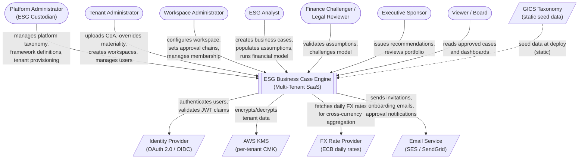
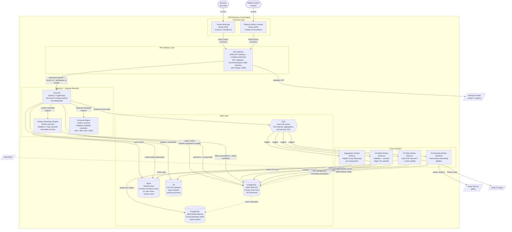
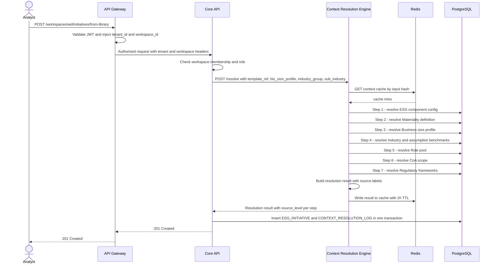
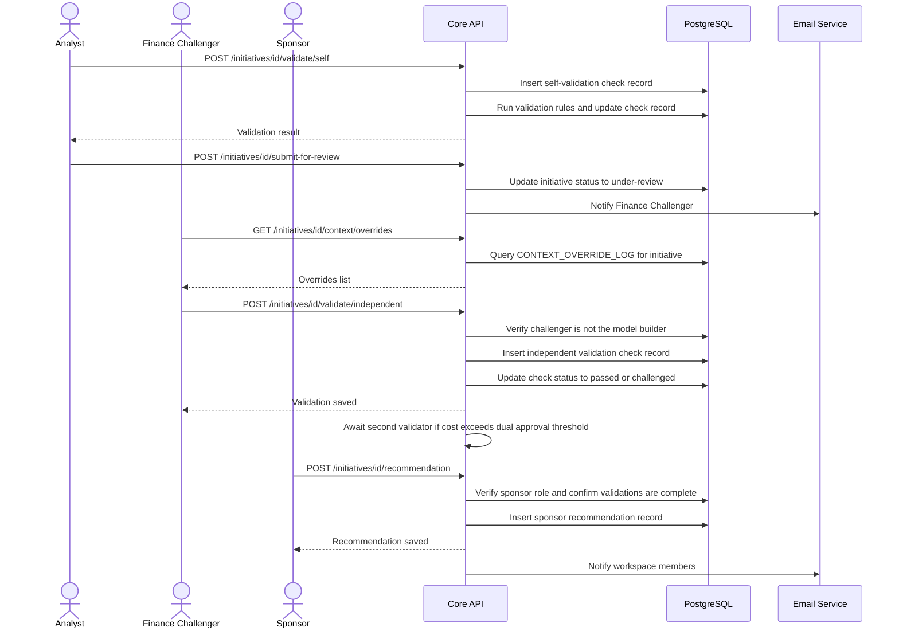
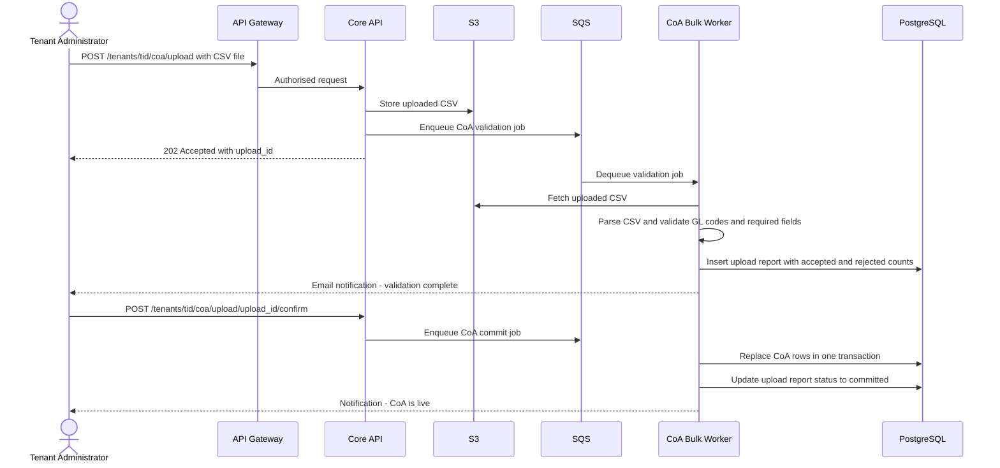
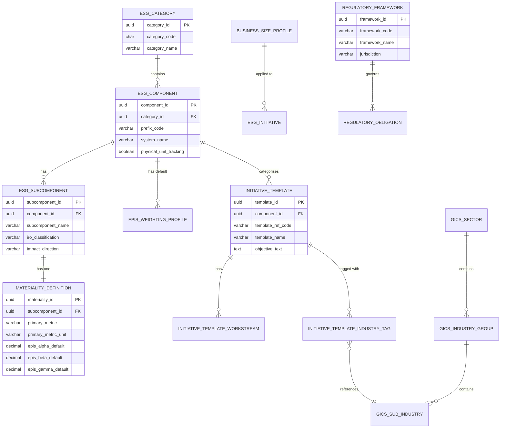
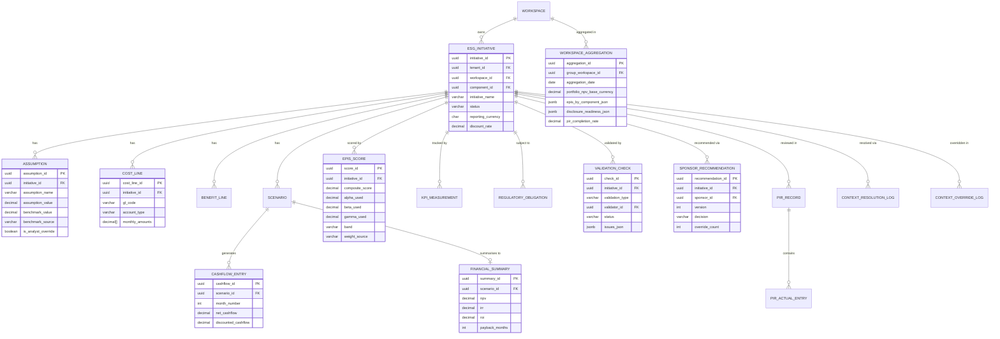
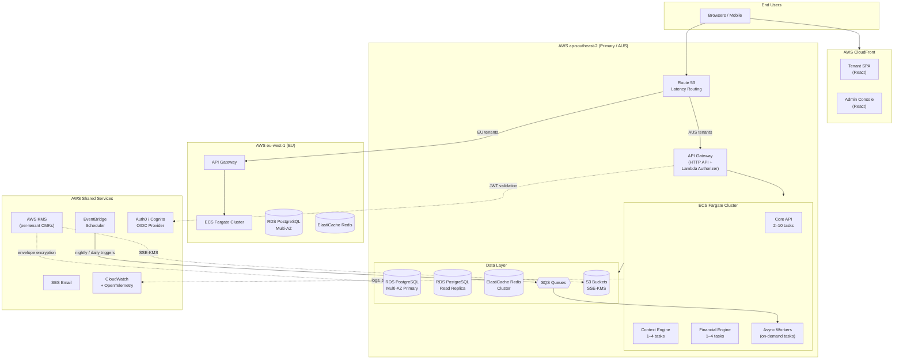

# Architecture Proposal: ESG Business Case Engine v3.0

> **Document type:** Architecture proposal — new system  
> **Based on:** ESG Business Case Engine Application Specification v3.0  
> **Date:** June 2026  
> **Status:** Proposed — awaiting team review  
> **Classification:** Internal — Confidential

---

## Table of Contents

1. [Summary](#1-summary)
2. [Quality Attributes — Priorities](#2-quality-attributes--priorities)
3. [Context Diagram](#3-context-diagram)
4. [Container Diagram](#4-container-diagram)
5. [Container Responsibilities](#5-container-responsibilities)
6. [Key Flows — Sequence Diagrams](#6-key-flows--sequence-diagrams)
7. [Technology Choices](#7-technology-choices)
8. [Cross-Cutting Concerns](#8-cross-cutting-concerns)
9. [Database Design](#9-database-design)
10. [ER Diagram](#10-er-diagram)
11. [Deployment Topology](#11-deployment-topology)
12. [Architecture Decision Records](#12-architecture-decision-records)
13. [Phased Delivery Alignment](#13-phased-delivery-alignment)
14. [Risks and Mitigations](#14-risks-and-mitigations)

---

## 1. Summary

The ESG Business Case Engine is a **configuration-driven, multi-tenant SaaS platform** that enables organisations to build, validate, and govern ESG business cases. The dominant architectural challenge is not throughput or latency — it is **isolation correctness**: the system must guarantee that data, configuration, and computation never leak across tenant or workspace boundaries, at any of the API, application, database, or cache layers.

The proposed design is a **modular monolith API backend** backed by **PostgreSQL with row-level security** as the single source of truth, fronted by an API gateway handling authentication and tenant/workspace claim injection. A separate **stateless context-resolution service** handles the 7-step cascade with Redis caching keyed by (template × profile × industry × tenant) hash. Background workers on SQS drive asynchronous operations (nightly Group Reporting aggregations, CoA bulk validation, PIR calculations). The frontend is a React SPA with a separate admin console.

The key tradeoff accepted: a modular monolith over microservices for the initial build. At the target organisation size (one cross-functional team per phase), a modular monolith delivers faster iteration, simpler debugging, and avoids distributed-transaction complexity across the multi-tenant boundary — which is the real hard problem here. Service extraction is deferred until team-scaling or independent-deployability pressure demands it.

---

## 2. Quality Attributes — Priorities

| Priority | Attribute | Target |
|----------|-----------|--------|
| 1 | **Isolation correctness** | Zero cross-tenant / cross-workspace data leakage at all layers; pen-tested quarterly |
| 2 | **Data durability** | RPO < 15 min; 35-day backup retention; continuous WAL shipping |
| 3 | **Availability** | 99.9% monthly uptime; RTO < 2 hours |
| 4 | **Correctness of computation** | Financial engine output matches reference Excel model; context resolution produces auditable source-level trace |
| 5 | **Configuration flexibility** | All taxonomy, materiality, and framework data is runtime-configurable; zero-downtime updates |

**Explicitly deprioritised:**
- **Sub-100ms latency** — p95 targets are 500ms–3s depending on operation. This is an internal business tool, not a consumer product.
- **Horizontal write scaling** — PostgreSQL single-primary with read replicas is sufficient for 5,000 concurrent users at the projected write rates. Sharding is not justified and would complicate RLS enforcement.
- **Event sourcing** — the audit log provides the history trail; full event sourcing would add substantial complexity without marginal benefit at this stage.

---

## 3. Context Diagram



---

## 4. Container Diagram



---

## 5. Container Responsibilities

| Container | Responsibility | Scale profile |
|-----------|---------------|---------------|
| **React SPA** | All user-facing screens: initiative builder, financial model, validation, dashboards, materiality config, CoA manager. Tenant-scoped. | CloudFront CDN; stateless |
| **Admin Console** | Platform administrator screens: ESG taxonomy management, tenant provisioning, GICS taxonomy, framework definitions. Separate deployment from tenant SPA. | CloudFront CDN; low traffic |
| **API Gateway** | JWT validation via Lambda Authorizer; extracts and injects `tenant_id` and `workspace_id` as request headers; rate limiting per tenant; CORS; request logging. Single entry point — no direct access to Core API. | AWS-managed; scales automatically |
| **Core API** | All domain logic grouped into internal modules: `tenancy`, `workspace`, `config`, `initiative`, `financial`, `validation`, `governance`, `reporting`. Single deployable unit; modules communicate in-process, not over the network. Handles REST request routing, auth context propagation, and database transactions. | ECS Fargate; 2–10 tasks behind ALB |
| **Context-Resolution Engine** | Stateless HTTP service implementing the 7-step cascade (§9 of spec). Called by Core API on initiative creation and context preview. Results are cached in Redis by a hash of (template_ref, biz_size_profile, industry_group, sub_industry, tenant_id, workspace_id). Cache TTL: 1 hour. Cache is invalidated on tenant materiality override change. | ECS Fargate; 1–4 tasks |
| **Financial Engine** | Stateless HTTP service implementing the 60-month cashflow model, NPV/IRR/ROI, three scenarios, EPIS scoring formula. Takes a JSON payload of resolved assumptions; returns structured cashflow and score data. Caches by assumption hash. | ECS Fargate; 1–4 tasks |
| **CoA Bulk Worker** | Receives a job from SQS with an S3 reference to an uploaded CSV. Validates all rows (duplicate GL codes, required fields), builds a validation report, and — on confirmation — commits the full batch in a single transaction. Partial uploads are rejected. | ECS task; on-demand |
| **Aggregation Worker** | Nightly batch job triggered by EventBridge. For each tenant, computes Group Reporting aggregations (portfolio NPV, EPIS uplift, disclosure readiness by framework, PIR completion rate) across all permitted workspaces. Writes to `WORKSPACE_AGGREGATION` table. Reads from the PostgreSQL read replica. | ECS task; nightly scheduled |
| **FX Rate Worker** | Daily job (06:00 UTC) fetching ECB reference rates for all currencies in use. Writes rates to Redis (hot path) and `FX_RATE_SNAPSHOT` table (audit trail). | ECS task; daily scheduled |
| **Provisioning Worker** | Triggered by tenant creation event. Creates the tenant's database row, applies all platform-level default configuration, sends the Tenant Administrator invitation email, and generates the onboarding checklist record. Must complete in < 5 minutes. | ECS task; on-demand |
| **PostgreSQL (Primary)** | Single source of truth. All writes. RLS policies on `tenant_id` + `workspace_id` enforced at the database layer as defence-in-depth. Per-tenant envelope encryption via AWS KMS. Multi-AZ for HA. | RDS PostgreSQL 16 Multi-AZ |
| **PostgreSQL (Read Replica)** | Async replica used for: Group Reporting aggregations, audit log exports, large report generation, CoA exports. Keeps these read-heavy queries off the write primary. | RDS PostgreSQL 16 read replica |
| **Redis (ElastiCache)** | Context-resolution cache; FX rate cache; short-lived session data. Keys are always namespaced by `tenant_id` to prevent cross-tenant cache collision. | ElastiCache Redis 7; cluster mode |
| **S3** | CoA CSV uploads (temporary; deleted after worker processes); report exports (Excel/PDF); audit log archives (monthly partitions compressed to Parquet). | S3 with SSE-KMS per tenant prefix |
| **SQS** | Decouples Core API from workers for: CoA bulk processing, nightly aggregation trigger, provisioning pipeline, FX refresh. Standard queues (at-least-once delivery; workers are idempotent). | AWS SQS standard queues |

---

## 6. Key Flows — Sequence Diagrams

### 6.1 Initiative creation with context resolution



### 6.2 Business case validation and sponsor recommendation



### 6.3 Tenant CoA upload



---

## 7. Technology Choices

| Concern | Choice | Rationale |
|---------|--------|-----------|
| **Primary database** | PostgreSQL 16 (RDS Multi-AZ) | Relational model with strong FK enforcement is essential for the multi-layer config override model. RLS is a first-class PG feature, native to the spec requirements. ACID transactions across CoA, materiality, and business case tables. Mature AWS-managed offering. |
| **Backend API runtime** | Node.js 22 / TypeScript (strict) | Fast I/O for the request-handling layer; strong typing for the complex config model; large ecosystem; consistent with TypeScript frontend. Python used only where computational benefits dominate (context engine, financial engine). |
| **Context / Financial engines** | Python 3.12 (FastAPI) | Numerical computing (NPV, IRR, EPIS scoring) benefits from Python's scientific stack; FastAPI's typed request/response models match the structured engine I/O. Deployed as separate internal services, not exposed externally. |
| **Frontend** | React 18 + TypeScript + Vite | Industry standard; large talent pool; component library (e.g. shadcn/ui) speeds admin-heavy UI development. No server-side rendering needed — the app is authenticated, not public. |
| **API gateway** | AWS API Gateway (HTTP API) + Lambda Authorizer | JWT validation and claim injection in one managed layer; no code to operate; rate limiting and usage plans built-in; integrates with Cognito or Auth0. |
| **Authentication** | Auth0 (or AWS Cognito) via OAuth 2.0 / OIDC | Spec mandates OIDC; both options support MFA, custom claims (tenant_id, workspace_id), machine-to-machine tokens for worker services. Auth0 preferred for multi-tenant customisation (per-tenant SAML/SSO on Enterprise plan). |
| **Cache** | Redis 7 (ElastiCache cluster mode) | Context-resolution cache (the hot path that must hit < 3s). Namespace keys by tenant_id. Per-tenant cache invalidation on materiality override. Also: FX rate cache, session tokens. |
| **Async messaging** | AWS SQS (standard queues) | Decouples API from workers; at-least-once delivery with idempotent workers; dead-letter queues for failed jobs; no operational overhead vs. self-managed Kafka at this scale. |
| **Object storage** | AWS S3 (SSE-KMS) | CoA uploads, report exports, audit archives. Per-tenant KMS key used for S3 server-side encryption on each tenant's prefix. |
| **Encryption** | AWS KMS (per-tenant CMK) | Spec mandates per-tenant key isolation. Envelope encryption: RDS uses the tenant CMK to encrypt the tenant's data key. Annual key rotation. |
| **Scheduled jobs** | AWS EventBridge Scheduler | Triggers nightly aggregation worker, daily FX worker. Cron expressions managed in infrastructure code (Terraform). |
| **Infrastructure-as-code** | Terraform | Mature; wide AWS provider support; state in S3 + DynamoDB lock. |
| **Container orchestration** | AWS ECS Fargate | No nodes to manage; right-sized per service; simpler than EKS at this team size and traffic profile. |
| **Observability** | AWS CloudWatch + OpenTelemetry (traces) + Datadog | Structured JSON logging from all services; distributed traces across API → context engine → DB; dashboards for p95 latency per endpoint; tenant-level error rate alerting. |

---

## 8. Cross-Cutting Concerns

### 8.1 Multi-tenancy and isolation

Three independent isolation layers enforce the same boundary:

**Layer 1 — Database (RLS):** Every row in every tenant-scoped or workspace-scoped table carries `tenant_id` (and where applicable `workspace_id`). PostgreSQL RLS policies on all these tables enforce the check at the database connection layer, meaning even a buggy query that omits the filter cannot return cross-tenant data. Session variables `app.current_tenant` and `app.permitted_workspaces` are set at connection checkout from the pool.

```sql
-- Applied to all business-case tables
CREATE POLICY workspace_isolation ON esg_initiative
  USING (
    tenant_id = current_setting('app.current_tenant')::uuid
    AND workspace_id = ANY(current_setting('app.permitted_workspaces')::uuid[])
  );

-- Applied to all tenant-scoped tables (no workspace)
CREATE POLICY tenant_isolation ON tenant_coa
  USING (tenant_id = current_setting('app.current_tenant')::uuid);
```

**Layer 2 — API Gateway:** The Lambda Authorizer validates the JWT, extracts `tenant_id` and `workspace_id` claims, verifies the user's workspace membership in the `WORKSPACE_MEMBER` table, and injects the claims as `X-Tenant-Id` and `X-Workspace-Id` request headers. The Core API trusts these headers (they come from the gateway, not the client) and uses them for all queries.

**Layer 3 — Application:** Every repository method in the Core API explicitly includes `WHERE tenant_id = $tenantId AND workspace_id = $workspaceId` filters even though RLS enforces this. Defence in depth — the application layer never relies solely on the database layer.

**Redis isolation:** All Redis keys are prefixed with `tenant:{tenant_id}:` preventing cross-tenant cache reads by construction.

### 8.2 Security

| Concern | Implementation |
|---------|---------------|
| Authentication | OAuth 2.0 / OIDC; MFA mandatory; JWT signed RS256; 1-hour access token TTL |
| Authorisation | RBAC at API layer (role checked in Lambda Authorizer + Core API middleware); RLS at database layer |
| Encryption at rest | RDS AES-256; per-tenant KMS CMK; S3 SSE-KMS per tenant prefix |
| Encryption in transit | TLS 1.3 minimum; HSTS; no internal service plaintext |
| Secrets | AWS Secrets Manager for DB credentials, API keys; rotated automatically |
| Audit log | Append-only table; no UPDATE/DELETE granted to any application role; partitioned monthly; 7-year retention |
| Penetration testing | Annual external pen test; RLS policies tested quarterly via automated test suite |
| OWASP | Input validation on all API endpoints; parameterised queries only (no string-interpolated SQL); Content-Security-Policy headers on SPA |

### 8.3 Caching strategy

The context-resolution engine is the primary performance bottleneck (7 DB queries per resolution, p95 target < 3 seconds). The caching strategy:

- **Cache key:** `SHA256(template_ref_code + "|" + biz_size_profile_id + "|" + industry_group + "|" + sub_industry + "|" + tenant_id + "|" + workspace_id)`
- **Cache TTL:** 1 hour (covering the session lifecycle of most analyst work)
- **Cache invalidation:** On any tenant materiality override change, all keys matching `tenant:{tenant_id}:ctx:*` are deleted. This is a deliberate flush rather than key-by-key invalidation to ensure correctness over cache efficiency.
- **Financial engine cache:** Keyed by SHA256 of the full assumption payload. TTL: 30 minutes. Invalidated when any assumption is saved.
- **FX rates:** Written to Redis by the daily FX worker; Core API reads from Redis. Fallback: query `FX_RATE_SNAPSHOT` table if Redis miss.

### 8.4 Asynchronous jobs

| Job | Trigger | Worker | SLA |
|-----|---------|--------|-----|
| CoA validation + commit | User upload → API → SQS | CoA Bulk Worker | Validation report: < 60s; commit: < 30s for 10k rows |
| Group Reporting aggregation | EventBridge nightly at 02:00 UTC | Aggregation Worker | < 30 minutes for 1,000 business cases |
| FX rate refresh | EventBridge daily at 06:00 UTC | FX Rate Worker | < 2 minutes |
| Tenant provisioning | Tenant creation → API → SQS | Provisioning Worker | < 5 minutes end-to-end |

All workers are idempotent — re-running a job produces the same outcome. SQS message visibility timeout is set conservatively above each job's expected duration. Dead-letter queues capture failures; CloudWatch alarms trigger on DLQ message count > 0.

### 8.5 Group Reporting aggregation

Group Reporting workspaces cannot query live business case tables (isolation prevents it). The aggregation worker pre-computes summary records nightly:

```
For each Group Reporting workspace:
  1. Read the permitted_workspace_ids list
  2. FOR EACH permitted workspace:
     - Sum portfolio NPV (in workspace currency; convert to tenant base currency using yesterday's FX rate)
     - Compute EPIS uplift by component
     - Count disclosure readiness by framework (complete / partial / not-started)
     - Count PIR completion rate
  3. Upsert into WORKSPACE_AGGREGATION table (one row per group-reporting workspace per night)
  4. Log AGGREGATION_RUN record (start, end, workspace count, error count)
```

On-demand refresh is available via `POST /workspaces/{wid}/aggregation/refresh` (rate-limited: once per 15 minutes per workspace).

### 8.6 Data residency

Tenants on Professional or Enterprise plans select their data residency region at onboarding (AP-SOUTHEAST-2, EU-WEST-1, EU-WEST-2). The infrastructure deploys separate RDS instances per region. API Gateway routing uses subdomain-based routing (`acme.esgengine.com` resolves to the tenant's region via Route 53 latency-based routing). Redis and S3 are co-located in the tenant's region.

---

## 9. Database Design

### 9.1 Design principles

1. **Every table carries `tenant_id`** (except platform-level tables which are shared and have no `tenant_id`).
2. **Business-case tables carry both `tenant_id` and `workspace_id`** — denormalised for RLS performance.
3. **Soft-delete only** — no physical deletes on business data. `is_active` or `deleted_at` columns preserve history.
4. **All PKs are UUIDs** — avoids sequential ID enumeration attacks; simplifies multi-region replication.
5. **Timestamps are `timestamptz`** — timezone-aware; stored in UTC.
6. **Audit log is append-only** — no UPDATE/DELETE granted to any application role via GRANT/REVOKE.

---

### 9.2 Platform-level tables (no `tenant_id` — shared across all tenants)

> All tables in this section are managed by Platform Administrators and are visible to every tenant. No `tenant_id` column — RLS is not applied. Changes are versioned by `effective_from` date and require a platform admin deployment to alter structure.

---

#### esg_category

**Purpose:** The fixed top-level ESG classification. Exactly three rows exist (E, S, G) and these never change. All components and subcomponents roll up to one of these.

```sql
CREATE TABLE esg_category (
    category_id       uuid PRIMARY KEY DEFAULT gen_random_uuid(),
    category_code     char(1)      NOT NULL UNIQUE,
    category_name     varchar(50)  NOT NULL,
    sort_order        int          NOT NULL
);
```

| category_code | category_name | sort_order |
|---|---|---|
| E | Environmental | 1 |
| S | Social | 2 |
| G | Governance | 3 |

---

#### esg_component

**Purpose:** The 15 ESG components (e.g. ECC, SMS, GEI). Each has a unique prefix code that drives the context-resolution engine — determining the role pool, regulatory framework types, EPIS profile, and physical unit tracking for any initiative built under it.

```sql
CREATE TABLE esg_component (
    component_id      uuid PRIMARY KEY DEFAULT gen_random_uuid(),
    category_id       uuid         NOT NULL REFERENCES esg_category(category_id),
    prefix_code       varchar(10)  NOT NULL UNIQUE,
    system_name       varchar(100) NOT NULL,
    default_risk_subject_type varchar(100),
    physical_unit_tracking    boolean NOT NULL DEFAULT false,
    primary_unit_default      varchar(50),
    sort_order        int          NOT NULL,
    is_active         boolean      NOT NULL DEFAULT true,
    effective_from    date         NOT NULL
);
CREATE INDEX idx_esg_component_category ON esg_component(category_id);
```

| prefix_code | system_name | default_risk_subject_type | physical_unit_tracking | primary_unit_default | effective_from |
|---|---|---|---|---|---|
| ECC | Climate Change and Carbon Footprint | Site / Asset / Emission source | true | tCO2e/year | 2024-01-01 |
| EWM | Water Management | Water extraction site | true | kL/year | 2024-01-01 |
| SMS | Modern Slavery | Supplier / Contract worker | false | null | 2024-01-01 |

---

#### esg_subcomponent

**Purpose:** Granular sub-topics within each component. Scope 1, Scope 2, and Scope 3 are three subcomponents of ECC. Each subcomponent links to exactly one materiality definition which specifies the primary metric, units, and default EPIS weights used when an initiative is built under it.

```sql
CREATE TABLE esg_subcomponent (
    subcomponent_id   uuid PRIMARY KEY DEFAULT gen_random_uuid(),
    component_id      uuid         NOT NULL REFERENCES esg_component(component_id),
    subcomponent_name varchar(150) NOT NULL,
    iro_classification varchar(20) NOT NULL CHECK (iro_classification IN ('Impact','Risk','Opportunity')),
    impact_direction  varchar(20)  NOT NULL CHECK (impact_direction IN ('Positive','Negative','Neutral')),
    is_active         boolean      NOT NULL DEFAULT true,
    sort_order        int          NOT NULL
);
CREATE INDEX idx_esg_subcomponent_component ON esg_subcomponent(component_id);
```

| subcomponent_name | component (prefix) | iro_classification | impact_direction | sort_order |
|---|---|---|---|---|
| Scope 1 — Direct emissions | ECC | Risk | Positive | 1 |
| Scope 2 — Purchased energy | ECC | Risk | Positive | 2 |
| Scope 3 — Value chain | ECC | Impact | Positive | 3 |
| Modern Slavery in supply chain | SMS | Impact | Negative | 1 |

---

#### materiality_definition

**Purpose:** One row per subcomponent defining what to measure (primary metric, unit) and how to weight the three EPIS dimensions (alpha = impact, beta = financial, gamma = compliance). These are the platform defaults. Tenants override metrics and units via `tenant_materiality_override`; tenants override EPIS weights at component level via `tenant_epis_weight_profile`. The fleet electrification initiative uses the Scope 1 row.

```sql
CREATE TABLE materiality_definition (
    materiality_id        uuid PRIMARY KEY DEFAULT gen_random_uuid(),
    subcomponent_id       uuid         NOT NULL UNIQUE REFERENCES esg_subcomponent(subcomponent_id),
    primary_metric        varchar(255) NOT NULL,
    primary_metric_unit   varchar(50)  NOT NULL,
    secondary_metric_1    varchar(255),
    secondary_metric_2    varchar(255),
    explanation           text,
    epis_alpha_default    decimal(4,3) NOT NULL,
    epis_beta_default     decimal(4,3) NOT NULL,
    epis_gamma_default    decimal(4,3) NOT NULL,
    CONSTRAINT check_epis_weights_platform
        CHECK (ABS(epis_alpha_default + epis_beta_default + epis_gamma_default - 1.0) < 0.001)
);
```

| subcomponent | primary_metric | primary_metric_unit | secondary_metric_1 | alpha | beta | gamma |
|---|---|---|---|---|---|---|
| Scope 1 — Direct emissions | Direct emissions avoided | tCO2e/year | Fuel cost reduction (AUD/year) | 0.450 | 0.300 | 0.250 |
| Scope 2 — Purchased energy | Grid electricity avoided | MWh/year | Energy cost reduction (AUD/year) | 0.400 | 0.350 | 0.250 |
| Modern Slavery | Suppliers audited for Modern Slavery | % of tier-1 suppliers | Remediation actions closed % | 0.550 | 0.100 | 0.350 |

> Acme Logistics overrides gamma for the entire ECC component from 0.250 to 0.400 (NGER Act obligation is dominant). That override is stored in `tenant_epis_weight_profile` at component level, not here.

---

#### epis_weighting_profile

**Purpose:** Named weight profiles that can be referenced by component or applied cross-component. The context-resolution engine resolves to a named profile at Step 1; the materiality definition then refines the actual α/β/γ values at Step 2. Tenants can create their own profiles.

```sql
CREATE TABLE epis_weighting_profile (
    profile_id     uuid PRIMARY KEY DEFAULT gen_random_uuid(),
    profile_code   varchar(50) NOT NULL UNIQUE,
    profile_name   varchar(150) NOT NULL,
    component_id   uuid REFERENCES esg_component(component_id),
    alpha          decimal(4,3) NOT NULL,
    beta           decimal(4,3) NOT NULL,
    gamma          decimal(4,3) NOT NULL,
    is_platform    boolean NOT NULL DEFAULT true,
    CONSTRAINT check_epis_weights_profile
        CHECK (ABS(alpha + beta + gamma - 1.0) < 0.001)
);
```

| profile_code | profile_name | component | alpha | beta | gamma |
|---|---|---|---|---|---|
| ECC_DEFAULT | Climate — Default weighting | ECC | 0.450 | 0.300 | 0.250 |
| SMS_DEFAULT | Modern Slavery — Default weighting | SMS | 0.550 | 0.100 | 0.350 |
| CROSS_DEFAULT | Cross-component baseline | null | 0.400 | 0.300 | 0.300 |

---

#### initiative_template

**Purpose:** The 566 platform scaffold definitions. Stores the objective, value creation narrative, and assumption hints for each pre-built initiative type. Analysts select a template to start a business case; the template code (`ECC-045`) drives the context-resolution engine. No financial data lives here — only the question frame.

```sql
CREATE TABLE initiative_template (
    template_id         uuid PRIMARY KEY DEFAULT gen_random_uuid(),
    template_ref_code   varchar(50)  NOT NULL UNIQUE,
    component_id        uuid         NOT NULL REFERENCES esg_component(component_id),
    template_name       varchar(255) NOT NULL,
    objective_text      text,
    value_creation_text text,
    assumption_hints    jsonb,
    is_active           boolean      NOT NULL DEFAULT true,
    effective_from      date         NOT NULL
);
CREATE INDEX idx_template_component ON initiative_template(component_id);
```

| template_ref_code | component | template_name | effective_from |
|---|---|---|---|
| ECC-045 | ECC | Fleet transition to zero-emission vehicles | 2024-01-01 |
| ECC-012 | ECC | Renewable energy procurement — on-site solar | 2024-01-01 |
| SMS-008 | SMS | Tier-1 supplier Modern Slavery audit programme | 2024-01-01 |

---

#### initiative_template_workstream

**Purpose:** The recommended workstreams for each template. Displayed in the initiative builder to guide analysts in structuring their programme of work. An analyst can rename, add, or remove workstreams on their specific initiative without altering this platform record.

```sql
CREATE TABLE initiative_template_workstream (
    workstream_id   uuid PRIMARY KEY DEFAULT gen_random_uuid(),
    template_id     uuid         NOT NULL REFERENCES initiative_template(template_id),
    workstream_name varchar(150) NOT NULL,
    description     text,
    sort_order      int          NOT NULL
);
```

| template | workstream_name | sort_order |
|---|---|---|
| ECC-045 | Fleet audit and vehicle selection | 1 |
| ECC-045 | Charging infrastructure | 2 |
| ECC-045 | Financial modelling | 3 |
| ECC-045 | Procurement and contracts | 4 |
| ECC-045 | Change management and driver training | 5 |
| ECC-045 | Emissions measurement and reporting | 6 |

---

#### initiative_template_industry_tag

**Purpose:** Maps each template to GICS levels so the initiative library selector can filter and rank by industry relevance. A template tagged at `sub_industry` level scores 3× in the relevance formula; `industry_group` scores 2×; `all` scores 1×. ECC-045 is most relevant to trucking but appears for all industries.

```sql
CREATE TABLE initiative_template_industry_tag (
    tag_id          uuid PRIMARY KEY DEFAULT gen_random_uuid(),
    template_id     uuid         NOT NULL REFERENCES initiative_template(template_id),
    gics_level      varchar(20)  NOT NULL CHECK (gics_level IN ('all','sector','industry_group','sub_industry')),
    gics_code       varchar(20),
    UNIQUE (template_id, gics_level, gics_code)
);
CREATE INDEX idx_template_industry ON initiative_template_industry_tag(template_id);
```

| template | gics_level | gics_code | relevance score contribution |
|---|---|---|---|
| ECC-045 | all | null | +1 (any industry) |
| ECC-045 | industry_group | 2030 | +2 (Transportation) |
| ECC-045 | sub_industry | 20304010 | +3 (Trucking) |
| ECC-045 | sub_industry | 20304020 | +3 (Air Freight and Logistics) |

> For Acme Logistics (sub_industry 20304010): relevance = 1+2+3 = **6**, ranks at top of ECC template list.

---

#### gics_sector / gics_industry_group / gics_sub_industry

**Purpose:** The full GICS taxonomy seeded at deployment. Drives initiative library filtering, assumption benchmark lookup, regulatory applicability, and risk scoring weights. Acme Logistics maps to Industrials → Transportation → Trucking.

```sql
CREATE TABLE gics_sector (
    sector_code   varchar(10) PRIMARY KEY,
    sector_name   varchar(100) NOT NULL,
    effective_date date NOT NULL
);

CREATE TABLE gics_industry_group (
    industry_group_code varchar(10) PRIMARY KEY,
    sector_code         varchar(10) NOT NULL REFERENCES gics_sector(sector_code),
    industry_group_name varchar(150) NOT NULL,
    effective_date      date NOT NULL
);

CREATE TABLE gics_sub_industry (
    sub_industry_code varchar(20) PRIMARY KEY,
    industry_group_code varchar(10) NOT NULL REFERENCES gics_industry_group(industry_group_code),
    sub_industry_name varchar(200) NOT NULL,
    effective_date    date NOT NULL
);
```

| Table | code | name |
|---|---|---|
| gics_sector | 20 | Industrials |
| gics_industry_group | 2030 | Transportation |
| gics_sub_industry | 20304010 | Trucking |

---

#### regulatory_framework

**Purpose:** The catalogue of all ESG regulatory frameworks the platform knows about (NGER Act, TCFD, CSRD, etc.). Each framework is linked to an ESG category and jurisdiction. At Step 7 of context resolution, the engine cross-references this table with the workspace's regulatory scope to pre-populate obligation rows on the initiative.

```sql
CREATE TABLE regulatory_framework (
    framework_id    uuid PRIMARY KEY DEFAULT gen_random_uuid(),
    framework_code  varchar(50) NOT NULL UNIQUE,
    framework_name  varchar(200) NOT NULL,
    jurisdiction    varchar(100),
    esg_category_id uuid REFERENCES esg_category(category_id),
    is_active       boolean NOT NULL DEFAULT true,
    effective_from  date
);
```

| framework_code | framework_name | jurisdiction | esg_category |
|---|---|---|---|
| NGER | National Greenhouse and Energy Reporting Act | Australia | Environmental |
| TCFD | Task Force on Climate-related Financial Disclosures | Global | Environmental |
| CSRD | Corporate Sustainability Reporting Directive | European Union | Environmental / Social / Governance |
| ASX-CGC-P7 | ASX Corporate Governance Council — Principle 7 | Australia | Governance |

---

#### business_size_profile

**Purpose:** Controls the financial model's time horizon and workstream effort distribution. Acme selected "Mid-Market Enterprise" which gives a 36-month model with benefits starting from month 7. Analysts cannot shorten the model below the profile's `benefit_realisation_months` without an override.

```sql
CREATE TABLE business_size_profile (
    profile_id              uuid PRIMARY KEY DEFAULT gen_random_uuid(),
    profile_code            varchar(50)  NOT NULL UNIQUE,
    profile_name            varchar(100) NOT NULL,
    duration_months         int          NOT NULL,
    benefit_realisation_months int       NOT NULL,
    sensitive_range_pct     decimal(4,2),
    workstream_effort_json  jsonb,
    is_active               boolean NOT NULL DEFAULT true
);
```

| profile_code | profile_name | duration_months | benefit_realisation_months | sensitive_range_pct |
|---|---|---|---|---|
| MICRO | Micro / Sole Trader | 12 | 3 | 20.00 |
| MID-MARKET-36 | Mid-Market Enterprise | 36 | 7 | 15.00 |
| LARGE-CORP-60 | Large Corporation | 60 | 12 | 10.00 |
| GLOBAL-60 | Global Corporation | 60 | 18 | 10.00 |

---

#### assumption_benchmark

**Purpose:** Pre-populated reference values used to validate analyst assumptions. The context engine uses a four-level cascade (tenant-uploaded → platform sub-industry → platform industry group → platform cross-industry) to find the most specific applicable benchmark. For the fleet initiative, the diesel consumption benchmark of 27.5 L/100km is matched at sub-industry level for Trucking.

```sql
CREATE TABLE assumption_benchmark (
    benchmark_id        uuid PRIMARY KEY DEFAULT gen_random_uuid(),
    component_id        uuid        NOT NULL REFERENCES esg_component(component_id),
    gics_level          varchar(20) NOT NULL CHECK (gics_level IN ('all','sector','industry_group','sub_industry')),
    gics_code           varchar(20),
    metric_name         varchar(255) NOT NULL,
    benchmark_value     decimal(18,6),
    benchmark_unit      varchar(50),
    benchmark_source    varchar(255),
    confidence_level    varchar(20) CHECK (confidence_level IN ('low','medium','high')),
    effective_from      date,
    is_platform         boolean NOT NULL DEFAULT true,
    tenant_id           uuid
);
CREATE INDEX idx_benchmark_component_gics ON assumption_benchmark(component_id, gics_code);
```

| component | gics_level | gics_code | metric_name | benchmark_value | benchmark_unit | confidence_level |
|---|---|---|---|---|---|---|
| ECC | sub_industry | 20304010 | Diesel consumption per 100km (heavy freight) | 27.500 | L/100km | high |
| ECC | sub_industry | 20304010 | EV energy consumption per 100km | 60.000 | kWh/100km | medium |
| ECC | industry_group | 2030 | Average annual km per vehicle | 42000.000 | km/vehicle/year | high |
| ECC | all | null | Grid emission factor — AUS national average | 0.190 | kg CO2e/kWh | high |

---

#### platform_role

**Purpose:** The pool of roles that can be assigned to initiative workstreams. Global roles (GLS prefix) are available on every initiative. Component-specific roles (ECC, SMS, etc.) are only surfaced when the relevant component is selected. The context engine resolves the role pool at Step 5.

```sql
CREATE TABLE platform_role (
    role_id      uuid PRIMARY KEY DEFAULT gen_random_uuid(),
    role_code    varchar(50) NOT NULL UNIQUE,
    role_name    varchar(100) NOT NULL,
    role_type    varchar(20) NOT NULL CHECK (role_type IN ('global','component_specific')),
    component_prefix varchar(10),
    description  text
);
```

| role_code | role_name | role_type | component_prefix |
|---|---|---|---|
| GLS-PM | Project Manager | global | null |
| GLS-FD | Finance Director | global | null |
| GLS-EXEC | Executive Sponsor | global | null |
| ECC-FLEET | Fleet Manager | component_specific | ECC |
| ECC-SUSTAIN | Sustainability Lead | component_specific | ECC |
| SMS-PROC | Procurement Manager | component_specific | SMS |

---

### 9.3 Tenant-level tables (have `tenant_id`, no `workspace_id`)

> These tables are isolated per tenant via RLS on `tenant_id`. They hold company-specific configuration that applies to all workspaces within the tenant. No workspace can see another tenant's rows at any layer.

---

#### tenant

**Purpose:** The top-level company record created by the provisioning pipeline. Holds the billing plan, reporting currency, data residency region, and the ARN of the AWS KMS key used to encrypt all data belonging to this tenant.

```sql
CREATE TABLE tenant (
    tenant_id               uuid PRIMARY KEY DEFAULT gen_random_uuid(),
    tenant_name             varchar(255) NOT NULL,
    subdomain               varchar(100) NOT NULL UNIQUE,
    plan_tier               varchar(50)  NOT NULL CHECK (plan_tier IN ('Starter','Professional','Enterprise')),
    reporting_currency      char(3)      NOT NULL,
    default_discount_rate   decimal(5,4),
    data_residency_region   varchar(50)  NOT NULL,
    encryption_key_arn      varchar(500) NOT NULL,
    max_retention_days      int          NOT NULL DEFAULT 2555,
    is_active               boolean      NOT NULL DEFAULT true,
    provisioned_at          timestamptz  NOT NULL DEFAULT now(),
    onboarding_completed_at timestamptz
);
```

| tenant_name | subdomain | plan_tier | reporting_currency | default_discount_rate | data_residency_region |
|---|---|---|---|---|---|
| Acme Logistics Pty Ltd | acmelogistics | Enterprise | AUD | 0.0700 | ap-southeast-2 |
| Brightwell Finance Ltd | brightwell | Professional | GBP | 0.0600 | eu-west-2 |

---

#### app_user

**Purpose:** One row per human user, identity-provider-agnostic. The `oidc_subject` is the `sub` claim from Auth0/Cognito and is the authoritative link between the JWT and the user record. A user can belong to multiple tenants via `user_tenant_membership`.

```sql
CREATE TABLE app_user (
    user_id        uuid PRIMARY KEY DEFAULT gen_random_uuid(),
    email          varchar(255) NOT NULL UNIQUE,
    display_name   varchar(255),
    oidc_subject   varchar(255) UNIQUE,
    is_active      boolean NOT NULL DEFAULT true,
    created_at     timestamptz NOT NULL DEFAULT now()
);
```

| email | display_name | oidc_subject |
|---|---|---|
| sarah.chen@acmelogistics.com.au | Sarah Chen | auth0\|ecc045-sarah |
| james.liu@acmelogistics.com.au | James Liu | auth0\|ecc045-james |
| admin@acmelogistics.com.au | Tenant Admin | auth0\|ecc045-admin |

---

#### user_tenant_membership

**Purpose:** Binds a user to a tenant and assigns their tenant-level role (tenant-admin or plain member). Workspace roles are stored separately in `workspace_member`. A user must have an active membership here before they can be added to any workspace within the tenant.

```sql
CREATE TABLE user_tenant_membership (
    membership_id      uuid PRIMARY KEY DEFAULT gen_random_uuid(),
    tenant_id          uuid NOT NULL REFERENCES tenant(tenant_id),
    user_id            uuid NOT NULL REFERENCES app_user(user_id),
    tenant_role        varchar(50) NOT NULL CHECK (tenant_role IN ('tenant-admin','member')),
    invited_at         timestamptz NOT NULL DEFAULT now(),
    accepted_at        timestamptz,
    is_active          boolean NOT NULL DEFAULT true,
    UNIQUE (tenant_id, user_id)
);
CREATE INDEX idx_user_tenant ON user_tenant_membership(tenant_id, user_id);
```

| tenant | user | tenant_role | accepted_at |
|---|---|---|---|
| Acme Logistics | admin@acmelogistics.com.au | tenant-admin | 2026-01-10 08:02 UTC |
| Acme Logistics | sarah.chen@acmelogistics.com.au | member | 2026-01-10 09:15 UTC |
| Acme Logistics | james.liu@acmelogistics.com.au | member | 2026-01-10 09:22 UTC |

---

#### tenant_industry_profile

**Purpose:** Records the GICS industry classification that Acme has declared. This drives which assumption benchmarks are fetched first (sub-industry match), which initiative templates rank highest in the selector, and which regulatory frameworks are flagged as applicable. One row per tenant.

```sql
CREATE TABLE tenant_industry_profile (
    profile_id                  uuid PRIMARY KEY DEFAULT gen_random_uuid(),
    tenant_id                   uuid NOT NULL UNIQUE REFERENCES tenant(tenant_id),
    primary_industry_group_code varchar(10) REFERENCES gics_industry_group(industry_group_code),
    primary_sub_industry_code   varchar(20) REFERENCES gics_sub_industry(sub_industry_code),
    secondary_industries        jsonb,
    industry_label_override     varchar(150),
    assumption_benchmark_source varchar(50) NOT NULL DEFAULT 'industry-specific'
        CHECK (assumption_benchmark_source IN ('industry-specific','cross-industry','tenant-uploaded'))
);
```

| tenant | primary_industry_group_code | primary_sub_industry_code | assumption_benchmark_source |
|---|---|---|---|
| Acme Logistics | 2030 | 20304010 | industry-specific |

---

#### tenant_materiality_override

**Purpose:** Records tenant-specific overrides to the *measurement* definition for a subcomponent — what to measure and in what unit. EPIS weight overrides are separated into `tenant_epis_weight_profile`; IRO classification is platform-fixed and not overridable. Each row is versioned by `effective_from`; the previous row gets a `superseded_at` timestamp when replaced. Only one active override (superseded_at IS NULL) is allowed per tenant + subcomponent, enforced by the partial unique index. Acme overrides the Scope 1 unit to be explicit about the NGER Act location-based methodology.

```sql
CREATE TABLE tenant_materiality_override (
    override_id                  uuid PRIMARY KEY DEFAULT gen_random_uuid(),
    tenant_id                    uuid NOT NULL REFERENCES tenant(tenant_id),
    subcomponent_id              uuid NOT NULL REFERENCES esg_subcomponent(subcomponent_id),
    primary_metric_override      varchar(255),
    primary_metric_unit_override varchar(50),
    secondary_metric_1_override  varchar(255),
    secondary_metric_2_override  varchar(255),
    override_rationale           text NOT NULL,
    overridden_by                uuid NOT NULL REFERENCES app_user(user_id),
    effective_from               date NOT NULL,
    superseded_at                timestamptz
);
CREATE INDEX idx_mat_override_tenant_sub ON tenant_materiality_override(tenant_id, subcomponent_id);
CREATE UNIQUE INDEX ON tenant_materiality_override(tenant_id, subcomponent_id) WHERE superseded_at IS NULL;
```

| tenant | subcomponent | primary_metric_unit_override | override_rationale | effective_from | superseded_at |
|---|---|---|---|---|---|
| Acme Logistics | Scope 1 — Direct emissions | tCO2e/year (location-based, NGER) | NGER Act requires location-based methodology to be explicit in primary metric unit | 2026-01-15 | null (current) |

> Fields not overridden are null — the engine falls back to the platform value for those fields only.

---

#### tenant_epis_weight_profile

**Purpose:** Stores tenant-level EPIS weight overrides at the **component** level (not subcomponent). A tenant overrides the α/β/γ weighting profile for an entire ESG component when their sector context makes one EPIS dimension consistently dominant — for example, a regulated utility overriding the ECC component to γ=0.400 because NGER Act compliance drives every climate initiative regardless of sub-topic. The context-resolution engine reads this after `materiality_definition` and applies it in place of the platform subcomponent defaults when a tenant row exists for the component. Each row is versioned; only one active row per tenant + component is enforced by the partial unique index.

```sql
CREATE TABLE tenant_epis_weight_profile (
    profile_id         uuid PRIMARY KEY DEFAULT gen_random_uuid(),
    tenant_id          uuid         NOT NULL REFERENCES tenant(tenant_id),
    component_id       uuid         NOT NULL REFERENCES esg_component(component_id),
    alpha              decimal(4,3) NOT NULL,
    beta               decimal(4,3) NOT NULL,
    gamma              decimal(4,3) NOT NULL,
    override_rationale text         NOT NULL,
    set_by             uuid         NOT NULL REFERENCES app_user(user_id),
    effective_from     date         NOT NULL,
    superseded_at      timestamptz,
    CONSTRAINT check_tenant_epis_weights
        CHECK (ABS(alpha + beta + gamma - 1.0) < 0.001)
);
CREATE INDEX idx_epis_weight_tenant_component ON tenant_epis_weight_profile(tenant_id, component_id);
CREATE UNIQUE INDEX ON tenant_epis_weight_profile(tenant_id, component_id) WHERE superseded_at IS NULL;
```

| tenant | component | alpha | beta | gamma | override_rationale | effective_from | superseded_at |
|---|---|---|---|---|---|---|---|
| Acme Logistics | ECC | 0.450 | 0.150 | 0.400 | NGER Act mandatory reporting is the primary driver for all ECC initiatives — compliance weight raised from 0.250 to 0.400 | 2026-01-15 | null (current) |

> This replaces the previous subcomponent-level weight override. One row covers all ECC subcomponents (Scope 1, Scope 2, Scope 3) rather than requiring a separate override per subcomponent.

---

#### tenant_epis_band_config

**Purpose:** Defines the score thresholds that map a numeric EPIS composite score (0–1) to a risk band (Low / Medium / High / Critical) for the tenant. This is a governance decision set by the Tenant Administrator and applies uniformly across all workspaces — workspaces cannot override band thresholds independently. Only one active configuration per tenant (partial unique index). `high_max` is the upper bound of the High band; scores above it fall into Critical.

```sql
CREATE TABLE tenant_epis_band_config (
    config_id          uuid         PRIMARY KEY DEFAULT gen_random_uuid(),
    tenant_id          uuid         NOT NULL REFERENCES tenant(tenant_id),
    low_max            decimal(4,3) NOT NULL,
    medium_max         decimal(4,3) NOT NULL,
    high_max           decimal(4,3) NOT NULL,
    config_rationale   text         NOT NULL,
    set_by             uuid         NOT NULL REFERENCES app_user(user_id),
    effective_from     date         NOT NULL,
    superseded_at      timestamptz,
    CONSTRAINT check_band_thresholds
        CHECK (low_max < medium_max AND medium_max < high_max AND high_max < 1.0)
);
CREATE UNIQUE INDEX ON tenant_epis_band_config(tenant_id) WHERE superseded_at IS NULL;
```

| tenant | low_max | medium_max | high_max | config_rationale | effective_from |
|---|---|---|---|---|---|
| Acme Logistics | 0.300 | 0.550 | 0.750 | Board risk appetite: Critical threshold set at 0.750 reflecting regulated-utility risk tolerance | 2026-01-15 |

> Scores above `high_max` (0.750) are Critical. Scores ≤ 0.300 are Low. The fleet initiative's EPIS of 0.608 falls in the High band for Acme.

---

#### tenant_coa

**Purpose:** Acme's private Chart of Accounts. No other tenant can see these rows (RLS enforced). Every cost and benefit line in every Acme business case must reference one of these GL codes. The `cost_centre` and `department` columns enable workspace-level filtering so the UK workspace only sees UK-tagged codes.

```sql
CREATE TABLE tenant_coa (
    coa_id           uuid PRIMARY KEY DEFAULT gen_random_uuid(),
    tenant_id        uuid         NOT NULL REFERENCES tenant(tenant_id),
    gl_code          varchar(20)  NOT NULL,
    gl_description   varchar(255) NOT NULL,
    account_type     varchar(50)  CHECK (account_type IN ('Revenue','COGS','Labour','OPEX','CAPEX','Provision')),
    cost_centre      varchar(50),
    department       varchar(100),
    is_active        boolean      NOT NULL DEFAULT true,
    uploaded_at      timestamptz  NOT NULL DEFAULT now(),
    uploaded_by      uuid         REFERENCES app_user(user_id),
    CONSTRAINT unique_gl_per_tenant UNIQUE (tenant_id, gl_code)
);
CREATE INDEX idx_coa_tenant ON tenant_coa(tenant_id, is_active);
-- RLS: USING (tenant_id = current_setting('app.current_tenant')::uuid)
```

| gl_code | gl_description | account_type | cost_centre | department |
|---|---|---|---|---|
| 125000 | Carbon Credits and Incentives | Revenue | AUS-OPS | Sustainability |
| 311100 | Salaries — Employees | Labour | AUS-OPS | Fleet Operations |
| 346100 | ESG — Environmental Services | OPEX | AUS-OPS | Sustainability |
| 488300 | IT Implementation and Set-Up | CAPEX | AUS-OPS | Technology |
| 541000 | Material Quality Rework | OPEX | AUS-OPS | Operations |

---

#### coa_upload_report

**Purpose:** Tracks the state of each bulk CoA upload through its lifecycle (validating → validated → committed / failed). The Tenant Administrator reviews this report before confirming the commit. Rejected rows are detailed in `validation_report_json` so the admin can fix and re-upload.

```sql
CREATE TABLE coa_upload_report (
    report_id       uuid PRIMARY KEY DEFAULT gen_random_uuid(),
    tenant_id       uuid NOT NULL REFERENCES tenant(tenant_id),
    uploaded_by     uuid NOT NULL REFERENCES app_user(user_id),
    s3_key          varchar(500) NOT NULL,
    status          varchar(20) NOT NULL CHECK (status IN ('validating','validated','committed','failed')),
    total_rows      int,
    accepted_rows   int,
    rejected_rows   int,
    duplicate_rows  int,
    validation_report_json jsonb,
    created_at      timestamptz NOT NULL DEFAULT now(),
    committed_at    timestamptz
);
```

| tenant | uploaded_by | status | total_rows | accepted_rows | rejected_rows | duplicate_rows |
|---|---|---|---|---|---|---|
| Acme Logistics | admin@acmelogistics.com.au | committed | 847 | 841 | 4 | 2 |

---

#### tenant_component_override

**Purpose:** Allows Acme to hide platform components that are entirely irrelevant to their business. Hidden components are removed from all workspace selectors and initiative builders within the tenant. The prefix code and system behaviour are unchanged. Component display-name localisation is deferred to Phase 2 — in Phase 1 the platform `system_name` is the only label used and is not overridable at the tenant level.

```sql
CREATE TABLE tenant_component_override (
    override_id       uuid PRIMARY KEY DEFAULT gen_random_uuid(),
    tenant_id         uuid NOT NULL REFERENCES tenant(tenant_id),
    component_id      uuid NOT NULL REFERENCES esg_component(component_id),
    is_hidden         boolean NOT NULL DEFAULT false,
    updated_at        timestamptz NOT NULL DEFAULT now(),
    updated_by        uuid REFERENCES app_user(user_id),
    UNIQUE (tenant_id, component_id)
);
```

| tenant | component (prefix) | is_hidden |
|---|---|---|
| Acme Logistics | EBD | true |

> EBD (Biodiversity and Land Use) is hidden because Acme is a logistics company with no land or habitat exposure. Components not present in this table are visible with their platform system_name.

---

#### tenant_template_override

**Purpose:** Stores Acme's customisations to any platform template without altering the platform record. Acme rewrites ECC-045's objective to reference their Net Zero 2035 commitment and tags it as a priority. `is_disabled = true` is used to hide templates Acme has deemed irrelevant.

```sql
CREATE TABLE tenant_template_override (
    override_id         uuid PRIMARY KEY DEFAULT gen_random_uuid(),
    tenant_id           uuid NOT NULL REFERENCES tenant(tenant_id),
    template_id         uuid NOT NULL REFERENCES initiative_template(template_id),
    objective_override  text,
    value_creation_override text,
    assumption_hints_override jsonb,
    is_disabled         boolean NOT NULL DEFAULT false,
    custom_tags         text[],
    updated_at          timestamptz NOT NULL DEFAULT now(),
    UNIQUE (tenant_id, template_id)
);
```

| tenant | template | objective_override (truncated) | custom_tags | is_disabled |
|---|---|---|---|---|
| Acme Logistics | ECC-045 | Transition fleet to zero-emission vehicles in support of Acme Net Zero 2035 commitment... | {Priority 2026, NGER mandatory} | false |
| Acme Logistics | ECC-067 | null (use platform text) | null | true |

---

#### tenant_private_template

**Purpose:** Initiative templates created by Acme that do not exist in the platform library. Every private template must derive from a platform template (`base_platform_template_id NOT NULL`) — this ensures the context-resolution engine always has a valid `template_ref_code` anchor for Steps 1–4 (component resolution, materiality, benchmarks, regulatory pre-population). Blank-canvas templates with no platform parent are not permitted; they would silently bypass the entire resolution cascade. Private templates appear in the initiative selector alongside platform templates, flagged as `[Tenant]`. Visible only within Acme's workspaces.

```sql
CREATE TABLE tenant_private_template (
    template_id               uuid PRIMARY KEY DEFAULT gen_random_uuid(),
    tenant_id                 uuid NOT NULL REFERENCES tenant(tenant_id),
    base_platform_template_id uuid NOT NULL REFERENCES initiative_template(template_id),
    component_id              uuid NOT NULL REFERENCES esg_component(component_id),
    template_ref_code         varchar(50) NOT NULL,
    template_name             varchar(255) NOT NULL,
    objective_text            text,
    value_creation_text       text,
    assumption_hints          jsonb,
    is_active                 boolean NOT NULL DEFAULT true,
    created_by                uuid REFERENCES app_user(user_id),
    created_at                timestamptz NOT NULL DEFAULT now(),
    UNIQUE (tenant_id, template_ref_code)
);
```

| tenant | template_ref_code | template_name | component | base_platform_template |
|---|---|---|---|---|
| Acme Logistics | ACME-NZ-001 | Acme Net Zero Transition Plan — Group | ECC | ECC-045 |

> `ACME-NZ-001` extends ECC-045 with Acme's Net Zero 2035 framing. It inherits ECC-045's workstreams and assumption hints as the baseline; the tenant customises objective and value creation text on top.

---

#### tenant_regulatory_scope

**Purpose:** Records which platform regulatory frameworks Acme has opted into. Only frameworks in this list are considered during Step 7 context resolution. Acme has selected NGER, TCFD, and ASX-CGC-P7; CSRD is not in scope as they are not EU-domiciled.

```sql
CREATE TABLE tenant_regulatory_scope (
    scope_id        uuid PRIMARY KEY DEFAULT gen_random_uuid(),
    tenant_id       uuid NOT NULL REFERENCES tenant(tenant_id),
    framework_id    uuid NOT NULL REFERENCES regulatory_framework(framework_id),
    is_active       boolean NOT NULL DEFAULT true,
    added_at        timestamptz NOT NULL DEFAULT now(),
    UNIQUE (tenant_id, framework_id)
);
```

| tenant | framework_code | is_active |
|---|---|---|
| Acme Logistics | NGER | true |
| Acme Logistics | TCFD | true |
| Acme Logistics | ASX-CGC-P7 | true |

---

#### fx_rate_snapshot

**Purpose:** Daily FX rate snapshot written by the FX Rate Worker from ECB data. Used by the Group Reporting aggregation worker to convert workspace currencies (e.g. AUD) into the tenant's base currency when computing portfolio-level NPV. Retained as an audit trail so historical reports can be reproduced with the rate that was in effect on the day.

```sql
CREATE TABLE fx_rate_snapshot (
    snapshot_id     uuid PRIMARY KEY DEFAULT gen_random_uuid(),
    rate_date       date NOT NULL,
    from_currency   char(3) NOT NULL,
    to_currency     char(3) NOT NULL,
    rate            decimal(18,8) NOT NULL,
    source          varchar(50) NOT NULL DEFAULT 'ECB',
    fetched_at      timestamptz NOT NULL DEFAULT now(),
    UNIQUE (rate_date, from_currency, to_currency)
);
CREATE INDEX idx_fx_rate_date ON fx_rate_snapshot(rate_date, from_currency, to_currency);
```

| rate_date | from_currency | to_currency | rate | source |
|---|---|---|---|---|
| 2026-06-07 | AUD | GBP | 0.50213400 | ECB |
| 2026-06-07 | AUD | EUR | 0.59841200 | ECB |
| 2026-06-07 | GBP | AUD | 1.99150000 | ECB |

---

### 9.4 Workspace-level tables

> Workspaces are the second isolation boundary within a tenant. RLS on all workspace tables enforces `tenant_id` AND `workspace_id` simultaneously.

---

#### workspace

**Purpose:** One row per program area, region, or business unit within Acme. A workspace inherits most configuration from the tenant but can override discount rate, currency, and CoA scope for its specific context. EPIS band thresholds are tenant-governed and cannot be overridden at workspace level — see `tenant_epis_band_config`. The Group Reporting workspace aggregates across Standard workspaces but never accesses individual business case rows directly.

```sql
CREATE TABLE workspace (
    workspace_id                uuid PRIMARY KEY DEFAULT gen_random_uuid(),
    tenant_id                   uuid NOT NULL REFERENCES tenant(tenant_id),
    workspace_name              varchar(255) NOT NULL,
    workspace_type              varchar(30)  NOT NULL
        CHECK (workspace_type IN ('standard','read-only','group-reporting','sandbox')),
    parent_workspace_id         uuid REFERENCES workspace(workspace_id),
    industry_group_override     varchar(10) REFERENCES gics_industry_group(industry_group_code),
    sub_industry_override       varchar(20) REFERENCES gics_sub_industry(sub_industry_code),
    discount_rate_override      decimal(5,4),
    currency_override           char(3),
    regulatory_scope_ids        uuid[],
    coa_scope_filter_type       varchar(20) NOT NULL DEFAULT 'none'
        CHECK (coa_scope_filter_type IN ('none','cost_centre','department')),
    coa_scope_filter_values     text[],
    data_retention_days         int NOT NULL DEFAULT 2555,
    is_active                   boolean NOT NULL DEFAULT true,
    created_at                  timestamptz NOT NULL DEFAULT now(),
    created_by                  uuid REFERENCES app_user(user_id)
);
CREATE INDEX idx_workspace_tenant ON workspace(tenant_id, is_active);
```

| workspace_name | workspace_type | discount_rate_override | currency_override | coa_scope_filter_type | coa_scope_filter_values |
|---|---|---|---|---|---|
| Australia — ESG Program 2026 | standard | 0.0850 | null (inherit AUD) | cost_centre | {AUS-OPS} |
| Group ESG Reporting | group-reporting | null | null | none | null |
| AUS Sandbox — Modelling | sandbox | null | null | cost_centre | {AUS-OPS} |

> The Australia workspace overrides the tenant default discount rate from 7% to 8.5% for the fleet initiative. The CoA scope filter restricts GL codes to `cost_centre = AUS-OPS` only.

---

#### workspace_member

**Purpose:** Per-workspace role assignments. A user can hold different roles in different workspaces — Sarah is an ESG Analyst in the Australia workspace but only a Viewer in the Group Reporting workspace. The JWT workspace claim is validated against this table on every API request.

```sql
CREATE TABLE workspace_member (
    member_id    uuid PRIMARY KEY DEFAULT gen_random_uuid(),
    workspace_id uuid NOT NULL REFERENCES workspace(workspace_id),
    tenant_id    uuid NOT NULL REFERENCES tenant(tenant_id),
    user_id      uuid NOT NULL REFERENCES app_user(user_id),
    role         varchar(30) NOT NULL
        CHECK (role IN ('workspace-admin','esg-analyst','finance-challenger','legal-reviewer','sponsor','viewer')),
    assigned_at  timestamptz NOT NULL DEFAULT now(),
    assigned_by  uuid REFERENCES app_user(user_id),
    is_active    boolean NOT NULL DEFAULT true,
    UNIQUE (workspace_id, user_id)
);
CREATE INDEX idx_ws_member_workspace ON workspace_member(workspace_id, tenant_id);
CREATE INDEX idx_ws_member_user ON workspace_member(user_id, tenant_id);
-- RLS: USING (tenant_id = current_setting('app.current_tenant')::uuid)
```

| workspace | user | role |
|---|---|---|
| Australia — ESG Program 2026 | admin@acmelogistics.com.au | workspace-admin |
| Australia — ESG Program 2026 | sarah.chen@acmelogistics.com.au | esg-analyst |
| Australia — ESG Program 2026 | james.liu@acmelogistics.com.au | finance-challenger |
| Australia — ESG Program 2026 | ceo@acmelogistics.com.au | sponsor |
| Group ESG Reporting | ceo@acmelogistics.com.au | viewer |

---

#### workspace_approval_chain

**Purpose:** Defines the governance rules for who can validate and recommend business cases within a workspace. Acme's Australia workspace requires dual independent validation for any initiative with total project cost above $500,000 — the fleet initiative at $5.03M triggers this rule automatically.

```sql
CREATE TABLE workspace_approval_chain (
    chain_id                  uuid PRIMARY KEY DEFAULT gen_random_uuid(),
    workspace_id              uuid NOT NULL UNIQUE REFERENCES workspace(workspace_id),
    tenant_id                 uuid NOT NULL REFERENCES tenant(tenant_id),
    self_validator_roles      text[] NOT NULL,
    independent_validator_roles text[] NOT NULL,
    sponsor_roles             text[] NOT NULL,
    dual_approval_required    boolean NOT NULL DEFAULT false,
    dual_approval_threshold   decimal(15,2),
    escalation_user_id        uuid REFERENCES app_user(user_id),
    updated_at                timestamptz NOT NULL DEFAULT now(),
    updated_by                uuid REFERENCES app_user(user_id)
);
```

| workspace | self_validator_roles | independent_validator_roles | sponsor_roles | dual_approval_required | dual_approval_threshold |
|---|---|---|---|---|---|
| Australia — ESG Program 2026 | {esg-analyst} | {finance-challenger, legal-reviewer} | {sponsor} | true | 500000.00 |

---

#### group_reporting_source

**Purpose:** The explicit allow-list of Standard workspaces whose aggregated data a Group Reporting workspace can read. The aggregation worker queries this table at the start of each nightly run to determine which workspaces to include. Only the Tenant Administrator can add or remove entries.

```sql
CREATE TABLE group_reporting_source (
    source_id               uuid PRIMARY KEY DEFAULT gen_random_uuid(),
    group_workspace_id      uuid NOT NULL REFERENCES workspace(workspace_id),
    source_workspace_id     uuid NOT NULL REFERENCES workspace(workspace_id),
    tenant_id               uuid NOT NULL REFERENCES tenant(tenant_id),
    added_at                timestamptz NOT NULL DEFAULT now(),
    UNIQUE (group_workspace_id, source_workspace_id)
);
```

| group_workspace | source_workspace | added_at |
|---|---|---|
| Group ESG Reporting | Australia — ESG Program 2026 | 2026-01-12 10:00 UTC |

---

### 9.5 Business case tables (all carry `tenant_id` + `workspace_id`)

> Every table in this section is isolated to both tenant and workspace via RLS. Null `deleted_at` means the record is live; soft deletes are used throughout to preserve the audit trail.

---

#### esg_initiative

**Purpose:** The root record of a business case. Holds the initiative's identity, selected template, ESG component, status in the approval lifecycle, and the financial model parameters (currency, discount rate) resolved at creation time. All other business case tables reference this by `initiative_id`.

```sql
CREATE TABLE esg_initiative (
    initiative_id       uuid PRIMARY KEY DEFAULT gen_random_uuid(),
    tenant_id           uuid NOT NULL REFERENCES tenant(tenant_id),
    workspace_id        uuid NOT NULL REFERENCES workspace(workspace_id),
    initiative_name     varchar(255) NOT NULL,
    template_ref_code   varchar(50),
    component_id        uuid NOT NULL REFERENCES esg_component(component_id),
    subcomponent_id     uuid REFERENCES esg_subcomponent(subcomponent_id),
    biz_size_profile_id uuid REFERENCES business_size_profile(profile_id),
    industry_group_code varchar(10),
    sub_industry_code   varchar(20),
    status              varchar(30) NOT NULL DEFAULT 'draft'
        CHECK (status IN ('draft','under-review','validated','recommended','rejected','archived')),
    reporting_currency  char(3)      NOT NULL,
    discount_rate       decimal(5,4) NOT NULL,
    project_start_date  date,
    created_by          uuid NOT NULL REFERENCES app_user(user_id),
    created_at          timestamptz  NOT NULL DEFAULT now(),
    updated_at          timestamptz  NOT NULL DEFAULT now(),
    deleted_at          timestamptz
);
CREATE INDEX idx_initiative_workspace ON esg_initiative(tenant_id, workspace_id, status);
-- RLS: USING (tenant_id = ... AND workspace_id = ANY(...))
```

| initiative_name | template_ref_code | component | subcomponent | biz_size_profile | status | reporting_currency | discount_rate | project_start_date |
|---|---|---|---|---|---|---|---|---|
| AUS Fleet Electrification — Phase 1 (50 vehicles) | ECC-045 | ECC | Scope 1 — Direct emissions | MID-MARKET-36 | recommended | AUD | 0.0850 | 2026-07-01 |

---

#### context_resolution_log

**Purpose:** The immutable audit trail of the 7-step context resolution that ran when the initiative was created. Each step records what input was used, what value was resolved, and whether it came from platform, tenant, or workspace configuration. Finance Challengers and Sponsors use this log to understand what defaults were applied and at what level.

```sql
CREATE TABLE context_resolution_log (
    log_id           uuid PRIMARY KEY DEFAULT gen_random_uuid(),
    initiative_id    uuid NOT NULL REFERENCES esg_initiative(initiative_id),
    tenant_id        uuid NOT NULL,
    workspace_id     uuid NOT NULL,
    step_number      int  NOT NULL,
    step_name        varchar(50) NOT NULL,
    input_key        varchar(255),
    resolved_value   text,
    source_level     varchar(20) NOT NULL CHECK (source_level IN ('platform','tenant','workspace')),
    resolved_at      timestamptz NOT NULL DEFAULT now()
);
CREATE INDEX idx_ctx_log_initiative ON context_resolution_log(initiative_id);
```

| step_number | step_name | input_key | resolved_value | source_level |
|---|---|---|---|---|
| 1 | ESG Component | ECC | risk_subject=fleet asset; unit=tCO2e/year | platform |
| 2 | Materiality | Scope 1 | primary_metric=Direct emissions avoided; gamma=0.400 | tenant |
| 3 | Business Size | MID-MARKET-36 | duration=36mo; benefit_start=month 7 | platform |
| 4 | Industry Benchmarks | 20304010 | diesel=27.5 L/100km; ev_energy=60 kWh/100km | platform |
| 5 | Role Pool | ECC | GLS-PM, GLS-FD, ECC-FLEET, ECC-SUSTAIN | platform |
| 6 | CoA | AUS-OPS filter | 125000, 311100, 346100, 488300, 541000 | workspace |
| 7 | Regulatory Frameworks | ECC + AUS scope | NGER, TCFD, ASX-CGC-P7 | workspace |

> Step 2 shows `source_level = tenant` because Acme's gamma override of 0.400 was applied over the platform default of 0.250.

---

#### context_override_log

**Purpose:** Records every instance where an analyst manually changed a context-resolved value. Each override gets an orange indicator in the UI, appears on the Confidence Assessment sheet, and is counted in the Sponsor Recommendation's override summary. Enables the Finance Challenger to focus scrutiny on the analyst's departures from defaults.

```sql
CREATE TABLE context_override_log (
    override_id          uuid PRIMARY KEY DEFAULT gen_random_uuid(),
    initiative_id        uuid NOT NULL REFERENCES esg_initiative(initiative_id),
    tenant_id            uuid NOT NULL,
    workspace_id         uuid NOT NULL,
    field_name           varchar(100) NOT NULL,
    original_value       text,
    override_value       text,
    override_reason      text,
    overridden_by        uuid NOT NULL REFERENCES app_user(user_id),
    overridden_at        timestamptz NOT NULL DEFAULT now()
);
CREATE INDEX idx_ctx_override_initiative ON context_override_log(initiative_id);
```

| initiative | field_name | original_value | override_value | override_reason | overridden_by |
|---|---|---|---|---|---|
| AUS Fleet Electrification | diesel_price_aud_per_litre | 2.10 | 2.15 | 12-month average from Acme BP Fuel Card data — higher than platform benchmark | sarah.chen |
| AUS Fleet Electrification | carbon_credit_price_aud | 28.00 | 32.00 | Current ACCU spot price as at June 2026 — platform benchmark uses 2024 data | sarah.chen |

---

#### assumption

**Purpose:** Each row is one input variable in the financial model. The analyst enters the value; the system pre-fills `benchmark_value` and `benchmark_source` from the resolution cascade. The delta between analyst value and benchmark is what the Finance Challenger scrutinises. `is_analyst_override = true` flags rows where the analyst deviated from the benchmark.

```sql
CREATE TABLE assumption (
    assumption_id     uuid PRIMARY KEY DEFAULT gen_random_uuid(),
    initiative_id     uuid NOT NULL REFERENCES esg_initiative(initiative_id),
    tenant_id         uuid NOT NULL,
    workspace_id      uuid NOT NULL,
    assumption_name   varchar(255) NOT NULL,
    assumption_value  decimal(18,6),
    unit              varchar(50),
    benchmark_value   decimal(18,6),
    benchmark_source  varchar(30) CHECK (benchmark_source IN ('tenant-uploaded','platform-sub-industry','platform-industry-group','platform-cross-industry','none')),
    is_analyst_override boolean NOT NULL DEFAULT false,
    override_reason   text,
    sort_order        int,
    created_at        timestamptz NOT NULL DEFAULT now(),
    updated_at        timestamptz NOT NULL DEFAULT now()
);
CREATE INDEX idx_assumption_initiative ON assumption(initiative_id);
```

| assumption_name | assumption_value | unit | benchmark_value | benchmark_source | is_analyst_override |
|---|---|---|---|---|---|
| Number of vehicles converted | 50.000 | vehicles | null | none | false |
| Average annual km per vehicle | 45000.000 | km/year | 42000.000 | platform-industry-group | false |
| Diesel consumption per 100km | 28.000 | L/100km | 27.500 | platform-sub-industry | false |
| EV energy consumption per 100km | 58.000 | kWh/100km | 60.000 | platform-sub-industry | false |
| Diesel price | 2.150 | AUD/L | 2.100 | platform-cross-industry | true |
| Carbon credit price | 32.000 | AUD/tCO2e | 28.000 | platform-cross-industry | true |
| EV purchase cost per vehicle | 95000.000 | AUD | null | none | false |
| Government EV rebate per vehicle | 3000.000 | AUD | null | none | false |

---

#### cost_line / benefit_line

**Purpose:** The itemised financial inputs to the 60-month cashflow model. Every line must reference a valid GL code from the tenant CoA (enforced by a mandatory non-null check). The `monthly_amounts` array has one element per month — months with no spend are zero, not omitted. `account_type` (OPEX/CAPEX) must match the CoA's `account_type` or the analyst must document a reason.

```sql
CREATE TABLE cost_line (
    cost_line_id   uuid PRIMARY KEY DEFAULT gen_random_uuid(),
    initiative_id  uuid NOT NULL REFERENCES esg_initiative(initiative_id),
    tenant_id      uuid NOT NULL,
    workspace_id   uuid NOT NULL,
    line_name      varchar(255) NOT NULL,
    gl_code        varchar(20)  NOT NULL,
    account_type   varchar(20)  NOT NULL CHECK (account_type IN ('OPEX','CAPEX')),
    coa_type_override boolean   NOT NULL DEFAULT false,
    override_reason text,
    monthly_amounts decimal(15,2)[] NOT NULL,
    created_at     timestamptz NOT NULL DEFAULT now()
);
CREATE INDEX idx_cost_initiative ON cost_line(initiative_id);

CREATE TABLE benefit_line (
    benefit_line_id  uuid PRIMARY KEY DEFAULT gen_random_uuid(),
    initiative_id    uuid NOT NULL REFERENCES esg_initiative(initiative_id),
    tenant_id        uuid NOT NULL,
    workspace_id     uuid NOT NULL,
    line_name        varchar(255) NOT NULL,
    gl_code          varchar(20)  NOT NULL,
    benefit_type     varchar(50),
    monthly_amounts  decimal(15,2)[] NOT NULL,
    created_at       timestamptz NOT NULL DEFAULT now()
);
CREATE INDEX idx_benefit_initiative ON benefit_line(initiative_id);
```

**Cost lines — fleet initiative:**

| line_name | gl_code | account_type | month 1 | months 2-6 | months 7-36 |
|---|---|---|---|---|---|
| EV purchase — 50 vehicles | 488300 | CAPEX | 4750000.00 | 0.00 | 0.00 |
| Government EV rebates | 125000 | CAPEX | -150000.00 | 0.00 | 0.00 |
| Charging infrastructure | 488300 | CAPEX | 280000.00 | 0.00 | 0.00 |
| Fleet Manager (0.5 FTE) | 311100 | OPEX | 4500.00 | 4500.00 | 4500.00 |
| Maintenance contracts | 346100 | OPEX | 2000.00 | 2000.00 | 2000.00 |

**Benefit lines — fleet initiative:**

| line_name | gl_code | months 1-6 | months 7-36 |
|---|---|---|---|
| Fuel cost reduction | 346100 | 0.00 | 28500.00 |
| Carbon credit revenue | 125000 | 0.00 | 7600.00 |
| Reduced vehicle servicing | 541000 | 0.00 | 3200.00 |

---

#### scenario / cashflow_entry / financial_summary

**Purpose:** `scenario` holds the three named model runs (base, optimistic, pessimistic). `cashflow_entry` has one row per month per scenario, storing the computed net, cumulative, and discounted cashflow values. `financial_summary` stores the derived NPV, IRR, ROI, and payback for each scenario. All three are keyed by `assumption_hash` to enable the financial engine cache to detect whether recalculation is needed.

```sql
CREATE TABLE scenario (
    scenario_id     uuid PRIMARY KEY DEFAULT gen_random_uuid(),
    initiative_id   uuid NOT NULL REFERENCES esg_initiative(initiative_id),
    tenant_id       uuid NOT NULL,
    workspace_id    uuid NOT NULL,
    scenario_name   varchar(50) NOT NULL CHECK (scenario_name IN ('base','optimistic','pessimistic','custom')),
    description     text,
    is_primary      boolean NOT NULL DEFAULT false,
    created_at      timestamptz NOT NULL DEFAULT now()
);

CREATE TABLE cashflow_entry (
    cashflow_id     uuid PRIMARY KEY DEFAULT gen_random_uuid(),
    scenario_id     uuid NOT NULL REFERENCES scenario(scenario_id),
    initiative_id   uuid NOT NULL REFERENCES esg_initiative(initiative_id),
    tenant_id       uuid NOT NULL,
    workspace_id    uuid NOT NULL,
    month_number    int  NOT NULL CHECK (month_number BETWEEN 1 AND 60),
    total_costs     decimal(15,2) NOT NULL,
    total_benefits  decimal(15,2) NOT NULL,
    net_cashflow    decimal(15,2) NOT NULL,
    cumulative_cashflow decimal(15,2) NOT NULL,
    discounted_cashflow decimal(15,2) NOT NULL,
    calculated_at   timestamptz NOT NULL DEFAULT now(),
    assumption_hash varchar(64),
    UNIQUE (scenario_id, month_number)
);
CREATE INDEX idx_cashflow_initiative ON cashflow_entry(initiative_id);

CREATE TABLE financial_summary (
    summary_id      uuid PRIMARY KEY DEFAULT gen_random_uuid(),
    scenario_id     uuid NOT NULL UNIQUE REFERENCES scenario(scenario_id),
    initiative_id   uuid NOT NULL REFERENCES esg_initiative(initiative_id),
    tenant_id       uuid NOT NULL,
    workspace_id    uuid NOT NULL,
    npv             decimal(15,2),
    irr             decimal(8,6),
    roi             decimal(8,4),
    payback_months  int,
    total_project_cost decimal(15,2),
    total_benefit   decimal(15,2),
    calculated_at   timestamptz NOT NULL DEFAULT now()
);
```

**Scenarios:**

| scenario_name | description | is_primary |
|---|---|---|
| base | Central assumptions — diesel at $2.15, carbon credits at $32 | true |
| optimistic | Diesel at $2.40, carbon credits at $38, 55 vehicles | false |
| pessimistic | Diesel at $1.90, carbon credits at $24, 45 vehicles | false |

**Cashflow entries (base scenario — selected months):**

| month_number | total_costs | total_benefits | net_cashflow | cumulative_cashflow | discounted_cashflow |
|---|---|---|---|---|---|
| 1 | 4886500.00 | 0.00 | -4886500.00 | -4886500.00 | -4886500.00 |
| 7 | 6500.00 | 39300.00 | 32800.00 | -4721300.00 | 30591.25 |
| 36 | 6500.00 | 39300.00 | 32800.00 | -3741000.00 | 18843.10 |

**Financial summary (base scenario):**

| scenario | npv | irr | roi | payback_months | total_project_cost | total_benefit |
|---|---|---|---|---|---|---|
| base | -3741000.00 | null | -0.7439 | null (beyond 36mo) | 5030000.00 | 1476000.00 |
| optimistic | -2980000.00 | null | -0.5920 | null | 5030000.00 | 1890000.00 |
| pessimistic | -4120000.00 | null | -0.8420 | null | 5030000.00 | 1095000.00 |

---

#### epis_score

**Purpose:** The non-financial scorecard for the initiative. Calculated by the financial engine using the EPIS weights resolved at context time (alpha, beta, gamma). For the fleet initiative, Acme's gamma override of 0.400 (tenant level) is the deciding factor — it pushes the composite score into the Critical band despite a negative NPV, making the business case for regulatory compliance visible.

```sql
CREATE TABLE epis_score (
    score_id          uuid PRIMARY KEY DEFAULT gen_random_uuid(),
    initiative_id     uuid NOT NULL REFERENCES esg_initiative(initiative_id),
    tenant_id         uuid NOT NULL,
    workspace_id      uuid NOT NULL,
    scenario_id       uuid REFERENCES scenario(scenario_id),
    impact_score      decimal(5,3),
    financial_score   decimal(5,3),
    compliance_score  decimal(5,3),
    composite_score   decimal(5,3),
    alpha_used        decimal(4,3),
    beta_used         decimal(4,3),
    gamma_used        decimal(4,3),
    weight_source     varchar(20) CHECK (weight_source IN ('platform','tenant','workspace')),
    band              varchar(20) CHECK (band IN ('Low','Medium','High','Critical')),
    calculated_at     timestamptz NOT NULL DEFAULT now()
);
CREATE INDEX idx_epis_initiative ON epis_score(initiative_id);
```

| scenario | impact_score | financial_score | compliance_score | composite_score | alpha | beta | gamma | weight_source | band |
|---|---|---|---|---|---|---|---|---|---|
| base | 0.820 | 0.310 | 0.910 | 0.826 | 0.450 | 0.150 | 0.400 | tenant | Critical |

---

#### kpi_measurement

**Purpose:** The measurement plan auto-populated from the materiality definition resolved at Step 2. Each KPI specifies what to measure, the target, how often, and from which data source. These rows are the commitment against which the PIR will later compare actuals.

```sql
CREATE TABLE kpi_measurement (
    kpi_id           uuid PRIMARY KEY DEFAULT gen_random_uuid(),
    initiative_id    uuid NOT NULL REFERENCES esg_initiative(initiative_id),
    tenant_id        uuid NOT NULL,
    workspace_id     uuid NOT NULL,
    primary_metric   varchar(255) NOT NULL,
    metric_unit      varchar(50),
    target_value     decimal(18,6),
    measurement_frequency varchar(30),
    data_source      varchar(255),
    responsible_role varchar(50),
    metric_source    varchar(20) CHECK (metric_source IN ('platform','tenant')),
    created_at       timestamptz NOT NULL DEFAULT now()
);
```

| primary_metric | metric_unit | target_value | measurement_frequency | data_source | metric_source |
|---|---|---|---|---|---|
| Direct emissions avoided | tCO2e/year | 2850.000 | quarterly | Fleet telematics + NGER calculator | platform |
| Fuel cost reduction | AUD/year | 342000.000 | monthly | GL actuals vs baseline | platform |
| EV fleet percentage of total fleet | % | 25.000 | monthly | Fleet register | platform |

---

#### regulatory_obligation

**Purpose:** One row per applicable regulatory framework obligation on the initiative. Pre-populated at Step 7 of context resolution from the workspace's regulatory scope. The Legal Reviewer updates `compliance_status` and `notes` during their review. Used to compute the disclosure readiness score in Group Reporting.

```sql
CREATE TABLE regulatory_obligation (
    obligation_id    uuid PRIMARY KEY DEFAULT gen_random_uuid(),
    initiative_id    uuid NOT NULL REFERENCES esg_initiative(initiative_id),
    tenant_id        uuid NOT NULL,
    workspace_id     uuid NOT NULL,
    framework_id     uuid NOT NULL REFERENCES regulatory_framework(framework_id),
    obligation_text  text NOT NULL,
    compliance_status varchar(30) NOT NULL DEFAULT 'not-started'
        CHECK (compliance_status IN ('not-started','in-progress','compliant','non-compliant','not-applicable')),
    reviewer_id      uuid REFERENCES app_user(user_id),
    reviewed_at      timestamptz,
    notes            text,
    created_at       timestamptz NOT NULL DEFAULT now()
);
CREATE INDEX idx_reg_obligation_initiative ON regulatory_obligation(initiative_id);
```

| framework | obligation_text | compliance_status | reviewer |
|---|---|---|---|
| NGER | Report Scope 1 emissions from fleet under NGER Act s.19 — mandatory annual submission | in-progress | james.liu |
| TCFD | Disclose physical and transition climate risks for fleet assets under TCFD Recommendations | not-started | null |
| ASX-CGC-P7 | Disclose material ESG risks and management approach in Annual Report (ASX CGC Principle 7) | not-started | null |

---

#### physical_impact_record

**Purpose:** Tracks the real-world environmental quantity the initiative is expected to affect (e.g. tonnes of CO2e avoided). Separate from the financial model — this is the physical dimension of an ECC initiative. Baseline vs target at model time; `reported_value` is filled in during PIR or quarterly measurement.

```sql
CREATE TABLE physical_impact_record (
    impact_id        uuid PRIMARY KEY DEFAULT gen_random_uuid(),
    initiative_id    uuid NOT NULL REFERENCES esg_initiative(initiative_id),
    tenant_id        uuid NOT NULL,
    workspace_id     uuid NOT NULL,
    metric_name      varchar(255) NOT NULL,
    unit             varchar(50)  NOT NULL,
    baseline_value   decimal(18,6),
    target_value     decimal(18,6),
    reported_value   decimal(18,6),
    measurement_period_start date,
    measurement_period_end   date,
    data_source      varchar(255),
    created_at       timestamptz NOT NULL DEFAULT now()
);
```

| metric_name | unit | baseline_value | target_value | reported_value | measurement_period |
|---|---|---|---|---|---|
| Direct fleet Scope 1 emissions | tCO2e/year | 3420.000 | 570.000 | null (not yet measured) | 2026-07-01 to 2027-06-30 |
| Fleet fuel consumption | L/year | 630000.000 | 0.000 | null | 2026-07-01 to 2027-06-30 |

---

#### validation_check

**Purpose:** Records each validation event in the approval chain — self-validation by the analyst, independent validation by the Finance Challenger, and legal review. Issues found during validation are stored as structured JSON so the analyst can see exactly which fields were challenged. The approval chain rules in `workspace_approval_chain` determine how many and which type of validations are required before a Sponsor can recommend.

```sql
CREATE TABLE validation_check (
    check_id         uuid PRIMARY KEY DEFAULT gen_random_uuid(),
    initiative_id    uuid NOT NULL REFERENCES esg_initiative(initiative_id),
    tenant_id        uuid NOT NULL,
    workspace_id     uuid NOT NULL,
    validation_type  varchar(30) NOT NULL CHECK (validation_type IN ('self','independent','legal')),
    validator_id     uuid NOT NULL REFERENCES app_user(user_id),
    status           varchar(20) NOT NULL CHECK (status IN ('pending','passed','challenged','failed')),
    issues_json      jsonb,
    notes            text,
    validated_at     timestamptz,
    created_at       timestamptz NOT NULL DEFAULT now()
);
CREATE INDEX idx_validation_initiative ON validation_check(initiative_id);
```

| validation_type | validator | status | issues_json (summary) | notes |
|---|---|---|---|---|
| self | sarah.chen | passed | 2 overrides flagged (diesel price, carbon credit price) | Overrides documented with rationale |
| independent | james.liu | challenged | carbon_credit_price — analyst value $32 exceeds benchmark $28 by 14% | Recommend revising to $28 platform benchmark |

---

#### sponsor_recommendation

**Purpose:** The formal governance decision on the initiative. Versioned — if a Sponsor refers the initiative back for revision and the analyst resubmits, a new version row is created with `superseded_at` set on the prior version. Records the count of context overrides so the Sponsor is explicitly informed of departures from defaults.

```sql
CREATE TABLE sponsor_recommendation (
    recommendation_id  uuid PRIMARY KEY DEFAULT gen_random_uuid(),
    initiative_id      uuid NOT NULL REFERENCES esg_initiative(initiative_id),
    tenant_id          uuid NOT NULL,
    workspace_id       uuid NOT NULL,
    sponsor_id         uuid NOT NULL REFERENCES app_user(user_id),
    version            int  NOT NULL DEFAULT 1,
    decision           varchar(20) NOT NULL CHECK (decision IN ('approved','referred','deferred','rejected')),
    rationale          text,
    override_count     int  NOT NULL DEFAULT 0,
    context_override_summary text,
    created_at         timestamptz NOT NULL DEFAULT now(),
    superseded_at      timestamptz
);
CREATE INDEX idx_recommendation_initiative ON sponsor_recommendation(initiative_id);
```

| version | sponsor | decision | override_count | rationale (truncated) | superseded_at |
|---|---|---|---|---|---|
| 1 | ceo@acmelogistics.com.au | referred | 2 | Carbon credit price assumption requires revision to platform benchmark | 2026-05-20 |
| 2 | ceo@acmelogistics.com.au | approved | 1 | NGER Act compliance mandatory from FY27. Negative NPV offset by Critical EPIS band... | null |

---

#### remediation_record

**Purpose:** Used for Social initiatives (e.g. Modern Slavery) to record identified harms and the actions taken to remediate them. The `harm_monetised_flag` is permanently constrained to false — the platform explicitly prohibits placing a financial value on human harm as a business case input.

```sql
CREATE TABLE remediation_record (
    remediation_id     uuid PRIMARY KEY DEFAULT gen_random_uuid(),
    initiative_id      uuid NOT NULL REFERENCES esg_initiative(initiative_id),
    tenant_id          uuid NOT NULL,
    workspace_id       uuid NOT NULL,
    harm_type          varchar(100),
    harm_description   text,
    remediation_action text,
    status             varchar(30),
    harm_monetised_flag boolean NOT NULL DEFAULT false,
    CONSTRAINT no_harm_monetised CHECK (harm_monetised_flag = false),
    created_at         timestamptz NOT NULL DEFAULT now()
);
```

> Not applicable to the fleet electrification initiative (ECC component). Populated for SMS (Modern Slavery) initiatives only.

---

#### pir_record / pir_actual_entry

**Purpose:** `pir_record` is the post-implementation review header opened 12 months after initiative approval. `pir_actual_entry` stores the actuals vs modelled comparison for each KPI. Rows where `promote_to_benchmark = true` are candidates for the Tenant Administrator to promote to `assumption_benchmark`, improving the accuracy of future initiatives.

```sql
CREATE TABLE pir_record (
    pir_id          uuid PRIMARY KEY DEFAULT gen_random_uuid(),
    initiative_id   uuid NOT NULL REFERENCES esg_initiative(initiative_id),
    tenant_id       uuid NOT NULL,
    workspace_id    uuid NOT NULL,
    review_date     date NOT NULL,
    reviewer_id     uuid NOT NULL REFERENCES app_user(user_id),
    status          varchar(20) NOT NULL CHECK (status IN ('draft','submitted','closed')),
    overall_notes   text,
    created_at      timestamptz NOT NULL DEFAULT now()
);

CREATE TABLE pir_actual_entry (
    entry_id           uuid PRIMARY KEY DEFAULT gen_random_uuid(),
    pir_id             uuid NOT NULL REFERENCES pir_record(pir_id),
    initiative_id      uuid NOT NULL REFERENCES esg_initiative(initiative_id),
    tenant_id          uuid NOT NULL,
    workspace_id       uuid NOT NULL,
    metric_name        varchar(255) NOT NULL,
    modelled_value     decimal(18,6),
    actual_value       decimal(18,6),
    variance_pct       decimal(8,4),
    variance_note      text,
    promote_to_benchmark boolean NOT NULL DEFAULT false
);
CREATE INDEX idx_pir_actual_pir ON pir_actual_entry(pir_id);
```

**pir_record:**

| review_date | reviewer | status | overall_notes |
|---|---|---|---|
| 2027-07-01 | sarah.chen | submitted | Phase 1 fleet conversion complete. Emissions reduction tracking ahead of model. Fuel saving slightly below due to higher-than-expected depot charging tariff. |

**pir_actual_entry:**

| metric_name | modelled_value | actual_value | variance_pct | promote_to_benchmark |
|---|---|---|---|---|
| Direct emissions avoided (tCO2e/year) | 2850.000 | 3020.000 | +5.96 | true |
| Fuel cost reduction (AUD/year) | 342000.000 | 298000.000 | -12.87 | true |
| EV energy consumption (kWh/100km) | 58.000 | 61.500 | +6.03 | true |

---

### 9.6 Group Reporting aggregation

---

#### workspace_aggregation

**Purpose:** The nightly pre-computed summary that the Group Reporting workspace reads. One row per group workspace per day. The aggregation worker reads from the PostgreSQL read replica, applies FX conversion for cross-currency workspaces, and upserts this row. Individual business case records are never accessed from the Group Reporting workspace — only this table. The CEO sees this data on the consolidated portfolio dashboard.

```sql
CREATE TABLE workspace_aggregation (
    aggregation_id          uuid PRIMARY KEY DEFAULT gen_random_uuid(),
    group_workspace_id      uuid NOT NULL REFERENCES workspace(workspace_id),
    tenant_id               uuid NOT NULL,
    aggregation_date        date NOT NULL,
    portfolio_npv_base_currency decimal(15,2),
    base_currency           char(3),
    epis_by_component_json  jsonb,
    disclosure_readiness_json jsonb,
    pir_completion_rate     decimal(5,4),
    initiative_count        int,
    workspace_count         int,
    computed_at             timestamptz NOT NULL DEFAULT now(),
    UNIQUE (group_workspace_id, aggregation_date)
);
CREATE INDEX idx_aggregation_group ON workspace_aggregation(group_workspace_id, aggregation_date);
```

| aggregation_date | portfolio_npv_base_currency | base_currency | initiative_count | workspace_count | pir_completion_rate |
|---|---|---|---|---|---|
| 2026-06-07 | -3741000.00 | AUD | 1 | 1 | 0.0000 |

**epis_by_component_json example:**
```json
{ "ECC": 0.826, "SMS": 0.0, "GEI": 0.0 }
```

**disclosure_readiness_json example:**
```json
{
  "NGER": { "compliant": 0, "in_progress": 1, "not_started": 0 },
  "TCFD": { "compliant": 0, "in_progress": 0, "not_started": 1 },
  "ASX-CGC-P7": { "compliant": 0, "in_progress": 0, "not_started": 1 }
}
```

---

#### aggregation_run_log

**Purpose:** Operational audit trail for every aggregation job execution — both scheduled (nightly) and on-demand. Records how long the run took, how many workspaces were processed, and any partial failures. Used by Platform Administrators to diagnose slow or failed nightly runs before the business day starts.

```sql
CREATE TABLE aggregation_run_log (
    run_id              uuid PRIMARY KEY DEFAULT gen_random_uuid(),
    tenant_id           uuid NOT NULL,
    group_workspace_id  uuid REFERENCES workspace(workspace_id),
    trigger_type        varchar(20) NOT NULL CHECK (trigger_type IN ('scheduled','on-demand')),
    started_at          timestamptz NOT NULL,
    completed_at        timestamptz,
    status              varchar(20) CHECK (status IN ('running','success','partial-failure','failed')),
    workspaces_processed int,
    error_details       jsonb
);
```

| tenant | group_workspace | trigger_type | started_at | completed_at | status | workspaces_processed |
|---|---|---|---|---|---|---|
| Acme Logistics | Group ESG Reporting | scheduled | 2026-06-08 02:00 UTC | 2026-06-08 02:00:43 UTC | success | 1 |

---

### 9.7 Audit log

---

#### audit_log

**Purpose:** Immutable append-only record of every significant action taken in the system. No application role has UPDATE or DELETE permission on this table — rows can only be inserted. Partitioned monthly for query performance; archived to S3 Parquet after 90 days; retained for 7 years. Covers four categories: tenancy events (workspace creation, user invitation), config events (materiality override, CoA upload), business-case events (assumption changes, status transitions), and governance events (validations, recommendations). `before_state` and `after_state` capture the full JSON diff of changed records.

```sql
CREATE TABLE audit_log (
    log_id          uuid NOT NULL DEFAULT gen_random_uuid(),
    tenant_id       uuid NOT NULL,
    workspace_id    uuid,
    event_type      varchar(100) NOT NULL,
    event_category  varchar(30) NOT NULL CHECK (event_category IN ('tenancy','config','business-case','governance','security')),
    actor_user_id   uuid,
    actor_role      varchar(50),
    resource_type   varchar(100),
    resource_id     uuid,
    before_state    jsonb,
    after_state     jsonb,
    ip_address      inet,
    user_agent      text,
    occurred_at     timestamptz NOT NULL DEFAULT now()
) PARTITION BY RANGE (occurred_at);
-- Monthly partitions: audit_log_2026_01, audit_log_2026_02, ...
CREATE INDEX idx_audit_tenant ON audit_log(tenant_id, occurred_at);
CREATE INDEX idx_audit_workspace ON audit_log(workspace_id, occurred_at) WHERE workspace_id IS NOT NULL;
-- REVOKE UPDATE, DELETE ON audit_log FROM app_role;
```

| event_type | event_category | actor | actor_role | resource_type | before_state (summary) | after_state (summary) |
|---|---|---|---|---|---|---|
| epis_weight_profile_created | config | admin@acmelogistics.com.au | tenant-admin | tenant_epis_weight_profile | null (new record) | component=ECC; alpha=0.450; beta=0.150; gamma=0.400; rationale=NGER Act... |
| coa_upload_committed | config | admin@acmelogistics.com.au | tenant-admin | coa_upload_report | status=validated | status=committed; accepted=841 |
| initiative_status_changed | business-case | sarah.chen | esg-analyst | esg_initiative | status=draft | status=under-review |
| validation_submitted | governance | james.liu | finance-challenger | validation_check | null | type=independent; status=challenged; carbon_credit_price challenged |
| sponsor_recommendation_created | governance | ceo@acmelogistics.com.au | sponsor | sponsor_recommendation | null | version=2; decision=approved |

---

### 9.8 Key indexes and RLS summary

```sql
-- ─────────────────────────────────────────────────────────────────────────────
-- ROW-LEVEL SECURITY POLICIES (applied to all tenant/workspace tables)
-- ─────────────────────────────────────────────────────────────────────────────

-- Tenant-scoped tables (tenant_coa, tenant_materiality_override, workspace, etc.)
CREATE POLICY tenant_isolation_policy ON tenant_coa
  AS PERMISSIVE FOR ALL TO app_role
  USING (tenant_id = current_setting('app.current_tenant')::uuid);

-- Workspace-scoped tables (esg_initiative, assumption, cost_line, etc.)
CREATE POLICY workspace_isolation_policy ON esg_initiative
  AS PERMISSIVE FOR ALL TO app_role
  USING (
    tenant_id = current_setting('app.current_tenant')::uuid
    AND workspace_id = ANY(current_setting('app.permitted_workspaces')::uuid[])
  );

-- Group Reporting aggregation table (read-only from group workspace perspective)
CREATE POLICY group_reporting_policy ON workspace_aggregation
  AS PERMISSIVE FOR SELECT TO app_role
  USING (
    tenant_id = current_setting('app.current_tenant')::uuid
    AND group_workspace_id = ANY(current_setting('app.permitted_workspaces')::uuid[])
  );

-- ─────────────────────────────────────────────────────────────────────────────
-- COMPOSITE INDEXES FOR COMMON QUERY PATTERNS
-- ─────────────────────────────────────────────────────────────────────────────

-- Initiative list (workspace dashboard)
CREATE INDEX idx_initiative_dashboard
  ON esg_initiative(tenant_id, workspace_id, status, created_at DESC);

-- CoA lookup (GL code selector in initiative builder)
CREATE INDEX idx_coa_selector
  ON tenant_coa(tenant_id, is_active, cost_centre, department);

-- Context resolution (materiality metric lookup)
CREATE INDEX idx_mat_override_lookup
  ON tenant_materiality_override(tenant_id, subcomponent_id)
  WHERE superseded_at IS NULL;

-- Context resolution (EPIS weight lookup — component level)
CREATE INDEX idx_epis_weight_lookup
  ON tenant_epis_weight_profile(tenant_id, component_id)
  WHERE superseded_at IS NULL;

-- EPIS band config lookup (one active row per tenant)
CREATE INDEX idx_epis_band_lookup
  ON tenant_epis_band_config(tenant_id)
  WHERE superseded_at IS NULL;

-- Assumption benchmark cascade lookup
CREATE INDEX idx_benchmark_cascade
  ON assumption_benchmark(component_id, is_platform, gics_code);

-- Audit log export
CREATE INDEX idx_audit_export
  ON audit_log(tenant_id, event_category, occurred_at DESC);
```

---

## 10. ER Diagram

The diagram is split into three views for readability.

### 10.1 Platform configuration entities



### 10.2 Tenancy, workspace, and configuration entities

```mermaid
erDiagram
    TENANT ||--o{ WORKSPACE : "owns"
    TENANT ||--o{ USER_TENANT_MEMBERSHIP : "has"
    TENANT ||--|| TENANT_INDUSTRY_PROFILE : "has one"
    TENANT ||--o{ TENANT_MATERIALITY_OVERRIDE : "defines"
    TENANT ||--o{ TENANT_EPIS_WEIGHT_PROFILE : "defines"
    TENANT ||--o| TENANT_EPIS_BAND_CONFIG : "governs"
    TENANT ||--o{ TENANT_COA : "manages"
    TENANT ||--o{ TENANT_COMPONENT_OVERRIDE : "manages"
    TENANT ||--o{ TENANT_TEMPLATE_OVERRIDE : "customises"
    TENANT ||--o{ TENANT_PRIVATE_TEMPLATE : "creates"
    TENANT ||--o{ TENANT_REGULATORY_SCOPE : "selects"
    APP_USER ||--o{ USER_TENANT_MEMBERSHIP : "has"
    WORKSPACE ||--o{ WORKSPACE_MEMBER : "has"
    WORKSPACE ||--o| WORKSPACE_APPROVAL_CHAIN : "has one"
    WORKSPACE ||--o{ GROUP_REPORTING_SOURCE : "is source for"
    APP_USER ||--o{ WORKSPACE_MEMBER : "belongs to"
    TENANT_MATERIALITY_OVERRIDE }o--|| ESG_SUBCOMPONENT : "overrides metrics for"
    TENANT_EPIS_WEIGHT_PROFILE }o--|| ESG_COMPONENT : "overrides weights for"
    TENANT_COMPONENT_OVERRIDE }o--|| ESG_COMPONENT : "hides"
    TENANT_TEMPLATE_OVERRIDE }o--|| INITIATIVE_TEMPLATE : "customises"
    TENANT_PRIVATE_TEMPLATE }o--|| INITIATIVE_TEMPLATE : "derives from"

    TENANT {
        uuid tenant_id PK
        varchar tenant_name
        varchar subdomain
        varchar plan_tier
        char reporting_currency
        varchar encryption_key_arn
    }
    WORKSPACE {
        uuid workspace_id PK
        uuid tenant_id FK
        varchar workspace_name
        varchar workspace_type
        uuid parent_workspace_id FK
        decimal discount_rate_override
        text[] coa_scope_filter_values
    }
    APP_USER {
        uuid user_id PK
        varchar email
        varchar display_name
        varchar oidc_subject
    }
    TENANT_COA {
        uuid coa_id PK
        uuid tenant_id FK
        varchar gl_code
        varchar gl_description
        varchar account_type
        varchar cost_centre
        boolean is_active
    }
    TENANT_MATERIALITY_OVERRIDE {
        uuid override_id PK
        uuid tenant_id FK
        uuid subcomponent_id FK
        varchar primary_metric_override
        varchar primary_metric_unit_override
        text override_rationale
        date effective_from
    }
    TENANT_EPIS_WEIGHT_PROFILE {
        uuid profile_id PK
        uuid tenant_id FK
        uuid component_id FK
        decimal alpha
        decimal beta
        decimal gamma
        text override_rationale
        date effective_from
    }
    TENANT_EPIS_BAND_CONFIG {
        uuid config_id PK
        uuid tenant_id FK
        decimal low_max
        decimal medium_max
        decimal high_max
        text config_rationale
        date effective_from
    }
    WORKSPACE_APPROVAL_CHAIN {
        uuid chain_id PK
        uuid workspace_id FK
        text[] self_validator_roles
        text[] independent_validator_roles
        boolean dual_approval_required
        decimal dual_approval_threshold
    }
```



### 10.3 Business case entities



---

## 11. Deployment Topology



---

## 12. Architecture Decision Records

### ADR-001: Modular monolith API over microservices

**Status:** Accepted  
**Date:** 2026-06

**Context:** The system has 7 delivery phases, ~60 weeks, and will be built by a small cross-functional team. The domain has rich cross-module transactions (initiative creation spans taxonomy, CoA, materiality, and role resolution in a single operation). The hard problem is isolation correctness, not independent deployability.

**Decision:** Build the Core API as a single deployable TypeScript/Node.js service with strongly-bounded internal modules (`tenancy`, `config`, `initiative`, `financial`, `validation`, `governance`, `reporting`). Internal module communication is in-process only. The context-resolution engine and financial engine are extracted as separate services because they are stateless, Python-based (computational), and have a fundamentally different scale profile.

**Alternatives considered:**
- Full microservices: rejected — distributed transaction complexity across the multi-tenant boundary is high; team size doesn't justify independent deployability overhead yet; debugging cross-service flows is harder than cross-module flows.
- Single monolith including financial engine: rejected — the Python numerical stack (scipy for IRR/NPV) is better isolated in its own process and doesn't benefit from Node.js.

**Consequences:**
- Positive: faster iteration; single transaction boundary for complex operations; simpler debugging.
- Negative: single deployable means all modules redeploy together; scaling is all-or-nothing.
- To monitor: if team grows beyond 4 teams on this codebase, re-evaluate module extraction at team seams.

---

### ADR-002: PostgreSQL RLS as the primary isolation enforcement mechanism

**Status:** Accepted  
**Date:** 2026-06

**Context:** The spec mandates three independent isolation layers. RLS is a native PostgreSQL feature that enforces row-level policies at the database connection level — meaning even a buggy application query that omits `WHERE tenant_id = ?` cannot return cross-tenant data.

**Decision:** Apply RLS policies on all tenant-scoped and workspace-scoped tables. Set `app.current_tenant` and `app.permitted_workspaces` session variables on every connection checkout from the pool. Application layer still includes explicit filters (defence in depth), but the database layer is the authoritative last line.

**Alternatives considered:**
- Schema-per-tenant: rejected — 10,000 tenants × schema = operational nightmare; migrations require 10k DDL operations; connection pool fragmentation.
- Database-per-tenant: rejected — 10,000 RDS instances is not feasible or cost-effective.
- Application-only filtering: rejected — any ORM bug or raw query bypass would expose cross-tenant data. RLS closes this class of vulnerability at the database layer.

**Consequences:**
- Positive: defence in depth; cross-tenant leakage is impossible at DB layer; pen test scope is reduced.
- Negative: RLS adds a small per-query overhead (~5–10%); connection pool must correctly set session variables on every checkout — a bug here would break isolation.
- To monitor: RLS policy test suite must be run on every migration; quarterly automated pen test of cross-tenant access paths.

---

### ADR-003: Stateless context-resolution engine as a separate internal service

**Status:** Accepted  
**Date:** 2026-06

**Context:** Context resolution is the hot path (on every initiative creation), involves 7 DB queries, must complete p95 < 3s, and is written in Python (for future ML integration). Results are cacheable by a stable hash of inputs.

**Decision:** Implement the context-resolution engine as a separate FastAPI service, called synchronously by Core API. Cache results in Redis keyed by SHA256(inputs). Invalidate tenant key namespace on any materiality override change.

**Alternatives considered:**
- Inline in Core API (Node.js): rejected — Python's ecosystem is better for the numerical/ML-adjacent work; keeping it separate allows independent scaling.
- Async context resolution (eventual consistency): rejected — the analyst sees the resolved context immediately and must be able to override it inline; eventual consistency would complicate the UX.

**Consequences:**
- Positive: independently scalable; cache hit rate expected to be high (analysts revisit the same template/industry combos); language boundary is clean.
- Negative: adds one synchronous network hop on the initiative creation path; cache invalidation on materiality override must be tested carefully.
- To monitor: cache hit rate (target > 80% on repeat sessions); p95 latency of resolution service.

---

### ADR-004: SQS for async job decoupling (not Kafka)

**Status:** Accepted  
**Date:** 2026-06

**Context:** Several operations are async: CoA bulk upload, nightly aggregation, tenant provisioning, FX refresh. These need reliable at-least-once delivery and dead-letter handling but not the streaming semantics of Kafka.

**Decision:** Use AWS SQS standard queues with DLQs. Workers are idempotent. Message visibility timeout set above the expected job duration. CloudWatch alarms on DLQ depth.

**Alternatives considered:**
- Kafka (MSK): rejected — streaming semantics not required; operational overhead is significant for 4 job types; SQS is simpler and sufficient.
- Polling (EventBridge scheduled jobs directly invoking workers): rejected for CoA upload — the upload is user-triggered, not time-triggered; needs decoupling from the API response.

**Consequences:**
- Positive: no operational overhead; built-in DLQ; at-least-once is correct for idempotent workers.
- Negative: SQS standard is not FIFO; ordering is not guaranteed (acceptable for all current job types).
- To monitor: DLQ message count (alarm at > 0); message age in main queues.

---

### ADR-005: Auth0 for identity (over AWS Cognito)

**Status:** Proposed — to be confirmed with team  
**Date:** 2026-06

**Context:** Spec mandates OAuth 2.0 / OIDC with MFA. Enterprise plan tenants will need per-tenant SAML/SSO integration. Custom JWT claims (`tenant_id`, `workspace_id`) must be injected.

**Decision:** Use Auth0. Auth0 supports multi-tenant OIDC, per-tenant social/SSO connections, custom claim rules (Actions), and MFA enforcement policies per tenant.

**Alternatives considered:**
- AWS Cognito: viable but per-tenant SSO requires a separate Cognito User Pool per tenant, which complicates management at 10,000 tenants. Custom claim injection via Lambda triggers is more operationally complex than Auth0 Actions.
- Self-hosted (Keycloak): rejected — operational overhead of running a high-availability identity provider is not justified when the core product is ESG business cases.

**Consequences:**
- Positive: managed MFA; per-tenant SSO; custom claims natively.
- Negative: vendor dependency; cost scales with monthly active users.
- To monitor: Auth0 pricing at scale; evaluate Cognito again if per-tenant SSO requirements simplify.

---

## 13. Phased Delivery Alignment

| Phase | Weeks | Key components built | ADR / architectural gate |
|-------|-------|---------------------|--------------------------|
| **0 — Foundation** | 1–8 | Tenant, Workspace, User, WORKSPACE_MEMBER tables; RLS policies; OIDC auth; platform taxonomy seed data (ESG, GICS, regulatory frameworks) | RLS pen test must pass before Phase 1 begins |
| **1 — Config management** | 9–16 | TENANT_COA + CoA worker; TENANT_MATERIALITY_OVERRIDE; TENANT_COMPONENT_OVERRIDE; TENANT_TEMPLATE_OVERRIDE; TENANT_PRIVATE_TEMPLATE; Config admin UI | CoA upload p95 < 30s for 10k rows |
| **2 — Context engine** | 17–24 | Context-resolution service; CONTEXT_RESOLUTION_LOG; CONTEXT_OVERRIDE_LOG; assumption benchmark cascade; Redis caching | Context resolution p95 < 3s under load |
| **3 — Financial model** | 25–32 | COST_LINE, BENEFIT_LINE, SCENARIO, CASHFLOW_ENTRY, FINANCIAL_SUMMARY; financial engine service; EPIS_SCORE; PHYSICAL_IMPACT_RECORD | Financial engine output matches reference Excel model |
| **4 — Governance** | 33–40 | VALIDATION_CHECK; SPONSOR_RECOMMENDATION; REGULATORY_OBLIGATION; WORKSPACE_APPROVAL_CHAIN enforcement; KPI_MEASUREMENT | Approval chain enforces workspace config correctly |
| **5 — Group Reporting** | 41–46 | WORKSPACE_AGGREGATION; GROUP_REPORTING_SOURCE; aggregation worker (nightly batch) | No individual business case data accessible from Group Reporting workspace |
| **6 — PIR** | 47–52 | PIR_RECORD; PIR_ACTUAL_ENTRY; benchmark promotion flow | PIR actuals promotable to tenant benchmarks |
| **7 — Hardening** | 53–60 | Full pen test; load test at 10k tenants / 500 concurrent; DR test; WCAG 2.1 AA audit | All NFRs met; SOC 2 readiness confirmed |

---

## 14. Risks and Mitigations

| Risk | Likelihood | Impact | Mitigation |
|------|-----------|--------|-----------|
| RLS session variable misconfiguration allows cross-tenant data access | Low | Critical | Automated test suite simulating cross-tenant queries on every migration; quarterly pen test; DBA review of all new RLS policies before deployment |
| Redis cache key collision across tenants | Low | High | All cache keys namespaced by `tenant:{tenant_id}:` by convention; code review checklist includes cache key review |
| Context-resolution cache not invalidated on materiality override | Medium | Medium | Override write path triggers `DEL tenant:{tenant_id}:ctx:*` in the same transaction; integration test covers this path |
| CoA bulk upload partial commit leaves inconsistent state | Low | High | Worker uses a single database transaction; all-or-nothing commit enforced by UNIQUE constraint on (tenant_id, gl_code) |
| Group Reporting worker reads live business case data directly | Low | Critical | Aggregation worker reads only from `WORKSPACE_AGGREGATION` pre-computed table; never queries `ESG_INITIATIVE` directly; enforced by database role grants |
| Financial engine diverges from reference Excel model | Medium | High | Phase 3 exit gate: automated comparison of engine output vs. Excel for reference set of scenarios |
| 10,000-tenant scale on a single RDS primary | Medium | Medium | PostgreSQL read replica takes all reporting/aggregation reads; OLTP workload is per-tenant-isolated with low per-tenant concurrency; revisit at 2,000 tenants with load test |
| Per-tenant KMS key rotation disrupts in-flight operations | Low | Medium | Key rotation is envelope-encryption only (data key is re-encrypted, not data); AWS KMS handles this transparently; tested in non-prod before enabling auto-rotation |
| Workspace nesting (Q4 in spec open questions) adds RLS complexity | Medium | Medium | Current design supports `parent_workspace_id` but Group Reporting aggregation uses flat `permitted_workspace_ids[]`. Nested workspaces would require recursive CTE in aggregation queries; deferred until decision is made (§17 Q4 of spec) |

---

*End of ESG Business Case Engine — Architecture Proposal v1.0*  
*Prepared: June 2026 | Based on: ESG Business Case Engine App Spec v3.0*
