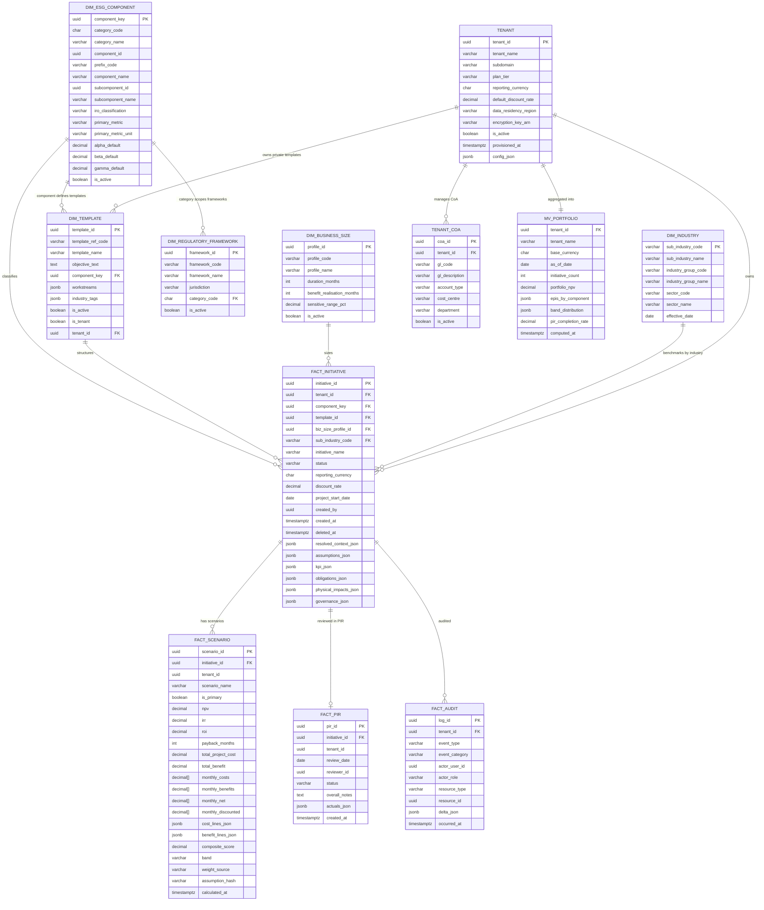

# ESG Business Case Engine — Lean OLAP Database Architecture

**Alternative to:** `ESG_Architecture.md` §9 (3NF OLTP schema)
**Design style:** Star schema · Denormalized dimensions · Wide fact tables · JSONB for sparse / nested attributes · Array columns for time-series

---

## 1. Design Philosophy

The 3NF OLTP schema in the main architecture document is correct for high-concurrency, fine-grained transactional writes. However, the ESG Business Case Engine is **read-heavy and analytically oriented**:

| Observation | Implication |
|---|---|
| An initiative has ~8 assumptions — not 8,000 | Embedding in JSONB is fine; a separate `assumption` table adds join cost without adding value |
| Scenarios are computed in batch, not row-by-row | 60-row `cashflow_entry` per scenario → replace with a 60-element array column |
| Reporting dominates the query workload | Optimize for wide reads, not surgical updates |
| Tenant config changes are infrequent (admin events) | Snapshot config into the initiative at creation time; no runtime join needed |
| Most ESG taxonomy is read-only reference data | Flatten hierarchies into single dimension tables; joins across 3 levels are noise |

**Core principle:** *Capture resolved state at write time; query flat rows at read time.*

The result is **14 objects** (tables + 1 materialized view) versus ~40 in the 3NF design — a 65% reduction — with most dashboard queries touching 2–3 tables rather than 8–10.

---

## 2. Schema at a Glance

```
DIMENSION LAYER (platform-shared, read-only)
  dim_esg_component          ← replaces: esg_category + esg_component + esg_subcomponent
                                          + materiality_definition + epis_weighting_profile (5→1)
  dim_industry               ← replaces: gics_sector + gics_industry_group + gics_sub_industry (3→1)
  dim_template               ← replaces: initiative_template + _workstream + _industry_tag (3→1)
  dim_regulatory_framework   ← 1:1 with existing table (no change)
  dim_business_size          ← 1:1 with existing table (no change)

PLATFORM REFERENCE (platform-shared, append-only)
  assumption_benchmark       ← unchanged
  fx_rate_snapshot           ← unchanged

TENANT LAYER
  tenant                     ← replaces: tenant + tenant_industry_profile
                                          + tenant_materiality_override + tenant_epis_weight_profile
                                          + tenant_epis_band_config + tenant_component_override
                                          + tenant_template_override + tenant_regulatory_scope (8→1)
  tenant_coa                 ← kept separate (large table, needs SQL GL-code lookup)

FACT LAYER
  fact_initiative            ← replaces: esg_initiative + assumption + context_resolution_log
                                          + context_override_log + kpi_measurement
                                          + regulatory_obligation + physical_impact_record
                                          + validation_check + sponsor_recommendation
                                          + remediation_record (10→1)
  fact_scenario              ← replaces: scenario + cashflow_entry + financial_summary
                                          + cost_line + benefit_line + epis_score (6→1)
  fact_pir                   ← replaces: pir_record + pir_actual_entry (2→1)
  fact_audit                 ← simplified audit_log (1→1, delta_json instead of before/after)

AGGREGATION LAYER
  mv_portfolio               ← replaces: portfolio_aggregation + aggregation_run_log (2→1 mat. view)
```

**Object count:**

| Layer | OLTP (3NF) | OLAP (this design) | Reduction |
|---|---|---|---|
| ESG Taxonomy | 5 | 1 | −4 |
| GICS Hierarchy | 3 | 1 | −2 |
| Templates | 3 | 1 | −2 |
| Tenant Config | 8 | 1 | −7 |
| Business Case Core | 10 | 1 | −9 |
| Scenarios / Financials | 6 | 1 | −5 |
| Reporting / Agg | 2 | 1 mat. view | −1 |
| Unchanged / combined | 5 | 7 | +2 |
| **Total** | **~40** | **14** | **−65%** |

---

## 3. Dimension Layer

### 3.1 dim_esg_component

**Purpose:** The master ESG taxonomy dimension. One row per subcomponent — the leaf node of the ESG hierarchy. Category and component names are denormalized into every row so dashboards and selectors never need to join upward. Materiality defaults (what to measure) and platform EPIS weight defaults (how to weight impact / financial / compliance) are embedded, giving the context-resolution engine everything it needs in a single lookup. A component-only row (no subcomponent) has `subcomponent_id IS NULL` and is used when an initiative targets the component level rather than a specific subcomponent.

Flattens the 3-level ESG hierarchy (category → component → subcomponent) plus materiality defaults and platform EPIS weight defaults into a single row per subcomponent. A component-only row has `subcomponent_id IS NULL`.

```sql
CREATE TABLE dim_esg_component (
    component_key           uuid PRIMARY KEY DEFAULT gen_random_uuid(),

    -- Category level
    category_code           char(3)      NOT NULL,
    category_name           varchar(100) NOT NULL,
    category_sort_order     int          NOT NULL,

    -- Component level
    component_id            uuid         NOT NULL,
    prefix_code             varchar(10)  NOT NULL,
    component_name          varchar(150) NOT NULL,
    physical_unit_tracking  boolean      NOT NULL DEFAULT false,
    primary_unit_default    varchar(50),

    -- Subcomponent level (NULL for component-only rows)
    subcomponent_id         uuid,
    subcomponent_name       varchar(200),
    iro_classification      varchar(20),
    impact_direction        varchar(20),
    subcomponent_sort_order int,

    -- Materiality defaults (from materiality_definition)
    primary_metric          varchar(255),
    primary_metric_unit     varchar(50),
    secondary_metric_1      varchar(255),
    secondary_metric_2      varchar(255),

    -- EPIS weight defaults
    alpha_default           decimal(4,3) NOT NULL DEFAULT 0.350,
    beta_default            decimal(4,3) NOT NULL DEFAULT 0.350,
    gamma_default           decimal(4,3) NOT NULL DEFAULT 0.300,

    effective_from          date         NOT NULL DEFAULT '2024-01-01',
    is_active               boolean      NOT NULL DEFAULT true
);

CREATE INDEX idx_dim_esg_component ON dim_esg_component(component_id);
CREATE INDEX idx_dim_esg_subcomponent ON dim_esg_component(subcomponent_id) WHERE subcomponent_id IS NOT NULL;
CREATE INDEX idx_dim_esg_category ON dim_esg_component(category_code);
```

**Sample rows:**

| category_code | category_name | prefix_code | component_name | subcomponent_name | iro_classification | primary_metric | primary_metric_unit | alpha_default | beta_default | gamma_default |
|---|---|---|---|---|---|---|---|---|---|---|
| ECC | Environmental — Climate Change | ECC | Climate Change | Scope 1 — Direct emissions | Risk | Direct emissions avoided | tCO2e/year | 0.350 | 0.250 | 0.400 |
| ECC | Environmental — Climate Change | ECC | Climate Change | Scope 2 — Indirect emissions | Risk | Energy consumption reduction | MWh/year | 0.350 | 0.250 | 0.400 |
| ECC | Environmental — Climate Change | ECC | Climate Change | null (component-only row) | null | null | null | 0.350 | 0.250 | 0.400 |
| SMS | Social — Modern Slavery | SMS | Modern Slavery | Supply chain labour | Impact | Supplier audit score | % compliant | 0.450 | 0.200 | 0.350 |
| GEI | Governance — Ethics & Integrity | GEI | Ethics & Integrity | Anti-bribery controls | Impact | Policy coverage rate | % employees trained | 0.300 | 0.350 | 0.350 |

> The 3-level join `esg_category → esg_component → esg_subcomponent` is replaced by `WHERE component_id = $x`. A single index scan instead of three.

---

### 3.2 dim_industry

**Purpose:** The industry classification dimension. One row per GICS sub-industry — the most granular industry code used for assumption benchmark lookups and initiative tagging. Sector and industry group names are denormalized in, eliminating the two-step join needed in the 3NF schema. The context-resolution engine uses this table at Step 4 (benchmark resolution) to match industry-specific cost and emission benchmarks to the initiative. Acme Logistics maps to `20304010 — Road & Rail` within the `2030 — Transportation` industry group.

Flattens the 3-level GICS hierarchy into a single row per sub-industry.

```sql
CREATE TABLE dim_industry (
    sub_industry_code       varchar(20) PRIMARY KEY,
    sub_industry_name       varchar(200) NOT NULL,

    -- Industry group (denormalized)
    industry_group_code     varchar(10)  NOT NULL,
    industry_group_name     varchar(200) NOT NULL,

    -- Sector (denormalized)
    sector_code             varchar(10)  NOT NULL,
    sector_name             varchar(100) NOT NULL,

    effective_date          date         NOT NULL DEFAULT '2024-01-01'
);

CREATE INDEX idx_dim_industry_group ON dim_industry(industry_group_code);
CREATE INDEX idx_dim_industry_sector ON dim_industry(sector_code);
```

**Sample rows:**

| sub_industry_code | sub_industry_name | industry_group_code | industry_group_name | sector_code | sector_name |
|---|---|---|---|---|---|
| 20304010 | Road & Rail | 2030 | Transportation | 20 | Industrials |
| 20101010 | Air Freight & Logistics | 2010 | Commercial & Professional Services | 20 | Industrials |
| 25201040 | Automotive Retail | 2520 | Retailing | 25 | Consumer Discretionary |
| 55105010 | Electric Utilities | 5510 | Utilities | 55 | Utilities |

---

### 3.3 dim_template

**Purpose:** The initiative template catalogue — both platform-supplied and tenant-private templates live in this single dimension. Workstreams (the ordered task plan) and industry tags (which GICS codes the template is relevant for) are embedded as JSONB arrays because they are display/navigation data read atomically, never filtered row-by-row. The `is_tenant` flag and `tenant_id` column distinguish private templates from platform ones without needing a separate table. Every tenant-private template must carry a valid `template_ref_code` derived from a platform template — this enforces the context-resolution engine's anchor point requirement.

Flattens template header, workstreams, and industry tags into one row. Workstreams and tags are JSONB arrays — they are display/navigation data, never queried for filtering.

```sql
CREATE TABLE dim_template (
    template_id             uuid         PRIMARY KEY DEFAULT gen_random_uuid(),
    template_ref_code       varchar(50)  NOT NULL UNIQUE,
    template_name           varchar(255) NOT NULL,
    objective_text          text,
    component_key           uuid         NOT NULL REFERENCES dim_esg_component(component_key),

    -- Replaces initiative_template_workstream (array of objects)
    workstreams             jsonb        NOT NULL DEFAULT '[]',
    -- [{"name": "Fleet audit", "sort_order": 1}, ...]

    -- Replaces initiative_template_industry_tag (array of objects)
    industry_tags           jsonb        NOT NULL DEFAULT '[]',
    -- [{"gics_level": "sub_industry", "gics_code": "20304010"}, ...]

    is_active               boolean      NOT NULL DEFAULT true,
    is_tenant               boolean      NOT NULL DEFAULT false,
    tenant_id               uuid,        -- NULL for platform templates
    effective_from          date         NOT NULL DEFAULT '2024-01-01'
);

CREATE INDEX idx_dim_template_component ON dim_template(component_key, is_active);
CREATE INDEX idx_dim_template_tenant ON dim_template(tenant_id) WHERE tenant_id IS NOT NULL;
```

**Sample rows:**

| template_ref_code | template_name | component (prefix) | is_tenant | workstreams (summary) | industry_tags (summary) |
|---|---|---|---|---|---|
| ECC-045 | Fleet Electrification | ECC | false | Fleet audit, EV transition plan, Charging infra, Reporting | Road & Rail (20304010) |
| ECC-031 | Building Energy Efficiency | ECC | false | Energy audit, Retrofit plan, NABERS rating | Electric Utilities (55105010) |
| SMS-012 | Modern Slavery Risk Assessment | SMS | false | Supplier mapping, Risk scoring, Remediation plan | All industries |
| ECC-045-ACME | Acme Fleet EV — Heavy Vehicles | ECC | true | Fleet audit, Heavy-vehicle EV sourcing, Depot power upgrade | Road & Rail (20304010) |

---

### 3.4 dim_regulatory_framework

**Purpose:** The catalogue of all ESG regulatory frameworks the platform knows about. Used at Step 7 of context resolution to pre-populate obligation rows on a new initiative, matched against the tenant's `regulatory_scope` list in `config_json`. Kept as a flat table — there is no hierarchy to denormalize.

Structurally unchanged from the OLTP design; kept flat (no hierarchy to denormalize).

```sql
CREATE TABLE dim_regulatory_framework (
    framework_id    uuid         PRIMARY KEY DEFAULT gen_random_uuid(),
    framework_code  varchar(30)  NOT NULL UNIQUE,
    framework_name  varchar(255) NOT NULL,
    jurisdiction    varchar(100),
    category_code   char(3)      REFERENCES dim_esg_component(category_code),
    is_active       boolean      NOT NULL DEFAULT true
);
```

**Sample rows:**

| framework_code | framework_name | jurisdiction | category_code |
|---|---|---|---|
| NGER | National Greenhouse and Energy Reporting Act | Australia | ECC |
| TCFD | Task Force on Climate-related Financial Disclosures | Global | ECC |
| ASX-CGC-P7 | ASX Corporate Governance Principles — Principle 7 | Australia | GEI |
| CSRD | Corporate Sustainability Reporting Directive | EU | ECC |
| MSSS | Modern Slavery Act — Supply Chain Statement | Australia | SMS |

---

### 3.5 dim_business_size

**Purpose:** Defines the standard project duration profiles used to size a business case model. The profile determines how many months the cashflow model runs (`duration_months`) and when benefit realisation starts (`benefit_realisation_months`). The context-resolution engine selects the appropriate profile at Step 3 based on the initiative's scale. The `sensitive_range_pct` is used by the financial engine to flag assumption values that deviate significantly from the benchmark.

Structurally unchanged.

```sql
CREATE TABLE dim_business_size (
    profile_id                  uuid        PRIMARY KEY DEFAULT gen_random_uuid(),
    profile_code                varchar(30) NOT NULL UNIQUE,
    profile_name                varchar(100) NOT NULL,
    duration_months             int         NOT NULL,
    benefit_realisation_months  int         NOT NULL,
    sensitive_range_pct         decimal(5,4),
    is_active                   boolean     NOT NULL DEFAULT true
);
```

**Sample rows:**

| profile_code | profile_name | duration_months | benefit_realisation_months | sensitive_range_pct |
|---|---|---|---|---|
| SME-24 | Small business — 2-year model | 24 | 4 | 0.1500 |
| MID-MARKET-36 | Mid-market — 3-year model | 36 | 7 | 0.1000 |
| ENTERPRISE-60 | Enterprise — 5-year model | 60 | 9 | 0.0750 |

> Acme's fleet initiative uses `MID-MARKET-36`: 36 months duration, benefits start month 7 (after EV delivery and charging infrastructure setup).

---

## 4. Tenant Layer

### 4.1 tenant

**Purpose:** The single record of truth for a company's identity and all configuration that governs how ESG initiatives are built and scored within that company. All overrides that were spread across 7 separate tables in the 3NF design — materiality metric overrides, EPIS weight profiles, EPIS band thresholds, hidden components, disabled templates, regulatory scope — are consolidated into a single `config_json` blob. This is deliberate: tenant config is always read atomically when an initiative is created, and it changes only on admin events (a few times per month). The blob is **snapshotted into `fact_initiative.resolved_context_json` at creation time**, so no dashboard or reporting query ever needs to join back to this table.

The single tenant-config table. All overrides that were spread across 7 separate tables in the OLTP design are consolidated into `config_json`. The config blob is **snapshotted into the initiative fact at creation time** — so reporting queries never join back to this table for resolved values.

```sql
CREATE TABLE tenant (
    tenant_id               uuid         PRIMARY KEY DEFAULT gen_random_uuid(),
    tenant_name             varchar(255) NOT NULL,
    subdomain               varchar(100) NOT NULL UNIQUE,
    plan_tier               varchar(20)  NOT NULL DEFAULT 'starter'
        CHECK (plan_tier IN ('starter','professional','enterprise')),
    reporting_currency      char(3)      NOT NULL,
    default_discount_rate   decimal(5,4) NOT NULL DEFAULT 0.0700,
    data_residency_region   varchar(30),
    encryption_key_arn      varchar(500),
    is_active               boolean      NOT NULL DEFAULT true,
    provisioned_at          timestamptz  NOT NULL DEFAULT now(),

    -- ─────────────────────────────────────────────────────────────────────────
    -- config_json replaces 7 separate config tables:
    --   tenant_industry_profile, tenant_materiality_override,
    --   tenant_epis_weight_profile, tenant_epis_band_config,
    --   tenant_component_override, tenant_template_override,
    --   tenant_regulatory_scope
    -- ─────────────────────────────────────────────────────────────────────────
    config_json             jsonb        NOT NULL DEFAULT '{}'
);

-- GIN index allows querying inside config_json when needed
CREATE INDEX idx_tenant_config ON tenant USING GIN (config_json);
```

**`config_json` schema (annotated example for Acme Logistics):**

```json
{
  "industry_profile": {
    "primary_sub_industry_code": "20304010",
    "secondary_industries": ["20101010"]
  },
  "materiality_overrides": [
    {
      "subcomponent_id": "...",
      "primary_metric": "Direct emissions avoided",
      "primary_metric_unit": "tCO2e/year",
      "effective_from": "2026-01-01",
      "set_by": "admin-uuid"
    }
  ],
  "epis_weight_profiles": [
    {
      "component_id": "...",
      "alpha": 0.450,
      "beta": 0.150,
      "gamma": 0.400,
      "rationale": "NGER Act compliance is primary driver for Acme",
      "effective_from": "2026-01-01",
      "set_by": "admin-uuid"
    }
  ],
  "epis_band_config": {
    "low_max": 0.300,
    "medium_max": 0.600,
    "high_max": 0.850,
    "effective_from": "2026-01-01",
    "set_by": "admin-uuid"
  },
  "hidden_component_ids": [],
  "disabled_template_ids": [],
  "regulatory_scope": ["framework-uuid-NGER", "framework-uuid-TCFD", "framework-uuid-ASX"]
}
```

**Sample row (Acme Logistics):**

| tenant_name | subdomain | plan_tier | reporting_currency | default_discount_rate | data_residency_region |
|---|---|---|---|---|---|
| Acme Logistics Pty Ltd | acme | professional | AUD | 0.0700 | AP-SOUTHEAST-2 |

> **Why JSONB for config and not separate rows?**
> Tenant config changes are rare (admin events, a few per month). The config is always read as a whole blob when an initiative is created. Separate tables add 6 joins and 6 RLS policies for data that is inherently an atomic configuration object.
>
> The trade-off: you cannot run `SELECT * FROM tenant_epis_weight_profile WHERE effective_from > '2026-01-01'` directly. Use `jsonb_array_elements` for such queries — they are infrequent admin queries, not hot paths.

---

### 4.2 tenant_coa

**Purpose:** Acme's full Chart of Accounts — the list of GL codes that every cost and benefit line on every initiative must reference. Kept as a relational table because the CoA can have 10,000+ rows per tenant and analysts query individual GL codes by account type and cost centre during initiative building. A JSONB array inside `tenant.config_json` would make these lookups O(n) scans; a B-tree index on `(tenant_id, gl_code)` makes them O(log n). The `cost_centre` and `department` columns let analysts filter the CoA to codes relevant to their program area.

Kept as a relational table. Unlike config overrides, the CoA can have 10,000+ rows per tenant and analysts query individual GL codes during initiative building — SQL index lookups are the right tool here.

```sql
CREATE TABLE tenant_coa (
    coa_id          uuid        PRIMARY KEY DEFAULT gen_random_uuid(),
    tenant_id       uuid        NOT NULL REFERENCES tenant(tenant_id),
    gl_code         varchar(20) NOT NULL,
    gl_description  varchar(255) NOT NULL,
    account_type    varchar(20) NOT NULL CHECK (account_type IN ('OPEX','CAPEX','REVENUE','ASSET')),
    cost_centre     varchar(50),
    department      varchar(50),
    is_active       boolean     NOT NULL DEFAULT true,
    UNIQUE (tenant_id, gl_code)
);
CREATE INDEX idx_coa_lookup ON tenant_coa(tenant_id, is_active, account_type);
CREATE INDEX idx_coa_costcentre ON tenant_coa(tenant_id, cost_centre) WHERE cost_centre IS NOT NULL;
```

**Sample rows (Acme Logistics — AUS-OPS cost centre):**

| gl_code | gl_description | account_type | cost_centre | department | is_active |
|---|---|---|---|---|---|
| 125000 | Government Grants & Rebates | REVENUE | AUS-OPS | Fleet | true |
| 311100 | Permanent Staff — Fleet Operations | OPEX | AUS-OPS | Fleet | true |
| 346100 | Vehicle Running Costs — Fuel & Maintenance | OPEX | AUS-OPS | Fleet | true |
| 488300 | Fleet Asset Purchases | CAPEX | AUS-OPS | Fleet | true |
| 541000 | Outsourced Maintenance Contracts | OPEX | AUS-OPS | Fleet | true |

---

## 5. Fact Layer

### 5.1 fact_initiative

**Purpose:** The central fact in the star schema — one wide row per ESG business case. Everything that in the 3NF design was spread across 10 separate tables is captured here: the initiative's identity and lifecycle status, the full resolved context snapshot (EPIS weights, band thresholds, benchmark values, regulatory frameworks — all locked at creation time), analyst-entered assumptions with benchmark comparisons, the KPI measurement plan, regulatory obligations and their compliance status, physical impact targets, and the complete governance trail (all validations and the sponsor recommendation). JSONB columns replace the satellite tables; they are read atomically when the initiative page loads and written in single session saves.

The core wide fact table. Captures everything about an initiative — its identity, resolved context (snapshotted at creation), assumptions, KPIs, obligations, governance state — in a single row with JSONB columns for array/nested data.

**Replaces 10 OLTP tables** with 1 wide row per initiative.

```sql
CREATE TABLE fact_initiative (
    initiative_id           uuid         PRIMARY KEY DEFAULT gen_random_uuid(),
    tenant_id               uuid         NOT NULL REFERENCES tenant(tenant_id),

    -- ── Dimension FKs ─────────────────────────────────────────────────────────
    component_key           uuid         NOT NULL REFERENCES dim_esg_component(component_key),
    template_id             uuid         REFERENCES dim_template(template_id),
    biz_size_profile_id     uuid         REFERENCES dim_business_size(profile_id),
    sub_industry_code       varchar(20)  REFERENCES dim_industry(sub_industry_code),

    -- ── Initiative identity ───────────────────────────────────────────────────
    initiative_name         varchar(255) NOT NULL,
    status                  varchar(30)  NOT NULL DEFAULT 'draft'
        CHECK (status IN ('draft','under-review','validated','recommended','rejected','archived')),
    reporting_currency      char(3)      NOT NULL,
    discount_rate           decimal(5,4) NOT NULL,
    project_start_date      date,
    created_by              uuid         NOT NULL,
    created_at              timestamptz  NOT NULL DEFAULT now(),
    updated_at              timestamptz  NOT NULL DEFAULT now(),
    deleted_at              timestamptz,

    -- ── Resolved context snapshot ─────────────────────────────────────────────
    -- Captured at creation time from context-resolution engine.
    -- Reporting queries NEVER join back to tenant.config_json for these values.
    resolved_context_json   jsonb        NOT NULL DEFAULT '{}',
    -- {
    --   "alpha": 0.450, "beta": 0.150, "gamma": 0.400,
    --   "weight_source": "tenant",
    --   "epis_bands": {"low_max": 0.3, "medium_max": 0.6, "high_max": 0.85},
    --   "regulatory_frameworks": [{"id": "...", "code": "NGER"}, ...],
    --   "coa_scope": {"filter_type": "cost_centre", "values": ["AUS-OPS"]},
    --   "benchmarks": [{"metric": "diesel_price", "value": 2.10, "unit": "AUD/L", "confidence": "high"}],
    --   "resolution_steps": [
    --     {"step": 1, "name": "ESG Component", "resolved_value": "...", "source": "platform"},
    --     {"step": 2, "name": "Materiality", "resolved_value": "...", "source": "tenant"},
    --     ...
    --   ]
    -- }

    -- ── Assumptions ───────────────────────────────────────────────────────────
    -- Replaces the assumption table (typically 8–15 rows per initiative).
    assumptions_json        jsonb        NOT NULL DEFAULT '[]',
    -- [
    --   {
    --     "name": "Diesel price", "value": 2.15, "unit": "AUD/L",
    --     "benchmark_value": 2.10, "benchmark_source": "platform-cross-industry",
    --     "is_override": true, "override_reason": "12-month Acme BP Fuel Card average"
    --   }, ...
    -- ]

    -- ── KPI plan ──────────────────────────────────────────────────────────────
    -- Replaces kpi_measurement table.
    kpi_json                jsonb        NOT NULL DEFAULT '[]',
    -- [
    --   {
    --     "metric": "Direct emissions avoided", "unit": "tCO2e/year",
    --     "target": 2850.0, "frequency": "quarterly",
    --     "source": "Fleet telematics + NGER calculator", "metric_source": "platform"
    --   }, ...
    -- ]

    -- ── Regulatory obligations ────────────────────────────────────────────────
    -- Replaces regulatory_obligation table.
    obligations_json        jsonb        NOT NULL DEFAULT '[]',
    -- [
    --   {
    --     "framework_id": "...", "framework_code": "NGER",
    --     "obligation_text": "Report Scope 1 emissions under NGER Act s.19",
    --     "compliance_status": "in-progress",
    --     "reviewer_id": "...", "reviewed_at": "2026-05-15T00:00:00Z", "notes": "..."
    --   }, ...
    -- ]

    -- ── Physical impacts ─────────────────────────────────────────────────────
    -- Replaces physical_impact_record table.
    physical_impacts_json   jsonb        NOT NULL DEFAULT '[]',
    -- [
    --   {
    --     "metric": "Direct fleet Scope 1 emissions", "unit": "tCO2e/year",
    --     "baseline": 3420.0, "target": 570.0, "reported": null,
    --     "period_start": "2026-07-01", "period_end": "2027-06-30"
    --   }, ...
    -- ]

    -- ── Governance state ──────────────────────────────────────────────────────
    -- Replaces validation_check + sponsor_recommendation + remediation_record.
    governance_json         jsonb        NOT NULL DEFAULT '{}',
    -- {
    --   "dual_approval_required": true,
    --   "dual_approval_threshold": 500000.00,
    --   "validations": [
    --     {
    --       "type": "self", "validator_id": "...", "status": "passed",
    --       "issues": null, "notes": "2 overrides flagged", "validated_at": "2026-05-10T..."
    --     },
    --     {
    --       "type": "independent", "validator_id": "...", "status": "challenged",
    --       "issues": {"carbon_credit_price": "exceeds benchmark by 14%"},
    --       "validated_at": "2026-05-12T..."
    --     }
    --   ],
    --   "recommendation": {
    --     "version": 2, "sponsor_id": "...", "decision": "approved",
    --     "rationale": "NGER Act compliance mandatory from FY27...",
    --     "override_count": 1, "created_at": "2026-05-20T..."
    --   }
    -- }
);

-- RLS
ALTER TABLE fact_initiative ENABLE ROW LEVEL SECURITY;
CREATE POLICY tenant_isolation ON fact_initiative
  USING (tenant_id = current_setting('app.current_tenant')::uuid);

-- Indexes
CREATE INDEX idx_fi_tenant_status ON fact_initiative(tenant_id, status, created_at DESC);
CREATE INDEX idx_fi_component ON fact_initiative(tenant_id, component_key);
CREATE INDEX idx_fi_template ON fact_initiative(template_id);
CREATE INDEX idx_fi_active ON fact_initiative(tenant_id) WHERE deleted_at IS NULL;
CREATE INDEX idx_fi_assumptions ON fact_initiative USING GIN (assumptions_json);
CREATE INDEX idx_fi_obligations ON fact_initiative USING GIN (obligations_json);
CREATE INDEX idx_fi_governance ON fact_initiative USING GIN (governance_json);
```

**Sample row — scalar columns (Acme fleet initiative):**

| initiative_name | status | reporting_currency | discount_rate | project_start_date | created_by |
|---|---|---|---|---|---|
| AUS Fleet Electrification — Phase 1 (50 vehicles) | recommended | AUD | 0.0850 | 2026-07-01 | sarah.chen (uuid) |

**resolved_context_json (condensed):**
```json
{
  "alpha": 0.450, "beta": 0.150, "gamma": 0.400, "weight_source": "tenant",
  "epis_bands": { "low_max": 0.300, "medium_max": 0.600, "high_max": 0.850 },
  "regulatory_frameworks": [
    { "code": "NGER", "name": "National Greenhouse and Energy Reporting Act" },
    { "code": "TCFD", "name": "Task Force on Climate-related Financial Disclosures" }
  ],
  "coa_scope": { "filter_type": "cost_centre", "values": ["AUS-OPS"] },
  "benchmarks": [
    { "metric": "diesel_price_aud_per_litre", "value": 2.10, "source": "platform-cross-industry" },
    { "metric": "ev_energy_kwh_per_100km",    "value": 60.0, "source": "platform-sub-industry" }
  ]
}
```

**assumptions_json (condensed):**
```json
[
  { "name": "Number of vehicles converted",    "value": 50,    "unit": "vehicles",    "benchmark_value": null,  "is_override": false },
  { "name": "Diesel price",                    "value": 2.15,  "unit": "AUD/L",       "benchmark_value": 2.10,  "is_override": true,
    "override_reason": "12-month average from Acme BP Fuel Card data" },
  { "name": "Carbon credit price",             "value": 32.00, "unit": "AUD/tCO2e",   "benchmark_value": 28.00, "is_override": true,
    "override_reason": "Current ACCU spot price as at June 2026" }
]
```

**governance_json (condensed):**
```json
{
  "dual_approval_required": true,
  "dual_approval_threshold": 500000.00,
  "validations": [
    { "type": "self",        "status": "passed",    "validated_at": "2026-05-10", "notes": "2 overrides flagged" },
    { "type": "independent", "status": "challenged","validated_at": "2026-05-12",
      "issues": { "carbon_credit_price": "Analyst value $32 exceeds benchmark $28 by 14%" } }
  ],
  "recommendation": {
    "version": 2, "decision": "approved", "override_count": 1,
    "rationale": "NGER Act compliance mandatory from FY27. Negative NPV offset by Critical EPIS band.",
    "created_at": "2026-05-20"
  }
}
```

---

### 5.2 fact_scenario

**Purpose:** One row per named model run (base, optimistic, pessimistic) for an initiative. The financial model output — NPV, IRR, ROI, payback — is stored inline alongside the 60-month cashflow arrays and the EPIS composite score. Storing cashflows as PostgreSQL decimal arrays eliminates the 60-row `cashflow_entry` satellite table; a single row fetch gives all months. The cost and benefit line breakdown (which GL codes, what account type, what monthly amounts) is embedded in JSONB. The EPIS score and band are inlined so portfolio dashboards can report on scoring without any additional join. The `assumption_hash` allows the financial engine to skip recalculation when inputs are unchanged.

One row per named scenario (base / optimistic / pessimistic). Monthly cashflows stored as PostgreSQL arrays — 60 elements, indexed by month number. Cost and benefit line detail stored as JSONB arrays. EPIS score inlined (no separate `epis_score` table join needed).

**Replaces 6 OLTP tables** with 1 row per scenario.

```sql
CREATE TABLE fact_scenario (
    scenario_id             uuid        PRIMARY KEY DEFAULT gen_random_uuid(),
    initiative_id           uuid        NOT NULL REFERENCES fact_initiative(initiative_id),
    tenant_id               uuid        NOT NULL,
    scenario_name           varchar(20) NOT NULL
        CHECK (scenario_name IN ('base','optimistic','pessimistic','custom')),
    is_primary              boolean     NOT NULL DEFAULT false,
    assumption_hash         varchar(64),
    calculated_at           timestamptz,

    -- ── Financial summary ─────────────────────────────────────────────────────
    -- Replaces financial_summary table (was a separate row joined to scenario).
    npv                     decimal(15,2),
    irr                     decimal(8,6),
    roi                     decimal(8,4),
    payback_months          int,
    total_project_cost      decimal(15,2),
    total_benefit           decimal(15,2),

    -- ── Monthly cashflows as arrays ───────────────────────────────────────────
    -- Replaces cashflow_entry table (was 60 rows per scenario).
    -- Array index 0 = month 1, index 59 = month 60.
    monthly_costs           decimal(15,2)[] NOT NULL DEFAULT '{}',
    monthly_benefits        decimal(15,2)[] NOT NULL DEFAULT '{}',
    monthly_net             decimal(15,2)[] NOT NULL DEFAULT '{}',
    monthly_discounted      decimal(15,2)[] NOT NULL DEFAULT '{}',
    monthly_cumulative      decimal(15,2)[] NOT NULL DEFAULT '{}',

    -- ── Cost and benefit line detail ──────────────────────────────────────────
    -- Replaces cost_line + benefit_line tables.
    cost_lines_json         jsonb       NOT NULL DEFAULT '[]',
    -- [
    --   {
    --     "name": "EV purchase — 50 vehicles", "gl_code": "488300",
    --     "account_type": "CAPEX", "monthly_amounts": [4750000.00, 0, 0, ...]
    --   }, ...
    -- ]
    benefit_lines_json      jsonb       NOT NULL DEFAULT '[]',
    -- [
    --   {
    --     "name": "Fuel cost reduction", "gl_code": "346100",
    --     "benefit_type": "cost-saving", "monthly_amounts": [0, 0, 0, 0, 0, 0, 28500.00, ...]
    --   }, ...
    -- ]

    -- ── EPIS score ────────────────────────────────────────────────────────────
    -- Replaces epis_score table.
    impact_score            decimal(5,3),
    financial_score         decimal(5,3),
    compliance_score        decimal(5,3),
    composite_score         decimal(5,3),
    alpha_used              decimal(4,3),
    beta_used               decimal(4,3),
    gamma_used              decimal(4,3),
    weight_source           varchar(20) CHECK (weight_source IN ('platform','tenant')),
    band                    varchar(20) CHECK (band IN ('Low','Medium','High','Critical')),

    UNIQUE (initiative_id, scenario_name)
);

ALTER TABLE fact_scenario ENABLE ROW LEVEL SECURITY;
CREATE POLICY tenant_isolation ON fact_scenario
  USING (tenant_id = current_setting('app.current_tenant')::uuid);

CREATE INDEX idx_fs_initiative ON fact_scenario(initiative_id, is_primary);
CREATE INDEX idx_fs_band ON fact_scenario(tenant_id, band) WHERE is_primary;
```

**Sample rows — scalar columns (fleet initiative, 3 scenarios):**

| scenario_name | is_primary | npv | irr | roi | payback_months | total_project_cost | total_benefit | composite_score | band |
|---|---|---|---|---|---|---|---|---|---|
| base | true | -3741000.00 | null | -0.7439 | null | 5030000.00 | 1476000.00 | 0.826 | Critical |
| optimistic | false | -2980000.00 | null | -0.5920 | null | 5030000.00 | 1890000.00 | 0.851 | Critical |
| pessimistic | false | -4120000.00 | null | -0.8420 | null | 5030000.00 | 1095000.00 | 0.791 | High |

**monthly_net array (base scenario — selected positions, 1-indexed):**
```
[1]  = -4886500.00  (month 1: full capital outlay)
[2]  = -6500.00     (months 2–6: running costs only)
[7]  =  32800.00    (month 7: first benefit month)
[36] =  32800.00    (month 36: final month)
```

**cost_lines_json (base scenario, condensed):**
```json
[
  { "name": "EV purchase — 50 vehicles", "gl_code": "488300", "account_type": "CAPEX",
    "monthly_amounts": [4750000.00, 0, 0, 0, 0, 0, 0, "...x30"] },
  { "name": "Government EV rebates",     "gl_code": "125000", "account_type": "CAPEX",
    "monthly_amounts": [-150000.00, 0, 0, "...x33"] },
  { "name": "Fleet Manager (0.5 FTE)",   "gl_code": "311100", "account_type": "OPEX",
    "monthly_amounts": [4500.00, 4500.00, "...x34"] }
]
```

**Cashflow access pattern:**

```sql
-- OLTP: 60-row join
SELECT month_number, net_cashflow
FROM cashflow_entry
WHERE scenario_id = $sid
ORDER BY month_number;

-- OLAP: array unnest — single row fetch
SELECT
    generate_series(1, 60) AS month_number,
    unnest(monthly_net)    AS net_cashflow
FROM fact_scenario
WHERE scenario_id = $sid;
```

---

### 5.3 fact_pir

**Purpose:** The post-implementation review record opened 12 months after an initiative is approved. One row per review per initiative. The actuals comparison — modelled value vs. measured actual for each KPI, with variance and a flag for whether the actual is good enough to promote as a new benchmark — is stored as a JSONB array. This keeps the PIR as a single row fetch on the initiative detail page. Rows with `promote_to_benchmark = true` in `actuals_json` are surfaced to the Tenant Administrator as benchmark promotion candidates, improving the accuracy of future initiatives in the same industry.

Post-implementation review with actuals embedded as a JSONB array. Replaces `pir_record + pir_actual_entry` (2 tables → 1 row per review).

```sql
CREATE TABLE fact_pir (
    pir_id          uuid        PRIMARY KEY DEFAULT gen_random_uuid(),
    initiative_id   uuid        NOT NULL REFERENCES fact_initiative(initiative_id),
    tenant_id       uuid        NOT NULL,
    review_date     date        NOT NULL,
    reviewer_id     uuid        NOT NULL,
    status          varchar(20) NOT NULL DEFAULT 'draft'
        CHECK (status IN ('draft','submitted','closed')),
    overall_notes   text,
    created_at      timestamptz NOT NULL DEFAULT now(),

    -- Replaces pir_actual_entry table.
    actuals_json    jsonb       NOT NULL DEFAULT '[]'
    -- [
    --   {
    --     "metric": "Direct emissions avoided (tCO2e/year)",
    --     "modelled": 2850.0, "actual": 3020.0,
    --     "variance_pct": 5.96, "variance_note": "Tracking ahead of model",
    --     "promote_to_benchmark": true
    --   }, ...
    -- ]
);

ALTER TABLE fact_pir ENABLE ROW LEVEL SECURITY;
CREATE POLICY tenant_isolation ON fact_pir
  USING (tenant_id = current_setting('app.current_tenant')::uuid);

CREATE INDEX idx_pir_initiative ON fact_pir(initiative_id);
CREATE INDEX idx_pir_promotable ON fact_pir USING GIN (actuals_json)
  WHERE status = 'closed';
```

**Sample row (fleet initiative PIR — July 2027):**

| review_date | status | overall_notes |
|---|---|---|
| 2027-07-01 | submitted | Phase 1 fleet conversion complete. Emissions tracking ahead of model. Fuel saving slightly below due to higher depot charging tariff. |

**actuals_json:**
```json
[
  {
    "metric": "Direct emissions avoided (tCO2e/year)",
    "modelled": 2850.0, "actual": 3020.0, "variance_pct": 5.96,
    "variance_note": "Tracking ahead of model — additional 4 vehicles converted ahead of schedule",
    "promote_to_benchmark": true
  },
  {
    "metric": "Fuel cost reduction (AUD/year)",
    "modelled": 342000.0, "actual": 298000.0, "variance_pct": -12.87,
    "variance_note": "Depot charging tariff higher than benchmark (28c vs 22c/kWh)",
    "promote_to_benchmark": true
  },
  {
    "metric": "EV energy consumption (kWh/100km)",
    "modelled": 58.0, "actual": 61.5, "variance_pct": 6.03,
    "variance_note": "Heavy payload routes consume more than light-vehicle benchmark",
    "promote_to_benchmark": true
  }
]
```

---

### 5.4 fact_audit

**Purpose:** Immutable append-only record of every significant action in the system. No role has UPDATE or DELETE permission on this table. Partitioned monthly for query performance; archived to S3 Parquet after 90 days; retained for 7 years for regulatory compliance. Simplified from the 3NF version: instead of storing the full `before_state` and `after_state` JSON blobs (two large columns), the OLAP design stores only `delta_json` — the diff (which fields changed, from what value, to what value, and why). This halves storage for audit rows while preserving the information actually needed for review and compliance.

Simplified from the OLTP version. `before_state + after_state` (two full JSON blobs) replaced by `delta_json` (just the diff). Retains monthly partitioning.

```sql
CREATE TABLE fact_audit (
    log_id          uuid         NOT NULL DEFAULT gen_random_uuid(),
    tenant_id       uuid         NOT NULL,
    event_type      varchar(100) NOT NULL,
    event_category  varchar(30)  NOT NULL
        CHECK (event_category IN ('tenancy','config','business-case','governance','security')),
    actor_user_id   uuid,
    actor_role      varchar(50),
    resource_type   varchar(100),
    resource_id     uuid,
    delta_json      jsonb,
    -- {"field": "carbon_credit_price", "from": 28.00, "to": 32.00, "reason": "..."}
    ip_address      inet,
    occurred_at     timestamptz  NOT NULL DEFAULT now()
) PARTITION BY RANGE (occurred_at);

-- Monthly partitions
CREATE TABLE fact_audit_2026_01 PARTITION OF fact_audit
  FOR VALUES FROM ('2026-01-01') TO ('2026-02-01');
-- ... (create via partition management job)

CREATE INDEX idx_audit_tenant ON fact_audit(tenant_id, occurred_at);
CREATE INDEX idx_audit_resource ON fact_audit(resource_id, occurred_at) WHERE resource_id IS NOT NULL;
```

**Sample rows:**

| event_type | event_category | actor_role | resource_type | delta_json (condensed) | occurred_at |
|---|---|---|---|---|---|
| epis_weight_profile_updated | config | tenant-admin | tenant | `{"field":"epis_weight_profiles[ECC].gamma","from":0.300,"to":0.400,"reason":"NGER Act compliance driver"}` | 2026-01-15 09:12 UTC |
| initiative_assumption_changed | business-case | esg-analyst | fact_initiative | `{"field":"assumptions[carbon_credit_price].value","from":28.00,"to":32.00,"reason":"Current ACCU spot price"}` | 2026-04-22 14:35 UTC |
| sponsor_recommendation_created | governance | sponsor | fact_initiative | `{"field":"governance.recommendation","to":{"version":2,"decision":"approved"}}` | 2026-05-20 11:00 UTC |
| coa_upload_committed | config | tenant-admin | tenant_coa | `{"rows_accepted":841,"rows_rejected":3}` | 2026-01-12 10:01 UTC |

---

## 6. Aggregation Layer

### 6.1 mv_portfolio (Materialized View)

**Purpose:** The pre-computed portfolio summary that the CEO dashboard and group reporting consumers read. Replaces the `portfolio_aggregation` table + the nightly aggregation worker service with a PostgreSQL materialized view refreshed via `REFRESH MATERIALIZED VIEW CONCURRENTLY`. No application code is needed for the aggregation logic — the view definition is the logic. It rolls up every active initiative per tenant into portfolio NPV, EPIS scores by component, band distribution, and PIR completion rate. Refreshed nightly by EventBridge and on-demand (rate-limited to once per 15 minutes) when an initiative status changes to `recommended`. The `CONCURRENTLY` option means reads continue during refresh — no lock on the view.

Replaces `portfolio_aggregation` (a pre-computed table written by a nightly batch worker) with a PostgreSQL materialized view. Refresh is triggered on demand or on a schedule — no separate aggregation worker code needed.

```sql
CREATE MATERIALIZED VIEW mv_portfolio AS
WITH primary_scores AS (
    SELECT
        fi.tenant_id,
        fi.initiative_id,
        fi.status,
        fi.component_key,
        fs.npv,
        fs.composite_score,
        fs.band,
        dc.prefix_code AS component_prefix
    FROM fact_initiative fi
    JOIN fact_scenario   fs ON fi.initiative_id = fs.initiative_id AND fs.is_primary
    JOIN dim_esg_component dc ON fi.component_key = dc.component_key
    WHERE fi.deleted_at IS NULL
),
pir_stats AS (
    SELECT
        fi.tenant_id,
        COUNT(fp.pir_id)                                      AS total_pirs,
        COUNT(fp.pir_id) FILTER (WHERE fp.status = 'closed') AS closed_pirs
    FROM fact_initiative fi
    LEFT JOIN fact_pir fp ON fi.initiative_id = fp.initiative_id
    WHERE fi.deleted_at IS NULL
    GROUP BY fi.tenant_id
)
SELECT
    t.tenant_id,
    t.tenant_name,
    t.reporting_currency                                       AS base_currency,
    CURRENT_DATE                                               AS as_of_date,

    COUNT(ps.initiative_id) FILTER (WHERE ps.status != 'archived')
                                                               AS initiative_count,

    SUM(ps.npv) FILTER (WHERE ps.status = 'recommended')      AS portfolio_npv,

    -- EPIS by component: {"ECC": 0.826, "SMS": 0.0, "GEI": 0.0}
    jsonb_object_agg(
        ps.component_prefix,
        ROUND(AVG(ps.composite_score)::numeric, 3)
    ) FILTER (WHERE ps.composite_score IS NOT NULL)            AS epis_by_component,

    -- Band counts: {"Critical": 1, "High": 0, "Medium": 0, "Low": 0}
    jsonb_build_object(
        'Critical', COUNT(*) FILTER (WHERE ps.band = 'Critical'),
        'High',     COUNT(*) FILTER (WHERE ps.band = 'High'),
        'Medium',   COUNT(*) FILTER (WHERE ps.band = 'Medium'),
        'Low',      COUNT(*) FILTER (WHERE ps.band = 'Low')
    )                                                          AS band_distribution,

    ROUND(
        p.closed_pirs::decimal / NULLIF(p.total_pirs, 0), 4
    )                                                          AS pir_completion_rate,

    now()                                                      AS computed_at

FROM tenant t
LEFT JOIN primary_scores ps ON t.tenant_id = ps.tenant_id
LEFT JOIN pir_stats       p  ON t.tenant_id = p.tenant_id
WHERE t.is_active
GROUP BY t.tenant_id, t.tenant_name, t.reporting_currency, p.closed_pirs, p.total_pirs;

CREATE UNIQUE INDEX ON mv_portfolio(tenant_id);

-- Refresh command (called by EventBridge nightly, or on-demand via API):
-- REFRESH MATERIALIZED VIEW CONCURRENTLY mv_portfolio;
```

> `CONCURRENTLY` allows reads to continue during refresh — no lock on the view. Requires the unique index above.

**Sample row (Acme Logistics — 2026-06-08):**

| tenant_name | base_currency | initiative_count | portfolio_npv | epis_by_component | band_distribution | pir_completion_rate |
|---|---|---|---|---|---|---|
| Acme Logistics Pty Ltd | AUD | 1 | -3741000.00 | `{"ECC": 0.826}` | `{"Critical":1,"High":0,"Medium":0,"Low":0}` | 0.0000 |

---

## 7. Key Indexes Summary

```sql
-- ─── Dimension lookups ────────────────────────────────────────────────────────
CREATE INDEX ON dim_esg_component(component_id);
CREATE INDEX ON dim_esg_component(category_code);
CREATE INDEX ON dim_industry(industry_group_code);
CREATE INDEX ON dim_template(component_key, is_active);

-- ─── Tenant config (GIN for JSONB path queries) ───────────────────────────────
CREATE INDEX ON tenant USING GIN (config_json);

-- ─── Initiative (hot path) ───────────────────────────────────────────────────
CREATE INDEX ON fact_initiative(tenant_id, status, created_at DESC);
CREATE INDEX ON fact_initiative(tenant_id) WHERE deleted_at IS NULL;
CREATE INDEX ON fact_initiative USING GIN (assumptions_json);
CREATE INDEX ON fact_initiative USING GIN (obligations_json);
CREATE INDEX ON fact_initiative USING GIN (governance_json);

-- ─── Scenario ────────────────────────────────────────────────────────────────
CREATE INDEX ON fact_scenario(initiative_id, is_primary);
CREATE INDEX ON fact_scenario(tenant_id, band) WHERE is_primary;

-- ─── CoA lookup ──────────────────────────────────────────────────────────────
CREATE INDEX ON tenant_coa(tenant_id, is_active, account_type);
CREATE INDEX ON tenant_coa(tenant_id, cost_centre);

-- ─── Audit ───────────────────────────────────────────────────────────────────
CREATE INDEX ON fact_audit(tenant_id, occurred_at);
CREATE INDEX ON fact_audit(resource_id, occurred_at) WHERE resource_id IS NOT NULL;
```

---

## 8. Trade-off Analysis

### 8.1 Advantages over 3NF OLTP

| Advantage | Detail |
|---|---|
| **65% fewer objects** | 14 vs ~40 tables — simpler migrations, simpler RLS policies, simpler ORM mappings |
| **Fewer joins on hot paths** | Dashboard query: 2–3 tables instead of 8–10 |
| **Initiative is one row** | All initiative data fetched in a single SELECT — no N+1 on assumptions, KPIs, obligations |
| **Scenario cashflows in one row** | 60 monthly values as an array — no 60-row fetch and reassembly |
| **No aggregation worker code** | `REFRESH MATERIALIZED VIEW CONCURRENTLY mv_portfolio` replaces a bespoke nightly batch service |
| **Config snapshot at write time** | Reporting never joins tenant config tables; resolved values are durable in the fact |

### 8.2 Costs and Limitations

| Cost | Detail | Mitigation |
|---|---|---|
| **JSONB writes are whole-blob** | Updating one assumption rewrites the entire `assumptions_json` column — expensive for frequent incremental edits | Acceptable if edits are session-based (analyst saves all at once). Unacceptable for append-only streaming writes. |
| **No FK integrity within JSONB** | `framework_id` inside `obligations_json` has no FK constraint — stale IDs won't be caught by the DB | Enforce at application layer; validate IDs against `dim_regulatory_framework` before writing |
| **JSONB queries are less familiar** | `fi.governance_json -> 'recommendation' ->> 'decision'` vs `JOIN sponsor_recommendation` | Document JSONB query patterns; use generated columns for frequently filtered fields |
| **Concurrent field edits** | Two analysts editing different assumptions simultaneously → last-write-wins on the whole blob | Use optimistic locking (`updated_at` check) or application-level row lock |
| **Audit granularity** | `delta_json` captures the change but not the full before/after snapshot | For compliance-sensitive fields (recommendation, override), include full before/after in `delta_json` |
| **Array cashflows are opaque to SQL aggregation** | `SUM(monthly_net[7])` works but is less readable than `SUM(net_cashflow) WHERE month_number = 7` | Document array indexing conventions; use `unnest()` for aggregations |
| **Materialized view staleness** | `mv_portfolio` is stale between refreshes | Refresh on initiative status change (trigger or application event) + nightly full refresh |

### 8.3 When to Use Each Design

| Use OLAP (this design) | Use OLTP (3NF, main doc) |
|---|---|
| Analytics and reporting primary workload | High-concurrency multi-user concurrent writes |
| Initiatives edited in sessions (save all at once) | Fine-grained audit trail per assumption change |
| Small-to-medium team; fewer moving parts preferred | Full relational integrity throughout nested data |
| Read-replica for reporting is sufficient | Each JSONB field needs independent query/filter |
| You want to eliminate the aggregation worker | Regulatory requirement for normalized audit records |

### 8.4 Hybrid Option

The cleanest production architecture is often **OLTP for writes, OLAP for reads**:

```
Write path:  3NF tables (esg_initiative, assumption, etc.)
                ↓  on commit
             Materialized views or read-model tables (OLAP style)
                ↓  refresh trigger or async
Read path:   fact_initiative (denormalized wide row)
             mv_portfolio
```

This keeps write correctness from 3NF and query simplicity from OLAP, at the cost of maintaining two representations. The `fact_initiative` wide row can be maintained by a PostgreSQL trigger or an application-layer projection on each write.

---

## 9. Query Examples

### 9.1 CEO portfolio dashboard

**OLTP (3NF) — 7 joins:**
```sql
SELECT
    t.tenant_name,
    COUNT(DISTINCT ei.initiative_id)         AS initiative_count,
    SUM(fs.npv) FILTER (WHERE sc.is_primary) AS portfolio_npv,
    AVG(es.composite_score)
        FILTER (WHERE sc.is_primary)         AS avg_epis,
    ec.prefix_code                           AS top_component
FROM tenant t
JOIN esg_initiative  ei ON t.tenant_id = ei.tenant_id AND ei.deleted_at IS NULL
JOIN scenario        sc ON ei.initiative_id = sc.initiative_id AND sc.is_primary
JOIN financial_summary fs ON sc.scenario_id = fs.scenario_id
JOIN epis_score      es ON ei.initiative_id = es.initiative_id
JOIN dim_esg_component ec ON ei.component_id = ec.component_id
WHERE t.tenant_id = $1
GROUP BY t.tenant_name, ec.prefix_code;
```

**OLAP — materialized view read:**
```sql
SELECT
    initiative_count,
    portfolio_npv,
    epis_by_component,
    band_distribution,
    pir_completion_rate
FROM mv_portfolio
WHERE tenant_id = $1;
-- Single index scan. No joins.
```

---

### 9.2 Initiative detail page (all data)

**OLTP — 10 joins or N+1 queries:**
```sql
-- Application makes separate queries for:
-- esg_initiative, assumption (8 rows), kpi_measurement (3 rows),
-- regulatory_obligation (3 rows), validation_check (2 rows),
-- sponsor_recommendation (1 row), scenario (3 rows), financial_summary (3 rows)
-- = 8 queries or a complex 10-table JOIN
```

**OLAP — 2 queries:**
```sql
-- Query 1: initiative + all embedded data
SELECT * FROM fact_initiative WHERE initiative_id = $1;
-- Returns one wide row; app unpacks JSONB.

-- Query 2: scenarios with cashflows and EPIS
SELECT * FROM fact_scenario WHERE initiative_id = $1;
-- Returns 3 rows (base, optimistic, pessimistic).
```

---

### 9.3 Find all Critical EPIS initiatives for a tenant

**OLTP:**
```sql
SELECT ei.initiative_name, es.composite_score, es.band
FROM esg_initiative ei
JOIN epis_score es ON ei.initiative_id = es.initiative_id
JOIN scenario sc ON es.scenario_id = sc.scenario_id AND sc.is_primary
WHERE ei.tenant_id = $1 AND es.band = 'Critical' AND ei.deleted_at IS NULL;
```

**OLAP:**
```sql
SELECT fi.initiative_name, fs.composite_score, fs.band
FROM fact_initiative fi
JOIN fact_scenario fs ON fi.initiative_id = fs.initiative_id
WHERE fi.tenant_id = $1
  AND fs.is_primary
  AND fs.band = 'Critical'
  AND fi.deleted_at IS NULL;
-- Same query shape but only 2 tables instead of 4, and both are wide indexed facts.
```

---

### 9.4 Extract EPIS weight overrides for a tenant (JSONB query)

```sql
SELECT
    jsonb_array_elements(config_json -> 'epis_weight_profiles') AS profile
FROM tenant
WHERE tenant_id = $1;

-- Or with column extraction:
SELECT
    profile ->> 'component_id'   AS component_id,
    (profile ->> 'alpha')::decimal AS alpha,
    (profile ->> 'beta')::decimal  AS beta,
    (profile ->> 'gamma')::decimal AS gamma,
    profile ->> 'effective_from' AS effective_from
FROM tenant,
     jsonb_array_elements(config_json -> 'epis_weight_profiles') AS profile
WHERE tenant_id = $1;
```

---

## 10. Migration Path from OLTP

An incremental strangler-fig approach — no flag day.

| Phase | What changes | Value delivered | Rollback |
|---|---|---|---|
| **1 — Dimensions** | Create `dim_esg_component`, `dim_industry`, `dim_template` as materialized views over existing 3NF tables. Read reporting layer from views. | Reporting queries simplify immediately; write path unchanged | Drop views; point reads back at 3NF tables |
| **2 — Tenant config JSON** | Add `config_json` column to `tenant`. Write migration script to populate from existing override tables. Dual-write: new config admin writes to both. | Config admin UI simplifies; single blob fetch on initiative creation | Keep override tables live; backfill from config_json if needed |
| **3 — fact_initiative** | Create `fact_initiative` alongside `esg_initiative`. Application writes to both (dual-write). Initiative detail page reads from `fact_initiative`. | Detail page load drops from 8 queries to 2 | Re-route detail reads to 3NF tables |
| **4 — fact_scenario** | Create `fact_scenario` alongside `scenario` family. Financial engine writes to both. | Scenario/cashflow queries simplify; eliminate 60-row fetch | Re-route to 3NF |
| **5 — mv_portfolio** | Create materialized view. Decommission nightly aggregation worker. | One less worker service to operate | Redeploy worker; point dashboard back at `portfolio_aggregation` |
| **6 — Remove OLTP tables** | After 4-week dark observation period with no reads on old tables, drop superseded tables. | Schema fully clean | Restore from pre-drop snapshot (low risk — tables already unused) |

> Estimated elapsed time: **8–12 weeks** for a 2-engineer team alongside normal feature work.

---

## 11. ER Diagram

Rendered natively by GitHub. Tables are grouped by layer in the comments; relationships show cardinality using Mermaid crow's-foot notation.



---

*ESG Business Case Engine — OLAP Database Architecture*
*Prepared: June 2026 | Companion to: ESG_Architecture.md §9*
