# ESG Business Case Engine — Architecture Document

> **Document version:** 1.0  
> **Status:** Draft  
> **Date:** June 2026  
> **Prepared by:** Architecture Review  
> **Source spec:** ESG Business Case Engine AppSpec v1.0

---

## Table of Contents

1. [Quality Attribute Priorities](#1-quality-attribute-priorities)
2. [C4 Context Diagram](#2-c4-context-diagram)
3. [C4 Container Diagram](#3-c4-container-diagram)
4. [Bounded Context Map & Event Flows](#4-bounded-context-map--event-flows)
5. [Key Assumption Change Flow (Sequence)](#5-key-assumption-change-flow-sequence)
6. [Architecture Decision Records (ADRs)](#6-architecture-decision-records-adrs)
7. [Gaps and Risks in the Spec](#7-gaps-and-risks-in-the-spec)
8. [Recommendations on Open Questions](#8-recommendations-on-open-questions)
9. [Deployment Topology](#9-deployment-topology)
10. [Summary & Immediate Actions](#10-summary--immediate-actions)
11. [Entity-Relationship Diagram](#11-entity-relationship-diagram)

---

## 1. Quality Attribute Priorities

The spec has a compliance-first, correctness-second character. Architecture decisions are optimised in this order:

| # | Attribute | Why it leads |
|---|-----------|-------------|
| 1 | **Auditability / Correctness** | Every number must be traceable to its source; immutable records are a legal requirement |
| 2 | **Security / Multi-tenancy isolation** | RLS breach = data leak across orgs; direct regulatory exposure |
| 3 | **Availability** (99.5% monthly) | CFO-grade tool — downtime during a board cycle is a crisis |
| 4 | **Performance** (< 2s recalc p95) | Core UX contract; cashflow recalc fires on every assumption change |
| 5 | **Maintainability** | 52-week build, 6 bounded contexts, small team — clean boundaries matter more than premature optimisation |

**Deliberately deprioritised:** throughput (200 users is low), global scale, real-time streaming, eventual consistency (the domain demands strong consistency — a financial model must not show stale NPV).

---

## 2. C4 Context Diagram

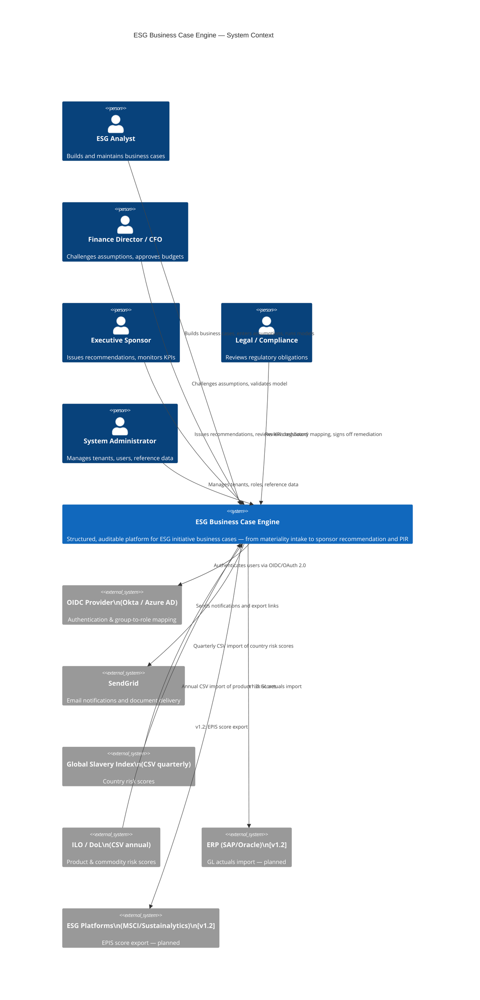

---

## 3. C4 Container Diagram

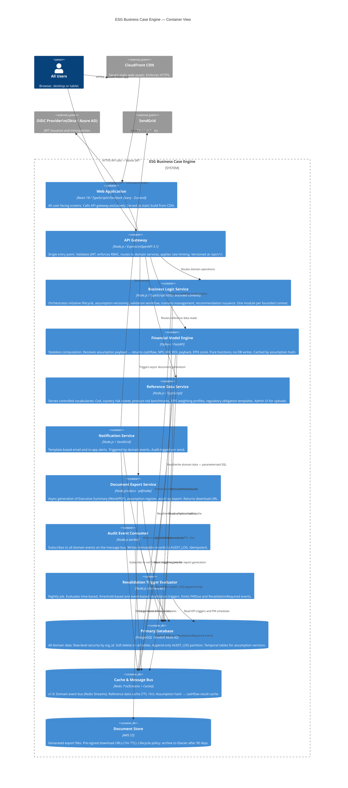

---

## 4. Bounded Context Map & Event Flows

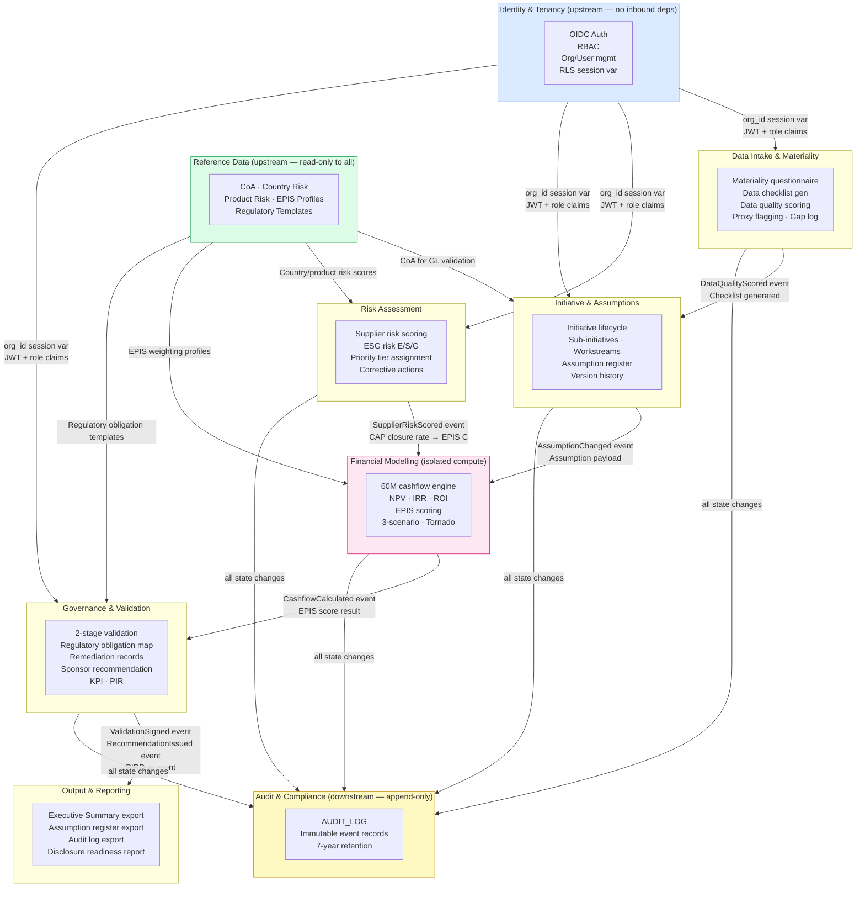

### Domain Event Catalogue

| Event | Publisher | Consumers | Payload (key fields) |
|-------|-----------|-----------|----------------------|
| `AssumptionChanged` | Initiative & Assumptions | Financial Engine, Audit Consumer | `initiativeId`, `assumptionId`, `old_hash`, `new_hash`, `changedBy` |
| `DataQualityScored` | Data Intake | Initiative & Assumptions, Audit Consumer | `initiativeId`, `sourceId`, `qualityScore`, `proxyFlag` |
| `SupplierRiskScored` | Risk Assessment | Financial Engine, Audit Consumer | `initiativeId`, `supplierId`, `residualRisk`, `priorityTier` |
| `CashflowCalculated` | Financial Engine | Governance, Audit Consumer | `initiativeId`, `scenarioType`, `npv`, `irr`, `roi`, `episScore` |
| `ValidationSigned` | Governance | Notification Service, Audit Consumer | `initiativeId`, `validatorId`, `isIndependent`, `outcome` |
| `RecommendationIssued` | Governance | Notification Service, Audit Consumer | `initiativeId`, `sponsorId`, `versionNumber`, `assumptionVersionSet` |
| `PIRDue` | Revalidation Evaluator | Notification Service, Audit Consumer | `initiativeId`, `dueDate`, `modelledScenarioRef` |
| `RevalidationRequired` | Revalidation Evaluator | Notification Service, Audit Consumer | `initiativeId`, `triggerType`, `triggerDetail` |
| `ExportRequested` | Output & Reporting | Document Export Service | `initiativeId`, `format`, `requestedBy`, `jobId` |
| `ExportCompleted` | Document Export Service | Notification Service | `jobId`, `downloadUrl`, `expiresAt` |

---

## 5. Key Assumption Change Flow (Sequence)

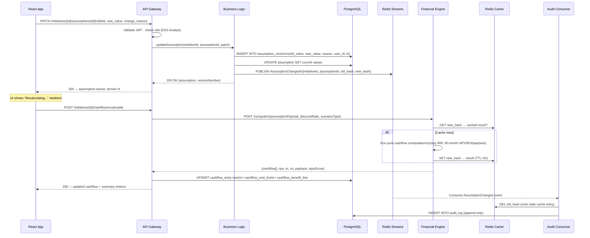

---

## 6. Architecture Decision Records (ADRs)

### ADR-001: Modular Monolith for Business Logic, not Microservices

| | |
|--|--|
| **Status** | Accepted |
| **Date** | June 2026 |

**Decision:** All bounded contexts live inside one deployable Business Logic Service, structured as internal modules with enforced boundaries (no cross-module DB queries; cross-context communication via in-process events or explicit service calls). Separate deployables only for the Financial Engine (Python, compute isolation) and the four workers (audit consumer, notification, export, revalidation evaluator).

**Alternatives considered:**
- Full microservices per bounded context (10 separate deployables)
- Single unstructured monolith with no internal boundaries

**Rationale:** 200 concurrent users does not create independent scaling pressure across bounded contexts. A small team (implied by a 52-week single-team plan) cannot operate 10 separate services with their own CI pipelines, databases, and on-call runbooks. The spec already calls for DDD bounded contexts — that structure is enforced at the module boundary, not the network boundary. The Financial Engine is genuinely separate: it is Python (not Node.js), stateless, and compute-isolated.

**Trade-offs accepted:** Harder to independently deploy bounded contexts if teams grow significantly in v2+. Mitigation: strict no-cross-module-DB rule enforced from day 1 (linting, code review gate) makes future extraction a refactor, not a rewrite.

---

### ADR-002: Redis Streams for v1.0 Message Bus, with Kafka migration path

| | |
|--|--|
| **Status** | Accepted |
| **Date** | June 2026 |

**Decision:** Use Redis Streams for event delivery in v1.0. All consumers are idempotent. Upgrade to Kafka in v2.0 when throughput, long-term replay, or complex fan-out requirements materialise.

**Alternatives considered:** Kafka from day 1; AWS SQS/SNS; synchronous callbacks.

**Rationale:** At 200 users, Redis Streams (already in the stack for caching) is operationally simpler than running a Kafka cluster. The risk is losing event history if Redis is restarted without persistence — mitigated by enabling Redis AOF persistence (`appendfsync everysec`) and using named consumer groups so events are replayable within the retention window.

**Trade-offs accepted:** Redis Streams lacks Kafka's long-term log retention and mature offset management. Acceptable for v1.0; the spec's own upgrade plan acknowledges this. v2.0 migration path: introduce Kafka alongside Redis Streams, migrate consumers one at a time, then decommission Redis Streams.

---

### ADR-003: Assumption Hash Caching in Financial Engine

| | |
|--|--|
| **Status** | Accepted |
| **Date** | June 2026 |

**Decision:** The Financial Engine caches computation results in Redis, keyed by a deterministic SHA-256 hash of `(assumptionPayload + scenarioType + discountRate)`. Cache TTL: 1 hour. The `AssumptionChanged` event must include `old_assumption_hash` so the audit consumer can explicitly evict the stale cache entry.

**Alternatives considered:** No cache (always recompute); database-layer materialised view; application-layer memoisation.

**Rationale:** The 2-second p95 target is achievable via pure computation at this scale, but caching eliminates redundant recomputes when multiple users view the same scenario simultaneously (common during Finance Director challenge sessions). A deterministic hash is safe because the engine has no side effects — same inputs always produce same outputs.

**Trade-offs accepted:** Cache invalidation adds a dependency on the event bus. If the audit consumer fails to evict the old hash, stale results persist until TTL. Mitigation: the Financial Engine also checks an `invalidated_at` timestamp on the cashflow store — if the stored result is older than the latest assumption change, it recomputes regardless of cache.

---

### ADR-004: Single PostgreSQL Cluster, not Polyglot Persistence

| | |
|--|--|
| **Status** | Accepted |
| **Date** | June 2026 |

**Decision:** All data — domain records, audit log, reference data, cashflow entries — lives in one PostgreSQL 16 RDS Multi-AZ cluster. A read replica serves reporting and export queries to isolate them from OLTP writes.

**Alternatives considered:** Time-series DB for cashflow entries; separate audit database; document store for assumptions.

**Rationale:** The domain is highly relational (24+ entities with FK constraints, CHECK constraints, RLS policies, temporal versioning). PostgreSQL's row-level security, generated columns, CHECK constraints, and append-only table semantics handle all compliance requirements natively. Polyglot persistence would split the transactional boundary across systems — `ASSUMPTION_VERSION` and `AUDIT_LOG` dual-writes must be atomic, which requires a single DB. The compliance cost of a split transaction is higher than any performance benefit at this scale.

**Trade-offs accepted:** Audit log partition growth over 7 years. Mitigation: monthly partitioning + annual export to S3 Glacier, as specified. OLTP/reporting isolation via read replica.

---

### ADR-005: Triple-Layer Audit Log Enforcement

| | |
|--|--|
| **Status** | Accepted |
| **Date** | June 2026 |

**Decision:** The audit log is enforced at three independent layers:
1. **Database trigger** on all sensitive tables — fires on every INSERT/UPDATE/DELETE, writes to `AUDIT_LOG` within the same transaction.
2. **Async event consumer** on the message bus — writes structured event records to `AUDIT_LOG` from domain events.
3. **DB role permissions** — the application DB role has no `UPDATE` or `DELETE` permissions on `AUDIT_LOG`. Only the trigger and a dedicated audit-writer role can write.

**Rationale:** Application-layer audit logging can be bypassed by bugs, direct DB access, or future developers unaware of the convention. Triple enforcement ensures the log survives even if two layers fail simultaneously. The redundancy is intentional — duplicate entries are preferable to gaps.

**Trade-offs accepted:** DB triggers add latency on every write (sub-millisecond at 200 users). Duplicate entries possible if both trigger and consumer fire for the same event — mitigated by a `source` column (`trigger` | `event`) and deduplication in the audit log viewer.

---

### ADR-006: `currency_code` Column Added at Schema Inception

| | |
|--|--|
| **Status** | Accepted |
| **Date** | June 2026 |

**Decision:** Add `currency_code VARCHAR(3)` to all monetary fields in the schema at Phase 0. In v1.0 the Financial Engine asserts `currency_code = 'AUD'` and rejects other values. Multi-currency conversion logic is implemented in v1.2.

**Rationale:** Schema changes to add currency to 15+ tables after go-live carry high migration risk (data backfills, API contract changes, client-side formatting). Adding the column costs nothing at Phase 0. The v1.0 constraint prevents accidental multi-currency data entry while deferring the FX conversion work.

**Trade-offs accepted:** Slight schema verbosity in v1.0. No meaningful cost.

---

### ADR-007: OIDC Multi-Provider via Per-Tenant Configuration

| | |
|--|--|
| **Status** | Accepted |
| **Date** | June 2026 |

**Decision:** The API Gateway treats any OIDC-compliant IdP as a valid token issuer. The `ORGANISATION` table stores `oidc_issuer_url` and `oidc_jwks_endpoint` per tenant. The gateway resolves the correct JWKS endpoint from the tenant context on every request, not from a global config.

**Rationale:** Supporting both Okta and Azure AD via a per-tenant config table is 2–3 days of Phase 0 work. Deferring this to v1.2 when the first Azure AD customer arrives requires a breaking change to the authentication middleware and a re-test cycle. The cost of doing it at Phase 0 is low; the cost of retrofitting is high.

**Trade-offs accepted:** Each new OIDC provider requires a JWKS cache entry per tenant (stored in Redis, TTL 24 hours). Negligible at this scale.

---

## 7. Gaps and Risks in the Spec

### Gap 1 — Cache invalidation is undefined for `AssumptionChanged`

**Severity: High**

The spec states the Financial Engine is "cached by assumption hash" but does not define when the old cache entry is evicted. If `AssumptionChanged` carries only the new hash, the old entry persists in Redis until TTL (up to 1 hour). During that window, a user requesting the pre-change scenario receives stale cached NPV/ROI.

**Fix:** Include `old_assumption_hash` in the `AssumptionChanged` event payload. The audit consumer evicts it from Redis immediately on receipt, before writing to `AUDIT_LOG`.

---

### Gap 2 — Redis Streams persistence is unspecified

**Severity: High**

If Redis restarts without AOF persistence enabled, all un-consumed events are lost. The audit consumer is the most vulnerable — it may miss `AssumptionChanged` or `ValidationSigned` events and produce an incomplete audit log, which is a compliance failure.

**Fix:** Mandate `appendfsync everysec` in the Redis configuration. Use named consumer groups with explicit acknowledgement (`XACK`) so only processed events are dropped from the stream. Include a reconciliation job in Phase 0 that compares `AUDIT_LOG` record counts to `assumption_version` row counts nightly.

---

### Gap 3 — Document export has no queue backpressure

**Severity: Medium**

The spec describes async export with email notification but does not define concurrency limits. If 50 users request Executive Summary exports simultaneously, the export service could exhaust memory or CPU generating 50 concurrent large documents.

**Fix:** Route export requests through a dedicated Redis Stream with a bounded consumer (concurrency: 2–3 workers). Requests queue behind in-flight jobs. This also makes exports retryable on failure with no duplicate sends.

---

### Gap 4 — RLS session variable may not survive connection pooling

**Severity: High**

The spec states RLS policies use `current_setting('app.current_org_id')`. If PgBouncer runs in **transaction mode** (the most common production configuration), the session variable set at connection open is not guaranteed to be present on subsequent transactions from the same logical connection, because the underlying physical connection may have been recycled.

**Fix:** Set `SET LOCAL app.current_org_id = $1` at the start of every transaction, not just at connection open. Alternatively, run PgBouncer in **session mode** — lower connection density, acceptable at 200 users. Document this constraint explicitly in the Phase 0 database runbook.

---

### Gap 5 — `ORGANISATION_HIERARCHY` self-referencing tree has no traversal index

**Severity: Medium**

Group MSA reporting requires traversing the organisation hierarchy to aggregate child org data. Recursive CTEs on a self-referencing table are correct but unindexed. At 10–20 orgs this is fine; at 500+ orgs (realistic for an enterprise with subsidiaries) it degrades.

**Fix:** Add a closure table `ORG_CLOSURE (ancestor_id, descendant_id, depth)` populated by trigger on hierarchy insert/update. Hierarchy traversal queries become a single indexed join instead of a recursive CTE scan.

---

### Gap 6 — EPIS score recalculation race condition

**Severity: Medium**

If two assumption changes fire within the same second (e.g., bulk import or rapid sequential edits), two `AssumptionChanged` events trigger two concurrent cashflow recalculation jobs. Both attempt to write `EPIS_SCORE` for the same initiative. The second write may overwrite the first with a result computed from a partially-updated assumption set.

**Fix:** Add an optimistic lock (`version` column on `EPIS_SCORE`, incremented on each write). The second writer detects the conflict and retries. Alternatively, serialise EPIS recalculation behind a per-initiative Redis lock key — only one recalculation job runs per initiative at any time.

---

### Gap 7 — No export service retry or dead-letter strategy

**Severity: Low**

The spec describes async export with a download URL emailed to the user, but does not define what happens if export generation fails (e.g., a `pdfmake` OOM crash). The user receives no email and has no visibility of the failure.

**Fix:** Add a `export_job` table with status (`queued` | `processing` | `completed` | `failed`). The UI polls this endpoint (or subscribes via Server-Sent Events) so the user sees failure state. Failed jobs go to a dead-letter stream for manual retry or support investigation.

---

## 8. Recommendations on Open Questions

### Q1 — Internal Python financial engine vs external platform (Cube / Anaplan)

**Recommendation: build internally.**

The financial model is not generic — it implements a specific formula (`Net Benefit = Gross × Attribution × Realisation × Confidence`), EPIS scoring (`αF + βR + γC`), a 60-month ramp model, and IRR via sign-change detection. External platforms (Cube, Anaplan) impose their own data model and API surface, creating a translation layer that becomes the most brittle part of the system.

The Python / FastAPI stateless service is the correct call. `scipy.optimize.brentq` handles IRR edge cases (no sign change, multiple sign changes) correctly and with documented behaviour. Keep the engine strictly pure — no DB writes from within the engine, inputs validated against the assumption store before computation, outputs written by the API gateway — and the engine remains independently testable and replaceable.

**The only scenario where an external platform wins:** if the finance team needs to maintain the model logic themselves in a spreadsheet-like environment without engineering involvement. If that's a hard requirement, revisit in v2.0 — but it is not stated in the spec.

---

### Q2 — Single OIDC provider vs both Okta and Azure AD at launch

**Recommendation: support both from day 1, via per-tenant OIDC configuration.**

Store `oidc_issuer_url` and `oidc_jwks_endpoint` per organisation record. The API Gateway resolves the correct JWKS endpoint from tenant context on every request. This is 2–3 days of Phase 0 work.

The cost of retrofitting multi-provider support after launch is high: authentication middleware changes, re-testing the full auth flow, potential breaking changes to existing tenant configurations. The cost of doing it correctly at Phase 0 is low. Every enterprise customer will either be on Okta or Azure AD — there is no single dominant provider.

---

### Q4 — Multi-currency support in v1.0

**Recommendation: add the schema column now; implement only AUD enforcement in v1.0.**

Add `currency_code VARCHAR(3) NOT NULL DEFAULT 'AUD'` to all monetary fields at Phase 0. The Financial Engine asserts `currency_code = 'AUD'` and returns a validation error for any other value. No FX conversion logic is implemented.

When v1.2 ships international support, the column is already present in production data — no migration required. Without the column, adding currency in v1.2 requires a migration on 15+ tables, backfills on potentially millions of rows, API contract changes, and client-side formatting updates. The schema cost of deferring is significantly higher than the 1-day cost of adding the column now.

---

## 9. Deployment Topology

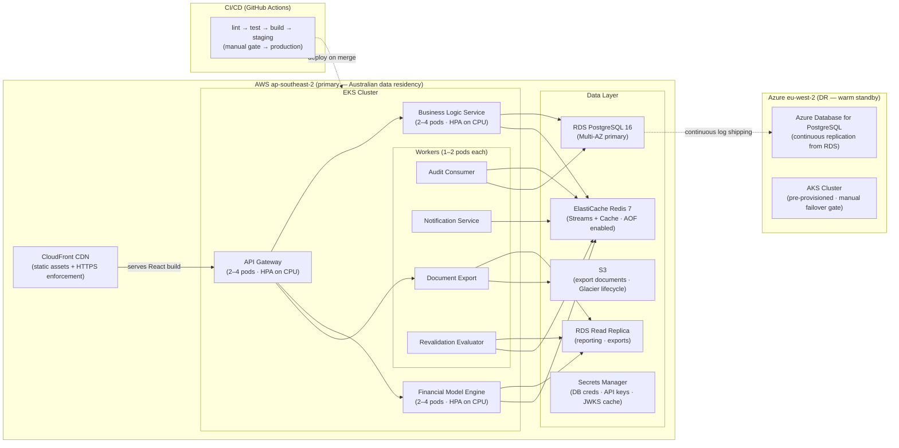

### Environment Strategy

| Environment | Purpose | Promotion gate |
|---|---|---|
| `dev` | Feature branch integration, daily CI | Automatic on push |
| `staging` | Pre-production validation, UAT, load testing | Automatic on PR merge to `main` |
| `production` | Live | Manual approval gate in GitHub Actions |

### Namespace isolation

Each environment runs in a separate EKS namespace. Network policies enforce no cross-namespace traffic. Secrets Manager paths are namespaced (`/esg/prod/`, `/esg/staging/`, `/esg/dev/`).

---

## 10. Summary & Immediate Actions

### Architecture approach in one paragraph

The ESG Business Case Engine is a **compliance-first, API-first SaaS platform** built on a modular monolith (Node.js Business Logic Service with DDD module boundaries), a separate stateless Python computation service (Financial Model Engine), and four lightweight workers (audit, notifications, export, revalidation). All state is owned by a single PostgreSQL 16 cluster with row-level security for multi-tenancy, append-only audit log, and temporal assumption versioning. A Redis layer serves both the event bus (Redis Streams, upgrading to Kafka at v2.0) and the assumption-hash computation cache. The architecture deliberately stays simple — 200 users and a 52-week build do not justify the operational overhead of 10 independent microservices.

### Three immediate actions before Phase 0 starts

| # | Action | Why it cannot wait |
|---|--------|-------------------|
| 1 | Add `currency_code VARCHAR(3) NOT NULL DEFAULT 'AUD'` to all monetary fields in the schema | Post-launch schema migration on 15+ tables is high-risk; column costs nothing now |
| 2 | Add closure table `ORG_CLOSURE (ancestor_id, descendant_id, depth)` to the data model | Recursive CTE on self-referencing hierarchy will degrade at enterprise scale; add the index structure at schema inception |
| 3 | Include `old_assumption_hash` in the `AssumptionChanged` event contract | Without it, stale NPV/ROI values persist in cache for up to 1 hour after an assumption change |

### Phase 0 hardening checklist (beyond the spec)

- [ ] Enable Redis AOF persistence (`appendfsync everysec`) in all environments
- [ ] Set `SET LOCAL app.current_org_id = $1` at transaction start, not connection open (PgBouncer compatibility)
- [ ] Add optimistic lock (`version` column) to `EPIS_SCORE` table
- [ ] Add `export_job` status table with polling endpoint for export failure visibility
- [ ] Add `source` column to `AUDIT_LOG` (`trigger` | `event`) for deduplication
- [ ] Mandate OIDC per-tenant config (`oidc_issuer_url`, `oidc_jwks_endpoint`) in `ORGANISATION` table

---

---

## 11. Entity-Relationship Diagram

All 36 entities are shown: 24 from the original ER diagram + 12 additions from the architecture review (marked **[NEW]**). Entities are grouped by bounded context. Key columns are included; audit and soft-delete columns (`deleted_at`, `created_at`, `updated_at`) are omitted for readability — they are present on every table.

### 11.1 Identity & Tenancy

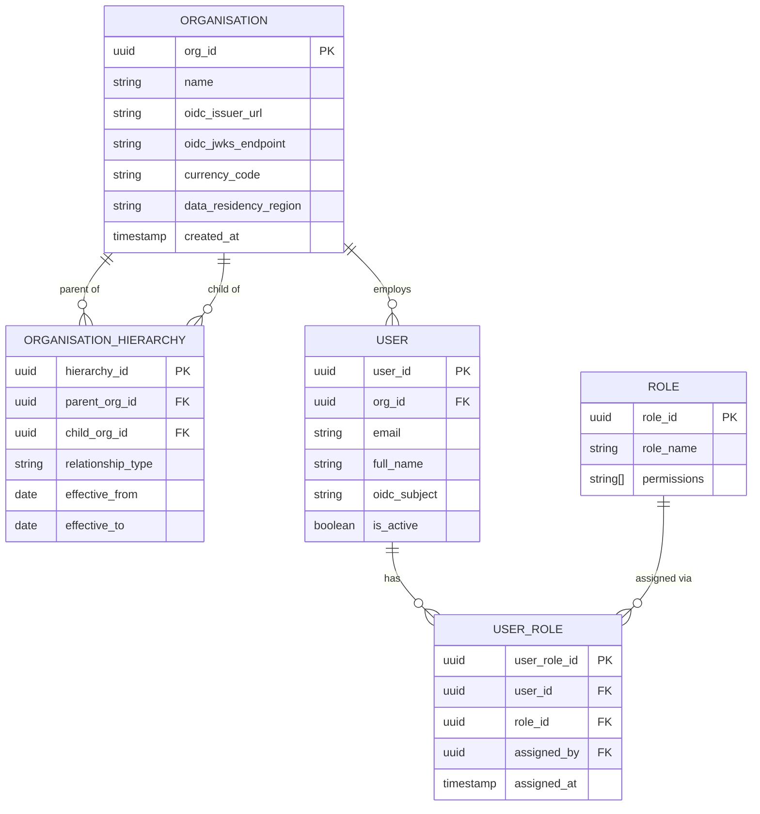

### 11.2 Reference Data

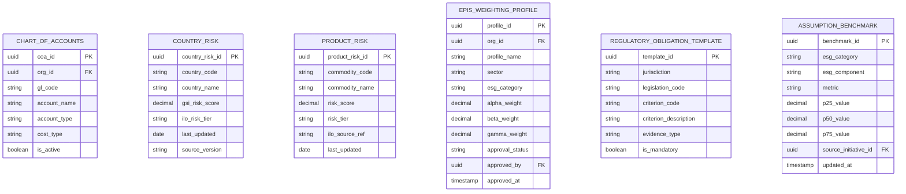

### 11.3 Initiative Core

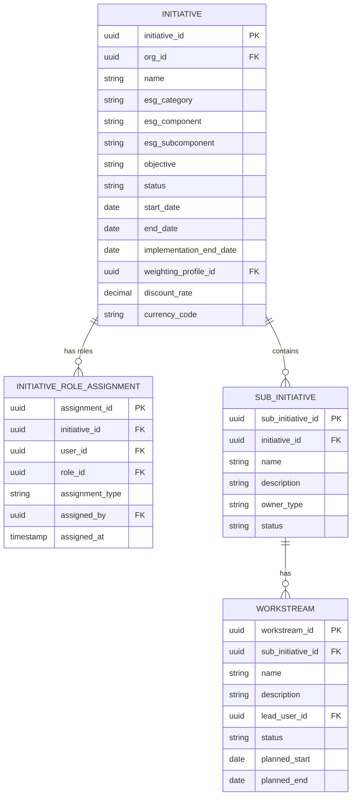

### 11.4 Data Intake & Materiality

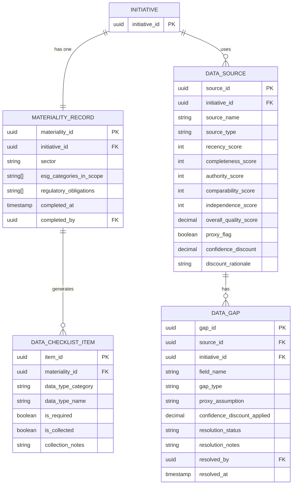

### 11.5 Risk Assessment

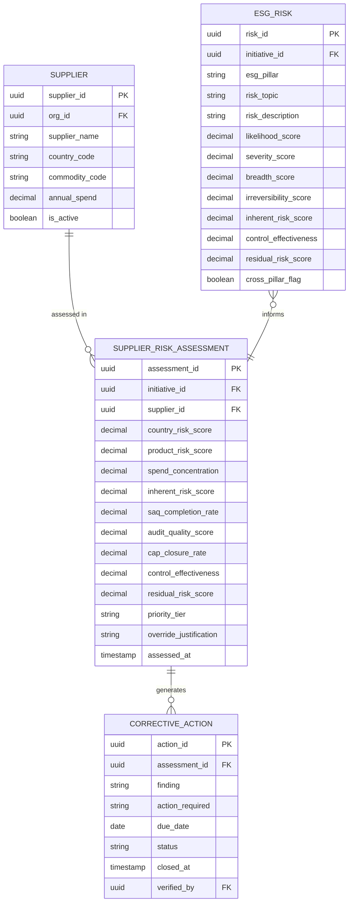

### 11.6 Assumptions & Financial Model

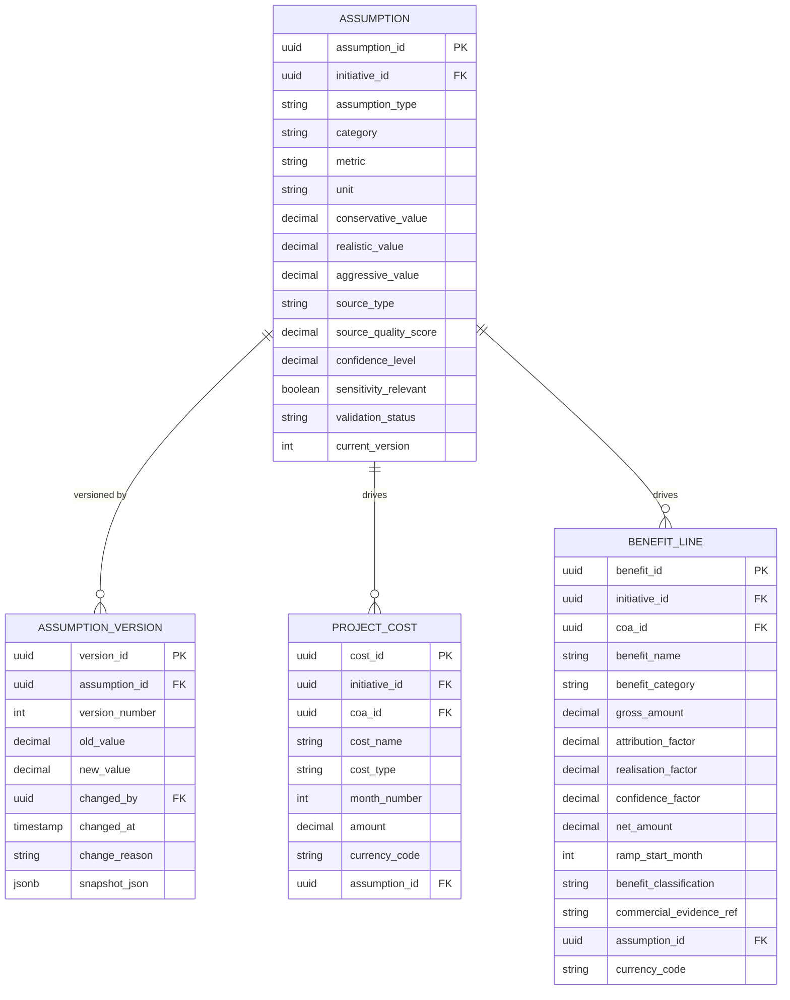

### 11.7 Scenarios & Cashflow

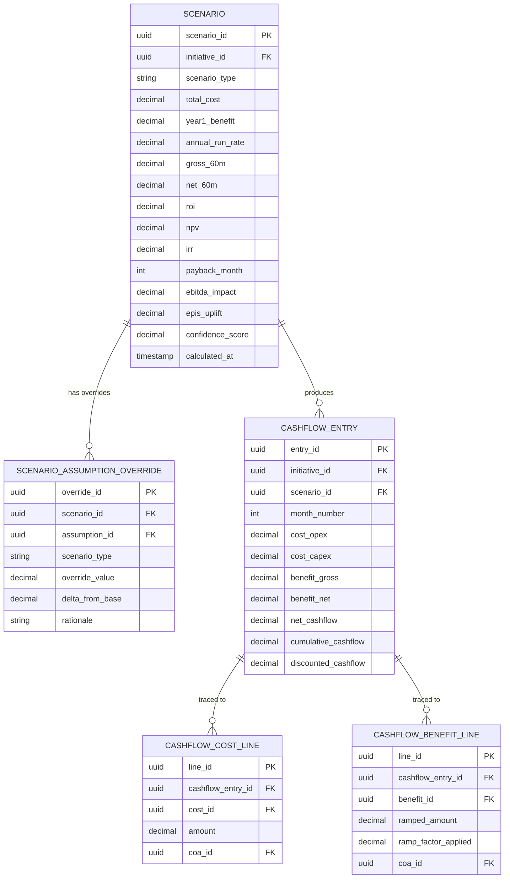

### 11.8 EPIS Scoring

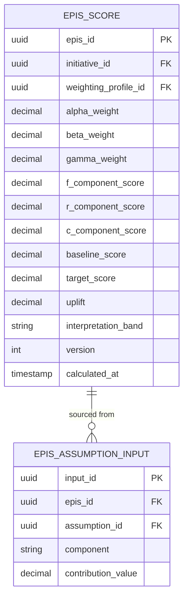

### 11.9 Governance & Validation

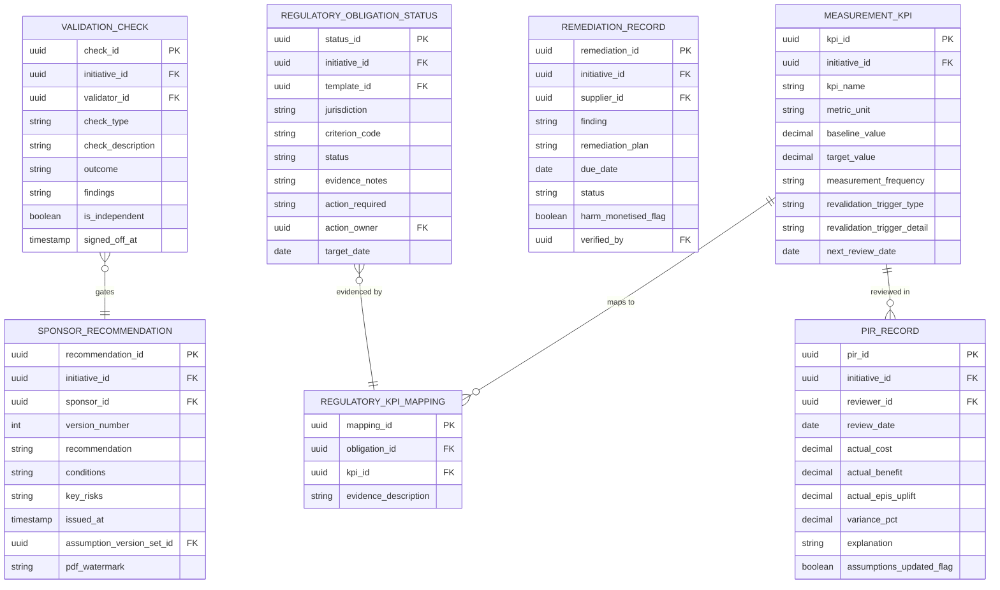

### 11.10 Audit & Compliance

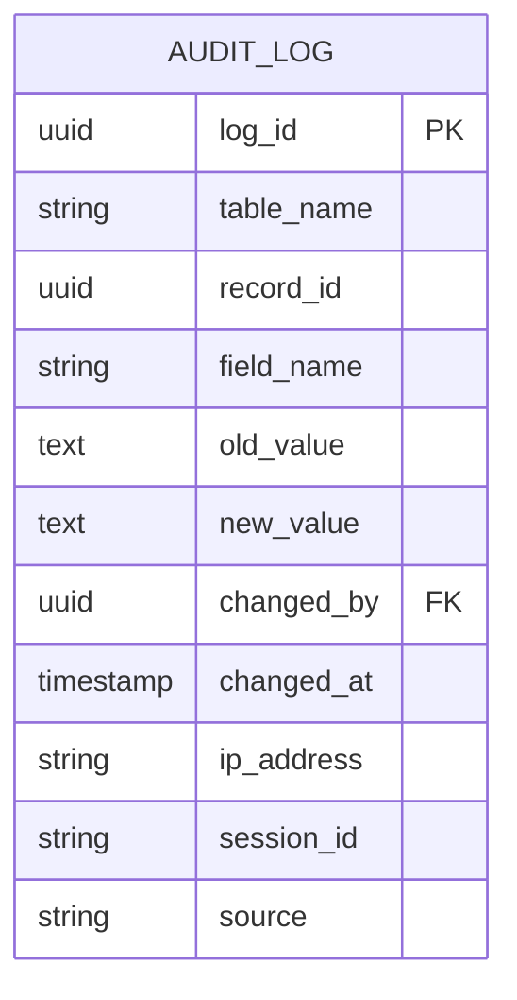

### 11.11 Full Cross-Context Relationship Map

The diagram below shows how the major entities relate across bounded contexts, without field detail.

```mermaid
erDiagram
    ORGANISATION ||--o{ USER : ""
    ORGANISATION ||--o{ INITIATIVE : ""
    ORGANISATION ||--o{ CHART_OF_ACCOUNTS : ""
    ORGANISATION ||--o{ EPIS_WEIGHTING_PROFILE : ""
    ORGANISATION ||--o{ ORGANISATION_HIERARCHY : ""

    INITIATIVE ||--|| MATERIALITY_RECORD : ""
    INITIATIVE ||--o{ DATA_SOURCE : ""
    INITIATIVE ||--o{ SUPPLIER_RISK_ASSESSMENT : ""
    INITIATIVE ||--o{ ESG_RISK : ""
    INITIATIVE ||--o{ ASSUMPTION : ""
    INITIATIVE ||--o{ PROJECT_COST : ""
    INITIATIVE ||--o{ BENEFIT_LINE : ""
    INITIATIVE ||--o{ SCENARIO : ""
    INITIATIVE ||--o{ CASHFLOW_ENTRY : ""
    INITIATIVE ||--|| EPIS_SCORE : ""
    INITIATIVE ||--o{ VALIDATION_CHECK : ""
    INITIATIVE ||--o{ REGULATORY_OBLIGATION_STATUS : ""
    INITIATIVE ||--o{ REMEDIATION_RECORD : ""
    INITIATIVE ||--o{ MEASUREMENT_KPI : ""
    INITIATIVE ||--o{ SPONSOR_RECOMMENDATION : ""
    INITIATIVE ||--o{ PIR_RECORD : ""
    INITIATIVE ||--o{ INITIATIVE_ROLE_ASSIGNMENT : ""
    INITIATIVE ||--o{ SUB_INITIATIVE : ""

    ASSUMPTION ||--o{ ASSUMPTION_VERSION : ""
    ASSUMPTION ||--o{ SCENARIO_ASSUMPTION_OVERRIDE : ""
    ASSUMPTION ||--o{ EPIS_ASSUMPTION_INPUT : ""

    CASHFLOW_ENTRY ||--o{ CASHFLOW_COST_LINE : ""
    CASHFLOW_ENTRY ||--o{ CASHFLOW_BENEFIT_LINE : ""

    SUPPLIER ||--o{ SUPPLIER_RISK_ASSESSMENT : ""
    SUPPLIER_RISK_ASSESSMENT ||--o{ CORRECTIVE_ACTION : ""

    MEASUREMENT_KPI ||--o{ REGULATORY_KPI_MAPPING : ""
    REGULATORY_OBLIGATION_STATUS ||--o{ REGULATORY_KPI_MAPPING : ""

    EPIS_SCORE ||--o{ EPIS_ASSUMPTION_INPUT : ""
    SCENARIO ||--o{ SCENARIO_ASSUMPTION_OVERRIDE : ""
    SCENARIO ||--o{ CASHFLOW_ENTRY : ""
```

### 11.12 Entity Summary Table

| # | Entity | Context | Type | Key constraints |
|---|--------|---------|------|-----------------|
| 1 | ORGANISATION | Identity | Core | — |
| 2 | USER | Identity | Core | Unique on (org_id, email) |
| 3 | ROLE | Identity | Reference | — |
| 4 | USER_ROLE | Identity | Junction | — |
| 5 | ORGANISATION_HIERARCHY **[NEW]** | Identity | Self-ref | Closure table recommended |
| 6 | CHART_OF_ACCOUNTS | Reference Data | Reference | Unique on (org_id, gl_code) |
| 7 | COUNTRY_RISK | Reference Data | Reference | Unique on (country_code, last_updated) |
| 8 | PRODUCT_RISK | Reference Data | Reference | Unique on (commodity_code, last_updated) |
| 9 | EPIS_WEIGHTING_PROFILE | Reference Data | Reference | CHECK alpha+beta+gamma = 1.0 |
| 10 | REGULATORY_OBLIGATION_TEMPLATE | Reference Data | Reference | — |
| 11 | ASSUMPTION_BENCHMARK **[NEW]** | Reference Data | Feedback | Updated from PIR actuals |
| 12 | INITIATIVE | Initiative Core | Core | Unique on (org_id, name) |
| 13 | INITIATIVE_ROLE_ASSIGNMENT **[NEW]** | Initiative Core | Junction | Replaces hard-coded owner/sponsor FKs |
| 14 | SUB_INITIATIVE | Initiative Core | Core | — |
| 15 | WORKSTREAM | Initiative Core | Core | — |
| 16 | MATERIALITY_RECORD | Data Intake | Core | Unique on initiative_id |
| 17 | DATA_CHECKLIST_ITEM | Data Intake | Core | — |
| 18 | DATA_SOURCE | Data Intake | Core | CHECK confidence_discount BETWEEN 0 AND 1 |
| 19 | DATA_GAP | Data Intake | Core | 4-value status enum |
| 20 | SUPPLIER | Risk | Core | Unique on (org_id, supplier_name, country_code) |
| 21 | SUPPLIER_RISK_ASSESSMENT | Risk | Core | Residual cannot be manually overridden |
| 22 | CORRECTIVE_ACTION **[NEW]** | Risk | Core | CAP closure rate feeds EPIS C-component |
| 23 | ESG_RISK | Risk | Core | — |
| 24 | ASSUMPTION | Assumptions | Core | Unique on (initiative_id, category, metric) |
| 25 | ASSUMPTION_VERSION **[NEW]** | Assumptions | Immutable | Append-only; no UPDATE/DELETE |
| 26 | PROJECT_COST | Assumptions | Core | GL code mandatory |
| 27 | BENEFIT_LINE | Assumptions | Core | CHECK attribution/realisation/confidence BETWEEN 0 AND 1; net_amount is computed |
| 28 | SCENARIO | Financial | Core | — |
| 29 | SCENARIO_ASSUMPTION_OVERRIDE **[NEW]** | Financial | Junction | Resolves Scenario ↔ Assumption M:M |
| 30 | CASHFLOW_ENTRY | Financial | Core | UNIQUE (initiative_id, month_number) per scenario |
| 31 | CASHFLOW_COST_LINE **[NEW]** | Financial | Junction | Traceability — cost → cashflow month |
| 32 | CASHFLOW_BENEFIT_LINE **[NEW]** | Financial | Junction | Traceability — benefit → cashflow month |
| 33 | EPIS_SCORE | EPIS | Core | CHECK alpha+beta+gamma = 1.0; optimistic lock version column |
| 34 | EPIS_ASSUMPTION_INPUT **[NEW]** | EPIS | Junction | Resolves EPIS_SCORE ↔ ASSUMPTION M:M |
| 35 | VALIDATION_CHECK | Governance | Core | is_independent derived from validator role |
| 36 | REGULATORY_OBLIGATION_STATUS | Governance | Core | Gap rows require action + owner + date |
| 37 | REMEDIATION_RECORD | Governance | Core | CHECK harm_monetised_flag = false |
| 38 | MEASUREMENT_KPI | Governance | Core | — |
| 39 | REGULATORY_KPI_MAPPING **[NEW]** | Governance | Junction | Obligation ↔ KPI evidence link |
| 40 | SPONSOR_RECOMMENDATION | Governance | Versioned | UNIQUE (initiative_id, version_number); stores assumption version set at issue |
| 41 | PIR_RECORD **[NEW]** | Governance | Core | Available only 12 months after implementation_end_date |
| 42 | AUDIT_LOG **[NEW]** | Audit | Append-only | No UPDATE/DELETE permission on app role; source column (trigger\|event) |

> **Bold [NEW]** = entities added in the architecture review (Section 7 of the AppSpec). Total: 42 entities (24 original + 12 review additions + 6 intermediate junction/reference tables required to complete the model).

---

*Document generated from ESG Business Case Engine AppSpec v1.0. Architecture decisions are based on the constraints, NFRs and technology choices stated in the specification.*
