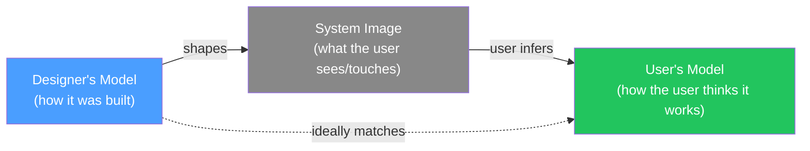

# Day 2 — The Human at the Center

> **Today's one idea:** You design for behavior and context, not for stated preferences.
> **Reading time:** ~35 min · **Prereqs:** Day 1
> **Primary source for today:** Don Norman, *The Design of Everyday Things*, rev. ed., Basic Books, 2013, Chapter 1 ("The Psychopathology of Everyday Things")
> **Before you start:** Recall Day 1's load-bearing idea — one sentence, no looking. *What is Design Thinking a discipline of finding, before it is a discipline of solving?*

---

## The hook

There is a door in Norman's book — a door with a handle on both sides, that pulls open from one side and pushes from the other. People walk up to it, grab the handle, and pull. Wrong side. They push. Wrong again. They look embarrassed, as if the problem is them.

It is not them.

The door is badly designed. It communicates the wrong thing — the handle implies pulling, but the door requires pushing. Norman has a name for a door that tells you to do the wrong thing: a **Norman Door**. (He didn't name it after himself. Others did, as a kind of fond insult.)

The designer of that door probably thought: *I asked people what kind of door they wanted, and they said they wanted a nice-looking door with a handle. I gave them that.* 

The problem is that people are very bad at predicting their own behavior. They think they want a nice-looking door. What they actually need is a door that tells them, without a word, which side to push and which to pull.

This is the first principle of human-centered design, and it is not obvious: **what people say they want is not a reliable guide to what they actually need**.

---

## Building the intuition

Ask someone what they want in a new feature, and they will describe the thing they imagine having — based on how they think they work, not how they actually work. This is not dishonesty. It is a cognitive limitation. We are poor observers of our own behavior.

Norman describes two mental models that explain this:

**The Gulf of Execution:** the gap between what a user wants to do and what the system lets them do. A spreadsheet user wants to "make this column always show as currency." The system's way of doing it is buried three menus deep. The gulf is the distance between the user's intent and the available actions.

**The Gulf of Evaluation:** the gap between what the system does and what the user perceives it as doing. You click "Archive" in your email client. Did it archive? Did it delete? Did it move somewhere? If you have to hunt for evidence that your action worked, the evaluation gulf is too wide.

```
User's world                     System's world
─────────────                    ──────────────
What I want to do                What actions exist
      │                                │
      └───── Gulf of Execution ────────┘
                     (bridged by good design)

What happened                    What I think happened
      │                                │
      └───── Gulf of Evaluation ───────┘
                     (bridged by good feedback)
```

Good design minimizes both gulfs — not by making the system simpler (sometimes complexity is unavoidable) but by making the system *legible*. It tells the user what to do, and then confirms that they did it.

Now here is the Design Thinking implication: **if you only ask users what they want, you get their mental model of what they imagine would close those gulfs — not the actual gulfs themselves.** The actual gulfs only appear when you watch them use the product in real conditions.

This is why DT research is primarily observational, not survey-based. We will study how to do this observation on Days 7 and 8. Today you are building the *why*.

---

## The formal picture

Norman introduces three design properties that communicate what an object does — without words:

| Concept | What it is | Example |
|---------|-----------|---------|
| **Affordance** | A property of an object that suggests how to interact with it | A flat plate on a door affords pushing; a handle affords pulling |
| **Signifier** | A signal — visual, auditory, or tactile — that communicates how to use an affordance | The ">" arrow on a play button signifies "press to play" |
| **Feedback** | The system's confirmation that an action occurred | A button click sound; a loading spinner; a success message |

These concepts matter for product teams because they explain *why* users behave in ways that confuse developers. When a user "incorrectly" uses your product, the almost-always-true explanation is: **the signifiers pointed them in the wrong direction, or the feedback failed to confirm their action.**

The second key concept from Norman for DT practitioners is the **conceptual model**: the user's internal mental picture of how the system works. Designers have one mental model (the designer's model). The system reveals another (the system image). Users construct a third from what they observe (the user's model).



When A and C diverge — when the designer's model and the user's model are different — errors happen, frustration builds, and the user blames themselves (incorrectly). The designer's job is to make the system image so clear that the user's model converges on the designer's.

The DT practitioner's job, in the Empathize phase, is to *discover* the user's current model before proposing changes. You cannot correct a misalignment you haven't first observed.

---

## Where it breaks / what it is not

**"Human-centered" does not mean "do whatever users say."** Users are experts in their own experience; they are not experts in design. Henry Ford's famous (probably apocryphal) quote: *"If I had asked people what they wanted, they would have said faster horses."* The point is not that users are wrong — the point is that users describe their *problem* accurately but are unreliable at prescribing *solutions*. Listen to the problem, not the solution they propose.

**Affordances are not magic.** You can design the most intuitive interface in the world and users will still behave unexpectedly, because context, culture, prior experience, and stress all affect behavior. Human-centered design reduces friction — it does not eliminate it.

**This is not the same as UX design.** UX design is a professional discipline with its own tools (wireframes, user flows, accessibility standards). Human-centered *thinking* is the philosophical stance that informs DT at every phase. You don't need to be a UX designer to apply today's ideas; you need to internalize that behavior beats stated preference, every time.

---

## Try it yourself

> **Close this page before attempting Exercise 1.**

**Exercise 1 — Retrieval.** Without looking: what are the two "gulfs" Norman describes, and what does each one explain? Write a two-sentence answer — one sentence per gulf — from memory.

<details>
<summary>Compare to this</summary>

**Gulf of Execution:** the gap between what a user wants to do and what actions the system makes available — bridged when design makes the available actions obvious. **Gulf of Evaluation:** the gap between what the system does and what the user perceives it as doing — bridged when the system provides clear, immediate feedback. If you had the direction of either gulf reversed, re-read the "Building the intuition" section before moving on.
</details>

---

**Exercise 2 — Direct application.** Pick one feature in a product you use daily (email client, Slack, your IDE, whatever). Identify one place where either the Gulf of Execution or the Gulf of Evaluation is wide — a moment where you have to think, hunt, or guess. Write: (a) which gulf it is, (b) what makes it wide, and (c) what would close it.

<details>
<summary>What a good answer looks like</summary>

A strong answer is specific. For example: "In Slack, the Gulf of Evaluation is wide when I archive a channel — there's no immediate confirmation that it disappeared from my sidebar intentionally versus a bug. What would close it: a brief 'Channel archived. Undo?' toast notification." Vague answers ("the UI is confusing") do not count — name the exact moment, the exact gap, the exact fix.
</details>

---

**Exercise 3 — Stretch.** Day 1 said that Design Thinking is a problem-*finding* discipline. Today says that users are poor at reporting their own needs. Connect these two ideas: why does the limitation identified in Day 2 make the approach described in Day 1 necessary? Write one paragraph (4–6 sentences).

<details>
<summary>The core argument</summary>

If users could accurately report their own needs, you could skip DT's empathy phase entirely — just send a survey. But because users describe their *imagined* solution rather than their *actual* problem (they don't know about the Gulf of Execution until they experience it), the problem statement you'd derive from a survey would be systematically biased toward their current mental model of how the system works. DT's problem-finding discipline exists precisely because the raw input — user self-report — is unreliable data. The empathy phase (observation, interview) is designed to surface the problem that users experience but can't articulate: the gap between their mental model and the designer's model, made visible through watching them interact with the product.
</details>

---

**Transfer — apply it:**

> Think of a decision your team recently made based primarily on user surveys or stakeholder preferences. Write one sentence describing what you would need to *observe* — not ask — to check whether the stated preference matches actual behavior.

---

## Connect it back

Day 1 established that DT questions the problem statement. Day 2 explains *why* that questioning is necessary: users are experts in their experience, not in their needs. The tools we are about to build in the Empathize phase (Days 6–10) are specifically engineered to bridge this gap — to get at what users actually do, rather than what they say they would do.

Tomorrow we will step back and look at the whole DT process as a loop — because understanding the structure of the loop is what lets you navigate it without a script.

**Sharp question you should be able to answer now:** Why is watching someone use a product more valuable than asking them to rate it?

---

## Suggested readings for today

**Required if you have 15 extra minutes:**
Don Norman, *The Design of Everyday Things*, rev. ed. (Basic Books, 2013), Chapter 1, pp. 1–36. Focus on the sections "The Complexity of Modern Devices" through "The Paradox of Technology." Skip the technical discussion of affordances-vs-signifiers if it gets too granular — for L1, the conceptual distinction is what matters.

**Free video:**
NNgroup, *"Don Norman: The term 'UX'"* — NNgroup YouTube channel, ~3 min. Search YouTube: `NNgroup Don Norman UX term`. Short but clarifying on where "user experience" comes from and what Norman originally meant by it. Pairs well with today's reading.

**If you want the deep version:**
Don Norman, *The Design of Everyday Things*, Chapter 2, "The Psychology of Everyday Actions" (pp. 37–73). This chapter introduces the seven stages of action model — the full cognitive loop of how humans translate goals into physical actions and back. It is the theoretical bedrock under the two gulfs and makes the Day 7–8 interview and observation techniques feel inevitable rather than arbitrary.

---

## Navigation

← **Previous:** [Day 1 — What Design Thinking Actually Is](./day-01-what-design-thinking-actually-is.md)
→ **Next:** [Day 3 — The Five Phases as One Loop](./day-03-five-phases-as-one-loop.md)
