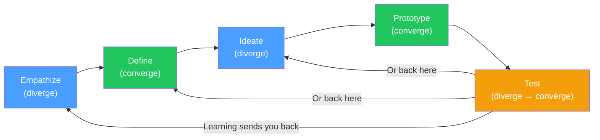

# Day 3 — The Five Phases as One Loop

> **Today's one idea:** Design Thinking is a diverge–converge rhythm repeated, not a linear checklist.
> **Reading time:** ~40 min · **Prereqs:** Days 1–2
> **Primary source for today:** Stanford d.school, *Design Thinking Bootcamp Bootleg*, 2018. Free PDF — search "Stanford d.school Bootcamp Bootleg" at dschool.stanford.edu/resources.
> **Before you start:** Recall Day 2's load-bearing idea — one sentence, no looking. *Why is observing user behavior more reliable than asking users what they want?*

---

## The hook

Imagine you are handed a map of London with no starting point marked. The map is accurate — every street, every landmark in the right place. But without knowing where you are, the map is useless for navigation. You can't say "turn left in 200m" if you don't know which direction you're facing.

Most introductions to Design Thinking hand you a map with no starting point. They say: here are the five phases — Empathize, Define, Ideate, Prototype, Test — and they draw them as a neat left-to-right arrow sequence.

The problem: that picture implies a march. Start at Empathize, end at Test, ship it. This is wrong in ways that will break your projects if you believe it.

Today's job is to give you the right map — one with orientation, not just destinations.

---

## Building the intuition

The core rhythm of Design Thinking is not five steps. It is one movement, repeated at different scales:

**Diverge → Converge**

Diverging means opening up: generating more options, perspectives, or data than you started with. Converging means narrowing: selecting, combining, and committing to a direction.

This rhythm appears at every phase:

- **Empathize:** You talk to many people (diverge), then select the most revealing stories and behaviors to carry forward (converge)
- **Define:** You collect many observations (diverge), then synthesize them into one sharp POV and one HMW question (converge)
- **Ideate:** You generate many ideas (diverge), then select three to prototype (converge)
- **Prototype:** You build rough versions of several concepts (mild diverge), then pick the one to test (converge)
- **Test:** You collect many reactions (diverge), then decide what to do next (converge)

The five phases are labels for where in the problem-solution space you are diverging and converging — they are not gates to pass through once and never revisit.

Here is the most important thing to understand about the loop:

The arrows going backward are not failures. They are the mechanism by which DT works. When testing reveals that your prototype doesn't address the user's real need, you have two choices: return to Ideate (the solution was wrong) or return to Define (the problem statement was wrong). Knowing which one to return to is a practitioner judgment — we'll develop it on Day 25.

---

## The formal picture

Here is each phase described precisely, at a level that gives you the navigational map without being a how-to guide (the how-to comes in later modules):

| Phase | Primary question | Output | What "done" looks like |
|-------|-----------------|--------|----------------------|
| **Empathize** | Who are we designing for, and what do they actually experience? | Stories, observations, quotes, behaviors | You have spent real time with real users and can describe their experience in their words, not your assumptions |
| **Define** | What is the real problem — stated as a human need? | Point of View (POV) statement + "How Might We" question | Your whole team agrees on a one-sentence problem statement that is specific enough to design against |
| **Ideate** | What are all the possible ways we could address this need? | A set of sketched ideas, divergently generated | You have 20+ rough ideas; you have selected 2–3 to prototype |
| **Prototype** | What is the fastest way to make our idea tangible enough to test? | A rough artifact (paper, diagram, role-play, wireframe) | Someone outside the team can interact with it without you explaining it |
| **Test** | What does this prototype teach us about our idea and our user? | Observations, surprises, decisions | You can say specifically what you learned and what you will do differently |

Two concepts that frequently confuse beginners at this stage:

**Fidelity is not progress.** A beautiful Figma prototype is not "further along" than a paper prototype. The question is always: *what assumption are we testing, and what is the cheapest artifact that tests it?* High fidelity implies commitment; low fidelity implies inquiry. In the early loops, always prefer inquiry.

**The phases are not time-locked to one sprint.** A full DT cycle on a complex product problem might take three weeks. A "Design Sprint" (as in the *Sprint* book we'll cover in Days 26–27) compresses the whole cycle into five days. A single user interview is a mini-cycle of Empathize → Define → Ideate ("what should I ask next?"). The loop is fractal.

---

## Where it breaks / what it is not

**"We did Design Thinking"** often means "we did a one-day workshop where we made sticky notes and voted on ideas." This is Ideate + Converge without any Empathize or Define. The result is a solution to a problem nobody verified. This is the single most common DT failure mode in product organizations.

**Skipping to Ideate is addictive** because it feels productive. Generating ideas is energizing. Watching users and writing POV statements feels slow and uncertain. The discipline is staying in Empathize and Define long enough that your Ideate phase is aimed at a real problem.

**The loop does not always go the same direction.** Sometimes you return from Test to Empathize (you discovered a new user group you didn't know existed). Sometimes you return from Prototype to Define (your prototype worked, but it solved a problem nobody cared about). The diagram with backward arrows is not decorative — it is the mechanism.

---

## Try it yourself

> **Close this page before attempting Exercise 1.**

**Exercise 1 — Retrieval.** Without looking: name the five phases of Design Thinking in order, and for each one, name whether it is primarily a diverging or converging activity. Do this from memory — write it down before checking.

Compare to this

Empathize (diverge) → Define (converge) → Ideate (diverge) → Prototype (converge) → Test (diverge → converge). If you had the diverge/converge assignment wrong for any phase, re-read "Building the intuition" before continuing. This diverge/converge framing is the single most useful mental model in the entire course — it will save you from workshop theater and sticky-note theater repeatedly.

---

**Exercise 2 — Direct application.** Think of a product or feature your team has built or is building. Map it to the DT loop: which phase did you spend the most time in? Which phase did you skip or compress? Write two sentences.

What a good answer looks like

A strong answer names the specific phase and explains why it was skipped or compressed — usually because it felt slow, because stakeholders had already decided the solution, or because user research was not resourced. The point is not to criticize your team — it is to see the gap clearly, because that gap is where DT will add the most value when you introduce it.

---

**Exercise 3 — Stretch.** The loop can return from Test to Define or from Test to Ideate. Describe a scenario from product development (real or invented) where returning to Define is the right move vs. returning to Ideate. What is the signal that tells you which one to go back to?

The core distinction

Return to **Ideate** when: your testing shows the *solution* was wrong but the *problem* is still real and well-defined. Users understood the prototype and engaged with it, but it didn't address their need well enough, or a different solution would work better. The POV still holds.

Return to **Define** when: your testing reveals a new user behavior or need that your POV did not anticipate — the problem statement itself was wrong, incomplete, or aimed at the wrong user. The POV needs rewriting.

The signal: if users are engaging with your prototype but finding it insufficient, go back to Ideate. If users are disengaged, confused about why the prototype exists, or showing you an entirely different problem they care about — go back to Define, or even Empathize.

---

**Transfer — apply it:**

> Name a current product decision your team is making. Which phase of the DT loop are you in right now — without calling it DT? Are you diverging or converging? Write one sentence.

---

## Connect it back

Day 1 said DT questions the problem. Day 2 said users can't fully report their own needs. Day 3 gives you the structural map for how DT handles this systematically: a loop that forces you to observe before defining, define before ideating, and test before committing — and to revisit any phase when new information demands it.

Tomorrow we will place this loop directly inside your Agile world and answer the question you've probably been forming: *if I'm already running sprints, where does this loop go?*

**Sharp question you should be able to answer now:** Why is Ideate always a diverging phase, but Test is both diverging and converging? What happens in Test that requires both?

---

## Suggested readings for today

**Required if you have 15 extra minutes:**
Stanford d.school, *Design Thinking Bootcamp Bootleg* (2018), pp. 1–8. This is the "Overview" section — it introduces the five phases with the same diverge/converge framing used today. The PDF is free; download it now if you haven't already. You will reference it many times across Days 6–18.

**Free video:**
Stanford d.school, *"Design Thinking Process"* — Search YouTube: `Stanford d.school design thinking process` — a short (~4 min) overview from the d.school YouTube channel that gives a visual walk-through of the loop. Complements the diagram in today's page. Also watch: d.school *"An Introduction to Design Thinking PROCESS GUIDE"* overview — same channel.

**If you want the deep version:**
Tim Brown, *Change by Design* (HarperBusiness, 2009), Chapter 2, "Converting Need into Demand" (pp. 39–67). Brown walks through a full DT cycle on a real IDEO project — the chapter is the loop in action, with the backward arrows made explicit. Reading time: ~45 additional minutes.

---

## Navigation

← **Previous:** [Day 2 — The Human at the Center](./day-02-human-at-the-center.md)
→ **Next:** [Day 4 — Your Agile Brain, Upgraded](./day-04-agile-brain-upgraded.md)
