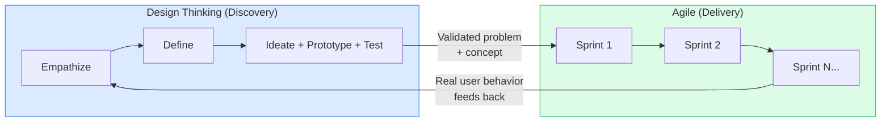
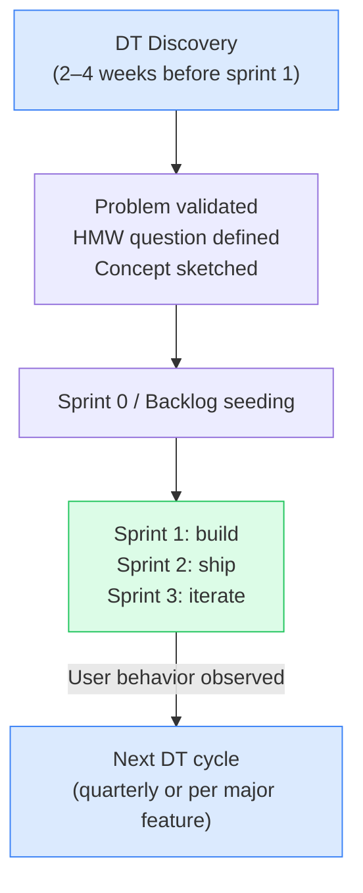

# Day 4 — Your Agile Brain, Upgraded

> **Today's one idea:** DT finds the right problem; Agile builds it right — they solve different problems and belong in the same toolkit.
> **Reading time:** ~35 min · **Prereqs:** Days 1–3
> **Primary source for today:** Jeanne Liedtka, "Why Design Thinking Works," *Harvard Business Review*, vol. 96, no. 5, September–October 2018, pp. 72–79
> **Before you start:** Recall Day 3's load-bearing idea — one sentence, no looking. *What is the core rhythm of Design Thinking — and what does it mean to say the loop has backward arrows?*

---

## The hook

You've been running sprints. You write user stories. You do retrospectives. You deliver working software in two-week cycles. You're doing the thing.

And then someone says: "We need to do Design Thinking."

Your first instinct: *Is this going to replace sprints? Are we throwing out the backlog? Are we going back to waterfall?*

Your second instinct: *We already talk to users. We have a product manager. We write "As a user, I want..." — isn't that human-centered?*

Both instincts are reasonable. Both are based on a false premise: that DT and Agile are competitors.

They are not. They are tools built for different questions, and once you see the distinction clearly, you will understand exactly where DT fits in — and stop feeling like you have to choose.

---

## Building the intuition

Think of Agile and DT as answering two fundamentally different questions:

| | Agile | Design Thinking |
|--|-------|-----------------|
| **Primary question** | How do we build the right *thing* reliably and adaptably? | What is the *right thing* to build? |
| **Time horizon** | Sprint-to-sprint (1–4 weeks) | Discovery to definition (days to months) |
| **Primary uncertainty** | Execution uncertainty (will we ship on time? will it work?) | Problem uncertainty (are we solving the real problem?) |
| **Unit of output** | Working software | Validated understanding of a human need |
| **Failure mode** | Technical debt, missed deadlines, scope creep | Building the right product for the wrong problem |
| **When it runs** | During delivery | Before and alongside delivery |

Here is the simplest possible picture of how they relate:

DT gives Agile teams a richer, more validated input at the top of the funnel. Agile teams give DT practitioners real behavior data from shipped software that can feed the next discovery cycle.

The Agile ritual you probably already do that is closest to DT is the **user story** — "As a [user], I want [goal] so that [benefit]." But notice what a user story skips: it skips the Empathize and Define phases entirely. The user, the goal, and the benefit are all *assumed*. Design Thinking is the discipline for validating those assumptions before they become sprint commitments.

---

## The formal picture

Liedtka's 2018 HBR paper identifies four specific cognitive mechanisms that DT activates — and it is useful to see how each one maps (or doesn't) to Agile:

| Mechanism DT activates | What it does | Agile equivalent (if any) |
|------------------------|-------------|--------------------------|
| **Journey-based inquiry** | Sees the user's experience as a narrative over time, not a moment-in-time need | Weak — user stories are point-in-time, not journey-based |
| **Assumption surfacing** | Forces teams to make implicit beliefs explicit before testing them | Partial — retrospectives surface process assumptions, rarely product assumptions |
| **Divergent thinking** | Generates multiple competing framings before committing to one | Almost absent — Agile is convergent by design (prioritize, commit, ship) |
| **Prototyping for learning** | Builds cheap artifacts to answer questions, not to demonstrate progress | Partial — spikes exist, but most sprints produce potentially shippable features, not question-answering artifacts |

The implication: Agile is excellent at convergent execution. It was not designed for divergent discovery. DT fills that gap.

The most common integration pattern in product teams today:

You will build this integration in detail on Day 26. Today, you just need the mental model: DT is upstream of Agile, not parallel to it.

---

## Where it breaks / what it is not

**DT is not "research theater" that delays delivery.** The most common organizational resistance to DT is: *"We don't have time to empathize — we have a release date."* The counterargument: you don't have time NOT to. The cost of discovering, in Sprint 5, that you were solving the wrong problem is vastly higher than two weeks of discovery work before Sprint 1. Liedtka's 2018 study found that DT-informed projects had significantly higher success rates and lower rework costs.

**Agile user stories are not Design Thinking.** A user story written without Empathize-phase research is a hypothesis, not a validated need. This is fine — all product work involves hypotheses. But calling it "human-centered" because it uses the "As a user..." format is misleading. DT is what happens before you write the user story.

**DT does not replace product management.** DT is a set of methods. Product managers, designers, engineers, and researchers use those methods. DT doesn't tell you who should run the research, who should facilitate the ideation, or who owns the POV statement — those are organizational questions.

**"Design Sprints" (from the *Sprint* book) are not the same as Design Thinking.** A Design Sprint is a compressed, 5-day version of the DT loop — a structured protocol for one team on one problem. DT is the broader mindset and method set. We will cover this distinction fully on Day 27.

---

## Try it yourself

> **Close this page before attempting Exercise 1.**

**Exercise 1 — Retrieval.** Without looking: what is the fundamental difference between what Agile answers and what Design Thinking answers? Write one sentence per framework.

Compare to this

Agile answers: *How do we build the right thing reliably?* — it is a delivery framework optimized for execution uncertainty. Design Thinking answers: *What is the right thing to build?* — it is a discovery framework optimized for problem uncertainty. If you wrote something close to this (same meaning, different words), you have it.

---

**Exercise 2 — Direct application.** In your current or most recent Agile project: identify one user story or backlog item where the "user," "goal," and "benefit" were assumed rather than researched. What would the Empathize phase have done before that story was written? Be specific — what would you have observed or asked?

What a strong answer looks like

A strong answer names the specific story (e.g., "As a manager, I want to export reports as CSV so I can share them with my team") and identifies the assumption (e.g., "we assumed the problem was file format, not sharing mechanism"). The DT approach before writing it would have been: observe two or three managers doing their actual reporting workflow — watch what they export, where it goes, who they send it to, and whether CSV is the format they actually use downstream. The research might reveal that managers export to Excel but then paste into PowerPoint, which implies the real need is a different output format entirely.

---

**Exercise 3 — Stretch (spaced callback from Day 1).** Day 1 introduced the idea of "tame" vs. "wicked" problems. Which type does Agile handle well, and which type does DT exist to address — and why does the distinction matter for deciding *when* to run a DT cycle?

The argument

Agile handles tame problems well: the solution space is known, requirements can be decomposed into stories, and progress is measurable in working software. DT exists for wicked problems: where the problem formulation is itself contested, user needs are latent and unobservable through self-report, and the act of building and testing reshapes the problem. The practical implication: you should run a DT discovery cycle when entering a new user segment, launching a new product area, or when user research is scarce and assumptions are high. You do not need DT to add a configuration option to an existing feature where user feedback is already clear.

---

**Transfer — apply it:**

> In your current product development work, where does DT discovery naturally belong — before the next sprint cycle, at the start of a quarterly planning cycle, or at a specific phase transition? Write one sentence describing where you would insert the DT loop.

---

## Connect it back

The first four days have built a coherent foundation: DT questions the problem (Day 1), because users can't fully report their needs (Day 2), through a diverge–converge loop (Day 3), that sits upstream of Agile delivery (Day 4). You now have the full mental model. Tomorrow's Day 5 answers the last remaining foundational question: when is DT the right tool, and when is it overkill?

**Sharp question you should be able to answer now:** If someone on your team said "we don't need Design Thinking — we already write user stories," what is the specific, concrete gap in that argument that today's page gives you the language to name?

---

## Suggested readings for today

**Required if you have 15 extra minutes:**
Jeanne Liedtka, "Why Design Thinking Works," *Harvard Business Review*, vol. 96, no. 5, September–October 2018, pp. 72–79. Read the sections "A New Kind of Innovation Process" and "How Design Thinking Works" (roughly the first half of the article). These two sections are where the four cognitive mechanisms come from — they are the empirical grounding for today's argument. The article is available with an HBR account (free articles per month available without subscription).

**Free video:**
AJ&Smart, *"Design Thinking vs Design Sprint — what's the difference?"* — AJ&Smart YouTube channel. Search YouTube: `AJ Smart design thinking vs design sprint difference`. ~8 min. Directly addresses the DT/Sprint/Agile confusion in a product-team context. Very practical; the speaker's framing of "problem space vs. solution space" complements today's page well.

**If you want the deep version:**
Jeanne Liedtka, "Perspective: Linking Design Thinking with Innovation Outcomes through Cognitive Bias Reduction," *Journal of Product Innovation Management*, vol. 32, no. 6, 2015, pp. 925–938. DOI: 10.1111/jpim.12163. This is the academic paper beneath the HBR piece — it argues that DT works by countering specific cognitive biases (confirmation bias, anchoring) that systematically derail product development. Skim the abstract and discussion sections; the methodology is L3 territory.

---

## Navigation

← **Previous:** [Day 3 — The Five Phases as One Loop](./day-03-five-phases-as-one-loop.md)
→ **Next:** [Day 5 — Wicked Problems](./day-05-wicked-problems.md)
