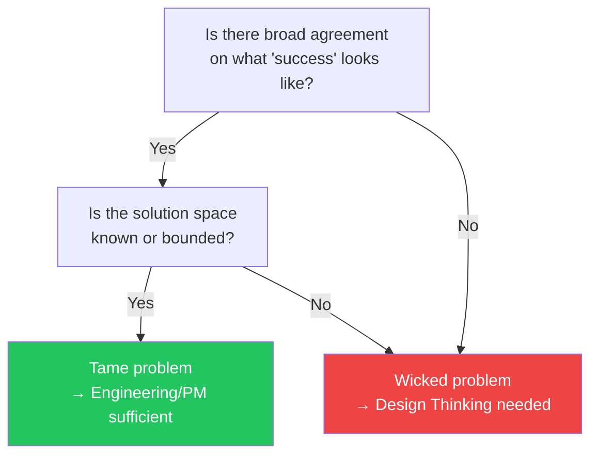

# Day 5 — Wicked Problems

> **Today's one idea:** DT is most valuable when the question itself is wrong — when defining the problem is the real work.
> **Reading time:** ~40 min · **Prereqs:** Days 1–4
> **Primary source for today:** Richard Buchanan, "Wicked Problems in Design Thinking," *Design Issues*, vol. 8, no. 2, Spring 1992, pp. 5–21
> **Before you start:** Recall Day 4's load-bearing idea — one sentence, no looking. *What is the fundamental difference between what Agile solves and what Design Thinking solves?*

---

## The hook

In 1973, two urban planners — Horst Rittel and Melvin Webber — published a paper that would become the quiet intellectual ancestor of Design Thinking, even though it never mentioned design.

They were trying to understand why urban planning kept failing. Not in execution — the projects were built. But the problems they were trying to solve kept getting worse. They built highways and traffic got worse. They built low-income housing and neighborhoods deteriorated. They improved nutrition programs and the social conditions creating malnutrition persisted.

Rittel and Webber's conclusion: some problems are fundamentally different from the problems engineers are trained to solve. They called them **wicked problems** — not because they are evil, but because they resist the very act of being defined.

Their list of ten properties of wicked problems includes these:

1. There is no definitive formulation of a wicked problem.
2. Wicked problems have no stopping rule — you can always refine further.
3. Solutions to wicked problems are not true-or-false, but good-or-bad.
4. There is no immediate and no ultimate test of a solution.
5. Every attempt to solve a wicked problem is a "one-shot operation" — you cannot undo it without new consequences.

Richard Buchanan, in 1992, applied this framework to design. His claim: design is uniquely suited to wicked problems, because designers have always worked in the space where the problem and the solution are co-created — where defining the problem IS part of solving it.

Design Thinking is, at its core, a methodical approach to wicked problems.

---

## Building the intuition

Let's make wicked vs. tame concrete with three examples from product development:

| Problem | Tame or wicked? | Why |
|---------|-----------------|-----|
| "Reduce API response time from 800ms to under 200ms" | Tame | Clear formulation, measurable success, known solution space (caching, CDN, query optimization), reversible changes |
| "Improve user retention for our B2B SaaS product" | Wicked | "Retention" changes meaning depending on user segment, success metric is contested (monthly active vs. feature adoption vs. renewal rate), solving one segment's retention may harm another's, the problem shifts as the product evolves |
| "Help nurses reduce medication errors on hospital wards" | Wicked | The problem has multiple competing framings (is it a software problem? a process problem? a staffing problem? a training problem?), stakeholders disagree on what "better" looks like, and every solution reshapes the system in ways that create new problems |

The wicked/tame distinction is not about difficulty. A tame problem can be technically extremely hard (landing a rover on Mars). A wicked problem can have simple-seeming solutions (a checklist) that work where complex systems (new software) fail. The distinction is about whether the *problem formulation itself is settled*.

Here is the practical test for whether you're facing a wicked problem:

If either answer is "no," you are in wicked territory. If both answers are "yes," DT is overkill — use your standard problem-solving toolkit.

---

## The formal picture

Buchanan's key move in the 1992 paper was to argue that design — and by extension, Design Thinking — occupies a unique position in human knowledge because it is not a science (which studies the given world) or an art (which expresses a personal vision), but a discipline for creating what does not yet exist.

The most important formal claim for practitioners:

> In a wicked problem, **the solution is not found — it is negotiated.** The act of engaging stakeholders, observing users, and prototyping changes the understanding of the problem itself. There is no "solving" a wicked problem; there is only moving it into a more tractable state.

This reframes what DT success looks like. You are not trying to "solve" user retention. You are trying to move the problem from wicked (contested, undefined) to tame enough (clear enough, bounded enough) that your team can act on it with confidence.

The DT loop is the negotiation mechanism:

| Phase | What it does to the problem |
|-------|---------------------------|
| **Empathize** | Reveals which framings of the problem are real vs. assumed |
| **Define** | Commits the team to one tractable framing for this iteration |
| **Ideate** | Generates responses to that framing |
| **Prototype** | Makes one response concrete enough to evaluate |
| **Test** | Reveals whether the framing was right, or whether to return and reframe |

The loop converts a wicked problem into a series of tame sub-questions — each one answerable in a sprint — while keeping the team honest about the fact that they are working on an evolving problem, not a fixed one.

---

## Where it breaks / what it is not

**"Wicked" is not an excuse for permanent ambiguity.** Some teams use the concept of wicked problems to justify never committing to a problem statement — "it's wicked, so we can't know anything." This is wrong. The Define phase exists precisely to force a commitment to one tractable framing, even knowing it is provisional. "We don't fully understand the problem" is not a reason to skip definition; it is the reason to make definition rigorous.

**Not every product problem is wicked.** When a bug reproducibly crashes the app for users with a specific locale setting, that is tame. Don't run an empathy session to understand what the user feels about the crash. Fix the bug. DT is expensive in time and attention — use it proportionally.

**Wicked problems don't get "solved."** This is the hardest mental shift for product teams optimized for shipping. The outcome of a DT cycle is not a finished product — it is a better-informed next iteration. Retention doesn't get "fixed." It gets moved to a state where you understand one more thing about why users leave, and you have tested one more intervention. Progress, not closure.

---

## Try it yourself

> **Close this page before attempting Exercise 1.**

**Exercise 1 — Retrieval.** Without looking: what makes a problem "wicked" — give two properties from Rittel and Webber's list in your own words. Then: what does Buchanan say design is uniquely suited to, that distinguishes it from science or engineering?

Compare to this

Two acceptable properties (in any form): (1) there is no definitive formulation — the problem definition keeps shifting, (2) there is no stopping rule — you can always refine further, (3) solutions are not right/wrong but better/worse. Buchanan's claim: design occupies the space between science (studying the given world) and art (expressing a personal vision) — it is the discipline for creating what does not yet exist, which is precisely the space where wicked problems live.

---

**Exercise 2 — Direct application.** Take a real product problem your team is currently working on. Run the two-question wickedness test from the flowchart above: (a) Is there broad agreement on what success looks like? (b) Is the solution space known or bounded? Write your answers. If the problem is wicked, name the specific source of the wickedness (contested success metric? multiple competing framings? stakeholder disagreement?).

What a strong answer looks like

A strong answer is specific about *why* the problem is wicked. For example: "We are working on reducing churn for enterprise customers. (a) No — sales defines success as renewal rate, customer success defines it as feature adoption, and the exec team measures NPS. (b) No — we have tried onboarding improvements, dedicated CSMs, and product usage alerts, and none have clearly moved the metric. The source of wickedness is a contested success metric and an unbounded solution space." This level of specificity is what a DT practitioner sounds like — not "it's complicated" but "here's exactly where the uncertainty lives."

---

**Exercise 3 — Stretch.** The DT loop converts a wicked problem into a series of tame sub-questions. Given a wicked problem like "improve nurse medication safety," propose one concrete tame sub-question that a DT team might commit to after an Empathize phase, and explain what kind of research would have to happen to justify that specific commitment.

A sample answer

After observing nurses during medication rounds, a DT team might commit to: "How might we help nurses verify the right medication is being given to the right patient at the point of administration?" — a specific, bounded question. To justify this commitment, the Empathize phase would need to have revealed: (a) that most errors happen at the point of administration (not at prescribing or dispensing), (b) that nurses experience time pressure at that specific moment, and (c) that current verification workflows are routinely skipped under pressure. Without this specific evidence from observation, the HMW question is just a guess.

---

**Transfer — apply it:**

> Name the wickedest problem you are currently paid to work on — the one where success is most contested and the solution space is least defined. Write one sentence: what is the specific source of the wickedness (contested metric? multiple framings? unknown user segment?).

---

## Connect it back

The foundations arc is now complete. Five days have built one coherent picture: DT exists because some problems — the most important ones — resist being defined, and definition requires a rigorous, human-centered process. You now have the mental model, the map of the loop, the relationship to Agile, and the theory of when DT is the right tool.

Starting Day 6, you begin acquiring methods. The first and longest arc is Empathize — because everything downstream depends on the quality of what you observe.

**Sharp question you should be able to answer now:** What is the difference between a hard problem and a wicked problem — and why does that difference determine whether you reach for Design Thinking or for your standard engineering toolkit?

---

## Suggested readings for today

**Required if you have 15 extra minutes:**
Richard Buchanan, "Wicked Problems in Design Thinking," *Design Issues*, vol. 8, no. 2, Spring 1992, pp. 5–21. Read pp. 5–14 (through the section "Signs, Things, Actions, Thoughts"). Buchanan's argument for why design is uniquely positioned for wicked problems is clearest in these pages. Available via JSTOR (free account gives limited monthly reads). DOI: 10.2307/1511637.

**Free video:**
MITx / MIT Sloan, *"What is Design Thinking?"* — Search YouTube: `MIT design thinking what is` — a short MIT-sourced explainer (~5–8 min) on the wicked problem framing and DT's role. Also useful: search YouTube `wicked problems design thinking` — there are several concise explainers (Interaction Design Foundation, AJ&Smart) that reinforce today's concept.

**If you want the deep version:**
Rittel, H.W.J. and Webber, M.M. "Dilemmas in a General Theory of Planning," *Policy Sciences*, vol. 4, no. 2, 1973, pp. 155–169. DOI: 10.1007/BF01405730. The original paper — read pp. 155–167 for the full list of ten wicked-problem properties. This is the primary source behind Buchanan; reading it makes the concept precise rather than fuzzy. ~30 additional minutes; worth it if the concept resonated strongly.

---

## Navigation

← **Previous:** [Day 4 — Your Agile Brain, Upgraded](./day-04-agile-brain-upgraded.md)
→ **Next:** [Day 6 — Empathy vs. Sympathy](../../02-empathize/days/day-06-empathy-vs-sympathy.md)
