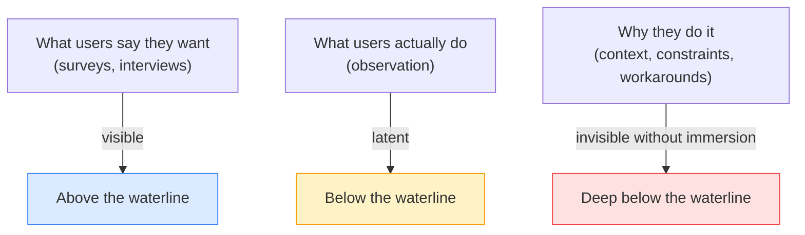

# Day 6 — Empathy vs. Sympathy

> **Today's one idea:** Empathy in Design Thinking means observing latent needs, not asking people what they want.
> **Reading time:** ~35 min · **Prereqs:** Days 1–5
> **Primary source for today:** Tim Brown, *Change by Design*, HarperBusiness, 2009, Chapter 3 ("Building to Think")
> **Before you start:** Recall Day 5's load-bearing idea — one sentence, no looking. *What makes a problem "wicked," and why does that property make Design Thinking necessary?*

---

## The hook

In 2001, IDEO was asked to redesign the patient experience in an emergency room. The hospital's executives described the problem as: waiting times are too long and patients feel anxious.

An obvious solution: add more TVs to the waiting room, put a live countdown timer on the wait, improve the seats.

Instead, an IDEO researcher did something unusual. She checked herself in as a patient, lay down on a gurney, and spent a full day being wheeled around the hospital from the patient's point of view.

What she found: the dominant experience of being a hospital patient is staring at ceilings. Every transit — from intake to imaging to a ward — is spent lying on your back looking up. The ceilings were industrial, unmaintained, and identical. The emotional experience of the hospital was shaped almost entirely by a surface nobody in the hospital had ever looked at, because nobody in the hospital ever looked *up*.

The solution IDEO proposed started with the ceilings.

No survey would have found this. No focus group would have surfaced it. The insight was invisible to anyone who had never experienced the hospital from a gurney.

This is the difference between sympathy and empathy.

---

## Building the intuition

**Sympathy** is understanding someone's situation from your own perspective. *"I know waiting in a hospital is stressful — I'd want faster service and better chairs."* You're projecting what you would feel.

**Empathy**, as Design Thinking uses the word, is something harder: it is understanding someone's situation from *their* perspective — specifically from the perspective of their actual behavior, context, and constraints, which often differs dramatically from what they would report in a survey.

Three reasons users cannot fully report their own needs:

1. **Adaptation.** People adapt to bad experiences and stop noticing them. If a hospital has always had industrial ceilings, patients adapt — they don't think to complain about it. They adapt to the workaround. They stop feeling the problem acutely.

2. **Articulation gap.** Even when people feel a need, they often cannot articulate it in a way that points to a design solution. "I feel anxious in the hospital" is true. "The ceilings are the problem" is not something a patient would ever say — but it is what observation reveals.

3. **Optimism bias in self-report.** When asked "how do you currently do X?", people tend to describe how they *intend* to do X, not how they actually do it. Ask a developer how they handle error logging; they'll describe the ideal process. Observe them under deadline pressure; they'll tell you what actually happens.

The practical consequence for product teams: **interviews and surveys capture the tip of the iceberg.** Observation, contextual inquiry, and immersive research capture what is below the waterline.

DT's empathy phase is specifically designed to get below the waterline. Days 7 and 8 give you the two primary tools for doing this.

---

## The formal picture

The d.school *Bootcamp Bootleg* defines empathy in DT as a three-part activity:

| Activity | What it produces | Tool used |
|----------|-----------------|-----------|
| **Observe** | What users do (behavior, workarounds, adaptations) | Field observation (Day 8) |
| **Engage** | What users say (stories, emotions, mental models) | Research interview (Day 7) |
| **Immerse** | What users experience (first-person, in-context) | Shadowing, role-playing, simulated use |

At L1 practitioner level, you will use Observe and Engage. Immerse (what the IDEO researcher did in the hospital) is the gold standard but requires more time and access than most product teams can routinely allocate.

The goal of all three activities is the same: **surface the gap between what users say, what they do, and what they feel** — because that gap is where the most actionable insights live.

One critical design principle for DT empathy research: **talk to the extremes, not just the average.** Extreme users (power users and total beginners; people for whom the stakes are highest; people who use your product in unexpected ways) reveal the edges of the problem space that moderate users adapt around. The nurse who has created an elaborate workaround for your medication tracking tool will teach you more than ten nurses who have learned to live with it.

---

## Where it breaks / what it is not

**Empathy does not mean giving users whatever they say they want.** Day 2 made this point from the cognitive science side; today it is worth restating from the DT side. Empathy is about understanding the need, not agreeing with the proposed solution. The patient lying on the gurney needs to feel calm and safe — that's the insight. The patient would not have said "fix the ceilings." Empathy surfaces the need; design solves it.

**Empathy research is not therapy.** You are not asking users to process their emotions with you. You are gathering specific behavioral data. The emotional material (what users feel) is evidence, not the session's purpose.

**A single interview is not empathy research.** One conversation gives you one perspective. The d.school recommends a minimum of 5 interviews with distinct users before moving to Define — enough to see where patterns emerge and where outliers appear. For product teams: think "3–5 contextual conversations before writing a POV statement," not "one user call before writing user stories."

**Empathy is not just for the Empathize phase.** You will reactivate the same skill in the Test phase (Day 23) when you watch users interact with your prototype. The ability to observe behavior without jumping to interpretation is the rate-limiting meta-skill of DT.

---

## Try it yourself

> **Close this page before attempting Exercise 1.**

**Exercise 1 — Retrieval.** Without looking: name the three reasons users cannot fully report their own needs. One word or phrase each is enough — then write one sentence on what the practical consequence is for product teams.

Compare to this

The three reasons: (1) **Adaptation** — people stop noticing problems they've learned to live with; (2) **Articulation gap** — even felt needs cannot always be translated into design-actionable language; (3) **Optimism bias in self-report** — people describe their intended behavior, not their actual behavior. Practical consequence: surveys and self-reported interviews systematically miss the most important insights, which are only visible through behavioral observation.

---

**Exercise 2 — Direct application.** Name one product or feature your team owns where user surveys or support tickets are your primary empathy data. Now ask: what would an observer discover by watching a user interact with this feature for 20 minutes that would *not* appear in any ticket or survey? Write two sentences — the first describing what the survey captures, the second speculating on what observation would add.

What a strong answer looks like

Strong answers are specific. For example: "Our surveys tell us users find the report export feature 'somewhat difficult.' An observer would likely see that users export to CSV, open it in Excel, manually reformat the date columns, and then paste it into a slide — which means the actual problem is not the export format but the downstream formatting step, which we have never addressed." If you can't speculate at all, that is itself the insight: you don't yet know what users do with your output.

---

**Exercise 3 — Stretch.** The page recommends talking to "extreme users" rather than average users. Design a one-sentence profile for two extreme users of a B2B project management tool: one at the "power user" extreme and one at the "total beginner" extreme. Then explain what each extreme would reveal that a "typical user" would not.

A sample answer

**Power user:** A project manager who runs 15 simultaneous projects across three time zones and has built a custom color-coding system using tags because the default views don't give them the signal they need. *What they reveal:* the exact limits of the tool's information architecture — where it breaks under real load and what workarounds sophisticated users invent. **Beginner:** A new team member assigned to use the tool for the first time with no training, in a time-pressured onboarding week. *What they reveal:* which default UI patterns are unintuitive (they haven't adapted yet), where the tool fails to explain itself, and what the "day 1 cliff" looks like. The average user has adapted to both sets of pain points and will report neither.

---

**Transfer — apply it:**

> Think of a user interaction with your product that you currently understand only through survey data or analytics. Write one sentence: what would you need to observe — specifically, in what context, with what type of user — to get below the waterline?

---

## Connect it back

Day 5 established that wicked problems resist being defined by the people experiencing them. Day 6 explains the mechanism: users are adapted to their problems, can't always articulate them, and describe idealized rather than real behavior. The empathy methods on Days 7 and 8 are specifically designed to circumvent these three limitations.

Tomorrow you pick up the first tool: the research interview. It is the closest you can get to a user's mental model without watching them in real context — and it has a specific set of techniques that make it dramatically more useful than a standard product call.

**Sharp question you should be able to answer now:** What is the difference between sympathy and empathy in the Design Thinking sense — and why does that difference change what you do in a research session?

---

## Suggested readings for today

**Required if you have 15 extra minutes:**
Tim Brown, *Change by Design* (HarperBusiness, 2009), Chapter 3, pp. 71–90. Brown's discussion of observation and empathy includes the IDEO shopping cart case and several medical examples. This chapter is the richest narrative version of today's argument.

**Free video — watch this today:**
IDEO / ABC Nightline, *"The Deep Dive"* (1999 ABC Nightline special on IDEO redesigning a shopping cart) — Search YouTube: `IDEO shopping cart ABC Nightline deep dive`. ~22 min. This is the single most famous real-world DT demonstration — you will see empathy research, ideation, prototyping, and testing all in one compressed example. It is required viewing for any DT practitioner. Watch before Day 8.

**Free video — short companion:**
NNgroup, *"Sympathy vs. Empathy in UX"* — NNgroup YouTube channel. Search YouTube: `NNgroup sympathy empathy UX`. ~4 min. Directly reinforces today's distinction with product design examples.

**If you want the deep version:**
Stanford d.school, *Design Thinking Bootcamp Bootleg* (2018), pp. 9–18 ("Empathy" section). The d.school's field guide treatment of all three empathy activities (observe, engage, immerse) with practical tips and common mistakes. Free PDF — download at dschool.stanford.edu/resources.

---

## Navigation

← **Previous:** [Day 5 — Wicked Problems](../../01-foundations/days/day-05-wicked-problems.md)
→ **Next:** [Day 7 — The Research Interview](./day-07-research-interview.md)
