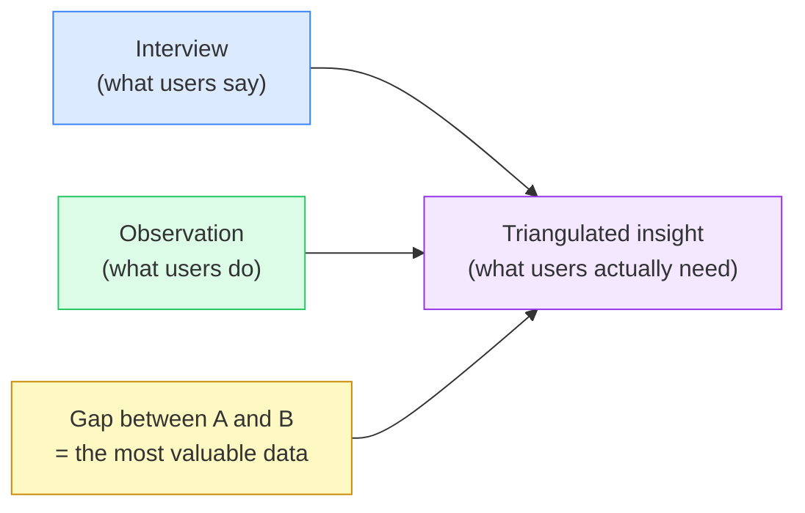

# Day 8 — Observation in the Field

> **Today's one idea:** What people do vs. what they say reveals hidden needs — the gap between the two is where the most valuable insights live.
> **Reading time:** ~35 min · **Prereqs:** Days 6–7
> **Primary source for today:** IDEO.org, *The Field Guide to Human-Centered Design*, IDEO, 2015, pp. 39–50. Free download at designkit.org/resources/1.
> **Before you start:** Recall Day 7's load-bearing idea — one sentence, no looking. *Why do you ask about a specific past incident rather than how someone "usually" does something?*

---

## The hook *(callback to Day 3 — the diverge/converge loop)*

A team at a major bank was tasked with improving customer experience at ATMs. They conducted interviews. Users said: "ATMs are fine. Fast, convenient. I just wish they were more secure."

Then a researcher spent a week observing ATM behavior in the field.

What she saw: people approach ATMs, look over their shoulder, perform the transaction as fast as possible, and walk away quickly — even when no one is nearby. They swipe their card before anyone approaches. They shield the keypad with their whole body. They look up repeatedly during the transaction.

The users had said: "ATMs are fine." Their bodies were saying: "I feel vulnerable every time I use this."

No interview would have surfaced this. The behavior was automatic — below conscious awareness. Users had adapted to the anxiety so thoroughly that they didn't think to report it. They reported their opinion of ATMs (fine, fast, convenient) rather than their experience of using them (anxious, hurried, watchful).

The insight that emerged from observation — *ATM use is experienced as a moment of physical vulnerability* — led to a completely different design direction than "make it more secure" (which was the surface-level stated preference).

---

## Building the intuition

Observation is the empathy method you use when what people say is insufficient — either because they can't articulate the need, have adapted to the problem, or because the behavior is automatic and below conscious reporting.

There are three things observation captures that interviews miss:

| What observation sees | Why interviews miss it |
|----------------------|----------------------|
| **Body language and spatial behavior** | Users don't describe how they position their body, where they look, how tense they are | 
| **Workarounds and adaptations** | Users have internalized these — they don't think of them as problems, so they don't report them |
| **Environmental context** | The desk, the tools, the interruptions, the lighting — context shapes behavior in ways users don't credit |

The practical technique for product teams is **contextual observation**: watching users do their actual work, in their actual environment, without directing or correcting them. You are a researcher, not a teacher.

**How to observe well:**

1. **Pick the right moment.** Observe at the exact moment of the behavior you care about — not before or after. If you're researching how nurses administer medication, observe during medication rounds, not during a quiet moment.

2. **Be a fly on the wall, not a co-worker.** Your presence will change behavior — this is unavoidable, but you can minimize it by staying quiet, sitting back, and saying "just pretend I'm not here, keep going" when they look at you for direction.

3. **Note everything, interpret nothing (yet).** The observation phase is for raw data, not conclusions. Write down exactly what you see: "User opened a second browser tab, typed the reference number into a spreadsheet, then switched back." Don't write "User finds the tool confusing." Save interpretation for the empathy map (Day 9).

4. **Watch for the three gold signals:**
   - **Workarounds:** sticky notes, second tools, manual steps that shouldn't need to exist
   - **Hesitation:** moments of pause, re-reading, looking around for help
   - **Mismatch:** any moment where what the user does diverges from what you expected or from what they described in an interview

---

## The formal picture

Contextual observation has a structured format called **AEIOU** — a note-taking framework that ensures you capture the full context of behavior:

| Letter | Stands for | What to note |
|--------|-----------|-------------|
| **A** | Activities | What specific tasks are people doing? What is the sequence? |
| **E** | Environments | What does the physical or digital context look like? What tools, objects, screens are present? |
| **I** | Interactions | How does the person interact with tools, systems, or other people? Who do they turn to when stuck? |
| **O** | Objects | What physical or digital objects do they use, modify, or ignore? |
| **U** | Users | Who is this person? What role, constraints, and goals do they bring to this moment? |

AEIOU is not a form you fill out sequentially — it is a checklist you run mentally to make sure your notes are rich enough for synthesis later. The most commonly missed dimension is **O (objects)** — the spreadsheet tab they have open in the background, the handwritten note taped to the monitor, the second phone they use as a calculator.

**The observation + interview combination:**

Used together, interviews and observation triangulate toward the truth:

When what users say and what users do align → your interview data is reliable.
When they diverge → the gap is an insight signal. Investigate the divergence.

---

## Where it breaks / what it is not

**You can't observe everything.** Some experiences can't be accessed through field observation — private moments, high-stakes situations (surgery, crisis response), or infrequent events. In these cases, use the interview's incident-recall technique (Day 7) as a proxy. "Tell me about the last time X happened" is a verbal substitute for direct observation.

**Observation is not surveillance.** Always obtain informed consent: explain who you are, what you're observing, and how the data will be used. Participants should be able to stop the observation at any time.

**One observation is not data.** One observed session tells you what one person did once. The pattern emerges from 3–5 observation sessions with different users, in different contexts. The ATM researcher spent a week, not an afternoon.

**Don't correct the user.** If you observe someone doing something "wrong" — using a feature in an unintended way, making a mistake — resist the urge to help. Their "wrong" behavior is your most valuable data. It reveals a design gap.

---

## Try it yourself

> **Close this page before attempting Exercise 1.**

**Exercise 1 — Retrieval.** Without looking: what are the three things observation captures that interviews miss? Name each one in three words or fewer.

Compare to this

(1) Body language and spatial behavior, (2) workarounds and adaptations, (3) environmental context. If you had all three in any words that convey the same meaning, you have it. If you missed one — the most commonly forgotten is environmental context (the physical or digital setting shapes behavior in ways users never consciously attribute to it).

---

**Exercise 2 — Direct application.** You have 30 minutes to observe a colleague using a software tool your team owns. Using the AEIOU framework: write one concrete observation note for each letter. Be specific — "user opened a second tab" is better than "user seemed confused."

What strong notes look like

**A (Activities):** User pasted a Jira ticket number into the search bar, got no results, then navigated manually through the project dropdown to find it.
**E (Environment):** Two monitors; left monitor has Slack open and visibly active; right monitor has the tool plus a spreadsheet tab in the background.
**I (Interactions):** User switched to the spreadsheet twice during the session, appeared to be copying reference numbers rather than using the tool's linking feature.
**O (Objects):** Sticky note on the monitor with three handwritten status codes and their meanings — not visible anywhere in the tool itself.
**U (User):** Senior developer, using the tool for cross-team dependency tracking; expressed mild frustration at the search function, otherwise matter-of-fact.

The sticky note with status codes is the workaround signal — the gold signal that reveals a design gap.

---

**Exercise 3 — Stretch (spaced callback from Day 3).** Day 3 introduced the idea that test results can send you back to Empathize (not just Define or Ideate). Describe a scenario where observation data from the field would send a DT team back to reframe their problem statement — not just refine their solution.

The core argument

If observation reveals that the user group you designed for is not the one who actually experiences the problem most acutely — e.g., you assumed the problem was felt by frontline nurses, but observation reveals it is actually most acute for the charge nurse doing end-of-shift summaries — then your POV statement (which named a specific user) is wrong. You need to return to Define (rewrite the POV) or even return to Empathize (observe charge nurses, not floor nurses) before any prototype will be relevant. The signal: not "our solution doesn't work well enough" but "our solution is irrelevant to the person in the room."

---

**Transfer — apply it:**

> Name one part of your product's user workflow that you have never directly observed — only heard about through support tickets, surveys, or PMs. Write one sentence: what would you physically set up to observe it (who, where, when, for how long)?

---

## Connect it back

Days 6, 7, and 8 together give you the full empathy data-collection toolkit: why to go below the waterline (Day 6), how to interview for stories (Day 7), and how to observe for behavior (Day 8). Starting Day 9, you begin converting that raw material into structured artifacts — the empathy map, which is the first synthesis tool of the course.

Synthesis is the rate-limiting skill. Today is the last day of pure data collection. Tomorrow the work gets harder.

**Sharp question you should be able to answer now:** You observe a user doing something that contradicts what they told you in an interview. What do you do with that contradiction — ignore it, report it, or investigate it — and why?

---

## Suggested readings for today

**Required if you have 15 extra minutes:**
IDEO.org, *The Field Guide to Human-Centered Design* (2015), Methods 1–5 ("Immerse Yourself in Stories," "Interview," "Group Interview," "Expert Interview," "Peers Observing Peers"), pp. 39–50. Free PDF at designkit.org/resources/1. Focus on the observation methods — each one is a one-page template with instructions and a photo example.

**Free video — watch today:**
IDEO / ABC Nightline, *"The Deep Dive"* — if you haven't watched it from Day 6's recommendation, watch it now. Search YouTube: `IDEO shopping cart ABC Nightline deep dive`. ~22 min. The first 8 minutes show observation in the field in a real product context — directly illustrates today's AEIOU signals appearing in real time.

**Free video — short companion:**
NNgroup, *"Field Studies: Definition"* — NNgroup YouTube channel. Search YouTube: `NNgroup field studies`. ~5 min. Rigorous definition and practical scoping of contextual observation, from the most credible UX research organization.

**If you want the deep version:**
Beyer, Hugh and Karen Holtzblatt. *Contextual Design: Defining Customer-Centered Systems.* Morgan Kaufmann, 1998. Ch. 3 ("The Customer Interview") and Ch. 4 ("Interpreting the Customer's Work"). The definitive academic treatment of contextual inquiry — the method that underpins today's page. Reading time for two chapters: ~60 additional minutes. This is L2 territory; flag it for after Day 28 if the observation methods resonated strongly.

---

## Navigation

← **Previous:** [Day 7 — The Research Interview](./day-07-research-interview.md)
→ **Next:** [Day 9 — The Empathy Map](./day-09-empathy-map.md)
