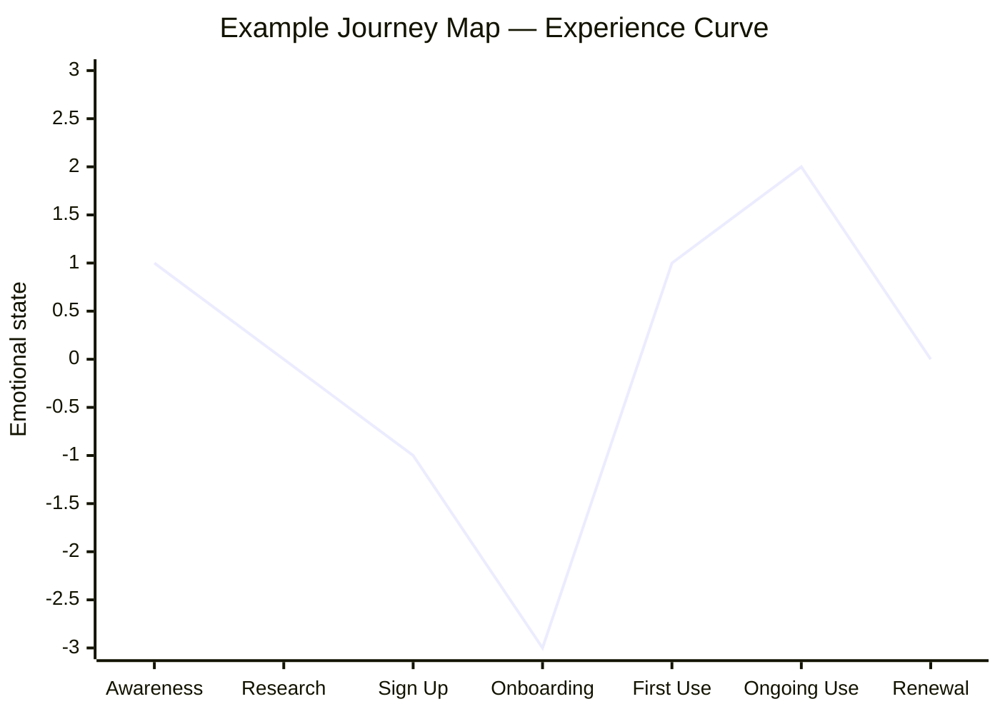

# Day 10 — Journey Mapping

> **Today's one idea:** A journey map shows where pain and delight cluster across a user's experience over time — turning a static portrait into a story with a beginning, middle, and crisis.
> **Reading time:** ~40 min · **Prereqs:** Days 6–9
> **Primary source for today:** Liedtka, Jeanne, and Tim Ogilvie. *Designing for Growth.* Columbia Business School Publishing, 2011. Tool 4 "Journey Mapping," pp. 48–57.
> **Before you start:** Recall Day 9's load-bearing idea — one sentence, no looking. *What is the most valuable thing you can find in an empathy map that raw interview notes alone won't show?*

---

## The hook *(spaced callback to Day 5 — wicked problems)*

Think about the last time you had a genuinely bad experience with a product or service. Not a momentary frustration — a whole-experience failure.

Here's a common one: booking an international flight and then discovering, at the gate, that your checked bag exceeds the weight limit. The bag had been fine on the outbound flight. You're confused, stressed, surrounded by other travelers, and now you have to repack in public or pay a fee you didn't budget for.

Where was the failure? Was it:
- The airline's website, which didn't warn you of the return-leg weight rules when you booked?
- The online check-in flow, which mentioned "weight limit" but didn't trigger the discrepancy?
- The check-in kiosk, which didn't flag it either?
- The gate agent, who enforced a rule you didn't know existed?

The answer: all of them, and none of them — because the failure is not in any single touchpoint. It is in the *gap between touchpoints*. The experience was designed as four separate systems (booking, online check-in, kiosk, gate), and nobody mapped the full journey to see what happens at the handoffs.

A journey map would have caught this. The pain point is visible only when you look at the full experience over time.

---

## Building the intuition

An empathy map (Day 9) answers: "Who is this person?"
A journey map answers: "What happens to this person — across time — as they try to accomplish their goal?"

The journey map has two dimensions:

- **Horizontal axis (time):** The stages of the user's experience, in order. These are not your product's feature stages — they are the user's experiential stages. "Awareness → Research → Book → Travel → Return" not "Homepage → Search → Checkout → Confirmation."
- **Vertical axis (emotion):** The user's emotional state at each stage — on a simple scale from very negative to very positive. This produces an **experience curve**: a line graph of highs and lows across the journey.

The experience curve is where the insight lives. Not in the description of each stage, but in:

- **The lowest dips** — where pain is most acute (this is where DT energy belongs)
- **The unexpected lows** — a stage you assumed was neutral that turns out to be painful
- **The widest gaps between expectation and reality** — where the user expected delight and got friction

In this example, Onboarding is the deep trough — the highest-priority DT target. The near-zero at Research is the hidden problem: users feel neutral, which means they haven't yet committed emotionally. Understanding *why* the emotional low at Sign Up (−1) before Onboarding (−3) exists is the first question to investigate.

---

## The formal picture

**Journey map anatomy:**

| Row | What goes here |
|-----|---------------|
| **Stages** | User's experiential phases, named from their perspective |
| **Actions** | What the user does at each stage (observable, from Day 8) |
| **Thoughts** | What the user is thinking at each stage (inferred, from Days 7–9) |
| **Emotions** | The emotional state — plot this as a curve, not just a label |
| **Pain points** | Specific frustrations at each stage |
| **Opportunities** | "How Might We" seeds — design opportunities visible at pain points |

**How to build one (step by step):**

1. **Define the scope.** What journey are you mapping? Name the user archetype (from your empathy map), the goal they are trying to accomplish, and the start and end points. "A first-time B2B SaaS user, trying to get their first report generated, from account creation to exporting results."

2. **Name the stages.** 5–8 stages is the right range. Too few and you miss the nuance; too many and the map becomes unreadable. Name stages from the user's perspective, not the product's.

3. **Fill in actions, thoughts, emotions** from your empathy research (Days 7–9). Every cell should contain data from real observations or interviews — not invented.

4. **Draw the experience curve.** Connect the emotional highs and lows. This is the map's single most important visual element.

5. **Mark pain points and opportunities.** At every emotional low, write a pain point (specific frustration). In the Opportunities row, write a seed HMW question — you will develop these fully on Day 14.

**The relationship between empathy map and journey map:**

| Empathy map | Journey map |
|------------|-------------|
| One moment in time — a portrait | Across time — a story |
| What the user is like | What happens to the user |
| Feeds the Define phase (who) | Feeds the Define phase (where in the journey) |
| Input: all research combined | Input: research organized by stage |

Build both. The empathy map answers "who"; the journey map answers "where does it hurt and when."

---

## Where it breaks / what it is not

**A journey map is not a service blueprint.** A service blueprint shows the internal processes behind each touchpoint (front stage/back stage). A journey map shows the user's experience of those touchpoints. Don't conflate them — the journey map is always from the user's perspective.

**Invented journey maps are dangerous.** A journey map filled with imagined emotions and assumed pain points looks just like a research-based one — but it will mislead your Define phase. Every cell should have a source: a quote, a behavioral observation, or an explicit inference from your research.

**The map is a snapshot.** User journeys evolve as your product evolves. The map you build today describes the *current* experience — it is not a map of the desired future state (that comes out of Ideate). Don't mix current and future state on the same map.

**Focus on one archetype.** A journey map for "all users" is almost always wrong. Different user types have different journeys. If you have two distinct archetypes (from your empathy maps), build two journey maps. The comparison between them is often the most important insight.

---

## Try it yourself

> **Close this page before attempting Exercise 1.**

**Exercise 1 — Retrieval.** Without looking: what are the two axes of a journey map, and what is the single most important visual element the map produces?

Compare to this

**Horizontal axis:** time / the stages of the user's experience. **Vertical axis:** the user's emotional state at each stage. **Most important visual element:** the experience curve — the line graph of emotional highs and lows across the journey. The experience curve is the most important element because it makes pain clusters visible at a glance — you can't get this from a table of descriptions.

---

**Exercise 2 — Direct application.** Pick a product your team owns. Name 5–7 stages of the user journey (from the user's perspective, not the product's feature list). For each stage, assign an emotional state (positive / neutral / negative) based on what you know from analytics, support data, or past conversations. Draw a rough curve. Where is the deepest trough?

What a strong answer looks like

Strong answers name stages that the user would name — not feature names. "Awareness, Evaluation, Sign Up, First Report, Team Collaboration, Renewal" rather than "Homepage, Dashboard, Export Module." The emotional state at each stage should be justified (even briefly): "Sign Up is negative because our support queue shows a spike in 'how do I verify my email' tickets." The deepest trough, once identified, immediately becomes the priority for DT work — before any ideation about features.

---

**Exercise 3 — Stretch.** The journey map row labeled "Opportunities" contains seeds for HMW questions. Take your deepest pain point from Exercise 2 and write two different HMW seeds: one that addresses the pain point directly (incremental) and one that reframes the whole stage (disruptive). What is the difference in what each one would generate in Ideate?

A sample answer

**Pain point:** Users abandon during email verification (Sign Up stage).
**Incremental HMW seed:** "How might we make email verification faster?" → In Ideate, this generates solutions like one-click verification, SMS alternative, magic links. All are improvements to the existing step.
**Disruptive HMW seed:** "How might we eliminate the need for email verification entirely while still ensuring identity?" → In Ideate, this generates solutions like OAuth-only signup, phone verification, social login, invite-only access. It reframes the whole stage.

The disruptive HMW is harder to execute but more likely to produce a breakthrough. The incremental HMW is safer and more immediately actionable. Both are valid — the choice of which to pursue is a product strategy decision, not a DT decision.

---

**Transfer — apply it:**

> Draw a 5-stage journey map for a user of your product in the next 10 minutes — pen and paper, rough emotional curve only. Where is the biggest gap between what your team spends time on and where the emotional trough actually is?

---

## Connect it back

The Empathize module is now complete. You have a research toolkit (interview + observation), two synthesis artifacts (empathy map + journey map), and — most importantly — you understand why each tool exists and what it reveals that the previous one misses. The empathy map gives you the portrait; the journey map gives you the story; and the combination gives you a rich problem space to enter.

Starting Day 11 (Rest & Synthesize I), you will consolidate everything from Days 1–10 before entering the Define phase — where the synthesis bottleneck lives.

**Sharp question you should be able to answer now:** Why is the experience curve more useful than a list of pain points — what does the visual representation show that a list cannot?

---

## Suggested readings for today

**Required if you have 15 extra minutes:**
Liedtka, Jeanne, and Tim Ogilvie, *Designing for Growth* (Columbia Business School Publishing, 2011), Tool 4 "Journey Mapping," pp. 48–57. This is the most concrete, template-based treatment of journey mapping at L1. Includes a worked example and the "opportunities" row explicitly. If you can access only one chapter of this book, this is it.

**Free video — watch today:**
NNgroup, *"Journey Mapping 101"* — NNgroup YouTube channel. Search YouTube: `NNgroup journey mapping 101`. ~8 min. The single best short video on journey mapping — covers anatomy, process, and common mistakes with real examples. Essential viewing.

**Free video — companion:**
NNgroup, *"When to Use Customer Journey Maps"* — NNgroup YouTube channel. Search YouTube: `NNgroup when to use customer journey maps`. ~6 min. Addresses the "do I need this or not?" question directly — useful for knowing when to invest in a full journey map vs. a simpler tool.

**If you want the deep version:**
Kalbach, Jim. *Mapping Experiences: A Complete Guide to Customer Alignment Through Journeys, Blueprints, and Diagrams.* O'Reilly Media, 2016. Ch. 1 ("Introducing Diagrams for Alignment") and Ch. 4 ("Customer Journey Maps"). The most comprehensive practitioner guide to experience mapping — covers journey maps, service blueprints, and mental model diagrams. Reading time for two chapters: ~60 additional minutes. Flag for after Day 28 if you want to go deep on mapping.

---

## Navigation

← **Previous:** [Day 9 — The Empathy Map](./day-09-empathy-map.md)
→ **Next:** [Day 11 — Rest & Synthesize I](../../03-define/days/day-11-rest-and-synthesize-1.md)
