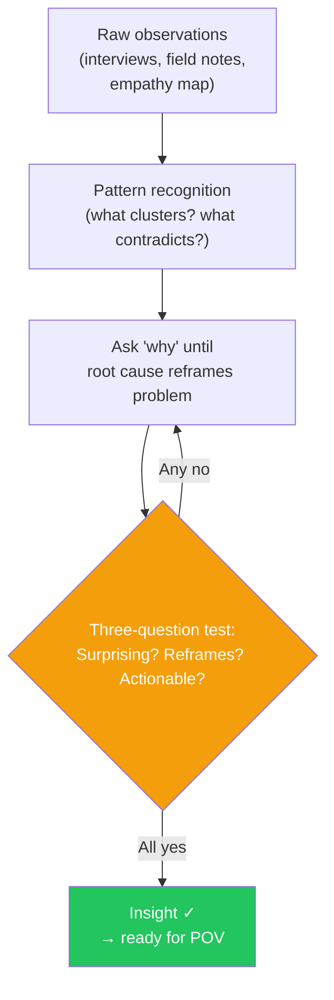

# Day 12 — From Data to Insight

> **Today's one idea:** An insight is not a data point — it is a surprising pattern that reframes what the problem actually is.
> **Reading time:** ~40 min · **Prereqs:** Days 9–11
> **Primary source for today:** Liedtka, Jeanne, and Tim Ogilvie. *Designing for Growth.* Columbia Business School Publishing, 2011. Tool 5 "What Is?" pp. 60–67.
> **Before you start:** Recall Day 11's closing question — one sentence, no looking. *How do you know when a collection of observations has become an insight?*

---

## The hook *(spaced callback to Day 6 — empathy)*

Here is a real set of observations from a team researching how small business owners manage their finances:

- "User keeps a handwritten notebook next to their laptop with account balances in it"
- "User opens the banking app, then switches to the notebook, then back to the app — three times in one session"
- "User said: 'I trust my own numbers more than the app'"
- "User checks the app at 7am every day before opening the shop"
- "User said: 'The app is usually right but sometimes things just don't add up'"
- "User has a sticky note on the register with the 'real' balance and a note: 'app lies sometimes'"

This is data. Six observations. They paint a picture, but they don't yet tell you what to do.

Now read this:

> *"Small business owners don't trust their banking app to reflect their actual financial position — because their day-to-day experience includes timing discrepancies (pending transactions, processing delays) that the app doesn't explain. Their workaround (handwritten notebook, sticky note) is a symptom of a trust deficit, not a feature gap."*

That is an insight. Same data. Completely different design direction.

The first suggests: "improve the app's features." The second suggests: "repair trust by making pending transaction status transparent and understandable." These two directions lead to entirely different solutions.

The distance between data and insight is the synthesis step. Today is about how to make that step.

---

## Building the intuition

An insight has three properties that distinguish it from raw data:

1. **It is surprising.** If the insight could have been written before the research (if it just confirms what you already thought), it is not an insight — it is a hypothesis you happened to verify. An insight makes the team say: "Oh — we didn't expect that."

2. **It reframes the problem.** A pure data point describes what happened: "users check the app three times." An insight explains why in a way that changes how you see the problem: "users have developed a parallel tracking system because the app's trust signals are broken."

3. **It is actionable.** An insight that cannot generate a design direction is incomplete. "Users are stressed about money" is true but doesn't point anywhere. "Users' stress is specifically triggered by not knowing whether a pending transaction will clear before payroll" does point somewhere — you can design for that specific moment.

The synthesis move — from data to insight — happens in two steps:

**Step 1: Find patterns across observations.**
Look at your empathy data (notes, empathy map, journey map) and ask: which observations cluster? Which contradictions appear repeatedly? Which workarounds tell the same underlying story?

**Step 2: Ask "why" until the pattern has a root cause.**
Once you see a pattern, ask why it exists — not once, but until the answer reframes the problem. "Users check the notebook because they don't trust the app" → *why don't they trust the app?* → "because the app shows a balance that doesn't match their felt reality during pending-transaction windows" → *why does that matter so much to small business owners specifically?* → "because their cash flow windows are narrow and a timing error can mean a missed payroll." Now you have a root cause.

---

## The formal picture

Liedtka and Ogilvie give insight statements a specific format — useful because it forces you to commit:

> **"We have noticed [observation] and wonder if [implication/reframe]."**

Or more sharply:

> **"[User] [verb] because [root cause that reframes the problem]."**

Examples:

| Data point | Weak "insight" | Strong insight |
|-----------|---------------|---------------|
| Users abandon checkout at the payment step | "Users find checkout difficult" | "Users abandon at payment because entering card details feels irreversible at a moment when they still have purchase doubt — the UX signals commitment before the user feels ready" |
| Nurses use paper checklists alongside the digital system | "Nurses prefer paper" | "Nurses maintain a parallel paper system because the digital record's lag time (up to 3 min) creates a window where a colleague could act on stale data — paper is the trust backup, not a preference" |
| Small business owners keep a handwritten notebook | "App is confusing" | "Small business owners don't trust the app's balance because pending transaction gaps make the number feel unreliable — their notebook is a trust mechanism, not a UX workaround" |

The right column always reframes the problem space. Each one opens a completely different design direction.

**The "how do you know when it's an insight?" test — three questions:**

1. Does it surprise the team? (Would you have written this before the research? If yes, it's not an insight — it's a confirmed hypothesis.)
2. Does it change what you think the problem is? (Does it redirect your design attention somewhere you weren't looking before?)
3. Does it suggest a direction? (Can you imagine at least one HMW question stemming from it, even imperfectly?)

If all three are yes: it's an insight. If one is no: it's data, not yet insight. Keep asking "why."

---

## Where it breaks / what it is not

**An insight is not a solution.** The hardest discipline in the Define phase is staying in problem space. "Users need a better balance display" is a solution, not an insight. "Users' trust in the balance is broken by timing gaps they can't see" is an insight — the solution comes later. Every time your insight sounds like a feature request, push it back to root cause.

**Multiple insights are normal.** Your empathy data will generate more than one insight. This is fine — write them all down. You will pick the most important one (usually the most surprising or the most impactful on the user's core goal) to build your POV around. The others are not wasted; they feed the HMW questions and Ideate phase later.

**Premature convergence is the main failure mode.** The most common mistake: teams surface one semi-interesting pattern and immediately treat it as the insight, then rush to Ideate. The discipline is to generate 3–5 candidate insights from the same data set, test each one against the three-question test, and only then commit. The best insight is rarely the first one.

**Data without research is not synthesis — it is guessing.** If your "insight" statement doesn't trace back to specific observations (quotes, behavioral notes, empathy map entries), it is not an insight. It is an assumption restated confidently. The traceability is what makes it actionable and defensible.

---

## Try it yourself

> **Close this page before attempting Exercise 1.**

**Exercise 1 — Retrieval.** Without looking: what are the three properties that distinguish an insight from a data point? Name each in one phrase. Then state the two-step synthesis process in your own words.

Compare to this

Three properties: (1) **Surprising** — it wasn't predictable before the research; (2) **Reframes the problem** — it redirects attention to a root cause rather than a symptom; (3) **Actionable** — it suggests a design direction. Two-step synthesis: (1) find patterns across observations — what clusters, what contradicts; (2) ask "why" repeatedly until the pattern has a root cause that reframes the problem.

---

**Exercise 2 — Direct application.** Here are four observations from a research study on remote workers using a video conferencing tool. Write one insight statement using the Liedtka format ("X does Y because Z").

Observations:
- "User mutes themselves immediately when joining, before checking if they need to speak"
- "User keeps a second browser tab open with a chat tool 'in case the audio fails'"
- "User said: 'I always assume my mic isn't working until I see someone react to me'"
- "User checks their own video thumbnail at least twice during a 30-minute meeting"

A strong insight statement

**"Remote workers enter video calls in a state of low-confidence readiness — constantly monitoring their own presence (mic, video, audio) rather than the meeting content — because the tool provides no pre-entry confidence check and no ambient signal that others can hear and see them normally."**

Why this is an insight, not just data: (1) Surprising — the team probably thought users were engaged with meeting content, not self-monitoring; (2) Reframes — the problem isn't "bad audio quality," it's the absence of pre-entry and ambient confirmation signals; (3) Actionable — "How might we give users a continuous low-effort confirmation that their setup is working?" is an immediately generatable HMW.

---

**Exercise 3 — Stretch.** Take the insight from Exercise 2. Apply the three-question test: is it surprising, does it reframe, is it actionable? If it passes, write a second competing insight from the same four observations that would point in a completely different design direction. Which one would you bring to the Define phase, and why?

A competing insight + decision logic

**Competing insight:** "Remote workers treat video conferencing tools with low trust because prior experiences of technical failures (audio drops, video freezes) have created a habitual defensive posture — they maintain backup channels not because the tool is currently failing, but because they assume it will."

This insight reframes the problem as a **trust and reliability history** issue, not a UI feedback issue. It would point toward design directions like reliability guarantees, failover transparency, or trust-building onboarding experiences — very different from the UI-feedback direction of the first insight.

**Which to bring to Define:** You would bring both to a team synthesis session and debate them. In practice, the decision hinges on which one (a) is better supported by the data, and (b) opens a design space you can actually act on in the next sprint. If your team has no ability to address platform reliability, the first insight (UI feedback signals) is more immediately actionable. If reliability data shows the tool is actually quite stable and the problem is perception, the second insight is more accurate. This is the judgment call a practitioner makes — not the algorithm.

---

**Transfer — apply it:**

> Take one observation from your own work — something a user said or did that surprised you. Apply the two-step synthesis: find the pattern it belongs to, then ask "why" twice. Write the resulting one-sentence insight in Liedtka format.

---

## Connect it back

Data is what you have after Empathize. Insight is what you need to begin Define. Today gave you the bridge: the synthesis move of pattern recognition followed by root-cause "why" questioning until the problem reframes itself.

Tomorrow you use that insight as the load-bearing piece of a Point of View statement — the team's single committed answer to "who are we designing for and why?"

**Sharp question you should be able to answer now:** A teammate shows you an "insight" that reads: "Users want a simpler interface." What specifically is wrong with it — and what question would you ask to push it toward a real insight?

---

## Suggested readings for today

**Required if you have 15 extra minutes:**
Liedtka, Jeanne and Tim Ogilvie, *Designing for Growth* (Columbia Business School Publishing, 2011), Tool 5 "What Is?", pp. 60–67. The "What Is?" stage is Liedtka's name for the synthesis step between raw data and insight. Her worked examples in this section are the clearest practitioner-level demonstration of the synthesis move available in print.

**Free video — watch today:**
IDEO U, *"What Is Synthesis in Design Thinking?"* — Search YouTube: `IDEO synthesis design thinking`. ~5–8 min. IDEO's short treatment of the data-to-insight move, with a real project example. Directly supports today's page.

**Free video — companion:**
Interaction Design Foundation, *"The Define Stage of Design Thinking"* — Search YouTube: `Interaction Design Foundation define stage design thinking`. ~7 min. Covers the full Define phase with emphasis on insight formation. IDF's content is generally reliable and practitioner-focused.

**If you want the deep version:**
Brown, Tim, *Change by Design* (HarperBusiness, 2009), Chapter 2 "Converting Need into Demand," pp. 39–67. Brown walks through the full empathy-to-insight move on a real IDEO project (Shimano bicycle components) — the case study is the synthesis process made narrative. Reading time: ~45 additional minutes.

---

## Navigation

← **Previous:** [Day 11 — Rest & Synthesize I](./day-11-rest-and-synthesize-1.md)
→ **Next:** [Day 13 — The Point of View Statement](./day-13-point-of-view-statement.md)
