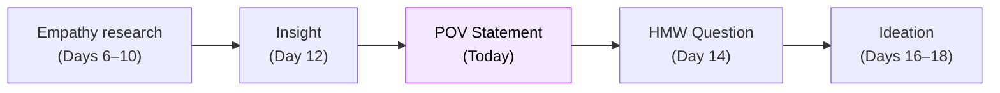

# Day 13 — The Point of View Statement

> **Today's one idea:** A POV statement anchors the entire team on one specific human, one unmet need, and one surprising insight — it is the team's committed answer to "who are we designing for and why?"
> **Reading time:** ~38 min · **Prereqs:** Days 11–12
> **Primary source for today:** Stanford d.school, *Design Thinking Bootcamp Bootleg*, 2018, pp. 22–26 ("Point of View" section). Free PDF at dschool.stanford.edu/resources.
> **Before you start:** Recall Day 12's load-bearing idea — one sentence, no looking. *What are the three properties that distinguish an insight from a data point?*

---

## The hook *(spaced callback to Day 7 — the research interview)*

Imagine you are starting a two-week ideation sprint. Your team of five people has just completed empathy research. Each person has a slightly different read on what they found:

- Person A: "The big issue is that nurses forget to update the system during busy periods."
- Person B: "No — it's that the system doesn't fit their physical workflow at the bedside."
- Person C: "I think it's more about trust — they don't believe the system is reliable."
- Person D: "The real problem is time pressure during shift handoff."
- Person E: "We need to make it easier to use on mobile."

Person E has already jumped to a solution. Persons A, B, C, and D each have a different problem framing. If you start Ideate now, each person will generate ideas for a different problem. You will produce five incoherent solution clusters, vote on the most popular ones, and build something that doesn't satisfy any of the actual users.

This is the most common failure mode in collaborative DT. Five people in the room, five different problems being solved.

The Point of View statement exists to prevent exactly this.

---

## Building the intuition

A Point of View (POV) statement is the team's one committed, co-authored answer to: *who are we designing for, and what do they fundamentally need?*

It is not a mission statement. It is not a feature brief. It is a one-sentence design brief that:
- **Names a specific human** (not "users" or "nurses" — a specific archetype with a context)
- **Names an unmet need** (stated as a verb, not a solution — what they need to do or feel, not what they need to have)
- **Includes a surprising insight** (the reframe from Day 12 — the why that makes the need non-obvious)

The d.school's canonical format:

> **[User description] needs [need] because [insight].**

Examples, from weak to strong:

| POV statement | What's wrong (or right) with it |
|---------------|--------------------------------|
| "Nurses need a better mobile app." | This is a solution, not a need. The insight is missing. The user is too vague. |
| "Busy nurses need to update patient records faster." | Better — names a need. But "faster" is already implying a solution direction, and there's no insight. |
| "A charge nurse managing handoff during a high-census shift needs to trust that the medication record reflects the patient's actual current state because the 3-minute lag in the electronic system creates a safety window she can't see." | Strong — specific user, behavioral need (trust), surprising insight (the lag creates a hidden safety window), no solution specified. |

Notice that the strong POV does not contain the word "app," "interface," "button," or any other solution hint. It describes a human need at the level of understanding that precedes solutions.

---

## The formal picture

**Building a POV — three-step process:**

**Step 1: Define the user.** Not a demographic label — a behavioral description. "A charge nurse managing a 16-bed ward during peak census with two float nurses she hasn't worked with before." The more specific the context, the more tightly constrained the design space — which makes the POV more useful, not less.

**Step 2: Name the need.** Express the need as a verb phrase that describes what the user needs to *do*, *feel*, or *be able to do* — not what they need to *have*. "Needs to feel confident that the medication record is current" not "needs a better notification system."

| Weak (solution-as-need) | Strong (genuine need) |
|------------------------|----------------------|
| "Needs a dashboard" | "Needs to monitor three projects simultaneously without losing track of status changes" |
| "Needs push notifications" | "Needs to be alerted to the exact moment a dependency changes so she can react before it cascades" |
| "Needs an export button" | "Needs to move data from the tool into a format her finance team can use without manual reformatting" |

**Step 3: Add the insight.** This is the "because" clause — the root cause that reframes the need. The insight must be from your research. If you can't trace it to a specific observation or behavioral pattern, it is not ready.

**What the POV statement unlocks:**

The POV statement is the single most load-bearing artifact in the entire DT process. Everything downstream — HMW questions, ideas, prototypes — is only as good as the POV. A vague POV produces vague ideas. A sharp POV produces sharp design challenges.

**Team alignment: the POV as a decision tool.**

Once you have a draft POV, test it with the team by asking:
- Can everyone on the team see a real person they interviewed in this statement?
- Does the need clause make team members think of ideas without telling them what to build?
- Does the insight clause make someone say "I hadn't thought of it that way before"?

If the answer to any of these is "not really" — revise the POV before proceeding.

---

## Where it breaks / what it is not

**A POV is a commitment, not a constraint.** Teams sometimes resist writing a POV because it feels like they are excluding other users or other problems. The POV is not a permanent decision about what to build — it is a focused design brief for this ideation cycle. You can have multiple POVs for multiple user archetypes; you ideate on each one separately. Start with the one that represents the most acute pain or the highest strategic priority.

**A POV is not a user story.** A user story ("As a charge nurse, I want to see pending medication updates...") already implies a solution context. A POV stays in problem space: it defines who and why, not what and how.

**The insight must be surprising.** If your POV's "because" clause is obvious — "because nurses are busy" — it is not an insight, and the POV will not constrain the design space usefully. A surprising insight points toward a direction that the team would not have prioritized without the research.

**Don't write it alone.** The POV is a team artifact. Writing it in a room with your research notes visible, with the team actively debating the "because" clause, produces a better POV than any individual could write — and it creates shared ownership that carries through Ideate and Prototype.

---

## Try it yourself

> **Close this page before attempting Exercise 1.**

**Exercise 1 — Retrieval.** Without looking: write the d.school POV format from memory. Then name the three things that distinguish a strong POV from a weak one.

Compare to this

**Format:** [User description] needs [need] because [insight]. **Three distinguishing properties:** (1) The user is specific and contextual, not a generic label; (2) The need is expressed as a verb phrase (to do/feel/be able to), not as a solution or feature; (3) The insight is surprising — it reframes the problem in a way that wasn't predictable before the research.

---

**Exercise 2 — Direct application.** Here is a set of empathy data. Write a POV statement.

**User:** A mid-level product manager at a 200-person SaaS company.
**Observations:**
- Opens Slack first every morning before any PM tool
- Uses a personal Notion page to track "what I actually decided" across meetings — separate from the official Confluence wiki
- Said: "Confluence is where decisions go to die — nobody reads it"
- Has three recurring calendar blocks labeled "catch up on [project name]" — all are for reading back-channel Slack threads
- Said: "I feel like I'm always the last one to know when something changes"

A strong POV statement

**"A mid-level PM managing multiple workstreams at a fast-moving SaaS company needs to maintain a reliable, current picture of what has actually been decided — not what was officially documented — because decision-making happens in informal Slack channels that leave no searchable, authoritative record, and the official documentation system is distrusted as a source of truth."**

Why this is strong: (1) Specific user with a behavioral context; (2) Need stated as maintaining a "reliable, current picture" — no solution implied; (3) Insight is surprising: the problem is not "no documentation tool" but "the informal channel has displaced the formal one, creating a trust gap." This POV would generate very different ideas from "make Confluence better."

---

**Exercise 3 — Stretch.** Take the POV you wrote in Exercise 2 and deliberately weaken it in each of the three ways a POV can fail: (a) make the user generic, (b) make the need solution-shaped, (c) make the insight obvious. Write all three versions. This exercise builds your ability to recognize weak POVs in the wild — which is the practical skill.

Weakened versions

**(a) Generic user:** "Product managers need to stay informed about project status because communication in organizations is often scattered." — "Product managers" is too broad; "communication is scattered" is not an insight, it's a truism.

**(b) Solution-shaped need:** "A mid-level PM needs a better Slack integration with Confluence because decisions made in chat never make it into the official wiki." — The need ("a better Slack integration") is already a solution, and the "because" just restates the symptom without reaching the root cause.

**(c) Obvious insight:** "A mid-level PM needs to track decisions because there are too many meetings." — "Too many meetings" is a cliché, not a reframe. It doesn't tell you anything you didn't already think. A DT team hearing this would not have any new design direction.

The practical skill: when you hear a POV in a team meeting, ask which of these three failure modes it exhibits — then ask the question that pushes it toward a stronger version.

---

**Transfer — apply it:**

> Draft a POV statement for a user of your current product — using one thing you know from real research (a quote, an observed behavior, or a support ticket) as the "because" clause. Write it in the d.school format. Then test it: does the "because" surprise you even slightly?

---

## Connect it back

Day 12 gave you the synthesis move — data to insight. Day 13 converts that insight into the team's committed design brief. Tomorrow, the POV becomes the input for the last tool in the Define phase: the "How Might We" question — the bridge from locked problem definition to open ideation.

**Sharp question you should be able to answer now:** What specifically happens during Ideate if the team starts with a vague POV — what does the output look like, and why?

---

## Suggested readings for today

**Required if you have 15 extra minutes:**
Stanford d.school, *Design Thinking Bootcamp Bootleg* (2018), pp. 22–26. The d.school's direct treatment of the POV statement, including worked examples and a common-mistakes sidebar. Free PDF at dschool.stanford.edu/resources. The examples in this section are the clearest available at practitioner level.

**Free video — watch today:**
Interaction Design Foundation, *"Stage 2 in the Design Thinking Process: Define the Problem and Interpret the Results"* — Search YouTube: `Interaction Design Foundation design thinking define stage problem`. ~8 min. Walks through the full Define phase including POV construction with a worked example.

**Free video — short companion:**
IDEO U, *"What Is a POV Statement?"* — Search YouTube: `IDEO POV statement design thinking`. ~4 min. IDEO's own explanation of the format — useful for seeing how the originating organization uses the tool.

**If you want the deep version:**
Liedtka, Jeanne and Tim Ogilvie, *Designing for Growth* (Columbia Business School Publishing, 2011), Tool 6 "What If?" pp. 68–77. Liedtka's treatment of the Define-to-Ideate transition. Her "Design Criteria" concept is a close relative of the POV statement, and comparing the two formats is useful for L1 practitioners. Reading time: ~25 additional minutes.

---

## Navigation

← **Previous:** [Day 12 — From Data to Insight](./day-12-from-data-to-insight.md)
→ **Next:** [Day 14 — How Might We Questions](./day-14-how-might-we-questions.md)
