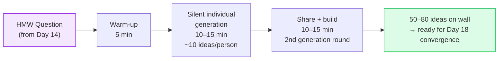

# Day 16 — Brainstorming Done Right

> **Today's one idea:** Quantity before quality, and deferred judgment — the conditions that make brainstorming work are the opposite of how most teams naturally operate.
> **Reading time:** ~38 min · **Prereqs:** Days 3, 14–15
> **Primary source for today:** Brown, Tim. *Change by Design.* HarperBusiness, 2009. Chapter 4, "Building to Think," pp. 71–100.
> **Before you start:** Recall Day 14's load-bearing idea — one sentence, no looking. *What are the three words in "How Might We" and what does each one contribute?*

---

## The hook *(spaced callback to Day 5 — wicked problems)*

In 1953, an advertising executive named Alex Osborn published a book called *Applied Imagination* that introduced the term "brainstorming." His rules were simple: generate as many ideas as possible, withhold all judgment during idea generation, build on others' ideas, and encourage wild thinking.

Seventy years later, brainstorming is the most universally practiced — and most universally broken — creative technique in organizations.

Here is what actually happens in most "brainstorming" sessions:

A team of eight sits around a table. Someone writes the problem on a whiteboard. One person speaks first (usually the most senior or most extroverted). They propose an idea. Others respond — some agree, some gently push back. A second idea is proposed; discussion follows. After 30 minutes, the team has explored 6–8 ideas in depth, reached consensus on 2–3, and written action items.

This is not brainstorming. This is **group discussion with a whiteboard**.

The problem: verbal, sequential idea-sharing activates social judgment in every participant. Before anyone speaks, they have already evaluated whether their idea sounds good in front of the group. The ideas that get said are pre-filtered by social fear. The ideas that get explored are anchored to the first few that were spoken. The most important ideas — the weird ones, the half-baked ones, the ones that feel too obvious or too strange — never make it to the wall.

Osborn's rules weren't wrong. They were just never followed.

---

## Building the intuition

Effective brainstorming requires two conditions that conflict directly with how teams default:

**Condition 1: Quantity before quality.** The goal of a brainstorm is *volume*, not insight. The first 20 ideas any group generates are almost always the most obvious — the solution that everyone thought of before they walked in the room. The interesting ideas live at idea 30, 40, 50. You cannot get to idea 40 without passing through the obvious ones. If your team generates 8 ideas and then starts evaluating, you have optimized for speed and sacrificed creativity.

**Condition 2: Deferred judgment.** No evaluation during generation — not verbal, not facial, not via the raised eyebrow of the person across the table. Judgment of any kind activates self-censorship in every participant. The rule is: every idea gets written down, no idea is discussed or evaluated during the generation phase. Evaluation comes after, in a separate step.

These two conditions are why **silent individual generation before group sharing** consistently outperforms the round-the-table verbal format in research on creative output. Writing ideas on sticky notes individually before sharing them:
- Removes social anchoring (no one's idea shapes another's before the round ends)
- Removes social fear (you're not presenting, you're writing)
- Produces more ideas in the same time
- Produces more diverse ideas (parallel generation, not sequential)

The IDEO brainstorm protocol codifies these principles:

| IDEO brainstorm rule | Why it exists |
|---------------------|---------------|
| Defer judgment | Prevents self-censorship and social filtering |
| Encourage wild ideas | Resets the expected-idea threshold upward; stretches the space |
| Build on others' ideas | Converts competitive idea-having into collaborative idea-building |
| Stay focused on the topic | Prevents drift; keeps all ideas relevant to the HMW |
| One conversation at a time | Prevents fragmentation and ensures all ideas are heard |
| Be visual | Sketches communicate richer concepts faster than words |
| Go for quantity | Volume over quality; 50 ideas beats 5 evaluated ones |

---

## The formal picture

A well-run DT brainstorm has three distinct phases:

**Phase 1 — Warm-up (5 min)**
Not optional. The brain needs to shift from evaluation mode to generative mode — they are cognitively incompatible. Warm-up exercises that work: "30 circles" (fill 30 blank circles with sketches in 3 minutes — any sketches), "alternative uses" (name 20 uses for a paper clip in 2 minutes), or a silly physical activity. The goal is to lower the self-judgment threshold before the real session starts.

**Phase 2 — Silent individual generation (10–15 min)**
Every participant writes ideas independently on sticky notes — one idea per note. The facilitator reads the HMW question aloud at the start and every 5 minutes. No talking. Go for quantity: aim for at least 10 ideas per person.

**Phase 3 — Share and build (10–15 min)**
Each person reads their sticky notes aloud and places them on the wall. No evaluation, no discussion. After all notes are on the wall: a second round of generation where anyone can write new ideas *inspired by* what they just heard from others. This is the "build on others' ideas" phase — the combinatorial phase.

At the end of Phase 3, a room of 5 people should have 50–80 ideas on the wall. You are now ready for Day 18's convergence step.

**What to do with wild ideas:**
Wild ideas are not throwaways — they are often the most generative seeds in the room. A direct implementation of "make the ATM give users a hug" is absurd. But the underlying need (users feel vulnerable; they want warmth and safety) is real and actionable. Write down every wild idea. During convergence, you will ask: "What is the real need behind this idea?" rather than dismissing it.

---

## Where it breaks / what it is not

**"We don't have time for brainstorming" is usually wrong.** A properly run 30-minute brainstorm with 5 people produces more useful raw material than 3 hours of unstructured discussion. The time cost of brainstorming is fixed; the time cost of building the wrong thing because you never diverged is not.

**Evaluation during generation kills sessions.** The most common facilitator error: someone proposes an idea, someone else says "we tried that before" or "that won't work with our architecture." Even a polite "interesting — but have you considered..." is enough to shut down two or three ideas that were forming in other participants' heads. The facilitator's job is to protect the generation phase from evaluation, firmly.

**Groupthink is real.** In a verbal round-table brainstorm, the first idea spoken anchors everyone else's thinking. Research consistently shows that groups generate less diverse ideas in verbal sequential formats than individuals working alone in parallel. Silent sticky-note generation is not a nicety — it is the fix for anchoring.

**A brainstorm without a HMW question is a waste of time.** Undirected "what should we build?" sessions generate solution-shaped ideas disconnected from user needs. Every brainstorm must start with a specific HMW question. If you don't have one, you're in the wrong phase — go back to Define.

---

## Try it yourself

> **Close this page before attempting Exercise 1.**

**Exercise 1 — Retrieval.** Without looking: name the two conditions that make brainstorming work, and explain in one sentence why each one conflicts with how teams naturally default.

Compare to this

**Condition 1 — Quantity before quality:** conflicts with the natural default of evaluating each idea as it is proposed, which optimizes for quality-of-discussion rather than volume of creative output. **Condition 2 — Deferred judgment:** conflicts with the natural default of social signaling — agreement, skepticism, enthusiasm — that teams express as each idea is spoken, which activates self-censorship in every participant.

---

**Exercise 2 — Direct application.** You are facilitating a brainstorm for a team of 6 on this HMW: *"How might we help remote employees feel genuinely connected to their colleagues without mandatory social events?"*

Write a 3-phase facilitation plan: what you say at the start of each phase, how long each phase runs, and what you watch for (the failure mode to prevent).

A strong facilitation plan

**Phase 1 — Warm-up (5 min):**
*What you say:* "Before we start, let's do a quick warm-up. I'm going to give everyone 3 minutes to fill in these 30 circles — sketch anything you want, one thing per circle. Go."
*Watch for:* participants hesitating because "it needs to be good" — if you see this, explicitly say "there are no right answers, draw the first thing that comes to mind."

**Phase 2 — Silent generation (12 min):**
*What you say:* "Here's our HMW question: [read it]. For the next 12 minutes, write ideas on sticky notes — one idea per note. Don't worry about whether they're good; go for quantity. Aim for at least 10. No talking."
*Watch for:* someone starting to speak to their neighbour, or people writing multi-line paragraphs instead of quick idea fragments (which slows them down). Gently redirect.

**Phase 3 — Share and build (15 min):**
*What you say:* "Let's go around and each person reads their notes aloud as they place them on the wall. No discussion yet — just share. After everyone's shared, we'll have a second round where you can write new ideas inspired by what you heard."
*Watch for:* the moment someone says "that won't work because..." — interrupt firmly but warmly: "We'll evaluate in the next step — for now everything goes on the wall."

---

**Exercise 3 — Stretch (spaced callback from Day 5 — wicked problems).**
Day 5 said wicked problems resist premature solutions. How does the "deferred judgment" rule in brainstorming specifically protect against the wicked problem's trap of locking into the first plausible solution? Write two sentences connecting these two ideas.

The connection

Wicked problems have no definitive solution — the first plausible answer is almost always a response to a symptom, not the root cause. Deferred judgment specifically prevents the group from anchoring to the first plausible idea and treating it as the solution, because evaluation is suspended until the full diverge phase is complete — meaning the team must encounter a wide range of options (including the uncomfortable, non-obvious ones) before any commitment is made. This is the structural protection against wicked-problem premature closure.

---

**Transfer — apply it:**

> Think of the last "brainstorming" session you ran or attended. Which of the two conditions (quantity-before-quality, deferred judgment) was most visibly violated? Write one sentence describing the exact moment it broke, and one sentence describing how you would change the facilitation next time.

---

## Connect it back

Day 15's drill built your synthesis muscle. Day 16 gives you the Ideate phase's entry mechanism — the structured brainstorm that converts a HMW question into raw material. Tomorrow you add two techniques for when standard brainstorming stalls: SCAMPER and analogous inspiration. Day 18 closes the Ideate phase with the convergence tools that turn 60 sticky notes into 3 testable concepts.

**Sharp question you should be able to answer now:** Why does silent individual sticky-note generation consistently outperform verbal round-the-table brainstorming — name the specific cognitive mechanism it bypasses?

---

## Suggested readings for today

**Required if you have 15 extra minutes:**
Tim Brown, *Change by Design* (HarperBusiness, 2009), Chapter 4, pp. 71–100. Brown's narrative account of IDEO brainstorms includes the rules, the physical environment (why IDEO builds brainstorm rooms a specific way), and the role of the facilitator. Reading time: ~35 min.

**Free video — watch today:**
IDEO, *"IDEO's Rules for Brainstorming"* — Search YouTube: `IDEO rules for brainstorming`. ~4–6 min. IDEO's own short explainer on their seven brainstorm rules — directly complements today's page and gives you the canonical format from the source.

**Free video — companion:**
Tom Wujec, *"Build a Tower, Build a Team"* — TED2010. Search YouTube: `Tom Wujec build a tower TED`. ~7 min. A fun, data-driven look at why group ideation fails (and what makes it succeed), built around a real experiment with marshmallows and spaghetti. Reinforces today's core argument with empirical evidence.

**If you want the deep version:**
Kelley, Tom and David Kelley, *Creative Confidence* (Crown Business, 2013), Chapter 3 "Spark," pp. 71–108. The Kelleys' treatment of structured ideation, including techniques for overcoming creative blocks and the psychology of the "warm-up" phase. Reading time: ~40 additional minutes.

---

## Navigation

← **Previous:** [Day 15 — Drill Day: Synthesis](../../03-define/days/day-15-drill-synthesis.md)
→ **Next:** [Day 17 — Ideation Beyond Brainstorming](./day-17-ideation-beyond-brainstorming.md)
