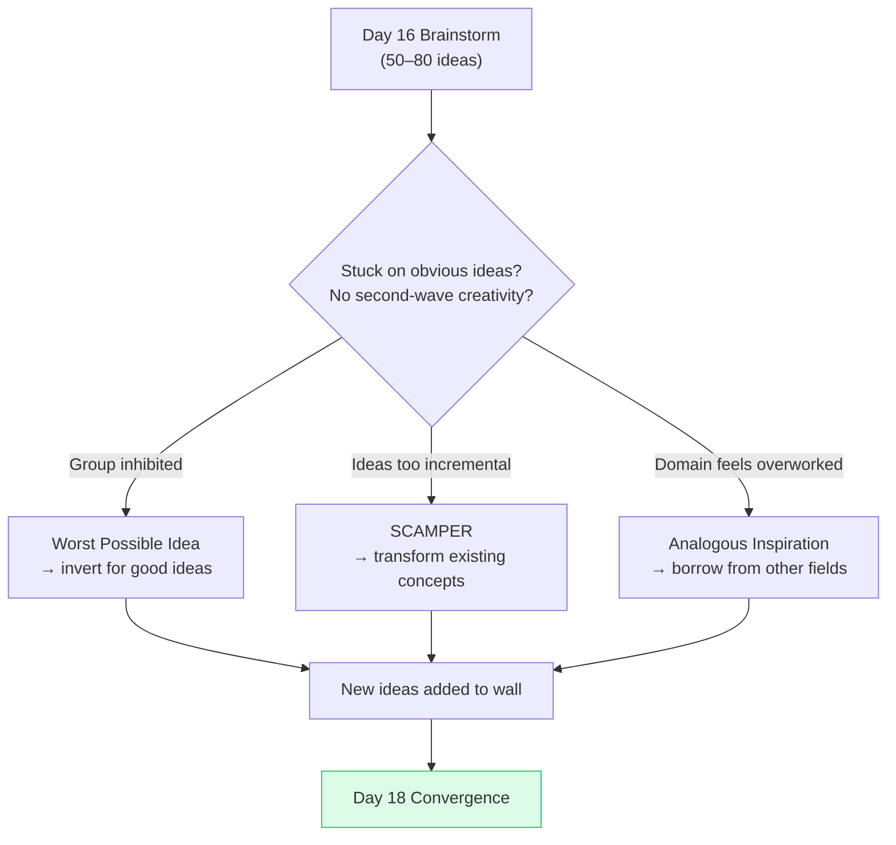

# Day 17 — Ideation Beyond Brainstorming

> **Today's one idea:** When standard brainstorming stalls on obvious ideas, structured provocations — SCAMPER, worst-possible-idea, and analogous inspiration — force the brain out of its default solution space.
> **Reading time:** ~38 min · **Prereqs:** Days 15–16
> **Primary source for today:** Kelley, Tom and David Kelley. *Creative Confidence.* Crown Business, 2013. Chapter 3 "Spark," pp. 71–108.
> **Before you start:** Recall Day 16's load-bearing idea — one sentence, no looking. *What are the two conditions that make brainstorming work — name both.*

---

## The hook *(spaced callback to Day 12 — from data to insight)*

There is a predictable shape to every brainstorm that runs long enough.

The first 15 minutes: the obvious ideas. Everyone in the room had these before the session started. They're competent, safe, and directly derived from how the problem is currently framed. If your HMW is "How might we help nurses trust the medication record?", the obvious ideas are: real-time sync, push notifications, a confirmation button, a timestamp display.

These ideas are not bad. But they are all working *within* the current framing of the problem — a software notification problem. None of them have questioned whether the notification paradigm is the right frame at all.

The second 15 minutes, if you keep going: the ideas start getting stranger. Someone says "what if the nurse *wasn't* the one entering the data — what if it happened automatically from the medication scanner?" Someone else says "what if the handoff happened verbally and the system just listened and transcribed?" These ideas may be technically hard. They may be impractical. But they are *outside* the original frame — and occasionally, one of them is the best idea in the room.

The problem: most teams stop before the second 15 minutes. They evaluate the first wave, pick the best-obvious-idea, and leave.

The techniques today are methods for forcing the second-wave ideas to arrive earlier — without waiting for the session to exhaust the obvious space first.

---

## Building the intuition

Standard brainstorming works by volume — the hope is that generating enough ideas will eventually push through the obvious ones into the creative territory beyond. The three techniques today work by **constraint and provocation** — they artificially displace the brain from its default solution space.

**Technique 1: SCAMPER**

SCAMPER is a checklist of seven transformation operators you apply to an existing concept to generate variants. It was developed by Bob Eberle based on earlier work by Alex Osborn (the brainstorming inventor).

| Letter | Operator | The question it asks | Applied to "medication record" |
|--------|----------|---------------------|-------------------------------|
| **S** | Substitute | What component could be replaced? | What if the record format were replaced with a voice memo? |
| **C** | Combine | What could be merged with something else? | What if the medication record were combined with the handoff checklist into one artifact? |
| **A** | Adapt | What else does something similar? What could be adapted from another context? | How do aviation pre-flight checklists handle trust in safety-critical data? |
| **M** | Modify / Magnify / Minify | What if this were bigger, smaller, faster, slower? | What if the medication record updated every 30 seconds — or only once at shift end? |
| **P** | Put to other uses | What else could this be used for? | What if the medication record also served as a patient-facing communication tool? |
| **E** | Eliminate | What could be removed? | What if nurses didn't enter data at all — what if it was captured passively from the scanning workflow? |
| **R** | Reverse / Rearrange | What if the process went backward? What if the order changed? | What if the charge nurse received a summary *before* the shift started, not during handoff? |

You don't use all seven on every problem — run through the list quickly and write one idea per operator that feels generative. Three or four good ones per SCAMPER session is a success.

**Technique 2: Worst Possible Idea**

This technique inverts the goal. Instead of asking "what is the best solution?", you ask: "what is the *worst* possible solution to this problem — the one that would make things maximally worse?"

Why this works: it immediately relieves the social pressure of "I need to say something good." Everyone in the room can relax and be creative — they're trying to fail. And bad ideas, once on the table, can be inverted or reversed to generate unexpectedly good ones.

Example — HMW: "How might we help nurses trust the medication record?"
- Worst idea: "Make the record update only once a week, in a font that's hard to read, with no timestamps."
- Inversion: a record that updates in real time, is highly legible, and prominently displays the time of last update for every entry.
- Another worst idea: "Make nurses responsible for verifying every other nurse's entries."
- Inversion: an automated verification layer that flags discrepancies without putting the burden on any individual nurse.

The inversion step converts comic-level bad ideas into surprisingly specific, creative good ones.

**Technique 3: Analogous Inspiration**

This technique borrows solutions from other domains that have solved an analogous problem well.

Step 1: Name the core of your problem at a level of abstraction above the specific domain. "Building trust in a safety-critical, time-pressured information system" — not "making a medical app better."

Step 2: Ask: which other industries or contexts have solved this class of problem? Aviation (cockpit checklists for safety-critical handoffs), banking (transaction confirmation systems), air traffic control (handoff protocols between controllers), nuclear power (operator shift logs).

Step 3: Extract the principle, not the solution. Aviation doesn't use push notifications — it uses structured verbal read-backs. The principle: *mutual confirmation between sender and receiver at the point of handoff*. What would that look like in a nurse's workflow?

Analogous inspiration consistently produces the most differentiated ideas in an ideation session — because it brings in principles from domains that have already solved the hard version of your problem.

---

## The formal picture

**When to use which technique:**

| Situation | Best technique |
|-----------|---------------|
| Standard brainstorm has generated mostly obvious, incremental ideas | SCAMPER — applies transformation operators to existing ideas to force variants |
| Group is inhibited, judging each other's ideas, not generating freely | Worst Possible Idea — relieves social pressure immediately |
| The problem space feels overworked or the team is too close to the domain | Analogous Inspiration — brings in fresh frames from outside the domain |
| You have one promising concept but want to stress-test and expand it | SCAMPER on that specific concept |

These three techniques are not replacements for the Day 16 brainstorm — they are supplements used when the brainstorm stalls. The sequence:

---

## Where it breaks / what it is not

**SCAMPER generates quantity, not quality.** Not every SCAMPER prompt will produce a useful idea. Run through the checklist quickly — 2 minutes per operator — and only develop the ones that spark something. Don't force all seven.

**Worst Possible Idea requires a psychologically safe room.** If team members are afraid of looking foolish, they will be embarrassed to say truly bad ideas even with permission. The facilitator sets the tone — the more ridiculous the facilitator's first worst idea, the safer everyone else feels. If you are facilitating, go first and go big.

**Analogous inspiration requires abstraction discipline.** The most common failure: teams borrow the surface-level solution from another domain rather than the underlying principle. "Let's do what Uber does" is not analogous inspiration — it is mimicry. "Uber solved trust between strangers at scale through reputation systems and transparent real-time tracking — what is the equivalent in our context?" is analogous inspiration.

**These techniques are not magic.** They increase the probability of reaching the non-obvious idea space. They do not guarantee good ideas. The next step (Day 18) is where you evaluate what you've generated and select the most promising concepts to prototype.

---

## Try it yourself

> **Close this page before attempting Exercise 1.**

**Exercise 1 — Retrieval.** Without looking: name the three ideation techniques from today's page and state in one phrase what problem each one solves (i.e., when to reach for it).

Compare to this

**SCAMPER** — use when ideas are generating but are too incremental; applies seven transformation operators to existing concepts to force variants. **Worst Possible Idea** — use when the group is inhibited or judging each other; relieves social pressure by inverting the goal. **Analogous Inspiration** — use when the team is too close to the domain and generating only domain-specific solutions; borrows principles from other fields that have solved the same class of problem.

---

**Exercise 2 — Direct application.** Apply SCAMPER to this concept: *"A daily automated email summary of all project status updates, sent to PMs every morning at 8am."* Generate one idea for each of the seven operators. You don't need all seven to be good — just write one idea per operator without stopping to evaluate.

Sample SCAMPER output

**S (Substitute):** Replace email with a Slack DM that includes only the three most-changed items (not all updates).
**C (Combine):** Combine the status summary with the PM's calendar for the day — surface only updates relevant to today's meetings.
**A (Adapt):** Adapt the air traffic control "handoff brief" format — structured verbal/written summary at the point of shift change rather than a passive daily email.
**M (Modify):** Send the summary in real time when a threshold is crossed (e.g., a project moves to "at risk") rather than on a fixed daily schedule.
**P (Put to other uses):** Use the same summary as the input to the weekly leadership review — so PMs don't prepare a separate deck.
**E (Eliminate):** Eliminate the summary entirely — replace with a live dashboard that PMs check when they need it, removing the "read this every day whether relevant or not" burden.
**R (Reverse):** Instead of pushing updates to PMs, have the system ask PMs a single daily question ("What needs your attention?") and surface only the items that require action.

Note: E and R are the most disruptive — they challenge the entire paradigm of the push-summary model. These are the SCAMPER outputs worth developing further.

---

**Exercise 3 — Stretch.** Apply Analogous Inspiration to this HMW: *"How might we help freelancers manage irregular income without anxiety?"*

Step 1: Abstract the core problem above the domain level (one sentence).
Step 2: Name two industries that have solved this class of problem well.
Step 3: Extract the principle (not the solution) from each.
Step 4: Write one idea for each principle applied back to the freelancer context.

A strong analogous inspiration run

**Step 1 — Abstraction:** "How do people build psychological safety around unpredictable resource flows?"

**Step 2 — Two domains:**
- **Farmers** — irregular income due to harvest variability; solved through grain storage and futures contracts
- **Hospital ICUs** — irregular patient load; solved through surge protocols and reserve capacity systems

**Step 3 — Principles:**
- Farmers: *smooth the peak-to-trough variance by storing surplus in good months to buffer bad months* (granary principle)
- ICUs: *maintain reserve capacity specifically designated for unexpected demand, with a clear protocol for when to draw on it* (surge reserve principle)

**Step 4 — Applied to freelancers:**
- From granary: a financial tool that automatically routes a fixed percentage of every payment into a "smoothing fund" — so the PM experience shows a normalized monthly "salary" rather than raw invoice deposits, even though the underlying cash flow is irregular
- From surge reserve: a freelancer financial protocol with a defined "income floor" reserve and a clear personal rule for when to draw on it (e.g., "if monthly income drops below X, draw from reserve up to X for up to 3 months") — making the uncertainty bounded and rule-governed rather than open-ended

---

**Transfer — apply it:**

> Take a HMW question from your current work. Run the Worst Possible Idea technique: write the three worst possible solutions you can think of. Then invert one of them. Write the inverted idea in one sentence. Does it open a direction you hadn't considered?

---

## Connect it back

Day 16 gave you the engine (structured brainstorm). Day 17 gives you the turbocharger (three techniques for when the engine stalls on obvious ideas). Together, these two days mean you can enter any ideation session — with any HMW question — and produce a wide, diverse set of raw ideas.

Tomorrow is convergence: the discipline of moving from 60 ideas on a wall to the 3 most worth prototyping. It is the mirror image of today's diverge — and it requires different cognitive tools.

**Sharp question you should be able to answer now:** What is the difference between borrowing a solution from another domain (mimicry) and analogous inspiration? What step prevents you from doing the former?

---

## Suggested readings for today

**Required if you have 15 extra minutes:**
Kelley, Tom and David Kelley, *Creative Confidence* (Crown Business, 2013), Chapter 3 "Spark," pp. 71–108. The Kelleys' treatment of techniques for overcoming creative blocks — SCAMPER, worst-possible-idea, and analogous inspiration are all discussed or implied. The stories in this chapter make the techniques feel like natural behaviors rather than forced exercises.

**Free video — watch today:**
IDEO U, *"Ideation Techniques"* — Search YouTube: `IDEO ideation techniques design thinking`. ~6 min. IDEO's short overview of structured ideation beyond basic brainstorming. Covers analogous inspiration with a product example.

**Free video — companion:**
Interaction Design Foundation, *"Worst Possible Idea"* — Search YouTube: `Interaction Design Foundation worst possible idea`. ~5 min. A clear walkthrough of the worst-possible-idea technique with a live example of the inversion step.

**Free resource:**
MindTools, *"SCAMPER: Improving Products and Services"* — Free article at mindtools.com. Search: "SCAMPER MindTools". Includes a printable SCAMPER worksheet with prompts for each operator — useful to have open during a real ideation session.

**If you want the deep version:**
Eberle, Bob. *SCAMPER: Creative Games and Activities for Imagination Development.* Prufrock Press, 1996. The original source of the SCAMPER framework — short, practical, and directly applicable. Most useful after Day 28 when you start running your own ideation sessions.

---

## Navigation

← **Previous:** [Day 16 — Brainstorming Done Right](./day-16-brainstorming-done-right.md)
→ **Next:** [Day 18 — Selecting and Clustering Ideas](./day-18-selecting-and-clustering-ideas.md)
