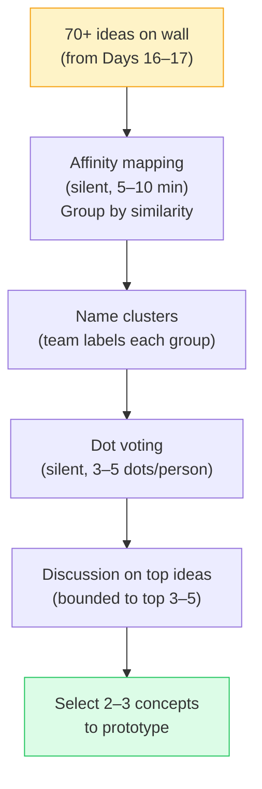

# Day 18 — Selecting and Clustering Ideas

> **Today's one idea:** Affinity mapping and dot voting converge a flood of ideas into 2–3 testable concepts — without letting the loudest voice in the room decide.
> **Reading time:** ~38 min · **Prereqs:** Days 16–17
> **Primary source for today:** Stanford d.school, *Design Thinking Bootcamp Bootleg*, 2018, pp. 28–32. Free PDF at dschool.stanford.edu/resources.
> **Before you start:** Recall Day 17's load-bearing idea — one sentence, no looking. *When should you use Analogous Inspiration vs. SCAMPER — what situation calls for each?*

---

## The hook *(spaced callback to Day 3 — the five phases as one loop)*

You have 73 sticky notes on the wall. Each one has an idea on it. Some are incremental improvements; some are wild; some are half-formed; one of them might be the best idea anyone in your organization has had this year.

The problem: nobody in the room can hold 73 things in their head simultaneously. And if you move directly to discussion — "okay, let's talk about which ones are good" — three things will happen:

1. The three ideas that were spoken aloud first will anchor the discussion
2. The ideas that are most verbally defensible will win, not the ones that are most user-relevant
3. The person who speaks most confidently will have disproportionate influence on the outcome

This is the convergence trap: moving from ideation directly to discussion is just another form of the broken brainstorm from Day 16, but in reverse. It is social filtering at the convergence stage.

Affinity mapping and dot voting are the tools that prevent this. They make convergence visual and democratic before anyone says a word.

---

## Building the intuition

Convergence has two distinct jobs:

**Job 1: Organize** — group the 73 ideas into clusters so the team can see what themes emerged from the ideation. This is affinity mapping.

**Job 2: Prioritize** — select the 2–3 concepts most worth prototyping from those clusters. This is dot voting.

These are done in sequence, and they are different cognitive tasks. Mixing them produces the same anchoring problem as skipping straight to discussion.

**Affinity mapping — how it works:**

Without talking, team members read every sticky note on the wall and physically group similar ideas together. No categories are defined in advance — the clusters emerge from the ideas themselves. If two ideas feel related, move them next to each other. If you disagree with a grouping, move the note. The rule: you can move any note at any time, and no one explains their reasoning during the movement phase.

After 5–10 minutes of silent movement, the wall will have self-organized into 5–10 clusters. The team then names each cluster — one label per cluster, written on a different-colored sticky note placed at the top.

What you now have: a map of the *solution space* that emerged from your HMW question. Each cluster is a different approach to the same problem. Some will overlap with others; some will be surprising. The cluster names are the first moment in the session where the team can see the shape of what they've generated.

**Dot voting — how it works:**

Each team member receives a fixed number of dot stickers (or can draw dots with a marker). A standard allocation: 3–5 dots per person, for a team of 4–6. Rules:

- You can place all your dots on one idea or spread them across many
- You cannot discuss ideas before placing dots
- You place dots silently
- You can place dots on cluster labels (voting for a whole approach) or on specific ideas within a cluster

After all dots are placed, the ideas with the most dots are visible at a glance. These are the team's democratic first-cut priorities — not final decisions, but a starting point for focused discussion.

**The discussion phase — after dots:**

Once dots are placed, *then* you discuss. The conversation is now bounded: you're talking about the top 3–5 voted ideas, not all 73. The facilitator's job is to keep the discussion focused on one question: *which 2–3 ideas are most worth prototyping and testing?* The criteria are not "which is most technically feasible" or "which will take least time" — those come later. The criteria at this stage are: **most likely to address the user's need** (from the POV) and **most informative to test** (most likely to generate learning).

---

## The formal picture

**Full convergence sequence:**

**How to move from voted ideas to prototype-ready concepts:**

A sticky note with "real-time medication updates" is not a prototype-ready concept — it is an idea fragment. Before moving to Prototype (Day 19), each selected idea needs to be developed into a **concept sketch**: a rough description (2–3 sentences + a simple sketch) that answers:

1. What does this look like in the user's hands or environment?
2. What specific user action triggers it?
3. What does the user get from it that they don't have today?

Concept sketches are not wireframes. They are 5-minute pen-and-paper descriptions that give the prototype builder something to work from.

**The "1-2-4-All" pattern for high-stakes convergence:**

When the team has strong disagreement after dot voting, use the Liberating Structures "1-2-4-All" format instead of open discussion:

| Round | Duration | What happens |
|-------|----------|-------------|
| **1** | 2 min | Each person writes their individual top pick and why, silently |
| **2** | 3 min | Pairs share and find what they agree on |
| **4** | 3 min | Pairs join pairs; groups of 4 find shared ground |
| **All** | 5 min | Full group converges on final selection |

This format prevents the loudest voice from dominating final selection — the same way silent sticky-note generation prevented it in the diverge phase.

---

## Where it breaks / what it is not

**Dot voting is not a final product decision.** The dots select which ideas are worth *testing* — not which idea to build. The prototype (Day 19–21) and test (Day 23–24) steps will give you better information than any vote can. Resist the urge to treat a high-vote idea as a commitment.

**Affinity mapping is not taxonomy.** You are not sorting ideas into pre-defined categories. The clusters emerge from the ideas themselves. If you start the mapping phase with a category structure already in mind, you will force ideas into boxes they don't belong in and miss the surprising cluster that appears organically.

**"Most voted" does not always mean "most worth prototyping."** The most voted idea is often the most familiar or the most verbally presented one — it benefited from anchoring during the dot-placing phase even when you tried to prevent it. Always ask: "Is there a low-vote idea that challenges our assumption in an interesting way?" One of those ideas should often become the second prototype — the "long shot" that might invalidate your main concept.

**Convergence is a decision, not a consensus.** The goal is not for everyone to love the same idea. The goal is for the team to commit to testing 2–3 ideas they collectively agree are worth learning about. Someone will be disappointed. That is normal and correct.

---

## Try it yourself

> **Close this page before attempting Exercise 1.**

**Exercise 1 — Retrieval.** Without looking: what are the two jobs of convergence, and what tool handles each one? Then state the one rule that applies during both the affinity mapping phase and the dot voting phase.

Compare to this

**Two jobs:** (1) Organize — group ideas into themes so the solution space becomes visible; handled by **affinity mapping**. (2) Prioritize — select 2–3 concepts worth prototyping; handled by **dot voting**. **One rule that applies to both:** silence — no discussion during either phase. The entire point of both tools is to make the convergence visual and democratic *before* verbal debate, which prevents anchoring and dominance by the most confident speaker.

---

**Exercise 2 — Direct application.** Here are 12 idea fragments from a brainstorm on the HMW: *"How might we help new remote employees feel genuinely connected to their colleagues?"*

1. Slack bot that suggests a random 15-min coffee chat each week
2. Virtual office with always-on video rooms for spontaneous drop-in
3. Shared Spotify playlist where new employees add a song that represents them
4. Buddy system pairing new hire with a tenured colleague for 90 days
5. Team "interests" wiki page for each employee
6. Weekly async video intro from each team member to the new hire
7. New hire asks each teammate one question in the first week, published as a mini Q&A
8. Structured "first week calls" calendar — 15 min with 5 different teammates
9. Shared virtual whiteboard where team adds daily "what I'm working on" post-its
10. Team ritual: each Monday, one person shares a photo from their weekend
11. Onboarding cohort — new hires who joined the same month meet weekly for 60 days
12. Anonymous "get to know your team" trivia game sent on day 1

Without physically moving them, group these 12 into 3–4 clusters by naming each cluster's theme. Then: if you had 3 dot votes to spend, where would you place them — and why?

Clustering + voting rationale

**Cluster A — Structured 1:1 rituals:** 1 (Slack coffee chat), 4 (buddy system), 8 (first week calls), 6 (async video intros). Common theme: scheduled, intentional human connection between specific people.

**Cluster B — Shared expression / identity:** 3 (Spotify playlist), 5 (interests wiki), 10 (Monday photo share), 12 (trivia game). Common theme: passive, ambient signals that let colleagues discover who someone is.

**Cluster C — Cohort / group belonging:** 11 (onboarding cohort), 7 (mini Q&A), 2 (virtual office). Common theme: belonging to a group context, not just a pair.

**Cluster D — Async visibility:** 9 (daily whiteboard), 7 (Q&A cross-listed). Common theme: making work visible to create context for connection.

**Where to place 3 dots and why:** Ideas 4 (buddy system — highest human touch, most directly addresses the "genuine connection" word in the HMW), 8 (structured first-week calls — the most directly actionable and testable in a week), and 11 (onboarding cohort — the most novel; tests whether peer-group belonging is more powerful than manager-assigned connection). These three span different approaches — prototyping all three would give the most learning.

---

**Exercise 3 — Stretch.** After dot voting, the top idea is: "a Slack bot that suggests a random coffee chat with a different colleague every week." A team member argues: "We should just build this — it's clearly the winner." As the DT practitioner in the room, what do you say — and what assumptions does this idea carry that prototyping and testing would reveal?

The practitioner's response

**What you say:** "Dot voting told us this is worth prototyping — not worth building. Before we commit to building a Slack bot, we should test the underlying assumption: that a randomly assigned 15-minute chat with a stranger will produce genuine connection. A paper prototype would be: manually send a Slack message to five new employees this week saying 'here's your coffee chat match' and observe what happens. That test costs zero engineering hours and will tell us whether the concept works before we write a line of code."

**Assumptions the idea carries:**
1. That new employees want *random* matching rather than interest-based or role-based matching
2. That 15 minutes is the right time unit for connection (vs. a shared work session or an async intro)
3. That the Slack delivery mechanism is the right trigger (vs. calendar invite, email, or manager recommendation)
4. That connection from a single chat persists — vs. requiring repetition to become "genuine"

Each of these is a testable assumption. The prototype should test the most important one (probably assumption 1 or 4) before any engineering starts.

---

**Transfer — apply it:**

> Think of the last product decision your team made by group discussion after a brainstorm. Which of the convergence failures from today's page applied — anchoring to the first idea, the loudest voice winning, or "most voted = committed to build"? Write one sentence on what the dot-voting + affinity-mapping sequence would have changed.

---

## Connect it back

Module 04 is complete. Three days have given you the full Ideate arc: diverge with a structured brainstorm (Day 16), push through the obvious ideas with structured provocations (Day 17), and converge with democratic, visual tools that keep the loudest voice from deciding (Day 18). The output — 2–3 concept sketches — is exactly what Module 05 needs to begin.

Tomorrow you enter the Prototype phase, and the first question will reframe everything: what *is* a prototype, and what is it for?

**Sharp question you should be able to answer now:** Why should the second prototype concept be selected for its ability to challenge your main concept's assumptions — not just because it received votes?

---

## Suggested readings for today

**Required if you have 15 extra minutes:**
Stanford d.school, *Design Thinking Bootcamp Bootleg* (2018), pp. 28–32. The d.school's treatment of convergence tools, including the dot-voting variant they call "I like, I wish, what if" for structured feedback. Free PDF at dschool.stanford.edu/resources.

**Free video — watch today:**
AJ&Smart, *"How to Run a Design Sprint: Day 3 – Decision"* — Search YouTube: `AJ Smart design sprint day 3 decision`. ~10 min. AJ&Smart's walkthrough of the Sprint decision protocol — a highly structured version of affinity mapping + dot voting adapted for 5-day sprints. The techniques are directly applicable to DT convergence.

**Free video — companion:**
Liberating Structures, *"1-2-4-All"* — Search YouTube: `Liberating Structures 1-2-4-all`. ~5 min. The structured discussion format introduced in today's formal picture — useful for high-stakes convergence moments where the team has strong disagreement.

**If you want the deep version:**
Knapp, Jake, John Zeratsky, and Braden Kowitz, *Sprint* (Simon & Schuster, 2016), Chapter 6 ("Tuesday: Sketch"), Chapter 7 ("Wednesday: Decide"). These two chapters cover the Sprint framework's version of convergence — more structured and time-boxed than the DT general approach, but directly applicable when you run your first mini-sprint on Day 27. Reading time: ~50 additional minutes.

---

## Navigation

← **Previous:** [Day 17 — Ideation Beyond Brainstorming](./day-17-ideation-beyond-brainstorming.md)
→ **Next:** [Day 19 — What Is a Prototype?](../../05-prototype/days/day-19-what-is-a-prototype.md)
