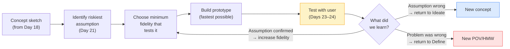

# Day 19 — What Is a Prototype?

> **Today's one idea:** A prototype is a question made tangible — it exists to generate learning, not to demonstrate a finished solution.
> **Reading time:** ~38 min · **Prereqs:** Days 3, 18
> **Primary source for today:** Knapp, Jake, John Zeratsky, and Braden Kowitz. *Sprint.* Simon & Schuster, 2016. Chapter 8, "Wednesday: Prototype," pp. 167–191.
> **Before you start:** Recall Day 18's load-bearing idea — one sentence, no looking. *What are the two tools used in convergence, and what does each one do?*

---

## The hook *(spaced callback to Day 13 — the POV statement)*

In 1969, a surgeon named Denton Cooley implanted the world's first total artificial heart in a patient. The device kept the man alive for 64 hours until a donor heart became available. It was made largely from parts sourced from a dental drill supplier and a toy manufacturer's catalogue.

It was not a finished product. It was a question made physical: *can a mechanical pump keep a human alive long enough for a transplant?*

The answer was yes. The device was ugly, improvised, and not remotely ready for widespread use. But it answered the question — and that answer changed cardiac surgery.

This is what a prototype is: the cheapest possible artifact that answers the most important open question about your concept. Not the cheapest possible finished product. Not the most polished demo. The minimum necessary to get an answer.

Now consider the typical product team. They spend 6 weeks building a high-fidelity, click-through Figma prototype. They present it to users in a usability test. The feedback they get is: "I like the colors," "the font is hard to read," and "I'm not sure I'd use this feature."

They have paid six weeks of design time to learn almost nothing about whether their concept addresses the user's real need — because the users were reacting to the aesthetics of a near-finished product, not to the underlying idea.

---

## Building the intuition

A prototype exists on a spectrum of fidelity. Fidelity is not a quality dimension — it is a precision-of-question dimension. Higher fidelity answers more precise questions. Lower fidelity answers broader questions faster.

```
Low fidelity ◄────────────────────────────────► High fidelity
Paper sketch     Storyboard     Wireframe     Figma     Coded MVP
     │                │               │          │           │
Fast, cheap      Tests concept   Tests flow   Tests UI   Tests build
Answers:         direction       logic        detail     feasibility
"Is this the     "Does this      "Can users   "Do users  "Does this
right idea?"     story make      navigate     like how   actually
                 sense?"         it?"         it looks?" work?"
```

The key insight: **you should use the lowest fidelity that answers your current question.** If you don't yet know whether your concept is the right idea, a paper sketch gives you that answer faster and cheaper than a Figma prototype. If you already know the concept is right and you're testing navigation flow, a wireframe is appropriate.

Most teams default to high fidelity too early — because it looks impressive, because it signals effort, because it feels more "real." This is exactly backwards. High fidelity early means:
- Users react to aesthetics rather than concept
- The team is emotionally invested (sunk cost) and less willing to discard
- The iteration cycle is slow because changing a coded prototype costs time

The DT principle: **build to learn, not to impress.** The prototype is a research instrument, not a product.

**What makes something a prototype (vs. a product)?**

A prototype has three properties:

1. **It is disposable.** If a user's feedback means you should throw it away, you should be able to do so without pain. If discarding it would hurt, the prototype is too finished.

2. **It tests one question.** A prototype that tests "everything" tests nothing precisely. Every prototype should have a specific hypothesis: "We believe that users will trust the medication record more if they can see the timestamp of the last update." The prototype exists to confirm or deny that belief.

3. **It is faster to make than to argue about.** If your team has spent more than 30 minutes debating whether an idea would work, you have waited too long to prototype. "Let's build it and see" should be the answer to most debates in the early loops of DT.

---

## The formal picture

**Five prototype types by question answered:**

| Prototype type | What it is | Question it answers | Time to build |
|---------------|-----------|---------------------|---------------|
| **Paper sketch** | Hand-drawn screens or flows on paper | "Is this concept broadly the right direction?" | 5–30 min |
| **Storyboard** | 6–8 panel comic strip of the user's experience with the concept | "Does the before/during/after story of using this make sense?" | 30–60 min |
| **Role-play / service prototype** | Team members act out the service interaction (one plays the user, one plays the system) | "What does the human-to-human version of this experience feel like?" | 15–30 min to set up |
| **Wireframe / click-through** | Low-fidelity digital screens, linked to show navigation | "Can users find their way through the intended flow?" | 2–4 hours |
| **Façade prototype** | Looks real on the surface (finished UI) but has no back-end; often manually operated by a team member ("Wizard of Oz") | "Will users engage with this concept as if it were real?" | 4–8 hours |

The Wizard of Oz prototype deserves special attention: you present what looks like a working product, but a human behind the scenes is manually fulfilling the "system" responses. This lets you test whether users value a concept *before* building the technology. Amazon tested their one-click ordering concept with manual order processing before automating it. IDEO tested a medical device interface with a human operating the back-end before any hardware was built.

**The prototype loop:**



---

## Where it breaks / what it is not

**A prototype is not an MVP.** An MVP (minimum viable product) is a shippable product with the minimum features to satisfy early customers. It is a delivery concept. A DT prototype is a learning concept — it may never be shipped, and that is fine. The two exist in different phases of product development: DT prototypes are upstream of MVP decisions.

**"This needs to look real to be useful" is usually wrong.** Users adapt to low-fidelity prototypes remarkably well when you brief them correctly: "This is a rough sketch of an idea — imagine it as a finished product and tell me how you'd react." Research consistently shows that paper prototypes surface the same usability issues as high-fidelity prototypes at a fraction of the cost. The exception: when you are testing aesthetic judgment or emotional response (e.g., does this feel trustworthy?), fidelity matters.

**"We can't prototype a service."** Yes you can — role-play is a service prototype. Two team members act out the interaction: one is the user, one is the system/staff member. Five minutes of role-play reveals more about a service concept than three hours of whiteboarding.

**A prototype without a hypothesis is a demo.** If you cannot write down, before showing the prototype to a user, what you believe they will do and what you will learn from their reaction, you have built a demo. Demos are for communicating. Prototypes are for learning. The difference is the hypothesis.

---

## Try it yourself

> **Close this page before attempting Exercise 1.**

**Exercise 1 — Retrieval.** Without looking: what are the three properties that make something a prototype (rather than a product)? Then state the one-sentence principle that should determine what fidelity level to choose.

<details>
<summary>Compare to this</summary>

**Three properties:** (1) Disposable — you can discard it without pain if the learning says to; (2) Tests one question — it has a specific hypothesis, not a "let's see what they think" brief; (3) Faster to make than to argue about — if debate has gone on longer than building would take, you've waited too long. **Fidelity principle:** use the lowest fidelity that answers your current question. Higher fidelity is only justified when lower fidelity can no longer generate the learning you need.
</details>

---

**Exercise 2 — Direct application.** Your team has this concept: *"A weekly digest email that surfaces the three most important decisions made across a PM's Slack channels, summarized in plain language."* Write a prototype hypothesis and choose the right prototype type.

Format:
- **We believe that:** [what users will do or feel]
- **When we show them:** [the prototype]
- **We will learn:** [what the result tells us]
- **Prototype type:** [name it and justify in one sentence]

<details>
<summary>A strong answer</summary>

**We believe that:** PMs will find a three-item decision summary sufficient to stay informed without feeling like they need to read every Slack thread.
**When we show them:** A manually produced email — we literally write the digest ourselves this week for five PMs, picking three decisions from their Slack channels by hand.
**We will learn:** Whether three items is the right number, whether our summary language captures the right level of detail, and whether PMs actually read and act on it vs. archive it.
**Prototype type:** Façade / Wizard of Oz — we simulate the automated product manually. This costs one person ~1 hour per week for a week, vs. weeks of engineering time to build the real email pipeline. If no one reads the manual email, we have not built anything that needs to be thrown away.
</details>

---

**Exercise 3 — Stretch.** A teammate says: "We should build a Figma prototype before user testing — otherwise users won't take it seriously." Using today's concepts, construct a two-part response: (a) when they are right, and (b) when they are wrong, with a specific example for each.

<details>
<summary>The two-part response</summary>

**(a) When they are right:** If the question being tested is about the *emotional response* to the design — does this feel trustworthy? professional? easy? — then low-fidelity paper will undermine the test, because users will be reacting to the roughness of the paper, not the concept. Also right if users are evaluating a specific UI interaction (e.g., a novel gesture or an unusual navigation pattern) that simply cannot be simulated on paper. In these cases, higher fidelity is justified because it tests a question that lower fidelity cannot answer.

**(b) When they are wrong:** If the question being tested is whether the *concept* addresses the user's need — is this the right thing to build at all? — then a paper sketch is entirely sufficient. Users adapt to low fidelity very well when briefed correctly ("imagine this is a finished product"). The six weeks of Figma time has been spent answering an aesthetic question when the strategic question (is this the right concept?) is still unanswered. A 30-minute paper prototype session would have answered the strategic question first, before any design investment was made.
</details>

---

**Transfer — apply it:**

> Name a feature your team recently debated for more than two meetings without resolution. Write a one-sentence prototype hypothesis for it. What is the cheapest artifact that could test that hypothesis this week?

---

## Connect it back

Today reframed the prototype from "a demo of a solution" to "a question made tangible." The five prototype types give you a menu matched to the question you need to answer. Tomorrow you go hands-on with the most underused and most powerful of those types: low-fidelity paper prototyping, role-plays, and storyboards.

**Sharp question you should be able to answer now:** What is the difference between a prototype and a demo — and why does that difference determine whether you learn anything from showing it to a user?

---

## Suggested readings for today

**Required if you have 15 extra minutes:**
Knapp, Jake, John Zeratsky and Braden Kowitz, *Sprint* (Simon & Schuster, 2016), Chapter 8 "Wednesday: Prototype," pp. 167–191. Knapp's "prototype mindset" section (pp. 168–175) is the clearest articulation of the "build to learn, not to impress" principle available in print.

**Free video — watch today:**
IDEO U, *"What Is Prototyping in Design Thinking?"* — Search YouTube: `IDEO prototyping design thinking what is`. ~5 min. IDEO's own short definition with real project examples — reinforces today's reframe.

**Free video — companion:**
Stanford d.school, *"Prototype to Test"* — Search YouTube: `Stanford d.school prototype to test`. ~6 min. The d.school's treatment of the prototype-as-learning-instrument framing, including the disposability principle.

**If you want the deep version:**
Brown, Tim, *Change by Design* (HarperBusiness, 2009), Chapter 3 "Building to Think," pp. 71–90. Brown's narrative of IDEO prototyping culture — the stories here make the disposability principle feel natural rather than counterintuitive. Reading time: ~35 additional minutes.

---

## Navigation

← **Previous:** [Day 18 — Selecting and Clustering Ideas](../../04-ideate/days/day-18-selecting-and-clustering-ideas.md)
→ **Next:** [Day 20 — Low-Fidelity Prototyping](./day-20-low-fidelity-prototyping.md)
