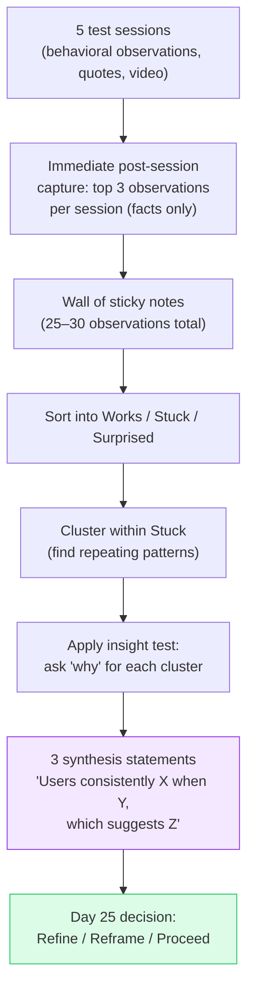

# Day 24 — Capturing and Synthesizing Test Feedback

> **Today's one idea:** What you hear in a test session is raw data — turning it into a decision is synthesis again, using the same skill you built in Module 03.
> **Reading time:** ~38 min · **Prereqs:** Days 22–23
> **Primary source for today:** Stanford d.school, *Design Thinking Bootcamp Bootleg*, 2018, pp. 35–40. Free PDF at dschool.stanford.edu/resources.
> **Before you start:** Recall Day 23's load-bearing idea — one sentence, no looking. *What makes a user test an experiment rather than a demo — name the key structural element.*

---

## The hook *(spaced callbacks to Day 12 — insight, and Day 9 — empathy map)*

After five test sessions, your team has:
- 12 pages of handwritten notes
- Observations like: "User clicked Archive three times," "User said 'I don't know what this does,'" "User abandoned at Step 4," "User seemed excited when they found the search bar"
- Two videos nobody has watched yet
- Four slightly different opinions about what "went well"

Sound familiar? It should. This is the same situation you were in after empathy research — before you had an empathy map and a synthesis process.

The synthesis problem in testing is identical to the synthesis problem in empathy research:
- Raw data is fragmented across people and media
- The team has different interpretations of the same observations
- The most important signal is buried in the noise
- You need to go from "what happened" to "what it means" before you can decide what to do next

Today's tool is a direct application of Day 12's synthesis process — but applied to test data instead of empathy data. The cognitive move is the same. The stakes are slightly higher: the output is a decision, not just an insight.

---

## Building the intuition

Test synthesis happens in two steps: **capture** (during and immediately after sessions) and **synthesize** (across sessions, to find patterns).

**Capture — during and after each session:**

The note-taking role during the test session (Day 23) produces raw observations. After the user leaves, the facilitator and note-taker have 5–10 minutes while the session is fresh. In that window, do one thing: each person independently writes their top 3 observations on sticky notes — one observation per note, behavioral, no interpretations.

The rule: **capture facts before interpretations**. "User paused at the Archive button for 8 seconds before clicking" is a fact. "User was confused by Archive" is an interpretation. Facts go on the wall immediately. Interpretations wait for the synthesis step.

**Synthesize — across sessions, to find patterns:**

After all five sessions, you have a wall of sticky notes from all participants. Now run a modified affinity mapping process:

**Step 1 — Categorize by sentiment (not by theme):** First pass — sort observations into three columns:
- **Works** (user succeeded, felt positive, acted as expected)
- **Stuck** (user hesitated, failed a task, expressed confusion)
- **Surprised** (user reacted in a way you didn't predict — positive or negative)

**Step 2 — Find patterns within columns:** Within the "Stuck" column, cluster similar observations. If three out of five users got stuck at the same step, that is a pattern — not a coincidence.

**Step 3 — Apply the insight test:** For each "Stuck" cluster, ask: why did users get stuck here? Is there a root cause that reframes the problem? This is Day 12's synthesis move applied to test data.

**Step 4 — Write 3 synthesis statements:** "Users consistently [behavior] when [trigger], which suggests [implication for the design/concept]."

These three statements are the output of synthesis — the actionable findings that feed Day 25's decision.

---

## The formal picture

**The test debrief grid (Sprint method):**

Knapp's team uses a simple grid during live observation. Four columns: five users as rows. For each user, note:

| | User 1 | User 2 | User 3 | User 4 | User 5 |
|--|--------|--------|--------|--------|--------|
| **Completed task 1?** | ✓ | ✗ | ✓ | ✓ | ✗ |
| **Completed task 2?** | ✓ | ✓ | ✓ | ✗ | ✓ |
| **Key quote** | "I'd check this daily" | "Where does it go?" | — | "Feels like email" | "Too many steps" |
| **Biggest surprise** | Found search first | Abandoned at step 2 | Reordered steps | Didn't use tags | Tried to edit after submit |

This grid, filled in for all five users, makes patterns visible at a glance. Three out of five failing Task 2 is a clear signal. Patterns matter; individual reactions are noise.

**The full capture-to-synthesis flow:**

**What "synthesis statement" looks like:**

| Raw observations | Synthesis statement |
|-----------------|---------------------|
| Three users paused at "Archive"; two said they expected "Delete" | "Users consistently expect permanent deletion rather than archiving when they see a removal action, which suggests our mental model of 'preserve vs. delete' is not shared with users — the label and behavior need realignment." |
| All five users searched for their name in the directory before any other action | "Users consistently orient to themselves first when entering a new collaborative tool, which suggests an 'onboarding to self' flow (profile setup, personal defaults) would reduce disorientation and should precede discovery of others." |

Each synthesis statement contains: the pattern (consistently X), the trigger (when Y), and the implication (which suggests Z). The implication is always a direction — not a solution, but a pointer.

---

## Where it breaks / what it is not

**One user's strong reaction is not a pattern.** If User 3 loved the concept and Users 1, 2, 4, 5 were neutral, User 3 is an outlier. Outliers are worth noting — they sometimes reveal an edge case worth exploring — but they should not drive the synthesis. Patterns (3 out of 5 or stronger) drive synthesis.

**Positive observations need synthesis too.** The "Works" column is not just a score — it is evidence about what the concept's strengths are. Synthesize the Works column: what specifically worked, for which users, under which conditions? This feeds the "preserve" decisions in Day 25's iteration.

**Don't synthesize alone.** The same reason you build the empathy map as a team applies here: different observers saw different things, and the synthesis is richer when multiple perspectives engage with the same wall of notes. Run the synthesis session with your full team within 24 hours of the last test session — memory degrades fast.

**Video is not a substitute for real-time notes.** Many teams record sessions and plan to watch later. In practice, "later" often doesn't happen — or happens too late for the learning to influence the next iteration. Take notes in real time; treat video as a backup, not a primary record.

---

## Try it yourself

> **Close this page before attempting Exercise 1.**

**Exercise 1 — Retrieval.** Without looking: what are the two steps of test synthesis, and what is the single rule that applies during the "capture" step?

Compare to this

**Two steps:** (1) Capture — during and immediately after each session, record behavioral facts before interpretations (top 3 observations per session on sticky notes). (2) Synthesize — across all sessions, sort observations by Works/Stuck/Surprised, find patterns in the Stuck column, ask "why" to find root causes, and write 3 synthesis statements. **Rule during capture:** facts before interpretations. "User paused for 8 seconds" is a fact. "User was confused" is an interpretation. Only facts go on the wall.

---

**Exercise 2 — Direct application.** Here are 10 raw observations from a 5-user test of a "daily decision log" prototype. Sort them into Works / Stuck / Surprised, then write one synthesis statement from the pattern you see in Stuck.

Observations:
1. U1: Searched before entering anything — found the search bar immediately
2. U2: Tried to tag the decision *after* submitting — said "can I edit this?"
3. U3: Asked "where does this go — who sees it?" before adding any content
4. U4: Completed all tasks; said "this is basically what I do in Notion already"
5. U5: Abandoned at the "add tags" step; said "I don't know what tags to use"
6. U1: "I'd use this instead of my notebook"
7. U2: Tried to type the project name as a tag — didn't find autocomplete
8. U3: Completed task 1 after asking "so this is just for me?"
9. U4: Skipped the tags entirely and went straight to the description field
10. U5: Navigated to a past decision using search — said "oh this is nice"

Sort + synthesis statement

**Works:** 1 (search found immediately), 6 (positive intent), 8 (completed after clarification), 10 (search navigation praised)

**Stuck:** 2 (post-submit edit — tagging timing), 5 (abandoned at tags — no guidance), 7 (autocomplete not found — tag UX), 9 (skipped tags entirely)

**Surprised:** 3 (privacy question — didn't expect to ask this), 4 (already has an equivalent tool — competitive context)

**Pattern in Stuck:** Four out of five users experienced friction around the tagging step — either couldn't figure out *when* to tag (before or after submitting), didn't know *what* tags to create, or skipped tags entirely.

**Synthesis statement:** "Users consistently experience the tagging step as a barrier rather than a benefit — they don't know what tags to use, when to apply them, or whether the system provides guidance — which suggests that free-form tagging without scaffolding creates cognitive overhead that interrupts the main task (recording the decision). The tagging system either needs pre-populated smart suggestions or should be deferred to after submission as an optional enrichment step."

---

**Exercise 3 — Stretch (spaced callbacks from Day 12 and Day 9).** The synthesis process in testing is described as "the same cognitive move" as the synthesis process in empathy research (Day 12). But there is one important difference in what the synthesis *outputs*. What is it — and why does that difference matter for the decision that comes after?

The difference

In empathy research (Day 12), synthesis outputs an **insight** — a surprising pattern that reframes the problem. The insight feeds a POV statement and a HMW question. In testing, synthesis outputs a **synthesis statement** — a behavioral pattern with a design implication. The synthesis statement feeds a *decision*: refine, reframe, or proceed (Day 25).

The difference matters because the type of action is different. An insight from empathy research is expansive — it opens the problem space. A synthesis statement from testing is convergent — it closes a loop: "this specific thing either works or doesn't, and here is what to do about it." The same cognitive machinery (pattern recognition + "why" questioning) is applied, but the purpose is different: one generates a design challenge, the other resolves one.

---

**Transfer — apply it:**

> After your next team meeting where a product decision is discussed, write three behavioral observations from the conversation using the "facts before interpretations" rule. Then identify any pattern across the three that would generate a synthesis statement.

---

## Connect it back

Day 23 built the test session structure. Day 24 built the synthesis process that converts five sessions of raw notes into three actionable statements. Tomorrow, those statements feed the hardest judgment call in the course: given what you learned, should you refine the solution, reframe the problem, or proceed to build?

The loop is almost closed.

**Sharp question you should be able to answer now:** After five test sessions, you have 28 sticky notes. Three users got stuck at the same step; two sailed through. What specifically makes that pattern a synthesis-worthy signal — and what question do you ask to generate the synthesis statement from it?

---

## Suggested readings for today

**Required if you have 15 extra minutes:**
Stanford d.school, *Design Thinking Bootcamp Bootleg* (2018), pp. 35–40. The d.school's debrief process — their version of the Works/Stuck/Surprised sort and the synthesis question protocol. Free PDF at dschool.stanford.edu/resources.

**Free video — watch today:**
NNgroup, *"Analyzing Usability Testing Data"* — NNgroup YouTube channel. Search YouTube: `NNgroup analyzing usability testing data`. ~8 min. Covers the pattern-finding step with a worked example — directly complements today's synthesis process.

**Free video — companion:**
AJ&Smart, *"How to Synthesize Design Sprint Results"* — Search YouTube: `AJ Smart synthesize design sprint results`. ~7 min. AJ&Smart's practical version of the Sprint debrief process — note-taking grid and the pattern-to-decision bridge.

**If you want the deep version:**
Portigal, Steve. *Interviewing Users: How to Uncover Compelling Insights.* Rosenfeld Media, 2013. Chapter 7 "Making Sense of Your Data." Portigal's treatment of the analysis-to-insight step is the most rigorous available for qualitative research synthesis. Reading time: ~45 additional minutes. Recommended if the synthesis step from Day 12 felt like the hardest part of the course.

---

## Navigation

← **Previous:** [Day 23 — User Testing Fundamentals](./day-23-user-testing-fundamentals.md)
→ **Next:** [Day 25 — Iteration: When to Pivot vs. Persevere](./day-25-iteration-pivot-vs-persevere.md)
