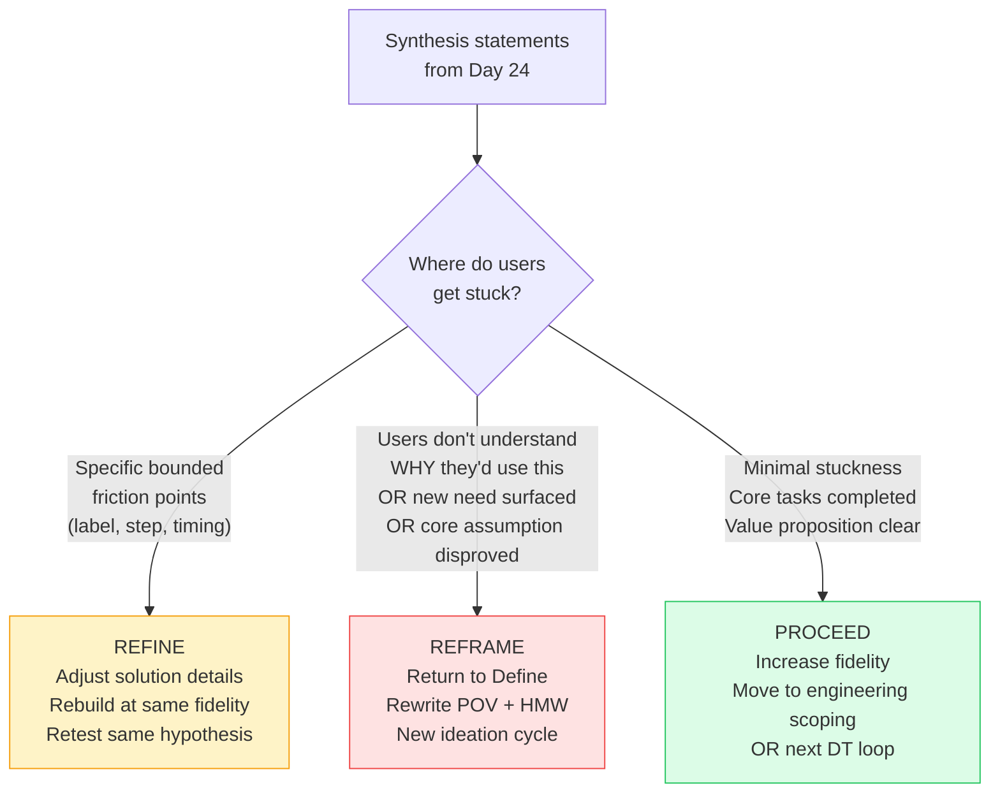

# Day 25 — Iteration: When to Pivot vs. Persevere

> **Today's one idea:** After testing, you have exactly three choices — refine the solution, reframe the problem, or proceed — and the synthesis statements from Day 24 tell you which one.
> **Reading time:** ~38 min · **Prereqs:** Days 22–24
> **Primary source for today:** Liedtka, Jeanne. "Why Design Thinking Works." *Harvard Business Review*, vol. 96, no. 5, September–October 2018, pp. 72–79.
> **Before you start:** Recall Day 24's load-bearing idea — one sentence, no looking. *What are the two steps of test synthesis, and what does each one produce?*

---

## The hook *(spaced callback to Day 5 — wicked problems)*

In 2010, a team at a major hospital used Design Thinking to redesign the patient discharge process. They built a prototype, tested it with five patients, and synthesized their findings. The results were mixed:

- 4 out of 5 patients completed the simulated discharge checklist successfully ✓
- But 3 out of 5 said they felt "lost" once they left the hospital — even with the checklist ✓

The team faced the iteration decision.

A short-sighted reading: the checklist worked (4/5 completion). Ship it.

A deeper reading: the emotional signal — "felt lost" — pointed somewhere the checklist didn't reach. The synthesis statement: "Patients consistently feel disoriented after leaving the hospital even when they successfully completed discharge steps, which suggests the problem is not about information delivery during discharge but about the absence of a trusted human contact point after discharge."

That synthesis statement points unmistakably to **Reframe** — back to Define. The POV was wrong. The problem wasn't "patients need a better checklist." The problem was "patients need a specific person they can call in the 72 hours after discharge." The solution space (checklist design) was the wrong space entirely.

The team rewrote their POV, generated new HMW questions, and ultimately built a post-discharge nurse hotline that reduced readmissions by 30%.

If they had shipped the checklist, they would have optimized the wrong solution to the wrong problem.

---

## Building the intuition

After every test cycle, one of three things is true about your concept:

**Option 1: Refine** — the concept is fundamentally right, but specific details failed. Users understood the value, completed most tasks, and the synthesis statements point to fixable friction: a label that needs changing, a step that needs reordering, a piece of information that needs to be surfaced earlier. The POV still holds; the HMW still holds; only the solution details need adjustment.

**Signal:** Users got stuck in specific, bounded places but recovered. The overall narrative of the experience made sense. Positive reactions outweigh stuckness. The synthesis statements say: "Users consistently struggled with X, which suggests Y" — where Y is a design change, not a problem reframe.

**Option 2: Reframe** — users engaged with the prototype but the concept didn't address what they care about. The solution failed not because it was badly designed but because it was solving the wrong problem or targeting the wrong user. Go back to Define (rewrite the POV) or back to Empathize (you need more research on a different user segment).

**Signal:** Users completed tasks but expressed confusion about *why* they would use this. Or: a new and important need surfaced during testing that your POV never anticipated. Or: a key assumption (from Day 21's assumption map) was definitively disproved. The synthesis statements say: "Users consistently [did X] which suggests [the problem is actually Y, not the problem we designed for]."

**Option 3: Proceed** — the riskiest assumptions were confirmed. Users engaged with the concept, completed tasks, expressed genuine intent to use it. The synthesis statements say: "Works" dominates the sort; "Stuck" items are minor and known. You have enough evidence to increase fidelity — move to a higher-fidelity prototype or to engineering scoping.

**Signal:** 4–5 out of 5 users completed the core task without facilitator help. The concept's value proposition was understood without explanation. Users asked "when can I use this for real?"

---

## The formal picture

**Decision framework — reading your synthesis statements:**

**The three-question test:**

Before making the decision, ask these three questions about your synthesis statements:

1. **Did users understand the value proposition without being told?** If no → Reframe (the POV's insight wasn't compelling enough to make the concept self-evident).

2. **Did stuckness happen in bounded, fixable places — or at the core interaction?** If the core interaction failed → Reframe or deeper Refine. If friction was peripheral → Refine.

3. **Was the riskiest assumption confirmed or denied?** If denied → Reframe or Refine depending on severity. If confirmed → Proceed or Refine details.

**How many iterations before proceeding?**

At L1 practitioner level: 1–3 iterations is the norm for a well-scoped concept. If you are in your fourth iteration and still Reframing, the problem is almost certainly that the original Empathize phase was insufficient — you are discovering, in the Prototype loop, what should have been discovered in user interviews. The solution is to return to Empathize with a sharper research question.

**The relationship to Agile:**

Once you Proceed from the DT loop, you carry three things into Sprint 0 / backlog seeding:
- The validated POV (who you're designing for and why)
- The confirmed HMW (the design challenge)
- The tested concept sketch (what the solution looks like in rough form)

These three items replace assumptions in the backlog. User stories written from validated DT output are dramatically more reliable than user stories written from PM intuition.

---

## Where it breaks / what it is not

**Reframing is not failure.** The team that rebuilt the discharge experience created a 30% readmission reduction. The team that shipped the checklist would have shipped a product that did almost nothing. Reframing is the DT loop working correctly. It is expensive only if you treat it as failure and rush past it.

**"Proceed" does not mean "done."** Proceeding from the DT loop means increasing fidelity and moving toward engineering — not closing the feedback cycle permanently. DT loops should recur at every major product decision point: new features, new user segments, new market entry. A single DT loop is a starting point, not a final answer.

**Don't Refine endlessly.** If you have run three Refine cycles and the same stuckness reappears in slightly different form, the problem is likely architectural — a POV that is subtly wrong, or a HMW that is still too narrow. Three consecutive Refine iterations with no improvement is a signal to Reframe.

**The decision belongs to the team, not to the data.** Data is never so clean that it makes the decision for you. Three out of five users completing the core task successfully — is that enough to Proceed? It depends on the stakes, the cost of being wrong, the quality of the user recruitment, and the team's risk tolerance. The framework guides; it does not decide.

---

## Try it yourself

> **Close this page before attempting Exercise 1.**

**Exercise 1 — Retrieval.** Without looking: name the three post-test options and give the primary signal (one sentence each) that tells you which one to choose.

Compare to this

**Refine** — signal: users got stuck in specific, bounded, fixable places but the overall concept was understood and valued. **Reframe** — signal: users didn't understand why they would use the concept, or a core assumption was disproved, or a new important need surfaced that the POV never anticipated. **Proceed** — signal: the riskiest assumption was confirmed, users completed core tasks without help, and the value proposition was understood without explanation.

---

**Exercise 2 — Direct application.** Here are three synthesis statements from a test of a "decision log" prototype. For each one, decide: Refine, Reframe, or Proceed — and explain your reasoning in two sentences.

1. *"Users consistently navigated to the search bar first, found their past decisions without difficulty, and expressed genuine intent to use the tool daily — the core retrieval value proposition was understood without prompting."*

2. *"Users consistently added decisions to the log but never revisited them — when asked why they'd use the tool, three out of five said 'to feel like I'm being organized' rather than to actually find decisions later — which suggests the value is performative rather than functional."*

3. *"Users consistently found the tagging interface confusing — three out of five skipped or abandoned tags, but all five completed the core task of recording and retrieving a decision — which suggests tagging is optional friction, not a core failure."*

Decisions and reasoning

1. **Proceed.** The primary value proposition (retrieval of past decisions) was confirmed by behavior (navigated to search first, completed without help) and by stated intent (daily use). This synthesis statement shows the riskiest assumption confirmed. Increase fidelity — move to a higher-fidelity wireframe or engineering scoping.

2. **Reframe.** This is the clearest Reframe signal possible: users understand *how* the tool works but not *why they'd need it for real outcomes*. "To feel organized" is a performative need, not a functional one — it doesn't generate daily retention behavior. The POV's need clause ("needs to maintain a reliable, current picture of what was actually decided") assumed users have a functional retrieval need. This test suggests many users don't feel that pain acutely enough to change behavior. Return to Empathize: find the 20% of users for whom the retrieval pain is acute and functional, and rebuild the POV around them.

3. **Refine.** The core task was completed (5/5); the retrieval value was confirmed. The tagging friction is a specific, bounded, fixable problem — not a conceptual failure. In the next iteration: remove required tagging or add smart auto-tag suggestions. Keep the same prototype fidelity; retest with the same hypothesis to confirm the fix.

---

**Exercise 3 — Stretch.** A team is in their third Refine iteration. Each time they test, the same "Stuck" pattern appears at the same step, slightly improved but not resolved. Using today's framework and Day 5's concept of wicked problems, explain in three sentences why repeated Refine cycles without resolution is a signal to Reframe — not a signal to Refine harder.

The argument

Wicked problems resist definitive formulation — which means a problem that keeps reappearing in slightly different form despite solution changes is likely a problem with the problem statement, not with the solution details. In DT terms: if the stuckness persists across three Refine iterations, the POV or HMW may be framing the problem in a way that makes it unsolvable at the solution level — the root cause is being addressed at the wrong level of abstraction. Reframing forces the team to ask "why does this step keep failing?" rather than "how do we make this step better?" — and the answer to the first question usually reveals a design challenge that the current POV never acknowledged.

---

**Transfer — apply it:**

> Think of a product feature your team has iterated on more than twice without the core issue resolving. Apply the three-question test from today: did users understand the value proposition? Was stuckness bounded or at the core? Was the riskiest assumption confirmed? Based on your honest answers, should the next move be Refine, Reframe, or Proceed?

---

## Connect it back

Module 06 is complete. The full DT loop is now yours: Empathize → Define → Ideate → Prototype → Test → decide → repeat. The final module (Days 26–28) does three things: connects this loop to your Agile practice, gives you a runnable mini-sprint skeleton, and puts everything in your hands with the capstone.

**Sharp question you should be able to answer now:** A team ships a product feature after one round of testing because "most users completed the task." Two months later, retention of that feature is near zero. Which of today's three signals did they likely misread — and what should they have done instead?

---

## Suggested readings for today

**Required if you have 15 extra minutes:**
Liedtka, Jeanne, "Why Design Thinking Works," *Harvard Business Review*, vol. 96, no. 5, September–October 2018, pp. 72–79. The section "Bridging the Knowing–Doing Gap" (roughly pp. 76–78) addresses the iteration decision directly — Liedtka's framing of "when to persist vs. pivot" is the closest practitioner-level treatment of today's framework. Free with HBR account.

**Free video — watch today:**
IDEO U, *"Iterate and Improve Your Prototype"* — Search YouTube: `IDEO iterate improve prototype design thinking`. ~5 min. IDEO's short treatment of the iteration decision with a product example.

**Free video — companion:**
Ash Maurya (author of *Running Lean*), *"How to Pivot vs. Persevere"* — Search YouTube: `Ash Maurya pivot persevere lean`. ~8 min. Maurya's Lean Startup framing of the same decision — useful for contrast with today's DT framing and directly applicable when your DT loop connects to product-market fit questions.

**If you want the deep version:**
Ries, Eric. *The Lean Startup.* Crown Business, 2011. Chapter 8 "Pivot (or Persevere)." Ries's treatment of the pivot decision is the most rigorous available at the product level — it complements DT by applying the same logic to a later stage of the product lifecycle (post-launch behavior, not pre-build research). Reading time: ~40 additional minutes.

---

## Navigation

← **Previous:** [Day 24 — Capturing and Synthesizing Test Feedback](./day-24-capturing-test-feedback.md)
→ **Next:** [Day 26 — DT Inside Agile](../../07-integration-capstone/days/day-26-dt-inside-agile.md)
